

Bioorganic Chemistry

Tymchyshyn V.B.

Lecture 1: This strange quantum world

---

Before Quantum Mechanics

Light = waves in ether
Particles = tiny balls that respect Newton’s laws

Why QM?

Chemical bond is a quantum mechanical effect
Solid bodies cannot exists in classical world (system of charges is unstable due to Earnshaw's theorem)
Tunneling effects observed for enzyme catalysis (https://royalsocietypublishing.org/doi/10.1098/rspa.2018.0037)

---

 {left=21.39 top=22.58 width=70.19 height=70.19}

Charge electroscope, negative charge

---

Shine Light. High intensity,  but low energy for each photon.

 {left=18.31 top=24.65 width=68.03 height=68.03}

---

Shine Light. Low intensity,  but high energy for each photon.

 {left=18.46 top=25.20 width=68.65 height=68.65}

---

Charge electroscope, positive charge

 {left=17.85 top=22.18 width=73.74 height=73.74}

---

Shine Light. Low intensity,  but high energy for each photon.

 {left=18.69 top=23.00 width=70.74 height=70.74}

---

Particles

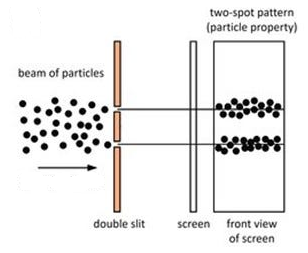 {left=20.47 top=38.35 width=32.08 height=46.85}

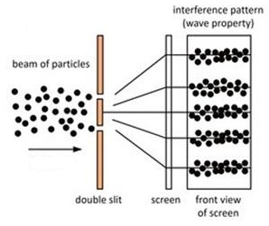 {left=65.38 top=38.53 width=31.04 height=46.48}

Waves? Wave-particles?

Particles have certain wave properties

---

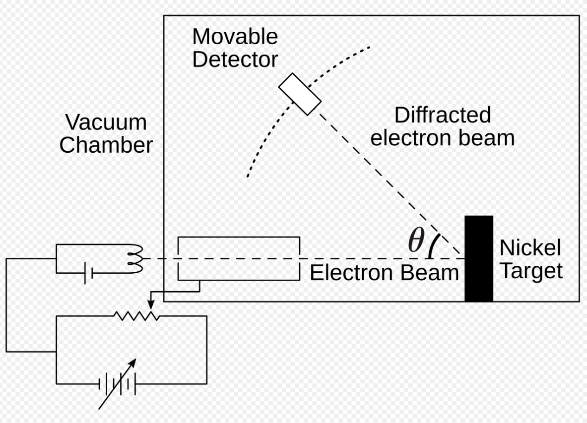 {left=19.70 top=18.78 width=31.13 height=39.90}

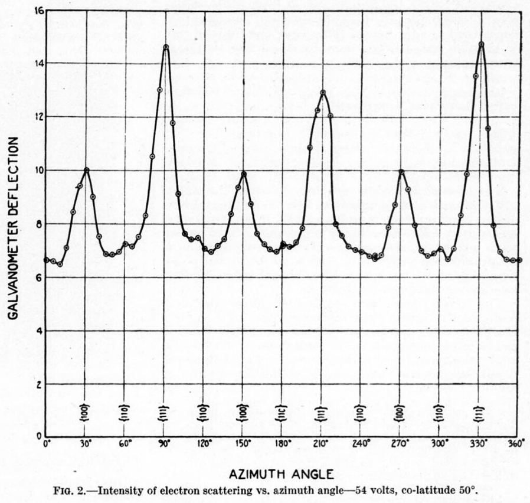 {left=60.43 top=13.75 width=26.48 height=44.66}

The **Davisson–Germer experiment** was an experiment in which electrons, scattered by the surface of a crystal of nickel metal, displayed a diffraction pattern. This confirmed the hypothesis of wave-particle duality.

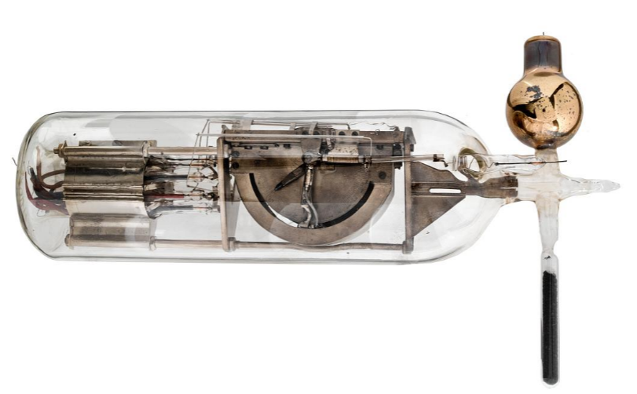 {left=19.29 top=61.65 width=30.37 height=33.42}

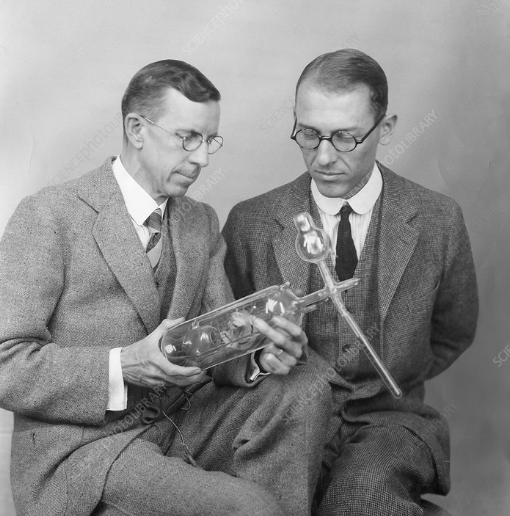 {left=61.95 top=59.64 width=21.34 height=38.39}

---

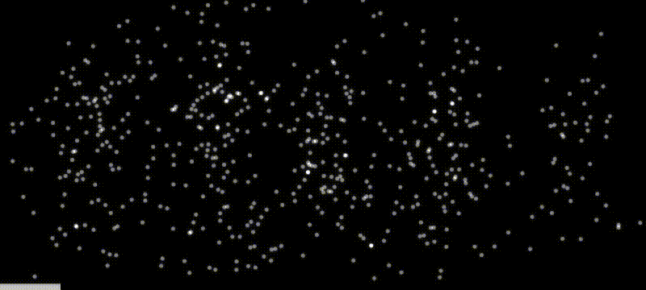 {left=16.67 top=24.33 width=83.33 height=66.67}

Electrons hitting the screen

---

 {left=17.85 top=55.16 width=39.99 height=39.99}

 {left=59.46 top=2.96 width=39.99 height=39.99}

 {left=17.85 top=2.96 width=39.99 height=39.99}

We describe particle with a wave-function. Absolute values squared defines the probability to find the particle somewhere. Wave-function may have nodes where particle cannot be found.

---

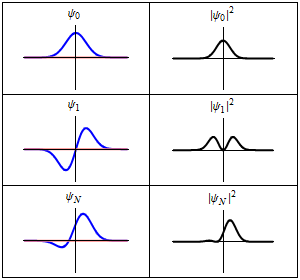 {left=61.53 top=0.00 width=37.82 height=62.75}

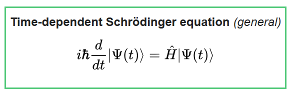 {left=30.83 top=65.93 width=58.19 height=32.60}

 {left=17.82 top=0.00 width=41.90 height=67.73}

---

Key messages:

Wave-particle duality
Unlike classical mechanics we describe particle not with 3 numbers (position),  but with a function defined everywhere in the space.
|𝛹|2 is the probability to find the particle 
𝛹-function oscillates
These oscillations may interfere constructively or destructively,  thus increasing or decreasing the probability to find the particle somewhere.

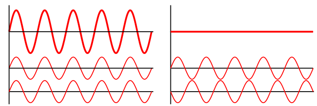 {left=22.91 top=50.27 width=66.67 height=39.63}

---

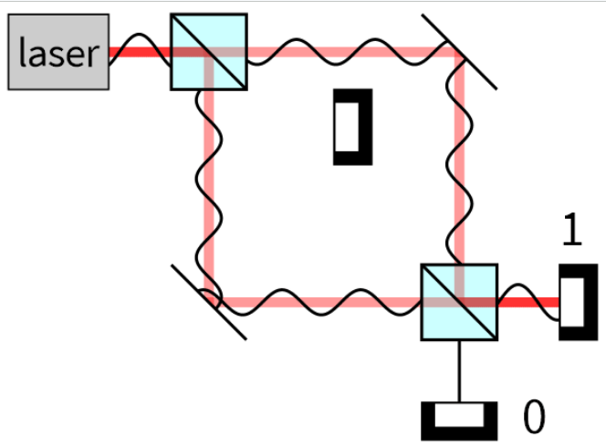 {left=29.56 top=4.72 width=69.17 height=90.56}

Mach-Zehnder interferometer

Note: phase change 90 degrees on reflection, crucial for beam splitters

---

No matter how strange it seems,  but modern lenses use anti-reflective coating based on the same principle. Notice the violet-bluish tint.

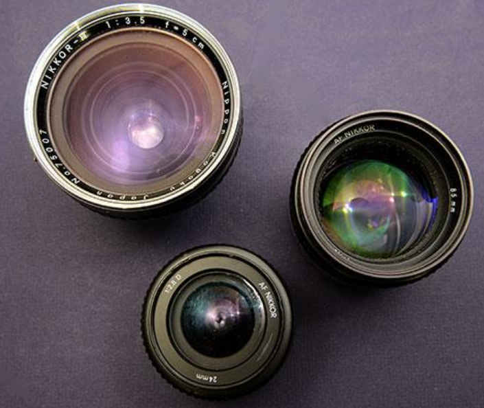 {left=29.71 top=22.46 width=49.24 height=73.76}

---

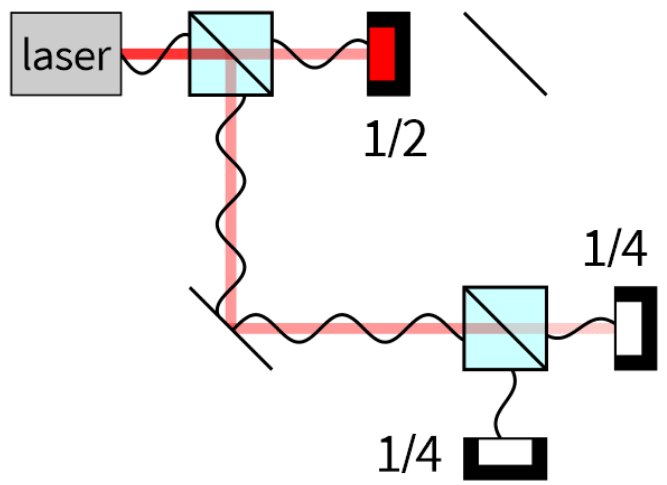 {left=30.52 top=3.78 width=69.48 height=89.81}

---

Elitzur–Vaidman bomb tester

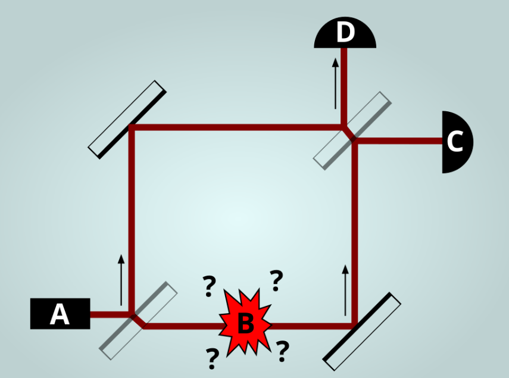 {left=30.02 top=24.10 width=55.86 height=73.76}

---

The **Stern–Gerlach experiment** demonstrated that the spatial orientation of angular momentum is quantized.

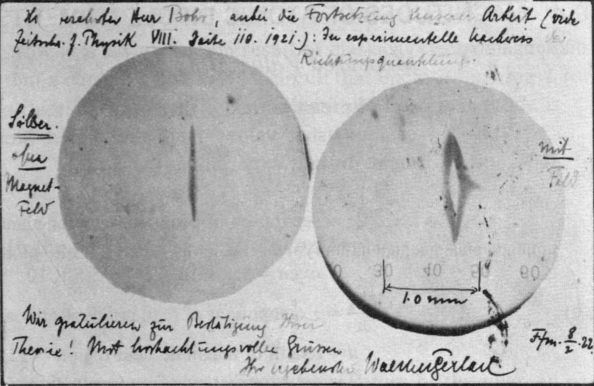 {left=63.79 top=21.51 width=32.34 height=37.36}

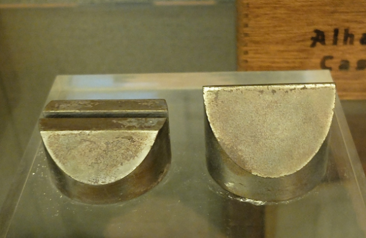 {left=63.86 top=59.92 width=32.26 height=37.36}

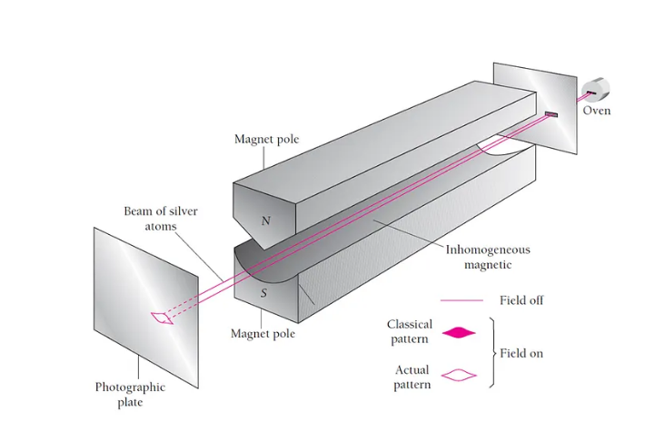 {left=4.33 top=24.50 width=58.56 height=68.03}

Ag

47

---

Magnetic moment is clearly quantized
Rotating S-G device rotates the image: wave function collapses during measurement

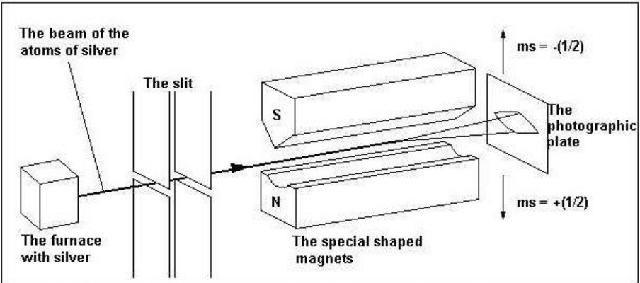 {left=17.65 top=31.11 width=82.35 height=64.78}

---

Key messages:

Particles have certain internal property called “spin”
Spin is quantized
Particles can be divided into bosons (integer spin, example: photon) and fermions (half-integer spin, example: electron, proton, neutron)
Quantum measurement reduces wave function into an eigenstate of measurement operator, eigenvalues is the result of the measurement
We will deal almost exclusively with electrons: these are fermions, have spins +½ and -½ also called “spin up” and “spin down”.

---

 {left=18.06 top=8.64 width=79.65 height=79.65}

---

 {left=16.65 top=5.43 width=83.35 height=83.35}

---

 {left=19.21 top=10.29 width=79.24 height=79.24}

---

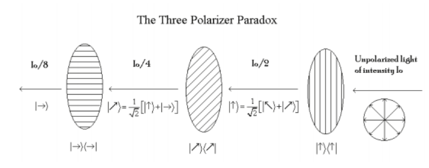 {left=18.23 top=23.45 width=81.77 height=57.11}

---

**ATOM**

---

Hydrogen Atom Model

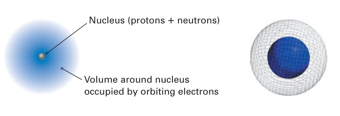 {left=16.07 top=18.75 width=50.93 height=43.15}

 {left=16.07 top=73.48 width=44.02 height=24.66}

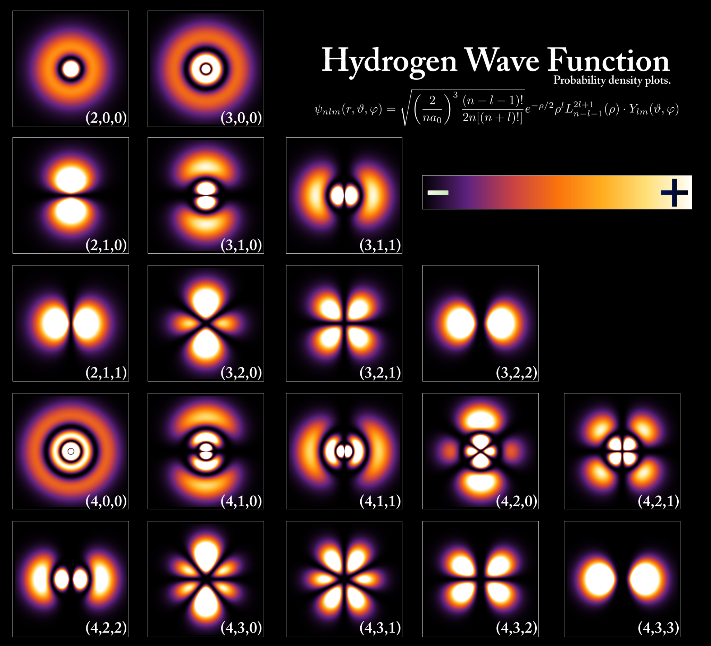 {left=62.36 top=18.75 width=37.64 height=60.85}

---

Energy levels,  hydrogen (and hydrogen-like) atom

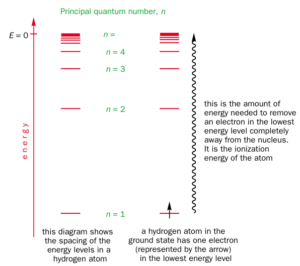 {left=18.62 top=23.55 width=44.63 height=73.76}

**The principal quantum number, n**
Different values for n divide orbitals into groups of similar energies called shells. Numerical values for n are used in ordinary speech.

---

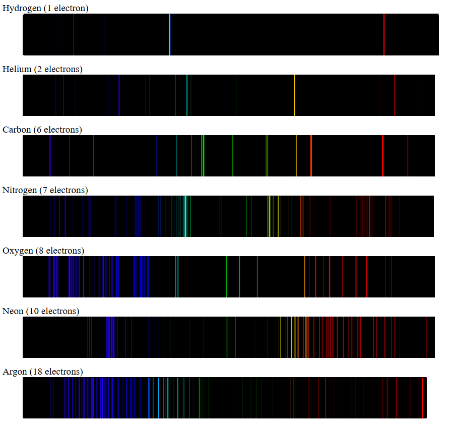 {left=48.94 top=3.62 width=55.80 height=94.07}

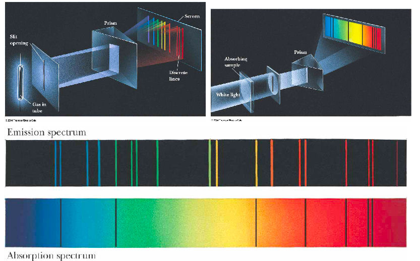 {left=2.22 top=6.08 width=45.61 height=50.42}

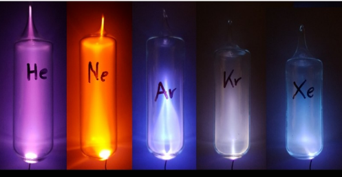 {left=3.57 top=60.25 width=38.10 height=35.17}

---

T**he orbital angular momentum quantum number**, l, determines the angular
momentum of the electron as it moves in its orbital. This quantum number tells us the shape of the orbital, spherical or whatever. The values that l can take depend on the value of n: l can have any value from 0 up to n – 1. The different possible values of l are given
letters rather than numbers and they are called s, p, d, and f.

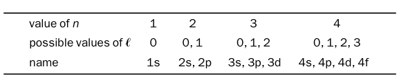 {left=16.07 top=24.65 width=61.46 height=21.67}

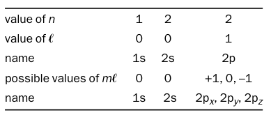 {left=16.07 top=59.96 width=40.52 height=30.56}

The **magnetic quantum number**, ml, determines the spatial orientation of the angular momentum. Its value depends on the value of l, varying from –l to +l. The different possible values of ml are given suffixes on the letters.

Organic chemists are concerned mostly with s and p orbitals

---

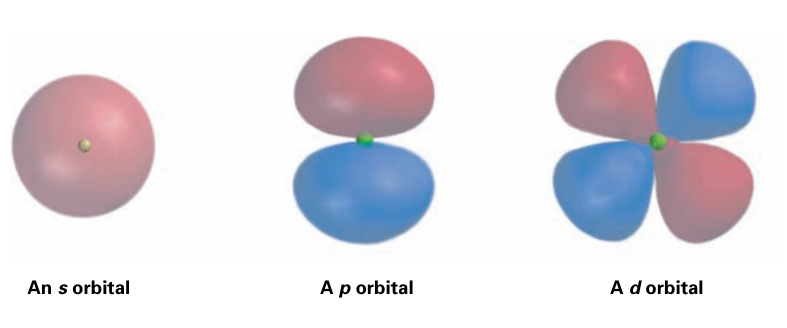 {left=41.42 top=0.82 width=47.36 height=35.09}

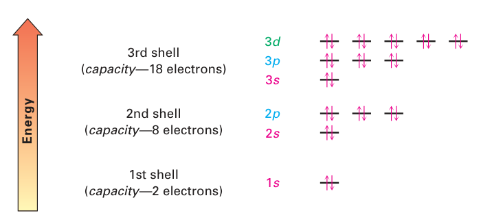 {left=39.79 top=50.00 width=60.21 height=50.00}

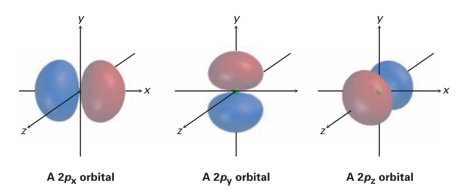 {left=47.08 top=35.91 width=32.69 height=24.58}

**Link:**
<u>https://www.chemtube3d.com/a-level-orbitals-all/</u>

---

**Aufbau principle / ****Madelung rule**
The lowest-energy orbitals fill up first, according to the order 1s -> 2s -> 2p ->
3s -> 3p -> 4s -> 3d. Note that the 4s orbital lies between the 3p and 3d orbitals in energy. (Note: energy grows with n+l and with n if n+l are equal, e.g. 3s = 3+0=3 and 2p=2+1=3, but 2p is lower because 2<3)

**Pauli exclusion principle**
Only two electrons can occupy an orbital, and they must be of opposite spin.

**Hund’s rule**
If two or more empty orbitals of equal energy are available, one electron occu-
pies each with spins parallel until all orbitals are half-full

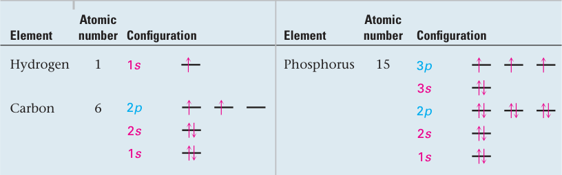 {left=20.93 top=60.95 width=64.96 height=36.09}

---

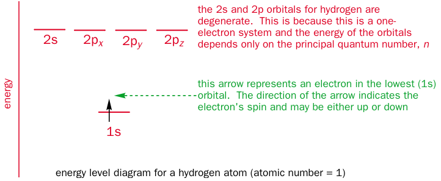 {left=15.26 top=1.37 width=54.90 height=40.17}

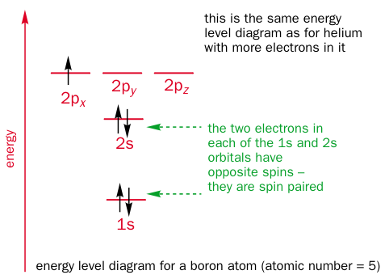 {left=70.46 top=2.66 width=29.54 height=37.59}

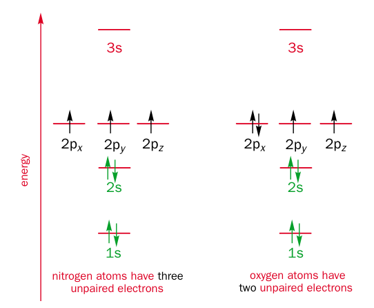 {left=17.23 top=45.33 width=35.91 height=52.53}

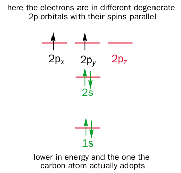 {left=62.67 top=45.33 width=30.85 height=52.53}

---

**Periodic table link****:** <u>Ptable</u>

**Biogenic elements:** 
C – carbon
H – hydrogen
O – oxygen
N – nitrogen
P – phosphorus
S – sulfur

**Cofactors, Signaling: **Na, K, Ca, Mg, Cl

**Microelements:** Fe, Zn, Cu, Mn, Mo, Co, I, Se

**Valence electrons** are electrons in the outermost shell of an atom, and that can participate in the formation of a chemical bond if the outermost shell is not closed.

---

**MOLECULE**

---

Keywords to take a note

**Valence shell electron pair repulsion** (**VSEPR**) **theory**** **is a model used in chemistry to predict the geometry of individual molecules from the number of electron pairs surrounding their central atoms. The premise of VSEPR is that the valence electron pairs surrounding an atom tend to **repel** each other. The greater the repulsion, the higher in energy (less stable) the molecule is. NOTE: this is approximation as many other theories, don’t expect it to explain everything.
**A linear combination of atomic orbitals** or **LCAO **is a quantum superposition of atomic orbitals and a technique for calculating molecular orbitals in quantum chemistry.

---

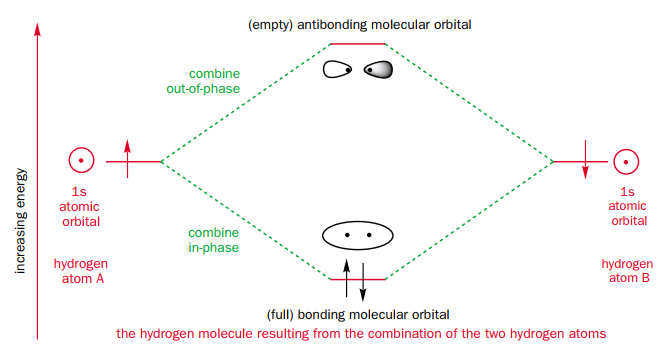 {left=10.63 top=3.29 width=52.61 height=49.27}

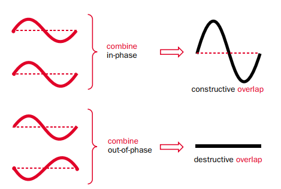 {left=64.62 top=-0.00 width=35.38 height=42.50}

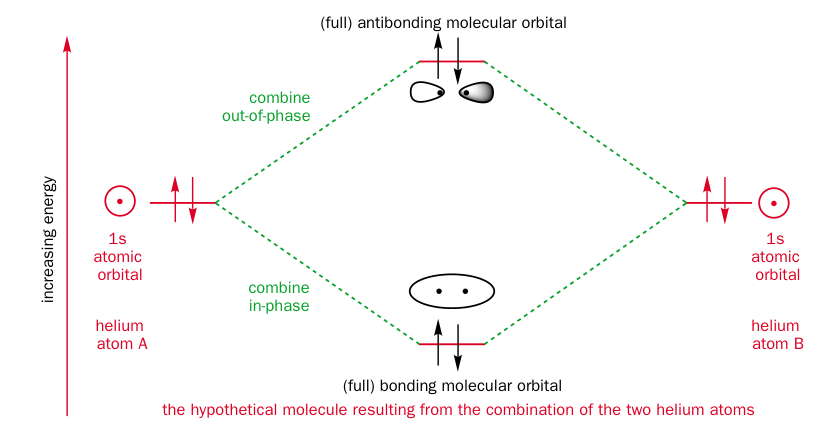 {left=12.78 top=56.61 width=44.62 height=41.52}

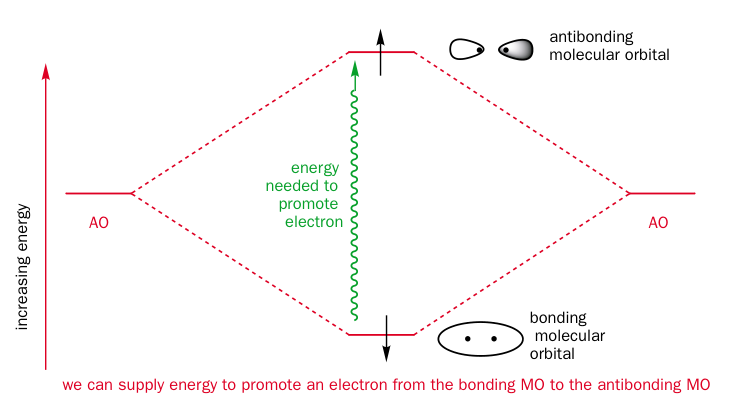 {left=60.73 top=59.65 width=39.27 height=38.48}

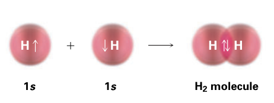 {left=65.30 top=40.67 width=27.88 height=18.66}

---

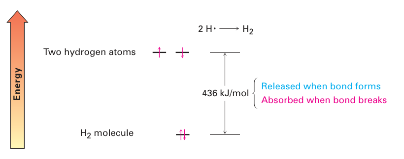 {left=21.24 top=52.66 width=67.40 height=47.34}

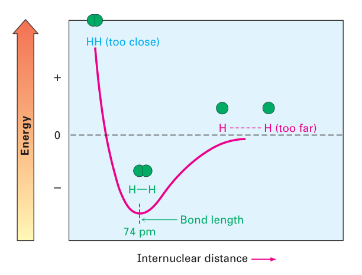 {left=18.77 top=3.27 width=34.60 height=46.73}

There is an optimum distance between nuclei that leads to maximum stability. Called the **bond length**, this distance is 74 pm in the H2 molecule. Every covalent bond has both a characteristic bond strength and bond length.

---

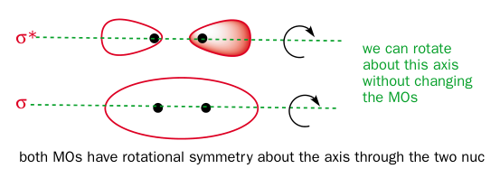 {left=16.57 top=0.00 width=46.25 height=29.29}

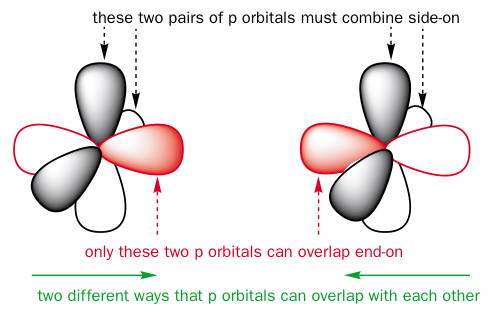 {left=65.32 top=0.00 width=34.68 height=40.39}

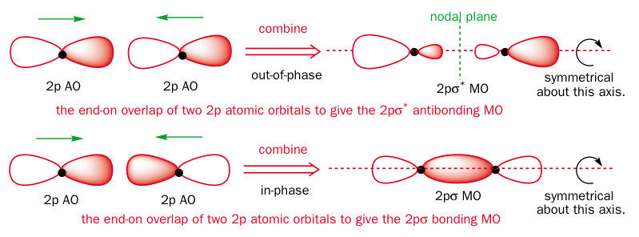 {left=17.23 top=42.80 width=81.52 height=53.69}

---

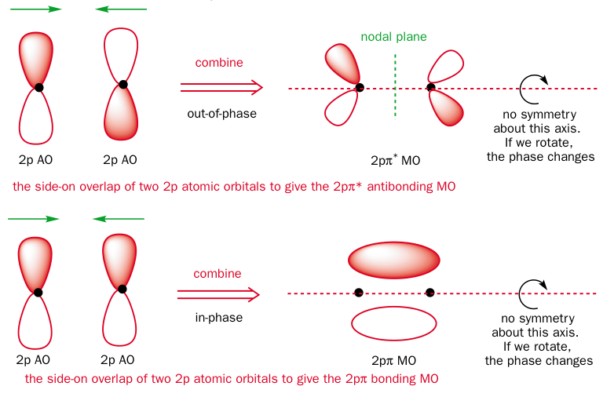 {left=18.54 top=3.15 width=81.46 height=93.70}

---

 {left=38.30 top=2.96 width=61.70 height=94.07}

An **inductive effect** is simply the shifting of electrons in a
sigma bond in response to the electronegativity of nearby atoms.

---

Molecular orbitals are created from atomic orbitals. Think of them as a new coordinate system that allows expressing any quantum state. If you choose this system carefully, electrons would like to remain in a pure state (on coordinate axis),  not in a mixture of states.

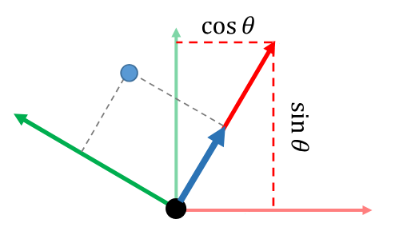 {left=30.99 top=34.79 width=52.50 height=55.37}

---

Only orbitals with close energy levels can effectively interact.

 {left=63.77 top=16.87 width=26.30 height=83.13}

 {left=17.85 top=16.87 width=26.30 height=83.13}

---

**Electronegativity.** The more electronegative an atom is, the more it
attracts electrons. This can be understood in terms of energies of the AOs.

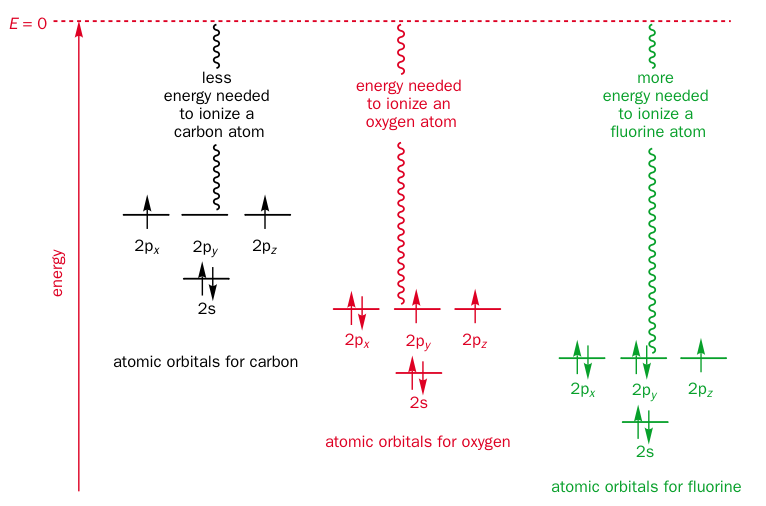 {left=16.07 top=21.91 width=51.47 height=60.45}

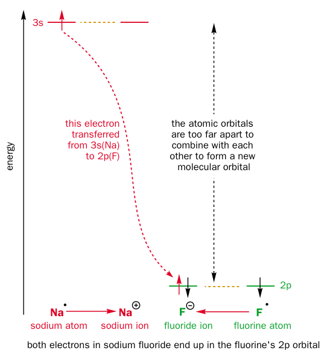 {left=69.21 top=23.28 width=29.12 height=56.36}

---

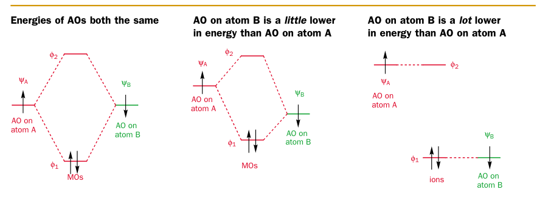 {left=22.90 top=0.00 width=78.29 height=51.39}

Compound exists as ions

Easiest to break in two ions A+ and B-,  but radicals are also possible

Easiest to break into two radicals. Heterolytic fission also possible, can give A+ and B-, but also A- and B+

---

The continuum in bonding from covalent to ionic is a result of an unequal distribution of bonding electrons between atoms. The symbol “lowercase Greek delta” means partial charge, either partial positive for the electron-poor atom or partial negative for the electron-rich atom.

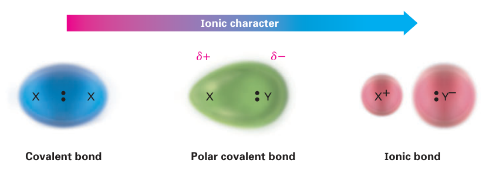 {left=18.72 top=41.95 width=80.35 height=52.27}

---

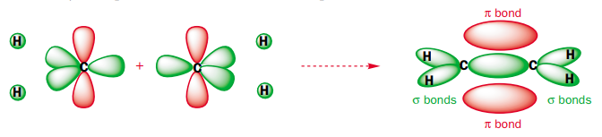 {left=19.05 top=4.84 width=63.50 height=25.69}

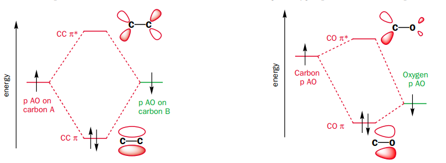 {left=18.55 top=31.04 width=61.63 height=40.10}

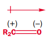 {left=84.88 top=42.70 width=10.77 height=14.61}

This C-O π bond is covalent but there is also some electrostatic contribution to its bond strength. This electrostatic interaction actually makes a C=O double bond much stronger than a C=C double bond (bond strength for C=O, about 725–760 kJ/mol; for C=C, 600–625 kJ/mol: compare also a C–O single bond, 350–380 kJ/mol with a C–C single bond, 340–350 kJ/mol).

---

Having similar energies is not the only criterion for good interaction between two atomic orbitals. It also matters how the orbitals overlap.

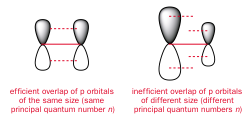 {left=35.21 top=21.39 width=42.07 height=35.32}

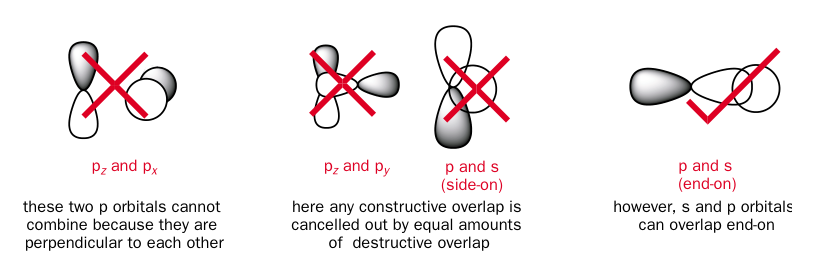 {left=23.89 top=57.78 width=64.71 height=38.44}

---

Hybridization of atomic orbitals

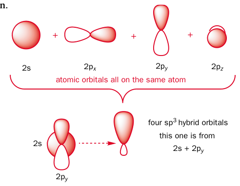 {left=35.33 top=24.70 width=49.48 height=70.74}

---

**Link:** <u>https://www.chemtube3d.com/orbitalshybrid/</u>

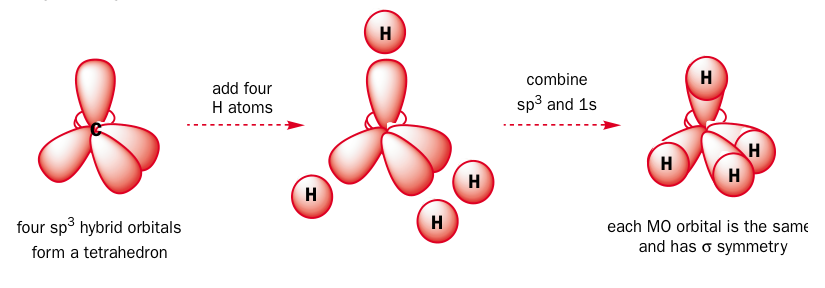 {left=16.62 top=3.19 width=80.57 height=50.00}

---

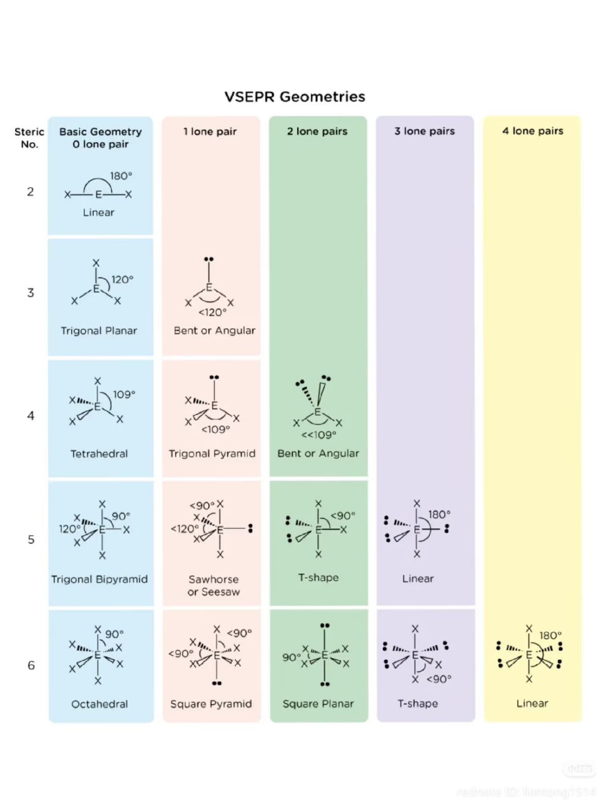 {left=48.83 top=0.00 width=51.17 height=100.00}

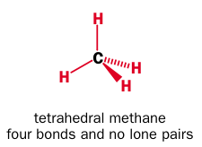 {left=22.69 top=0.00 width=23.44 height=30.37}

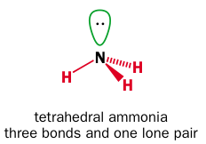 {left=22.32 top=31.93 width=24.17 height=30.00}

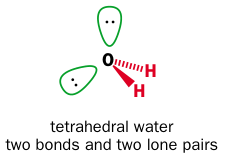 {left=24.22 top=65.23 width=23.75 height=29.44}

**Build models here:**
 <u>https://app.molview.com/</u>

---

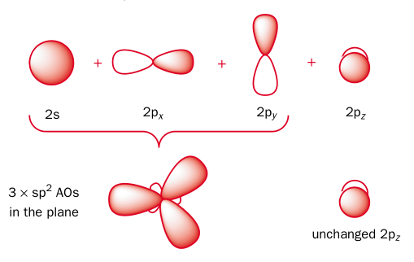 {left=17.08 top=1.87 width=53.02 height=59.63}

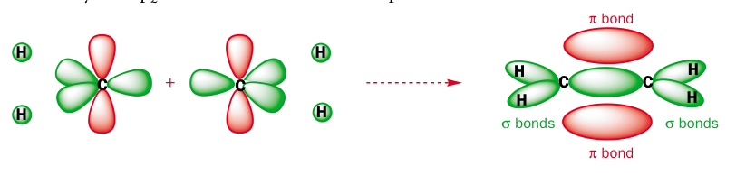 {left=18.77 top=69.04 width=76.70 height=30.96}

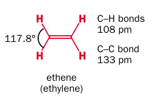 {left=71.15 top=1.87 width=26.15 height=30.19}

**Link: **<u>https://www.chemtube3d.com/orbitalsethene/</u>

---

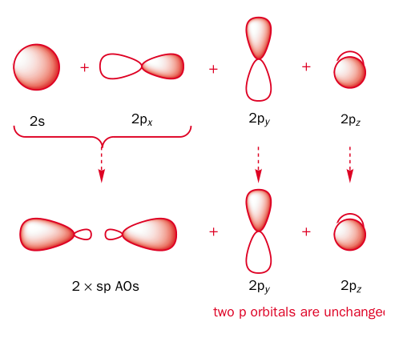 {left=19.54 top=40.60 width=41.07 height=61.36}

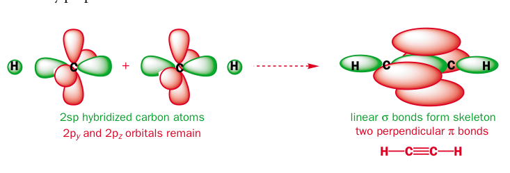 {left=18.14 top=5.84 width=67.23 height=36.14}

**Link: **<u>https://www.chemtube3d.com/orbitalsacetylene/</u>

---

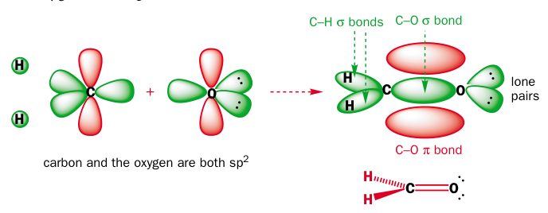 {left=16.60 top=1.14 width=45.79 height=30.58}

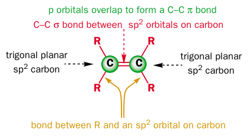 {left=16.60 top=31.71 width=35.38 height=34.13}

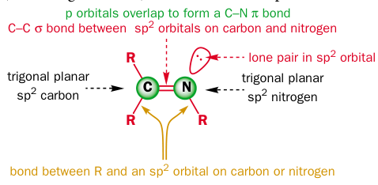 {left=66.10 top=3.36 width=33.90 height=28.35}

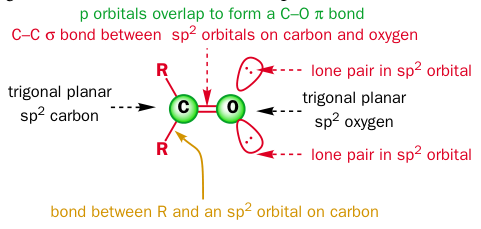 {left=54.83 top=33.68 width=40.33 height=33.39}

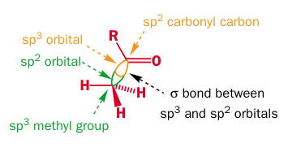 {left=17.85 top=70.50 width=29.76 height=29.50}

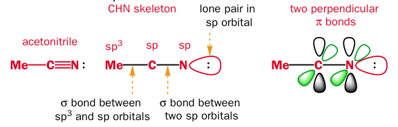 {left=48.33 top=71.01 width=51.67 height=28.99}

2

3

---

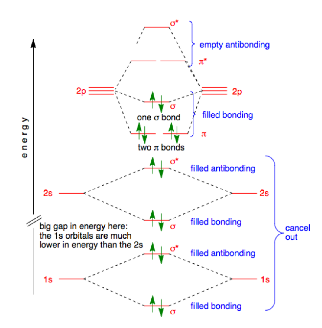 {left=44.67 top=0.00 width=55.33 height=100.00}

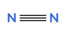 {left=22.32 top=43.24 width=14.37 height=13.52}

---

Why do we care about orbitals?

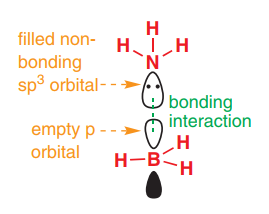 {left=16.07 top=14.51 width=28.02 height=39.63}

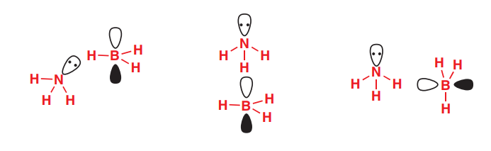 {left=41.96 top=68.29 width=58.04 height=31.71}

This collision creates a new bond

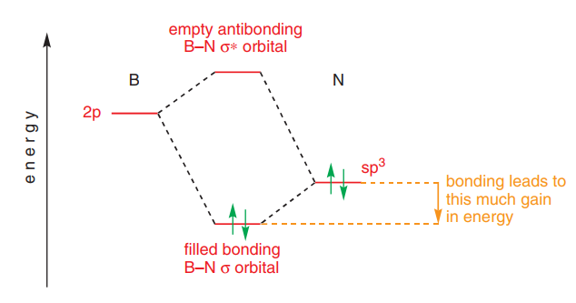 {left=61.65 top=27.00 width=36.77 height=34.34}

These collisions do not

---

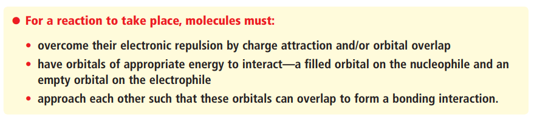 {left=20.08 top=24.21 width=78.23 height=31.78}

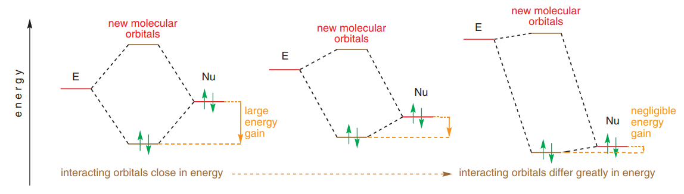 {left=22.98 top=61.98 width=75.32 height=38.02}

In the future we will study mechanisms of reactions

---

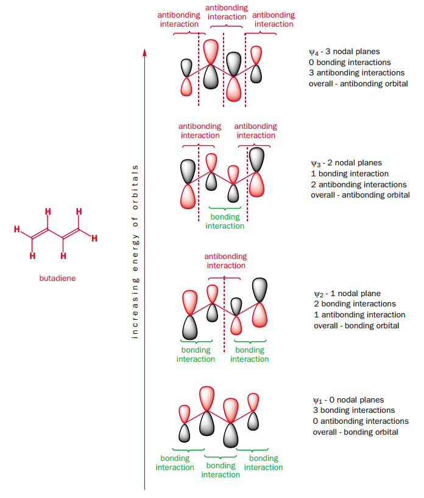 {left=18.14 top=12.69 width=41.73 height=87.31}

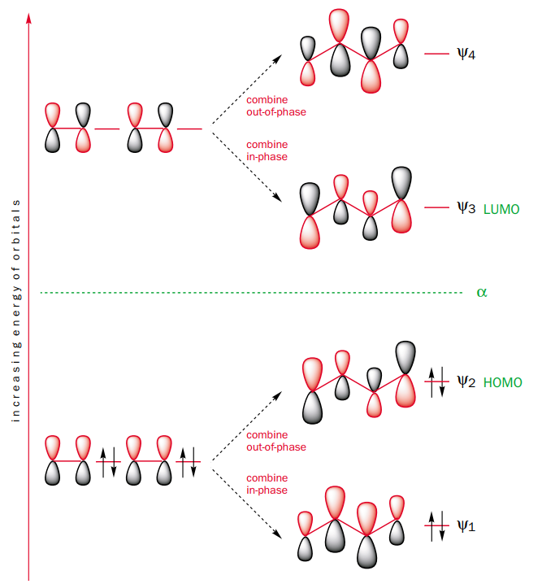 {left=59.87 top=24.43 width=39.49 height=75.57}

Conjugated bonds

---

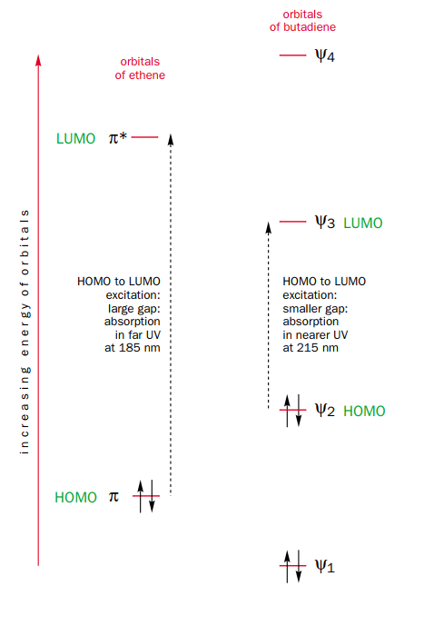 {left=17.23 top=7.84 width=33.44 height=85.69}

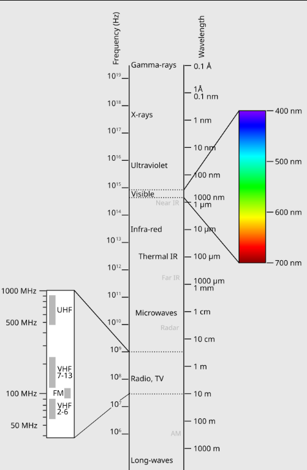 {left=52.61 top=0.00 width=36.78 height=99.98}

---

Natural Pigments (see what’s common?)

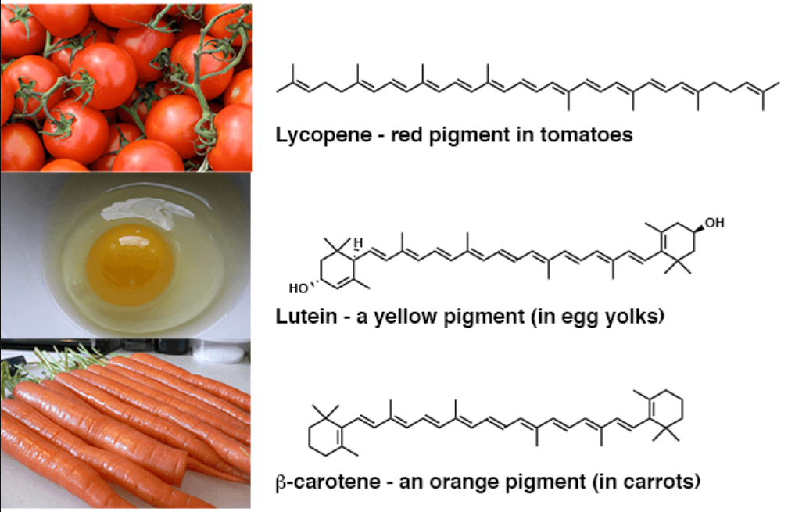 {left=17.23 top=20.96 width=65.13 height=74.57}

---

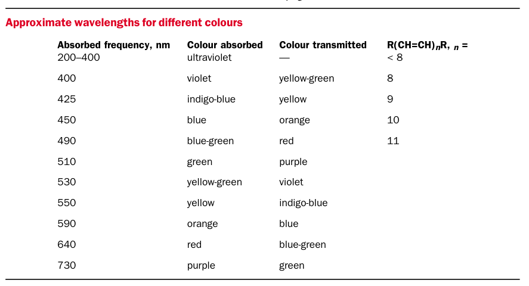 {left=18.26 top=36.32 width=60.86 height=58.55}

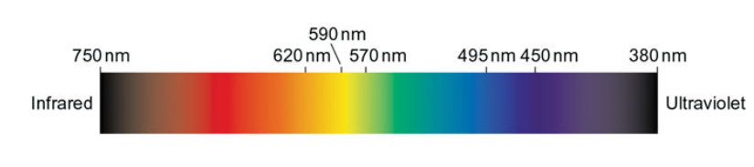 {left=18.26 top=1.87 width=77.07 height=30.39}

Blue or green polyenes are rare, and dyes of these colours rely on more elaborate conjugated systems.

---

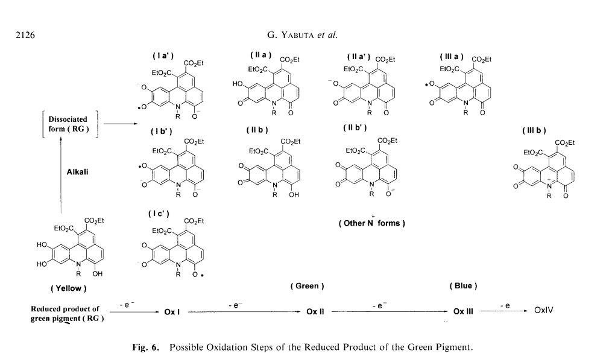 {left=-0.00 top=34.90 width=61.64 height=65.10}

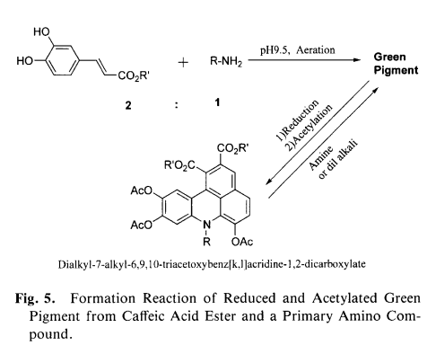 {left=63.23 top=0.00 width=36.77 height=52.99}

Source: Goro YABUTA et al, Structure of Green Pigment Formed by the Reaction of Caffeic Acid Esters (or Chlorogenic acid) with a Primary Amino Compound

**Link:** https://www.tandfonline.com/doi/pdf/10.1271/bbb.65.2121

---

Source: my FB account

 {left=43.07 top=11.46 width=55.32 height=73.76}

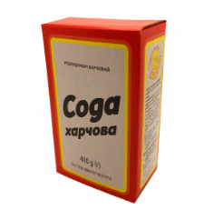 {left=17.57 top=1.98 width=20.25 height=38.72}

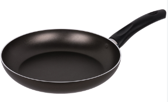 {left=18.71 top=38.67 width=24.37 height=26.37}

 {left=26.48 top=65.05 width=7.04 height=34.05}

---

Aromaticity

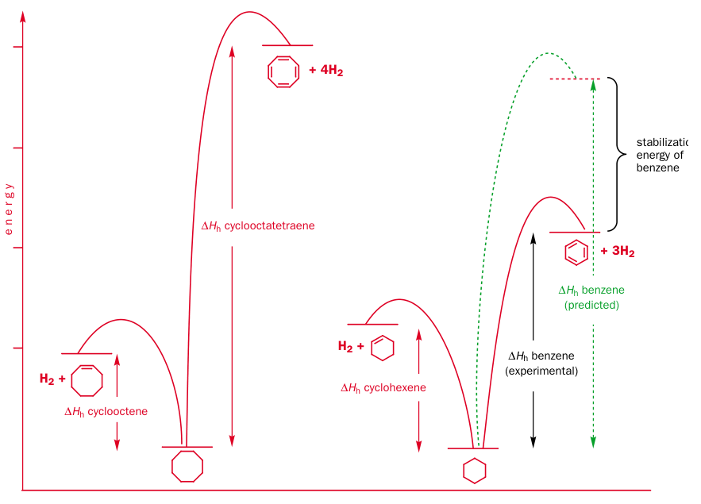 {left=20.47 top=18.25 width=61.41 height=78.51}

96 kJ/mol

410 kJ/mol

120 kJ/mol

208 kJ/mol

heat of hydrogenation

---

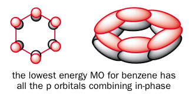 {left=14.03 top=72.93 width=29.80 height=27.07}

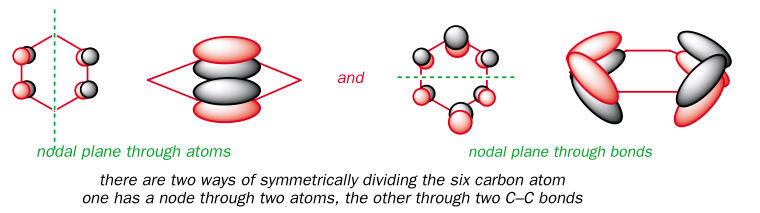 {left=42.97 top=51.66 width=51.59 height=25.71}

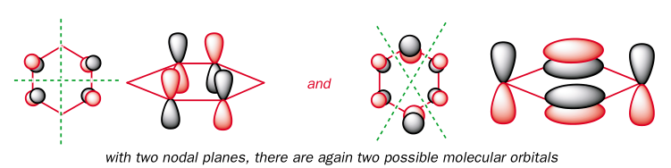 {left=42.97 top=25.41 width=51.59 height=22.96}

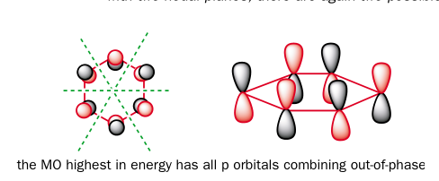 {left=15.20 top=1.39 width=40.55 height=25.71}

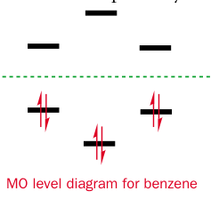 {left=16.58 top=31.45 width=24.69 height=41.48}

Benzene has six π molecular orbitals

---

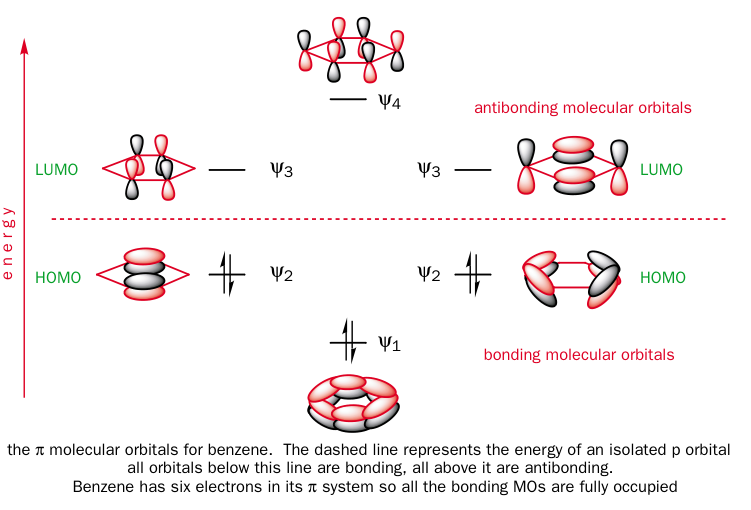 {left=20.62 top=4.33 width=77.92 height=94.07}

---

**Note:** planarity matters. 10=2 x 4 +2, 18 = 2 x 8 + 2

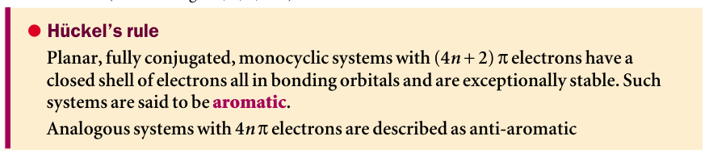 {left=16.23 top=-0.00 width=82.08 height=31.58}

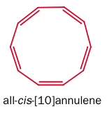 {left=23.40 top=50.00 width=15.94 height=30.00}

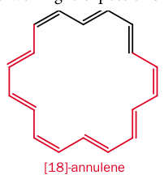 {left=71.47 top=48.42 width=17.08 height=31.58}

Not planar -> not aromatic.
Reason: in plane angles would be 144, not 120

Planar, Aromatic

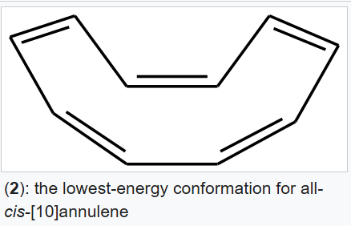 {left=39.33 top=51.92 width=17.08 height=19.55}

---

Aromaticity matters

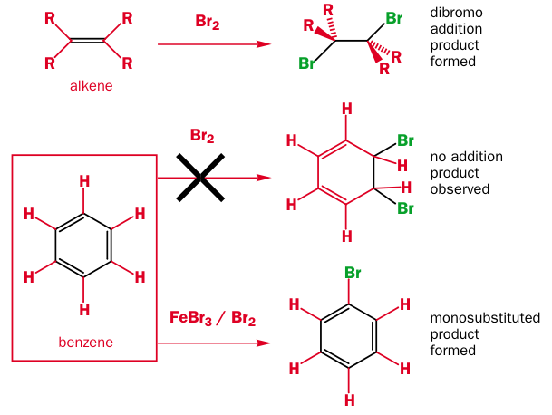 {left=10.99 top=30.50 width=49.78 height=66.55}

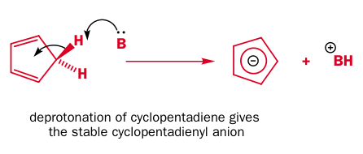 {left=59.68 top=21.93 width=40.32 height=30.54}

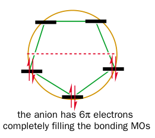 {left=72.81 top=52.47 width=27.19 height=42.96}

2 electrons from H

---

Heterocyclic aromatic compounds

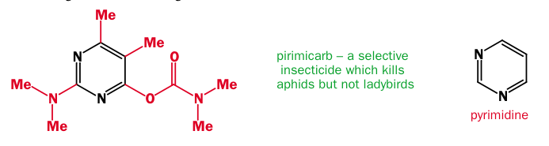 {left=17.08 top=16.99 width=72.19 height=33.01}

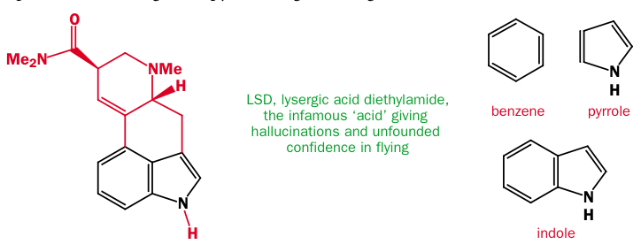 {left=24.76 top=53.38 width=62.98 height=42.56}

---

Heterocyclic aromatic compounds

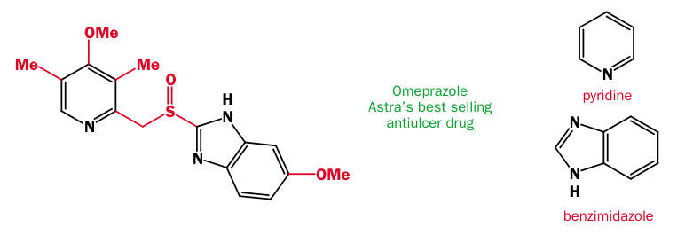 {left=18.47 top=16.66 width=75.55 height=46.10}

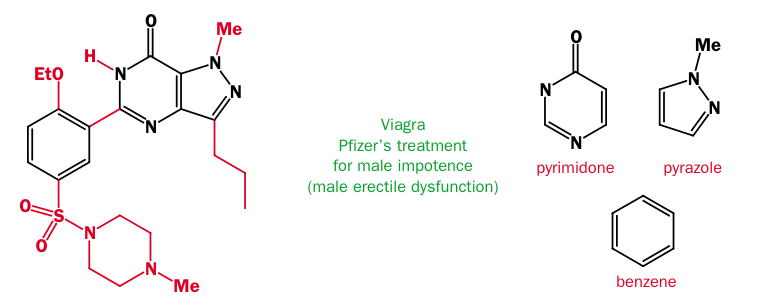 {left=36.34 top=64.90 width=44.77 height=32.13}

---

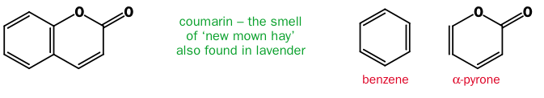 {left=22.12 top=-0.00 width=70.10 height=22.59}

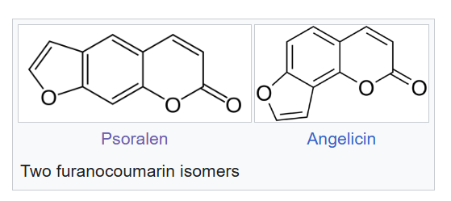 {left=16.69 top=20.44 width=50.21 height=39.76}

 {left=68.57 top=25.56 width=27.88 height=71.48}

 {left=18.16 top=63.17 width=21.96 height=33.87}

Heracleum sosnowskyi, or Sosnowsky's hogweed. Invasive in Ukraine. May damage skin!

---

**HOMEWORK**

---

**Problem 1.** Draw the ground state electron configuration of the **oxygen. **I expect you to draw energy levels and populate them with electrons. Refer to Hund’s rule, aufbau principle, etc as needed.

**Problem 2.** Write hybridizations for all carbon atoms in vitamin C

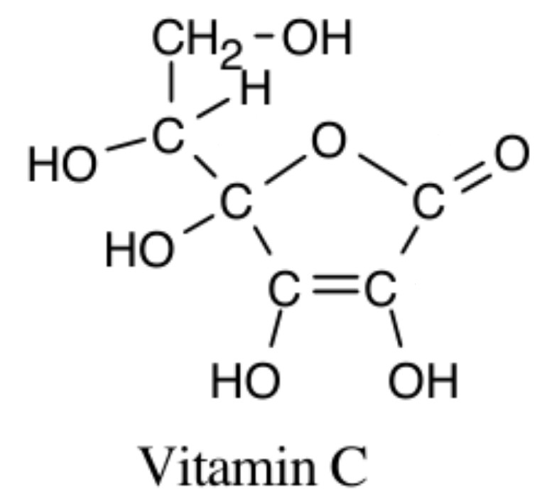 {left=38.66 top=38.30 width=35.17 height=57.25}

---

**Problem 3.** Fill in any nonbonding valence electrons that are missing in acetate ion

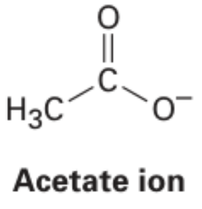 {left=41.37 top=20.03 width=18.93 height=34.92}

---

**FINALE**

---
