

Bioorganic Chemistry

Tymchyshyn V.B.

Lecture 2: How do we know the chemical structure

---

Understand the structure from drawing

For simple structures use old <u>https://molview.org/</u>

---

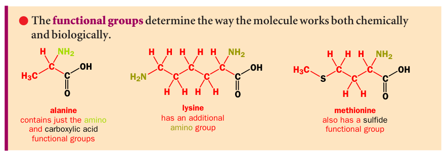 {left=18.35 top=47.55 width=79.49 height=50.24}

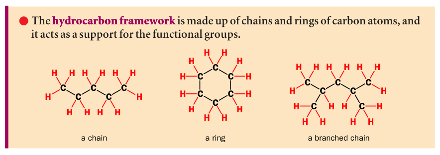 {left=18.35 top=2.96 width=66.34 height=41.63}

---

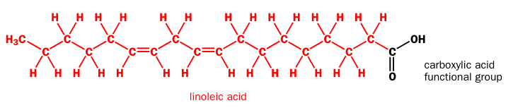 {left=22.01 top=0.00 width=75.52 height=28.33}

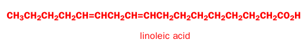 {left=26.77 top=28.33 width=53.85 height=13.70}

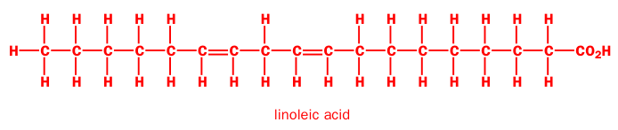 {left=22.01 top=42.04 width=72.29 height=27.22}

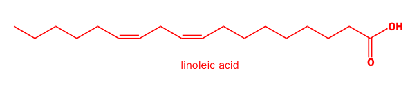 {left=25.86 top=69.26 width=61.77 height=23.70}

---

 {left=17.27 top=38.15 width=61.77 height=23.70}

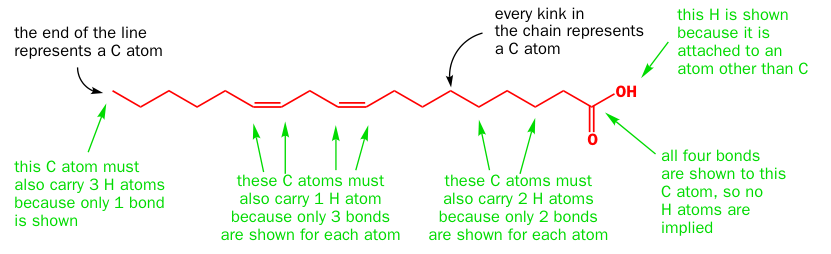 {left=16.24 top=0.00 width=74.24 height=40.34}

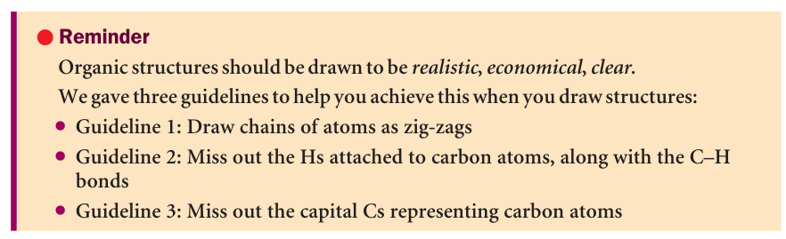 {left=17.17 top=60.70 width=61.96 height=33.60}

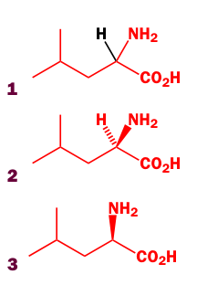 {left=83.23 top=50.00 width=15.34 height=45.17}

---

Table of fragment names and organic elements

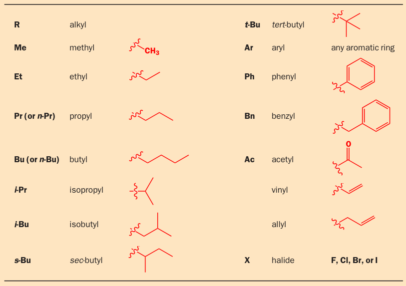 {left=28.02 top=23.55 width=58.87 height=73.76}

---

Search for chemicals

<u>https://www.chemspider.com/</u>
<u>https://molview.org/</u>

---

Conformations

---

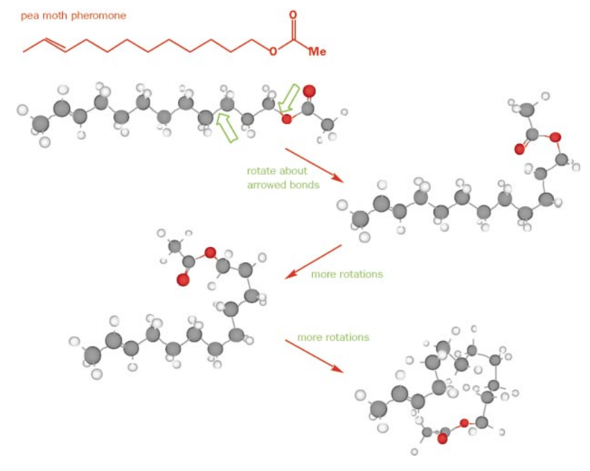 {left=33.80 top=1.87 width=66.20 height=94.07}

Single bonds can rotate

---

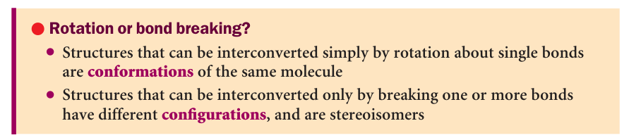 {left=17.61 top=0.00 width=82.39 height=32.71}

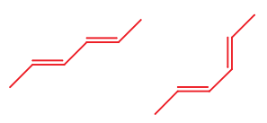 {left=16.00 top=40.27 width=27.26 height=22.36}

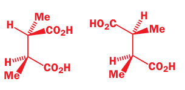 {left=44.17 top=40.52 width=25.16 height=21.85}

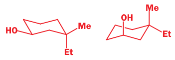 {left=69.33 top=42.27 width=29.70 height=18.35}

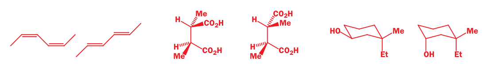 {left=17.61 top=76.33 width=82.39 height=19.66}

conformations

configurations

---

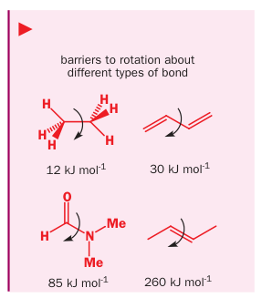 {left=0.62 top=39.44 width=29.90 height=60.56}

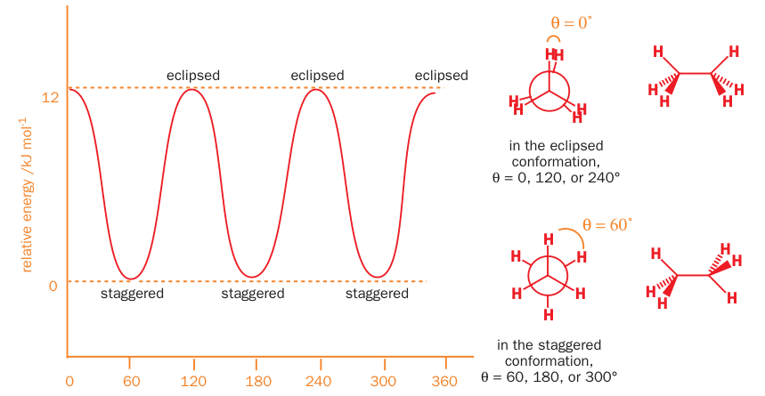 {left=34.25 top=0.00 width=65.75 height=60.56}

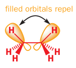 {left=57.70 top=70.24 width=15.73 height=25.00}

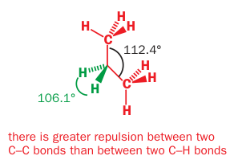 {left=30.51 top=65.98 width=27.19 height=33.52}

Newman projection

Ethane conformations

---

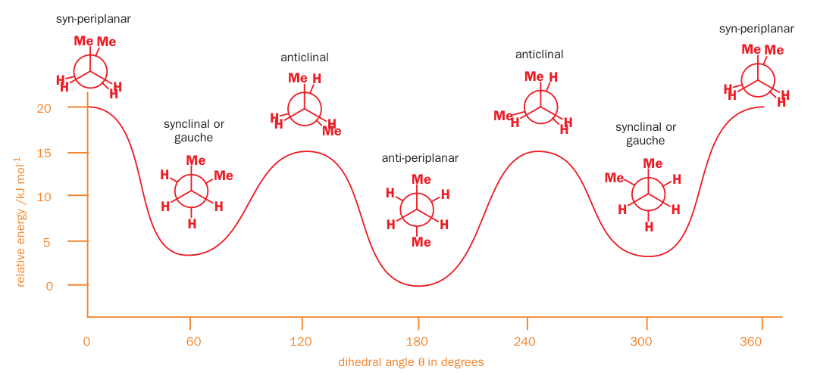 {left=20.85 top=-0.00 width=76.74 height=65.16}

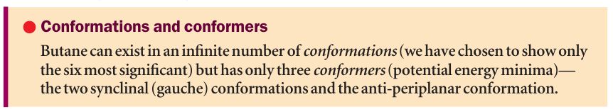 {left=19.00 top=70.44 width=80.45 height=25.55}

Butane  <u>https://molview.org/?smiles=C(CC)C</u>

---

 {left=18.00 top=20.57 width=79.43 height=79.43}

Cyclic components are not only non-planar, but also can change conformations <u>https://molview.org/?smiles=C1CCCCC1</u>

---

Conformation of cycloalkanes

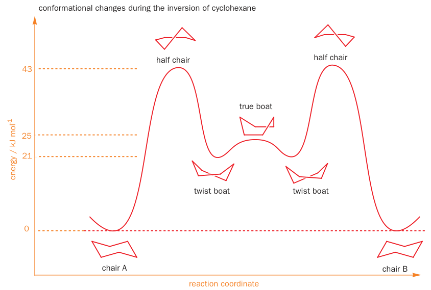 {left=20.42 top=18.34 width=61.54 height=73.76}

---

 {left=19.30 top=12.10 width=75.81 height=75.81}

---

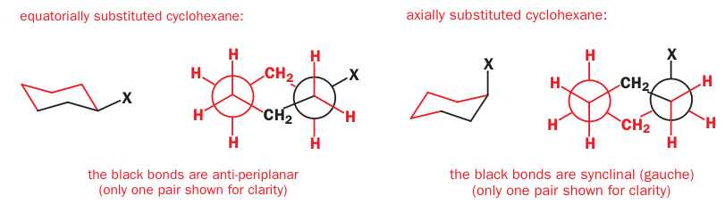 {left=16.52 top=1.97 width=73.02 height=36.66}

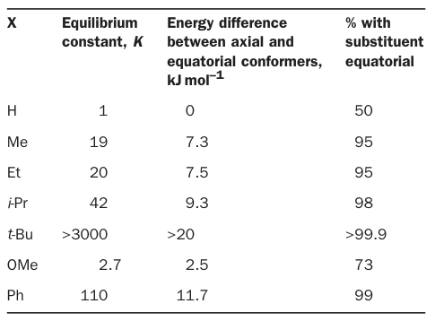 {left=54.79 top=38.63 width=43.41 height=56.97}

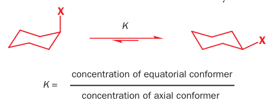 {left=16.81 top=47.77 width=33.90 height=24.83}

<u>https://molview.org/?smiles=C1C[C@]([H])(Br)CCC1</u>
With Br substituent

---

ISOMERS

---

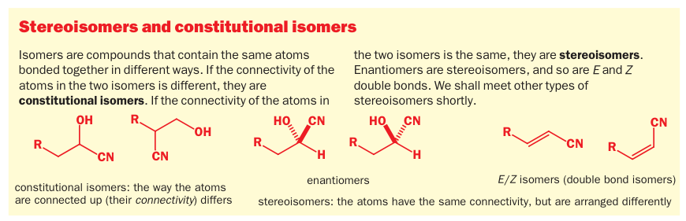 {left=17.79 top=46.53 width=79.08 height=45.41}

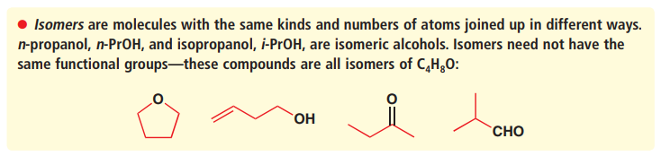 {left=17.66 top=5.51 width=79.08 height=33.33}

---

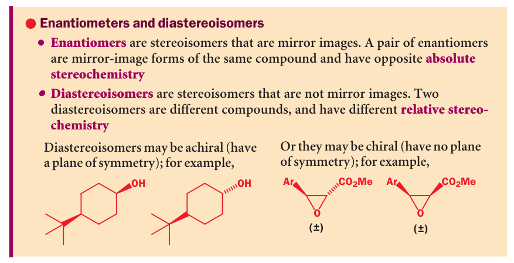 {left=17.75 top=10.49 width=81.18 height=73.89}

---

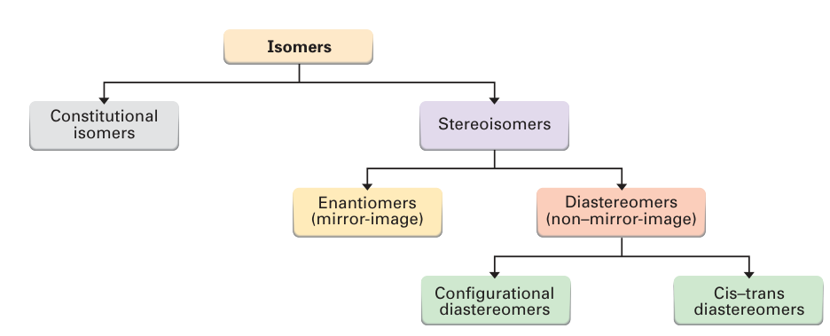 {left=19.70 top=-0.00 width=80.30 height=57.81}

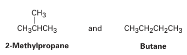 {left=15.28 top=26.24 width=28.31 height=14.90}

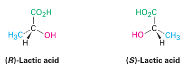 {left=29.37 top=43.44 width=26.44 height=17.99}

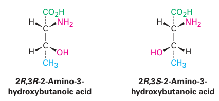 {left=48.91 top=61.43 width=21.89 height=17.99}

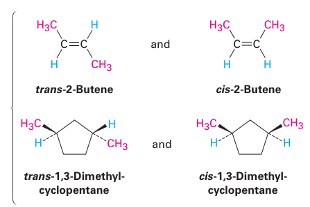 {left=72.46 top=64.73 width=27.54 height=32.64}

Cis-trans terminology is used to both double bonds and rings

---

Cis-trans isomerism

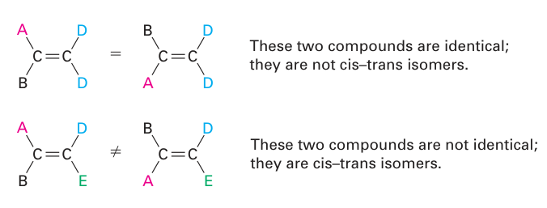 {left=17.26 top=18.66 width=46.37 height=31.34}

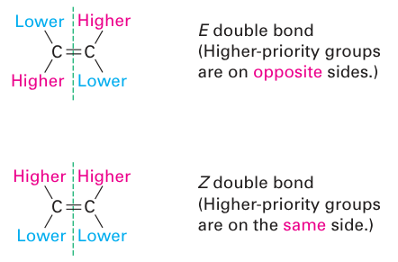 {left=65.41 top=0.00 width=34.59 height=40.49}

entgegen

zusammen

Compare the atomic number (Z) of the atoms directly attached to the stereocenter; the group having the atom of higher atomic number Z receives higher priority.
If there is a tie, make lists of atoms at distance 2, for multiple bonds list each atom more than once. Each list is arranged in order of decreasing atomic number Z. Then the lists are compared atom by atom; at the earliest difference, the group containing the atom of higher atomic number Z receives higher priority.
If there is still a tie, each atom in each of the two lists is replaced with a sublist of the other atoms bonded to it and rule 2 is repeated

---

Naming

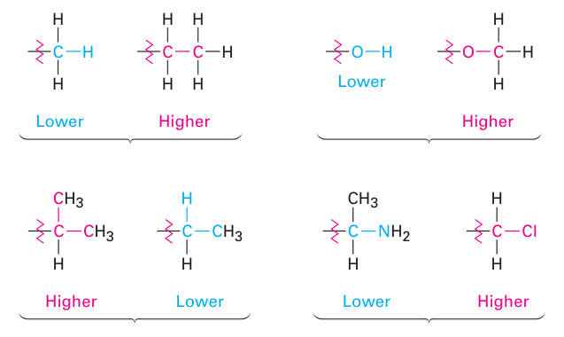 {left=20.79 top=26.25 width=66.35 height=70.37}

---

As a general rule, alkenes follow the stability order:

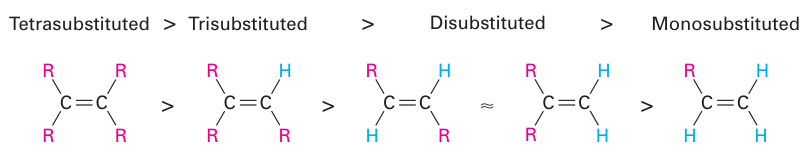 {left=16.07 top=16.35 width=84.06 height=29.81}

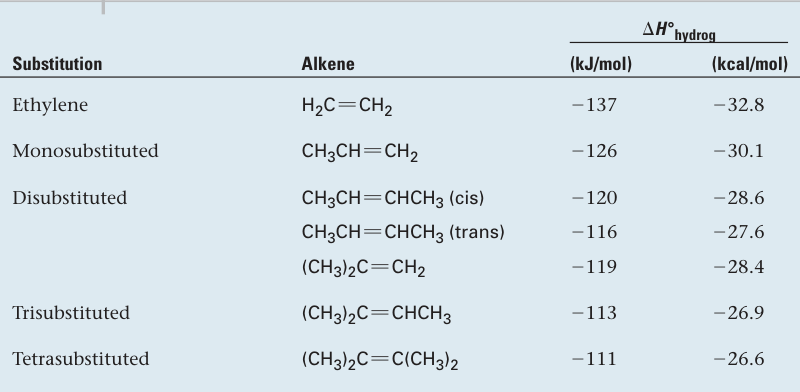 {left=28.75 top=52.09 width=55.00 height=47.91}

---

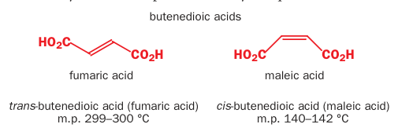 {left=32.52 top=14.18 width=52.60 height=31.85}

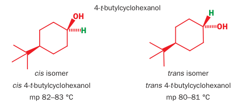 {left=31.33 top=52.30 width=50.83 height=39.44}

These two alkenes are geometrical isomers (or cis–trans isomers). Their physical chemical properties are different, as you would expect, since they are quite different in shape.

A similar type of stereoisomerism can exist in cyclic compounds.

Stereoisomers that are not mirror images of one another are called **diastereoisomers**.

---

Enantiomers

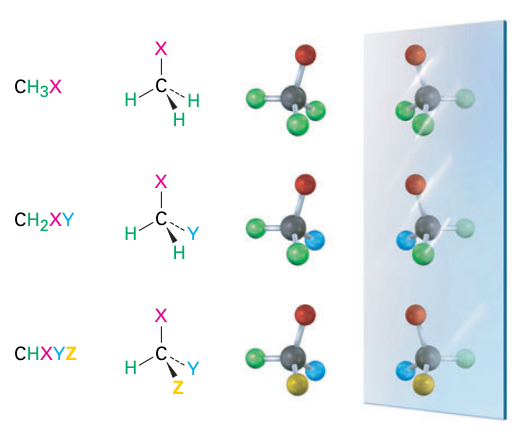 {left=16.07 top=16.68 width=50.30 height=73.76}

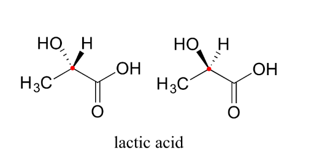 {left=66.37 top=3.81 width=31.76 height=27.90}

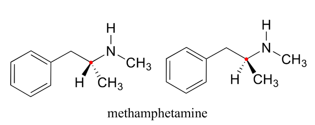 {left=66.37 top=38.74 width=30.05 height=21.29}

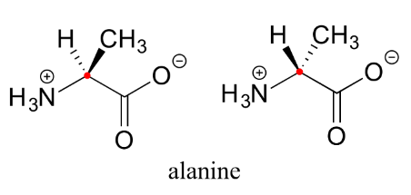 {left=67.96 top=67.05 width=26.88 height=22.73}

---

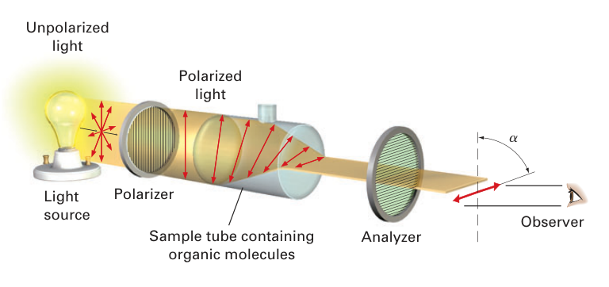 {left=17.59 top=0.00 width=80.00 height=67.04}

From the vantage point of the observer looking directly at the analyzer, some
optically active molecules rotate polarized light to the left (**counterclockwise**) and are said to be **levorotatory **or **minus (-)**, whereas others rotate polarized light to the right (**clockwise**) and are said to be **dextrorotatory** or **plus (+)**. 

(-)-Morphine, for example, is levorotatory, and (+)-sucrose is dextrorotatory.

---

Sucrose rotates polarized light (note: many different wavelengths)

 {left=18.33 top=23.28 width=73.92 height=73.92}

---

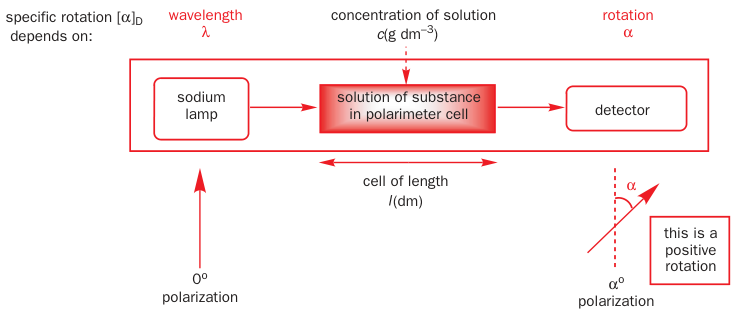 {left=22.60 top=0.00 width=77.40 height=59.63}

Index D indicates the wavelength of 589 nm, the ‘D line’
of a sodium lamp.

Upper index may indicate temperature in Celsius

can be used as a guide to the enantiomeric purity of a sample

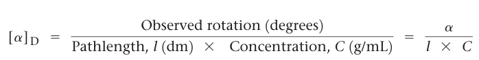 {left=24.95 top=58.64 width=72.71 height=16.30}

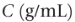 {left=61.64 top=4.20 width=7.81 height=4.07}

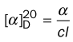 {left=22.60 top=59.63 width=9.92 height=18.48}

Be careful! Alpha is often reported without units!

---

Every molecule twists light

 {left=44.71 top=-0.00 width=53.23 height=40.19}

 {left=49.29 top=40.19 width=48.65 height=39.81}

It can obviously untwist it

But how do you rotate this molecule to chain it with the first one and untwist light? 
What would happen if there is no chirality?

---

 {left=29.88 top=1.64 width=66.35 height=53.52}

 {left=20.48 top=65.24 width=79.52 height=32.94}

---

 {left=16.56 top=8.24 width=83.44 height=80.56}

R configuration (Latin rectus, meaning “right”)

S configuration (Latin sinister,
meaning “left”)

Assign priorities 1,2,3,4 same way as for E/Z (double bond)

---

 {left=27.10 top=2.96 width=65.63 height=94.07}

---

 {left=19.27 top=2.96 width=80.73 height=94.07}

---

 {left=23.02 top=0.00 width=64.27 height=25.00}

 {left=31.37 top=26.79 width=49.17 height=30.74}

 {left=70.51 top=59.32 width=28.57 height=39.19}

 {left=25.80 top=60.95 width=39.69 height=35.93}

---

 {left=20.67 top=3.46 width=79.33 height=46.54}

 {left=20.67 top=53.29 width=46.25 height=37.96}

Fischer projections are so unlike real molecules that you should never use them. However, you may see them in older books

---

 {left=19.55 top=5.75 width=80.45 height=26.93}

 {left=19.55 top=42.80 width=80.45 height=48.61}

---

achiral compounds with more than one stereogenic centre

 {left=65.54 top=23.86 width=17.71 height=29.63}

 {left=15.42 top=16.20 width=39.31 height=45.39}

 {left=15.42 top=77.41 width=84.58 height=22.59}

 {left=50.09 top=57.04 width=48.60 height=22.59}

---

INSTRUMENTAL METHODS to GET the STRUCTURE

---

 {left=16.07 top=37.58 width=83.93 height=62.42}

 {left=24.58 top=0.00 width=60.35 height=37.58}

---

X-Ray is powerful, but we will not consider it

• X-ray crystallography works by the scattering of X-rays from electrons and requires crystalline solids. If an organic compound is a liquid or is a solid but does not form good crystals, its structure cannot be determined in this way.

• X-ray crystallography is a science in its own right, a separate discipline from chemistry because it requires specific skills, and a structure determination can take a long time.

• We normally use NMR routinely and reserve X-rays for difficult unknown structures and for determining the detailed shape of important molecules.

---

Mass Spectrometry

 {left=26.53 top=12.67 width=64.20 height=77.21}

National Technical University of Ukraine "Igor Sikorsky Kyiv Polytechnic Institute"

---

 {left=16.86 top=2.96 width=83.14 height=94.07}

---

 {left=73.02 top=0.89 width=25.31 height=35.74}

 {left=4.02 top=-0.05 width=67.25 height=37.63}

 {left=10.48 top=36.64 width=87.85 height=20.99}

 {left=27.97 top=63.55 width=70.36 height=36.45}

---

 {left=21.72 top=50.00 width=64.87 height=47.53}

 {left=26.36 top=0.00 width=68.24 height=50.00}

 {left=59.18 top=59.07 width=40.82 height=23.44}

---

Mass Spectrum Sees Isotopes

 {left=41.17 top=-0.00 width=58.83 height=70.52}

 {left=15.34 top=69.99 width=58.83 height=30.01}

---

MALDI–TOF mass-spectroscopy can be used in biology

In a MALDI source, the sample is adsorbed onto a suitable matrix compound, such as 2,5-dihydroxybenzoic acid, which is ionized by a short burst of laser light. The matrix compound then transfers the energy to the sample and protonates it, forming M+Hn^n+ ions.

Following ion formation, the variably protonated sample molecules are
electrically focused into a small packet with a narrow spatial distribution, and
the packet is given a sudden kick of energy by an accelerator electrode. 

Since each molecule in the packet is given the same energy, but has different mass they start moving with different velocities. The analyzer itself, called the drift tube, is simply an electrically grounded metal tube inside which the different charged molecules become separated as they move

The TOF technique is considerably more sensitive than the magnetic sector alternative, and protein samples of up to 100 kilodaltons (100,000 amu) can
be separated with a mass accuracy of 3 ppm.

---

 {left=21.41 top=4.30 width=76.68 height=91.39}

 {left=59.47 top=17.26 width=34.72 height=32.74}

---

 {left=28.92 top=18.76 width=58.18 height=66.56}

**IR-spectroscopy**

V. Bakul Institute for Superhard Materials

---

**Infrared** (**IR**) is electromagnetic radiation with wavelengths longer than that of visible light but shorter than microwaves.

Discovered in XIX-th century (attributed to an astronomer William Herschel)
Wavelength: 700 nm - 1mm
Photon energy: 1.7 eV - 1.24 meV

 {left=70.03 top=22.59 width=24.40 height=33.92}

*The energy of thermal photons*
*k*T = 0.02 eV  for **T = 273 K*

*Almost all black-body radiation from objects near room temperature is in the IR band.*

The range of infrared:
- near-infrared region (12800 ~ 4000 cm^-1),
- mid-infrared region (4000 ~ 200 cm^-1)
- far-infrared region (50 ~ 1000 cm^-1)

Most molecules are infrared active due to the **dipole change** in the vibration and rotation of these molecules.

*absorption radiation of most organic compounds and inorganic ions. We will work here *

 {left=8.17 top=1.53 width=26.07 height=70.86}

---

 {left=18.20 top=65.43 width=24.26 height=29.62}

 {left=41.98 top=65.43 width=25.27 height=29.62}

 {left=67.25 top=65.43 width=23.30 height=29.62}

**Solid samples: mulling.**
By grinding the particles to below the wavelength of incident radiation that will be passing through there should be limited scattering (Christiansen effect). To suspend those tiny particles, an oil, often referred to as Nujol is used. IR-transparent salt plates (KBr) are used to hold the sample in front of the beam.

 {left=86.25 top=64.78 width=10.73 height=17.83}

 {left=86.25 top=82.61 width=12.67 height=13.07}

ferrocene Fe(C5H5)2

**Solvable samples:**dissolved in a solvent such as 
carbon tetrachloride (CCl₄)
chloroform (CHCl3) 
carbon disulfide (CS₂)
 that has few IR absorptions.

 {left=42.46 top=8.37 width=55.54 height=32.65}

---

 {left=67.50 top=-1.92 width=32.50 height=45.76}

**Gas sample **
needs to be measured in a gas cell with two KBr windows on each side. The gas cell should first be vacuumed.

 {left=72.49 top=46.10 width=26.14 height=34.48}

 {left=13.33 top=44.55 width=57.34 height=37.59}

---

faster
higher signal-to-noise ratio
wider spectral range

 {left=8.22 top=22.33 width=42.96 height=26.19}

 {left=62.11 top=18.60 width=27.91 height=62.80}

**Dispersive IR Spectroscopy**
uses a dispersive element, such as a grating or prism, to separate different wavelengths of infrared light. The intensity of each wavelength is measured sequentially to build up the spectrum.

**FTIR Spectroscopy**
uses an interferometer to measure the entire infrared spectrum simultaneously. The interferogram obtained is Fourier-transformed to obtain the final spectrum.

The first generation of IR spectrometers (1950) used NaCl prisms in detector
The second generation (1960) used gratings

 {left=13.70 top=71.35 width=10.01 height=24.13}

---

 {left=6.43 top=9.55 width=91.30 height=80.91}

---

**Molecular vibrations**

Molecule of N atoms has 3N degrees of freedom
3 translations d.f.
3 rotational d.f for non-linear /  2 rotational d.f for linear mols
The rest: 3N-6 oscillatory d.f for non-linear  /  3N-5 oscillatory d.f for linear molecules
oscillatory d.f = stretching + bending

H2O: 

H2O molecule is a non-linear molecule due to the uneven distribution of the electron density. O2 is more electronegative than H2 and carries a negative charge, while H has a partial positive charge. The total degrees of freedom for H2O will be 3(3)-6 = 9-6 = 3 degrees of freedom which correspond to the following stretching and bending vibrations. The vibrational modes are illustrated below:

 {left=54.27 top=77.56 width=31.15 height=22.44}

---

CO2 :

CO2 is a linear molecule and thus has the formula (3N-5). It has 4 modes of vibration (3(3)-5). CO2 has 2 stretching modes, symmetric and asymmetric. The CO2 symmetric stretch is not IR active because there is no change in dipole moment because the net dipole moments are in opposite directions and as a result, they cancel each other. In the asymmetric stretch, O atom moves away from the C atom and generates a net change in dipole moments and hence absorbs IR radiation at 2350 cm-1. The other IR absorption occurs at 666 cm-1. CO2 has a total of four of stretching and bending modes but only two are seen. Two of its bands are degenerate and one of the vibration modes is symmetric hence it does not cause a dipole moment change because the polar directions cancel each other. The vibrational modes are illustrated below:

 {left=31.10 top=58.16 width=41.66 height=31.89}

---

 {left=18.17 top=21.08 width=19.20 height=42.82}

 {left=39.94 top=21.18 width=13.18 height=13.52}

 {left=64.05 top=36.99 width=10.46 height=9.58}

 {left=39.94 top=46.57 width=11.55 height=10.13}

*reduced mass*

*force constant *≈* bond strength*

*energy, required to excite a bond vibration *

<u>https://ir.cheminfo.org/</u>

**Stretching**

 {left=26.52 top=76.66 width=14.53 height=18.45}

 {left=52.85 top=76.76 width=15.94 height=20.25}

Symmetric stretching

Antisymmetric stretching

Most interesting for IR analysis are stretchings

---

**In-plane bending:**The atoms move within the same plane as the molecule.
**Scissoring:** The angle between two bonds decreases and increases, like a pair of scissors. 
**Rocking:** The two bonds rock back and forth in the same plane. 
**Out-of-plane bending:**The atoms move perpendicular to the plane of the molecule.
**Wagging:** The atoms attached to a central atom move back and forth, out of the molecular plane. 
**Twisting:** One of the groups moves in a twisting motion, out of the plane of the molecule.

 {left=32.37 top=46.38 width=18.01 height=22.87}

 {left=57.39 top=79.75 width=15.95 height=20.25}

 {left=57.39 top=49.08 width=15.95 height=20.25}

Scissoring

Twisting

Wagging

Rocking

**Bending (seen on IR, but appears in fingerprint region and we will not use it)**

 {left=34.89 top=78.00 width=16.51 height=20.96}

---

 {left=52.72 top=65.00 width=44.49 height=33.80}

 {left=52.15 top=-0.13 width=47.85 height=37.12}

IR example.
Note:
Transmission (upside down)
Range (numbers grow to the left)
Units cm^-1 not Hz
Scale changes at 2000 cm^-1

 {left=51.04 top=36.99 width=47.85 height=29.24}

---

 {left=56.25 top=2.96 width=42.75 height=94.07}

Functional groups and partial charges (will be also useful when we consider reaction mechanisms). IR is seen only if dipole moment is changed

 {left=33.59 top=31.88 width=22.66 height=54.92}

 {left=10.93 top=33.55 width=22.66 height=26.93}

 {left=11.34 top=62.93 width=21.85 height=28.83}

---

 {left=37.58 top=48.42 width=59.86 height=50.20}

 {left=51.59 top=8.20 width=47.55 height=32.46}

 {left=18.38 top=9.68 width=33.21 height=32.46}

 {left=18.38 top=49.10 width=14.94 height=12.02}

Dipole moments are expressed in *debyes*, where 1 D =  3.336 x 10^-30 coulomb*meter in SI units.

---

 {left=18.21 top=51.71 width=54.21 height=45.26}

 {left=77.37 top=56.04 width=19.07 height=26.33}

**The X-H region (O-H, N-H, C-H)**

Roughly the same reduced mass
Different bond strength !

 {left=19.86 top=26.33 width=44.79 height=23.60}

---

 {left=1.32 top=4.07 width=58.07 height=94.07}

 {left=63.93 top=55.64 width=33.11 height=33.85}

 {left=61.61 top=10.78 width=39.03 height=30.62}

---

 {left=38.33 top=-0.99 width=61.67 height=47.49}

 {left=54.62 top=47.36 width=45.38 height=49.88}

NH ?

Carbon uses an sp3 orbital to make a C–H bond in a saturated
structure but has to use an sp orbital for a terminal alkyne C–H.
This orbital has one-half s character instead of one-quarter s character. The electrons in an s
orbital are held closer to the carbon’s nucleus than in a p orbital, so the sp orbital makes
for a shorter, stronger C–H bond.

---

**The double bond region **

In the double bond region, there are three important absorptions:

carbonyl (C=O)  strong   1900-500 cm–1
alkene (C=C)     weak  1640 cm–1
nitro (NO2)        two strong (intense) bands in the 1500s and 1300s cm–1 due to delocalization

 {left=25.37 top=50.00 width=57.85 height=20.46}

---

**The single bond region may be used as a molecular fingerprint**

C–C, C–N, and C–O have the same strengths and C-C bonds are not polar (no IR)
C–O which is polar enough and different enough to show up as a strong absorption at about 1100 cm–1.
Some other single bonds such as C–Cl (weak and with a large reduced mass) are quite useful at about 700 cm–1.
single bond region is usually crowded with hundreds of absorptions from vibrations of all kinds used as a **‘fingerprint’ **characteristic of the molecule but not really open to interpretation.
Stretching is not the only bond movement that leads to IR absorption. Bending of bonds (**deformations**) particularly C–H and N–H bonds, also leads to quite strong peaks.

 {left=17.69 top=54.66 width=43.45 height=39.71}

 {left=61.80 top=53.98 width=20.51 height=39.47}

---

 {left=62.30 top=11.66 width=24.17 height=78.07}

 {left=26.11 top=11.66 width=32.93 height=78.07}

**Nuclear Magnetic Resonance (NMR)**

The G. V. Kurdyumov Institute for Metal Physics (IMP) of the National Academy of Sciences of Ukraine

---

C13 NMR

Model: <u>https://www.nmrdb.org/13c/index.shtml?v=v2.138.0</u>

---

 {left=34.22 top=37.54 width=65.78 height=62.46}

 {left=0.00 top=72.11 width=38.86 height=27.89}

 {left=17.64 top=0.00 width=21.97 height=38.91}

All nuclei with an **odd **number of **protons **(1H, 2H, 14N, 19F, 31P…) **or neutrons **(13C…) show magnetic properties. Only nuclei with **even **numbers of **both **protons and neutrons (12C, 16O) do not give rise to magnetic phenomena

A - no field
B - field

---

 {left=19.30 top=-0.00 width=51.30 height=33.07}

 {left=19.30 top=68.42 width=70.10 height=31.58}

 {left=17.02 top=33.07 width=65.97 height=37.16}

 {left=66.33 top=15.83 width=25.94 height=9.26}

For C13, I = ½, thus 2 energy levels, C12 I=0, thus silent NMR

---

 {left=24.17 top=9.56 width=75.83 height=74.81}

---

 {left=20.10 top=46.88 width=80.07 height=36.84}

Solvent (CDCl3), ignore for now

 {left=30.86 top=83.72 width=35.96 height=14.52}

TMS = tetramethylsilane arbitrary reference

Red carbon is less shielded from the applied external magnetic field—in other words it is **deshielded**. It feels a stronger magnetic field, there will be a greater energy difference between the two alignments of its nucleus. The greater the energy difference, the higher the resonant frequency.

 {left=75.87 top=7.85 width=12.58 height=26.38}

---

 {left=24.69 top=57.41 width=65.73 height=42.59}

Different ways of describing chemical shift

 {left=20.58 top=11.55 width=69.84 height=45.85}

---

 {left=19.37 top=0.00 width=80.63 height=49.53}

 {left=33.93 top=55.45 width=66.07 height=44.55}

Let’s solve:
Note O is electron-withdrawing, CH3 a bit electron donating

---

H1 NMR

Model: <u>https://www.nmrdb.org/new_predictor/index.shtml?v=v2.173.0</u>

---

Proton H1 NMR

• 1H is the major isotope of hydrogen (99.985% natural abundance),
while 13C is only a minor isotope (1.1%)
• 1H NMR is quantitative: the area under the peak tells us the number of
hydrogen nuclei, while 13C NMR may give strong or weak peaks from
the same number of 13C nuclei
• Protons interact magnetically (‘couple’) to reveal the connectivity of the
structure, while 13C is too rare for coupling between 13C nuclei to be seen
• 1H NMR shifts give a more reliable indication of the local chemistry
than that given by 13C spectra

---

 {left=35.27 top=0.00 width=64.73 height=53.95}

 {left=50.00 top=53.95 width=47.03 height=44.07}

 {left=3.34 top=58.61 width=45.73 height=38.09}

 {left=10.33 top=5.88 width=24.94 height=21.07}

For H1 I = ½, thus 2 energy levels

---

 {left=17.96 top=2.20 width=33.89 height=30.30}

 {left=17.96 top=38.43 width=42.81 height=45.93}

 {left=79.31 top=3.70 width=17.44 height=27.29}

 {left=53.52 top=7.22 width=23.12 height=16.30}

The applied field sets up a ring current in these delocalized electrons that produces a local field. Inside the benzene ring, the induced field opposes the applied field but, outside the ring, it reinforces the applied field. The carbon atoms are in the ring itself and experience neither effect, but the hydrogens are outside the ring, feel a stronger applied field, and appear less shielded.

---

 {left=18.46 top=26.95 width=82.47 height=55.68}

---

 {left=28.65 top=0.00 width=71.35 height=47.99}

 {left=27.62 top=52.01 width=72.38 height=47.99}

Note: NO split

Note: split

---

Nearby hydrogen nuclei interact and give multiple peaks

 {left=21.83 top=12.72 width=61.38 height=42.95}

 {left=26.84 top=55.67 width=53.72 height=40.05}

---

 {left=40.35 top=15.10 width=59.65 height=84.90}

 {left=15.83 top=0.00 width=33.37 height=37.23}

---

 {left=24.94 top=0.00 width=61.32 height=41.82}

 {left=42.31 top=41.82 width=57.69 height=59.68}

 {left=6.64 top=50.00 width=35.67 height=47.32}

---

**Rule 1. **Chemically equivalent protons do not show spin–spin splitting. The equivalent protons may be on the same carbon or on different carbons, but their signals don’t split.

 {left=32.11 top=21.01 width=39.24 height=26.49}

**Rule 2.** The signal of a proton that has n equivalent neighboring protons is split into a multiplet of n + 1 peaks with coupling constant J.

 {left=32.11 top=60.37 width=41.79 height=20.88}

**Rule 3 **Two groups of protons coupled to each other have the same coupling constant, J.

---

Double bond coupling

 {left=16.07 top=38.70 width=84.17 height=61.30}

 {left=63.58 top=15.98 width=36.42 height=25.69}

 {left=16.07 top=8.63 width=19.83 height=20.60}

 {left=40.68 top=11.21 width=18.13 height=18.02}

---

In practice you can meet complex patterns

 {left=16.07 top=42.59 width=84.69 height=57.41}

 {left=66.84 top=0.00 width=27.91 height=55.67}

---

**HOMEWORK**

---

**Problem 1.** Find all chiral centers

 {left=36.96 top=20.32 width=35.61 height=73.76}

---

**Problem 2.** Calculate an optical rotation

 {left=16.93 top=27.29 width=78.63 height=62.34}

---

**Problem 3.** Find the structure from the given data

 {left=26.80 top=15.04 width=23.33 height=54.32}

 {left=0.00 top=13.28 width=24.19 height=56.34}

 {left=51.20 top=16.31 width=23.33 height=53.64}

 {left=76.67 top=16.64 width=23.33 height=52.98}

HINT: choose from one of the 4
Pentane-2-one    
Pentane-3-ol    
Pentane-3-one
Propan-2-one

---

**FINALE**

---
