

Bioorganic Chemistry

Tymchyshyn V.B.

Lecture 3: Acids, Bases, Buffers, and pH in Biology

---

The power of solvation

Gibbs free energy may not tell you much at this point (we’ll get to that), but this means HCl (hydrochloric acid) completely dissociates in aqueous solution

 {left=21.93 top=20.32 width=56.15 height=7.04}

 {left=22.81 top=48.40 width=54.37 height=6.30}

No dissociation at all in gas phase (1 molecule in 10^240, in later lectures we’ll get how to calculate that)

In the gas phase we would have to form an isolated proton (H+, hydrogen ion) and chloride ion and this is energetically very unfavourable. In contrast, in aqueous solution the proton is strongly attached to a water molecule to give the very stable hydronium ion, H3O+, and the ions are **no longer isolated but solvated**.

---

By an IUPAC definition, **solvation **is an interaction of a **solute **with the **solvent**, which leads to **stabilization **of the solute species in the solution. In the solvated state, an ion or molecule in a solution is surrounded or complexed by solvent molecules. Solvated species can often be described by coordination number, and the complex stability constants. The concept of the solvation interaction can also be applied to an insoluble material, for example, solvation of functional groups on a surface of ion-exchange resin.

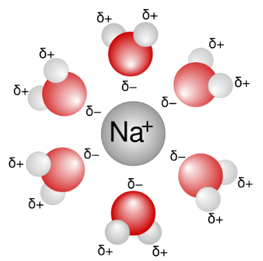 {left=64.41 top=12.10 width=33.85 height=59.55}

In case of water can be called hydration

---

Proton is solvated as well in form of
hydronium ion, H3O+(aq)

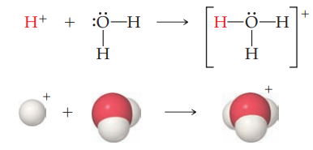 {left=21.64 top=18.99 width=40.21 height=34.26}

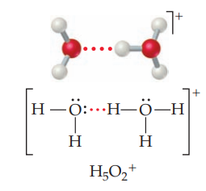 {left=42.96 top=56.11 width=26.56 height=43.89}

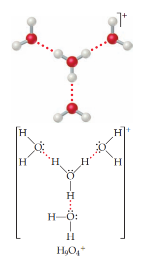 {left=69.35 top=5.74 width=29.49 height=94.26}

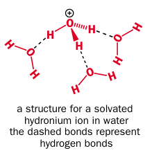 {left=18.75 top=57.48 width=20.68 height=41.16}

---

**Proton hopping (Grotthuss mechanism)** Short “hops” of protons between a series of hydrogen-bonded water molecules result in an extremely rapid net movement of a proton over a long distance. As a hydronium ion (upper left) gives up a proton, a water molecule some distance away (bottom) acquires one, becoming a hydronium ion. Proton hopping is much faster than true diffusion and explains the remarkably high ionic mobility of H+ ions compared with other monovalent cations such as Na+ and K+.

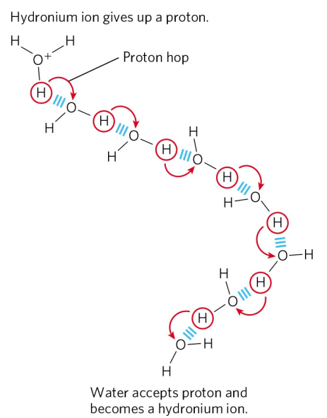 {left=73.65 top=0.00 width=25.17 height=57.22}

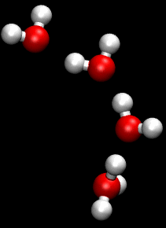 {left=46.07 top=1.76 width=23.53 height=57.49}

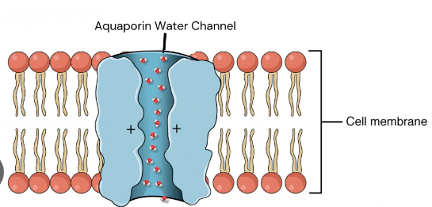 {left=70.68 top=26.58 width=13.67 height=17.78}

---

Protons are highly reactive: In fact, an isolated proton is so reactive that it will even add on to a molecule of methane in the gas phase to give CH5+ in a strongly exothermic reaction (can be seen during mass-spectroscopy)
Protons solvate
Protons can rapidly move in water
We will characterize solutions by the concentration of [H+]

Thus we will be concerned with their fate as they can significantly influence the chemistry of the processes

---

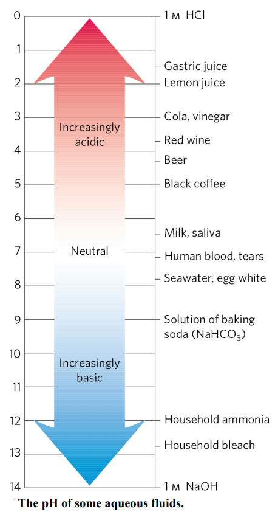 {left=68.47 top=-0.00 width=30.60 height=100.00}

Different books use interchangeably [H+] and [H3O+], we will do the same.

The measure of proton concentration is pH. Note that [H3O+] is measured in mol/L often designated M. Logarithm taken is base 10, NOT natural.

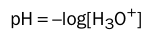 {left=34.46 top=58.95 width=15.62 height=6.67}

---

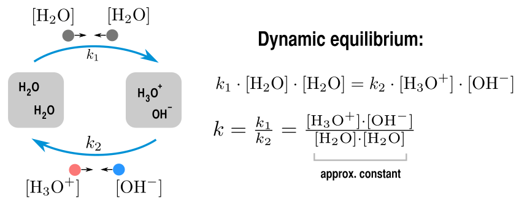 {left=17.28 top=31.57 width=82.72 height=57.88}

 {left=35.89 top=19.71 width=36.90 height=6.67}

autoprotolysis of water

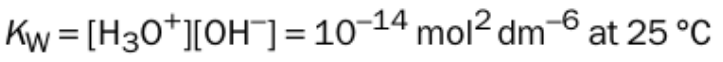 {left=34.87 top=89.46 width=65.13 height=9.93}

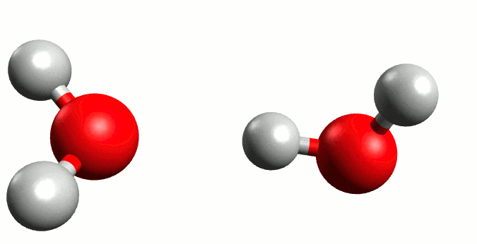 {left=74.92 top=5.21 width=23.24 height=21.18}

Law of mass action:

---

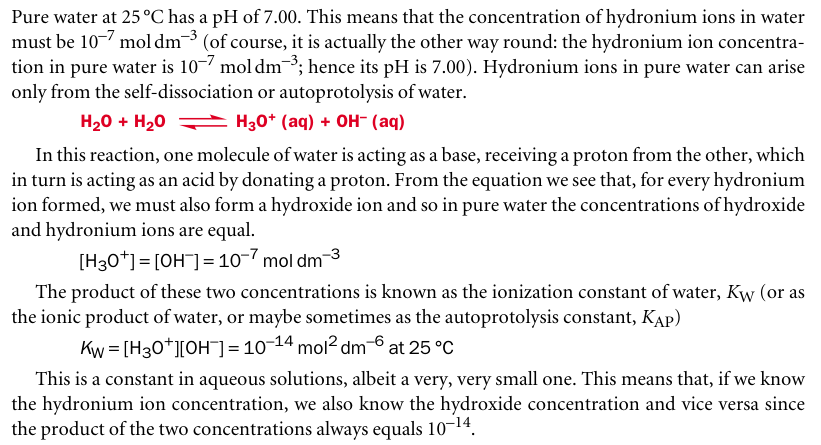 {left=16.87 top=17.44 width=80.90 height=59.94}

autoprotolysis of water

**NOTE:** pKw = -log(Kw) = pH + pOH
pH + pOH = 14

---

 {left=33.21 top=4.75 width=36.90 height=6.67}

Water dissociation occurs **endothermically **(due to electric field fluctuations between neighboring molecules). Thus **increase **in temperature shifts equilibrium to the **right**.

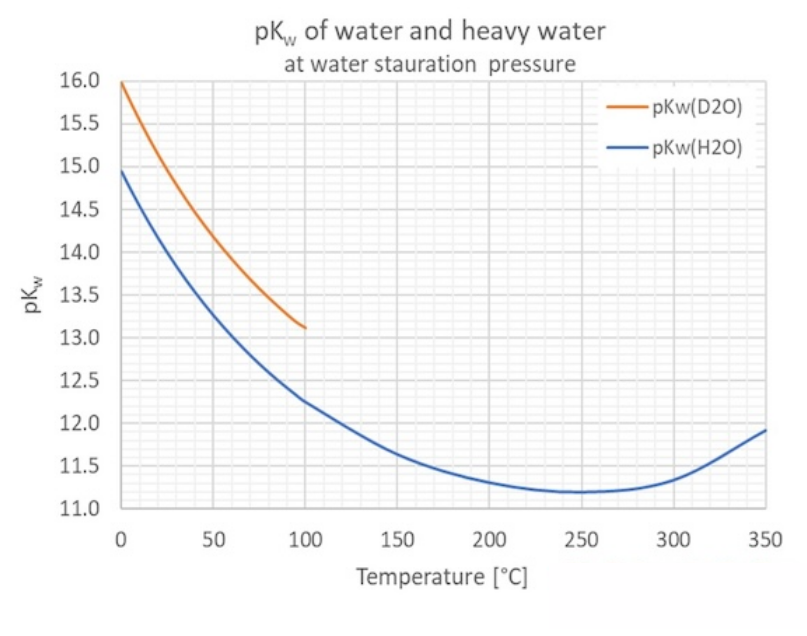 {left=18.92 top=33.40 width=47.16 height=66.08}

---

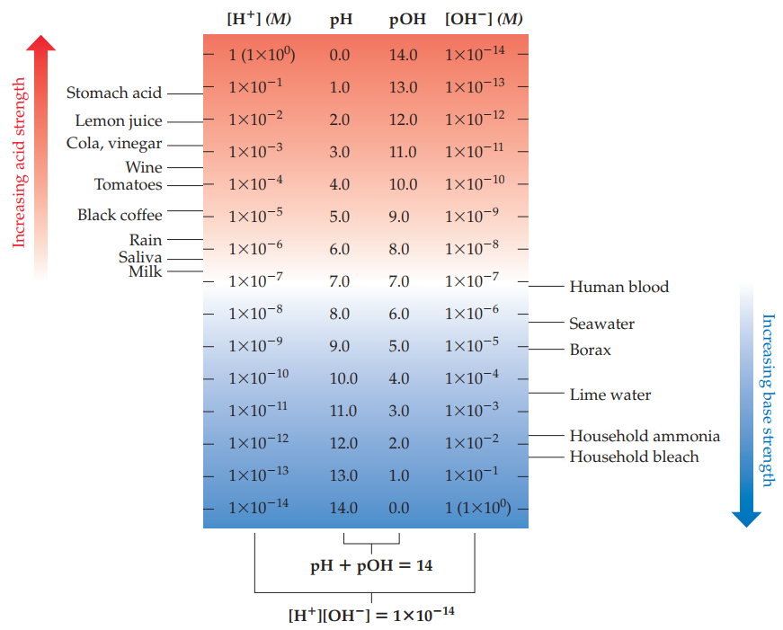 {left=30.11 top=0.00 width=69.89 height=100.00}

---

A **Brønsted–Lowry acid** is a substance that donates a proton (H+), and a
**Brønsted–Lowry base** is a substance that accepts a proton.

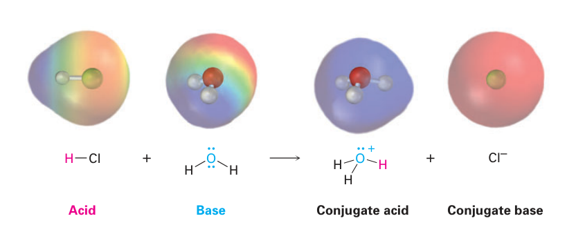 {left=18.54 top=14.41 width=57.64 height=42.41}

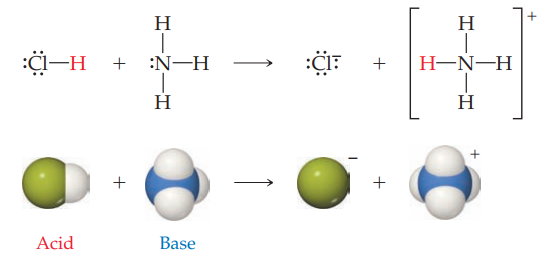 {left=36.56 top=62.09 width=44.69 height=37.91}

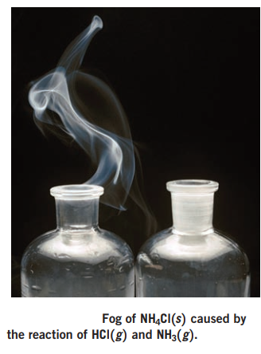 {left=81.25 top=54.88 width=18.75 height=45.12}

Definition is valid not only in liquid phase (though that is the most interesting case)

The transfer of a proton always involves both an acid (donor) and a base (acceptor).
In other words, a substance can function as an acid only if another substance simulta-
neously behaves as a base.

---

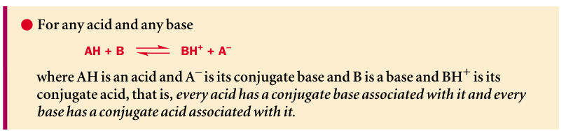 {left=15.83 top=0.00 width=84.17 height=34.81}

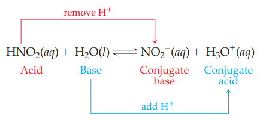 {left=16.63 top=35.50 width=35.04 height=29.00}

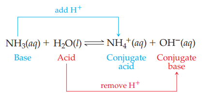 {left=56.46 top=34.81 width=35.04 height=30.63}

Water can act both as acid and base
We will always suppose water as a solvent (concentration much greater)
[H3O+] and [H+] will be used interchangeably
pH-meter measures concentration of H+
NOTE: [H+][OH-] = 10^-14

---

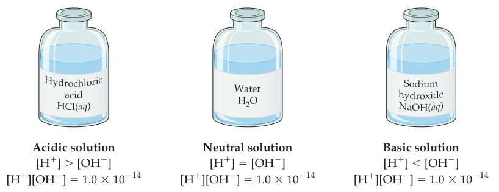 {left=19.43 top=0.00 width=80.57 height=55.34}

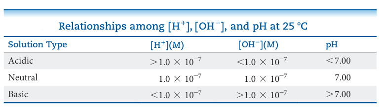 {left=21.01 top=58.63 width=77.41 height=38.74}

---

 {left=35.88 top=30.62 width=41.04 height=5.19}

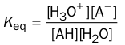 {left=19.74 top=39.44 width=16.25 height=10.56}

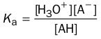 {left=20.31 top=61.17 width=15.10 height=10.56}

Acid may not fully dissociate. Depending on the dissociation level we  call acids strong, week, or negligible (not acids). Strong acids fully dissociate, not acids do not dissociate.

We need a way to quantify this

The position of equilibrium is measured by the equilibrium constant for this reaction

The concentration of **water **remains essentially **constant **(at 55.56 mol/dm^3) with **dilute **solutions. Thus we define the **acidity constant**.

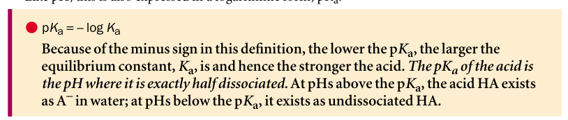 {left=21.38 top=74.48 width=78.62 height=25.52}

---

 {left=31.16 top=17.61 width=41.04 height=5.19}

For weak acids :

Likewise for weak bases:

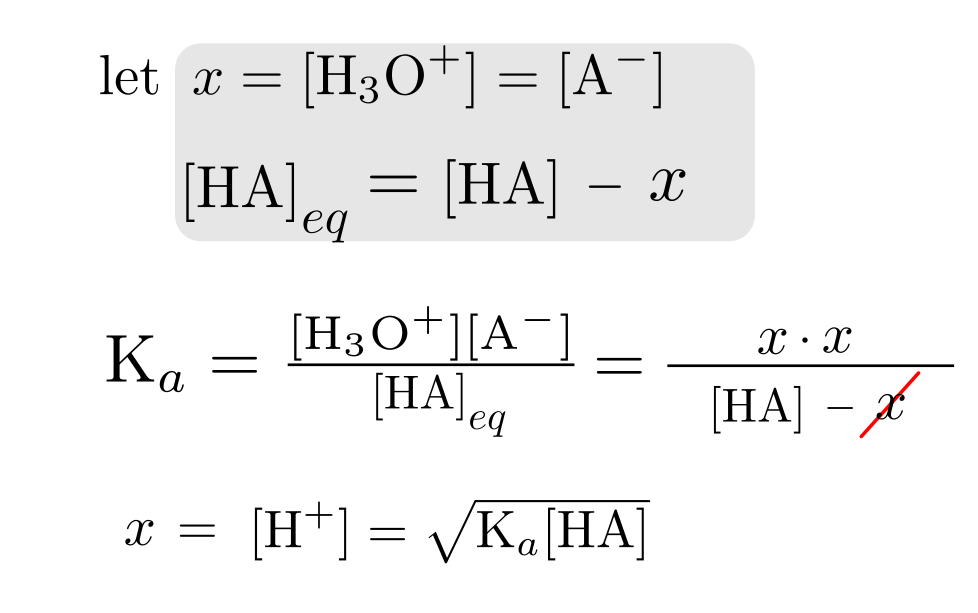 {left=56.57 top=28.91 width=39.12 height=43.59}

 {left=33.69 top=44.08 width=20.03 height=10.21}

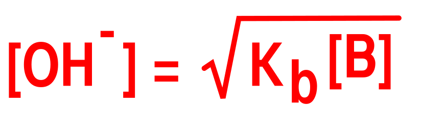 {left=34.51 top=75.58 width=20.97 height=11.54}

**Wilhelm Ostwald’s Laws of dilution:**

---

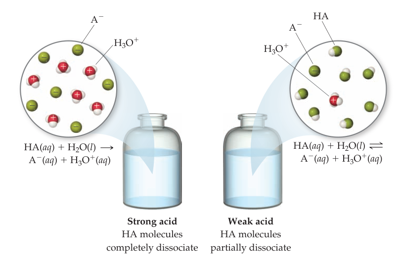 {left=18.32 top=2.96 width=81.68 height=94.07}

---

1. A **strong acid **completely transfers its protons to water, leaving essentially no undissociated molecules in solution.
2. A **weak acid** only partially dissociates in aqueous solution and therefore exists in the solution as a mixture of the undissociated acid and its conjugate base. 
3. A substance with **negligible acidity** contains hydrogen but does not demonstrate any acidic behavior in water.

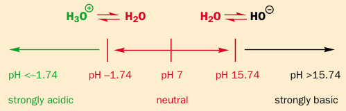 {left=38.97 top=32.89 width=61.03 height=67.11}

Strong acid -> negligible conjugate base;

Weak acid -> weak conjugate base;

Negligible acidity-> strong conjugate base;

---

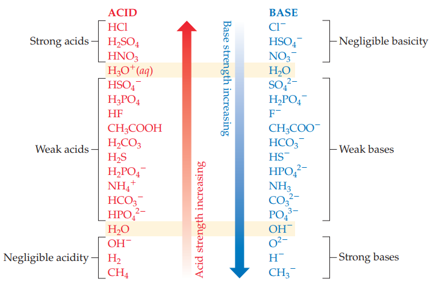 {left=24.58 top=6.11 width=75.42 height=87.78}

---

Example: Strong acid

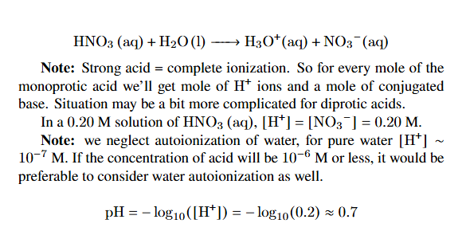 {left=18.37 top=18.29 width=70.73 height=63.41}

---

Example: Strong Base (negligible acid)

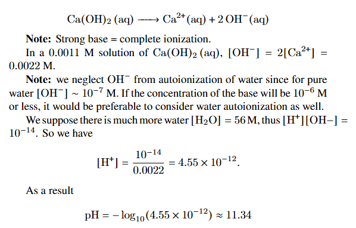 {left=24.17 top=18.33 width=62.29 height=70.74}

---

Example: Weak acid

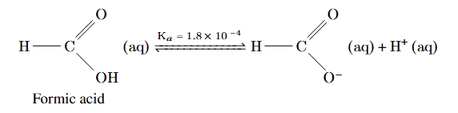 {left=37.12 top=13.71 width=44.51 height=79.68}

---

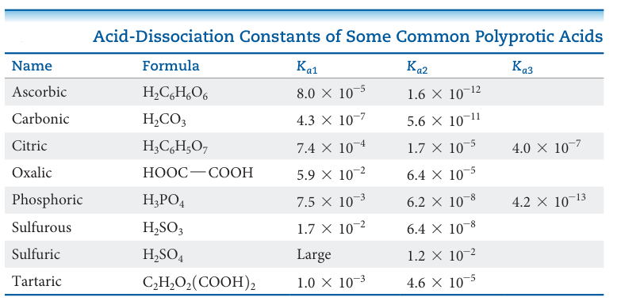 {left=18.96 top=29.63 width=81.04 height=70.37}

It is always easier to remove the first proton from a polyprotic
acid than to remove the second. Similarly, for an acid with three ionizable protons, it is easier to remove the second proton than the third.

---

Henderson-Hasselbalch equation

Note: equation is still true if A- is a common ion

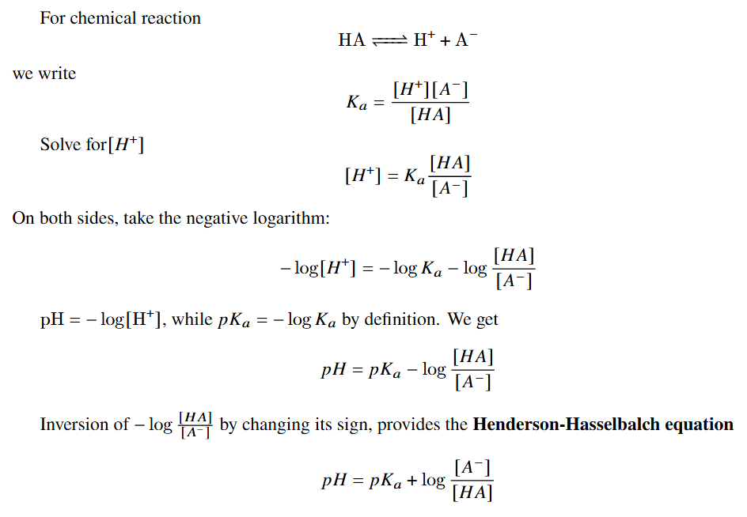 {left=29.82 top=14.17 width=58.19 height=71.67}

---

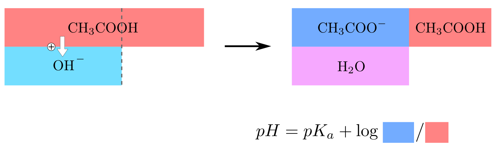 {left=23.09 top=33.55 width=70.72 height=39.23}

Titration of weak acid with strong base / creating buffer

Proton from CH3COOH is transferred

Henderson-Hasselbalch equation still applies. 

Note: we can get the final situation by mixing weak acid and salt, say CH3COONa

---

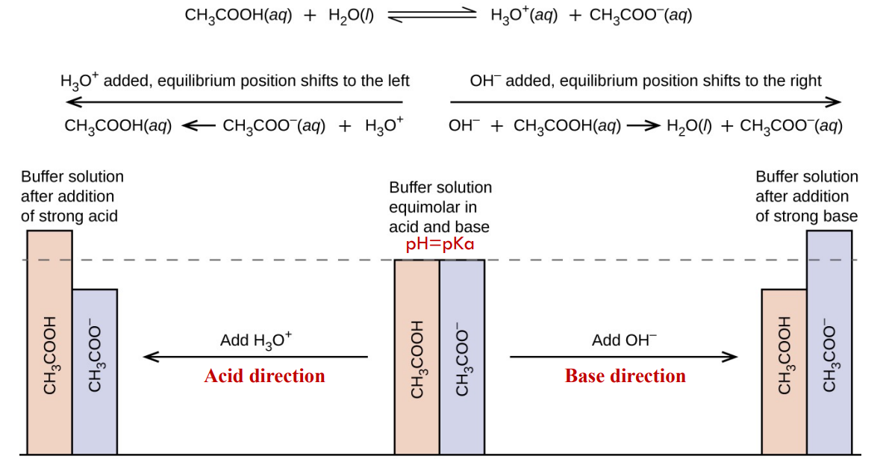 {left=34.96 top=40.09 width=65.04 height=59.91}

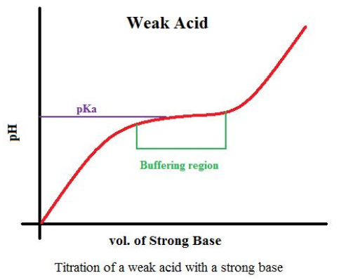 {left=34.96 top=-0.00 width=25.50 height=37.45}

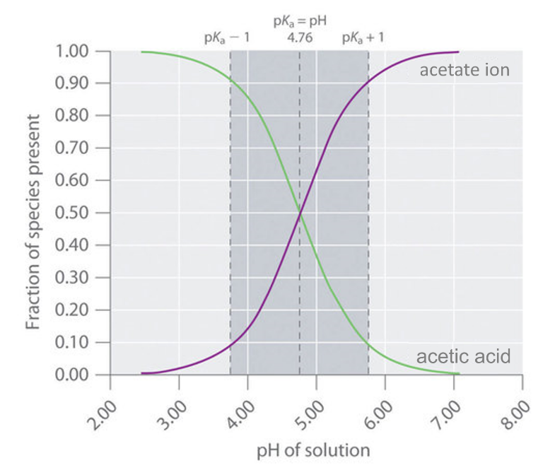 {left=74.50 top=-0.00 width=25.50 height=38.41}

**Buffers**

Most cases weak acid and a salt are used. 

Most practical cases salt is considered as fully dissociated, [H+] from water and [A-] from acid neglected

---

Here’s a plot of ln((1-x)/(1+x)) to get the idea of possible curves

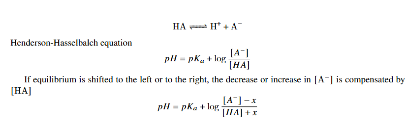 {left=21.23 top=-0.00 width=79.21 height=43.42}

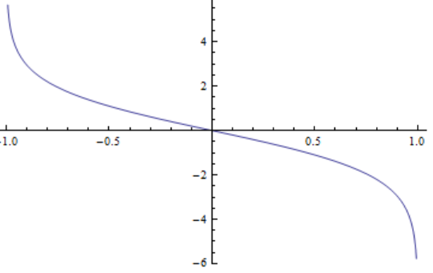 {left=43.52 top=61.14 width=34.62 height=38.86}

---

**Notable buffers in human body**
**1. Bicarbonate buffer (H₂CO₃ / HCO₃⁻)**
**Most important extracellular buffer**, especially in blood plasma.
Works with the lungs (exhaling CO₂) and kidneys (adjusting HCO₃⁻) for rapid and long-term control.
Maintains blood pH near **7.4**.
**2. Phosphate buffer (H₂PO₄⁻ / HPO₄²⁻)**
Important in **intracellular fluid** and **renal tubules**.
Has a **pKₐ ≈ 6.8**, close to physiological pH, so it is effective inside cells.
**3. Protein buffer systems**
Proteins act as buffers via ionizable side chains (e.g., **histidine imidazole group**).
Very important inside cells and in plasma (albumin is a major buffer in blood).
**4. Hemoglobin buffer**
A subset of the protein buffer system but often mentioned separately.
Hemoglobin binds both **protons (H⁺)** and **CO₂ (as carbamino groups)**.
Works in tandem with the bicarbonate system (Bohr effect, Haldane effect).
Crucial for pH regulation during gas transport in blood.

---

Mixing two acids

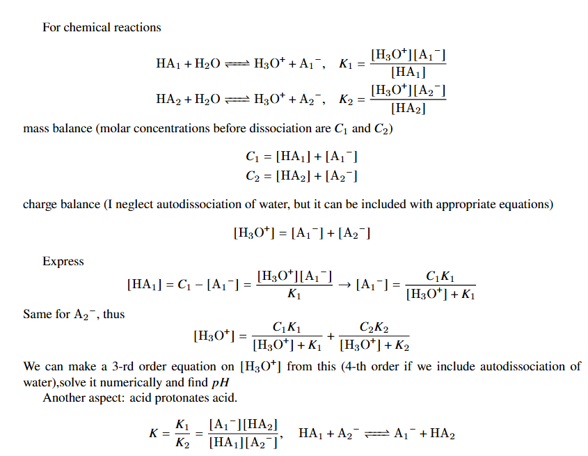 {left=33.10 top=-0.00 width=66.90 height=92.19}

---

**Weak A–H bonds make stronger acids**

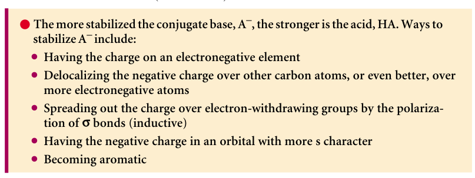 {left=16.16 top=30.36 width=78.39 height=52.33}

Acid strength

---

**The negative charge on an electronegative element stabilizes the conjugate base**

Example: F– is much more stable than CH3–, because fluorine is much more electronegative than carbon.

The pKa of ammonia is much greater than the pKa of water (about 33 compared with 15.74). This is because oxygen is more electronegative than nitrogen and so can stabilize the negative charge better.

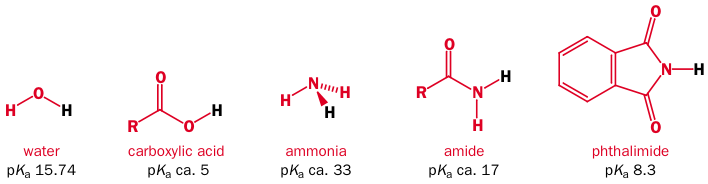 {left=18.88 top=60.56 width=77.71 height=39.44}

---

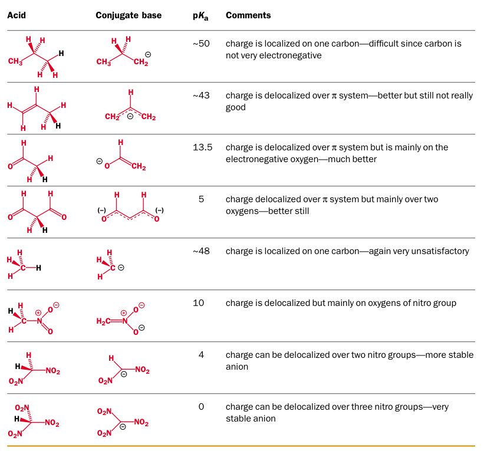 {left=60.81 top=0.00 width=39.19 height=64.93}

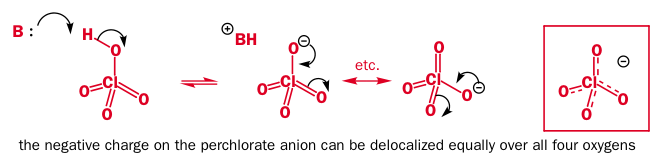 {left=17.88 top=41.58 width=37.47 height=16.83}

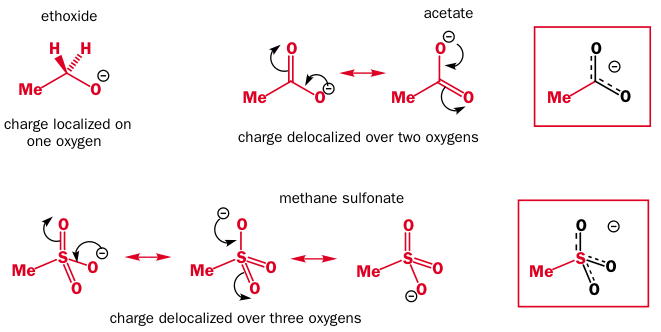 {left=15.28 top=64.93 width=39.19 height=35.00}

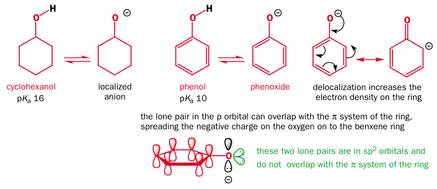 {left=54.47 top=64.93 width=45.53 height=35.00}

**Delocalization of the negative charge stabilizes the conjugate base**

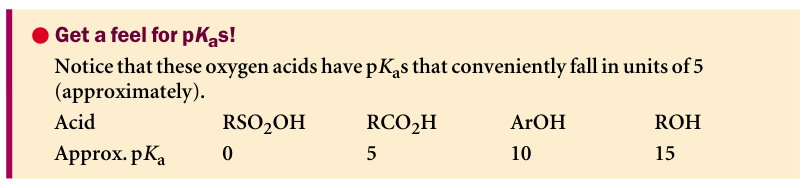 {left=16.63 top=20.00 width=40.10 height=16.55}

The acids HClO, HClO2, HClO3, and HClO4 have pKa values 7.5, 2, –1, and about –10, respectively.

ethanol (pKa, 15.9), acetic acid (4.8), and methane sulfonic acid (–1.9)

---

It **isn’t necessary** for a group to be conjugated in order to spread the negative charge: any group that withdraws electrons will help to stabilize the conjugate base and therefore increase the strength of the acid. Some examples are shown below for both oxygen and carbon acids.

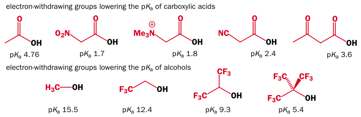 {left=19.65 top=25.37 width=60.69 height=35.18}

Such inductive effects become less significant as the electron-withdrawing group gets further away from the negative charge

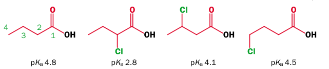 {left=19.65 top=75.80 width=53.28 height=20.10}

---

**Hybridization can also affect the pKa**

Since s orbitals are held closer to the nucleus than are p orbitals, the electrons in them are lower in energy, that is, more stable. Consequently, the more s character an orbital has, the more tightly held are the electrons in it.

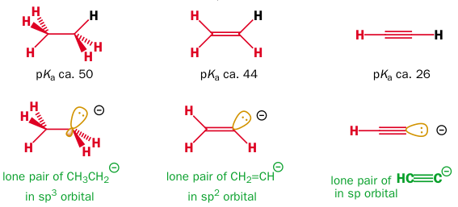 {left=16.07 top=16.15 width=43.56 height=35.10}

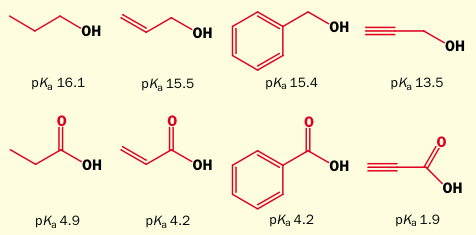 {left=21.63 top=57.17 width=78.37 height=42.83}

---

**Aromaticity can stabilize the anion**

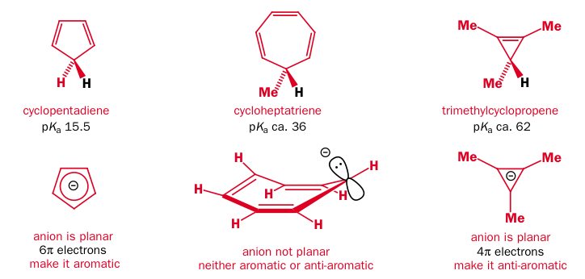 {left=16.07 top=16.33 width=75.42 height=64.07}

---

**Electron-donating groups decrease acidity**

Electron-donating groups destabilize the conjugate base because, instead of helping to spread out the negative charge, they actually put more in. The most common electron-donating groups encountered in organic chemistry are the **alkyl **groups. These are **weakly **electron-releasing

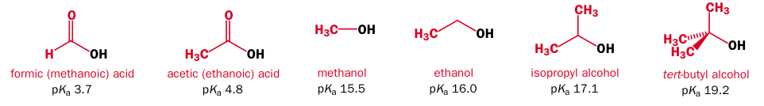 {left=17.05 top=38.83 width=79.37 height=19.65}

Resonance delocalization in ester ->
Thus ‘etoxide part’ is electron-releasing

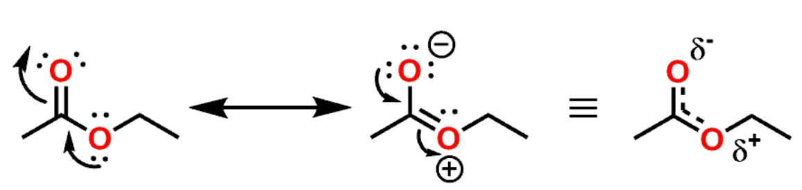 {left=59.60 top=59.59 width=36.82 height=15.51}

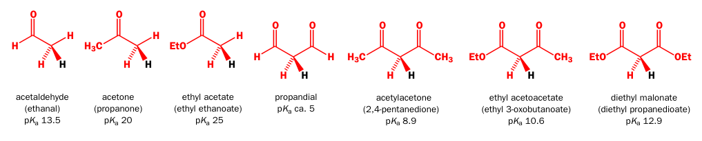 {left=16.07 top=75.11 width=69.12 height=24.89}

---

**Basicity**

How to quantify? we simply look up the pKa value for the neutral conjugate acid.

The **higher the pKₐ of the conjugate acid (pKₐH)** → the **stronger the base**.The **lower the pKₐH** → the **weaker the base**.

Example: If we want to know the **basicity **of ammonia, we must look up the pKa of its conjugate acid, the ammonium cation, NH4+, protonated ammonia. Its pKa is 9.24 which means that ammonia is a weaker base than hydroxide

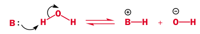 {left=30.36 top=16.99 width=41.15 height=12.59}

Conjugated acid

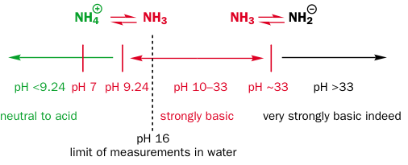 {left=38.24 top=67.47 width=45.16 height=32.53}

---

**What factors affect how basic a compound is?**

This really is the same as the question we were asking about the strength of an acid—the more ‘stable’ the base, the weaker it is. 

The more accessible the electrons are, the stronger the base is. Therefore a negatively charged base is more likely to pick up a proton than a neutral one. The accessibility of the lone pair depends on its energy— it is usually the HOMO of the molecule and so, the higher its energy, the more reactive it is and hence the stronger the base. 
to what extent can the resultant positive charge formed be stabilized either by delocalization or by the solvent. A compound in which the negative charge is delocalized is going to be less basic than one with a more concentrated, localized charge, and so on.

 {left=32.40 top=16.67 width=41.15 height=12.59}

---

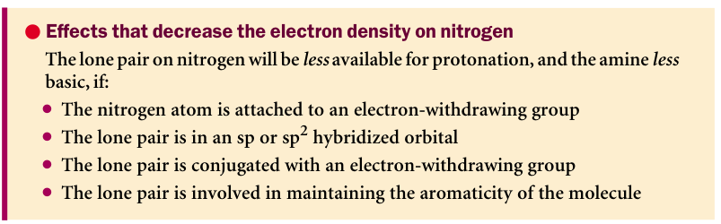 {left=21.41 top=2.31 width=78.59 height=43.50}

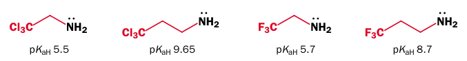 {left=26.52 top=48.59 width=70.52 height=15.11}

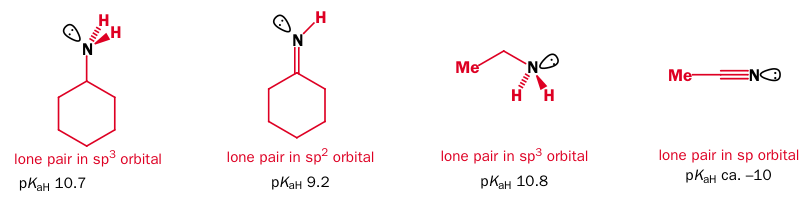 {left=24.49 top=66.48 width=74.59 height=33.52}

---

pH in chemistry

titration

---

Titration of strong acid (HCl) with strong base (NaOH) and strong base with strong acid. Note rapid change in pH near equivalence point.

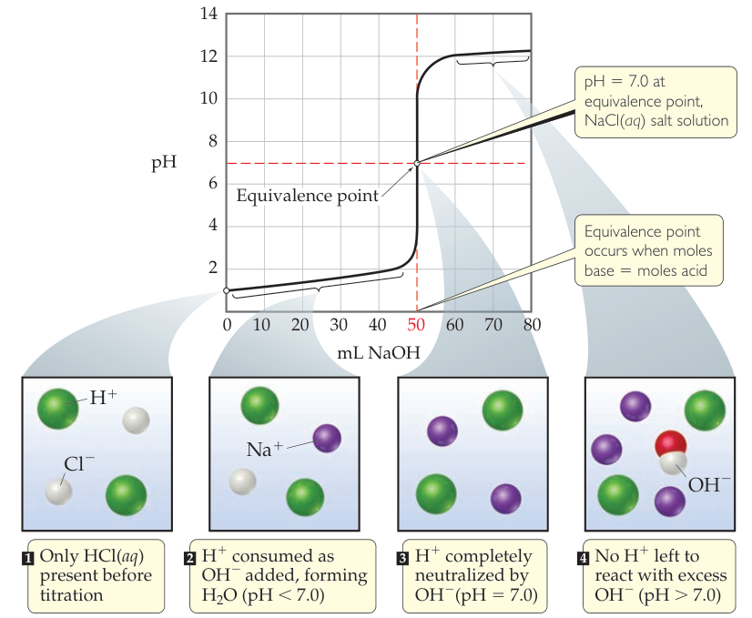 {left=16.07 top=24.28 width=50.47 height=73.76}

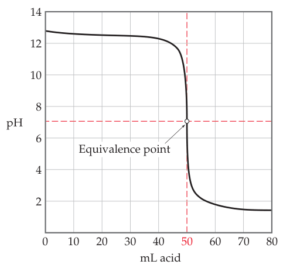 {left=68.02 top=47.25 width=30.12 height=50.78}

---

Titration of weak acid (CH3COOH) with strong base (NaOH) and titration curves for different acids overlayed

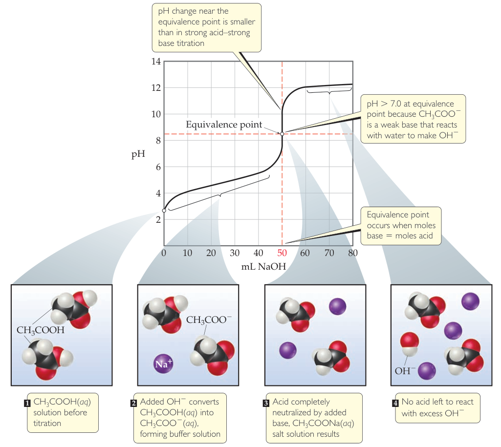 {left=17.08 top=23.28 width=46.48 height=73.76}

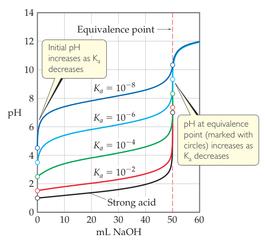 {left=66.89 top=45.06 width=33.11 height=53.49}

---

Titration in practice

 {left=17.18 top=15.73 width=80.35 height=80.35}

---

Choosing indicators for weak acid + strong base and weak base + strong acid.

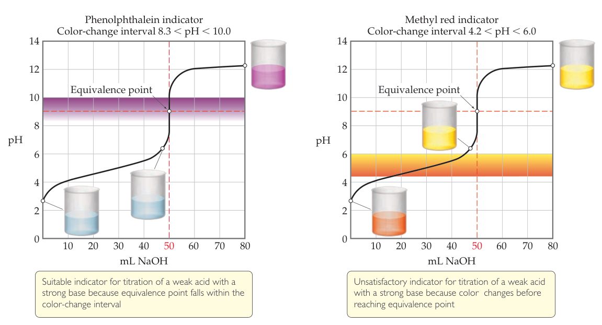 {left=50.00 top=52.43 width=49.51 height=47.57}

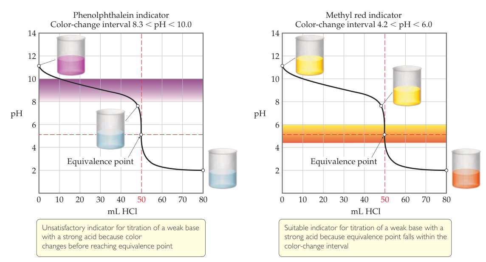 {left=50.49 top=0.00 width=49.51 height=47.55}

---

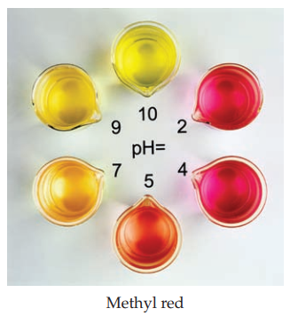 {left=15.94 top=0.00 width=23.30 height=45.10}

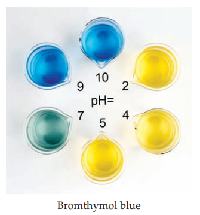 {left=46.65 top=0.00 width=23.30 height=44.40}

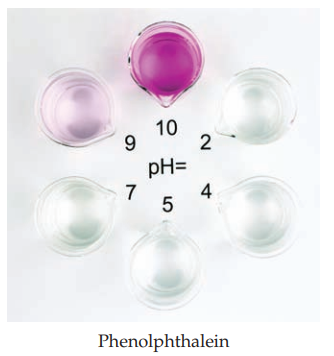 {left=75.29 top=0.12 width=23.30 height=44.16}

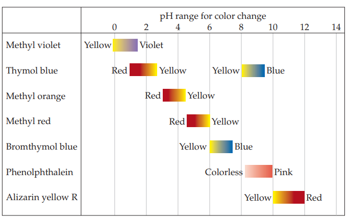 {left=48.94 top=44.16 width=50.77 height=56.02}

pH ranges for common acid–base indicators. Most indicators have a useful
range of about 2 pH units.

---

Red cabbage contains chemicals sensitive to pH

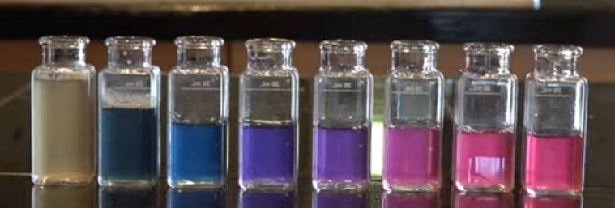 {left=34.41 top=70.60 width=46.10 height=27.75}

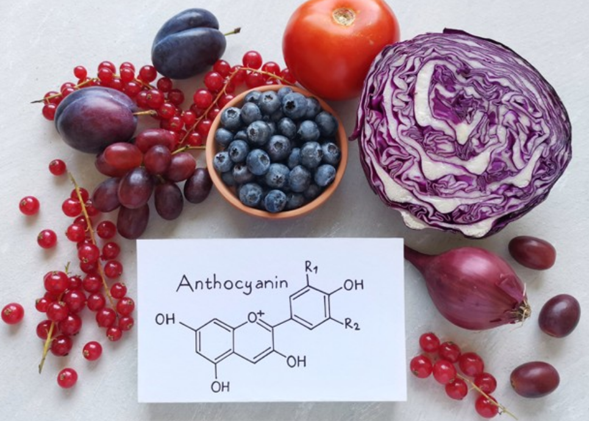 {left=62.91 top=20.47 width=36.16 height=45.92}

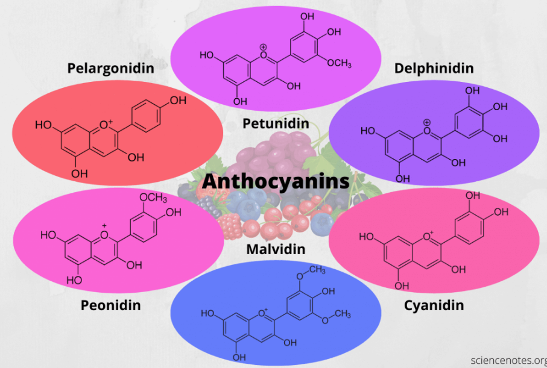 {left=17.36 top=18.33 width=41.92 height=50.21}

---

Polyprotic acid titration curve

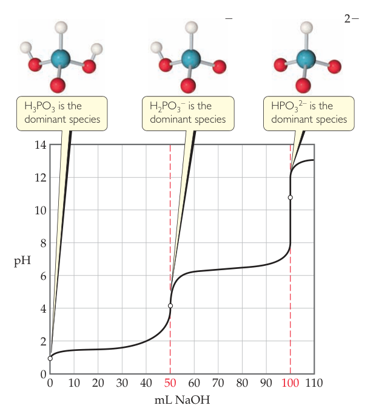 {left=64.11 top=30.33 width=35.89 height=69.67}

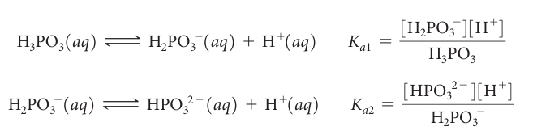 {left=31.56 top=0.00 width=68.44 height=31.85}

---

pH in medicine

Solubility of drugs

---

In the same way, organic bases such as amines can be dissolved by lowering the pH

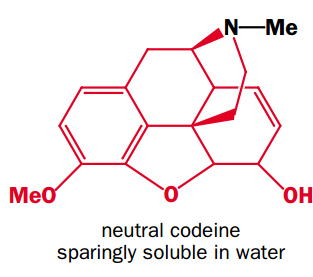 {left=31.98 top=71.07 width=17.49 height=27.51}

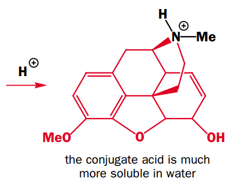 {left=50.14 top=69.17 width=19.76 height=27.51}

At pHs above the pKa of the acid, it will also be more soluble in water

A higher pH means a lower concentration of hydrogen ions (H+). This allows the weak acid to lose its proton (H+) and become deprotonated. 
The deprotonated, charged form of the acid is a salt, which is much more soluble in polar solvents like water than the neutral, protonated acid. 
Le Chatelier's principle applies here: as H+ is removed at high pH, the acid dissociation equilibrium shifts to the right, favoring the formation of more of the soluble, deprotonated form.

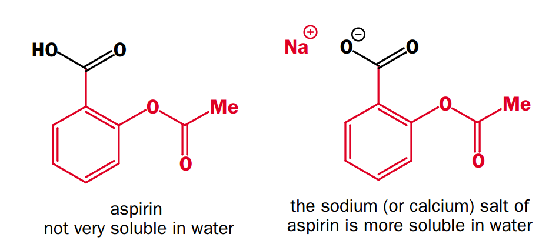 {left=33.17 top=31.19 width=37.84 height=30.29}

---

**Cellulose acetate phthalate** (CAP), also known as cellacefate (INN) and cellulosi acetas phthalas

commonly used polymer phthalate in the formulation of pharmaceuticals, such as the enteric coating of tablets or capsules and for controlled release formulations.
Enteric coatings based on CAP are resistant to acidic gastric fluids, but easily soluble in mildly basic medium of the intestine. The pH sensitive solubility of CAP is mainly determined by the degree of substitution, namely the average number of substituent groups bound to an anhydroglucose unit, as well as by the molar ratio (acetyl and phthaloyl groups). These two structural characteristics of the polymer are dependent on the method employed for its synthesis.

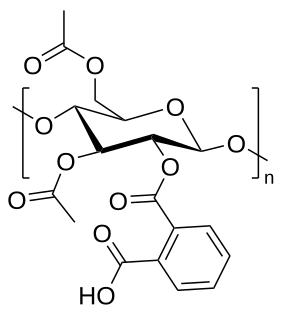 {left=73.02 top=13.71 width=22.40 height=42.42}

 {left=74.02 top=60.29 width=22.40 height=39.71}

---

pH in chemistry

acid–base extraction

---

Charged compounds can be separated by acid–base extraction

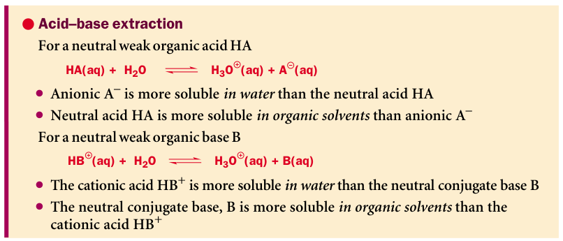 {left=16.89 top=20.32 width=83.96 height=63.89}

---

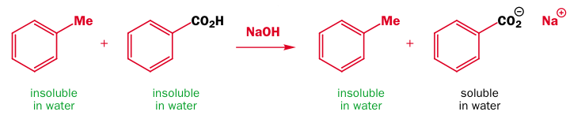 {left=20.67 top=20.81 width=79.33 height=58.38}

---

A bit different reaction, but same idea. Note how separatory funnel is used. Green substance is food coloring added to make separation better visible.

 {left=20.03 top=25.26 width=72.43 height=72.43}

---

pH in analysis

H1 spectrum reveals acidic protons

---

The same -OH shows very different chemical shifts depending on the functional group

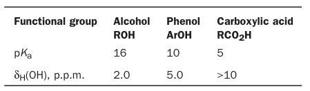 {left=32.86 top=15.70 width=46.77 height=24.44}

This is a matter of acidity. The more acidic a proton is—that is, the more
easily it releases H+ —the more the OH bond is polarized towards oxygen. 

The more the RO–H bond is polarized, the closer we are to free H+, which would have no shielding electrons at all, and so the further the proton goes downfield. The OH chemical shifts and the acidity of the OH group are very roughly related.

You can even try getting pKa from H1 spectrum: <u>https://www.sciencedirect.com/science/article/abs/pii/S0731708513005992</u>

---

Chemical shifts in -OH protons

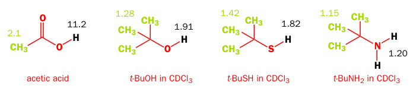 {left=16.07 top=6.54 width=71.98 height=26.85}

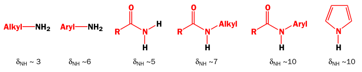 {left=16.07 top=63.84 width=75.85 height=29.56}

Amines and amides show a big variation, as you would expect for the variety of functional groups involved, and are summarized below. Amides are slightly acidic and amide protons resonate at quite low fields. Pyrroles are special—the aromaticity of the ring makes the NH proton unusually acidic and they appear at about 10 p.p.m.

Amines                                   Amides                                    Pyrrol

---

pH in analysis

Isoelectric focusing

---

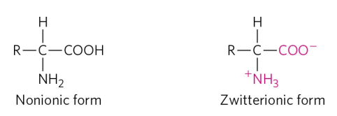 {left=56.50 top=3.23 width=33.47 height=20.49}

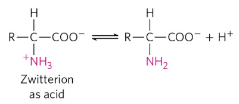 {left=69.73 top=23.72 width=27.61 height=21.30}

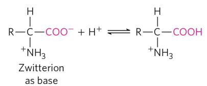 {left=69.18 top=44.26 width=28.71 height=21.30}

An amino acid contains both acidic (carboxylic acid fragment) and basic (amine fragment) centres. The isomer on the right is a **zwitterion**.

Titration performed with NaOH, thus OH- equivalents.

The shaded boxes, centered at about pK1 and pK2 indicate the regions of greatest buffering power.

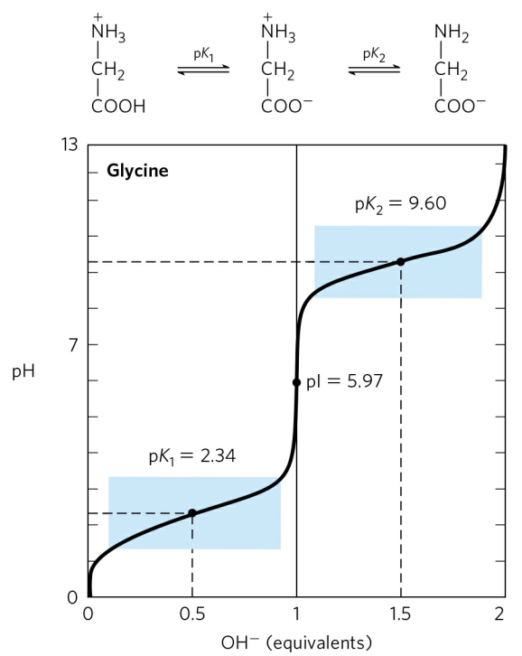 {left=15.63 top=25.45 width=33.47 height=74.74}

The **isoelectric point** (pI), is the pH at which a molecule carries no net electrical charge or is electrically neutral in the statistical mean.

---

Titration curves for (a) glutamate and (b) histidine. The pKa of the R group is designated here as pKR

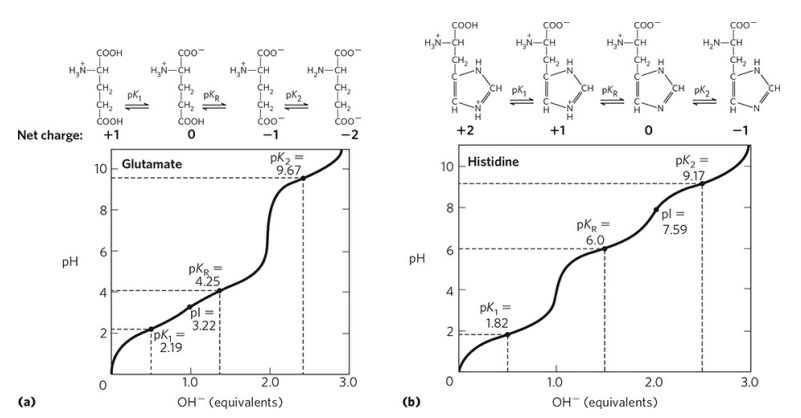 {left=21.48 top=13.53 width=74.51 height=69.12}

Amino acids with an ionizable R group have more complex titration curves, with more stages corresponding to the more possible ionization steps. Thus it will have more pK-s.

---

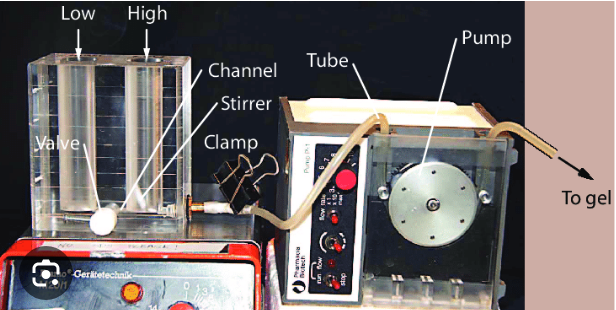 {left=15.84 top=52.42 width=49.87 height=44.61}

Gradient mixer (cool version)

Isoelectric focusing
Isoelectric focusing (IEF), also known as electrofocusing, is a technique for separating different charged molecules by differences in their isoelectric point (pI).It is a type of zone electrophoresis usually performed on proteins in a gel that takes advantage of the fact that overall charge on the molecule of interest, i.e. the net charge density, is a function of the pH of its surroundings.

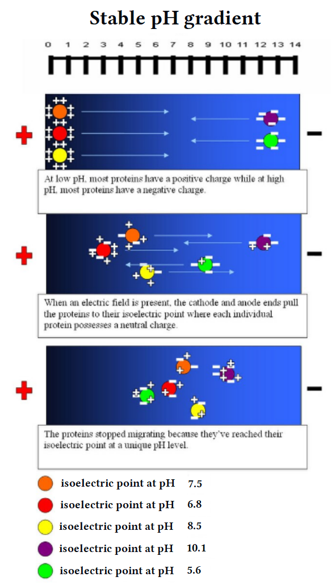 {left=70.02 top=0.00 width=29.98 height=94.07}

---

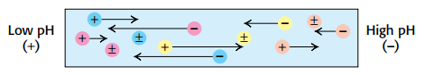 {left=64.98 top=34.29 width=32.96 height=9.55}

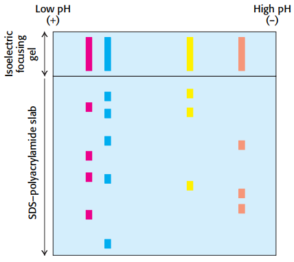 {left=64.98 top=43.84 width=32.96 height=53.36}

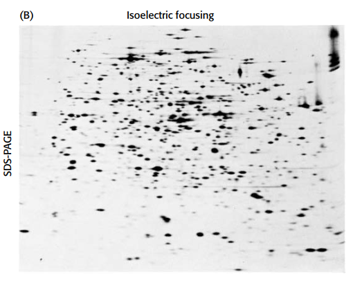 {left=21.34 top=44.01 width=37.70 height=53.36}

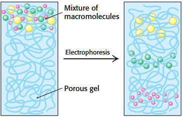 {left=23.49 top=2.96 width=33.42 height=38.08}

Two-dimensional electrophoresis. Isoelectric focusing can be combined
with SDS-PAGE to obtain very high resolution separations

---

pH in kitchen

Maillard reaction enhancement

---

 {left=45.17 top=0.00 width=54.83 height=51.24}

The Maillard reaction is a chemical reaction between amino acids and reducing sugars to create melanoidins, the compounds that give browned food its distinctive flavor.

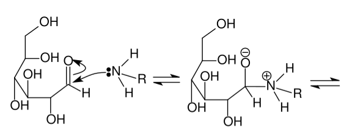 {left=55.20 top=55.88 width=43.95 height=31.79}

Nucleophilic attack as the first step (we will consider mechanisms later).

Note that alkaline conditions favour NH2 not NH3+, thus making proteins better nucleophiles and enhance Maillard browning

---

pH in biology

Enzymes prefer certain pH

---

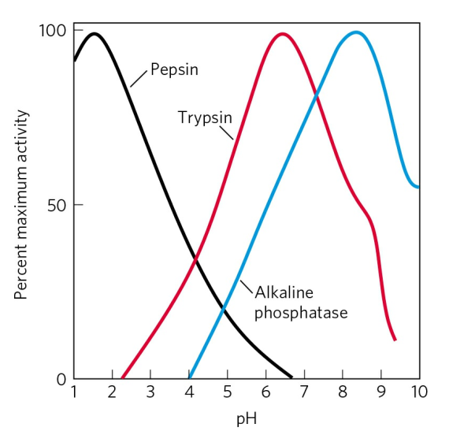 {left=69.86 top=0.00 width=30.14 height=51.88}

**The pH optima of some enzymes.**
 
Pepsin is a digestive enzyme secreted into gastric juice, which has a pH of ∼1.5, allowing pepsin to act optimally.
Trypsin, a digestive enzyme that acts in the small intestine, has a pH optimum that matches the neutral pH in the lumen of the small intestine (6.1 to 7.0 in the duodenum, 7.5 distal ileum).
Alkaline phosphatase of bone tissue is a hydrolytic enzyme thought to aid in bone mineralization

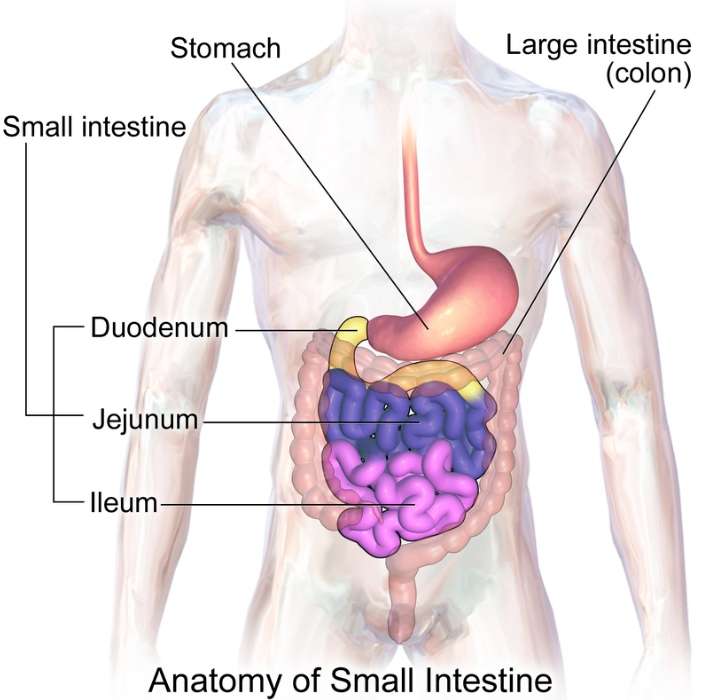 {left=71.01 top=50.00 width=28.21 height=50.00}

---

pH in biology

Effects on hemoglobin

---

Hemoglobin

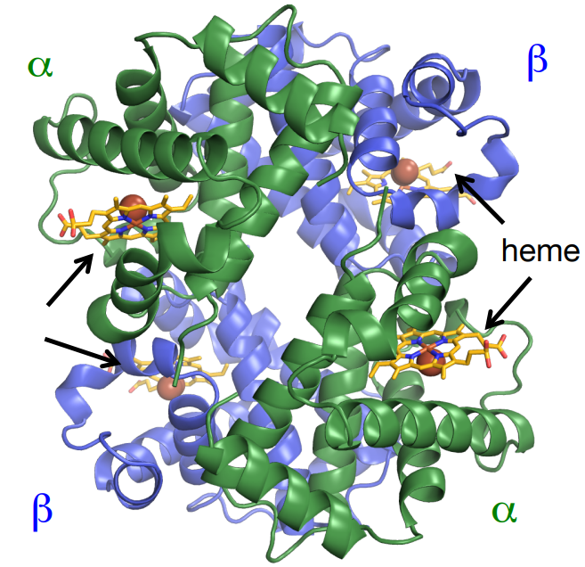 {left=57.14 top=-0.00 width=42.86 height=73.76}

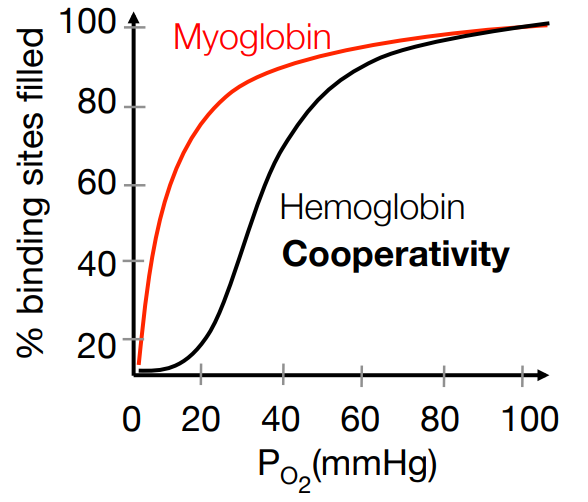 {left=17.79 top=18.01 width=36.73 height=55.75}

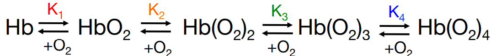 {left=23.08 top=73.76 width=66.34 height=13.37}

 {left=22.65 top=89.76 width=67.19 height=6.95}

---

**R state (relaxed)**: planar heme, Fe²⁺ inside porphyrin plane, high O₂ affinity.
**T state (tense):** Fe²⁺ pulled out of plane, salt bridges lock structure, low O₂ affinity.
Protonation shifts equilibrium toward T state.
R -> T transition

 {left=19.30 top=23.61 width=76.39 height=76.39}

---

T->R transition

 {left=16.67 top=20.32 width=79.68 height=79.68}

---

Oxygen binding

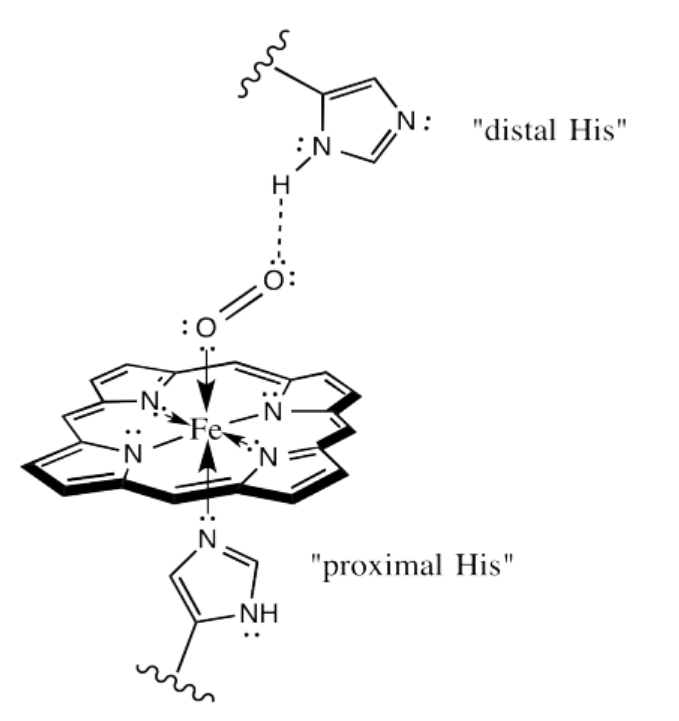 {left=41.34 top=20.32 width=39.40 height=74.37}

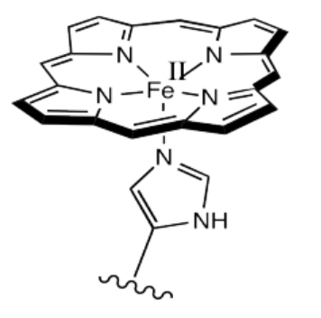 {left=79.29 top=16.36 width=20.71 height=36.41}

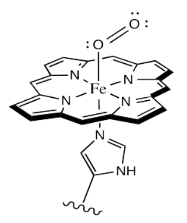 {left=80.73 top=59.29 width=19.27 height=40.70}

Fe–O₂ in Hb: 
~20–30 kJ/mol

Fe–CO in Hb: ~150–200 kJ/mol

---

Closer look at the mechanism

 {left=17.17 top=19.65 width=80.35 height=80.35}

---

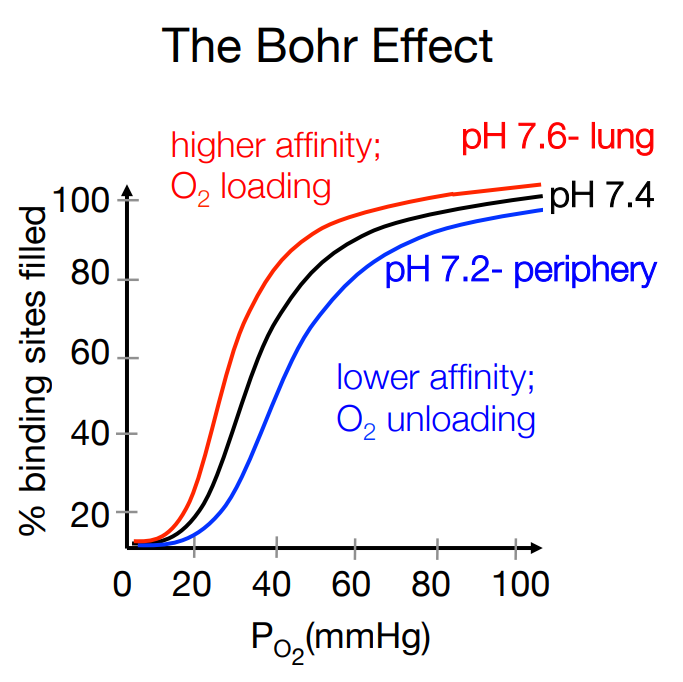 {left=16.74 top=8.10 width=36.96 height=54.46}

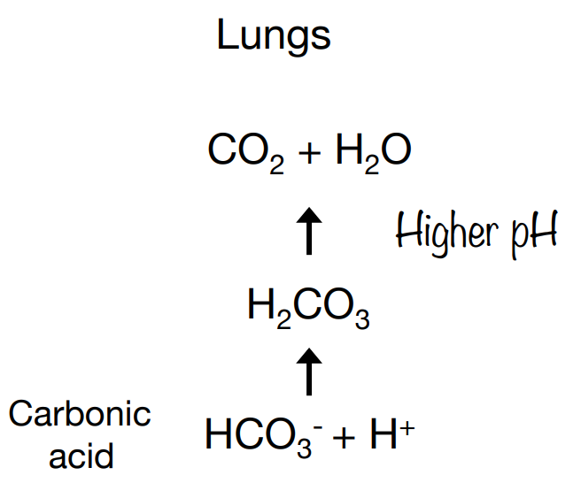 {left=75.72 top=21.95 width=23.23 height=34.38}

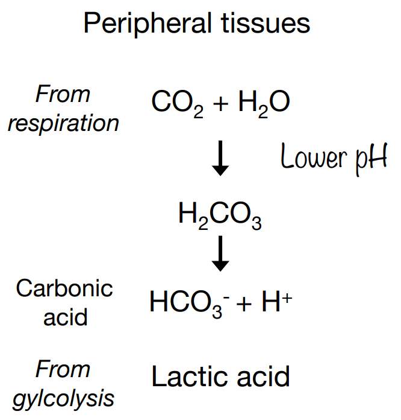 {left=53.71 top=16.97 width=22.02 height=40.91}

Bohr effect

Lower pH → more **protonation** of amino acid side chains (mainly histidines).
Protonated histidines form **salt bridges** (electrostatic bonds) with nearby residues.
These stabilize the **T state** (tense, low-affinity state) of hemoglobin.
Thus, O₂ release is favored in acidic conditions.

Additionally regulated with 2,3-BPG, but we will get to that in later lectures.

---

Different versions of hemoglobin

Fetal hemoglobin (HbF) is structurally different from normal adult hemoglobin (HbA), giving HbF a higher affinity for oxygen than HbA. HbF is composed of two alpha and two gamma chains, whereas HbA is composed of two alpha and two beta chains.

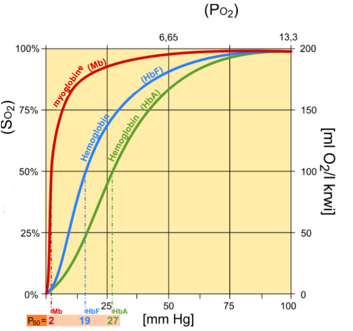 {left=57.05 top=8.47 width=32.77 height=54.58}

**Neonatal jaundice.** In newborns, jaundice tends to develop because of two factors—the breakdown of fetal hemoglobin as it is replaced with adult hemoglobin and the relatively immature metabolic pathways of the liver, which are unable to conjugate and so excrete bilirubin as quickly as an adult. This causes an accumulation of bilirubin in the blood (hyperbilirubinemia), leading to the symptoms of jaundice.

---

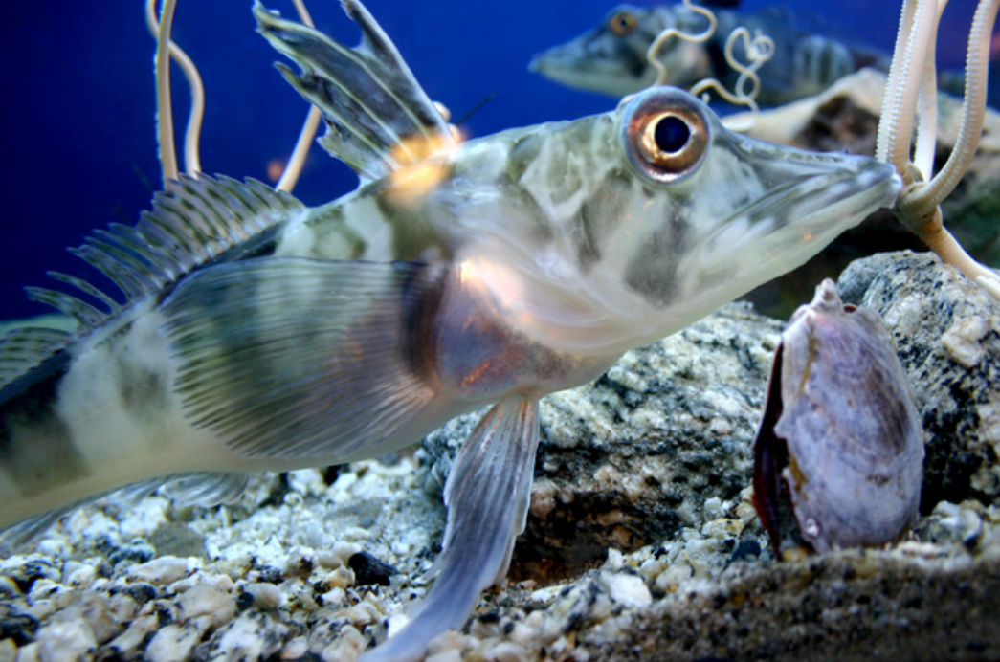 {left=61.41 top=0.00 width=38.59 height=45.43}

The crocodile icefish or white-blooded fish comprise a family (Channichthyidae) of notothenioid fish found in the Southern Ocean around Antarctica. They are the only known vertebrates to lack hemoglobin in their blood as adults.

Most fish have multiple hemoglobin types (isohemoglobins) adapted to varying oxygen levels, with different affinities. 

One or more of the isohemoglobins may exhibit the **Root effect**.

Some primitive species, like lampreys, have unique hemoglobin that dissociates into monomers for higher oxygen affinity. 

In contrast, icefish are an exception, with adult forms lacking hemoglobin entirely due to adaptations for cold, oxygen-rich environments.

---

**Evil twin - the Root effect**

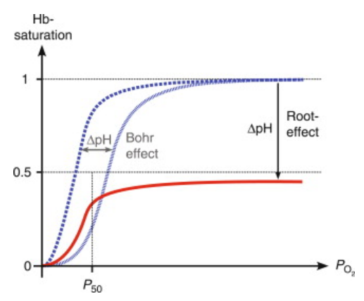 {left=50.00 top=-0.00 width=50.12 height=73.76}

**Bohr effect:** tunes O₂ delivery in tissues (affinity shift).
**Root effect (fish):** enables *massive O₂ release* under acidic conditions, even when blood is oxygen-rich — crucial for swim bladder inflation and retinal function.

It  not only decreases saturation up to atmospheric O2 levels, but also continues to be effective even at extremely high *P*O2 of several hundred atmospheres, severely limiting the O2-carrying capacity of the blood.

---

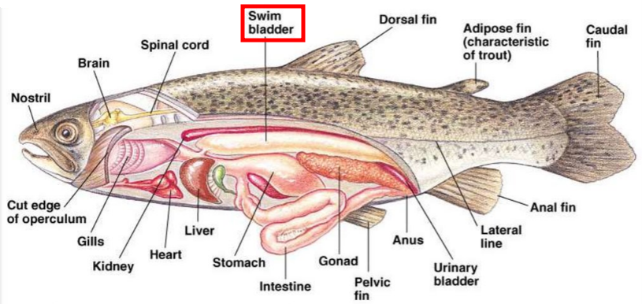 {left=26.42 top=0.00 width=69.62 height=58.62}

The **swim bladder**, gas bladder, fish maw, or air bladder is an internal gas-filled organ in bony fish that functions to modulate buoyancy, and thus allowing the fish to stay at desired water depth without having to maintain lift via swimming, which expends more energy.

The walls of the bladder contain very few blood vessels and are lined with guanine crystals, which make them **impermeable to gases **except for **oval window** and **rete mirabile**.

---

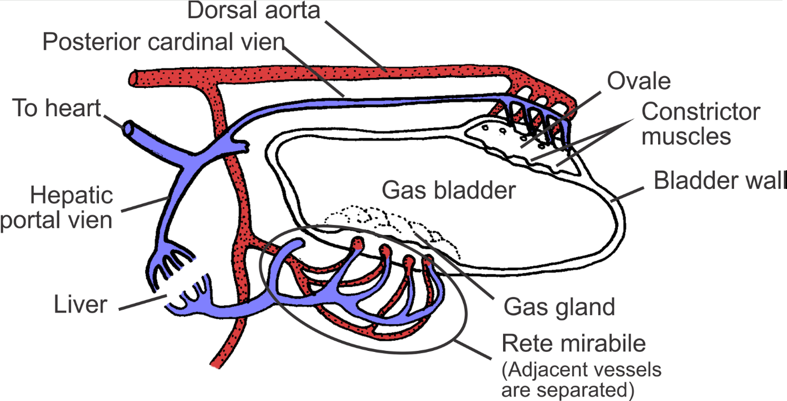 {left=21.00 top=0.00 width=68.39 height=62.10}

**Going DOWN.** As pressure increases the bladder shrinks and the gas gland has to introduce gas (usually oxygen) to keep its volume constant and thus buoyancy. 

gas gland excretes lactic acid and produces carbon dioxide
CO2 acidifies blood in the rete mirabile via the bicarbonate buffer system. 
Root effect causes the hemoglobin of the blood to lose its oxygen
O2 diffuses partly into the swim bladder.

---

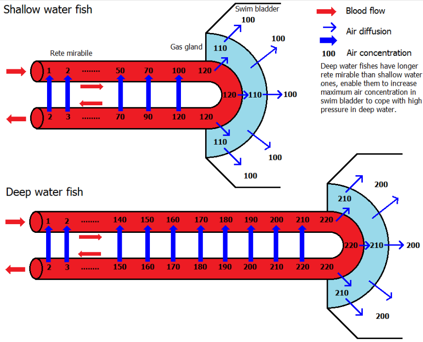 {left=35.54 top=-0.00 width=40.64 height=58.41}

Before returning to the body, the blood re-enters the rete mirabile, and as a result, virtually all the excess carbon dioxide and oxygen produced in the gas gland diffuses back to the arteries supplying the gas gland via a countercurrent multiplication loop.

A very high gas pressure of oxygen can be obtained, which can even account for the presence of gas in the swim bladders of deep sea fish like the eel, requiring a pressure of hundreds of bars.

---

**Going UP.** Pressure decreases and bladder expands dangerously. The **oval window** is a specific vascularized pouch on the posterior or dorsal wall of a fish's swim bladder that serves to resorb gases from the bladder, particularly in fish that have lost their pneumatic duct connection. It contains a specialized capillary network where muscle can relax to expose its vascular surface to the gases in the main bladder or constrict to separate it, facilitating the slow, controlled release of gas from the swim bladder to regulate buoyancy.

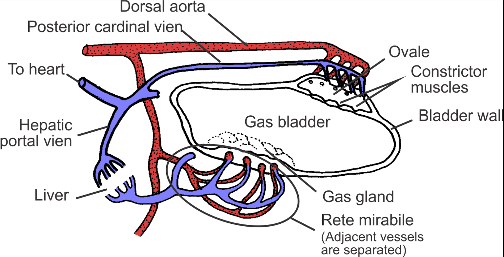 {left=23.23 top=0.00 width=68.39 height=62.10}

---

pH in biology

Taste of sourness

---

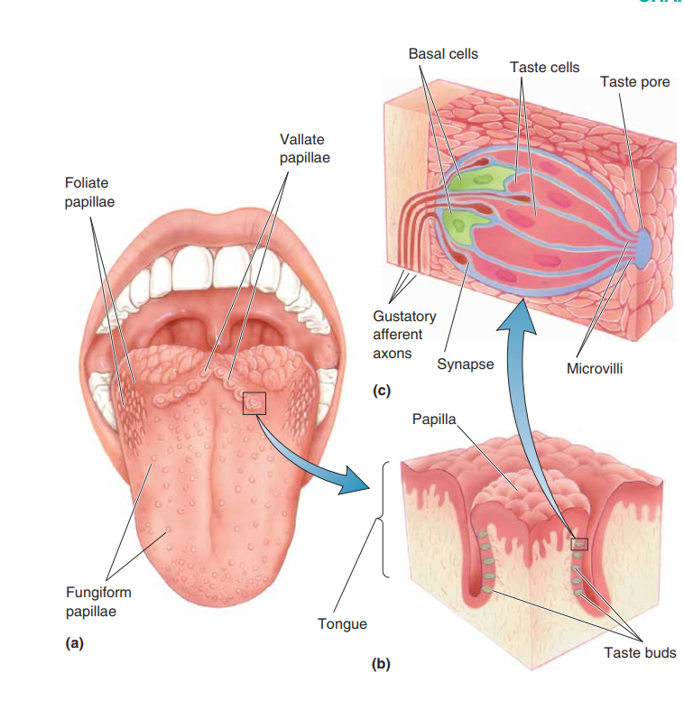 {left=60.95 top=28.84 width=39.05 height=71.16}

**(a)** Papillae are the taste-sensitive
structures. The largest and most posterior are the vallate papillae. Foliate papillae are elongated. Fungiform papillae are relatively large toward the back of the tongue and much smaller along the sides and tip. 
**(b)** A cross-sectional view of a vallate papilla, showing the locations of taste buds. 
**(c)** A taste bud is a cluster of taste cells (the receptor cells), gustatory afferent axons and their synapses with taste cells and basal cells. Microvilli at the apical end of the taste cells extend into the taste pore, the site where chemicals dissolved in saliva can
interact directly with taste cells.

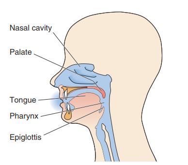 {left=57.62 top=-1.78 width=26.19 height=40.92}

---

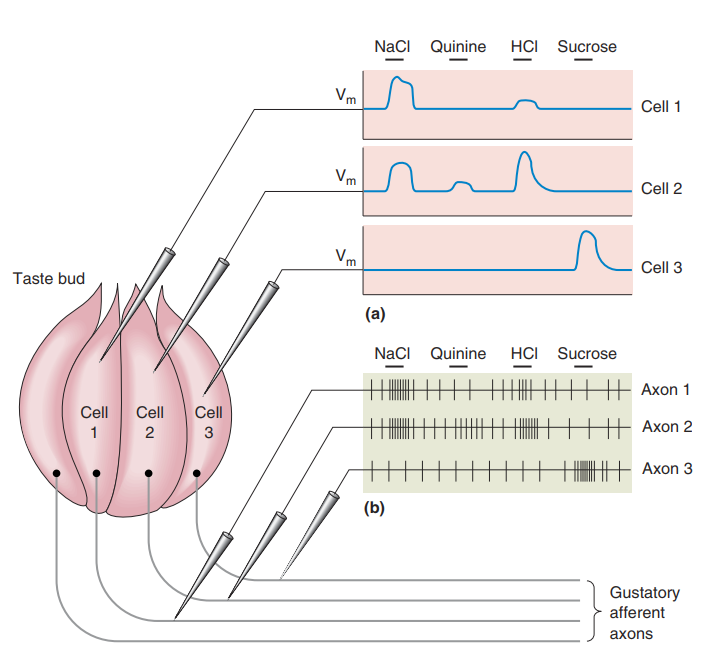 {left=60.58 top=-0.00 width=36.80 height=60.74}

The chemically sensitive part of a taste receptor cell is its small membrane region, called the apical end, near the surface of the tongue. The apical ends have thin extensions called microvilli that project into the
taste pore, a small opening on the surface of the tongue where the taste cell is exposed to the contents of the mouth.

Taste receptor cells are not neurons according to standard histological criteria. However, they do form synapses with the endings of the gustatory afferent axons near the bottom of the taste bud.

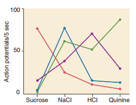 {left=71.56 top=60.74 width=28.44 height=39.26}

Sweet-sucrose
salt-NaCl
sour-HCl
bitter-quinine

---

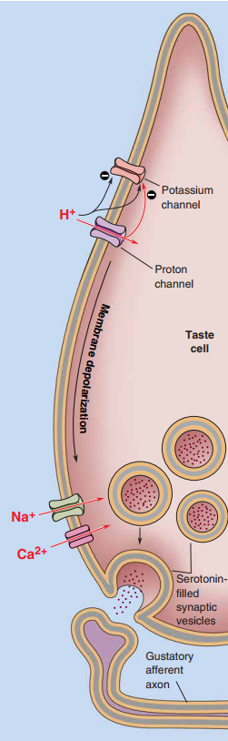 {left=83.68 top=0.00 width=16.32 height=94.07}

**Sourness.** Foods taste sour because of their high acidity (otherwise known as low pH). Acids, such as HCl, dissolve in water and generate hydrogen ions (protons or H). Thus, protons are the causative agents of acidity and sourness. 

Protons may affect sensitive taste receptors in several ways, from either **inside** or **outside **the taste cell membrane, although these processes are **poorly understood**. 

It is likely that H can bind to and block special K-selective channels. When the K permeability of a membrane is decreased, it depolarizes. H may also activate or permeate a special type of ion channel from the superfamily of transient receptor potential (TRP) channels, which are common in many kinds of sensory receptor cells. The cation current through the TRP channels can also depolarize sour receptor cells. pH can affect virtually all cellular processes, and** there may be other mechanisms** of sour taste transduction. It is possible that a constellation of effects evokes the sour taste.

---

pH in biology

Brain as pH-meter

---

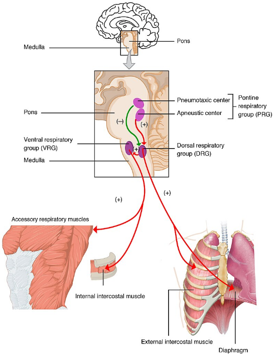 {left=57.93 top=0.00 width=42.07 height=97.04}

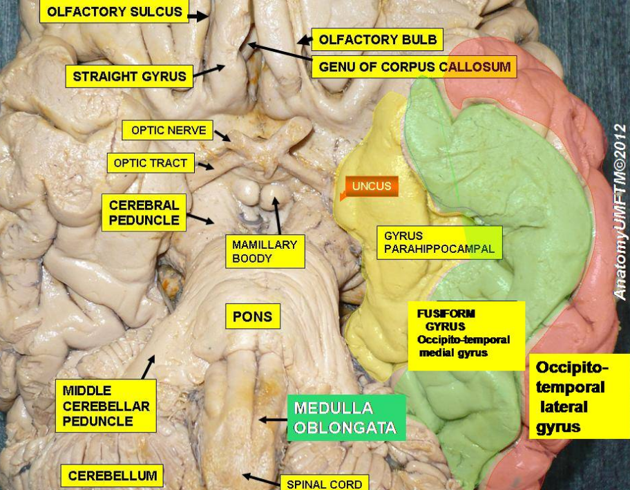 {left=-0.00 top=-0.00 width=27.91 height=38.57}

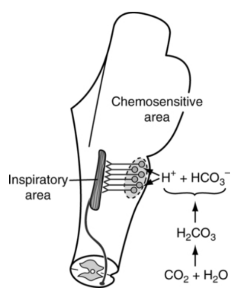 {left=30.99 top=0.00 width=23.87 height=50.00}

**Central chemoreceptors** are primarily sensitive to changes in the pH of the cerebrospinal fluid, (resulting from pH in blood due to changes in the levels of CO2, thus do not respond to hypoxia.)  and they are located on the medulla oblongata near to the medullar respiratory groups (**dorsal DRG** and **ventral VRG**) of the respiratory center.

---

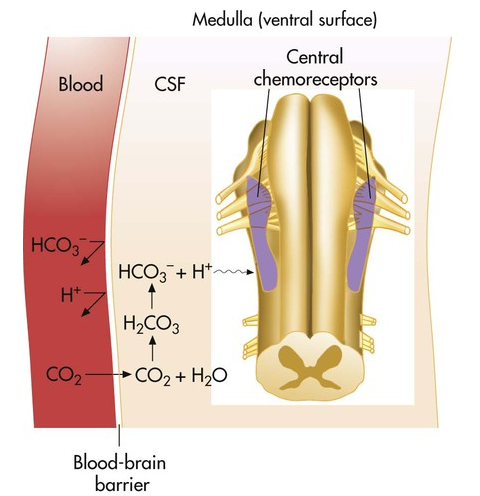 {left=18.25 top=0.00 width=27.51 height=50.53}

Cerebrospinal fluid

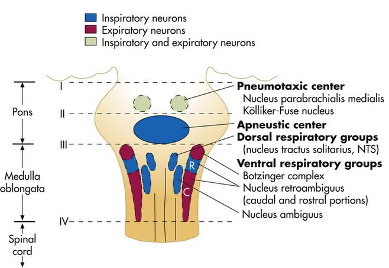 {left=45.75 top=0.00 width=36.13 height=44.22}

Central chemoreceptors in the medulla control
ventilatory motor output to maintain normal
blood CO2. Serotonergic neurons within the
raphe nuclei of the medulla may play this role by increasing the firing rate of the motor neurons when pH decreases (because of an increase in PCO2). The records shown here are from in vitro recordings of a neuron in the raphe nuclei of a rat at two different levels of pH (7.4, control, and 7.2, acidosis).

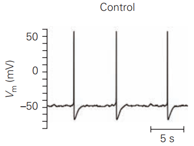 {left=81.89 top=-0.00 width=17.71 height=28.14}

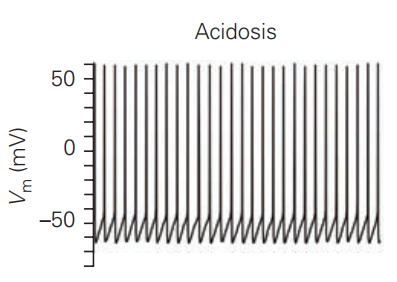 {left=81.11 top=30.88 width=19.26 height=24.32}

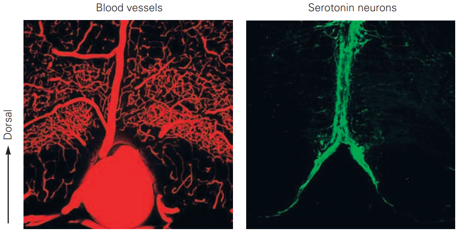 {left=52.97 top=57.93 width=47.03 height=42.07}

---

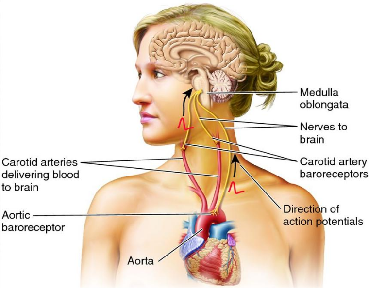 {left=52.80 top=-1.81 width=47.20 height=65.59}

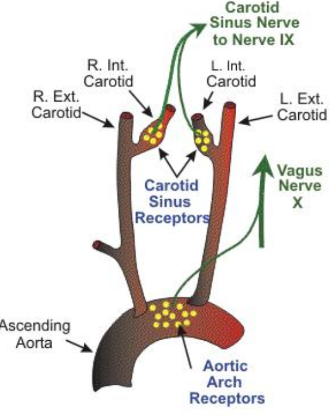 {left=18.19 top=0.00 width=33.85 height=74.75}

Peripheral chemoreceptors (carotid and aortic bodies) primarily detect low arterial O₂, but also respond to increased H⁺ and CO₂, providing rapid feedback to adjust breathing.

More about sensing O2 in carotid bodies: <u>https://www.mdpi.com/2673-9801/4/1/4</u>

---

**Cheyne-Stokes respiratory pattern**

The motor pattern generated by the respiratory centers is remarkably stable in normal people, but a variety of abnormal patterns can emerge under some conditions (eg, during disease). 

**Cheyne-Stokes respiratory pattern**, which is characterized by repeated cycles of gradually increasing then decreasing ventilation, alternating with cessation of breathing (apnea). At the peak of each cycle a high CO2 level at the central chemoreceptors causes hyperventilation. The hyperventilation leads to a decrease in CO2 in the capillaries of the lung, but it takes several breaths before this blood reaches the central chemoreceptors. By this time the subject has overcompensated, so that the CO2 in the pulmonary capillaries is now too low. When that blood finally reaches the chemoreceptors, the low CO2 causes apnea. This in turn causes an increase in CO2 in the lung capillaries, and when this blood reaches the chemoreceptors it initiates another cycle.

Cheyne-Stokes breathing can be seen in patients with congestive heart failure in whom a decrease in cardiac output causes an increase in the delay between gas exchange in the lungs and the change in CO2 at the central chemoreceptors in the brain stem.

---

**HOMEWORK**

---

**Problem 1. **What is the conjugate base of
 
HClO4, H2S, PH4+, HCO3- ?

Note: do NOT forget designating charge in your solution

**Problem 2. **What is the pH of a 0.040 M solution of HClO4 ?
Hint: this is a **strong **acid, neglect [H+] from autoionization of water

**Problem 3. **What is the pH of the solution formed when 45.0 mL of 0.100 M NaOH is added to 50.0 mL of 0.100 M acetic acid CH3COOH                           ?

Hint: NaOH fully dissociates, each OH- removes proton from CH3COOH creating CH3COO-. Calculate concentrations [CH3COOH] and [CH3COO-] due to NaOH neutralization (neglect other processes). CH3COOH is a **weak **acid, use Ka given and Henderson-Hasselbach equation

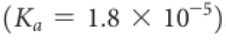 {left=76.61 top=67.55 width=14.88 height=4.68}

---

**FINALE**

---
