

Bioorganic Chemistry

Tymchyshyn V.B.

Lecture 6: Bioenergetics and metabolism

---

**And much more is not known**

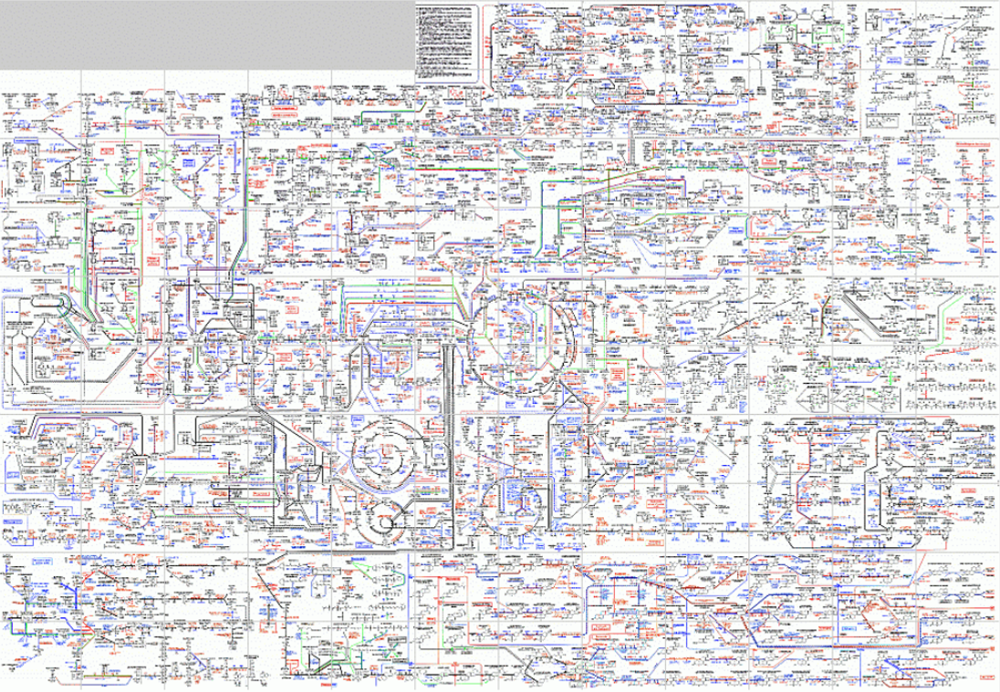 {left=20.92 top=14.14 width=68.53 height=84.38}

---

**general principles of metabolism**

1. Fuels are degraded and large molecules are constructed step by step in a
series of linked reactions called metabolic pathways .
2. An energy currency common to all life forms, adenosine triphosphate
(ATP) , links energy-releasing pathways with energy-requiring pathways.
3. The oxidation of carbon fuels powers the formation of ATP.
4. Although there are many metabolic pathways, a limited number of types
of reactions and particular intermediates are common to many pathways.
5. Metabolic pathways are highly regulated.

Links to atlases:
<u>https://pathways.embl.de/ipath3.cgi</u>
<u>https://smpdb.ca/view</u>
<u>https://reactome.org/PathwayBrowser/</u>

---

Living organisms require a continual input of free energy for three major
purposes: 
(1) the performance of mechanical work in muscle contraction and cellular movements, 
(2) the active transport of molecules and ions, and
(3) the synthesis of macromolecules and other biomolecules from simple precursors.

Those reactions that transform fuels into cellular energy are called **catabolic**
**reactions** or, more generally, **catabolism**.

Those reactions that require energy—such as the synthesis of glucose, fats,
or DNA—are called **anabolic reactions** or **anabolism**.

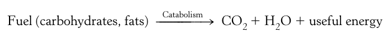 {left=16.20 top=56.80 width=67.60 height=11.48}

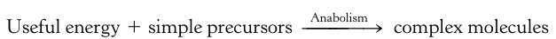 {left=16.07 top=83.12 width=65.31 height=8.33}

---

**Reactions can be coupled**

the overall free-energy change for a chemically coupled series of reactions is equal to the sum of the free-energy changes of the individual steps.

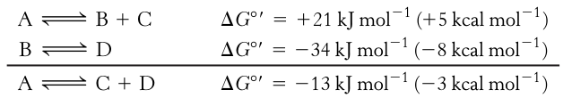 {left=23.02 top=27.29 width=66.46 height=20.37}

---

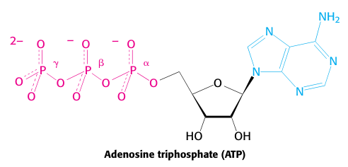 {left=61.88 top=0.00 width=39.37 height=33.57}

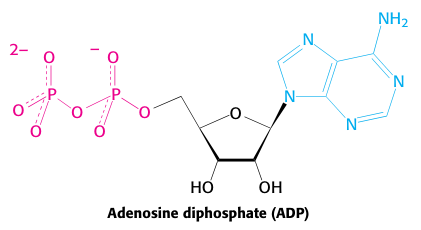 {left=65.43 top=33.21 width=34.57 height=33.57}

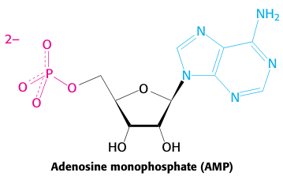 {left=70.27 top=66.43 width=29.73 height=33.57}

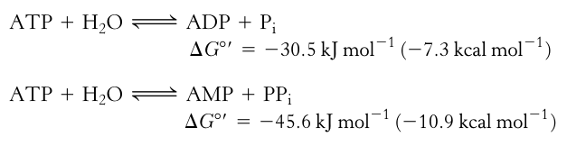 {left=15.25 top=20.37 width=47.40 height=21.77}

**ATP Is the Universal Currency of Free Energy in Biological Systems**

adenine (blue), a ribose (black), and a tri-, di-, or monophosphate unit (red)

This ATP–ADP cycle is the fundamental mode of energy exchange in biological systems.
Some biosynthetic reactions are driven by GTP,  UTP, CTP. Although all of the nucleotide triphosphates are energetically equivalent, ATP is nonetheless the primary cellular energy
carrier.

---

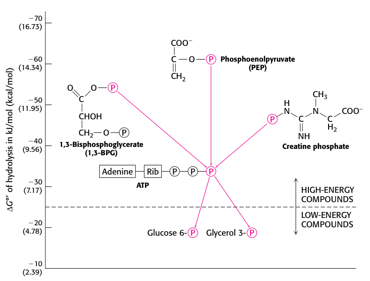 {left=53.33 top=0.00 width=46.67 height=63.05}

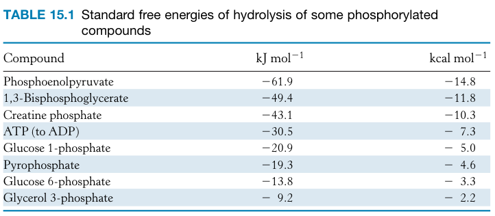 {left=53.33 top=63.05 width=46.67 height=36.31}

The high phosphoryl-transfer potential of ATP can be explained by features:
**1.** Resonance Stabilization of Orthophosphate (Pi)
**2.** Electrostatic Repulsion. At pH 7, the triphosphate unit of ATP carries about four negative charges.
**3.** Increase in Entropy.
**4.** Stabilization Due to Hydration.

ATP is often called a high-energy phosphate compound. Nonetheless, there is nothing
special about the bonds themselves. They are high-energy bonds in the sense
that much free energy is released when they are hydrolyzed

---

A thermodynamically unfavorable reaction sequence can be converted into a favorable one by coupling it to the hydrolysis of a sufficient number of ATP molecules in a new reaction.
ATP has the hydrolysis energy enough to power most useful reactions,  but not too large. So it is preferable to store energy in enough but not too much energetic form.
The RNA world. Activated carriers such as ATP, NADH, FADH2, and CoA contain adenosine diphosphate units probably because these molecules evolved from the early RNA catalysts. Non-RNA units such as the isoalloxazine ring may have been recruited to serve as efficient carriers of activated electrons and chemical units, a function not readily performed by RNA itself. We can picture the adenine ring of FADH2 binding to a uracil unit in a niche of an RNA enzyme (ribozyme) by base pairing, whereas the isoalloxazine ring protrudes and functions as an electron carrier. When the more versatile proteins replaced RNA as the major catalysts, the ribonucleotide coenzymes stayed essentially unchanged because they were already well suited to their metabolic roles.

---

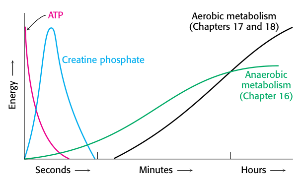 {left=40.82 top=0.00 width=59.18 height=64.12}

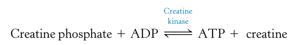 {left=42.02 top=64.12 width=57.98 height=15.90}

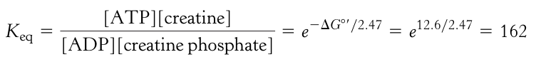 {left=43.58 top=82.07 width=56.42 height=10.67}

In the initial seconds, exercise is powered by existing high-phosphoryl-
transfer compounds (ATP and creatine
phosphate). Subsequently, the ATP must be regenerated by metabolic pathways.

Indeed, creatine phosphate is the major source of
phosphoryl groups for ATP regeneration for a runner during the first 4 seconds of a 100-meter sprint. The fact that creatine phosphate can
replenish ATP pools is the basis of the use of creatine as a dietary supplement by athletes in sports requiring short bursts of intense activity.

---

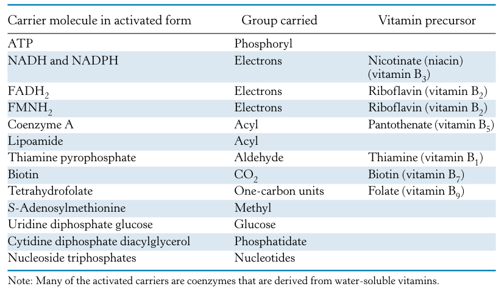 {left=19.74 top=15.64 width=80.26 height=82.82}

most interchanges of activated groups in metabolism are accomplished
by a rather small set of carriers. Some activated carriers in metabolism presented in the table.

---

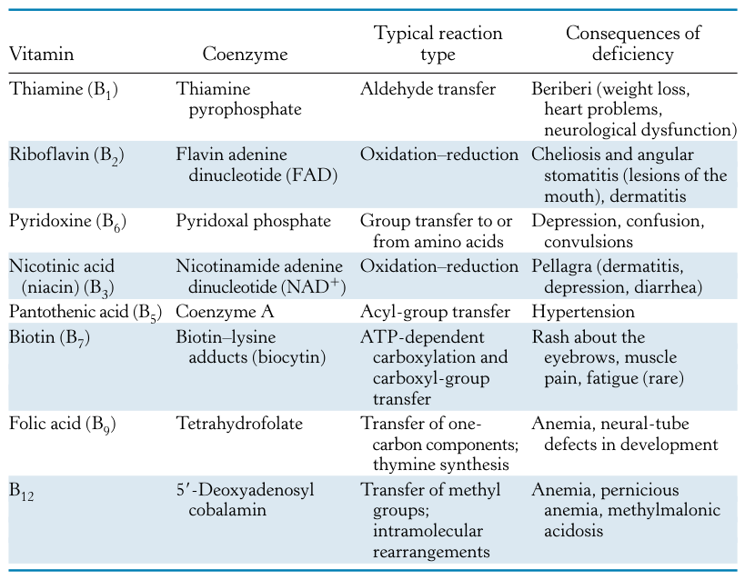 {left=32.07 top=1.64 width=67.93 height=94.07}

B vitamins

---

Non-coenzyme vitamins

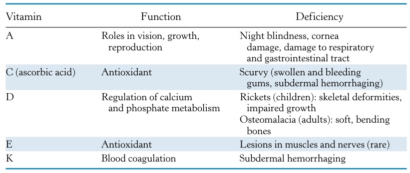 {left=18.69 top=17.73 width=81.31 height=61.25}

---

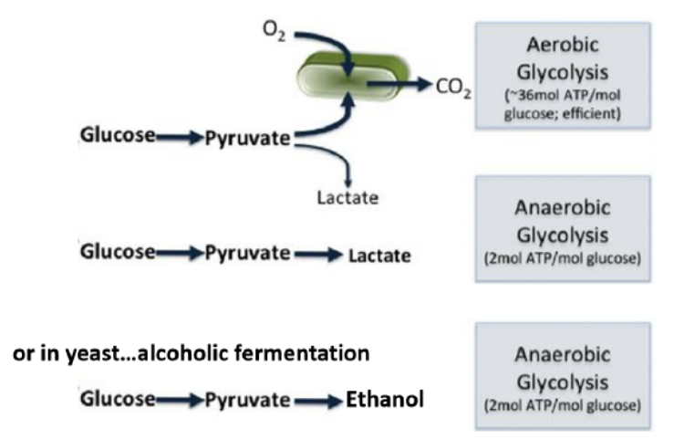 {left=47.61 top=0.00 width=52.39 height=60.62}

Aerobic oxidation yields about 18 times as much energy as the anaerobic pathways, causing them to be favored over anaerobic pathways.  

Most animal tissues can only survive short anaerobic bursts in isolation and don’t involve the entire organism. The aerobic pathway is required to sustain life.

Yeast also prefers to grow using the aerobic, mitochondrial pathway. However, if oxygen is unavailable, yeast and other fungi can switch to anaerobic growth and produce ethanol as a byproduct. The production of alcoholic beverages through this fermentation process is quite popular.

---

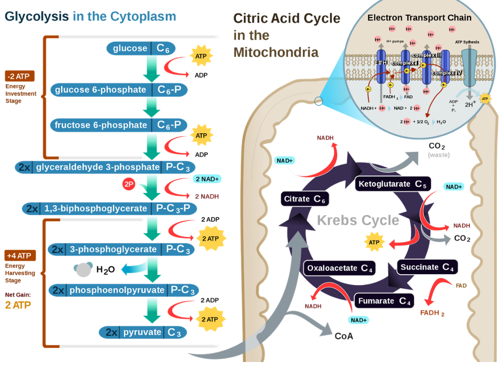 {left=27.68 top=2.96 width=72.32 height=94.07}

---

Glycolysis

Ancient mechanist of getting energy

---

**Clinical Importance of Glucose**

1. Glucose is the preferred source of energy for most of the body tissues. Brain cells derive the energy mainly from glucose.
2. When glucose metabolism is deranged, life threatening conditions may occur. A minimum amount of glucose is always required for normal functioning.
3. Normal fasting plasma glucose level is 70 to 110 mg/dl. After a heavy carbohydrate meal, it rises; but in a normal person, this level is below 150 mg/dl.

---

Fully performed in the cytoplasm
The pathway can be divided into two major sections: (1) the energy-consuming reactions and (2) the energy-generating reactions.
Everything starts with glucose uptake in small intestine. Large molecules in food are broken down into smaller units in the process of digestion. Proteins are hydrolyzed to their 20 different amino acids, polysaccharides are hydrolyzed to simple sugars such as glucose, and lipids are hydrolyzed to glycerol and fatty acids. The degradation products are then absorbed by the cells of the intestine and distributed throughout the body. This stage is strictly a preparation stage; no useful energy is captured in this phase

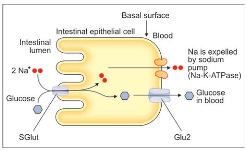 {left=39.28 top=52.04 width=44.03 height=47.96}

---

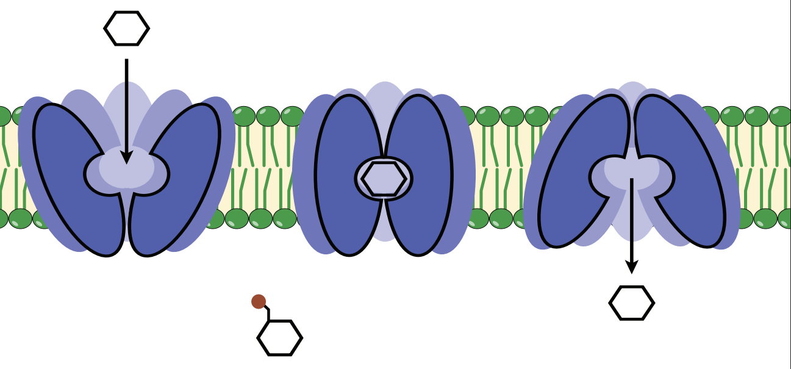 {left=19.82 top=0.00 width=37.50 height=31.10}

Low Km → efficient uptake even at low glucose concentrations.
GLUT1 & GLUT3 → neurons and RBCs always get glucose, even when blood glucose is low.

High Km → the transporter needs a higher concentration of glucose to work efficiently.
GLUT2 → pancreas & liver only become active transporters when glucose is abundant, making them ideal "sensors" of post-meal glucose spikes.

---

---

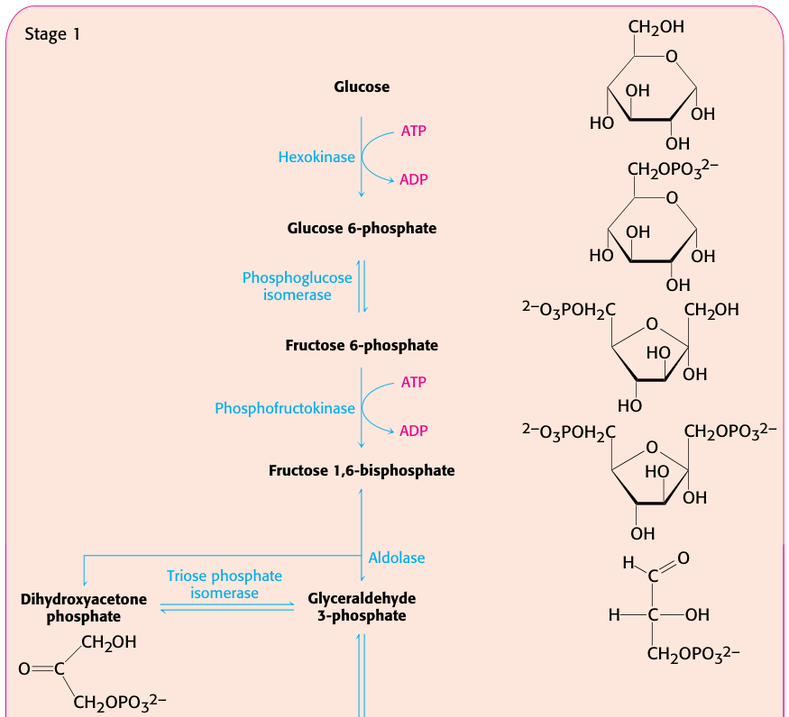 {left=31.78 top=10.45 width=19.14 height=63.53}

 {left=18.11 top=7.91 width=13.67 height=11.33}

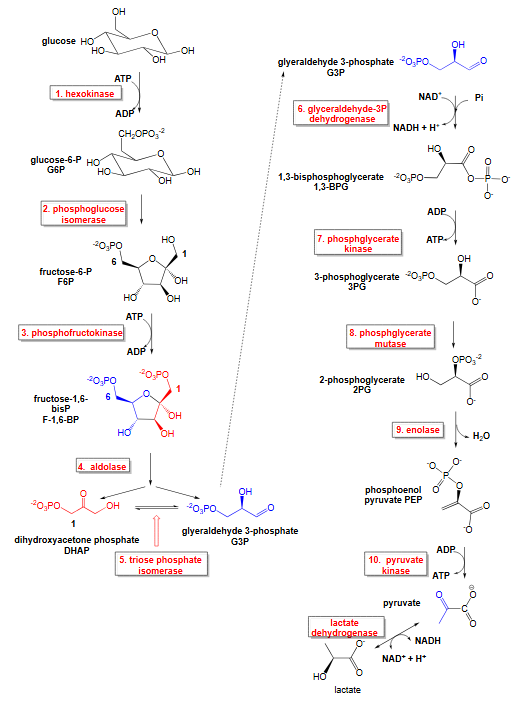 {left=20.72 top=41.04 width=11.07 height=12.90}

 {left=21.97 top=57.22 width=9.81 height=13.97}

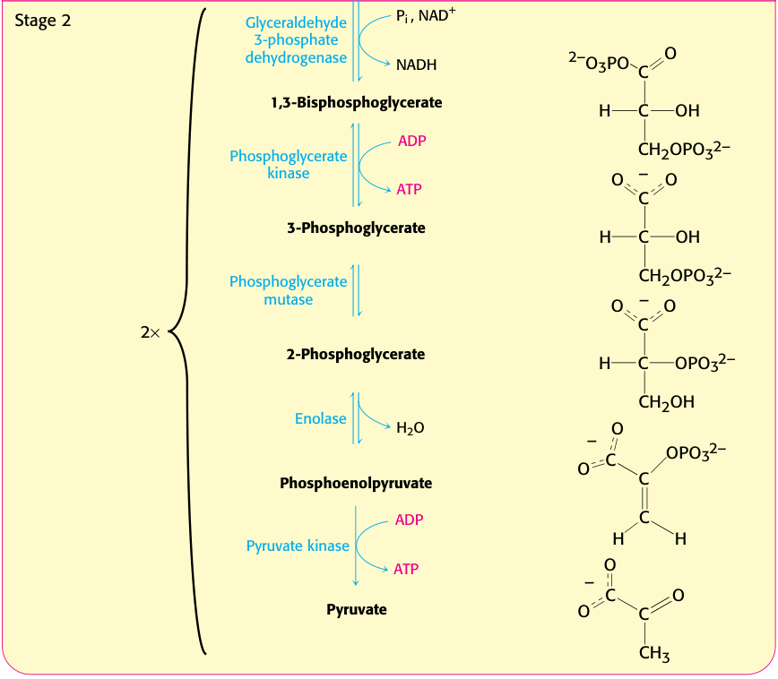 {left=63.35 top=7.91 width=17.47 height=84.17}

 {left=27.75 top=73.98 width=31.74 height=23.91}

 {left=80.82 top=14.27 width=14.54 height=11.33}

 {left=80.82 top=30.20 width=9.81 height=11.33}

 {left=80.82 top=44.93 width=9.81 height=10.13}

 {left=80.82 top=60.01 width=7.13 height=15.78}

 {left=80.82 top=80.10 width=7.13 height=9.07}

Stage 1

Stage 2

2 x

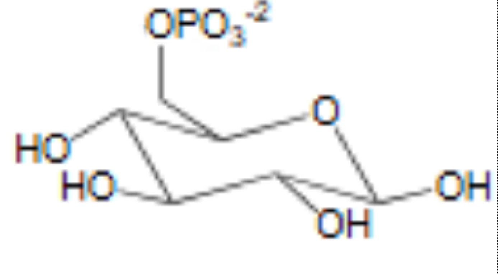 {left=17.80 top=24.29 width=11.90 height=11.70}

---

**Reaction 1: Glucose → Glucose-6-Phosphate. ΔG****o****=-16.7 kJ/mol.**
Glucose enters cells through specific transport proteins and has one
principal fate: it is phosphorylated by ATP to form glucose 6-phosphate. This
step is notable for several reasons. Glucose 6-phosphate cannot pass
through the membrane because of the negative charges on the phosphoryl
groups, and it is not a substrate for glucose transporters.

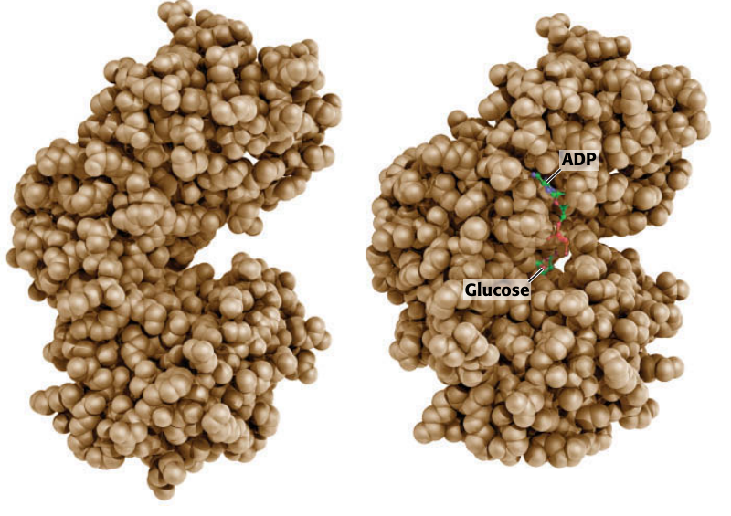 {left=66.89 top=29.91 width=32.00 height=40.18}

The two lobes of hexokinase are separated in the absence of glucose (left). The conformation of hexokinase changes markedly on binding glucose (right).

Hexokinase, like adenylate kinase and all other kinases, requires Mg2+ (or another divalent metal ion such as Mn2+) for activity. The divalent metal ion forms a complex with ATP.

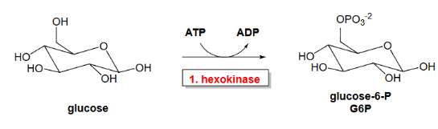 {left=15.70 top=32.86 width=48.92 height=25.69}

---

 {left=41.36 top=0.00 width=58.64 height=58.64}

Note that hexokinase I and forms II and III have spatially distinct halves similar to those in the yeast enzymes. Forms I-III have a molecular weight of about 100K. Form IV (glucokinase) has a molecular weight of 50K, similar to the distinct halves of I-III. This suggests that I-III arose through gene duplication.

Each half also binds glucose and ADP, but the N-terminal domains of I and III are catalytically inactive. Hexokinase II, with both halves active, is the primary enzyme involved in glycolysis in most mammalian tissues. Another difference is that glucose-6-phosphate, a product, inhibits I-III. PO42- relieves G6P product inhibition in form I but not the others. ADP binding at multiple sites in hexokinase I likely causes a conformational change that affects structure and activity.

---

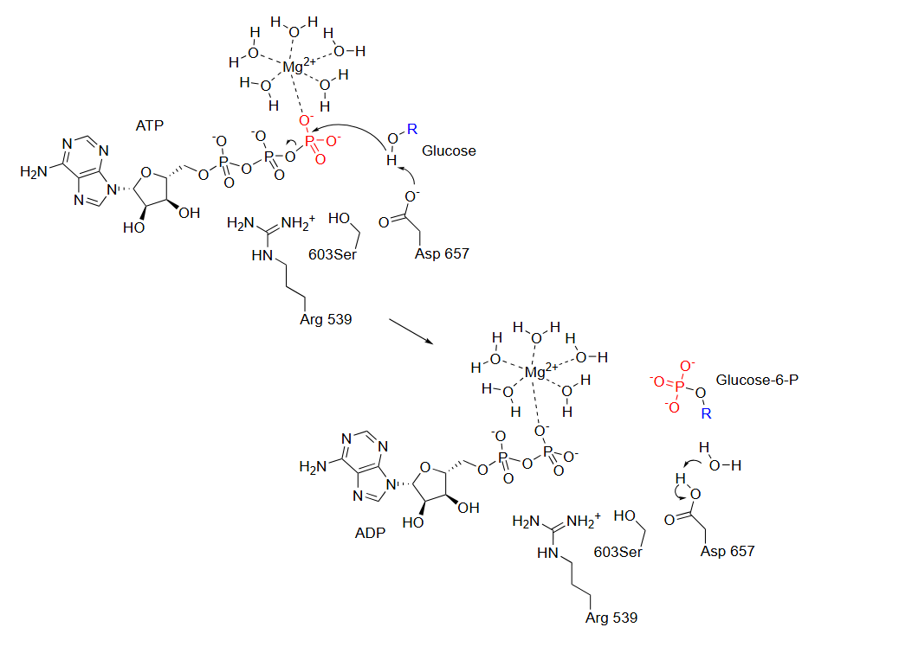 {left=33.10 top=2.19 width=66.90 height=95.63}

Substrate-induced cleft closing is a general feature of kinases.

The closing of the cleft keeps water molecules away from the active site. If hexokinase were rigid, a molecule of H2O occupying the binding site for the —CH2OH of glucose could attack the phosphoryl group of ATP, forming ADP and Pi. In other words, a rigid kinase would likely also be an ATPase.

Mechanism of human hexokinase I.

<u>3D View</u>
<u>Mechanism</u>
<u>With glucose</u>

---

**Reaction 2: Glucose-6-Phosphate ↔ Fructose-6-Phosphate. ΔG****o****=+1.7 kJ/mol**

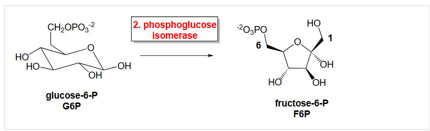 {left=28.69 top=13.05 width=59.92 height=32.65}

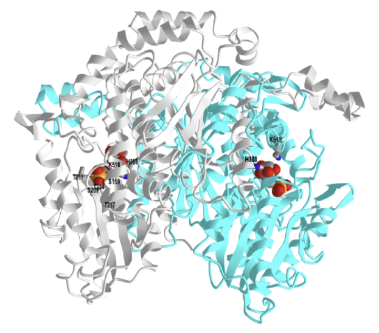 {left=16.89 top=45.71 width=31.98 height=50.01}

Rabbit phosphoglucose isomerase with bound 6-phosphogluconic acid (1DQR).

<u>3D View</u>
<u>Mechanism</u>

---

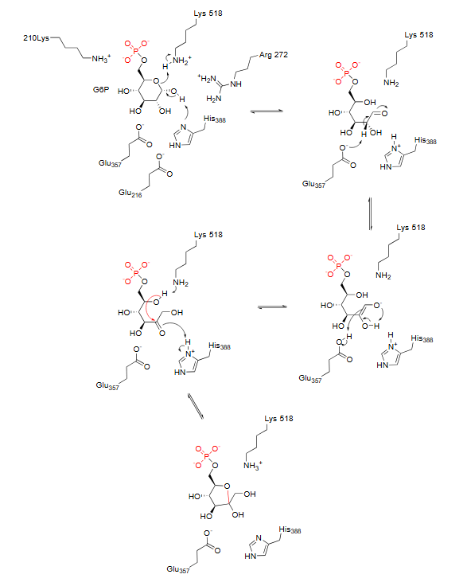 {left=60.46 top=2.96 width=39.54 height=94.07}

Recall that an **isomerase **is an enzyme that catalyzes the conversion of a molecule into one of its **isomers**. Here, the aldose, glucose-6-phosphate, is converted to the ketose, fructose-6-phosphate. This conversion is essential to allow the eventual split of the sugar into two three-carbon molecules.

This isomerization reaction would be expected to have a ΔGo of about 0.

It has been proposed that the mechanism of PGI requires the enzyme to open the Glucose-6-Phosphate ring before the actual isomerization step, which proceeds through the formation of a cis-enediol intermediate and keto-enol tautomers before conversion back to the cyclic form.

---

**Reaction 3: Fructose-6-Phosphate → Fructose-1,6-Bisphosphate. ΔG****o****=-14 kJ/mol**

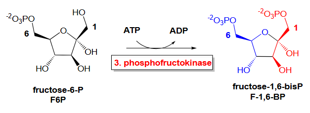 {left=25.99 top=13.71 width=45.81 height=29.75}

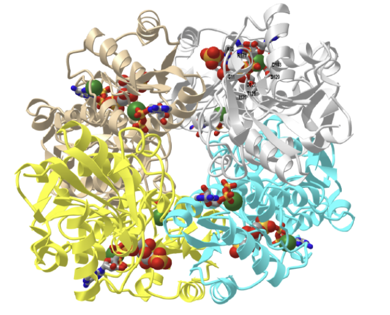 {left=16.07 top=46.75 width=37.02 height=53.25}

E. Coli phosphofructokinase with bound F1,6-bisphosphate and ADP products (1PFK)

<u>3D View</u>
<u>Mechanism</u>

---

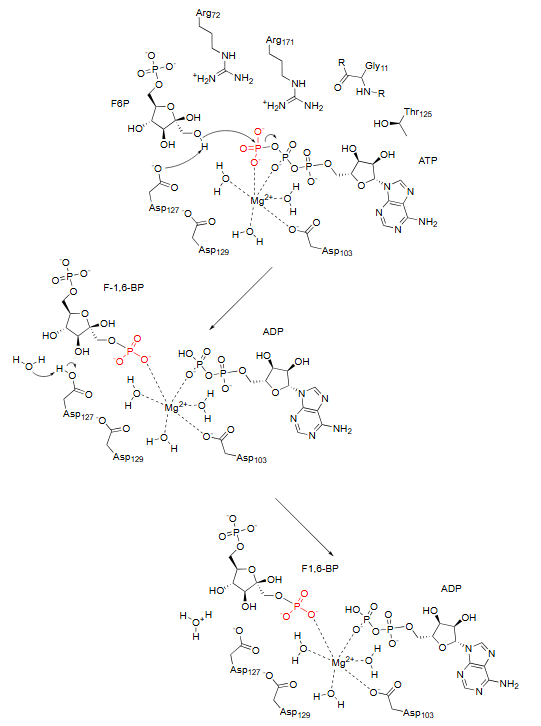 {left=60.57 top=0.00 width=39.43 height=94.07}

In the glycolytic pathway, PFK1 is a rate-limiting enzyme.

The PFK1 enzyme only works in the forward direction - committed step.

PFK-1 highly regulated (ATP:ADP ratio + allosteric)

The PFK1 enzyme exists as a **tetramer**, and like hemoglobin, it can exist in T and R states. Hence, it is an allosteric enzyme and has many allosteric regulators. 

One important allosteric activator of eukaryotic (not prokaryotic) PFK is fructose-2,6-bisphosphate. This is formed by a separate phosphofructokinase enzyme named PFK2.

---

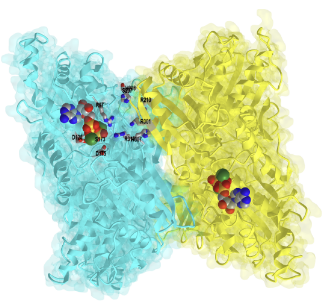 {left=15.78 top=0.00 width=26.23 height=44.60}

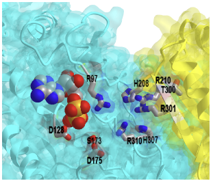 {left=44.85 top=-0.77 width=27.24 height=41.26}

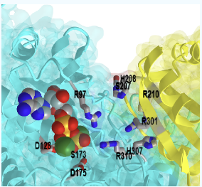 {left=74.94 top=-0.77 width=25.06 height=41.26}

human phosphofructokinase-1 dimer (for clarity, the actual structure is tetrameric) in a complex with ATP and Mg (4XYJ)
<u>ATP bound</u>
<u>ADP bound</u>

The monomers are shown as colored surfaces with secondary structures underneath. Note that side chains from each monomer in the dimer contribute to binding and catalysis. The structures have an E173S mutation.

Figure shows the differences in orientation of the key side chains in the ADP structure (left) and the ATP structure (right) that are key in the conformation changes in the enzyme on substrate binding.

---

**Reaction 4: Fructose-1,6-bisphosphate → Dihydroxyacetone phosphate (DHAP) + Glyceraldehyde 3-phosphate (G3P). ΔG****o**** = +24 kJ/mol**

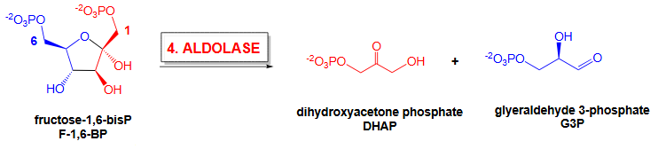 {left=18.94 top=15.04 width=77.29 height=31.11}

This reaction, which is readily reversible, is catalyzed by aldolase. This enzyme derives its name from the nature of the reverse reaction, an aldol condensation.

The newly added high-energy phosphates further destabilize fructose-1,6-bisphosphate and aldolase cleaves it into two three-carbon isomers.
This is the first C-C bond cleavage within glucose on the path to complete cleavage during aerobic respiration and release of 6 carbon dioxide molecules per glucose metabolized. Note that both products are phosphorylated. The reaction is not thermodynamically favored but is pulled in the forward direction by utilizing the product in the next reaction in the pathway.

---

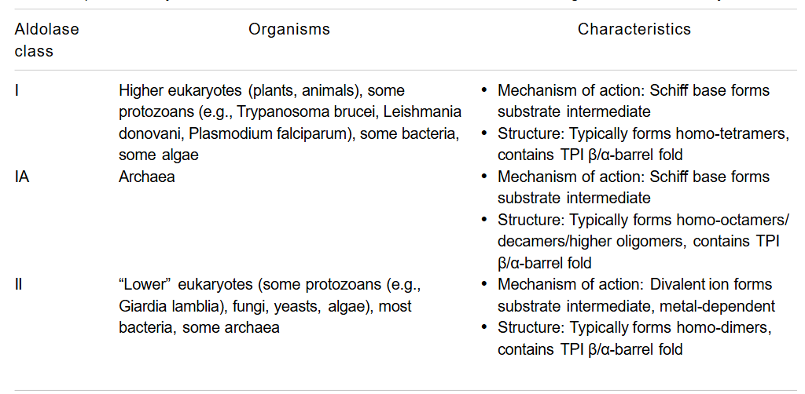 {left=18.44 top=26.61 width=81.56 height=71.08}

Characteristics of the Three Classes of Aldolases (I, IA, and II) and the Organisms in Which They are Found.

---

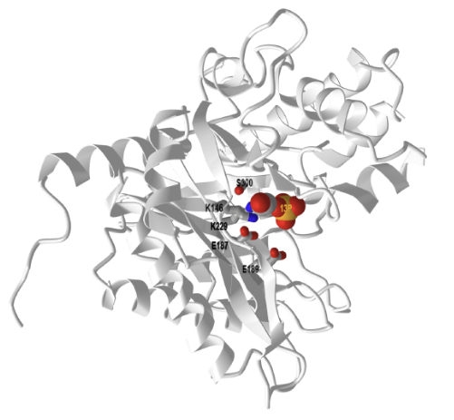 {left=46.96 top=4.28 width=52.19 height=85.74}

Dihydroxyacetone phosphate enamine intermediate in fructose-1,6-bisphosphate aldolase from rabbit muscle (2QUT)

<u>3D View</u>
<u>Mechanism</u>
<u>class II aldolase mechanism</u>

---

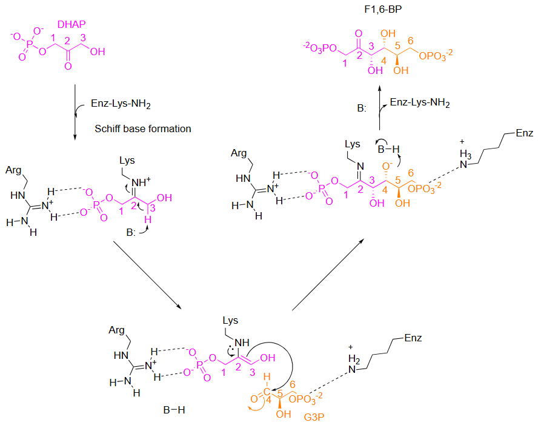 {left=47.09 top=17.05 width=52.91 height=74.37}

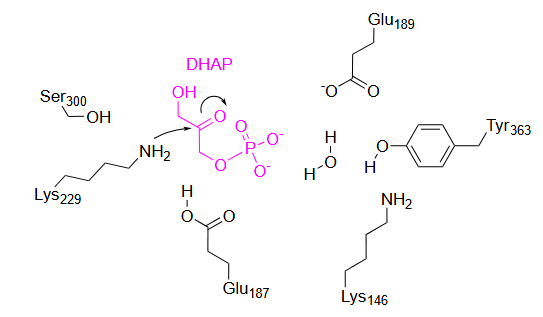 {left=16.96 top=20.35 width=27.66 height=28.71}

**Class I Aldolase**
The enzyme is favored in the **reverse direction**, and thus presented **in that fashion**.

These enzymes proceed through a Schiff base intermediate between a reactive lysine and the reactant/product. In rabbits, the muscle Class I aldolase (RAMA) uses Lys-229 to form a Schiff base with DHAP, as shown in a mechanism

---

**Reaction 5: DHAP ↔ G3P. ΔG****o****= +7.5 kJ/mol**

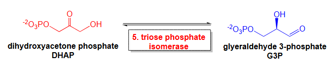 {left=17.17 top=15.73 width=70.10 height=24.44}

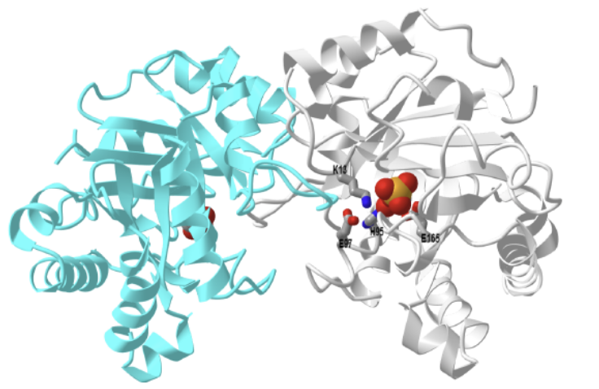 {left=17.17 top=41.82 width=48.11 height=55.55}

Chicken triosephosphate isomerase-phosphoglycolohydroxamate complex (1TPH).

<u>3D View</u>
<u>Mechanism</u>

---

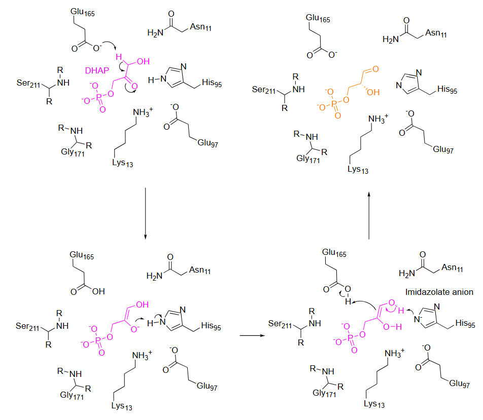 {left=39.23 top=0.00 width=60.77 height=94.07}

This is another simple isomerization reaction. Only one product, glyceraldehyde-3P, continues in glycolysis, so only one enzyme is needed to metabolize the cleavage products of this reaction further. As in other isomerization reactions, the ΔGo is close to 0.

---

**Reaction 6: G3P ↔1,3 BPG. ΔGo= +6.1 kJ/mol**

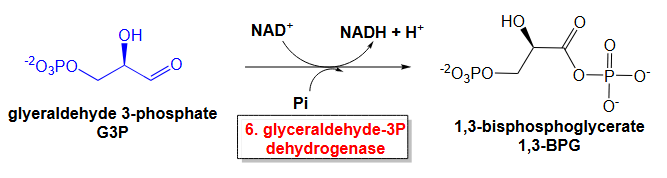 {left=16.07 top=12.43 width=63.47 height=30.11}

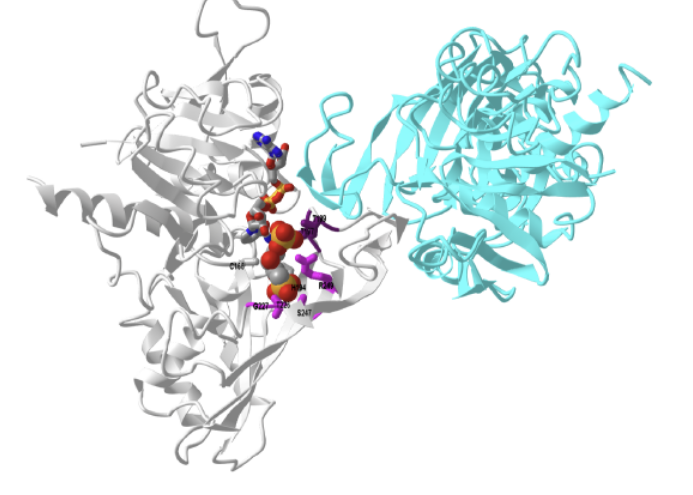 {left=16.07 top=42.55 width=40.58 height=51.53}

Trypanosoma cruzi glyceraldehyde-3-phosphate dehydrogenase with bound NAD and a 1,3-bisphosphoglycerate analogue (1QXS)

<u>3D View</u>
<u>Mechanism</u>

---

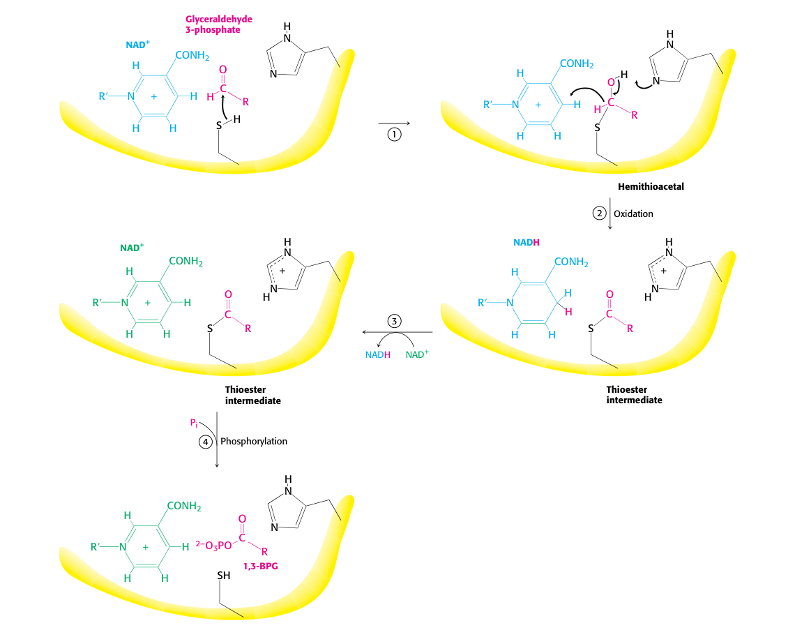 {left=15.84 top=2.96 width=57.74 height=94.07}

**(1)** Cysteine reacts with the aldehyde group of the substrate, forming a hemithioacetal. **(2)** An oxidation takes place with the transfer of a hydride ion to NAD+, forming a thioester. This reaction is facilitated by the transfer of a proton to histidine. **(3)** The reduced NADH is exchanged for an NAD+ molecule. **(4)** Orthophosphate attacks the thioester, forming the product 1,3-BPG.

**Catalytic mechanism of glyceraldehyde**
**3-phosphate dehydrogenase.** The reaction proceeds through a thioester intermediate, which allows the oxidation of glyceraldehyde
to be coupled to the phosphorylation of 3-phosphoglycerate.

cys

his

---

**Reaction 7: 1,3 BPG + ADP + H****+**** → 3PG + ATP ΔG****o****= -19 kJ/mol**

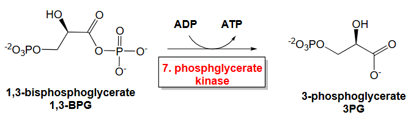 {left=16.07 top=14.74 width=50.27 height=27.00}

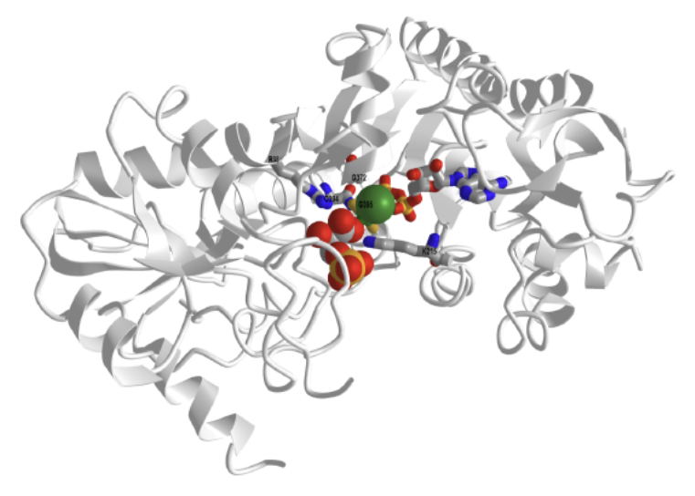 {left=17.08 top=43.39 width=41.18 height=52.33}

Human phosphoglycerate kinase in complex with ADP, 3PG, and magnesium trifluoride (2WZB).
<u>3D View</u>
<u>Open/Closed</u> (toggle with ‘a’)
<u>Mechanism</u>

---

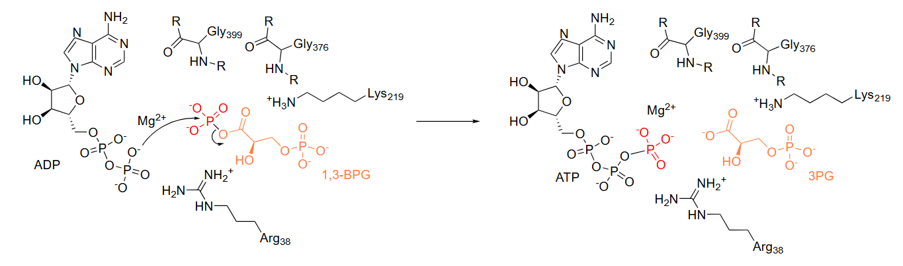 {left=20.66 top=-0.00 width=79.34 height=41.74}

An ATP has been made for each of the two 1,3-BPG molecules derived from glucose. We've made back the ATP used in steps 1 and 3. A mixed phosphoanhydride bond is broken in 1,3 BPG as a phosphoanhydride bond is made in ATP. As the mixed phosphoanhydride has higher energy than its hydrolysis product compared to the phosphoanhydride in ATP, the reaction proceeds with a negative ΔGo.

---

**Reaction 8: 3PG ↔ 2PG ΔG****o****= 4.6 kJ/mol**

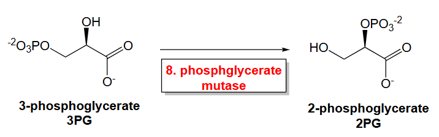 {left=16.07 top=13.74 width=57.14 height=31.78}

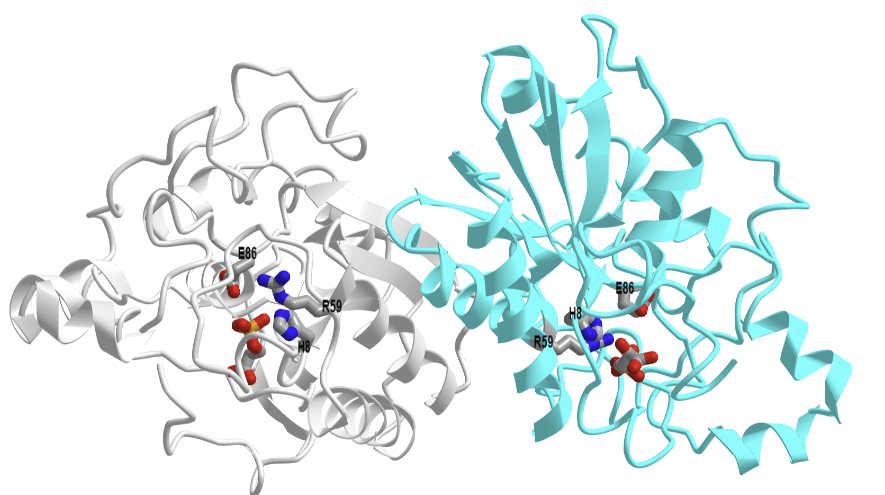 {left=16.07 top=45.52 width=48.83 height=48.55}

Yeast phosphoglycerate mutase (cofactor dependent) bound to 3-phosphoglycerate (1QHF).
<u>3D view</u>
<u>Mechanism</u>
<u>Cofactor-Independent 3D View</u>
<u>Cofactor-Independent Mechanism</u>

---

This isomerization reaction proceeds with little thermodynamic barrier. Its function is to locate the phosphate on C2 which on the next reaction (dehydration) will form a molecule whose phosphoryl transfer potential is greater than ATP. It seems so simple, but the enzymes that catalyze this reaction are diverse and quite complicated from a mechanistic perspective.

There are two types of PGMs, bisphosphoglycerate and monophosphoglycerate mutases, that carry out three different reactions involving the shuffling of phosphates from one position to another in 3C sugars or the cleavage of a phosphate from a sugar

3-phosphoglycerate ↔ 2-phosphoglycerate **(reaction 8 of glycolysis)** catalyzed by bisphosphoglycerate and monophosphoglycerate (the glycolytic enzyme) mutases
1,3-bisphosphoglycerate ↔ 2,3-bisphosphoglycerate by bisphosphoglycerate mutases
2,3-phosphoglycerate ↔ 3-phosphoglycerate + Pi by bisphosphoglycerate mutases

---

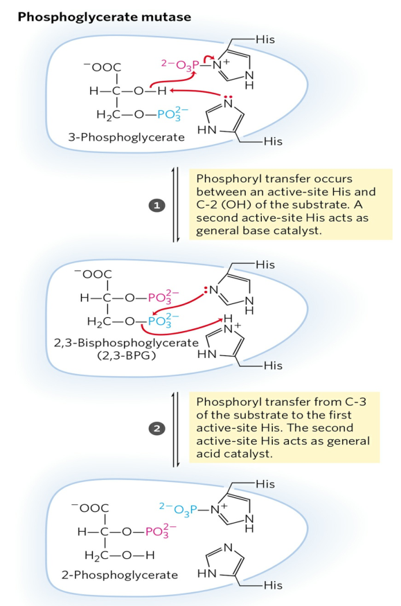 {left=16.15 top=5.93 width=35.02 height=94.07}

Within the phosphoglycerate mutase (PGM) of glycolysis, there are two types

one that depends on the cofactor 2,3-phosphoglycerate. These are called **cofactor-dependent phosphoglycerate mutase** (dPGM) and are found in mammals, yeast, and some bacteria. They do not require metal ions.

one that does not depend on the cofactor 2,3-phosphoglycerate. These are called **cofactor-independent phosphoglycerate mutase** (iPGM) and are found in plants and some bacteria. These can only interconvert 3PGA and 2PGA. One family of enzymes in the class requires Mn2+, while the other requires Mg2+ or Zn2+. These enzymes are often structurally similar to alkaline phosphatases.

**cofactor-dependent**

His phophorylated by 2,3-BPG (cofactor)

---

**Reaction 9: 2PG ↔ PEP + H2O ΔG****o****= +1.7 kJ/mol**

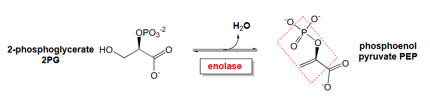 {left=16.07 top=13.05 width=63.82 height=26.49}

Yeast enolase with bound 2-phosphoglycerate (7ENL)
<u>3D View</u>

Now you can see the rationale for reaction 8. With a simple dehydration reaction, a molecule with high phosphoryl transfer potential has been produced, which in the next and final step of glycolysis produces ATP.

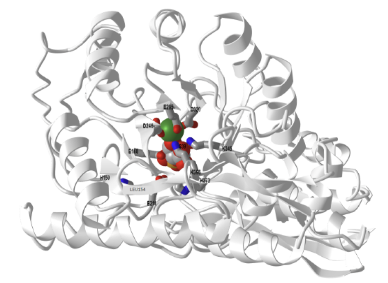 {left=16.07 top=37.22 width=42.13 height=54.54}

---

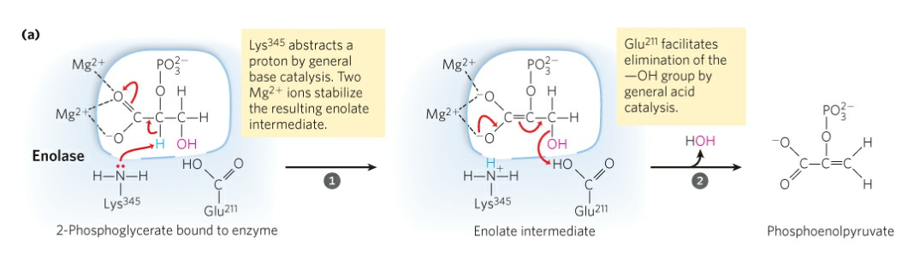 {left=19.85 top=0.00 width=80.15 height=40.15}

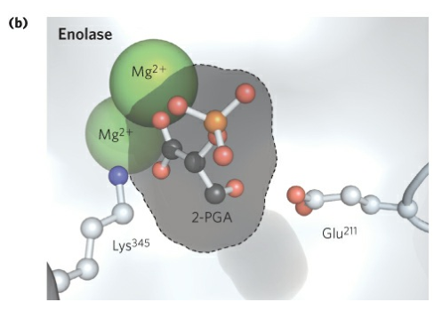 {left=19.85 top=43.45 width=36.27 height=45.27}

Two-step reaction catalyzed by enolase. **(a)** The mechanism by which enolase converts 2-phosphoglycerate (2-PGA) to
phosphoenolpyruvate. The carboxyl group of 2-PGA is coordinated by two
magnesium ions at the active site. 
**(b) **The substrate, 2-PGA, in relation to the Mg2+, Lys345, and Glu211 in the enolase active site (gray outline). Nitrogen is shown in blue, phosphorus in orange; hydrogen atoms are not shown.

---

**Reaction 10: PEP + ADP → Pyr + ATP ΔGo= -31 kJ/mol**

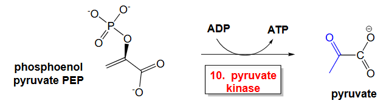 {left=16.07 top=13.42 width=53.42 height=25.82}

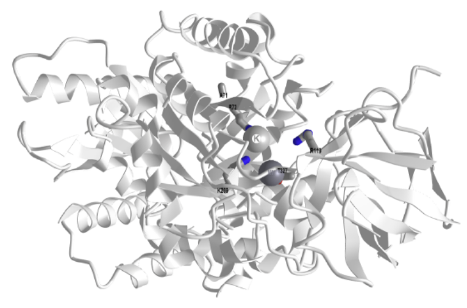 {left=18.00 top=42.97 width=43.51 height=51.10}

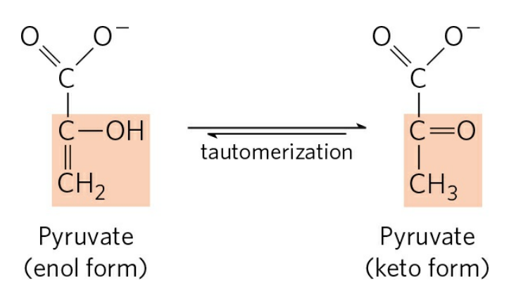 {left=72.89 top=12.39 width=27.11 height=27.88}

rabbit muscle pyruvate kinase complexed with Mn2+, K+, and pyruvate (1PKN)
<u>3D View</u>
<u>Mechanism</u>

---

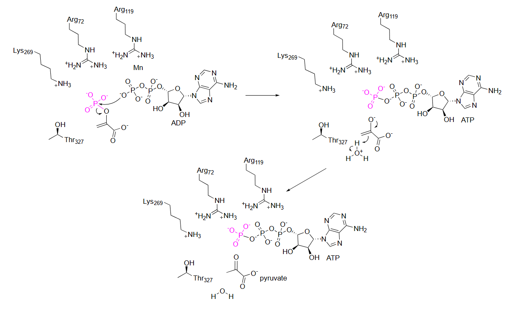 {left=19.63 top=-1.99 width=80.37 height=87.03}

In this step, one more ATP is made for each PEP consumed (hence 2 ATPs for both 3C PEPs). The phosphoryl transfer potential for PEP is higher than for ATP, which allows this reaction to proceed with a large negative ΔGo

---

**Clinical Significance of Pyruvate**

1. Pyruvate carboxylase deficiency. It is seen as an inborn error of metabolism, where mental retardation is manifested. Its incidence is 1 in 25,000 births. Lactic acidosis is noticed.
2. Malignant hyperthermia. This may occur when halothane is given as an anesthetic to certain persons. The ryanodine receptor, a calcium-release channel is defective, leading to inappropriate release of calcium from sarcoplasmic reticulum. This results in uncontrolled heat generation, damage of muscle cells, ATP depletion, lactic acidosis and rhabdomyolysis. CPK is markedly elevated. This defect is seen in 1 per 50,000 population.
3. Ethanol (Ethyl alcohol). It inhibits gluconeogenesis. During the metabolism of ethanol the level of cytoplasmic NADH is raised. Thus, the Pyruvate →Malate → Oxaloacetate reactions are reversed. So, excessive ingestion of alcohol results in hypoglycemia. Lactate also accumulates as NADH level is high

---

 {left=19.25 top=13.58 width=81.56 height=81.56}

**Glycolysis**

---

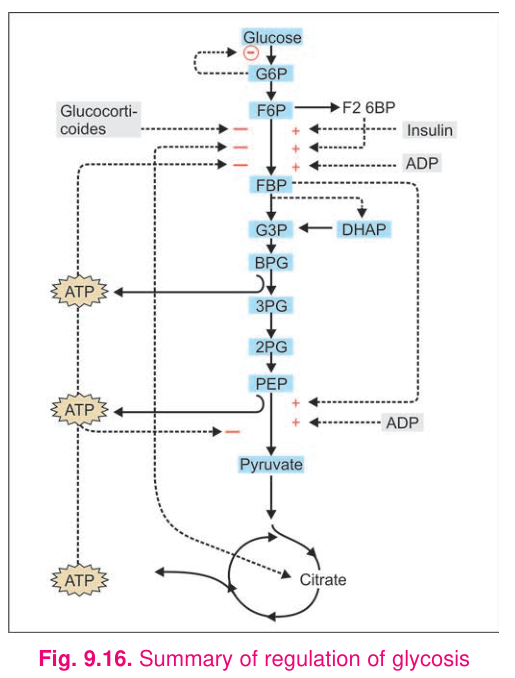 {left=59.81 top=11.99 width=40.19 height=88.01}

Regulation of glycolysis

The regulatory enzymes or key enzymes of glycolysis are:
1. Glucokinase/Hexokinase, step 1
2. Phosphofructokinase, step 3. 
3. Pyruvate kinase, step 9

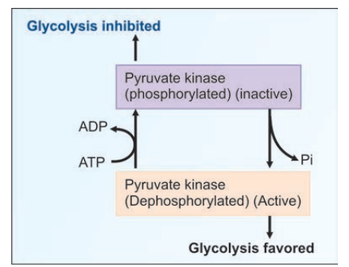 {left=38.85 top=70.20 width=22.31 height=30.35}

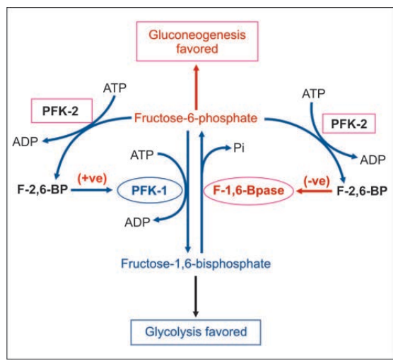 {left=15.66 top=60.43 width=24.86 height=40.12}

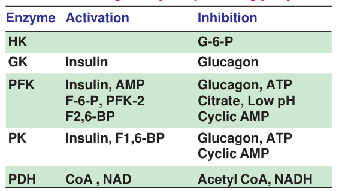 {left=23.27 top=28.61 width=26.73 height=26.78}

---

**Factors Regulating Glycolysis**

**1.** Glucokinase/Hexokinase: Phosphorylation of glucose by these enzymes is a reaction which is regulated by feed back inhibition (hexokinase by glucose-6-phosphate) and activated by insulin (glucokinase is induced by insulin). Glucokinase that is active mainly in liver has a high Km for glucose and low affinity. Hence, glucokinase can act only when there is adequate glucose supply so that excess can be stored. Hexokinase with low km and high affinity can phosphorylate glucose even at lower concentrations so that glucose is made available to brain, cardiac and skeletal muscle. Glucokinase can act only when there is plenty of glucose. Thus, when the supply of glucose is limited, glucose is made available to brain and muscles.
**2.** Phosphofructokinase (PFK) (step 3) is the most important rate-limiting enzyme for glycolysis pathway. ATP and citrate are the most important allosteric inhibitors. AMP acts as an allosteric activator.
**3.** Fructose-2,6-bisphosphate (F-2,6-BP) increases the activity of phosphofructokinase. F-2,6-BP is formed from fructose-6-phosphate by the action of an enzyme called PFK-2. (It is different from the PFK1). Fructose-2,6-bisphosphate is hydrolysed to fructose-6-phosphate by fructose-2,6-bisphosphatase. The activities of both the enzymes (PFK2 and fructose-2,6-bisphosphatase) are reciprocally regulated. When glucose supply is in plenty,
PFK-2 is dephosphorylated and activated; so F-2,6-BP concentration increases; this in turn,
activates PFK. Thus glycolysis is favored. 
**4.** Pyruvate Kinase catalyses an irreversible step and is a regulatory enzyme of glycolysis. When energy is plenty in the cell, glycolysis is inhibited. Insulin increases its activity where as glucagon inhibits. Pyruvate kinase is inactive in the phosphorylated state.
**5.** Insulin favors glycolysis by activating the above three key glycolytic enzymes.
**6.** Glucagon and glucocorticoids inhibit glycolysis and favor gluconeogenesis

---

---

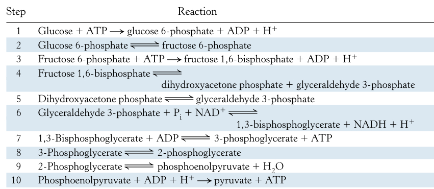 {left=16.19 top=0.00 width=64.69 height=50.00}

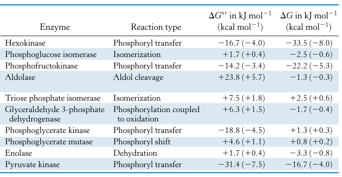 {left=16.19 top=50.00 width=54.28 height=50.00}

---

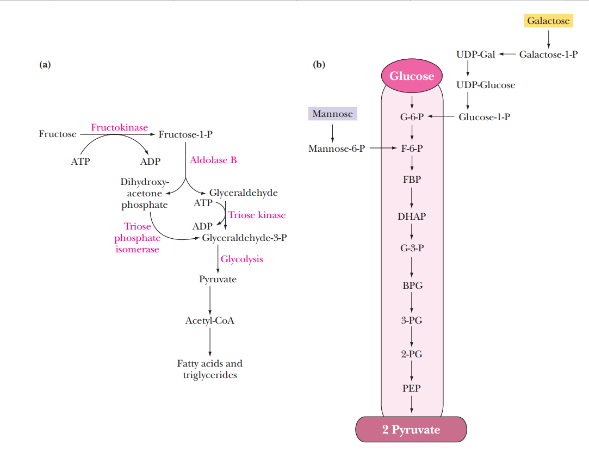 {left=15.71 top=0.00 width=68.57 height=100.00}

**Other sugars can enter glycolysis**

**(a) **Fructose metabolism in the liver is unregulated. By contrast, glucose
breakdown in glycolysis is highly regulated, particularly by the  phosphofructokinase reaction. Aldolase B, a class I aldolase predominantly found in the liver, produces glyceraldehyde (not glyceraldehyde-3-P), which must be phosphorylated by triose kinase to continue through the balance of the glycolytic pathway. 

**(b) **Mannose and galactose enter the glycolytic pathway via hexokinase ahead of the phosphofructokinase reaction. Thus their catabolism is subject to the same regulation as glucose.

---

Gluconeogenesis

Glycolysis evil twin

---

 {left=68.75 top=0.00 width=28.22 height=100.00}

**Glycolysis and gluconeogenesis.** 

Opposing pathways of glycolysis (pink) and gluconeogenesis (blue) in rat liver. Three steps are catalyzed by different enzymes in gluconeogenesis (the “bypass reactions”) and glycolysis; seven steps are catalyzed by the same enzymes in the two pathways.
Cofactors have been omitted for simplicity.

---

**Significance of Gluconeogenesis**

1. Only liver can replenish blood glucose through gluconeogenesis, because glucose-6-phosphatase is present mainly in liver (kidney and intestinal mucosa to a lesser extent, but is **absent in muscle**). So liver plays the major role in maintaining the blood glucose level.

2. During starvation gluconeogenesis maintains the blood glucose level. The stored glycogen is depleted within the first 12-18 hours of fasting On prolonged starvation, the gluconeogenesis is speeded up and protein catabolism provides the substrates, namely glucogenic amino acids.

3. Energy Requirement: The reactions catalyzed by pyruvate carboxylase, phosphoenol pyruvate carboxy kinase and phospho glycerate kinase require one ATP each; so 3 ATPs are used by 1 pyruvate residue to produce one-half molecule of glucose; or 6 ATPs are required to generate one glucose molecule.

---

**Substrates for Gluconeogenesis**

Lactate and glucogenic amino acids are the most important substrates for gluconeogenesis.
1. Lactate
The lactate formed in the muscle is transported to the liver. In the liver cell lactate dehydrogenase converts lactate to pyruvate. The pyruvate enters the gluconeogenic pathway to form glucose. See also Cori's cycle.
2. Glucogenic amino acids 
  i. Glucogenic amino acids (Alanine, glutamic acid, aspartic acid, etc).
  ii. When glucose is not readily available (starvation or diabetes mellitus), the glucogenic amino acids are transaminated to corresponding carbon skeletons. These then enter the TCA cycle and form oxaloacetate or pyruvate.
  iii. Alanine released from the muscle is the major substrate for gluconeogenesis. Muscle wastage seen in uncontrolled diabetes mellitus could be explained by this factor.
3. Glycerol
4. Propionyl CoA
**Important:** Even chain fatty acids **cannot **be converted to glucose; they are **not **substrates for gluconeogenesis.

---

 {left=50.00 top=0.00 width=50.00 height=75.52}

**Cori cycle and Cahill cycle**

**i.** Alanine is transported to liver, transaminated to pyruvate and converted to glucose. This glucose may again enter the glycolytic pathway to form pyruvate, which in turn, can be transaminated to alanine.
**ii.** Glucose-alanine cycle is important in conditions of
starvation. Thus net transfer of amino acid (nitrogen) from muscle to liver and corresponding transfer
of glucose (energy) from liver to muscle is affected.
**iii.** Alanine cycle is intimately related with Cori's cycle.

---

**Malate Aspartate Shuttle**
The carboxylation of pyruvate takes place
in mitochondria. So, oxaloacetate is generated inside the mitochondria. This oxaloacetate has to be transported from mitochondria to cytosol, because further reactions of gluconeogenesis are taking place in cytosol. This is achieved
by the malate aspartate shuttle. Oxaloacetate is first converted to malate, which traverses the membrane and reaches cytoplasm. Malate is then re-converted to oxaloacetate. Malate
dehydrogenase is present in both mitochondria and cytoplasm.

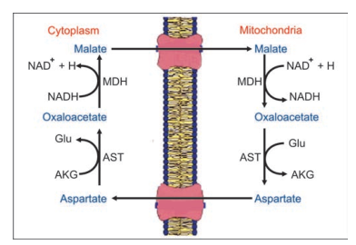 {left=8.53 top=2.85 width=40.83 height=50.00}

Oxaloacetate may also be transported as aspartate formed by transamination of oxaloacetate. When alanine is the substrate for gluconeogenesis, the malate shuttle predominantly operates, because NADH is also required in the cytoplasm for the gluconeogenesis to continue. When lactate is the substrate for gluconeogenesis, the aspartate shuttle operates, because sufficient NADH is
available in the cytoplasm by the LDH reaction.

---

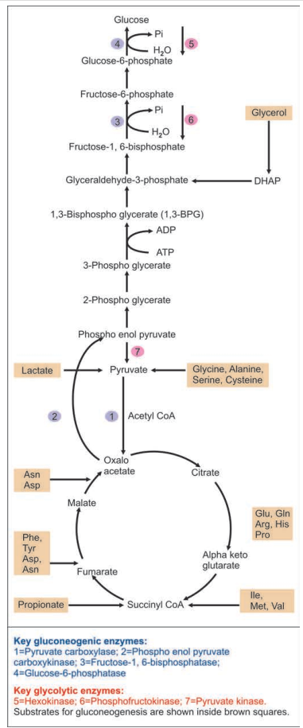 {left=17.21 top=0.00 width=23.07 height=98.48}

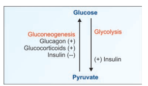 {left=69.69 top=0.00 width=30.31 height=31.48}

Hormonal regulation of gluconeogenesis

**i.** The hormones glucagon and glucocorticoids increase gluconeogenesis.
**ii.** Glucocorticoids induce the synthesis of hepatic
aminotransferases thereby providing substrate
for gluconeogenesis.
**iii.** The high glucagon-insulin ratio also favors
induction of synthesis of gluconeogenic enzymes (PEPCK, Fructose-1,6-bisphosphatase and glucose-6-phosphatase).
**iv.** At the same time, synthesis of glycolytic enzymes HK, PFK and PK are depressed.
**v.** Insulin inhibits the process.

---

After Glycolysis

What to do next?

---

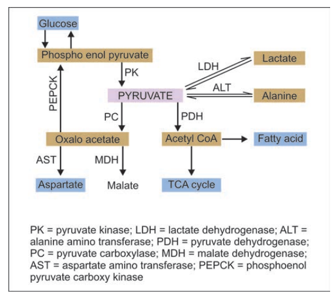 {left=39.85 top=0.00 width=59.48 height=93.33}

**Pyruvate as a Junction Point**

Pyruvate occupies an important junction between various metabolic pathways. It may be decarboxylated to acetyl CoA which enters the TCA cycle, or may be utilized for **fatty acid synthesis**. Pyruvate may be carboxylated to oxaloacetate which is used for gluconeogenesis

---

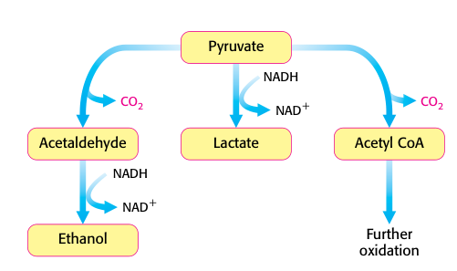 {left=47.81 top=0.00 width=52.19 height=55.00}

**Anaerobic conditions**

Under **aerobic **conditions, the pyruvate formed in the final step of glycolysis
is oxidized to acetate (acetyl-CoA), which enters the citric acid cycle and is
oxidized to CO2 and H2O.

In lactate fermentation, pyruvate is converted to lactate by the enzyme lactate dehydrogenase. In the process, NAD+ is regenerated. The reaction catalyzed by lactate dehydrogenase (LDH).

Ethanol fermentation needs 2 enzymes: pyruvate decarboxylase and alcohol dehydrogenase.

---

In this process, pyruvate is decarboxylated first to acetaldehyde by the thiamine pyrophosphate (TPP)-requiring enzyme pyruvate decarboxylase. The resulting product, acetaldehyde, is then reduced by NADH to form ethanol by the enzyme ethanol dehydrogenase in a process that reforms NAD+. Yeast is a **facultative **(not obligate) anaerobe in that it can produce energy by glycolysis and ethanol fermentation in the absence of oxygen. 

Of course, in the presence of oxygen, the pyruvate produced from glycolysis in yeast is preferentially converted to acetyl-CoA, which enters the citric acid cycle and oxidative phosphorylation pathways to maximize ATP production.

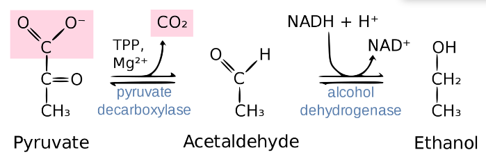 {left=50.00 top=-0.00 width=50.15 height=28.83}

**Ethanol Fermentation in Yeast**

---

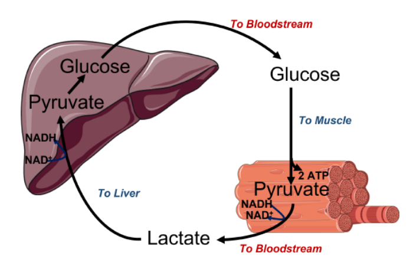 {left=65.32 top=0.00 width=34.68 height=39.38}

Cori cycle

During **anaerobic **metabolism, **lactate **is produced by muscle tissue and released into the bloodstream, where it can travel back to the liver. Once in the liver, lactate is converted back into pyruvate and can be utilized to produce glucose through a pathway called gluconeogenesis. The liver can export glucose into the blood.  There, it is taken up by the muscle and used for ATP production. This cycle is called the Cori cycle

Notably, animal anaerobic metabolism can only be sustained for short periods due to its high energy demand. Aerobic respiration is required to maintain an adequate ATP supply. However, the production of lactate by certain tissues, such as white or fast-twitch muscle cells, occurs regularly and releases lactate into the bloodstream, which can be taken up and used as an energy source by neighboring tissues, such as red, slow-twitch muscle. Brain tissue can also effectively use lactate as an energy source. Within these 'consumer' tissues, lactate is converted back into pyruvate using the mitochondrial LDH enzyme.  It can be converted to pyruvate and used in aerobic respiration to produce high levels of ATP.

---

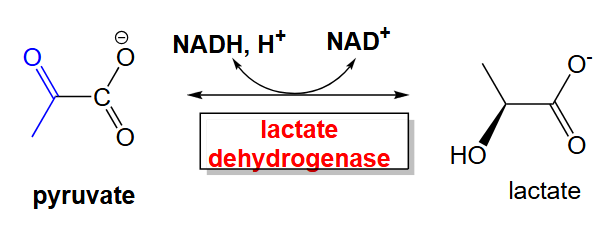 {left=16.70 top=3.29 width=41.28 height=28.05}

Dogfish M4 apo-lactate dehydrogenase (1LDM)

<u>3D View</u>
<u>Open/Closed</u> toggle with ‘a’
<u>Mechanism</u>

The reaction is reversible with the ΔG0 for conversion of pyruvate to lactate of -3.76 kcal/mol (-15.7 kJ/mol). Under anaerobic conditions, when glycolysis is the major source of ATP, pyruvate levels increase, further driving the reaction towards lactate formation and NAD+ regeneration so glycolysis can continue.

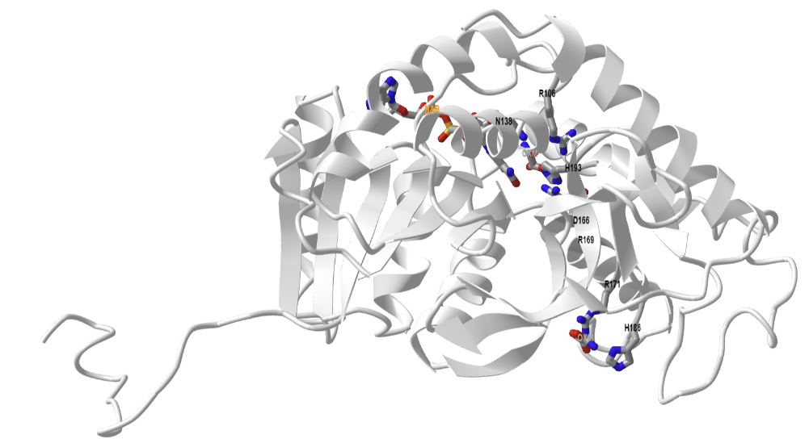 {left=17.74 top=30.89 width=39.20 height=38.22}

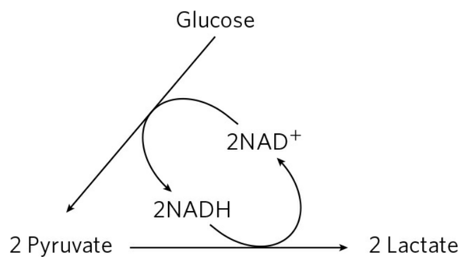 {left=27.07 top=69.11 width=30.91 height=30.89}

---

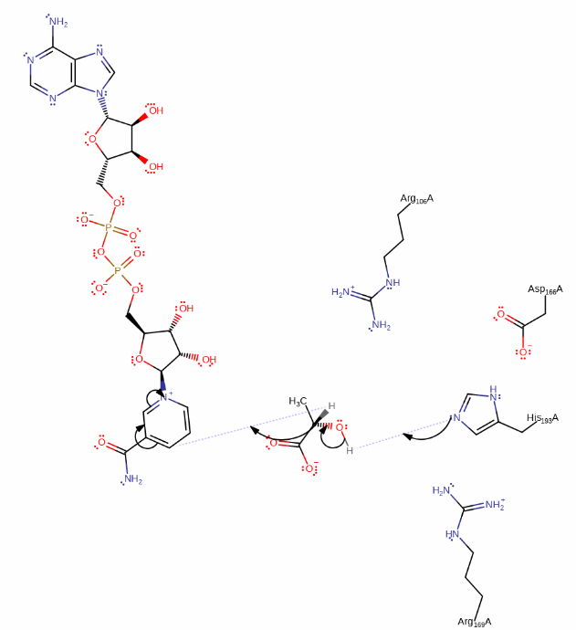 {left=18.65 top=2.30 width=25.60 height=49.77}

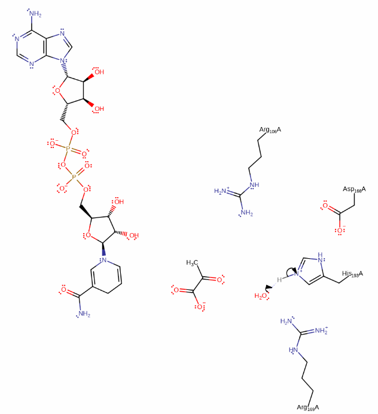 {left=63.24 top=2.30 width=27.11 height=52.70}

The enzyme is found in the cytoplasm, but a mitochondrial form also exists. It is most abundant in muscle, liver, and kidney, and it is also found in erythrocytes. Interestingly, mature red blood cells are enucleated and do not contain any mitochondria. Their lifespan is limited to approximately two weeks. During this time, their primary energy resources are generated through anaerobic fermentation via the glycolysis-lactate pathway.

The active enzyme is a tetramer of various compositions of two different subunits, the heart (H) and muscle (M) forms. The quaternary structures contain five different isozyme forms containing the H and M subunits. LDH-1, found most abundantly in the heart, is a tetramer of 4H subunits (H4). The other forms are as follows: LDH-2 (H3M, prevalent in red blood cells), LDL-3 (H2M2, prevalent in lungs), LDH-4 (HM3, prevalent in the kidney), and LDH-5 (M4, prevalent in muscle).

Step 1

Step 2

---

**Aerobic conditions**

The PDC and citric acid cycle reactions occur in the mitochondrial matrix. Cytoplasmic pyruvate and NAD+ must be transported from the cytoplasm into the matrix. Additionally, some enzymes in the citric acid cycle have both cytoplasmic and mitochondrial variants. Some homologous pairs are differentiated using NAD+ or NADP+ as an oxidizing agent. The ones in the cytoplasm are not part of the cycle. You would expect these enzyme pairs to have similar tertiary structures and active site chemistry.

---

**Pyruvate Dehydrogenase Complex**

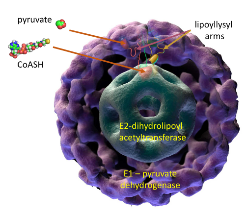 {left=16.07 top=19.46 width=41.55 height=64.21}

The E. Coli complex has a molecular weight of almost 4 million with at least 16 chains of three different enzymes catalyzing part of the reaction. The components are **pyruvate dehydrogenase** (E1), **dihydrolipoyl transacetylase **(E2), and **dihydrolipoyl dehydrogenase** (E3). The molecular weight of the bovine complex is almost 8 million, and it has 22 E1, 60 E2, and 6 E3 subunits. There are three α-ketoacid dehydrogenase complexes in many organisms. Each has a common E3 but specific E1 and E2 enzymes.

---

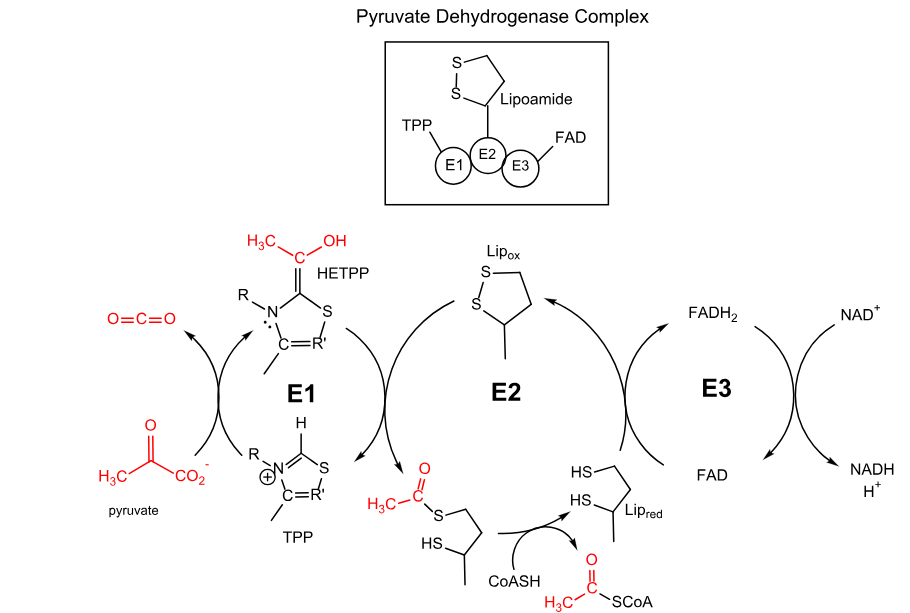 {left=28.00 top=0.00 width=72.00 height=94.07}

---

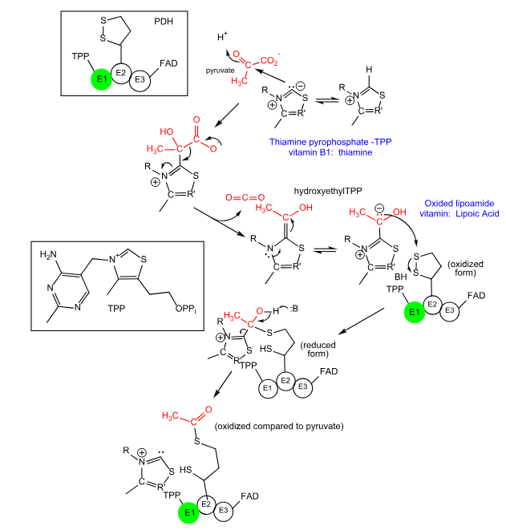 {left=15.12 top=2.96 width=48.44 height=94.07}

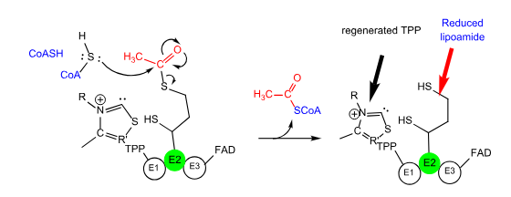 {left=56.10 top=0.00 width=43.90 height=30.10}

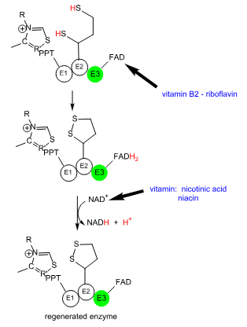 {left=72.84 top=36.03 width=27.16 height=63.97}

1

2

3

---

 {left=17.36 top=10.21 width=82.64 height=82.64}

---

Krebs Cycle

Getting energy in aerobic conditions

---

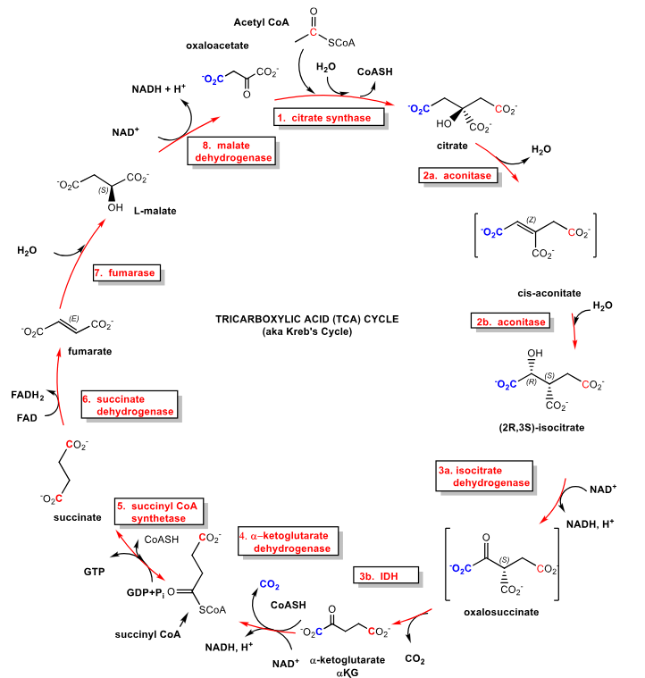 {left=48.89 top=0.00 width=50.34 height=94.07}

**1.** It is the final common oxidative pathway that
oxidizes acetyl CoA to CO2.
**2.** It is the source of reduced coenzymes that
provide the substrate for the respiratory chain.
**3.** It acts as a link between catabolic and anabolic
pathways (amphibolic role).
**4.** It provides precursors for synthesis of amino
acids and nucleotides.
**5.** Components of the cycle have a direct or indirect
controlling effect on key enzymes of other
pathways

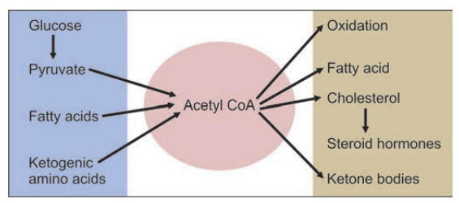 {left=64.56 top=42.50 width=18.98 height=14.99}

---

**Why a cycle?**

Why is this pathway cyclic and not linear, as we have seen for glycolysis? A simple answer is that it evolved that way, but why would that be advantageous? It turns out that some of the key "intermediates" in the pathway are pulled away for the biosynthesis of other biomolecules. If the citric acid cycle were linear and intermediates pulled off for other reactions, the linear pathway would taper off, which would not be optimal for a key energy production pathway. Of course, removing intermediates from a cyclic pathway would also slow down the process. Still, when this happens, enzymes outside the cycle are used to produce key reaction intermediates that keep the cycle going. The replenishing reactions are called **anaplerotic**.

---

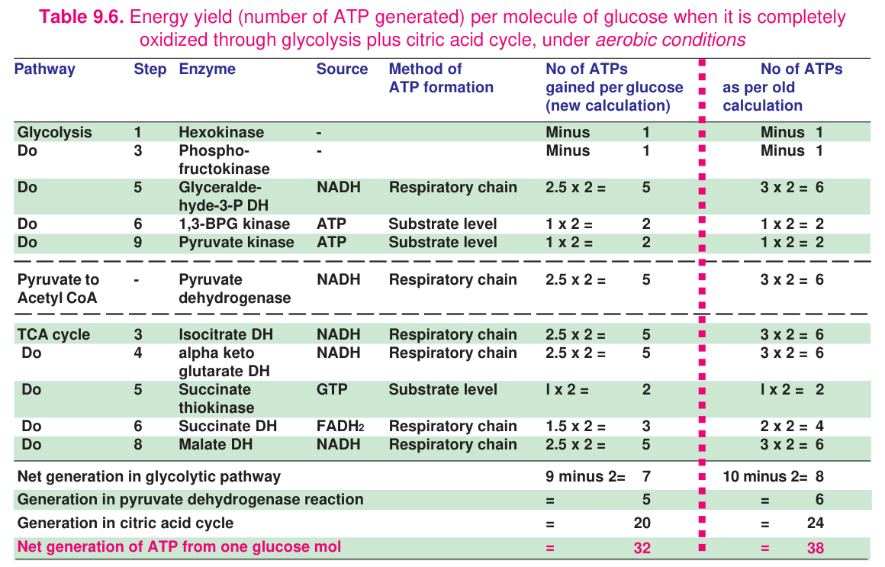 {left=16.33 top=2.96 width=82.62 height=94.07}

---

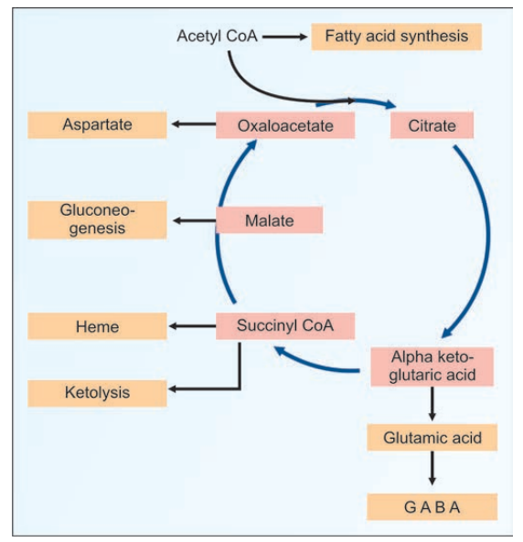 {left=21.72 top=8.80 width=33.78 height=62.27}

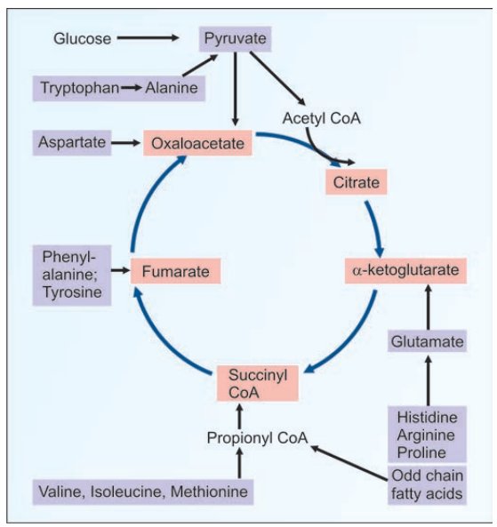 {left=64.02 top=8.80 width=33.02 height=62.27}

Efflux of TCA cycle intermediates

Influx of TCA cycle intermediates

---

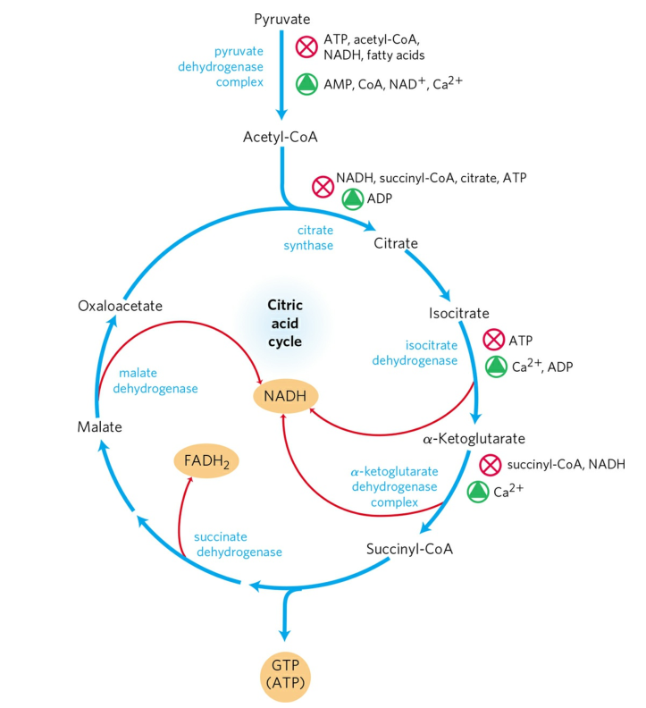 {left=56.50 top=0.00 width=43.50 height=94.07}

Regulation of metabolite flow from the PDH complex
through the citric acid cycle in mammals.

Fluoroacetate (toxic)

Arsenite (toxic)

---

**Reaction 1. Citrate Synthase ΔG****o**** = -31 kJ/mol**

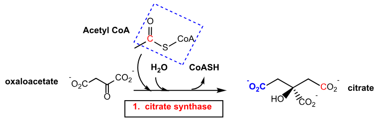 {left=16.07 top=16.44 width=49.52 height=28.59}

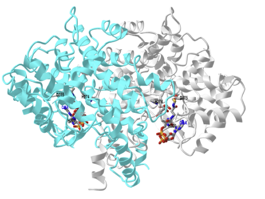 {left=17.45 top=50.00 width=32.55 height=46.37}

pig citrate synthase bound to CoASH and citrate (2CTS). 
The enzyme is a dimer, with its monomers depicted in different colors. Citrate and CoASH are shown as sticks and labeled. The active site residues in each subunit are shown as sticks and labeled.
<u>3D View</u>
<u>Mechanism</u>

Acetyl CoA is a thioester. Hence, it is "high energy" compared to its hydrolysis products. (Remember, there is no such thing as a "high energy" bond.) The free energy released in its hydrolysis is used to drive the reaction forward. This is important. Otherwise, citrate would not be formed readily. This reaction feeds the end product of glycolysis into the citric acid cycle.

---

animated gif of the conformational changes between the citrate-bound version (open, green) and the citrate and CoASH-bound form (blue).

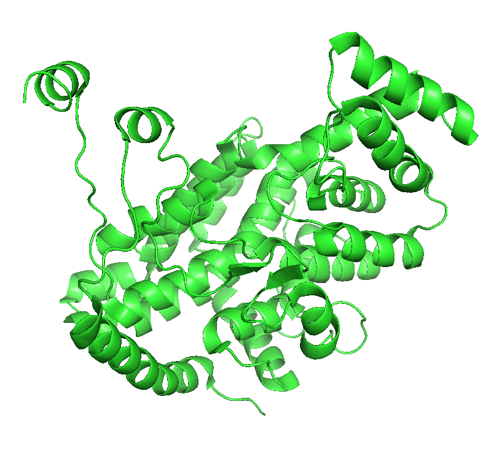 {left=17.38 top=32.56 width=39.48 height=64.47}

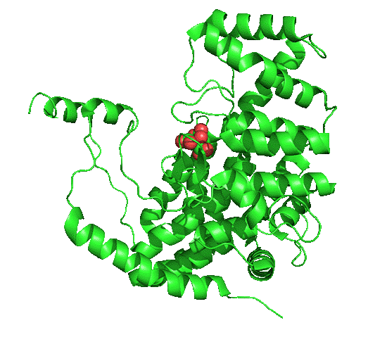 {left=58.89 top=31.20 width=39.82 height=63.83}

---

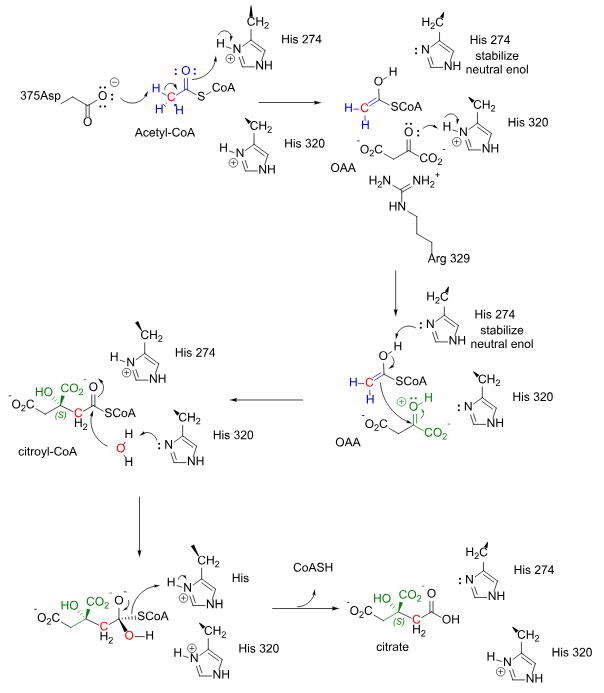 {left=53.88 top=1.64 width=46.12 height=94.07}

The 4 carbon, oxaloacetate condenses with 2 carbon, acetyl CoA to form 6 carbon compound, the citrate (a tricarboxylic acid). The enzyme is citrate synthase. The hydrolysis of the thio-ester bond in acetyl CoA drives the
reaction forward. This is an **irreversible **step. 

However, body can reverse this step by another enzyme, ATP-citrate lyase.

---

**2. Aconitase  ****ΔG****o**** = +6.3 kJ/mol**

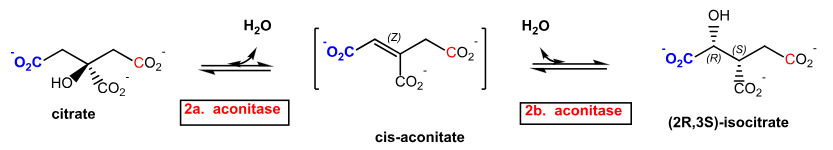 {left=16.39 top=11.09 width=64.07 height=20.51}

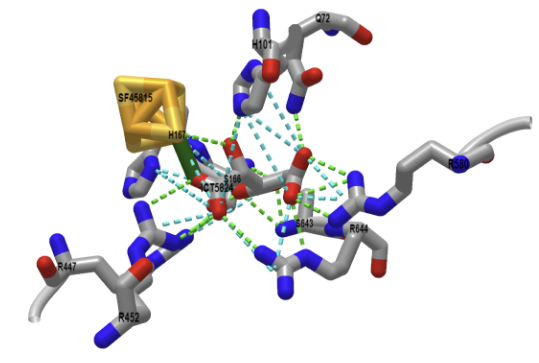 {left=16.39 top=31.60 width=35.24 height=42.19}

Citrate ↔ Isocitrat

<u>Bovine S642A aconitase with bound citrate (1C97).</u>

the chemical rationale for this reaction is to move an OH to a beta position, which in a subsequent step is converted to a β C=O, so it can act as an electron sink to facilitate decarboxylation in a following reaction! The reaction is readily reversible (note the small ΔGo value) since the reactant and product are simple isomers of each other.

---

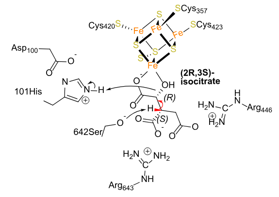 {left=16.13 top=0.00 width=49.15 height=61.85}

The enzyme has an inorganic Fe4S4 cluster. Each Fe in the cluster coordinates to 4 S2- in a cubane structure, but when either citrate or isocitrate is bound, one of the Fe ions interacts with both the Os of a substrate carboxylate. The other two carboxylates of isocitrate are stabilized through ion-ion interactions by Arg 446 and 663.

An active site deprotonated serine abstracts a proton at the S carbon. This is followed by the formation of the C-C double bond and the release of the resulting cis-aconitate from one bond to the FeS cluster.

This cis-aconitate intermediate in the interconversion of citrate and isocitrate undergoes a 180 flip around the C=C double bond (mechanism is still **unknown**). This is followed by rehydration to form the other isomer. The deprotonated His 101 abstracts a hydrogen from a water-bound to the FeS cluster, with the hydroxide acting as a nucleophile, which, along with the redonation of a hydrogen ion on the protonated Ser 642, the alpha-carbon, completes the rehydration step in the formation of the other isomer.

---

**3. Isocitrate Dehydrogenase (IDH) **** ΔG****o**** = -8.4 kJ/mol**

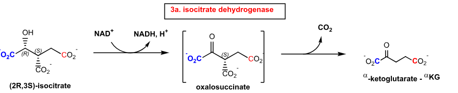 {left=16.07 top=13.01 width=57.96 height=21.07}

Isocitrate + NAD+ → α-ketoglutarate + NADH + H+

The chemical rationale should be clear. In this step, the CO2 is removed as NADH is produced through an oxidative decarboxylation. The NADH will be reoxidized back to NAD+ in the electron transport chain, resulting in ATP production.

There are two forms: a cytoplasmic (NADP+) form and a mitochondrial (NAD+ ) form.

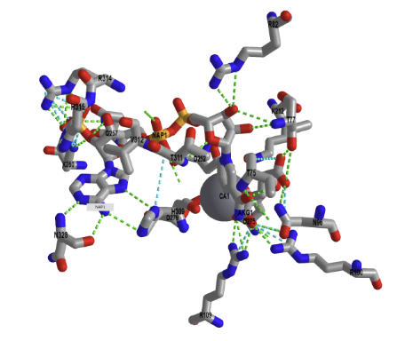 {left=16.07 top=41.56 width=24.96 height=37.37}

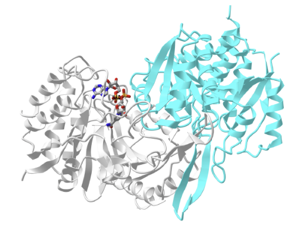 {left=41.03 top=41.93 width=26.62 height=36.64}

<u> Active site of the cytoplasmic human IDH1 in complex with NADP</u><u>+</u><u> (NAP1) and Ca</u><u>2+</u><u>/ alpha-ketoglutarate (4L03)</u>

<u>αβ heterodimer of human IDH3 (6kdy) in complex with NAD</u><u>+</u><u>(6kdy)</u>

---

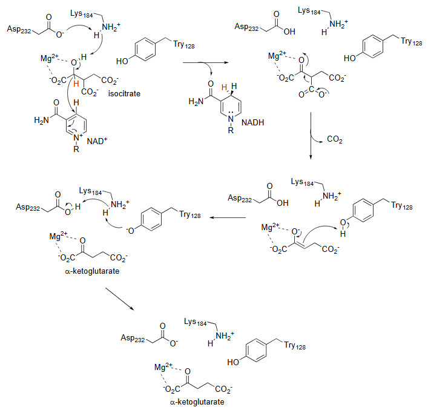 {left=16.86 top=0.00 width=42.95 height=73.11}

Plausible mechanism of isocitrate dehydrogenase

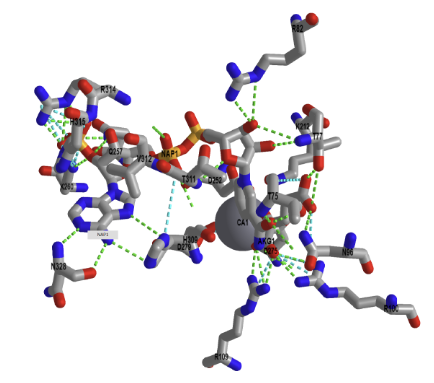 {left=68.47 top=-0.18 width=31.98 height=50.18}

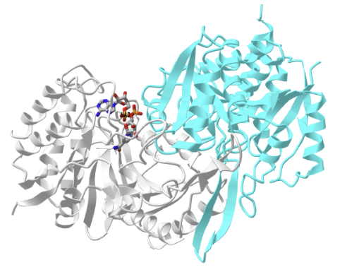 {left=67.19 top=55.08 width=32.81 height=44.92}

<u>Active site of the cytoplasmic human IDH1 in complex with NADP+ (NAP1) and Ca2+/ alpha-ketoglutarate (4L03)</u>

<u>αβ heterodimer of human IDH3 (6kdy) in complex with NAD+(6kdy)</u>

---

**4. α-ketoglutarate dehydrogenase ΔG****o**** = -30 kJ/mol**

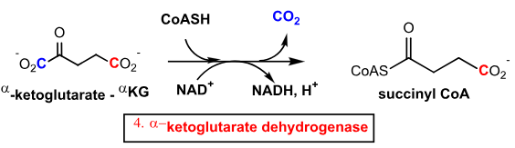 {left=16.07 top=14.56 width=47.84 height=24.58}

**5. Succinyl-CoA synthetase (SCS) ****ΔG****o**** = -3.3 kJ/mol**

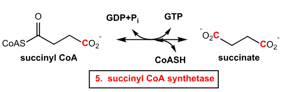 {left=16.60 top=63.74 width=49.33 height=28.57}

The oxidative decarboxylation of α-ketoglutarate accomplished the same way as another α-ketoacid, pyruvate.

This is the first step in which the energy change in the cycle is explicitly captured in the form of a high-energy (with respect to its hydrolysis product) phosphoanhydride bond in the form of GTP (ATP in some organisms). From a chemical step, the cleavage of the thermodynamically unstable thioester is coupled to the endergonic synthesis of GTP. This can transfer its terminal phosphate to ADP to make ATP in a reaction with a ΔGo ≈ 0 kcal/mol.

---

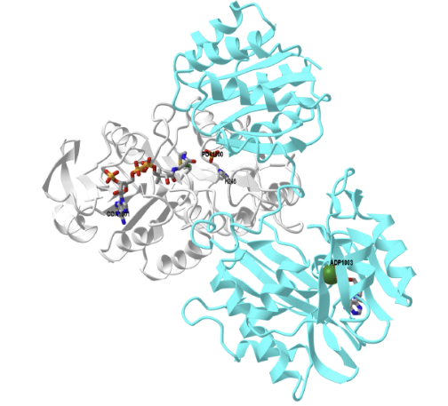 {left=16.27 top=25.39 width=36.58 height=58.96}

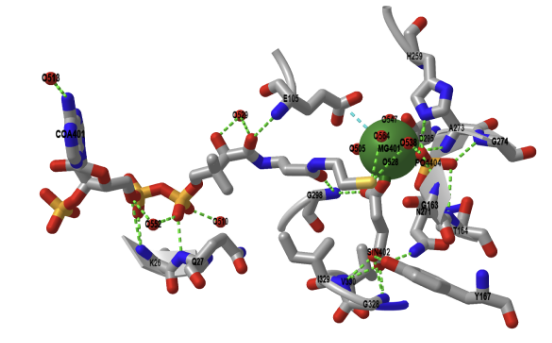 {left=52.85 top=34.24 width=43.82 height=48.41}

<u>Active site of pig GTP-specific succinyl-CoA synthetase in complex with succinate and CoASH (5CAE).</u>

<u>Complex of ADP and Mg</u><u>2+</u><u> with Dephosphorylated E. Coli Succinyl-CoA Synthetase (1CQI).</u>

Succinyl-CoA synthases have two subunits, α and β. The enzyme in E. coli is a tetramer (α2β2) with the catalysis occurring at the αβ interface. The alpha-subunits interact only with the beta-subunits, whereas the beta-subunits interact to form the dimer of alpha beta-dimers with CoA bound in each α subunit to a nucleotide-binding loop.

---

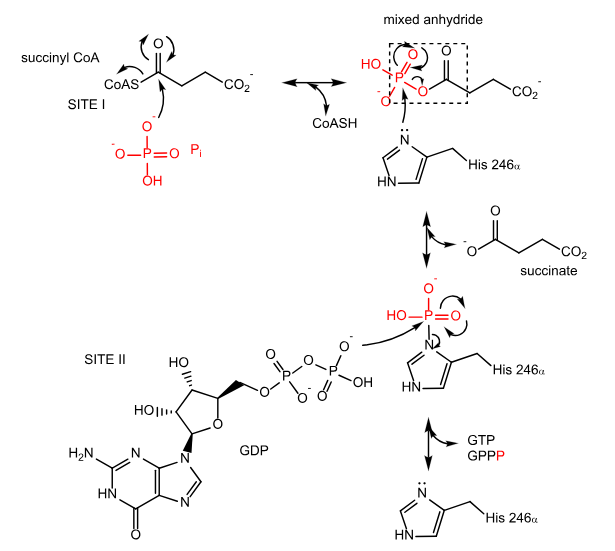 {left=17.07 top=1.71 width=43.79 height=69.75}

Abbreviated mechanism for succinyl-CoA synthase

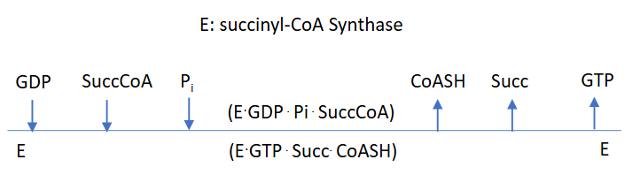 {left=16.08 top=72.94 width=51.11 height=27.06}

Kinetic analysis suggests that the three substrates bind in a specific order, catalysis occurs, and then the three products leave. This type of reaction is called an ordered ter ter (tertiary - 3 reactants - in both the forward and reverse)

The three steps in the reaction are shown below, where E is the free enzyme, a . indicates a noncovalent complex, and a - represents a covalent bond 
E + succinyl-CoA + Pi ↔ E . succinyl-PO3 + CoASH
E . succinyl-PO3 ↔ E-PO3 + succinate
E-PO3 + NDP ↔ E + NTP

---

**6. Succinate Dehydrogenase ****ΔG****o**** = 0 kcal/mol**

succinate + FAD ↔ fumarate + FADH2

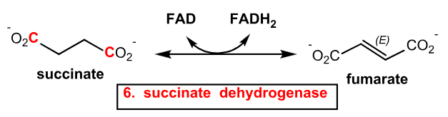 {left=15.73 top=11.16 width=38.06 height=17.70}

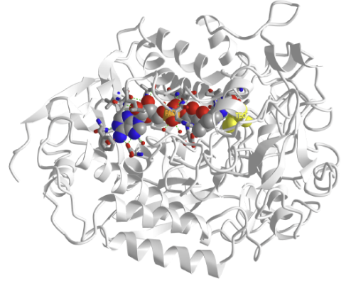 {left=15.73 top=40.99 width=38.96 height=55.53}

<u>Avian respiratory complex II FAD binding subunit with FAD and a malate-like intermediate (1YQ3).</u>

The enzyme is yet another step in closing the cycle to reform oxaloacetate. It is also our first encounter with FAD as an oxidizing agent. Its reduction product, FADH2, will be reoxidized in the electron transport chain (mitochondrial inner membrane for eukaryotes), producing energy for ATP. Hence, it can be considered a proxy ATP-generating reaction.

---

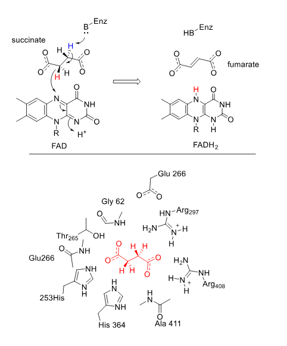 {left=18.18 top=2.96 width=43.90 height=94.07}

General and abbreviated mechanism for the enzyme's immediate reaction of succinate with FAD.

<u>More Detailed</u>

The succinate dehydrogenase enzyme is part of the larger Complex II of the electron transport chain.

In contrast to NAD+/NADH, the FAD/FADH2 pair stays tightly bound to the enzyme and doesn't readily dissociate. This means that after one cycle of catalysis, the enzyme is functionally "dead". Another oxidizing agent must bind to the enzyme and reoxidize FADH2 back to FAD.

Amino acids surrounding succinate in the avian (bird) version of the enzyme (1yq4)

Arg 279 is probably the general base

---

**7. Fumarase ****ΔG****o**** = -3.8 kJ/mol**

fumarate + H2O ↔ L-malate

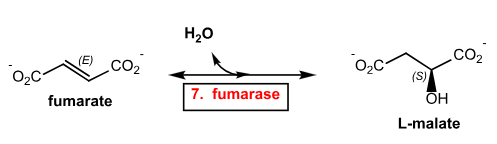 {left=14.18 top=9.78 width=39.72 height=20.46}

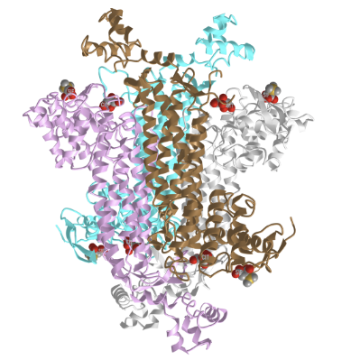 {left=15.48 top=42.30 width=26.99 height=50.51}

<u> Fumarase with beta-(trimethylsilyl)maleate and citrate (1fuq)</u>

The chemical rationale for this reaction is clear.  It is the penultimate step in the resynthesis of oxaloacetate, one of the reactants that start the cycle. This reaction introduces oxygen through hydration, which can be subsequently oxidized in the next step to produce NADH for electron transport and ATP production.

---

There are Class I (dimers containing an unstable FeS cluster) and Class II (tetramer, no bound iron, oxygen stable) fumarases. Humans possess both cytoplasmic and mitochondrial type II fumarases, which result from the alternative transcription of the fumarase genes. We will consider type II fumarase C from E. Coli.

The tetramer consists solely of α-helices and random coils, featuring two distinct binding sites. Site A appears to be the active site and contains a buried water molecule. Site A, formed from three subunits, binds competitive inhibitors such as citrate and β-(trimethylsilyl)maleate, a cis substrate for fumarase, and is buried. 12 Å away is site B, which is found in only one of the subunits near a pi-helix (H129 through N135) and is more surface-exposed. Each site has a histidine, but mutation of only H188N in the A site disrupts enzyme activity. Both sites bind multi-carboxylates. The role of site B is a bit unclear, but it is most likely an allosteric site involved in the transfer of product (malate) from the buried site to the surface for ultimate dissociation.

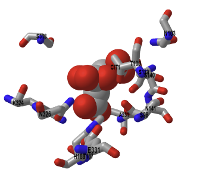 {left=15.88 top=0.00 width=35.52 height=54.81}

<u> Binding site of the competitive inhibitor citrate in fumarase (1FUQ).</u>

---

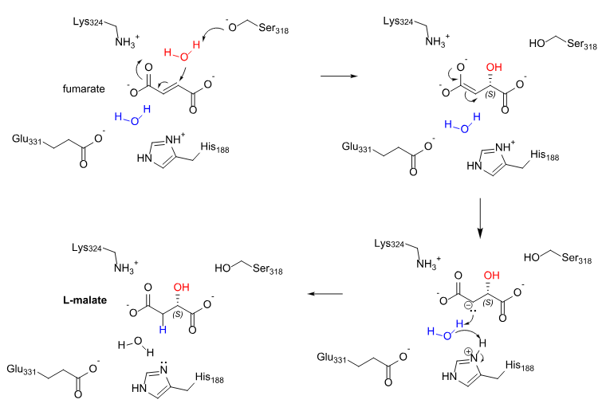 {left=21.48 top=3.34 width=66.30 height=81.57}

Mechanism for fumarase

---

**8. Malate Dehydrogenase (MDH) **** ΔG****o**** = 30 kJ/mol**

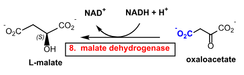 {left=17.19 top=14.73 width=41.31 height=22.55}

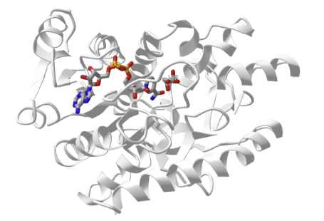 {left=16.15 top=46.38 width=41.94 height=50.80}

<u> NAD</u><u>+</u><u> and malate bound to human malate dehydrogenase 2 (4wlu). </u>

This last reaction of the citric acid cycle produces oxaloacetate, the starting reactant, allowing the cycle to continue. It also produces NADH for mitochondrial e-transport/ATP production. Notice that the reaction is thermodynamically unfavorable (in the standard state), but the reaction is pulled to citrate formation by the next (and first step of the cycle, citrate synthase).

---

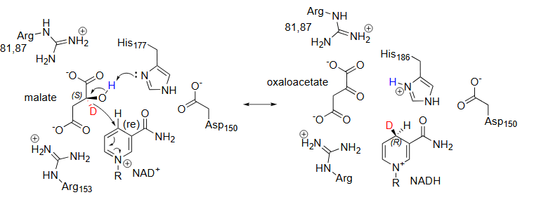 {left=24.15 top=3.54 width=63.16 height=42.55}

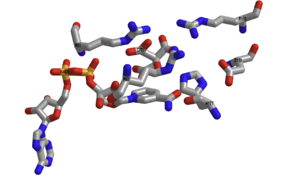 {left=18.31 top=57.65 width=36.61 height=39.07}

<u>Active site of the E. Coli malate dehydrogenase with bound citrate and NAD</u><u>+</u><u> (1EMD).</u>

Abbreviated mechanism for malate dehydrogenase. Note that the hydride transferred from the malate is shown in red as a deuterium (D).

---

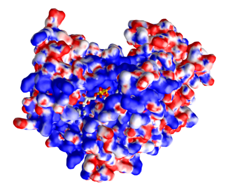 {left=16.43 top=1.73 width=41.50 height=59.14}

<u> Electrostatic surface potential of malate dehydrogenase (4WLU)with bound NAD</u><u>+</u><u> (4WLU). </u>

The displayed surface is the electrostatic surface potential map of the enzyme. Red shows the more anionic surfaces with a negative electrostatic potential to which cations would be attracted. At the same time, blue represents more cationic surfaces to which anions would be attracted. Note that the bound NAD+, which has many oxygens that are slightly or entirely negative, is bound in a blue, positive electrostatic potential region.

---

 {left=15.07 top=3.82 width=84.93 height=84.93}

---

Electron Transport Chain

Getting energy in aerobic conditions

---

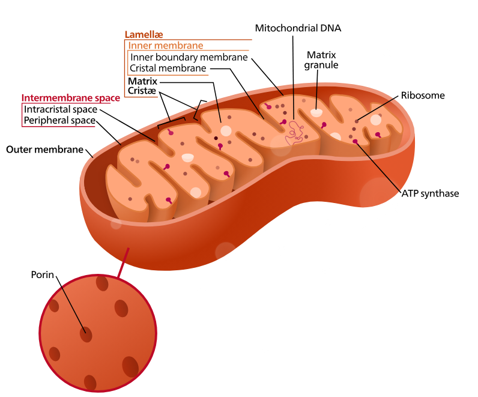 {left=15.70 top=0.00 width=58.50 height=86.36}

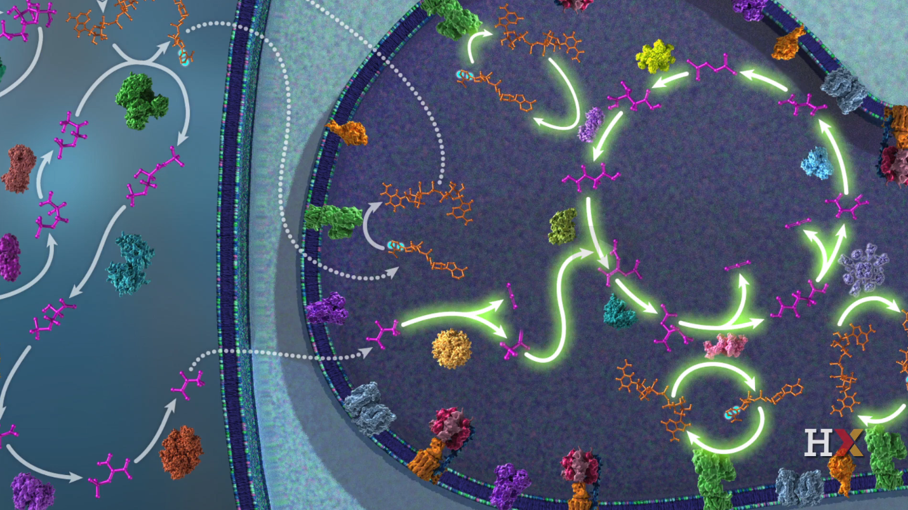 {left=50.00 top=50.02 width=50.00 height=49.98}

Mitochondrion

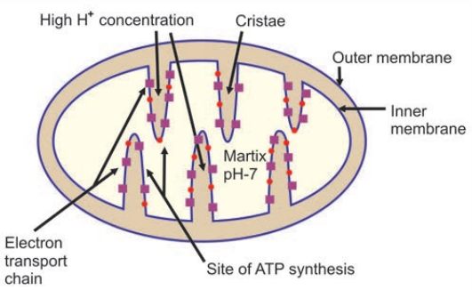 {left=72.34 top=8.58 width=27.66 height=30.19}

---

Have their own circular DNA (~16.6 kb in humans).
Encode 13 proteins, 22 tRNAs, and 2 rRNAs (all for oxidative phosphorylation).
Most mitochondrial proteins (>1000) are encoded by nuclear DNA and imported.
Inherited maternally (sperm mitochondria are typically degraded after fertilization).
“Mitochondrial Eve” — the most recent common maternal ancestor, ~150,000–200,000 years ago.
Endosymbiotic origin: descended from an α-proteobacterium engulfed by a proto-eukaryote ~1.5–2 billion years ago.
Constantly undergo fission (splitting) and fusion (joining).
-  Fusion: helps mix contents, complementing damaged mitochondria.
- Fission: helps isolate damaged parts, critical for mitophagy.
Highly dynamic network, not just “static ovals”

---

Apoptosis regulation: release of cytochrome c triggers caspase cascade.
Calcium buffering: uptake & release influences signaling and cell death.
Heat generation: brown adipose tissue mitochondria use uncoupling protein (UCP1) to produce heat instead of ATP.
Source of reactive oxygen species (ROS) (byproducts of ETC).
Mutations in mitochondrial DNA cause diseases: Leber’s hereditary optic neuropathy (LHON), Lethal infantile mitochondrial ophthalmoplegia, Myoclonic epilepsy, Mitochondrial encephalomyopathy lactic acidosis stroke-like episodes (MELAS). Additionally see 3-parents-kid.
Number and shape change with stress, energy demand, aging.
Accumulation of mitochondrial mutations is linked to aging theories (ROS damage hypothesis).

Main site of ATP production (oxidative phosphorylation, ~30–32 ATP per glucose).
Inner membrane forms cristae to increase surface area for electron transport chain (ETC).
Have double membrane structure: Outer membrane permeable (porins). Inner membrane highly selective, contains ETC, impermeable to ions.
Maintain proton gradient (chemiosmosis) driving ATP synthase.

---

Under aerobic conditions, we continually breathe one of the best oxidizing agents, dioxygen. NADH is oxidized back to NAD+ not directly by dioxygen, but indirectly as electrons flow from NADH through a series of electron carriers to dioxygen, which is then reduced to water. This process is called electron transport. No atoms of oxygen are incorporated into NADH or any intermediary electron carrier. Hence, the enzyme involved in the terminal electron transport step, in which electrons pass to dioxygen, is an oxidase.

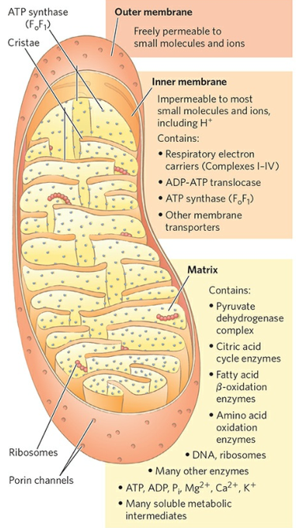 {left=17.37 top=1.25 width=29.62 height=94.07}

---

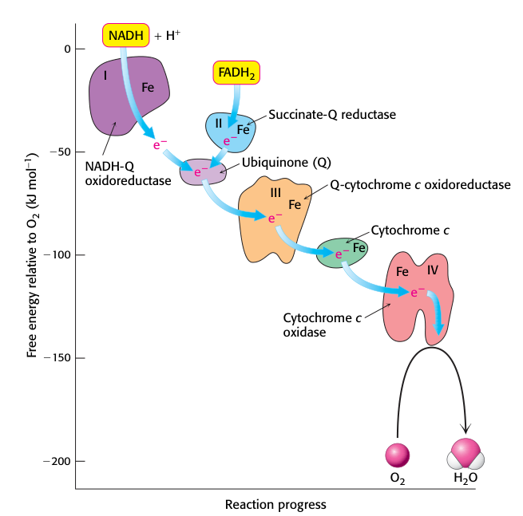 {left=15.59 top=0.00 width=53.57 height=94.07}

Electrons are transferred from NADH to O2 through a chain of three large
protein complexes. Electron flow within these transmembrane complexes is highly exergonic and powers the
transport of protons across the inner mitochondrial membrane. A fourth large protein complex, contains the succinate dehydrogenase that generates FADH2 in the citric acid cycle. Electrons from this FADH2 enter the electron-transport chain at Q-cytochrome c oxidoreductase.

Can produce ROS

---

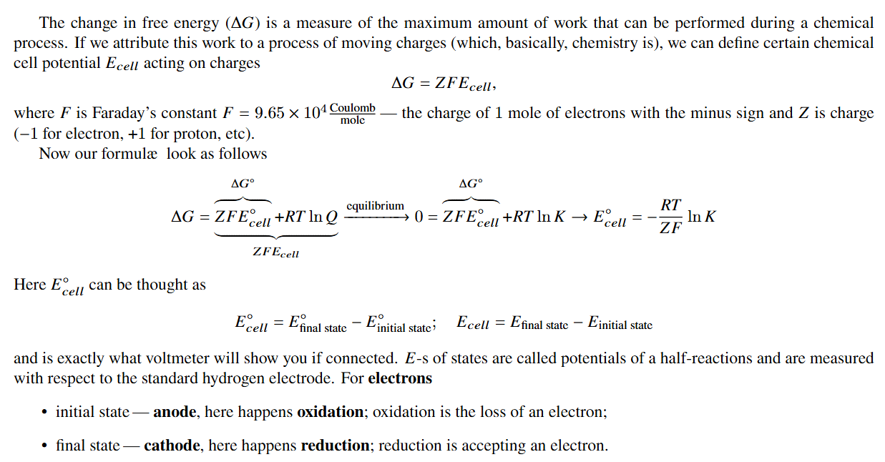 {left=21.60 top=0.00 width=78.40 height=72.79}

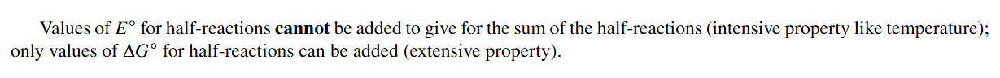 {left=22.43 top=77.90 width=76.74 height=10.66}

---

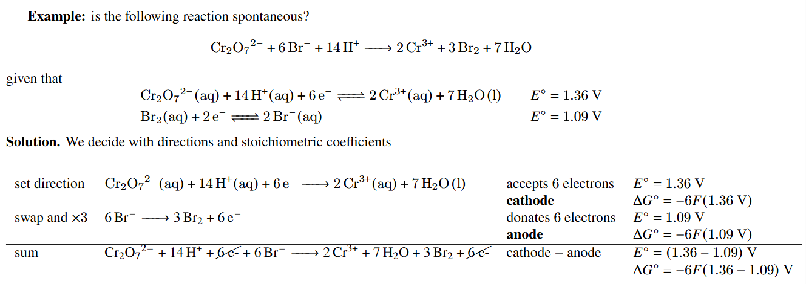 {left=18.35 top=0.00 width=81.65 height=51.38}

**Example 2 ** Lead-acid battery

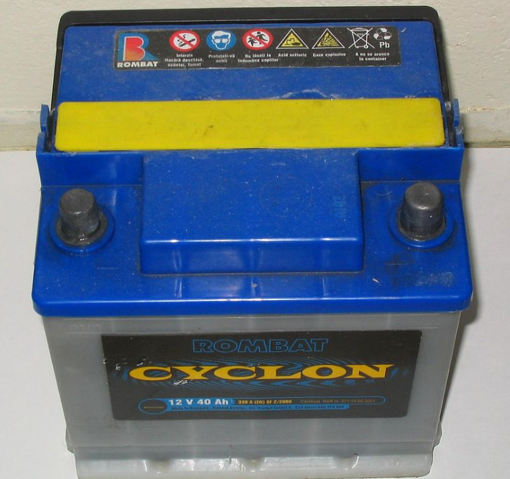 {left=79.14 top=72.15 width=16.03 height=26.76}

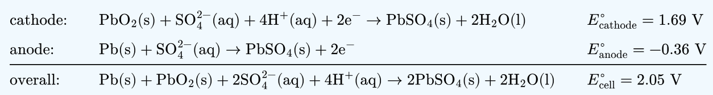 {left=17.26 top=61.26 width=56.63 height=13.57}

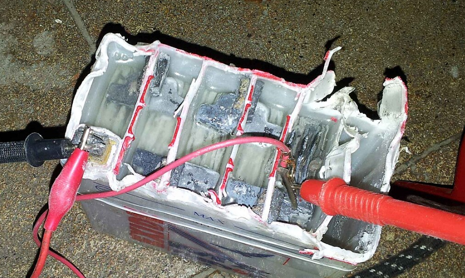 {left=17.26 top=75.61 width=21.95 height=23.30}

6 compartments x 2.05 V = 12.3 V

**See HW for an ETC example**

---

Summary of the flow of electrons and protons through the four complexes of the respiratory chain. Electrons reach Q (ubiquinone) through Complexes I and II (as well as through several other paths, e.g. glycerol 3-phosphate dehydrogenase). Reduced Q (QH2) serves as a mobile carrier of electrons and protons. It passes electrons to Complex III, which passes them to another mobile connecting link, cytochrome c. Complex IV then transfers electrons from reduced cytochrome c to O2. Electron flow through Complexes I, III, and IV is accompanied by proton efflux from the matrix into the intermembrane space. In bovine heart, the approximate ratios of Complexes I:II:III:IV are 1.1:1.3:3.0:6.7. Broken lines indicate the diffusion of Q in the plane of the inner membrane, and of cytochrome c through the intermembrane space.

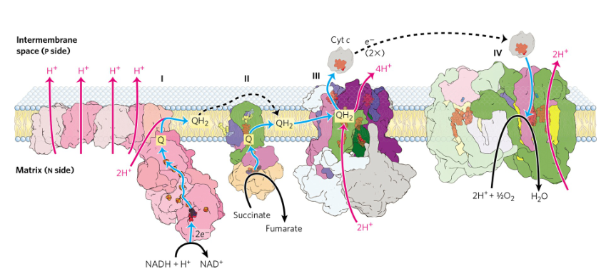 {left=27.85 top=-0.00 width=72.15 height=57.99}

---

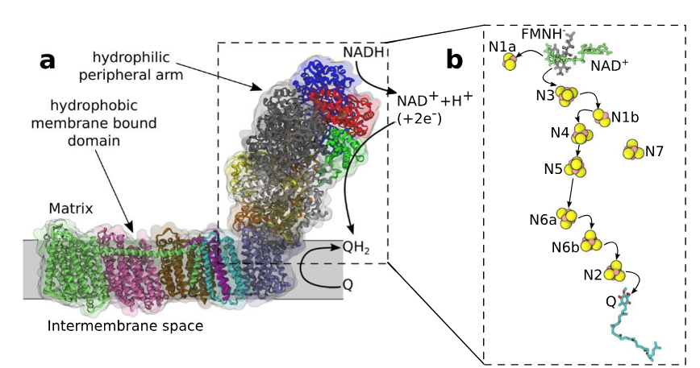 {left=16.11 top=50.00 width=53.42 height=50.00}

 {left=70.79 top=53.62 width=29.21 height=17.89}

Fe/S Clusters in Complex I

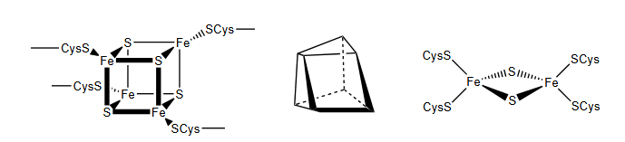 {left=77.24 top=72.92 width=16.31 height=17.89}

**Complex I - NADH-quinone oxidoreductase**

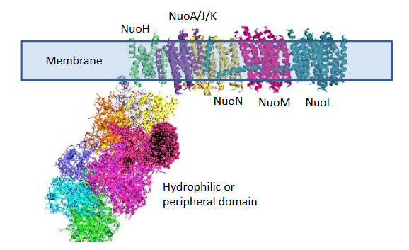 {left=16.11 top=7.78 width=37.58 height=40.80}

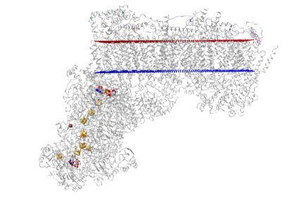 {left=54.47 top=6.72 width=34.53 height=42.91}

<u>Mammalian respiratory complex I (5LDW). </u>

matrix

---

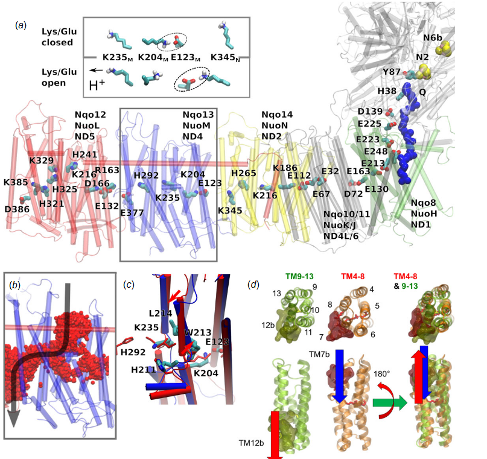 {left=17.68 top=22.17 width=46.43 height=77.83}

(a) The membrane domain of complex I has conserved buried charged/hydrophilic residues. NuoL (red); NuoM (blue); NuoN (yellow); NuoH (green); Ubiquone - Q (blue van der Waals representation).
(b) The NuoM antiporter-like subunit with water molecules (red dots). The arrow indicates the flow of protons through a hydrogen-bond-linked network of water molecules that "visit" the structure during a μs molecular dynamics simulation.
(c) Snapshot of structures obtained from molecular dynamic simulations of open (in blue) and closed (in red) proton channels from the N-side in Nqo13 (NuoM/ND4), showing conformational changes in the broken helix element.
(d ) The structural symmetry of the antiporter-like subunits with an N-side input channel near broken helix TM7b and an output channel near broken helix TM12b.

The conformation of the Lys-204M/Glu-123M can modulate the pKa of the middle Lys-235M. Lys prefers a **protonated **state in closed **state.** Consider (a) and influence on the pKa O- from Glu. <u>https://royalsocietypublishing.org/doi/10.1098/rsif.2017.0916</u>

---

**Complex III**

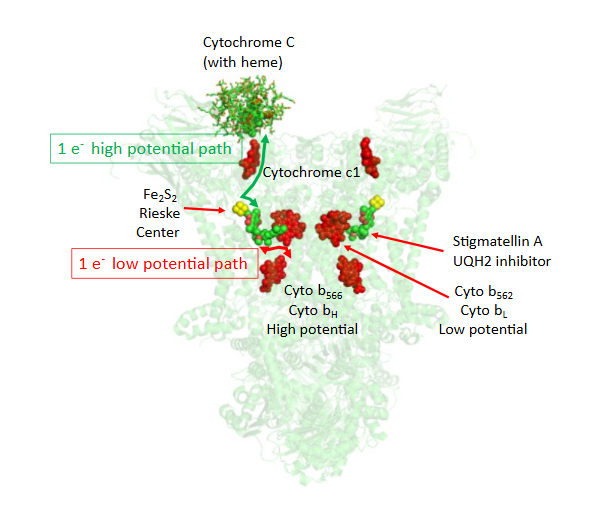 {left=17.23 top=16.04 width=38.29 height=60.60}

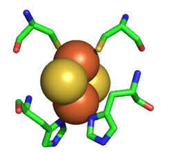 {left=17.94 top=36.16 width=5.78 height=9.15}

<u>eukaryotic respiratory complex III (3CX5). </u>

The subunits involved in electron transfer are cytochrome b, cytochrome c1, and the Rieske iron-sulfur protein (ISP). Cytochrome b has two hemes. One is cyto b562, which is also known as the low-potential heme or cyto bL. The other is cyto b566, the high-potential heme or cyto bH. The cytochrome c1 subunit has one heme.

Proton and electron transfer are coupled processes: the protons in Complex III are carried across the intermembrane space by ubiquinone itself (no channels!). Two reduced ubiquinones (UQH2) from complex I pass their four matrix-derived protons into the intermembrane space. In the process, four electrons are removed in a multiple-step process called the **Q cycle**.

---

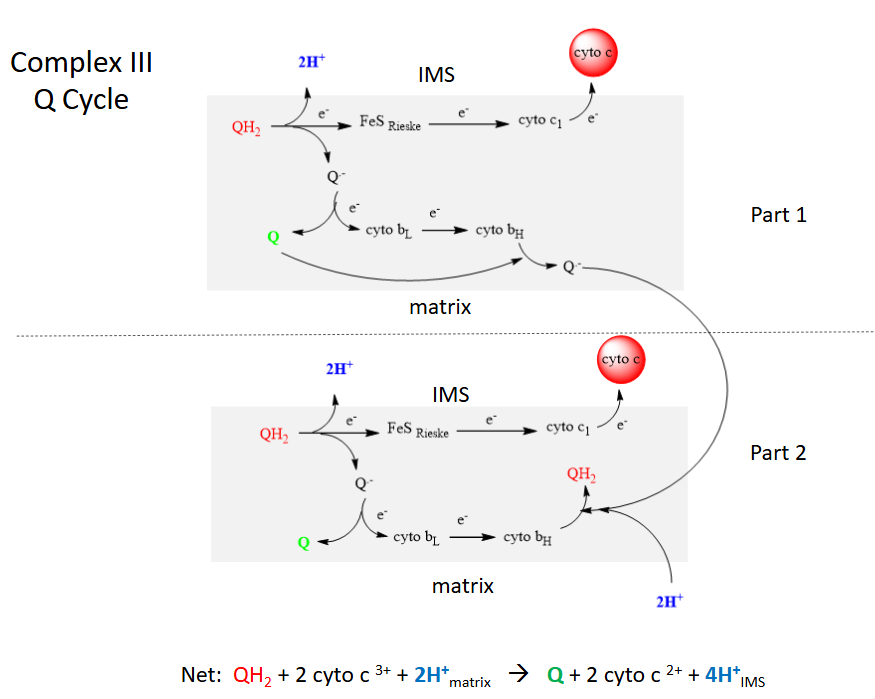 {left=60.40 top=-0.00 width=39.60 height=56.25}

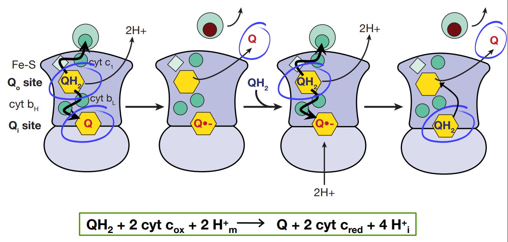 {left=16.52 top=0.00 width=43.88 height=37.25}

The two electrons from each UQH2 take different paths. One electron moves to a Rieske cluster and the other to cytochrome bL. The electrons moved to the Rieske center, then moved to cytochrome c1, and then to the mobile electron carrier cytochrome C, which is bound to the complex in the intermembrane space. The electrons moved to cytochrome bL are transferred to cytochrome bH in the complex. Through this latter path, two electrons (from two UQH2) are moved to oxidized UQ, and two matrix protons are added to reform one UQH2. Hence, only one UQH2 participates in the net reaction

---

**Complex IV - Cytochrome C oxidase (CCOx)**

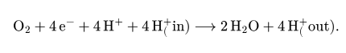 {left=17.44 top=9.22 width=44.79 height=12.22}

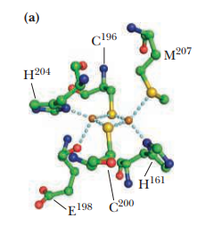 {left=71.22 top=62.16 width=19.28 height=37.84}

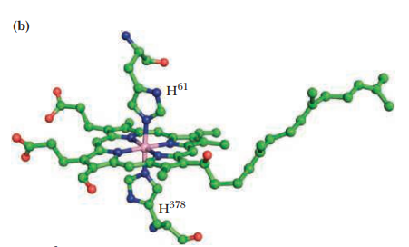 {left=17.44 top=66.44 width=31.30 height=33.56}

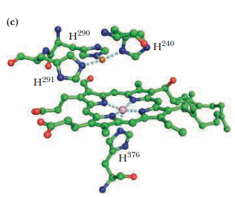 {left=48.74 top=66.44 width=22.48 height=33.56}

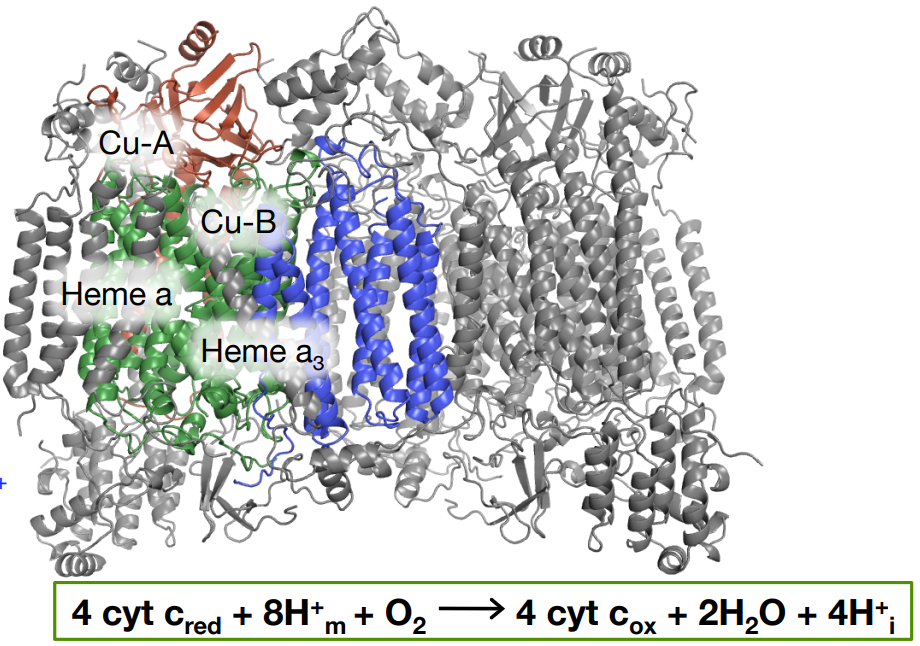 {left=17.44 top=18.88 width=39.16 height=48.89}

Structures of the redox centers of bovine cytochrome c oxidase. 
(a) The CuA site,
(b) the heme a site, and 
(c) the binuclear CuB/heme a3 site (PDB id 5 2EIJ)

---

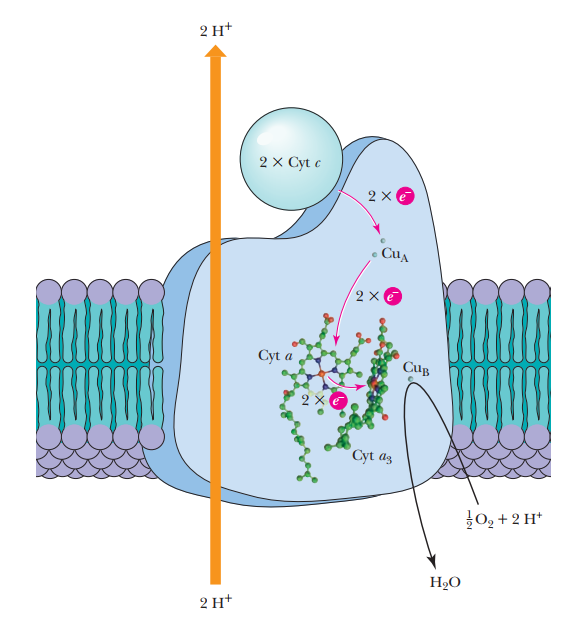 {left=18.92 top=0.04 width=29.78 height=57.79}

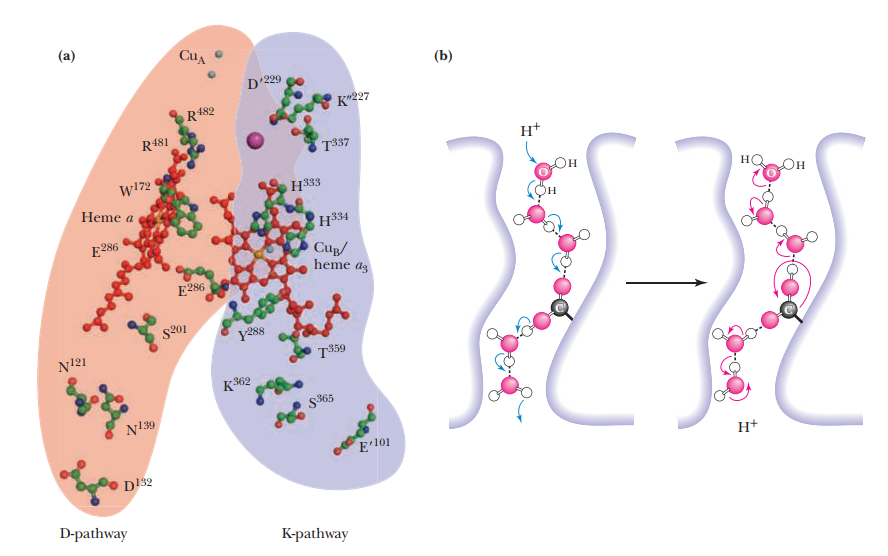 {left=50.99 top=2.96 width=47.35 height=52.70}

The proton channels of cytochrome c oxidase from R. sphaeroides. (a) Functional residues in the D- and K-pathways are indicated. The shaded D- and K-pathways converge at the CuB/heme a3 center. The proton exit channel is lined by residues 320 to 340 of subunit I (PDB id 51M56). (b) Protons are presumed to hop along arrays of water molecules in the proton transport
channels of cytochrome c oxidase. Two steps in the hopping model are shown. Such a chain of protonation and deprotonation events means that the proton eventually released from the exit channel is far removed from the proton that entered the D-pathway and initiated the cascade

pKa of Glu286 is unusually high at 9.4

---

**Complex II - succinate:ubiquinone oxidoreductase (SQR) - succinate dehydrogenase**

succinate + FAD ↔ fumarate + FADH2 ΔGo = 0 kcal/mol

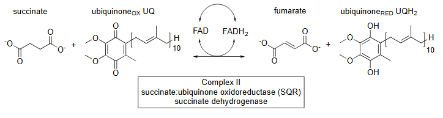 {left=15.42 top=25.40 width=58.69 height=27.81}

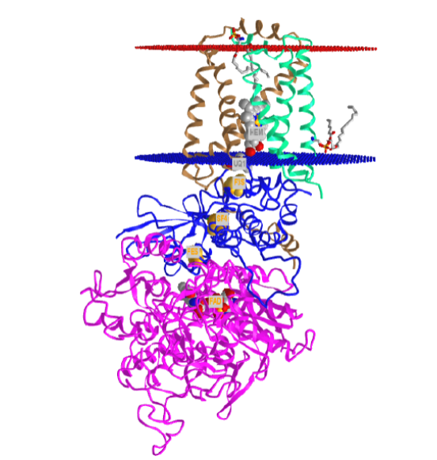 {left=15.42 top=51.78 width=25.85 height=48.37}

Model of the Mitochondrial Respiratory Complex II from porcine (pig) heart (1ZOY). The chains are:
hydrophilic FAD-binding protein (lavender)
hydrophilic FeS protein (blue)
integral membrane large cytochrome binding protein (brown)
integral membrane small cytochrome binding protein (green)

<u>Mitochondrial Respiratory Complex II from porcine heart (1ZOY) </u>

FAD/FADH2 are covalently attached to the enzyme, so after one cycle of enzyme catalysis, the enzyme is dead. Another substrate/product pair must interact with enzymes to reconvert the covalently attached FADH2 to FAD so catalysis can continue.

---

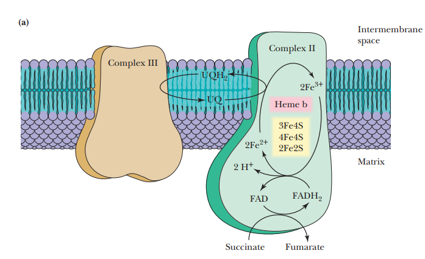 {left=17.63 top=0.00 width=53.18 height=57.65}

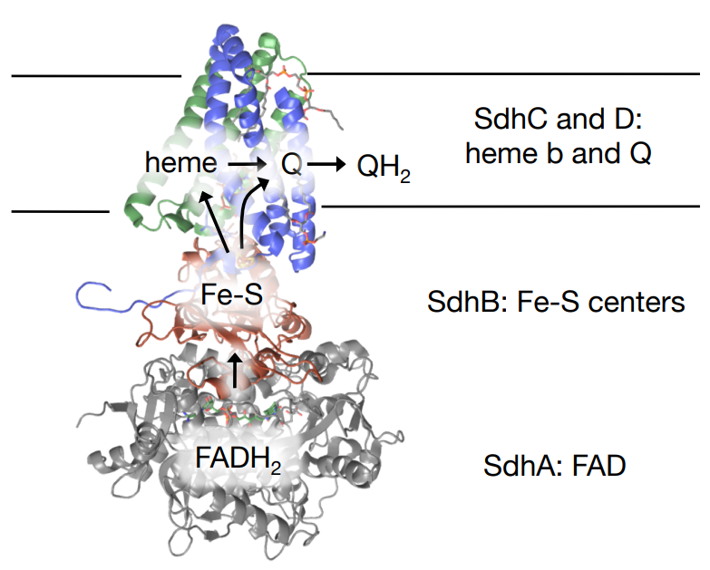 {left=17.63 top=58.04 width=30.33 height=43.31}

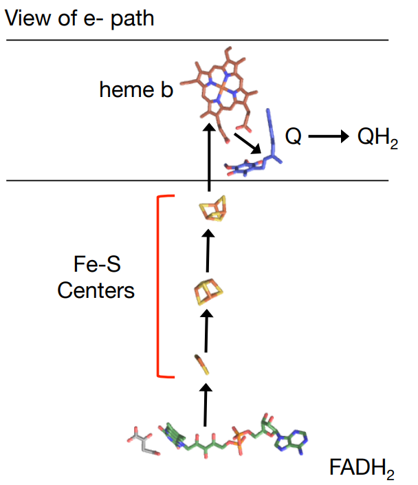 {left=48.70 top=59.40 width=19.70 height=40.60}

Complex II is the only enzyme that belongs to both the TCA cycle and the electron transport chain.
Unlike Complexes I, III, and IV, Complex II does not pump protons, so FADH₂ yields only ~1.5 ATP per oxygen reduced.
Defects in Complex II are linked to rare mitochondrial diseases and certain cancers.

---

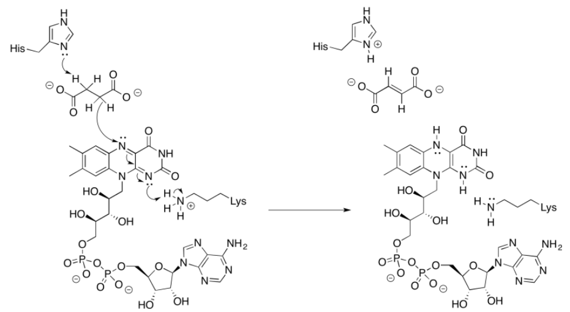 {left=21.59 top=1.53 width=70.06 height=68.23}

A mechanism for Succinate oxidation by FAD to Fumarate and FADH2

---

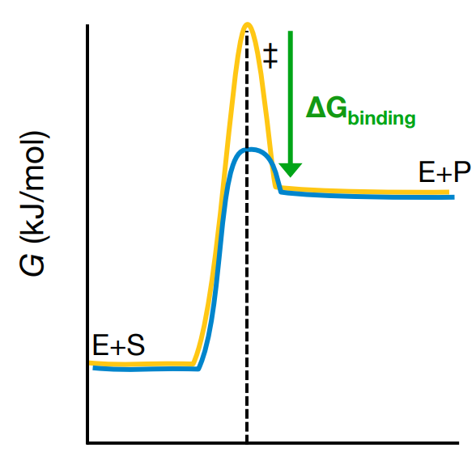 {left=19.04 top=1.65 width=30.96 height=53.36}

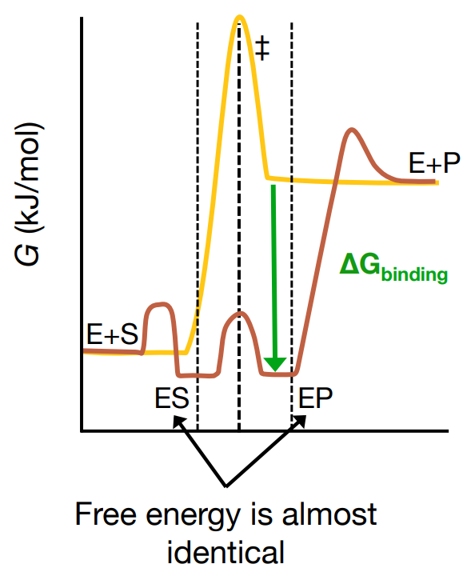 {left=52.42 top=1.65 width=30.96 height=66.81}

Typical enzyme

ATP-synthase shifts the problem to dissociation state

---

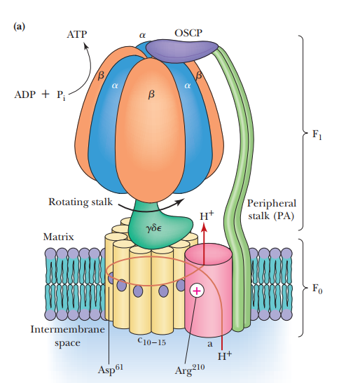 {left=16.33 top=0.00 width=26.98 height=54.22}

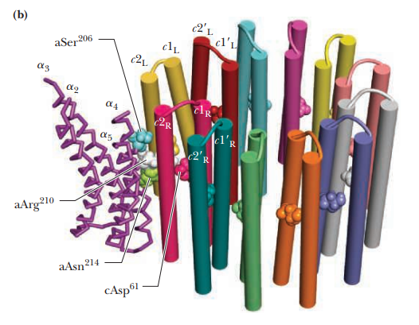 {left=43.83 top=4.40 width=29.77 height=41.15}

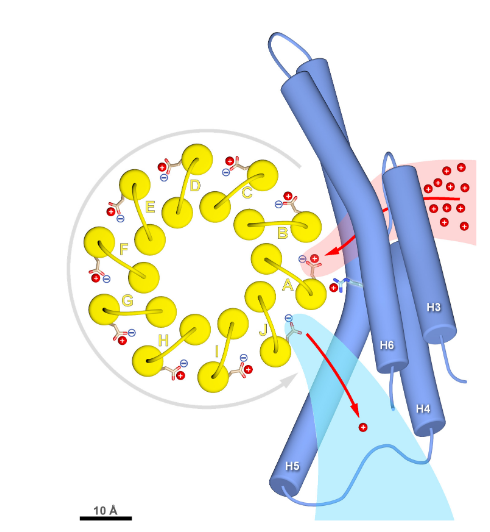 {left=74.12 top=0.00 width=25.88 height=49.96}

(a) Protons entering the inlet half-channel in the a-subunit are transferred to binding sites on c-subunits. Rotation of the c-ring delivers protons to the outlet half-channel in the a-subunit. Flow of protons through the structure turns the rotor and drives the cycle of conformational changes in b that synthesize ATP. (b) Arg210 on the a-subunit lies between the end of the inlet half-channel (Asn214) and the end of the outlet half-channel (Ser206) (PDB id 5 1C17).

---

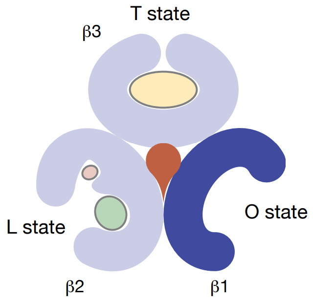 {left=15.30 top=0.00 width=29.79 height=51.30}

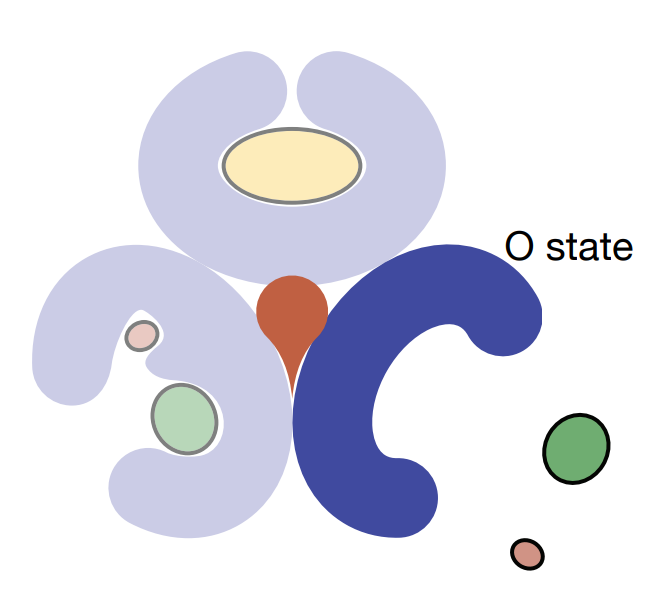 {left=46.28 top=2.90 width=25.53 height=40.75}

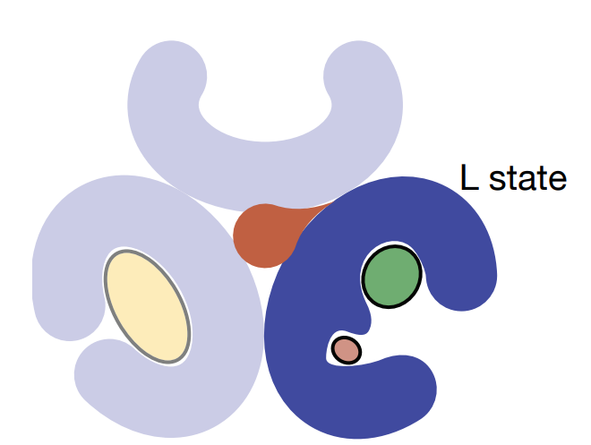 {left=73.01 top=2.90 width=27.42 height=36.71}

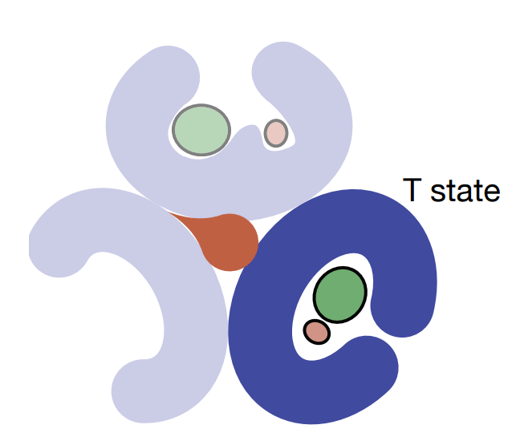 {left=15.30 top=51.30 width=27.42 height=42.08}

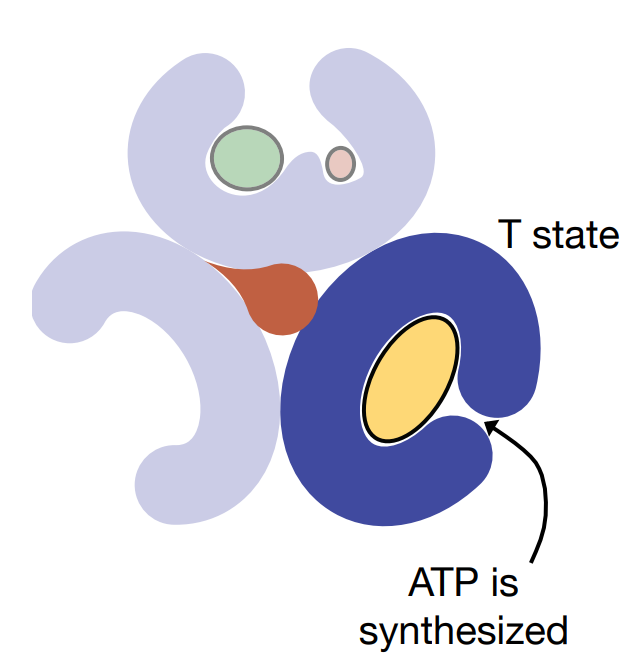 {left=42.73 top=47.26 width=25.53 height=47.55}

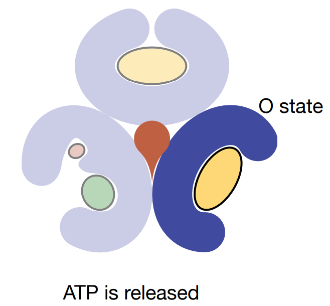 {left=68.26 top=47.26 width=25.53 height=42.08}

---

 {left=20.42 top=10.21 width=79.58 height=79.58}

---

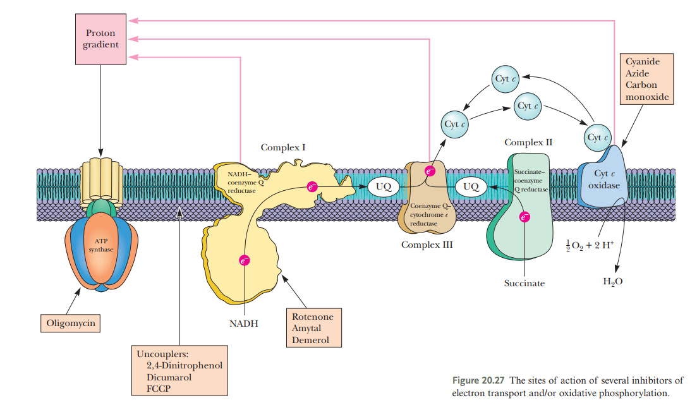 {left=21.28 top=0.00 width=78.72 height=82.73}

---

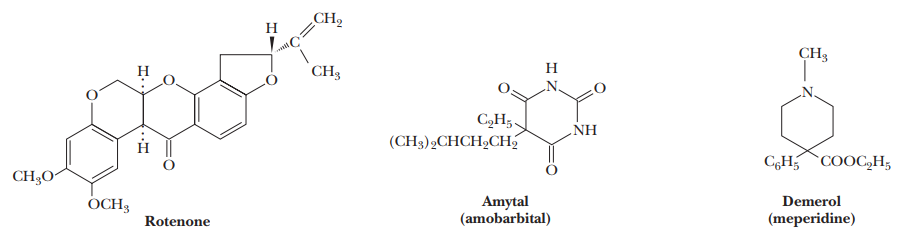 {left=16.83 top=0.00 width=72.15 height=33.89}

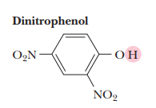 {left=15.78 top=50.00 width=20.31 height=25.19}

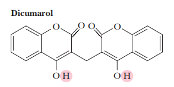 {left=36.09 top=50.00 width=30.52 height=27.22}

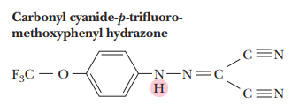 {left=66.61 top=52.17 width=32.52 height=20.85}

Uncouplers can transfer protons through mitochondrial membrane

---

In 1982, several mysterious cases of paralysis came to light in southern California. The victims, some of them teenagers, were frozen like living statues, unable to talk or move. The case was baffling at first, but it was soon traced
to a batch of synthetic heroin that contained MPTP (1-methyl-4-phenyl-1,2,3,6-tetrahydropyridine) as a contaminant. MPTP is rapidly converted in the brain to MPP1 (1-methyl-4-phenylpyridine) by the enzyme monoamine oxidase B. MPP1 is a potent inhibitor of mitochondrial Complex I (NADH–UQ reductase), and it acts preferentially in the substantia nigra, an area of the brain that is essential to movement and also the region of the brain that deteriorates slowly in Parkinson’s disease.

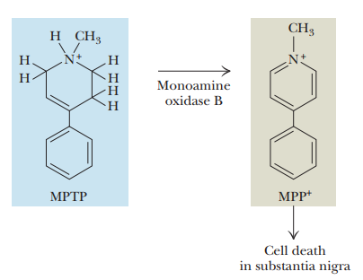 {left=63.15 top=47.38 width=36.09 height=49.54}

Rotanone used for fishing by indigenous people <u>https://www.primitiveways.com/fish_poison.html</u>

---

 {left=21.70 top=11.73 width=76.54 height=76.54}

---

**HOMEWORK**

---

**Problem 1.** 
A researcher inactivates mitochondrial superoxide dismutase (SOD2), exposing the organelle to high levels of superoxide (O₂⁻·). Superoxide is **preferentially oxidizes and destabilizes iron–sulfur (Fe–S) clusters, causing loss of the labile Fe and collapse of the prosthetic group.** Using the reaction mechanisms from our lecture slides, identify which **ONE** **Krebs cycle** enzyme will be selectively inactivated. Based on this, predict what changes the researcher should observe in the levels of Krebs cycle intermediates during biochemical analysis.

**Problem 2.**
14C-labeled D-glucose was used to study the alcoholic fermentation in Saccharomyces cerevisiae. Researchers measured the radioactivity of CO2. Can you suggest what are the **two** carbon atoms that were labeled in the D-glucose? You can either draw or give a number.

HINT: return to the slide with glycolysis and trace fate of each carbon atom by numbering them. Than go to the slide with alcoholic fermentation and do the same.

---

**Problem 3.**

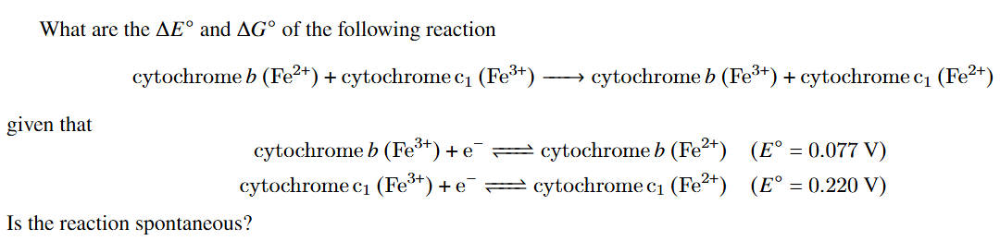 {left=16.07 top=15.73 width=81.24 height=34.90}

---

**FINALE**

---
