

Bioorganic Chemistry

Tymchyshyn V.B.

Lecture 7: Photosynthesis

---

**Who can photosynthesize?**

**Oxygenic Photosynthesizers**
Use H₂O as an electron **donor **→ release O₂
**Pigment**: chlorophyll a
**Product**: glucose (C₆H₁₂O₆)
**Reaction**: 6CO2 + 6H2O −[light]-> C6H12O6 + 6O2

**Organisms**:
Plants — chloroplasts derived from cyanobacteria
Green algae (Chlorophyta)
Red algae (Rhodophyta)
Cyanobacteria — only prokaryotes that perform oxygenic photosynthesis
*Chloroplasts are descendants of an ancestral cyanobacterium engulfed ~1.5 billion years ago.*

**Anoxygenic Photosynthesizers**
Use other **donors **(e.g. H2S, Fe2+, organic acids) → no O₂ produced
**Pigments**: bacteriochlorophylls (absorb infrared light)

**Organisms**:
Purple sulfur bacteria (Chromatium) — donor: H2S
Purple non-sulfur bacteria (Rhodospirillum) — donor: organic compounds
Green sulfur bacteria (Chlorobium) — donor: H2S
Green non-sulfur bacteria (Chloroflexus) — donor: organic acids
Heliobacteria — Gram-positive phototrophs, rare in soils
*Anoxygenic photosynthesis predates oxygenic forms — it evolved first, before Earth’s atmosphere contained O₂.*

---

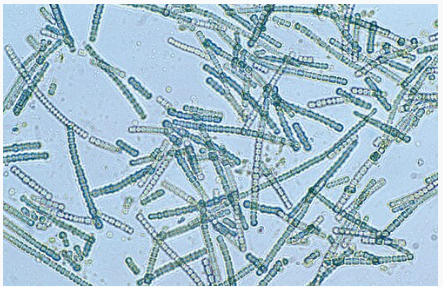 {left=18.75 top=0.00 width=46.15 height=53.15}

Microscope image of *Cylindrospermum*, a filamentous genus of cyanobacteria

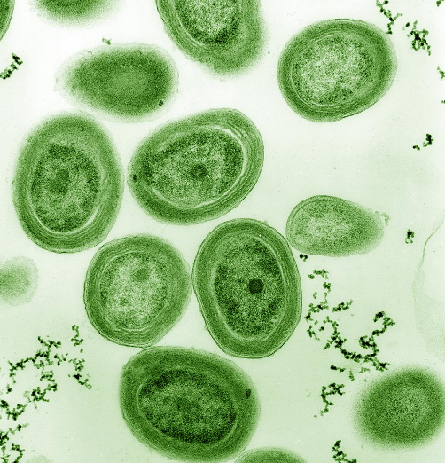 {left=66.56 top=2.96 width=31.77 height=58.74}

*Prochlorococcus*, an influential marine cyanobacterium which produces much of the world's oxygen (10%-20%)

Phytoplankton produces ~50% of the world’s oxygen

---

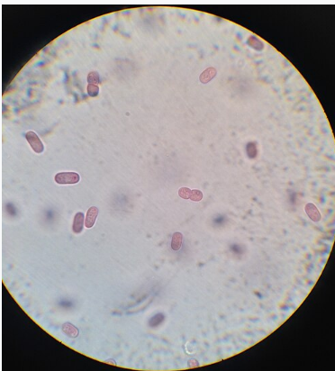 {left=16.52 top=0.00 width=23.89 height=47.04}

*Chromatium*. purple sulfur bacteria and oxidize sulfide to produce sulfur which is deposited in intracellular granules of the cytoplasm.

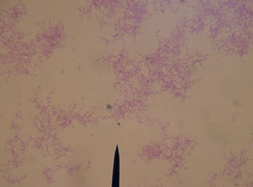 {left=42.20 top=0.00 width=33.04 height=43.45}

*Rhodospirillum rubrum*. The photosynthesis of R. rubrum differs from that of plants as it possesses not chlorophyll a, but bacteriochlorophylls.

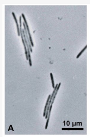 {left=77.85 top=0.00 width=22.15 height=60.26}

*Heliophilum fasciatum*. (A) Phase-contrast micrograph of cells formed into motile bundles.

---

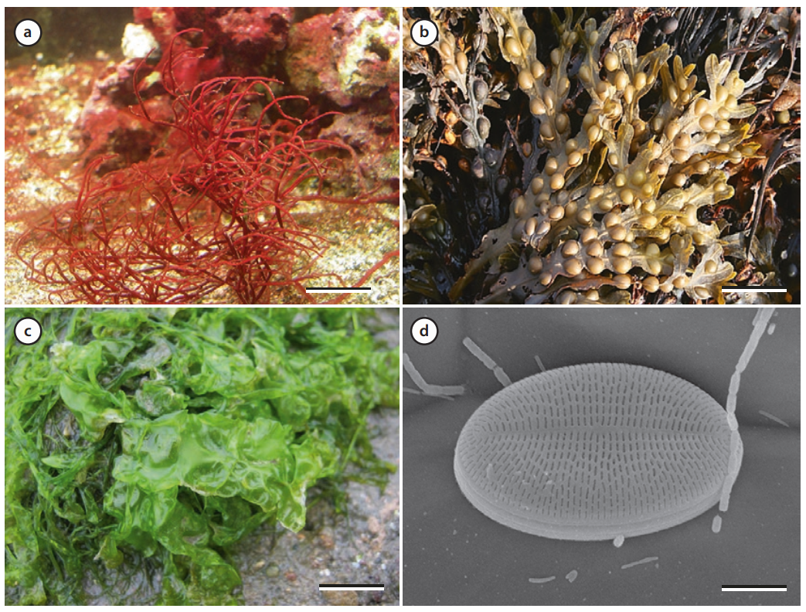 {left=45.30 top=2.96 width=54.70 height=80.76}

**a **red algae 
(*Gracilaria sp.*), 

**b **brown algae 
(*Fucus vesiculosus*), 

**c **green algae 
(*Ulva lactuca*) 

**d **an unidentified freshwater diatom. 

Scale bars = 2 cm in a and b, 1 cm in c and 2
µm in d.

---

---

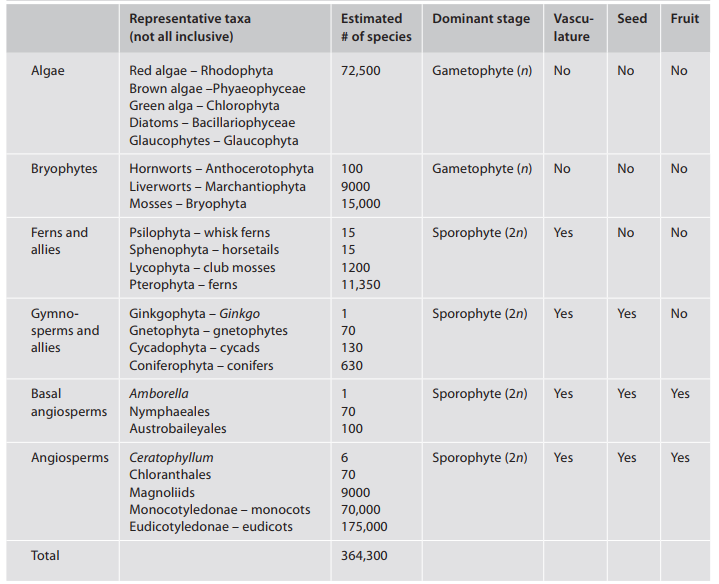 {left=34.85 top=2.96 width=65.15 height=94.07}

The total number of named
plant species is approximately 364,000, although by some estimates there may be as many as two million diatom
species alone, most undiscovered and unnamed

---

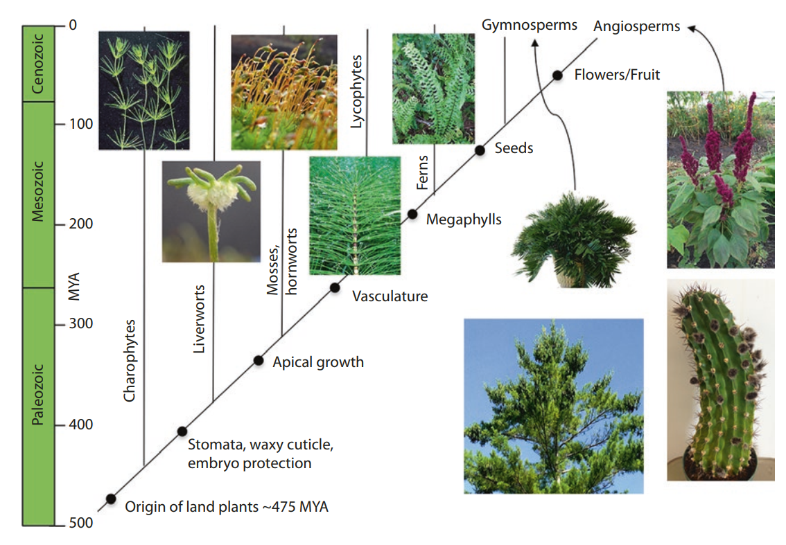 {left=23.75 top=0.00 width=76.25 height=94.07}

---

Vascular Plants

---

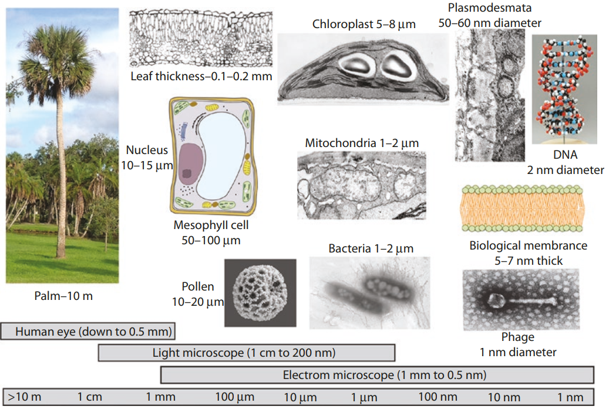 {left=22.16 top=2.96 width=77.84 height=94.07}

---

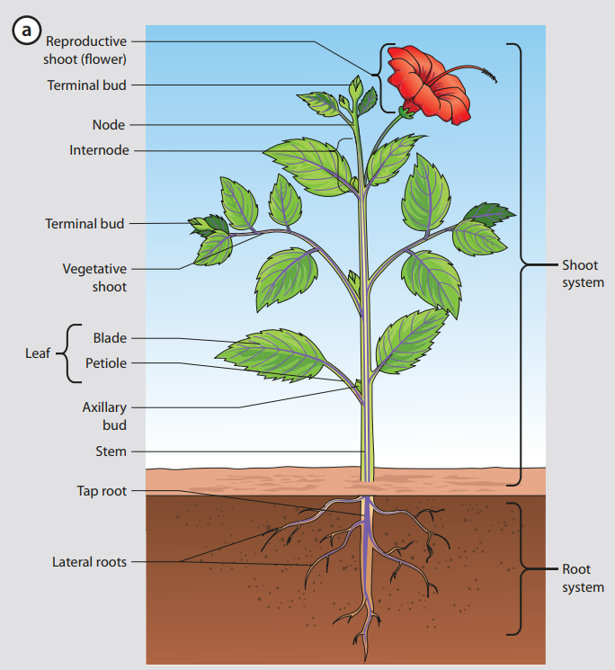 {left=51.42 top=0.00 width=48.58 height=94.07}

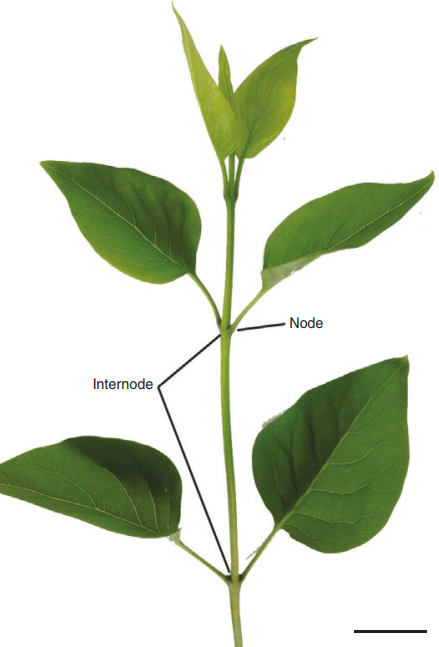 {left=17.57 top=0.00 width=33.84 height=88.67}

Stem from a lilac bush (Syringa sp.). Scale bar = 5 mm

---

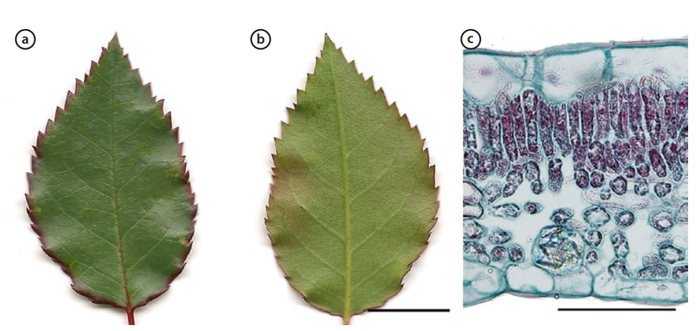 {left=47.60 top=0.00 width=52.40 height=44.11}

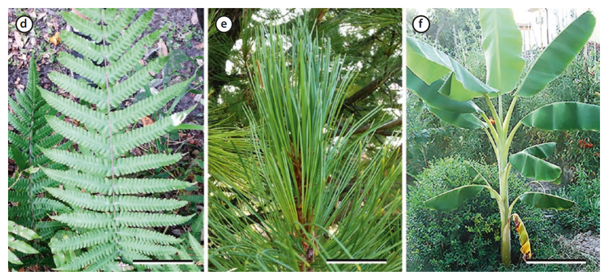 {left=45.89 top=55.89 width=54.11 height=44.11}

A typical foliage leaf, i.e., macrophyll, from a rose plant (*Rosa sp.*) showing 
**a** the adaxial surface, 
**b** the abaxial surface with ridges formed by the major veins, and 
**c** a cross-section with the adaxis toward the top. A portion of the leaf petiole is visible at the bottoms of a and b. 

Scale bar = 1 cm in a and b, 50 μm in c

Leaves of 
**d** southern wood fern (*Dryopteris ludoviciana*), 
**e** Swiss pine (*Pinus cembra*), and
**f **banana (*Musa sp.*)*. The entire “trunk” of the banana “tree” is composed of tightly wrapped leaf sheaths. 

Scale bars = 10 cm in d, 5 cm in e, and 1 m in f

---

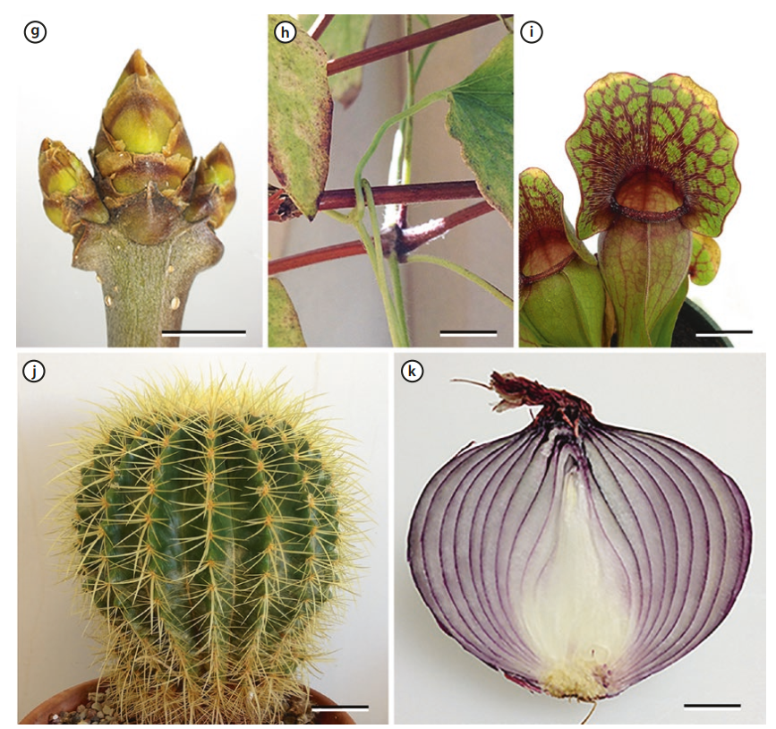 {left=43.64 top=-1.33 width=56.36 height=94.07}

**Modified leaves. **
**g** Cataphylls (bud scales) surrounding three terminal buds on a lilac (*Syringa sp.*) stem, 
**h** clematis (*Clematis sp.*) tendrils,
**i **an insect-trapping pitcher on *Sarracenia sp*., 
**j** golden barrel cactus (*Echinocactus grusonii*) stem covered with spines, 
**k** an onion (*Allium sp.*) bulb (stem and leaves) cut in radial section to show individual bulb scales. 

Scale bars = 1 cm in g, 0.5 cm in h, 1 cm in i, 3 cm in j, and 2 cm in k

---

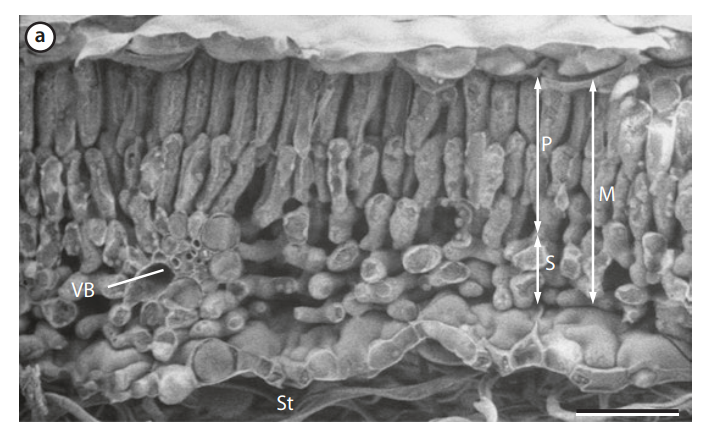 {left=24.82 top=0.00 width=66.50 height=73.16}

Colorado cinquefoil (*Potentilla subjuga*). M mesophyll, P palisade mesophyll, S spongy mesophyll, St stoma, VB vascular bundle. Scale bar = 50 μm (RR Wise)

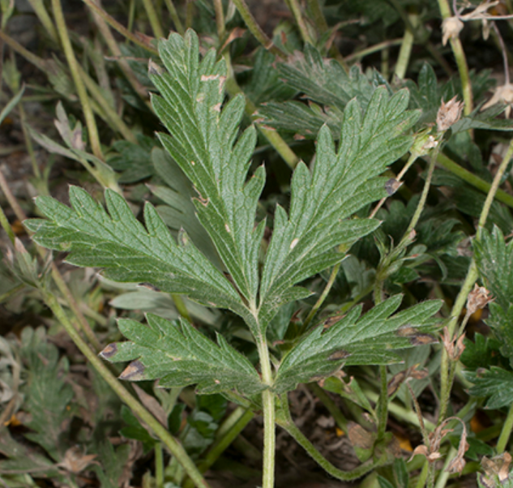 {left=4.45 top=2.50 width=21.49 height=36.33}

mainly mesophyll cells photosynthesize

---

 {left=17.36 top=8.60 width=79.81 height=79.81}

---

Chloroplast

---

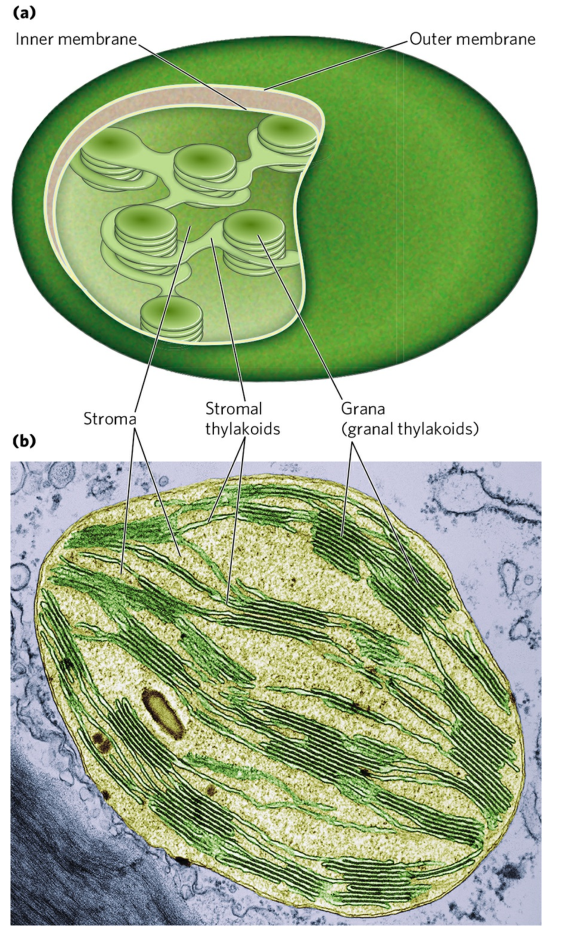 {left=67.68 top=2.96 width=32.32 height=94.07}

Chloroplast structure. **(a)** Schematic diagram. **(b)** Electron micrograph at high magnification, showing the highly organized thylakoid
membrane structure.

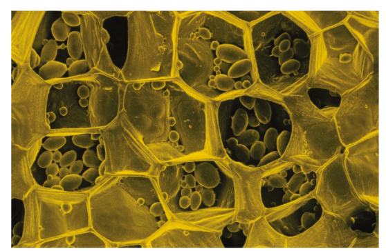 {left=24.38 top=24.64 width=34.79 height=40.35}

Starch-filled amyloplasts. This colorized scanning electron micrograph of a slice of raw potato shows cells filled with amyloplasts, the organelles in which starch granules are stored. Starch granules in various tissues range from 1 to 100 μm in diameter.

---

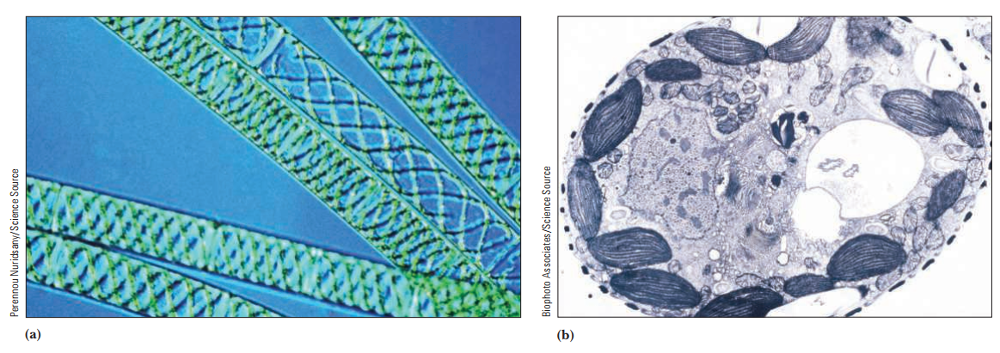 {left=17.18 top=0.00 width=82.82 height=52.04}

Chloroplast structures. 
**(a)** The spiral chloroplasts (green) of *Spirogyra*, a fresh-water alga.
**(b)** The chloroplasts of a higher plant cell are seen here as the dark,  oval-shaped membrane-rich organelles distributed around the cell periphery. Note the multiple chloroplasts around the cell’s periphery.

---

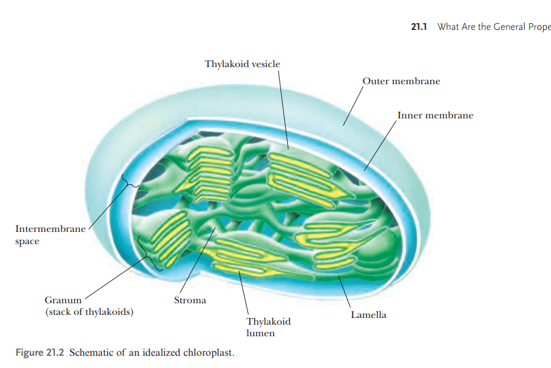 {left=22.83 top=7.48 width=69.13 height=75.25}

---

 {left=17.62 top=5.99 width=80.20 height=80.20}

Living chloroplasts under the microscope

---

Chloroplasts contain their own DNA and the machinery for replicating and expressing it. However, chloroplasts are not autonomous: they also contain many proteins encoded by nuclear DNA. 

We now believe that, in a manner analogous to the evolution of mitochondria, chloroplasts are the result of endosymbiotic events in which a photosynthetic microorganism, most likely an ancestor of a cyanobacterium, was engulfed by a eukaryotic host. Evidence suggests that chloroplasts in higher plants and green algae are derived from a single endosymbiotic event, whereas those in red and brown algae are derived from at least one additional event. The chloroplast genome is smaller than that of a cyanobacterium, but the two genomes have key features in common. Both are circular and have a single start site for DNA replication, and the genes of both are arranged in operons—sequences of functionally related genes under common control. In the course of evolution, many of the genes of the chloroplast ancestor were transferred to the plant cell’s nucleus or, in some cases, lost entirely, thus establishing a fully dependent relation.

---

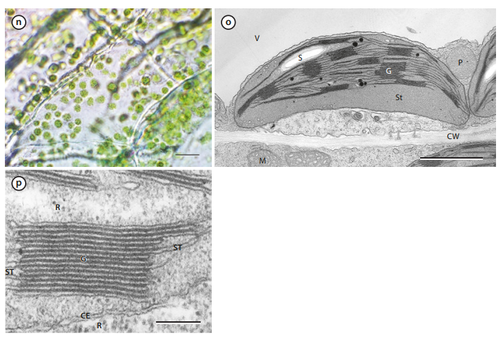 {left=18.00 top=0.00 width=75.21 height=90.00}

**n** chloroplasts from the outer layer of a green bell pepper (*Capsicum annuum*) fruit. The dark specks inside the chloroplasts are grana. Scale bar = 10 μm. **o** TEM of spinach (Spinacia oleracea) chloroplast situated between the vacuole (V) and cell wall (CW). Internally, chloroplasts have stacks of granal thylakoid (G) and starch grains (S) suspended in the stroma (St). Scale bar = 3 μm. **p** This single granum (G) from a spinach (*Spinacia oleracea*) chloroplast is composed of 15 thylakoid membranes stacked (appressed) on top of each other. Stromal thylakoids (ST) are unstacked (unappressed) and extend from the edges of the granum. Note the two membranes of the chloroplast envelope (CE) and ribosomes (R). Cytoplasm, also with many ribosomes (R), is to the bottom of the image. Scale bar = 0.5 μm

---

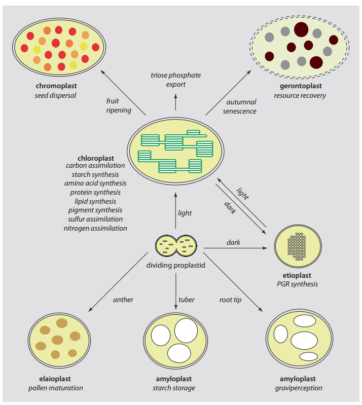 {left=52.71 top=2.96 width=47.29 height=94.07}

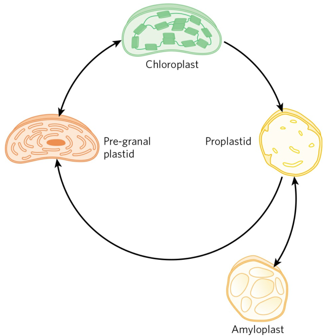 {left=19.51 top=2.96 width=25.58 height=47.04}

All types of plastids are bounded by a double membrane, and some have extensive internal membranes. Internal membranes can be lost and resynthesized. Proplastids in nonphotosynthetic tissues (such as root) give rise to amyloplasts, which contain large quantities of starch. All plant cells have plastids, and these organelles are the sites not only of photosynthesis but of other processes, such as the synthesis of essential amino acids, thiamine, pyridoxal phosphate,
flavins, and vitamins A, C, E, and K.

---

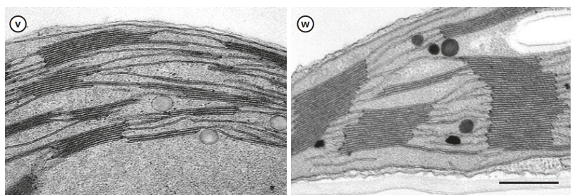 {left=14.90 top=0.00 width=85.10 height=51.30}

TEM of **v** high-light and **w** low-light chloroplasts from spinach (Spinacia oleracea) leaves. **v** The high-light leaves were treated with 1000 μmol photons m−2 s−1 irradiance for 4 h prior to sampling. **w** The low-light chloroplast is from a leaf on the same plant that received 4 h of high light and then 10 min of 50 μmol photons m−2 s−1. Scale bar in w = 0.5 μm and applies to both panels.

---

 {left=17.52 top=12.16 width=79.31 height=79.31}

---

C3 photosynthesis

---

 {left=16.52 top=0.00 width=75.21 height=90.00}

The typical C3 chloroplast is a round, plano-convex organelle approximately 5 to 10 μm in length **(n)**. They have a double membrane envelope and a third, internal system of membranes, thylakoids, that is suspended in a protein-rich fluid, the stroma **(o)**. In a functional chloroplast, thylakoids form a closed, flattened volume, with the stroma to the outside and the lumen to the inside. Two categories of thylakoids are recognized: (1) Granal thylakoids are pressed together in stacks called grana in which an individual granum may contain 2–30 or more thylakoids. (2) Intergranal thylakoids (a.k.a. stromal thylakoids) are unappressed and span the stroma to interconnect grana

---

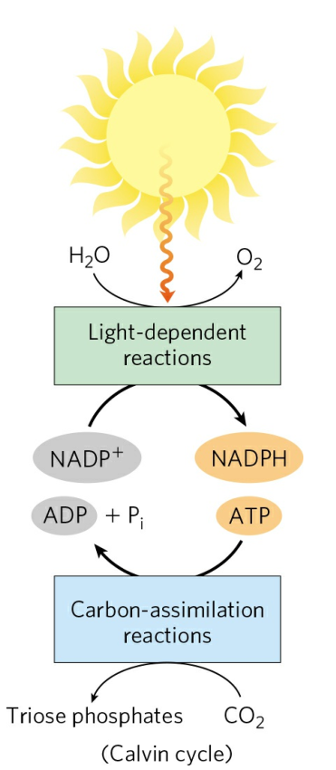 {left=76.11 top=2.96 width=23.10 height=94.07}

**Photosynthesis occurs in two distinct phases:**

1. The **light reactions**, which use light energy to generate NADPH and ATP.

2. The **dark reactions**, actually **light-independent** reactions, which use NADPH and ATP to drive the synthesis of carbohydrate from CO2 and H2O

The light reactions occur in the thylakoid membrane and involve processes that resemble mitochondrial electron transport and oxidative phosphorylation. In photosynthetic prokaryotes, which lack chloroplasts, the light reactions take place in the cell’s plasma (inner) membrane or in highly invaginated structures derived from it called **chromatophores**.

---

The process of **photophosphorylation **resembles **oxidative phosphorylation** in that electron flow through a series of membrane carriers is coupled to proton pumping, producing the proton motive force that powers ATP formation. In oxidative phosphorylation, the electron donor is NADH and the ultimate electron acceptor is O2, forming H2O.

In **photophosphorylation**, electrons flow in the opposite direction: H2O is the
electron donor and NADPH is formed. 

Water is a poor donor of electrons; its standard reduction potential is 0.816 V, compared with −0.320 V for NADH, a good electron donor. Photosynthesis requires the input of energy in the form of light to create a good electron donor and a good electron acceptor. Electrons flow from the electron donor through a series of membrane-bound carriers, including cytochromes, quinones, and iron-sulfur proteins, while protons are pumped across a membrane to create an electrochemical potential. Electron transfer and proton pumping are catalyzed by a membrane complex **homologous **in structure and function to **Complex III** of mitochondria. The electrochemical potential so produced is the driving force for ATP synthesis from ADP and Pi, catalyzed by a membrane-bound ATP synthase complex closely similar to that of mitochondria and bacteria.

---

Capturing Light

---

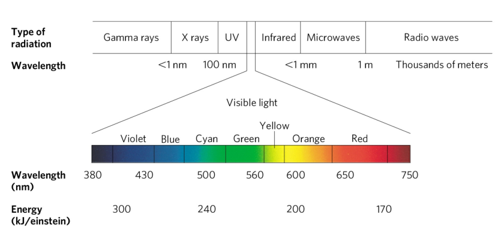 {left=18.44 top=0.00 width=81.56 height=66.33}

Electromagnetic radiation. The spectrum of electromagnetic radiation, and the energy of photons in the visible range. One einstein is 6.022×1023 photons. The energy of a photon of visible light ranges from 150 kJ/einstein for red light to ~300 kJ/einstein for violet light.

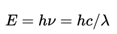 {left=80.26 top=66.33 width=18.56 height=9.63}

---

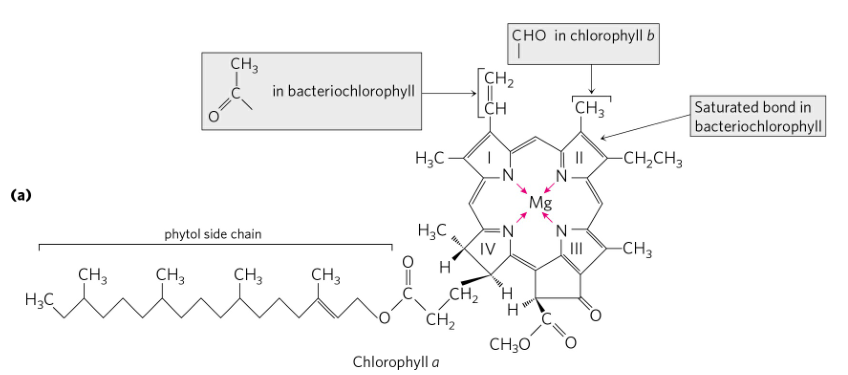 {left=16.78 top=0.00 width=49.83 height=39.17}

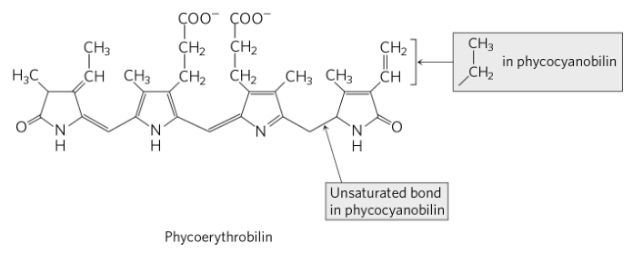 {left=59.50 top=36.56 width=39.95 height=28.47}

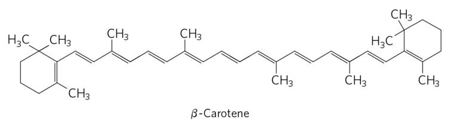 {left=67.71 top=0.00 width=32.29 height=15.46}

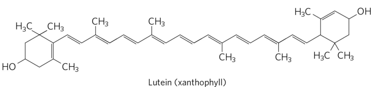 {left=58.94 top=19.12 width=41.06 height=16.93}

Primary and secondary photopigments. **(a)** Chlorophylls a and b and bacteriochlorophyll are the primary gatherers of light energy. **(b)**
Phycoerythrobilin and phycocyanobilin (phycobilins) are the antenna pigments
in cyanobacteria and red algae. **(c)** β-Carotene (a carotenoid) and **(d)** lutein (a xanthophyll) are accessory pigments in plants. The conjugated bond systems (alternating single and double bonds) in these molecules largely account for the absorption of visible light.

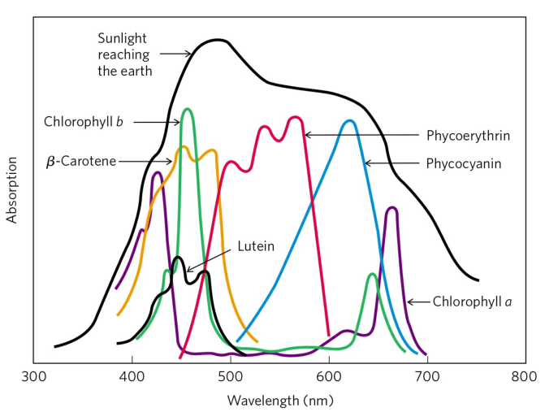 {left=73.79 top=65.54 width=25.65 height=34.46}

---

---

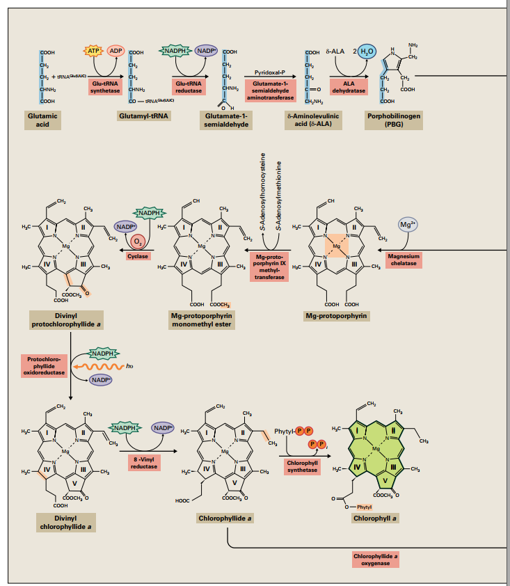 {left=15.80 top=1.48 width=41.57 height=95.67}

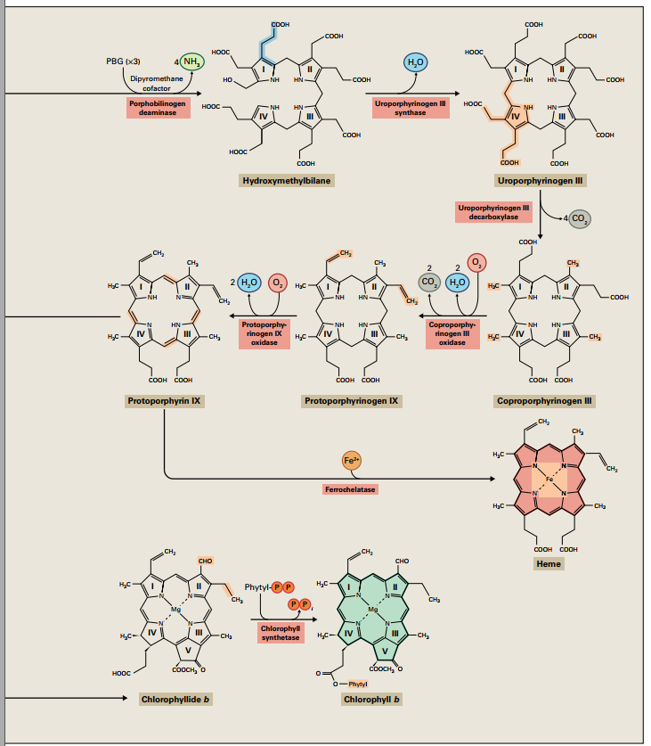 {left=57.37 top=1.64 width=42.63 height=95.37}

Biosynthesis of chlorophylls and heme.

---

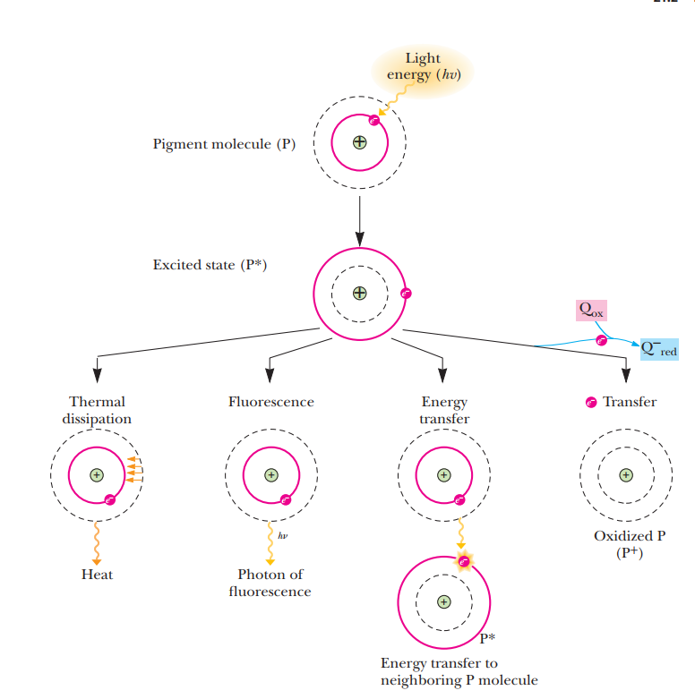 {left=62.25 top=11.25 width=35.71 height=63.89}

Carotenoids, which are C40, largely linear polyenes such as lycopene and beta-carotene, are components of all green plants and many photosynthetic bacteria and are therefore the most common accessory pigments.They are largely responsible for the brilliant fall colors of deciduous trees as well as for the orange color of carrots. 

Each subunit of the  light-harvesting protein LHC-II this highly conserved, 232-residue, trimeric protein binds eight Chl a’s, six Chl b’s, and four carotenoids. The orientations of the 42 chlorophylls in each LHC-II trimer evenly sample nearly all directions in space, thus maximizing the efficiency of light harvesting. Carotenoids serve an additional function besides that of light-gathering antennas: Through electronic interactions, they prevent their associated light-excited chlorophyll molecules from transferring this excitation to O2, which would otherwise yield highly destructive reactive oxygen species. This is particularly important under full sunlight, when the rate that light energy is absorbed exceeds the rate that it can be used in photosynthesis.Then, the excess energy is dissipated as heat.

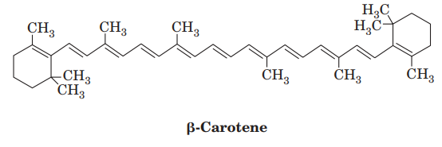 {left=73.45 top=-0.00 width=26.55 height=15.76}

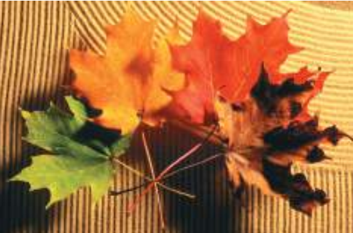 {left=64.67 top=67.55 width=14.89 height=17.49}

Some plants additionally synthesize anthocyanins in the autumn

---

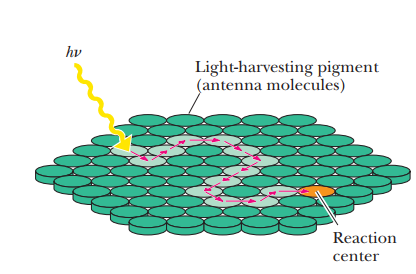 {left=18.19 top=0.00 width=34.60 height=35.67}

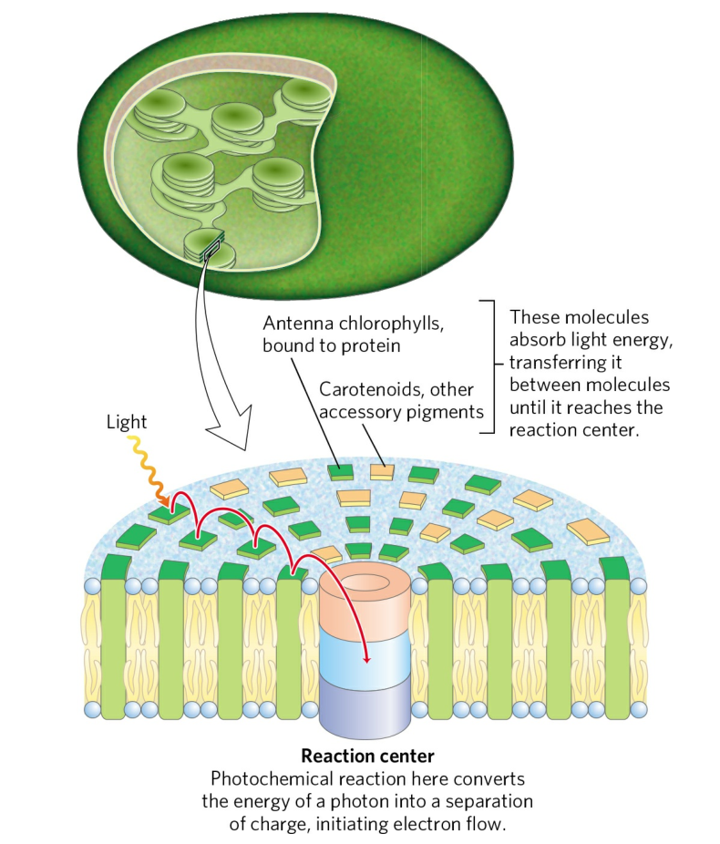 {left=56.30 top=4.47 width=43.70 height=91.06}

**Organization of photosystems in the thylakoid membrane. **Photosystems are tightly packed in the thylakoid membrane, with several hundred antenna chlorophylls and accessory pigments surrounding a reaction center. Absorption of a photon by any of the antenna chlorophylls leads to excitation of the reaction center by exciton transfer (red arrow). Also embedded in the thylakoid membrane are the cytochrome b6f complex and ATP synthase

---

 {left=16.58 top=0.00 width=56.87 height=56.87}

 {left=73.46 top=-0.00 width=26.30 height=83.13}

**Exciton transfer** (also known as resonance energy
transfer), in which an excited molecule directly transfers its excitation energy to nearby unexcited molecules with similar electronic properties. This process occurs through interactions between the molecular orbitals of the participating molecules in a manner analogous to the interactions between mechanically coupled pendulums of similar frequencies.

---

Experiments have shown, most chlorophylls function to gather light; that is, they
act as light-harvesting antennas. These antenna chlorophylls pass the energy of an absorbed photon, by exciton transfer, from molecule to molecule until the excitation reaches an RC.There, the excitation is trapped because RC chlorophylls, although chemically identical to antenna chlorophylls, have slightly lower excited state energies because of their different environments

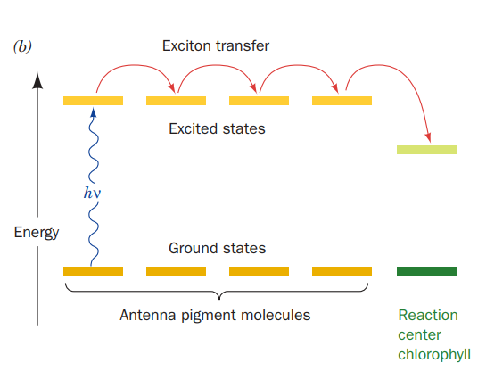 {left=57.37 top=2.30 width=40.35 height=55.68}

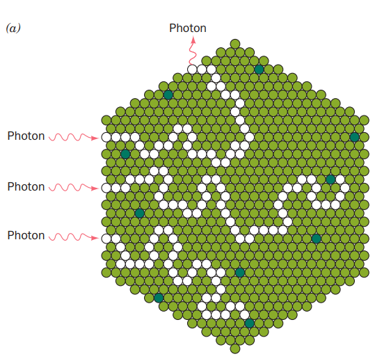 {left=21.34 top=2.30 width=33.13 height=55.68}

---

Performing Photosynthesis

---

Photosynthesis is more complicated in green plants than in photosynthetic bacteria. In green plants, photosynthesis depends on the interplay of two kinds of membrane-bound, light-sensitive complexes— photosystem I (PS I) and photosystem II (PS II)

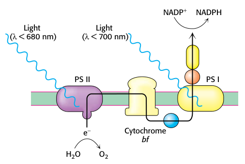 {left=30.44 top=0.00 width=57.44 height=68.21}

---

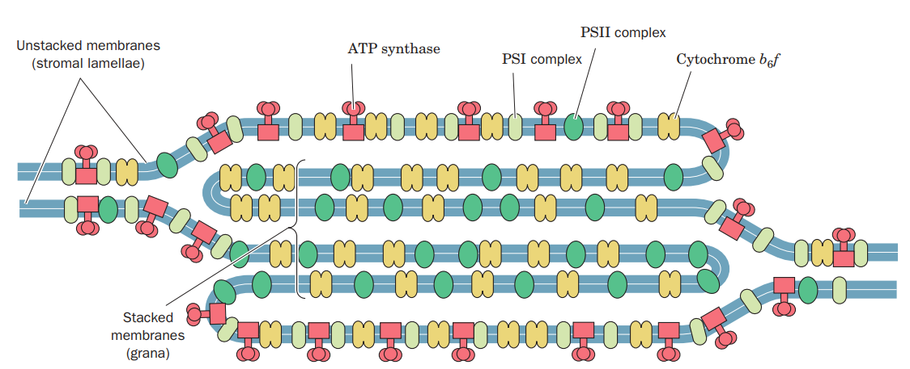 {left=44.62 top=48.62 width=56.13 height=40.57}

**1. **PSI occurs mainly in the unstacked stroma lamellae, in contact with the stroma, where it has access to NADP.
**2.** PSII is located almost exclusively between the closely stacked grana, out of direct contact with the stroma.
**3. **Cytochrome b6f is uniformly distributed throughout the membrane.

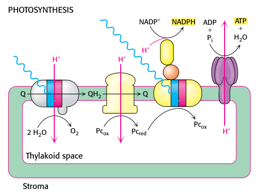 {left=16.21 top=53.22 width=29.33 height=38.73}

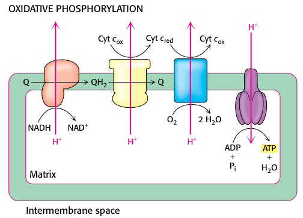 {left=16.70 top=8.05 width=28.35 height=36.19}

---

**Photosystem II (PSII)** is a pheophytin-quinone type of system (like the single photosystem of purple bacteria) containing roughly equal amounts of chlorophylls a and b. Excitation of the P680 special pair in its reaction center drives electrons through the cytochrome b6f complex with concomitant movement of protons across the thylakoid membrane. 
**Photosystem I (PSI)** is structurally and functionally related to the type I reaction center of green sulfur bacteria. It has a P700 reaction center and a high ratio of chlorophyll a to chlorophyll b. The excited P700 passes electrons through a chain of carriers to the Fe-S protein ferredoxin, then to NADP+, producing NADPH. The thylakoid membranes of a single spinach chloroplast have many hundreds of each kind of photosystem.

These two reaction centers in plants act in tandem to catalyze the light-driven movement of electrons from H2O to NADP+. Electrons are carried between the two photosystems by the soluble protein plastocyanin. To replace the electrons that move from PSII through PSI to NADP+, cyanobacteria and plants oxidize H2O (as green sulfur bacteria oxidize H2S), producing O2

---

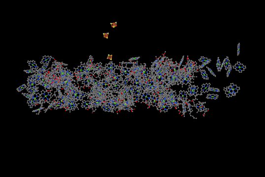 {left=55.93 top=15.58 width=43.43 height=51.67}

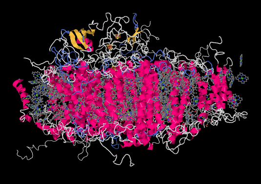 {left=13.51 top=15.58 width=41.13 height=51.67}

Results from an X-ray crystal structure of photosystem I in spinach.

Ligands-only view from an X-ray crystal structure of photosystem I in spinach.

<u>The Structure of a plant photosystem I supercomplex</u>

---

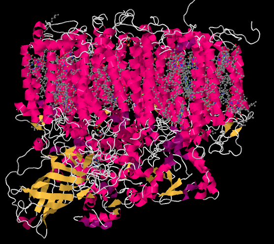 {left=13.00 top=6.74 width=38.10 height=60.19}

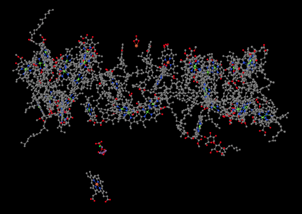 {left=51.72 top=6.25 width=47.99 height=60.69}

Results from an X-ray crystal structure of photosystem II in the marine cyanobacterium *Thermosynechococcus elongatus.*

Results from an X-ray crystal structure of photosystem II showing ligands only

<u>Crystal structure of oxygen-evolving photosystem II from a red alga</u>

---

 {left=26.62 top=0.00 width=62.76 height=63.59}

Schematic representation of the thylakoid membrane showing the components of its electron-transport chain. The system consists of three protein complexes: PSII, the cytochrome b6f complex, and PSI, which are electrically “connected” by the diffusion of the electron carriers plastoquinol (Q) and plastocyanin (PC). Light-driven transport of electrons (black arrows) from H2O to NADP forming NADPH motivates the transport of protons (red arrows) into the thylakoid space (Fd is ferredoxin). Additional protons are split off from water by the oxygen-evolving complex (OEC), yielding O2. The resulting proton gradient powers the synthesis of ATP by the CF1CF0 proton-translocating ATP synthase [CF1 and CF0 are chloroplast (C) analogs of mitochondrial F1 and F0]. The membrane also contains light-harvesting complexes whose component chlorophylls and other chromophores transfer their excitations to PSI and PSII.

---

 {left=43.78 top=0.00 width=56.22 height=61.83}

Detailed diagram of the Z-scheme of photosynthesis. Electrons ejected from P680 by the absorption of photons are replaced with electrons abstracted from H2O by an Mn complex (OEC), thereby forming O2 and four H. Each ejected electron is passed through a chain of electron carriers to a pool of plastoquinone molecules (Q). The resulting plastoquinol, in turn, reduces the cytochrome b6f particle (yellow box) that transfers electrons with the concomitant translocation of protons, via a Q cycle, into the thylakoid lumen. Cytochrome b6 f then transfers the electrons to plastocyanin (PC). The plastocyanin regenerates photooxidized P700. The electron ejected from P700, through the intermediacy of a chain of electron carriers (A0, A1, FX, FA, FB, and Fd), reduces NADP+ to NADPH in noncyclic electron transport. Alternatively, the electron may be returned to the cytochrome b6 f complex in a cyclic process that only translocates protons into the thylakoid lumen.

Good e donor

Poor e donor

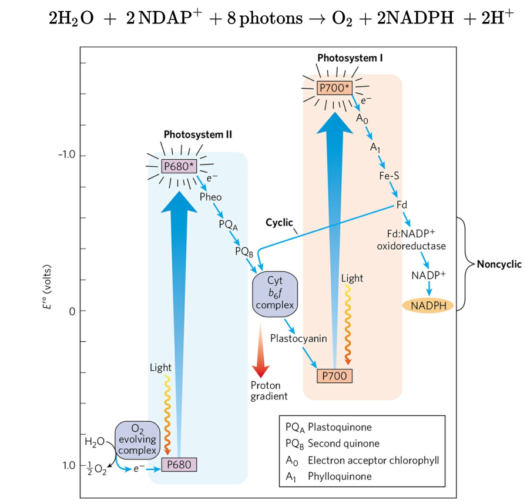 {left=15.93 top=0.00 width=29.42 height=61.83}

---

 {left=16.03 top=7.26 width=81.55 height=82.62}

---

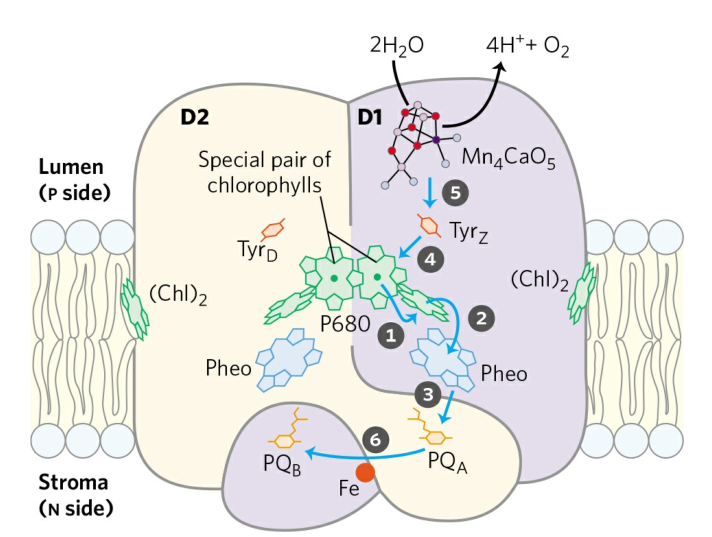 {left=73.01 top=0.00 width=26.99 height=36.19}

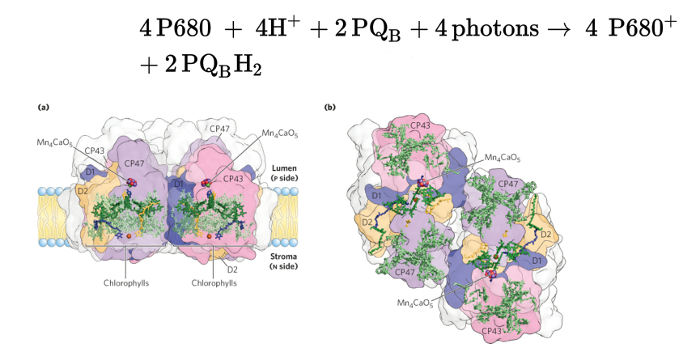 {left=17.36 top=0.00 width=55.64 height=49.75}

Photosystem II PSII is dimeric. Each monomer is a huge complex of 19 proteins and has own reaction center. Surrounding PSII are additional
chlorophyll-binding proteins and light-harvesting complexes. 
**(a)** in the plane of the membrane and 
**(b)** from the thylakoid lumen (p side).

Electron flow through photosystem II of the cyanobacterium *Synechococcus elongatus*. The monomeric form of the core complex shown here has two major transmembrane proteins, D1 and D2, each with its set of electron carriers. Although the two subunits are nearly symmetric, electron flow occurs through only one of the two branches of electron carriers, that on the right (in D1). The arrows show the path of electron flow from the Mn4CaO5 ion cluster of the water-splitting enzyme to
plastoquinone PQB.

These are the same Tyr as in OEC!

---

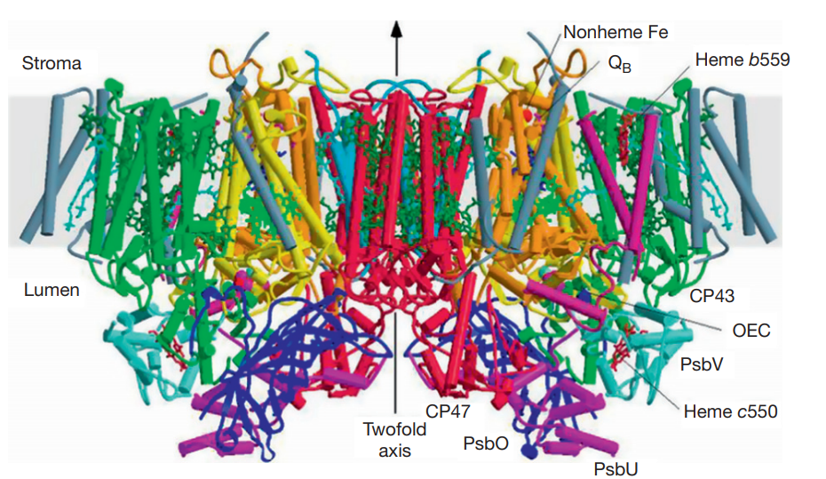 {left=17.34 top=17.36 width=46.02 height=47.42}

Side view of the PSII dimer perpendicular to the membrane normal 
derived from X-ray crystallography.

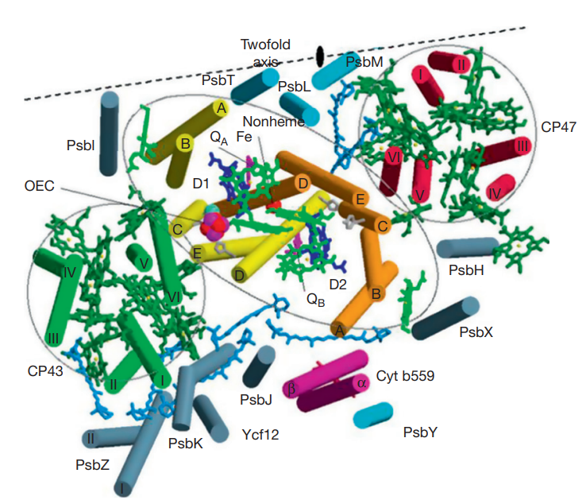 {left=64.21 top=14.61 width=33.68 height=51.03}

View of the PSII monomer along the membrane normal from the lumenal side showing the positioning and transmembrane helices of the intrinsic protein subunits.

---

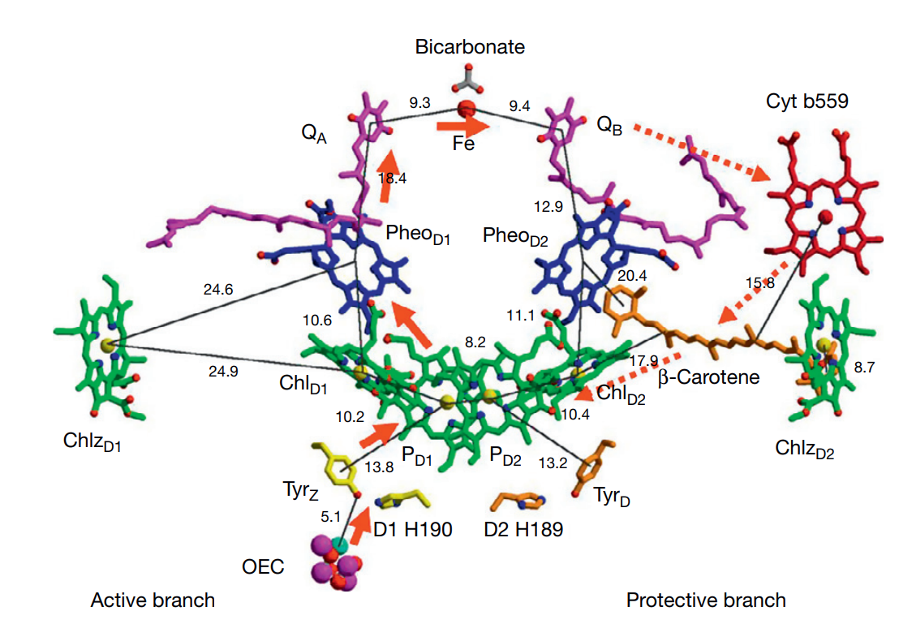 {left=26.87 top=0.87 width=58.19 height=71.80}

Cofactors involved in electron transfer visualized perpendicular to the internal pseudo-twofold axis. The side chains of YZ (D1-Tyr161) and D1-His190 are shown in yellow and YD (D2-Tyr160) and D2-His189 in orange. The four chlorophylls comprising P680 are in direct van der Waals contact, and other electron transfer distances are given in angstroms. The electron transfer pathway is indicated by arrows and distances are given in angstroms based on the 3.5-A˚ crystal structure. Excitation of the reaction center, via light absorption by chlorophylls (Chl) in the antenna, drives electron transfer from the cluster of four chlorophylls bound to the D1- and D2-proteins, to the pheophytin (Pheo) acceptor leading to the radical pair P680 Pheo. The radical cation of P680 is localized on PD1 although the primary electron charge separation probably occurs from ChlD1 followed by hole migration, while the radical anion is located on PheoD1. The electron on Pheo D1 is rapidly donated to a firmly bound plastoquinone QA (shown in purple) and then transferred to a second plastoquinone QB (also shown in purple). This electron transfer is aided by the presence of a nonheme iron located midway between them. When the QB plastoquinone is fully reduced and protonated to plastoquinol (PQH2), it diffuses from the QB-binding site into the lipid matrix of the membrane. On the electron donor side, P680 is reduced by a redox active tyrosine (TyrZ) which then extracts electrons from the Mn4Ca2 O4-cluster that constitutes the oxygen-evolving center (OEC). These electron transfer processes occur mainly on the D1 side of the reaction center and the symmetrically related cofactors located on the D2 side (ChlD2 and PheoD2) are nonfunctional. Other cofactors shown, including the heme of cytochrome b559 (cyt b559 shown in red) and the b-carotene molecule (shown in brown), play a role in protecting PSII against photoinduced damage.

---

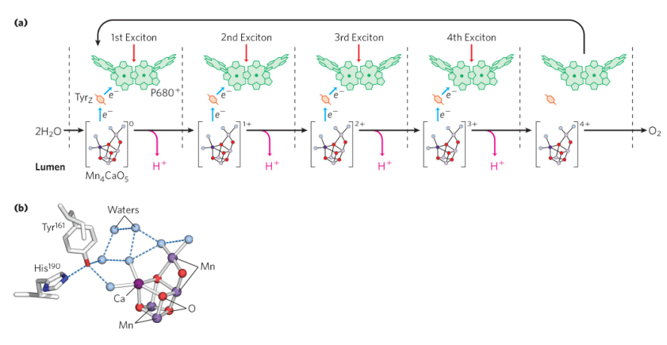 {left=19.74 top=0.00 width=80.26 height=73.80}

**Water-splitting activity of the oxygen-evolving complex.** (a) Shown here is the process that produces a four-electron oxidizing agent—a multinuclear center with four Mn ions, one Ca ion, and five oxygen atoms—in the oxygen-evolving complex of PSII. The sequential absorption of four photons (excitons), each absorption causing the loss of one electron from the Mn4CaO5 cluster, produces an oxidizing agent that can remove four electrons from two molecules of water, producing O2. The electrons lost from the Mn4CaO5 cluster pass one at a time to an oxidized Tyr residue in a PSII protein, then to P680+. (b) The metallic center of the oxygen-evolving complex, obtained by x-ray crystallography. Tyr161, known to participate in the oxidation of water, is seen hydrogen-bonded to a network of water molecules, including several directly in contact with the Mn4CaO5 cluster. This is the site of one of the most important reactions in the biosphere.

The detailed mechanism of water oxidation by the Mn4CaO5 cluster is not known but is under intense investigation.

---

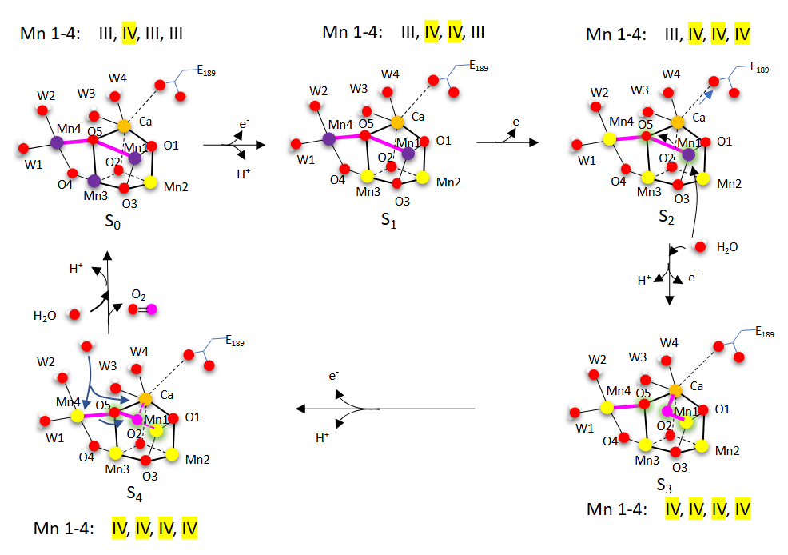 {left=19.67 top=2.96 width=75.18 height=94.07}

<u>https://www.nature.com/articles/s41467-024-50210-6</u>

**Not all H are drawn !!!**

---

 {left=16.03 top=7.26 width=81.55 height=82.62}

---

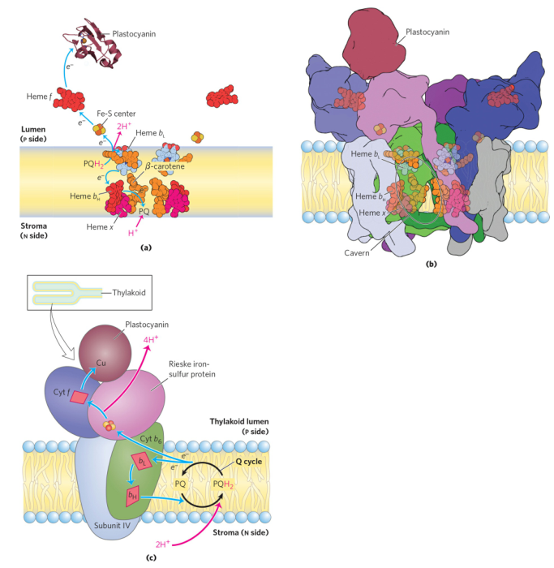 {left=15.96 top=0.00 width=51.63 height=94.07}

**Electron and proton flow through the cytochrome b****6****f complex.** **(a)** The crystal structure of the complex reveals the positions of the electron carriers. In addition to the hemes of cytochrome b (heme bH and bL; also called heme bN and bP, respectively, because of their proximity to the N and P sides of the bilayer) and cytochrome f (heme f), there is a fourth heme (heme x) near heme bH; also present is a β-carotene of unknown function. Two sites bind plastoquinone: the PQH2 site near the P side of the bilayer, and the PQ site near the N side. The Fe-S center of the Rieske protein lies just outside the bilayer on the P side, and the heme f site is on a protein domain that extends well into the thylakoid lumen. The electron path is shown for just one of the monomers, but both sets of carriers in the dimer carry electrons to plastocyanin. **(b)** The cytochrome b6f complex is a homodimer arranged to create a cavern connecting the PQH2 and PQ sites. This cavern allows plastoquinone to move between the sites of its oxidation and reduction. **(c)** Plastoquinol (PQH2), formed in PSII, is oxidized by the cytochrome b6f complex in a series of steps like those of the Q cycle in Complex III of mitochondria. One electron from PQH2 passes to the Fe-S center of the Rieske protein, the other to heme bL of cytochrome b6. The net effect is passage of electrons from PQH2 to the soluble protein plastocyanin, which carries them to PSI.

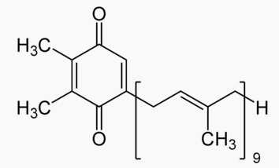 {left=82.29 top=0.00 width=17.71 height=19.03}

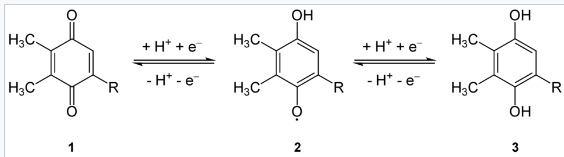 {left=68.75 top=25.89 width=31.25 height=15.46}

PQ

---

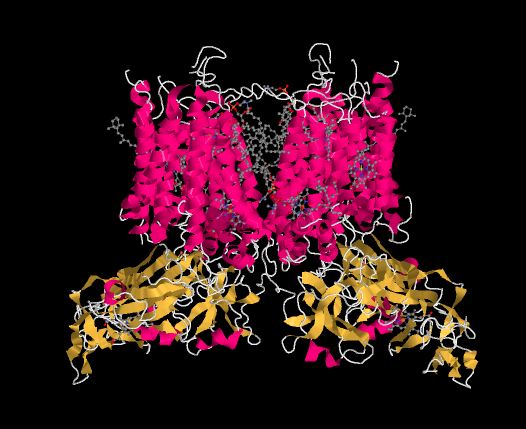 {left=9.98 top=5.04 width=42.98 height=62.32}

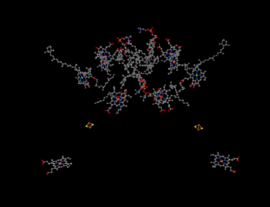 {left=53.66 top=5.04 width=45.71 height=62.32}

X-Ray crystallographic structure of cytochrome b6f from the cyanobacteria, *Mastigocladus laminosus.*

Ligand-only view of the X-Ray crystallographic structure of cytochrome b6f from the cyanobacteria, *Mastigocladus laminosus.*

<u>Cytochrome b6f from the cyanobacteria, </u><u>*Mastigocladus laminosus.*</u>

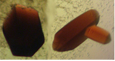 {left=82.58 top=83.79 width=15.88 height=15.01}

---

<u>Structure of Spinacia oleracea cytochrome b6f complex</u>

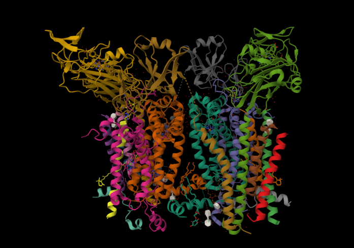 {left=13.00 top=15.53 width=42.81 height=53.28}

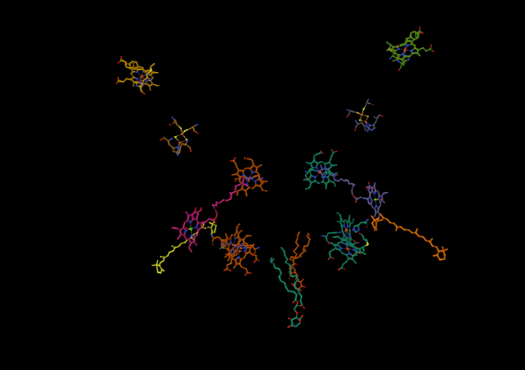 {left=58.53 top=15.53 width=42.56 height=53.28}

---

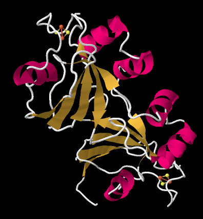 {left=17.63 top=0.80 width=37.52 height=71.76}

X-ray crystal structure of a ferredoxin, a small protein containing a FeS cluster, from *Azotobacter vinelandii.*

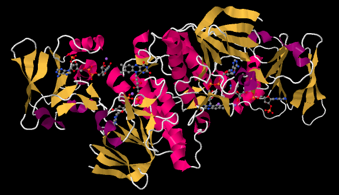 {left=58.73 top=2.09 width=37.36 height=38.25}

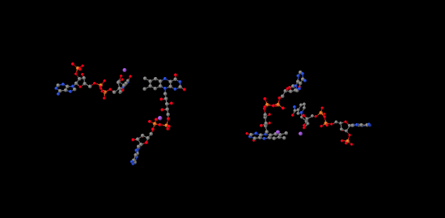 {left=58.85 top=40.97 width=37.11 height=32.27}

X-ray crystal structure (and ligand view) of a ferredoxin NADP+ reductase from *Bacillus subtilis.*

<u>Crystal structure of ferredoxin-NADP+ oxidoreductase from </u><u>*Bacillus subtilis*</u>

<u>Ferredoxin from </u><u>*Azotobacter vinelandii.*</u>

---

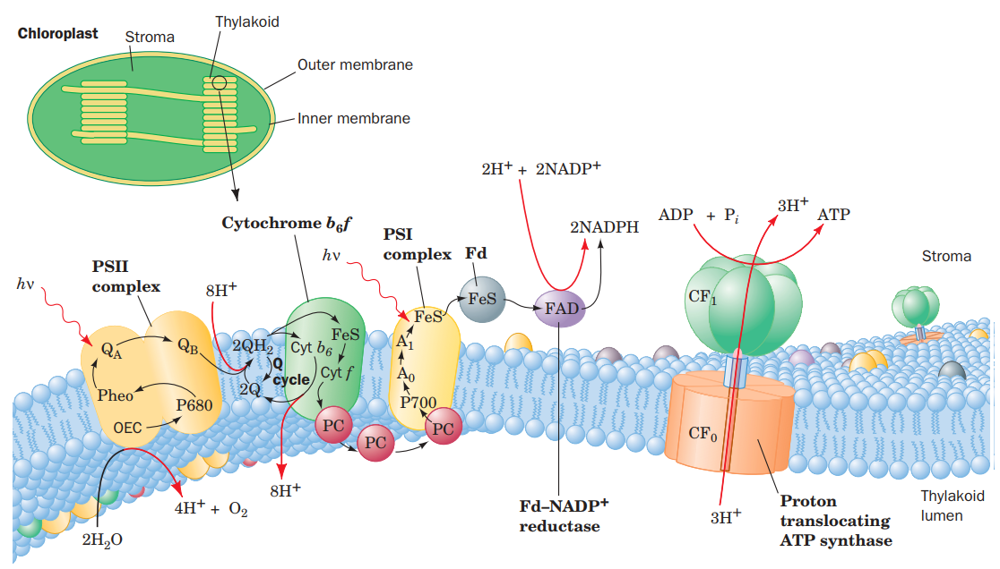 {left=16.03 top=7.26 width=81.55 height=82.62}

---

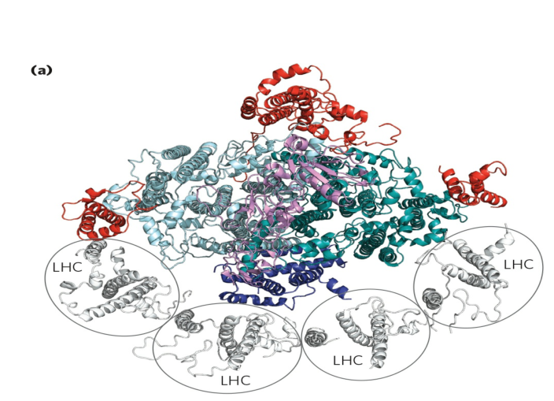 {left=18.26 top=0.00 width=31.74 height=37.29}

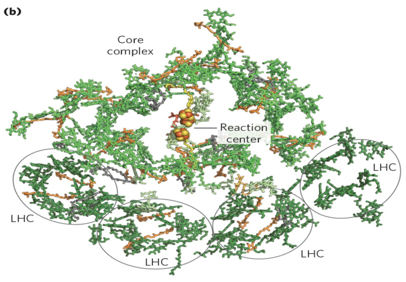 {left=51.98 top=1.04 width=28.49 height=35.22}

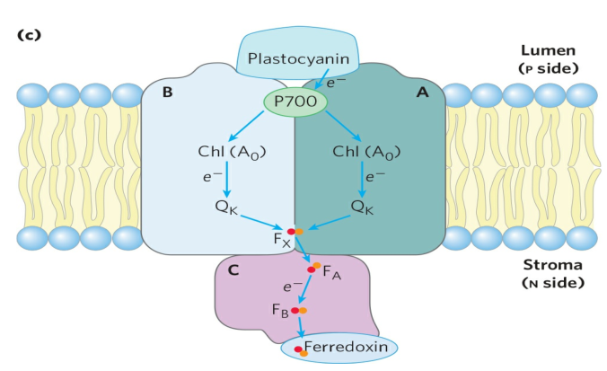 {left=19.30 top=37.29 width=34.33 height=37.29}

NADP+ → NADPH

Structure of photosystem I of a plant and electron flow
through the system. Photosystem I is a symmetric trimer. Shown here is one monomer of photosystem I of the garden pea, Pisum sativum, viewed from the stromal side in **(a)** and **(b)**. **(a)** The protein subunits of the reaction center and the light-harvesting complexes. **(b)** The chromophores. The chlorophyll molecules of the core complex are shown in light green, those of LHCI in dark
green, and the chlorophylls that span the gap between the light-harvesting complexes and the reaction center in olive green. Lipids are gray and carotenoids orange. **(c)** The path of electrons (blue arrows) through PSI, viewed in the plane of the membrane. When P700, the special pair of chlorophylls, is
excited by a photon or exciton, its reduction potential is dramatically reduced, making it a good electron donor. P700 then passes an electron through a nearby chlorophyll (referred to as A0) to phylloquinone (QK). Reduced QK is reoxidized as it passes two electrons, one at a time, to an Fe-S center (FX) near
the N side of the membrane. From FB, electrons move through two more Fe-S centers (FA and FB) to ferredoxin in the stroma. Ferredoxin then donates electrons to NADP+ (not shown), reducing it to NADPH, one of the forms in which the energy of photons is trapped in chloroplasts.

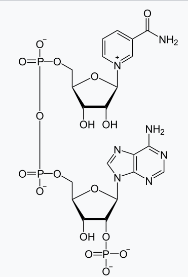 {left=0.00 top=48.54 width=18.13 height=51.46}

---

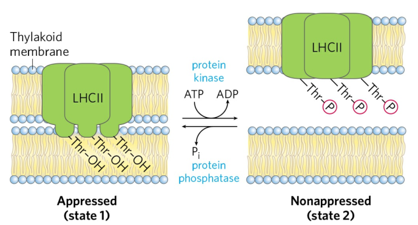 {left=46.03 top=12.66 width=52.97 height=50.71}

 {left=16.60 top=7.93 width=29.42 height=61.83}

PS1 can work without PS2 (cyclic pathway), but not vice versa.
PS2 is regulated to balance NADPH/ATP production

---

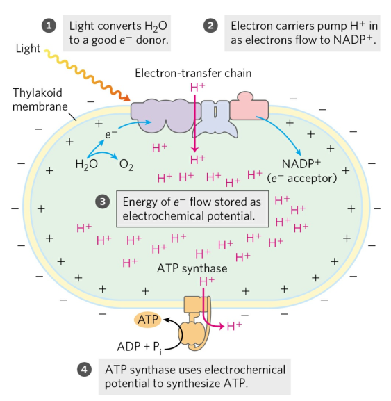 {left=48.37 top=2.96 width=51.63 height=94.07}

The chemiosmotic mechanism for ATP synthesis in chloroplasts. Movement of electrons through a chain of membrane-bound carriers is driven by the energy of photons absorbed by the green pigment chlorophyll. Electron flow leads to the movement of protons and positive charge across the membrane, creating an electrochemical potential. This electrochemical potential drives ATP synthesis by the membrane-bound ATP
synthase, which is fundamentally similar in structure and mechanism to the ATP synthase of mitochondria.

---

The transport of the liberated four electrons through the cytochrome b6f complex occurs with the translocation of what is estimated to be 8 protons from the stroma to the thylakoid lumen. 

Altogether 12 protons are translocated per molecule of O2 produced by noncyclic electron transport.

The thylakoid membrane, in contrast to the inner mitochondrial membrane, is permeable to ions such as Mg2 and Cl. Translocation of protons and electrons across the thylakoid membrane is consequently accompanied by the passage of these ions so as to maintain electrical neutrality (Mg2 out and Cl in). This all but eliminates the membrane potential. The electrochemical gradient in chloroplasts is therefore almost entirely a result of the pH gradient.

Chloroplast ATP synthase, according to most estimates, produces one ATP for every three protons it transports out of the thylakoid lumen. Noncyclic electron transport in chloroplasts therefore results in the production of 12/3=4 molecules of ATP per molecule of O2 evolved (although this quantity is subject to revision) or around half an ATP per photon absorbed. Cyclic electron transport is a more productive ATP generator since it yields two-thirds of an ATP (two protons transported) per absorbed photon.The noncyclic process, of course, also yields NADPH, each molecule of which has the free energy to produce three ATPs (although this does not normally occur), for a total of six more ATP equivalents per O2 produced. Consequently, the energetic efficiency of
the noncyclic process is 4/8+6/8=1.25 ATP equivalents per absorbed photon.

---

Carbon Assimilation

---

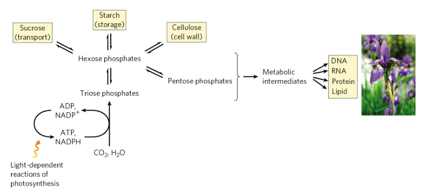 {left=17.33 top=6.60 width=82.67 height=64.25}

Assimilation of CO2 into biomass in plants. The light-driven synthesis of ATP and NADPH provides energy and reducing power for the
fixation of CO2 into trioses, from which all the carbon-containing compounds of the plant cell are synthesized.

---

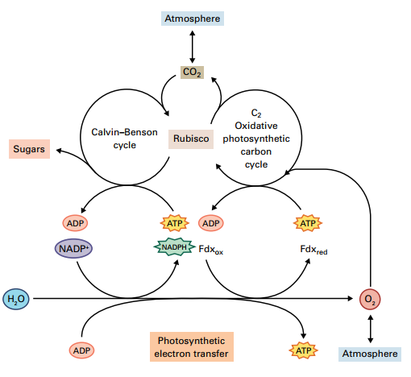 {left=54.39 top=6.67 width=45.61 height=74.41}

Diagram of the relationship between the reductive photosynthetic (C3 or Calvin–Benson cycle) and the oxidative photosynthetic (C2) carbon cycles. Rubisco initiates both the  Calvin–Benson cycle and photorespiration (the C2 cycle). In both cases, photosynthetic electron transport provides energy‐rich substrates (ATP and NADPH for photosynthesis, ATP and reduced ferredoxin (Fdxred) for  photorespiration and reassimilation of the resulting NH3). One of the substrates of the C3 cycle, CO2, is a product of the C2 cycle; in turn, the substrate of the C2 cycle, O2, is a product of C3 photosynthesis. The same atmospheric pools provide gaseous substrates for and receive gaseous products from both processes.

---

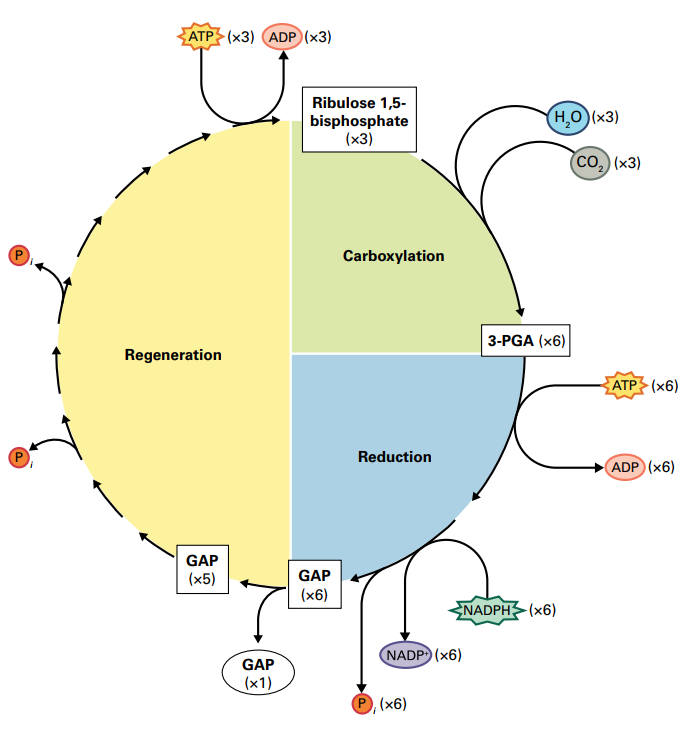 {left=55.67 top=10.45 width=45.63 height=84.61}

Three phases of the Calvin–Benson cycle: carboxylation, reduction, and regeneration. Overall, the fixation of three molecules of CO2 into one molecule of triose  phosphate requires six molecules of NADPH and nine of ATP (3 CO2 : 6 NADPH : 9 ATP ≡ CO2 : 2 NADPH : 3 ATP). The net glyceraldehyde 3‐phosphate (GAP) formed is utilized either for immediate metabolic needs or converted to a storage form of carbohydrate-starch in the chloroplast or sucrose in the cytosol. 3‐PGA, 3-phosphoglycerate

---

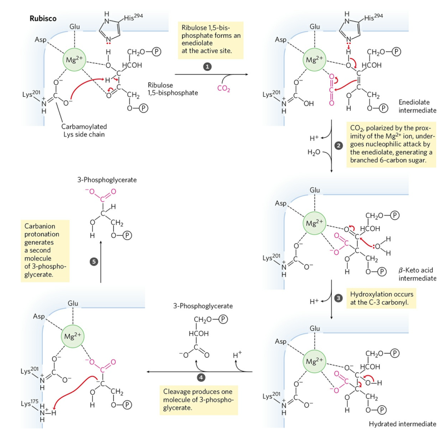 {left=47.46 top=0.00 width=52.54 height=90.32}

First stage of CO2 assimilation: **rubisco’s**
**carboxylase activity**. The CO2-fixation reaction is catalyzed by ribulose 1,5-
bisphosphate carboxylase/oxygenase. The overall reaction accomplishes the combination of one CO2 and one ribulose 1,5-bisphosphate to form two molecules of 3-phosphoglycerate, one of which contains the carbon atom from CO2 (red). Additional proton transfers (not shown), involving Lys201, Lys175, and His294, occur in several of these steps.

<u>https://www.ebi.ac.uk/thornton-srv/m-csa/entry/907/</u>

---

**Rubisco also catalyzes a wasteful oxygenase reaction: Catalytic imperfection**
The reactive enediolate intermediate generated on the Mg2+ ion sometimes
reacts with O2 instead of CO2; thus, rubisco also catalyzes a deleterious
oxygenase reaction. The products of this reaction are phosphoglycolate and
3-phosphoglycerate. The rate of the carboxylase reaction is four times that of the oxygenase reaction under normal atmospheric conditions at 25 C; the stromal concentration of CO2 is then 10 mM and that of O2 is 250 mM. The oxygenase reaction, like the carboxylase reaction, requires that lysine 201 be in the carbamate form. Because this carbamate forms only in the presence of CO2, rubisco is prevented from catalyzing the oxygenase reaction exclusively when CO2 is absent

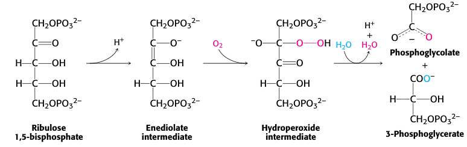 {left=36.08 top=64.18 width=63.92 height=35.82}

---

The 3-phosphoglycerate product of rubisco is next converted into fructose 6-phosphate, which readily isomerizes to glucose 1-phosphate and glucose 6-phosphate. The mixture of the three phosphorylated hexoses is called the hexose monophosphate pool. The steps in this conversion are like those of the gluconeogenic pathway, except that glyceraldehyde 3-phosphate dehydrogenase in chloroplasts, which generates glyceraldehyde 3-phosphate (GAP), is specific for NADPH rather than NADH. These reactions and that catalyzed by rubisco bring CO2 to the level of a hexose, converting CO2 into a chemical fuel at the expense of NADPH and ATP generated from the light reactions.

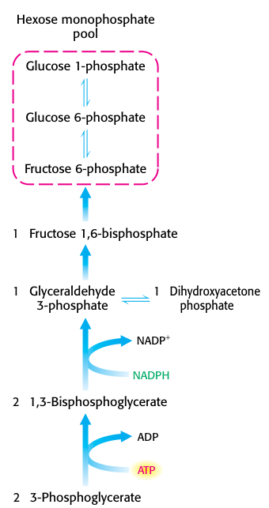 {left=72.02 top=1.54 width=27.98 height=94.07}

---

The third phase of the Calvin cycle is the regeneration of ribulose 1,5-bisphosphate, the acceptor of CO2 in the first step. The problem is to
construct a five-carbon sugar from six-carbon and three-carbon sugars. A
**transketolase **and an **aldolase **play the major role in the rearrangement of the
carbon atoms.

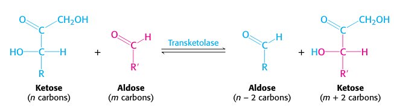 {left=18.48 top=27.91 width=68.02 height=33.89}

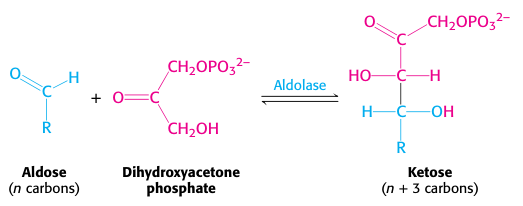 {left=18.48 top=65.75 width=46.09 height=32.28}

---

**TPP as a cofactor for transketolase.**

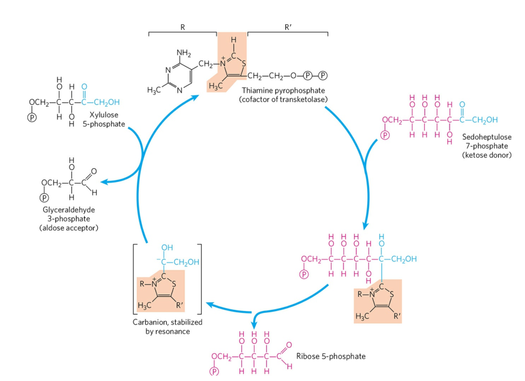 {left=23.11 top=11.77 width=66.27 height=85.60}

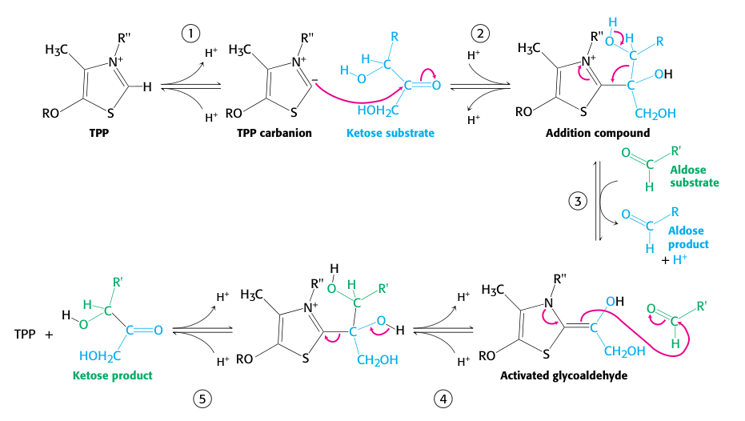 {left=18.38 top=15.40 width=81.62 height=81.98}

---

**Transaldolase mechanism.**

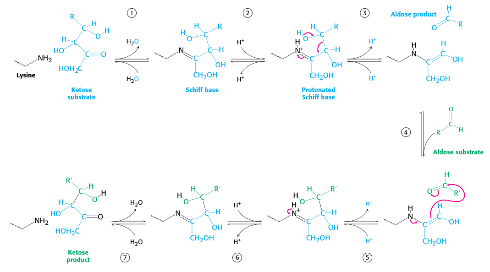 {left=18.91 top=20.32 width=80.67 height=79.68}

---

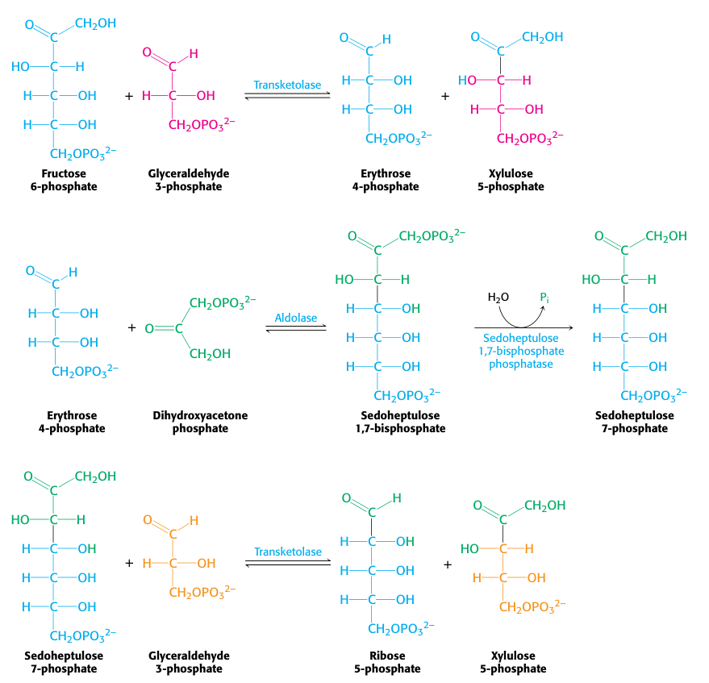 {left=44.13 top=2.14 width=55.87 height=95.72}

Formation of five-carbon sugars. First, transketolase converts a six-carbon sugar and a three-carbon sugar into a four-carbon sugar and a five-carbon sugar. Then,
aldolase combines the four-carbon product and a three-carbon sugar to form a seven-carbon
sugar. Finally, this seven-carbon sugar reacts with another three-carbon sugar to form two additional five-carbon sugars.

---

**Regeneration of ribulose 1,5-bisphosphate.** Both ribose 5-phosphate and xylulose 5-phosphate are converted into ribulose 5-phosphate, which is then phosphorylated to complete the regeneration of ribulose 1,5-bisphosphate.

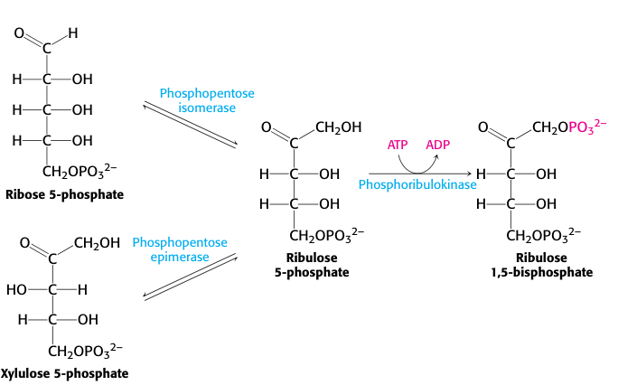 {left=20.60 top=20.32 width=70.68 height=78.25}

---

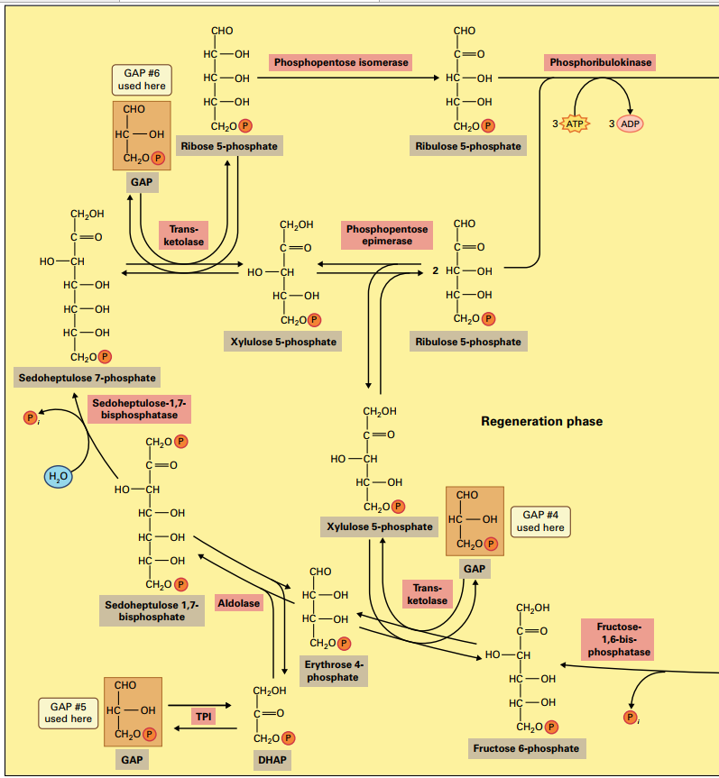 {left=18.04 top=10.98 width=40.59 height=78.14}

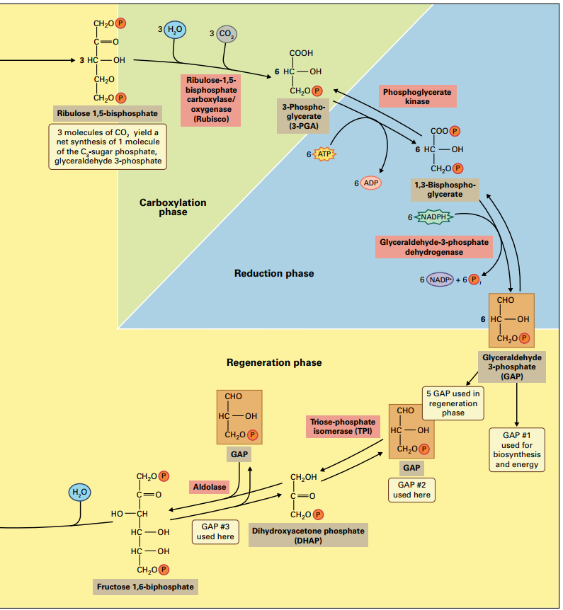 {left=58.63 top=10.88 width=40.59 height=78.24}

---

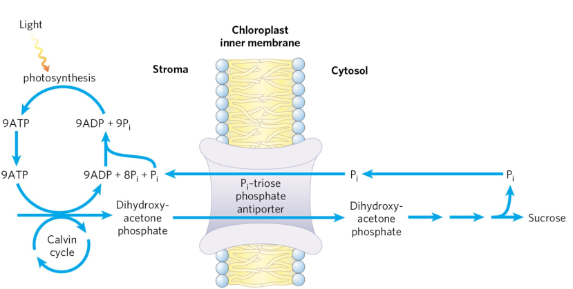 {left=30.51 top=0.00 width=69.49 height=62.44}

The Pi–triose phosphate antiport system of the inner chloroplast membrane. This transporter facilitates the exchange of cytosolic Pi for stromal dihydroxyacetone phosphate. The products of photosynthetic carbon assimilation are thus moved into the cytosol, where they serve as a starting point for sucrose biosynthesis, and PB required for photophosphorylation is moved into the stroma. This same antiporter can transport 3-phosphoglycerate and acts indirectly in the export of ATP and reducing equivalents

---

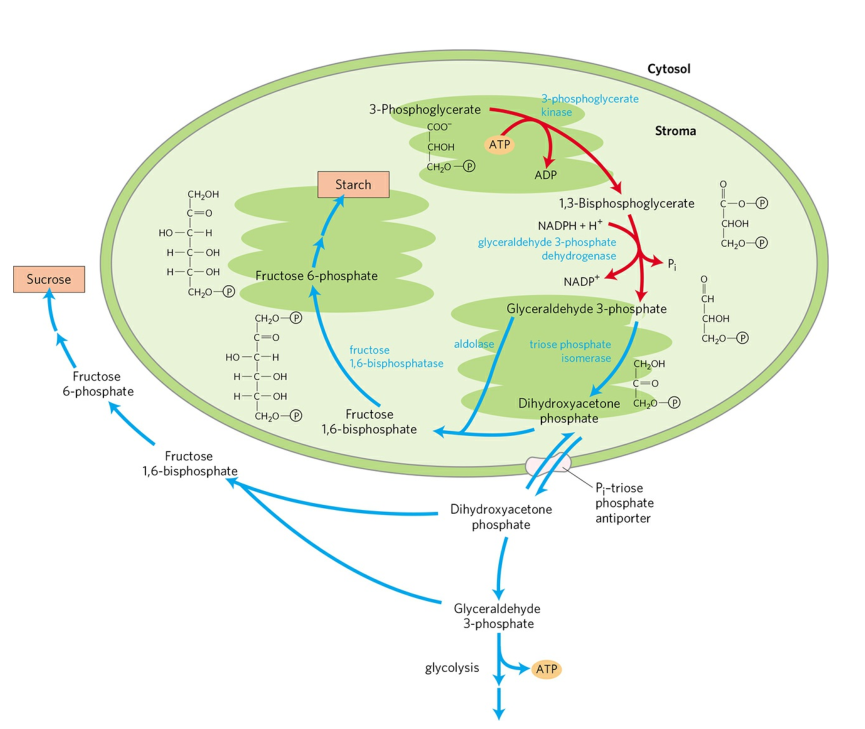 {left=33.26 top=0.00 width=66.74 height=100.00}

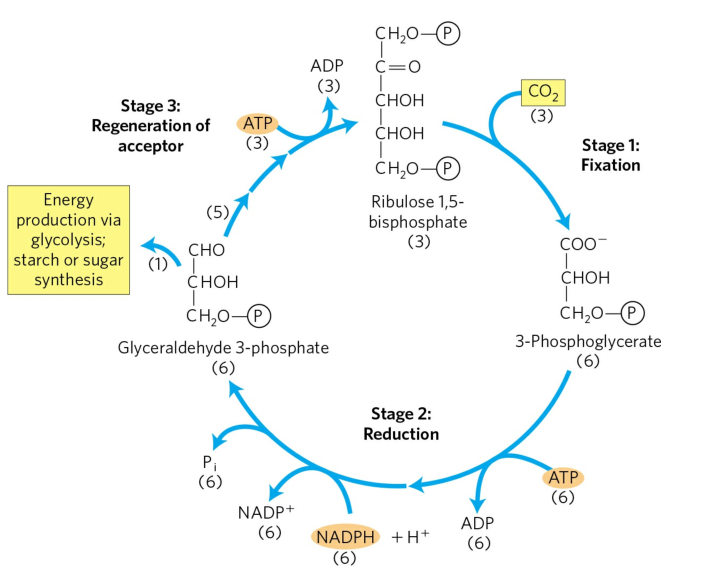 {left=16.21 top=61.15 width=27.67 height=38.85}

---

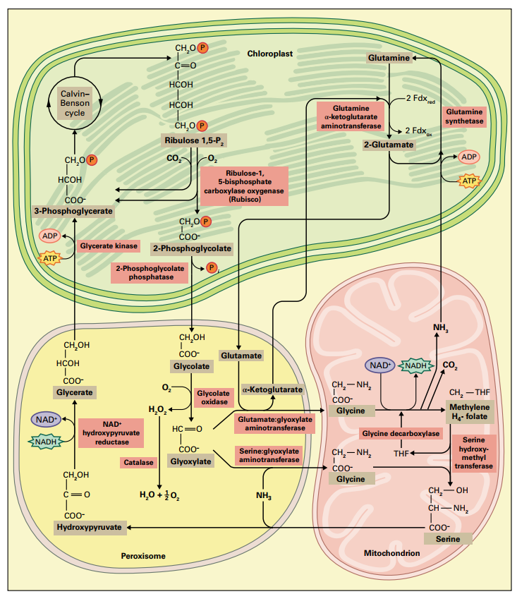 {left=53.93 top=2.96 width=46.07 height=94.07}

Operation of the oxidative photosynthetic carbon (C2) pathway involves cooperative interaction among three separate subcellular organelles: chloroplasts, peroxisomes, and mitochondria. The pathway is initiated in the chloroplast when Rubisco catalyzes the oxygenation of ribulose 1,5‐bisphosphate to produce one molecule of 3‐phosphoglycerate (3‐PGA) and one molecule of 2‐phosphoglycolate. The reactions of the C2 pathway bring about the metabolic interconversion of two molecules of 2‐phosphoglycolate to salvage one molecule of 3‐PGA, which can be used in the operation of the C3 cycle. Additionally, conversion of two 2‐phosphoglycolate to one molecule of 3‐PGA requires uptake of a third molecule of O2 and the release of one molecule of NH3. Reassimilation of the NH3 requires the net input of two reducing equivalents (e.g., one
molecule of NAD(P)H or two molecules of Fdxred) plus one molecule of ATP. The final step in the formation of 3‐phosphoglycerate also requires a molecule of ATP.

---

C4 photosynthesis

---

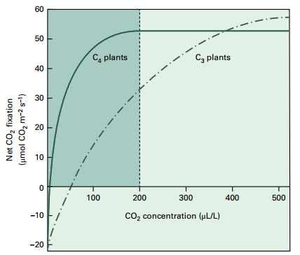 {left=55.42 top=0.00 width=44.58 height=67.59}

Effect of CO2 concentration on the CO2 fixation rate. As the ambient concentration of CO2 is increased in the presence of
saturating light, net CO2 uptake during photosynthesis increases in a roughly linear fashion, saturating at a relatively low CO2 concentration (150 μL L–1) in C4 plants and only beginning to show signs of saturation at ambient CO2 levels (360–375 μL L–1) in C3 plants. The concentration at
which net change in CO2 is 0 defines the CO2 compensation point and reflects the CO2 concentration at which the rate of gross photosynthetic CO2 uptake exactly equals the respiration rate. The total respiration rate comprises both mitochondrial‐linked (dark) respiration and photorespiration. That the CO2 compensation point for C3 plants (20–50 μL L–1) is greater than for C4 plants (0–5 μL L–1) is associated with the presence of
photorespiration in C3 plants and its virtual absence in C4 plants.

---

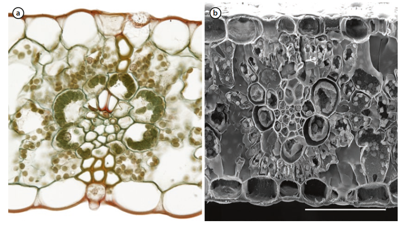 {left=41.07 top=0.00 width=58.93 height=58.64}

a, b Maize (Zea mays) leaf in cross-section. a Light micrograph showing a single leaf vein surrounded by a ring of large bundle sheath cells. Note the centrifugal orientation of the bundle sheath chloroplasts, placing them closer to the
surrounding mesophyll chloroplasts. B Scanning electron micrograph of a similar view. The bundle sheath cell contents are slightly shrunken in this preparation. Scale bar in b = 100 μm and applies to both panels

the bundle sheath cells of C3 plants are rather inconspicuous. In contrast, C4 bundle sheath cells are large and bright green due to the presence of numerous chloroplasts. This anatomical variant is called Kranz anatomy (German for “halo” or “wreath”) and is unique to plants that utilize the C4 photosynthetic pathway

---

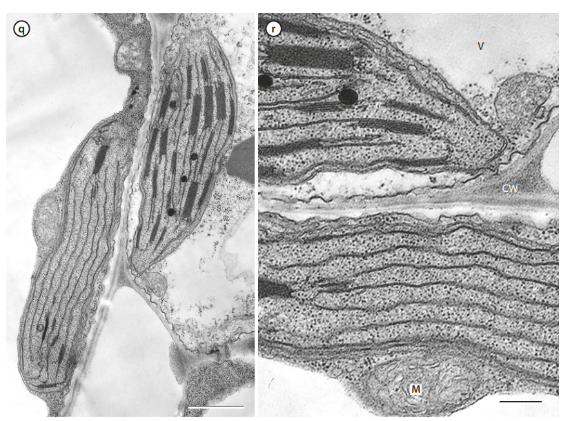 {left=53.07 top=0.00 width=46.93 height=62.60}

**q** TEM of portions of a maize (Zea mays) mesophyll cell (left side) containing an agranal chloroplast and a bundle sheath cell (right side) with a granal chloroplast. Scale bar = 2 μm. 
**r** Higher magnification of the two plastids in q showing granal (top) and agranal chloroplast (bottom) structure in more detail. V = vacuole, CW = cell wall, M = mitochondrion. Scale bar = 1 μm

In C4 photosynthesis, carbon dioxide is initially fixed in chloroplasts in
the mesophyll cells of the leaf. Mesophyll cell chloroplasts contain grana stacks and are termed “granal.” A four-carbon compound is transported to the bundle sheath cells where it is decarboxylated to a three-carbon molecule and CO 2. The released CO2 is then fixed again in the bundle sheath chloroplast, which lacks grana (“agranal”)

---

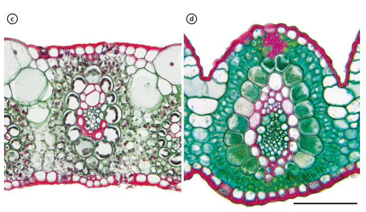 {left=75.42 top=0.00 width=24.58 height=50.00}

**c, d** Grass leaves with Kranz anatomy. 
**c** Sugar cane (*Saccharum officinarum*) has a single layer of photosynthetic bundle sheath cells, 
**d** while grama grass (*Bouteloua breviseta*) has a double layer of bundle sheath cells; the inner layer (mestome) is sclerified while the outer is  parenchymatous. Gama grass is a xerophyte and shows features such as bulliform cells and a thick cuticle which are discussed in the next section. Scale bar in d = 50 μm and applies to both panels

 {left=74.01 top=50.00 width=25.99 height=52.85}

---

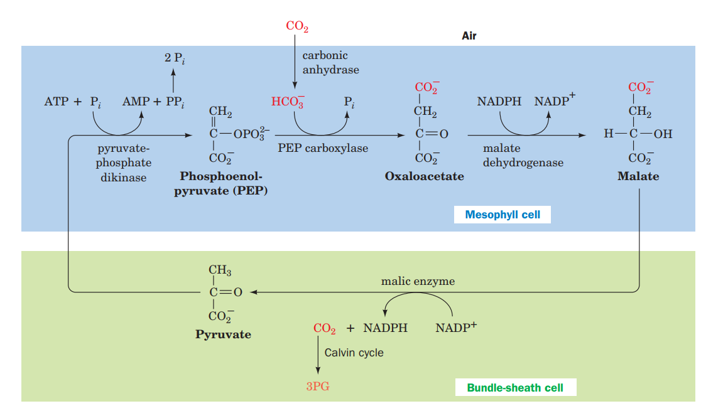 {left=25.68 top=23.40 width=74.32 height=76.60}

C4 pathway

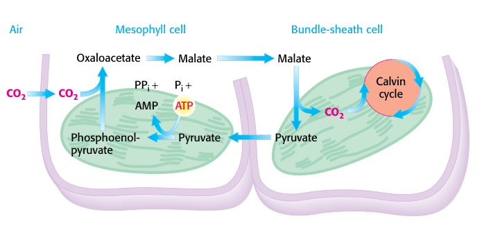 {left=17.63 top=0.00 width=36.82 height=30.86}

---

CAM Plants

---

**CAM Plants**

In CAM Plants, CO2 Capture and Rubisco Action Are Temporally Separated Succulent plants such as cactus and pineapple, which are native to very hot, very dry environments, have another variation on photosynthetic CO2 fixation, which reduces loss of water vapor through the pores (stomata) by which CO2 and O2 must enter leaf tissue. Instead of separating the initial trapping of CO2 and its fixation by rubisco across space (as do the C4 plants), they separate these two events over time. At night, when the air is cooler and moisture, the stomata open to allow entry of CO2, which is then fixed into oxaloacetate by PEP carboxylase. The oxaloacetate is reduced to malate and stored in the vacuoles, to protect cytosolic and plastid enzymes from the low pH produced by malic acid dissociation. During the day the stomata close, preventing the water loss that would result from high daytime temperatures, and the CO2 trapped overnight in malate is released as CO2 by the NADP-linked malic enzyme. This CO2 is now assimilated by the action of rubisco and the Calvin cycle enzymes. Because this method of CO2 fixation was first discovered in stonecrops, perennial flowering plants of the family *Crassulaceae*, it is called crassulacean acid metabolism, and the plants are called CAM plants.

---

Starch synthesis

---

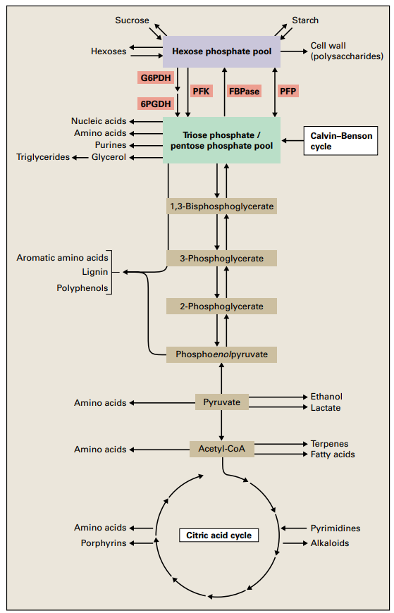 {left=66.00 top=2.96 width=34.00 height=94.07}

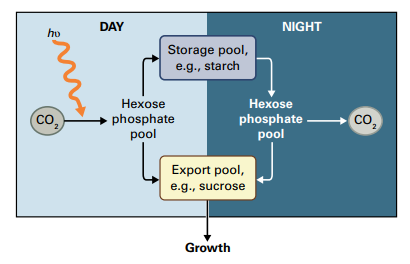 {left=37.55 top=2.96 width=28.45 height=32.57}

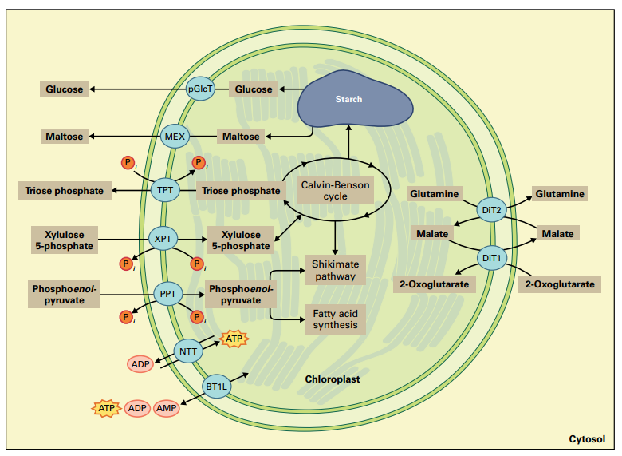 {left=17.72 top=34.21 width=48.28 height=62.83}

**metabolite pools **(hexose phosphates, pentose phosphate pathway intermediates and the triose phosphates glyceraldehyde 3‐phosphate and dihydroxyacetone
phosphate)

---

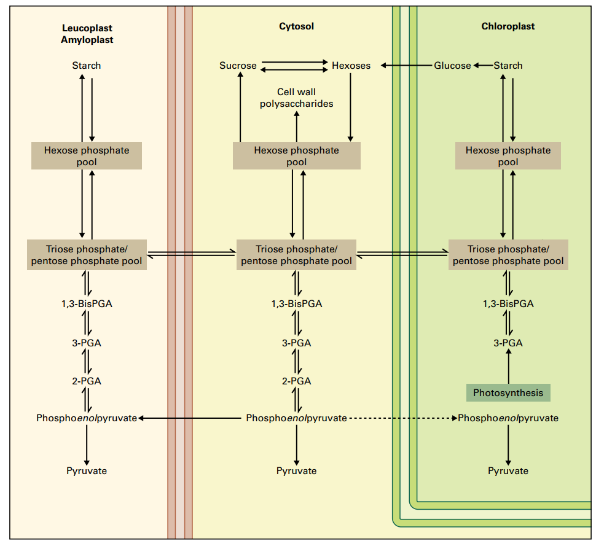 {left=41.74 top=2.96 width=58.26 height=94.07}

Duplication of metabolic pathways between the plant cell cytosol and the stroma of photosynthetic chloroplasts and nonphotosynthetic plastids. Pathways are shown in a simplified form.

---

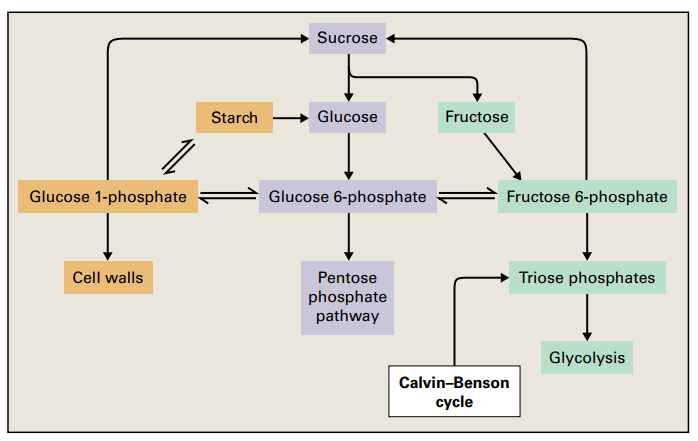 {left=39.79 top=0.00 width=60.21 height=67.63}

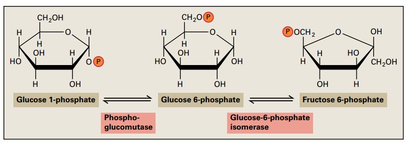 {left=39.79 top=62.36 width=60.21 height=37.64}

The hexose phosphate pool
contributes intermediates to glycolysis and
the oxidative pentose phosphate pathway as well as to many biosynthetic processes.

Intermediates of the hexose phosphate pool are interconverted by two enzymes, phosphoglucomutase and glucose‐6‐phosphate
isomerase.

---

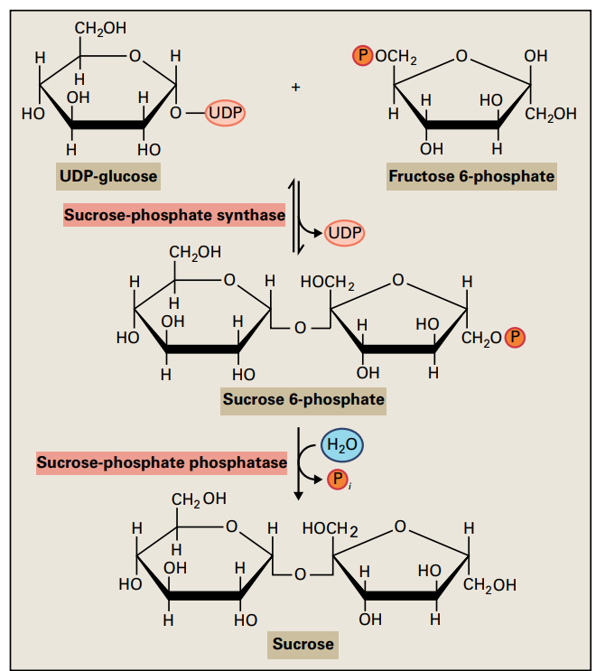 {left=66.91 top=2.96 width=33.09 height=66.23}

Main transported sugar in most plants (via **phloem**, not xylem).

Formed in the cytosol from UDP-glucose + fructose-6-phosphate.

Transported from source (photosynthetic tissues) → sink (roots, seeds, fruits).

Non-reducing disaccharide — chemically stable for long-distance transport.

Cleaved by invertase or sucrose synthase for metabolism.

Central hub linking photosynthesis, respiration, and starch synthesis.

---

**Xylem**: transports water and minerals from the roots upward. This is what the bulb needs so that when it sprouts, the young leaves can grow and start photosynthesizing.

**Phloem**: transports sugars and other organic molecules, usually from photosynthetic tissues (leaves) to storage organs (like the onion bulb)

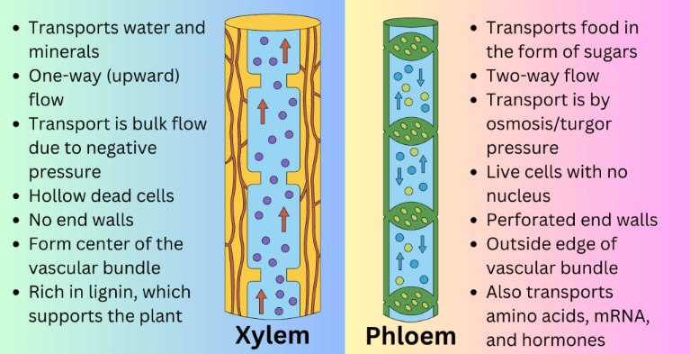 {left=25.64 top=4.42 width=51.78 height=47.17}

---

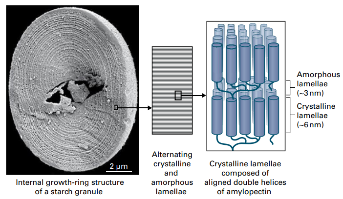 {left=60.22 top=13.03 width=39.78 height=41.10}

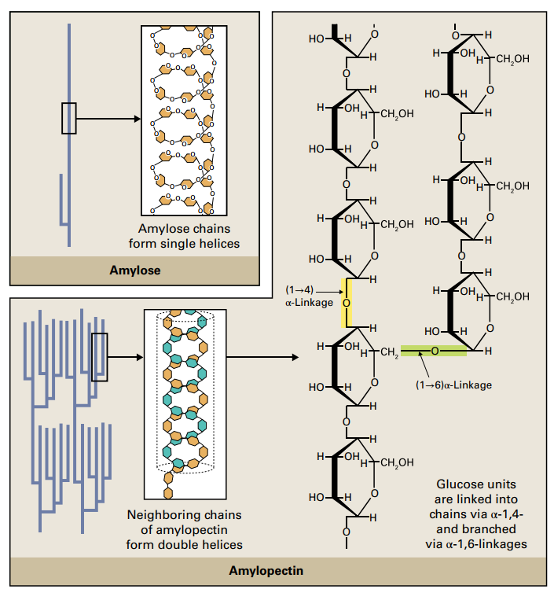 {left=17.93 top=14.35 width=42.29 height=79.88}

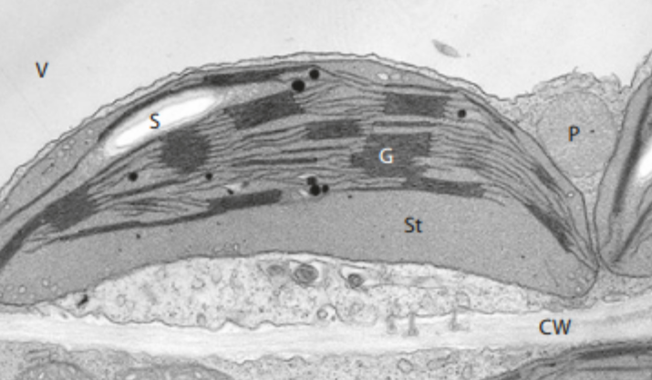 {left=61.14 top=56.44 width=36.45 height=37.79}

Starch drop

**Starch = Amylose (20-30%) + Amylopectin (70-80%)**

---

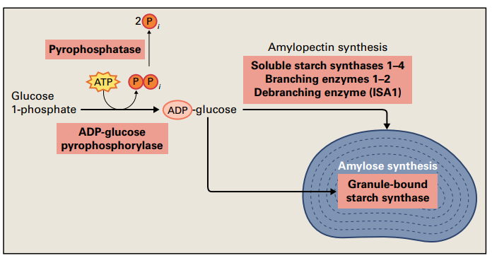 {left=50.00 top=0.00 width=50.00 height=46.62}

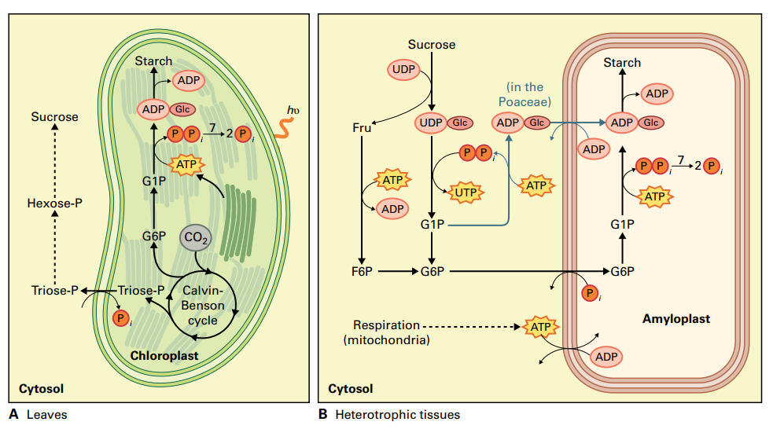 {left=45.94 top=46.62 width=54.06 height=53.38}

Cereal crops only

Starch synthesis occurs in chloroplasts (leaves) and amyloplasts (storage tissues).
ADP-glucose is the activated glucose donor for starch formation.
ADP-glucose pyrophosphorylase (AGPase) catalyzes:
           Glc-1-P+ATP→ADP-Glc+PP𝑖
Starch synthases and branching enzymes build amylopectin and amylose chains.
In leaves, starch accumulates during the day and is degraded at night to form sucrose.
Sucrose synthesis occurs in the cytosol via UDP-glucose and fructose-6-phosphate.
Sucrose is exported through phloem to heterotrophic tissues, where it is broken down and converted back to ADP-glucose for storage starch.
In cereal endosperm, AGPase and ADP-glucose synthesis occur mainly in the cytosol (unlike in other plants).

---

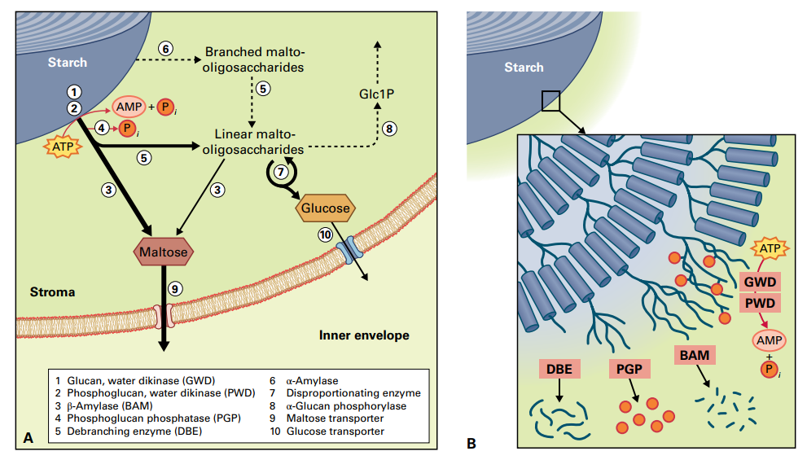 {left=46.84 top=0.00 width=52.09 height=52.80}

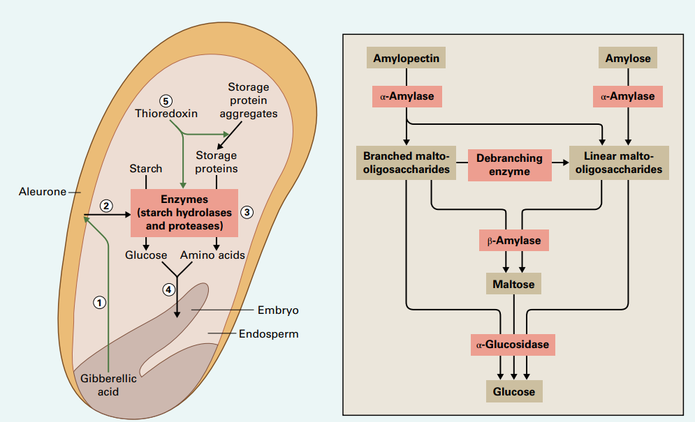 {left=58.31 top=55.34 width=40.63 height=43.92}

During germination, the release of the hormone gibberellic acid from the embryo (1) triggers the secretion of enzymes from the living aleurone layer surrounding the starchy endosperm (2) and from the scutellum. Three types of starch‐degrading enzymes are released: α‐amylase, the debranching enzyme limit dextrinase, and α‐glucosidase
(also called maltase). Proteases for degrading storage proteins are also secreted. In addition, secreted proteases activate a preformed β‐amylase stored within the endosperm through limited proteolysis of its carboxyl terminus. Together, these enzymes hydrolyze the starch to glucose and the proteins to free amino acids (3)

---

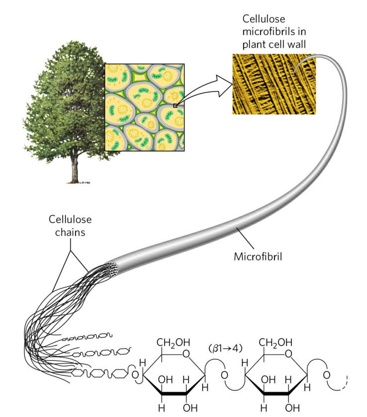 {left=50.52 top=0.00 width=49.48 height=100.00}

**One more sugar. Cellulose structure. **

The plant cell wall is made up in part of cellulose molecules arranged side by side to form crystalline arrays—cellulose microfibrils. Several microfibrils may combine to form larger  cellulose macrofibrils. The scanning electron microscope shows macrofibrils, 5 to 12 nm
in diameter, laid down on the cell surface in several layers distinguishable by the different orientations of the fibrils.

Glucose but β(1→4),
Not α(1→4) as starch

---

**Cellulose**

Polymer of glucose (repeating β-D-glucose units).
Monomers linked by β(1→4) glycosidic bonds (not α as in starch).
Forms long, straight chains that associate via hydrogen bonds → microfibrils.
Synthesized at the plasma membrane by cellulose synthase complexes (CesA) using UDP-glucose as the substrate.
Provides structural strength and rigidity to the plant cell wall.

---

**HOMEWORK**

---

**Problem 1.** The light used by vascular plants for photosynthesis has a wavelength of about 700 nm. Calculate the energy of a “mole” of photons (an einstein) for light of this wavelength and compare with the energy needed for ATP synthesis (ADP + Pi -> ATP 30.5 kJ/mole). Draw a conclusion: would a 1-step process that directly uses a photon for ATP synthesis beneficial? Think once again how do plants solve the problem.

HINT: look up “Planck equation” in the Wikipedia.

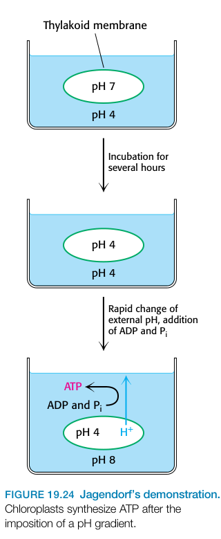 {left=81.83 top=28.93 width=18.17 height=71.07}

**Problem 2.** Consider Jagendorf experiment in the image. Assuming external volume Vext= 2 mL, concentration of thylakoid vesicles 0.5 x 109 L-1, and internal lumen volume of each thylakoid Vth= 3 x 10-19 L, find how many moles of ATP will be synthesized. Suppose that 3H+ are used up per one ATP synthesized, the pH values take from the image. If you want more ATP, what is more beneficial: make first step pH 1 lower, or second step pH 1 higher?

---

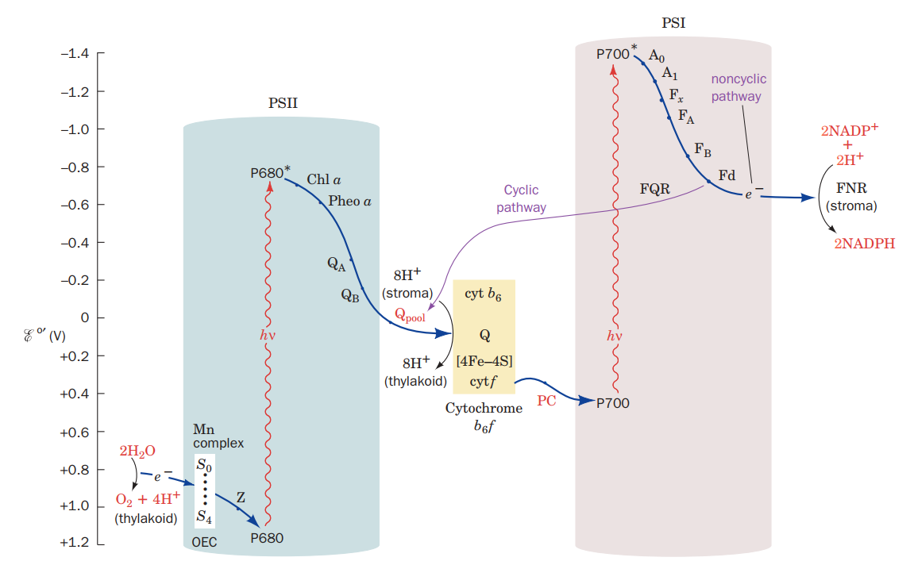 {left=43.78 top=38.17 width=56.22 height=61.83}

**Problem 3.** Consider the scheme below. You have a monochromatic laser and a sample with chloroplasts. Your advisor asks you to come up with an experiment that will drive cytochrome f, plastocyanin, and plastoquinone into their **reduced **forms. What wavelength should your laser be? Explain the logic.

Reminder:

**Oxidized:** electrons were lost

**Reduced: **electrons were acquired

plastocyanin

plastoquinone

cytochrome f

---

**FINALE**

---
