

Bioorganic Chemistry

Tymchyshyn V.B.

Lecture 8: Molecular Signaling

---

Cells live in a community

They should interact

---

**No cell lives in isolation**

Many cells sense physical stimuli: mechanical pressure (touch), heat, light, variety of environmental chemicals, including nutrients such as sugars and amino
acids as well as oxygen, toxic compounds, and diverse molecules that convey taste (tastants) and odor (odorants), levels of oxygen, etc.

Many types of cells release particular chemicals that can influence the behavior of another cell; these are often called **extracellular** signaling molecules, or simply **signals**. You can think about signals in the brain or hormones.

In the vertebrate eye, light is transmitted through the transparent corneal tissue and focused by the lens tissue, eventually impinging on the neural retina. The precise arrangement of tissues in the eye cannot be disturbed without impairing its function. Such coordination in the construction of the lens and retina is accomplished by one group of cells communicating an organizing change in the behavior or developmental trajectory of an adjacent set of cells. This kind of interaction is known as an **induction**.

---

**No cell lives in isolation**

The cell that receives a signal — termed the **target cell** — must be able to
detect the signaling molecule. Typically, the signaling molecule binds
noncovalently to a specific protein in the cell, typically called the
**receptor**, that contains a binding site for the signaling molecule. The
signaling molecule that binds a receptor is often called the **ligand **of the
receptor. Receptors bind a single type of molecule or a group of closely
related molecules.

The release and reception of such signals is a fundamental process, known as **cellular communication**, that shapes the development and function of every living organism.

---

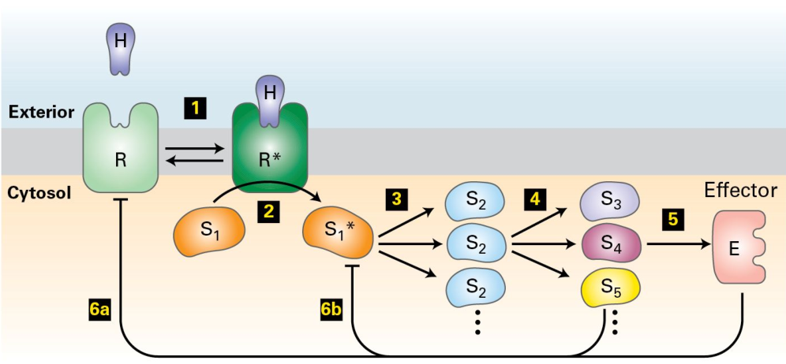 {left=23.14 top=0.00 width=70.98 height=58.53}

**Generalized signal transduction pathway.** The series of steps leading from initial detection to the final **response **is termed a **signal transduction pathway**. Signal transduction pathways ultimately lead to activation (or in some cases inhibition) of one or more **effector proteins** — often enzymes or transcription factors or cytoskeletal proteins — that lead directly to changes in cellular activities

---

**Essential features of most signal transduction pathways**

**Signal amplification **
the activation of a single receptor molecule can lead to activation of more than one molecule of a downstream intermediate protein in the signal transduction pathway. Each intermediate protein can also activate multiple proteins downstream of it, resulting in a cascade of activation. The extent of amplification depends on the number of steps in the signal transduction cascade and on the relative concentrations of the various components.
**Feedback repression**
Cells must be able to suppress or even turn off a signal transduction
pathway once the cell has adequately responded to the signal or the signal
has been removed. Virtually all signal transduction pathways have
feedback controls that will shut down the pathway: once activated, an
effector protein modifies either the receptor or one of the proteins that
operates in the early stages of the signal transduction pathway, thus
blocking the downstream cellular responses

---

**Signaling Molecules Can Act Locally or at a Distance**

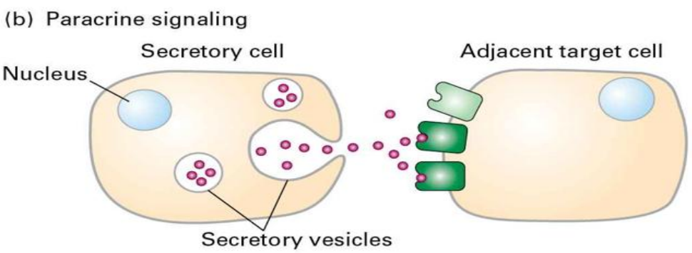 {left=30.36 top=50.06 width=43.21 height=28.11}

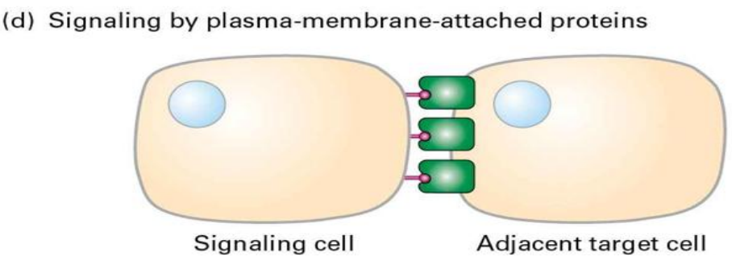 {left=54.44 top=16.56 width=44.32 height=28.12}

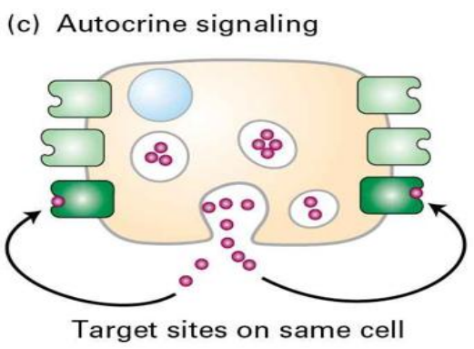 {left=77.25 top=50.06 width=21.51 height=28.12}

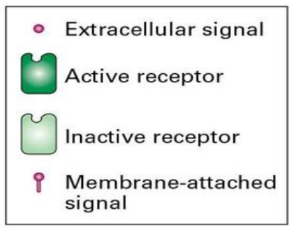 {left=17.38 top=63.30 width=17.08 height=23.83}

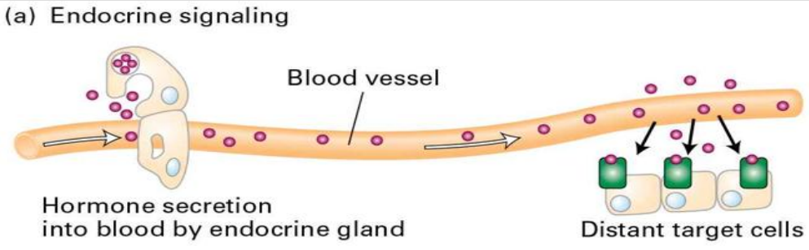 {left=16.26 top=20.85 width=43.21 height=23.83}

---

In **endocrine **signaling, the signaling molecules (**hormones**) act on target cells distant from their site of synthesis. Examples: insulin, epinephrine, etc.

In **paracrine **signaling, the signaling molecules released by a cell affect only those target cells in close proximity (few micrometers). Examples: a neuron releasing a neurotransmitter that acts on an adjacent neuron, many of the protein growth factors that regulate development in multicellular organisms act at short range. In some cases, paracrine signaling molecules, e.g. TGF-β, are secreted by a cell and then trapped nearby in the extracellular matrix until freed to bind to cell-surface receptors on a nearby cell.

In **autocrine **signaling, cells respond to substances that they themselves release. This type of signaling is particularly characteristic of tumor cells. Many tumor cells release growth factors that stimulate inappropriate, unregulated self-proliferation.

Some signaling molecules can act at both short and long ranges. For example, epinephrine (also known as adrenaline) functions as a neurotransmitter (paracrine signaling) and as a hormone (endocrine signaling).

---

The effector proteins in signal transduction pathways are often enzymes or
transcription factors that induce two major types of cellular responses: 
rapid **short-term** changes in protein activities (seconds-to-minutes) or 
slower **long-term** changes (hours-to-days). 

**Short-term ****changes** are typically consequences of modifications to specific preexisting enzymes and other proteins that alter their activity or function, often by covalent modifications such as phosphorylation or ubiquitination or by binding of ions or molecules such as or cAMP. Such modifications can induce changes in cellular metabolism of sugars, amino acids, and lipids; secretion of hormones; electric signals called action potentials. 

**Long-term changes** are typically consequences of changes in gene expression, either activating or inhibiting synthesis of specific proteins. The effector proteins are usually transcription factors. Long-term changes in the amounts and activities of specific proteins within cells are critical for cell proliferation, cell differentiation, and organismal development.

---

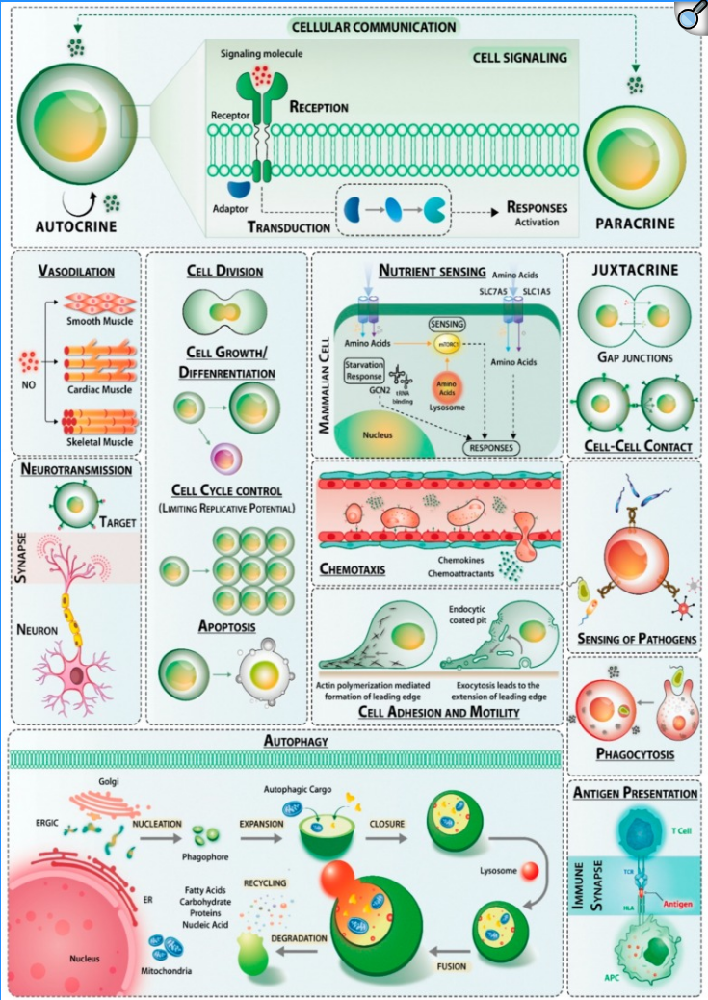 {left=60.17 top=0.00 width=39.83 height=100.00}

Cellular signaling controls various aspects of multicellular life forms. Not only the key biological processes such as cell division, differentiation, growth, and cell-cycle transition, but also specialized cell-specific functions such as neurotransmission, pathogen-sensing, phagocytosis, and antigen-presentation are controlled by specific signaling pathways. The process of autophagy and nutrient cycling and recycling are some accessory pathways that are triggered by definitive signaling cues.

---

The interacting surfaces of a receptor and ligand are **complementary** (see image) held together by multiple weak, noncovalent forces, including ionic, van der Waals, and hydrophobic interactions. 

Most cases, the binding of the ligand to the receptor causes the receptor to change from an inactive conformation (R) to an active conformation R*.
R + L → RL → LR*
Only the active conformation of the receptor R* can trigger the subsequent steps in the signal transduction pathway. Thus receptors are considered to be **allosteric proteins.**
 
As with all allosteric proteins, there is an equilibrium between the R and R* forms of the receptor. The ligand binds much more tightly to the R* than the R conformation, thus pushing the equilibrium to the right and activating the signal transduction pathway.

 {left=79.21 top=-0.00 width=20.79 height=50.00}

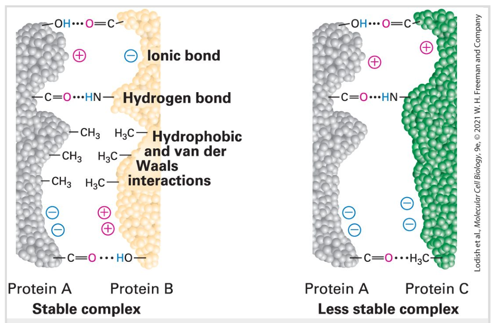 {left=83.97 top=51.89 width=14.23 height=48.11}

---

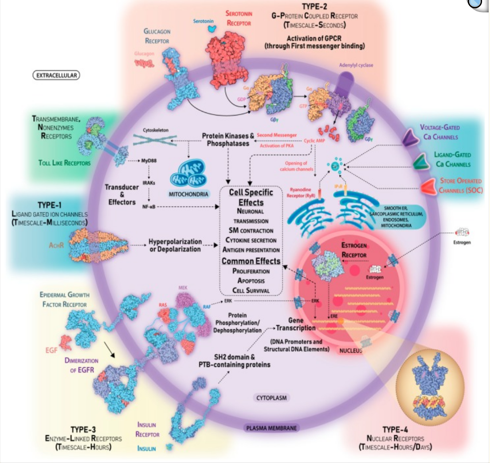 {left=40.58 top=0.00 width=59.42 height=100.00}

There are two broad categories of receptors cell-surface receptors and intracellular receptors

A holistic view of the various cell-surface and intracellular receptors, their associated intracellular components, and downstream effects
(receptor subclasses are omitted for simplicity)

---

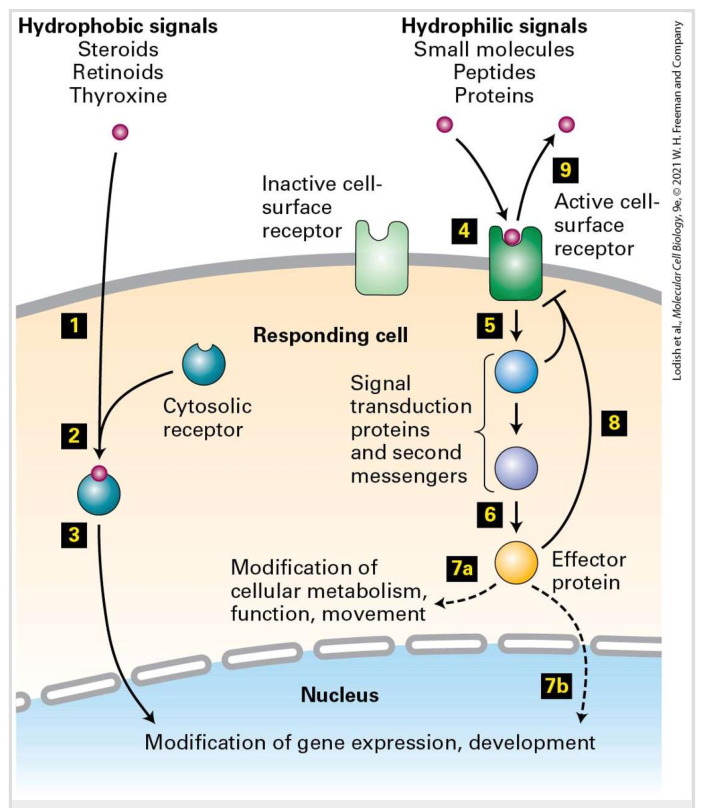 {left=54.09 top=2.96 width=45.91 height=94.07}

1. **Cell-surface receptors** (Plasma membrane). Ligands: Hydrophilic molecules (e.g. adrenaline, acetylcholine, insulin, glucagon, growth factors). Trigger intracellular signaling cascades via second messengers → enzyme activation, ion channel changes, cytoskeletal effects, short-term responses

2. **Cytoplasmic receptors** (Cytosol). Ligands: Hydrophobic molecules (e.g. steroid hormones). Receptor–ligand complex translocates to nucleus → regulates gene expression

3. **Nuclear receptors **(Nucleus). Ligands: Lipid-soluble hormones (e.g. thyroid hormone, retinoic acid). Bind DNA directly → activate/repress transcription (long-term effects)

---

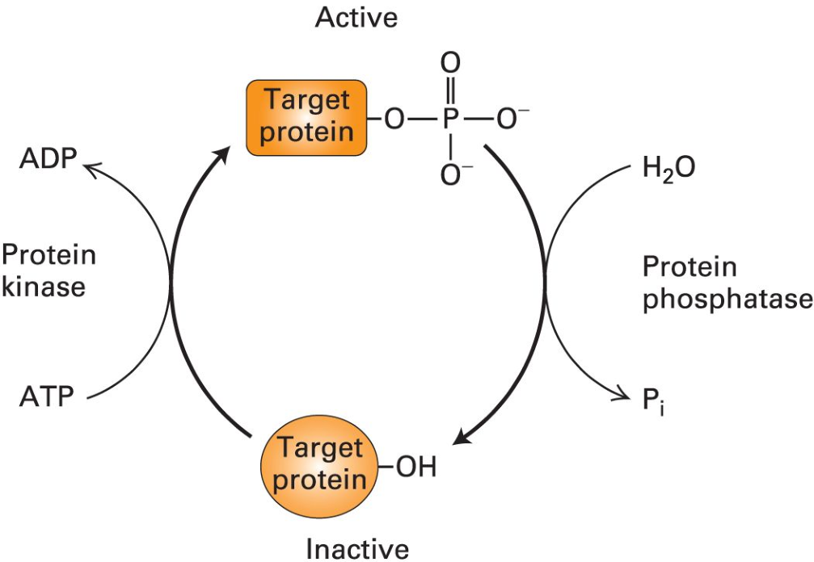 {left=55.50 top=19.44 width=44.50 height=54.68}

**Protein kinases** (PKs) add phosphate groups to specific residues of target proteins, while **protein phosphatases** remove phosphate groups from these residues

The catalytic activity of all kinases is highly regulated; commonly it is
modulated by the binding of other proteins to the kinase and by changes in
the concentrations of various small intracellular signaling molecules and

**A small reminder**

---

Like an enzyme binding to a substrate, each type of receptor binds only a single type of molecule or a group of very closely related ones.
A single ligand may stimulate different cell types to respond in distinct ways. Different cell types often have different receptors that bind the same ligand, and activation of each receptor type induces a different intracellular signal transduction pathway. 
**Example: ** acetylcholine 
In a skeletal muscle cell, release of acetylcholine from a motor neuron innervating the cell triggers muscle contraction
In heart muscle, the release of acetylcholine reduces the the heart rate
In pancreatic acinar cells it triggers secretion of digestive enzymes to facilitate digestion of a meal
Sometimes, the same receptor found on different cell types can, in response to binding the ligand, activate different signal transduction pathways leading to activation of different effectors. 
**Example:** the β-adrenergic receptor for the hormone epinephrine
depolymerization of glycogen to glucose in liver and muscle
hydrolysis and secretion of stored fat in adipose cells

---

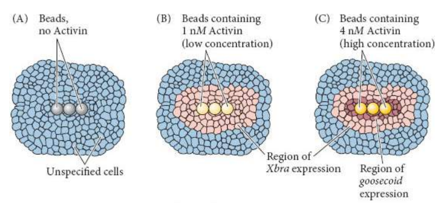 {left=43.91 top=0.00 width=56.09 height=46.17}

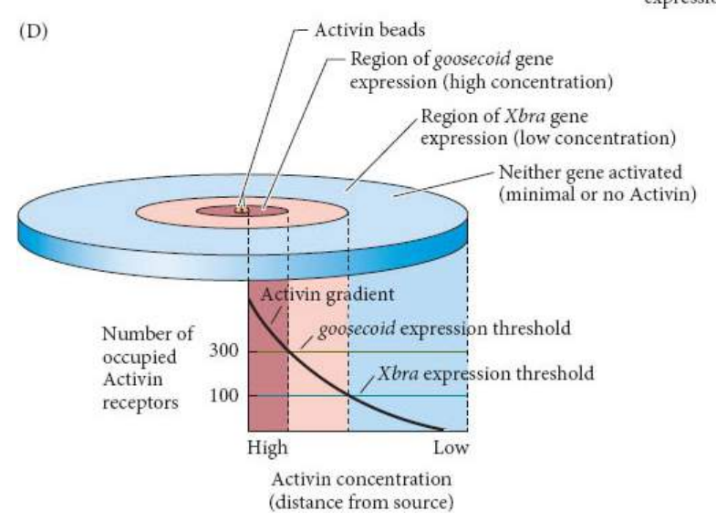 {left=57.29 top=46.17 width=42.71 height=53.83}

A threshold value appears to exist that determines whether a cell will express goosecoid, Xbra, or neither gene. In addition, Brachyury (the Xbra protein product in Xenopus) inhibits the expression of goosecoid, thereby creating a distinct boundary. This pattern correlates with the number of Activin receptors occupied on individual cells.

A gradient of the paracrine factor Activin, a morphogen, causes concentration-dependent expression differences of two genes in unspecified amphibian cells.

---

**Receptor kinetics**

Resembles Michaelis-Menten kinetics (think why)
Kd (**dissociation constant**) is  the lower the ligand concentration required to bind 50% of the cell-surface receptors.
Example (to feel the numbers): Kd for insulin in liver 1.4x10-10 M. The normal concentration of insulin in the blood is about 5x10-12 M. After the meal 2.5x10-11 M.

 {left=17.74 top=17.57 width=18.70 height=11.96}

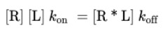 {left=16.89 top=32.37 width=24.27 height=7.96}

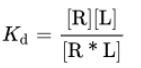 {left=17.74 top=43.65 width=14.69 height=12.59}

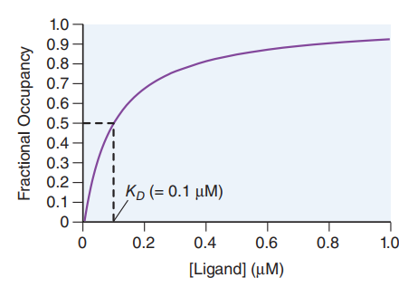 {left=53.02 top=-0.00 width=46.98 height=58.70}

---

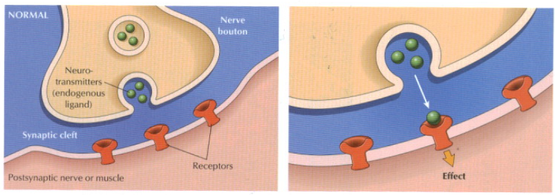 {left=48.33 top=0.00 width=51.67 height=32.37}

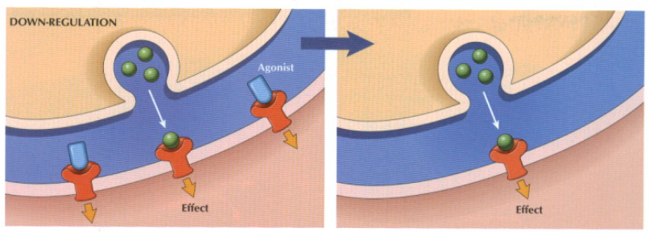 {left=48.33 top=34.60 width=50.96 height=32.37}

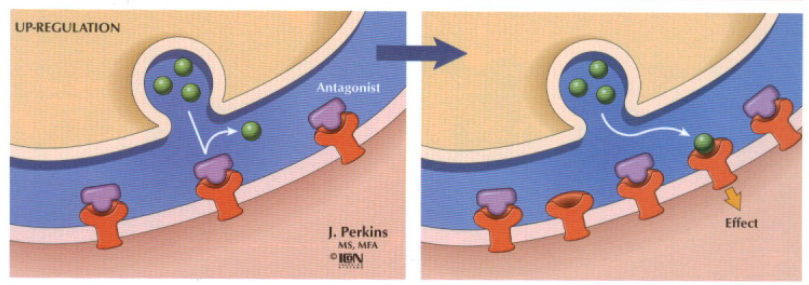 {left=48.31 top=67.63 width=51.69 height=32.37}

Cells can regulate the number of receptors to avoid overstimulation or understimulation.

As an example neuronal signal transmission is shown.

---

Pharmacologic interlude

Drug-receptor interaction

---

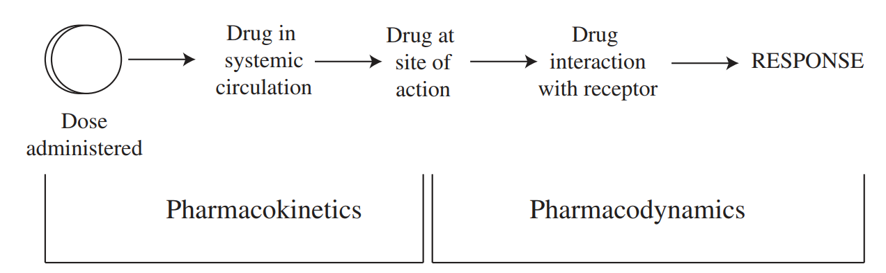 {left=16.03 top=0.00 width=48.89 height=26.92}

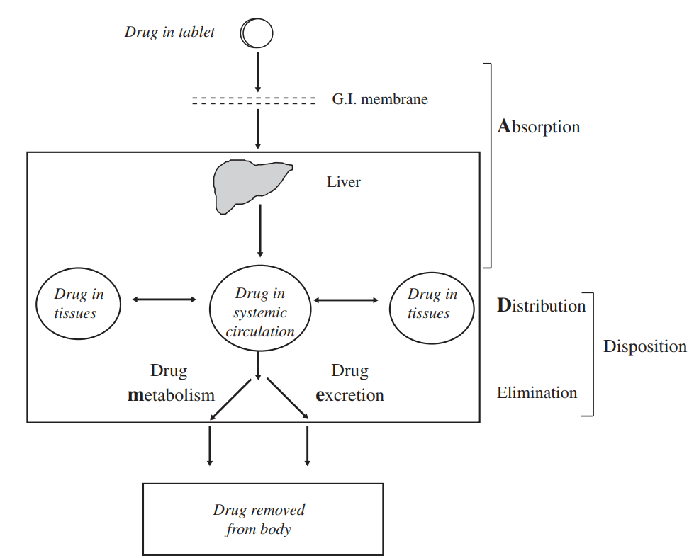 {left=65.78 top=-0.00 width=34.22 height=48.97}

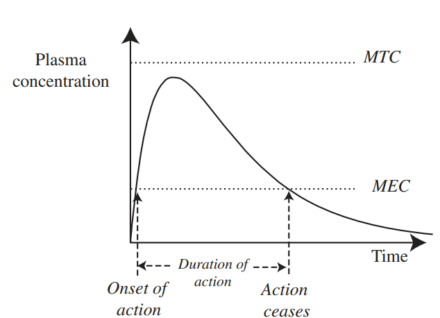 {left=60.35 top=52.37 width=39.65 height=47.63}

The **minimum effective concentration** (MEC) is the lower boundary for effective drug concentrations; plasma concentrations below the MEC have a high probability of being subtherapeutic. 
The **maximum tolerated concentration** (MTC) is the upper boundary for optimum drug concentrations; plasma concentrations above the MTC have a high probability of producing adverse effects or toxicity.
The **onset of action** of a drug, which may be estimated as the time it takes for plasma concentrations to reach the MEC.
The **duration of action** of a drug, which may be estimated as the time during which plasma concentrations remain within the therapeutic range.

---

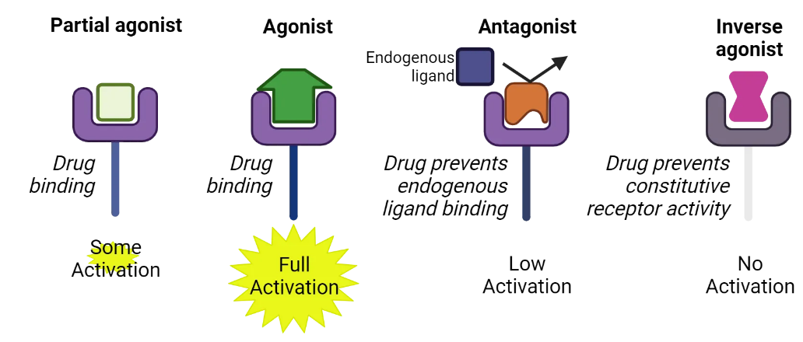 {left=43.54 top=2.96 width=54.79 height=41.53}

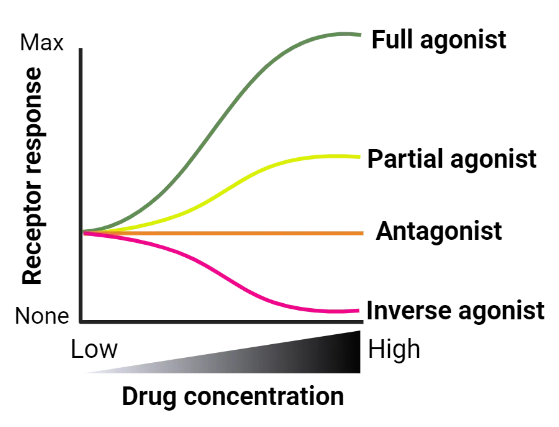 {left=13.92 top=0.00 width=30.58 height=41.53}

A **full agonist** is a ligand or drug that is capable of binding to and activating a receptor with maximal efficacy (Epinephrine + adrenergic receptor). 
A **partial agonist** also can activate a receptor upon binding,but it elicits a reduced receptor response compared to a full agonist, even with increasing concentration of the ligand (Buprenorphine + mu-opioid receptor, good because decreases the risk of overdose).
An **inverse agonist** is a drug that has the same binding site as a full agonist but reduces activity in a receptor that would otherwise be **constitutively active** (activation without ligand). Example: Antihistamines + histamine receptors.
An **antagonist** is a ligand that blocks the activation of the receptor by preventing agonists from binding. In contrast to the inverse agonist, an antagonist does not have any intrinsic activity on the receptor itself, it simply blocks agonists from interacting with the receptor (caffeine is an antagonist at adenosine receptors).
**Allosteric modulators**, can regulate receptor activity without interacting with a receptor’s orthosteric site,

---

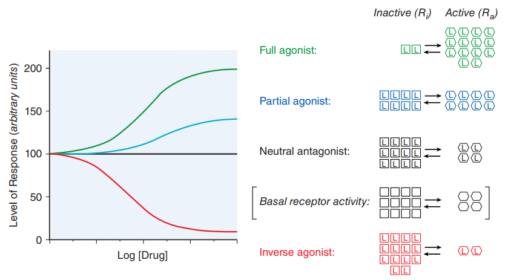 {left=20.38 top=8.91 width=78.14 height=77.12}

---

**Example**

**Isoproterenol **is an agonist of the epinephrine receptor (adrenergic receptor) on bronchial smooth muscle cells. It has a tenfold lower Kd. When activated, adrenergic receptors cause
bronchial smooth muscle to relax, opening the air passages in the lungs.
It is used in treating bronchial asthma, chronic bronchitis, and emphysema.

**Alprenolol **is an antagonist of β-adrenergic receptor present on cardiac muscle cells. Its activation increases the heart’s contraction rate. Antagonists are referred to as beta-blockers; are used to slow heart contractions in the treatment of
cardiac arrhythmias and angina.

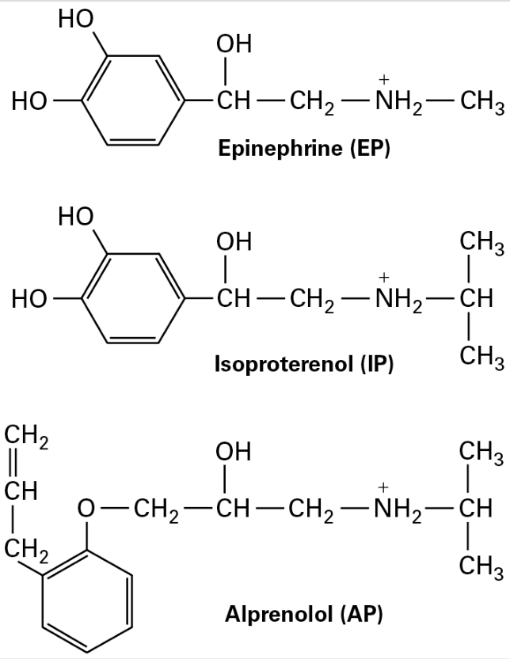 {left=56.51 top=0.00 width=43.49 height=100.00}

---

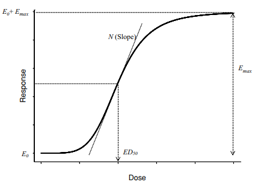 {left=61.51 top=0.00 width=38.49 height=49.92}

Dose-response for the Emax model.

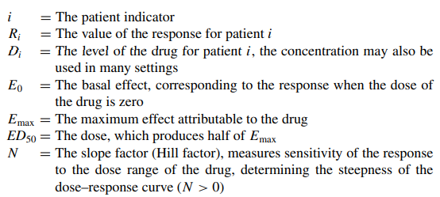 {left=9.53 top=2.22 width=51.98 height=41.53}

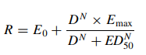 {left=35.81 top=48.13 width=19.48 height=13.15}

The Emax model has four parameters: E0, Emax, ED50, and N.  
The Emax model predicts the maximum effect a drug can have (Emax). 
The Emax model predicts a zero-dose effect (E0) when no drug is present.  
The Emax model follows the “law of diminishing returns” at higher doses.  
The Emax model parameters are readily interpretable.

---

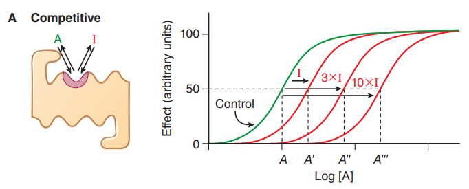 {left=37.99 top=0.00 width=62.01 height=44.45}

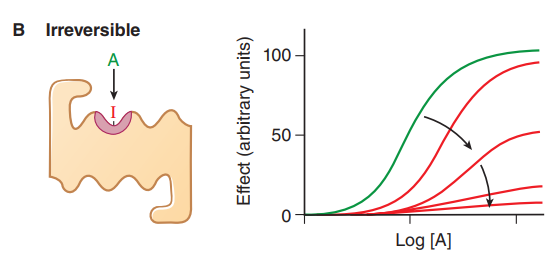 {left=37.99 top=39.82 width=50.00 height=41.37}

**Mechanisms of receptor antagonism.**

**A - **agonist
**I - **antagonist

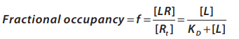 {left=17.33 top=39.44 width=15.47 height=10.56}

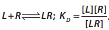 {left=17.33 top=53.14 width=19.38 height=9.63}

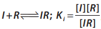 {left=17.33 top=64.36 width=17.50 height=8.89}

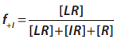 {left=17.15 top=76.24 width=15.83 height=10.00}

---

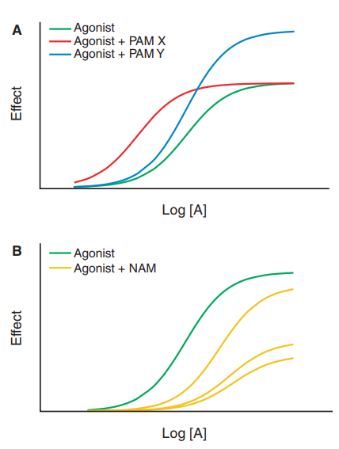 {left=60.06 top=2.96 width=39.94 height=94.07}

**Allosteric modulation.**
drug binding at a site distinct from the orthosteric site can alter the receptor’s affinity for the orthosteric agonist.

**PAM **- positive allosteric modulator
**NAM **- negative allosteric modulator

**Cinacalcet** is PAM for the calcium- sensing receptor
**Benzodiazepines **and **barbiturates** are PAMs for GABAA receptor.
**Maraviroc **is a NAM, blocking the binding of the HIV gp120 protein to the CCR5 chemokine receptor.
**Ticagrelor **and **cangrelor **are similarly NAMs, blocking the actions of ADP binding to the orthosteric site on platelet P2Y12 receptors.

---

Receptor types

Some of the most common types functioning

---

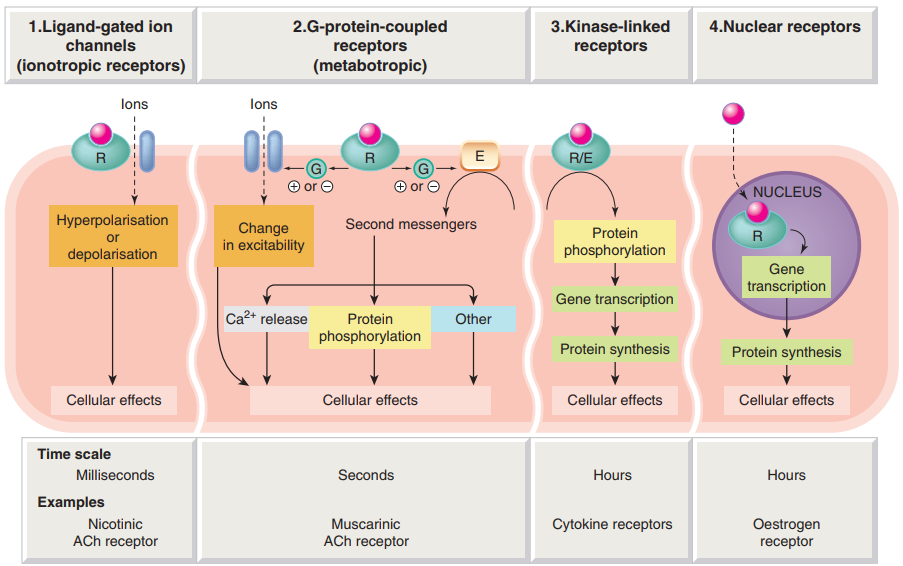 {left=18.63 top=2.96 width=81.37 height=90.68}

---

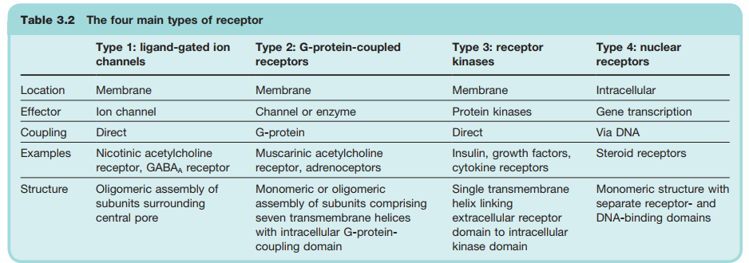 {left=18.07 top=0.00 width=74.50 height=46.60}

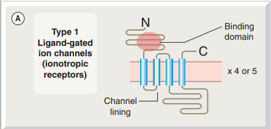 {left=20.83 top=46.12 width=30.17 height=25.55}

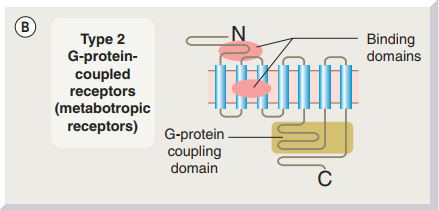 {left=61.14 top=45.91 width=30.53 height=25.96}

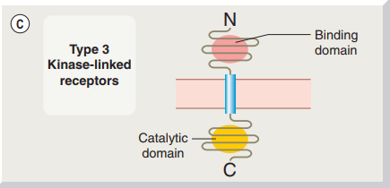 {left=20.83 top=74.10 width=30.17 height=25.90}

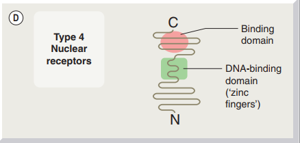 {left=61.14 top=74.10 width=30.53 height=25.90}

---

**Receptor signals are transduced inside the cell in one of three ways to initiate actions inside the cell:**

**1. **Exchange of GDP for GTP by GTP-binding proteins (G proteins) on the cytoplasmic side of the plasma membrane, which leads to generation of second messengers, including cAMP, phospholipid breakdown products, and Ca2+.
**2. **Receptor-mediated activation of phosphorylation cascades that in turn trigger activation of various enzymes. This is the action of the receptor tyrosine kinases. Protein kinases and protein phosphatases act as
effectors.
**3. **Conformation changes that open ion channels or recruit proteins into nuclear transcription complexes.

---

Ion Channels

Fastest receptor in the wild west

---

Control the flow of ions (Na⁺, K⁺, Ca²⁺, Cl⁻) across membranes → change membrane potential, trigger electrical or chemical responses.
Mediate synaptic transmission and neuronal excitability.
Targeted by many drugs (benzodiazepines, anesthetics, anticonvulsants).

**Types of Ion Channels**

**1. Ligand-Gated (Ionotropic)**
Opened directly by neurotransmitter binding (e.g., acetylcholine, GABA, glutamate).
Fast synaptic signaling.
Examples: nAChR, GABA_A, NMDA receptors.
**2. Voltage-Gated**
Activated by changes in membrane potential.
Drive action potentials and Ca²⁺ signaling.
Examples: Na⁺, K⁺, and Ca²⁺ channels in neurons and muscles.
**3. Metabotropic (Indirectly Gated)**
Controlled by GPCRs or other second-messenger cascades (cAMP, IP₃).
Slower but longer-lasting effects.
Examples: GABA_B receptor, muscarinic ACh receptor (M₂).

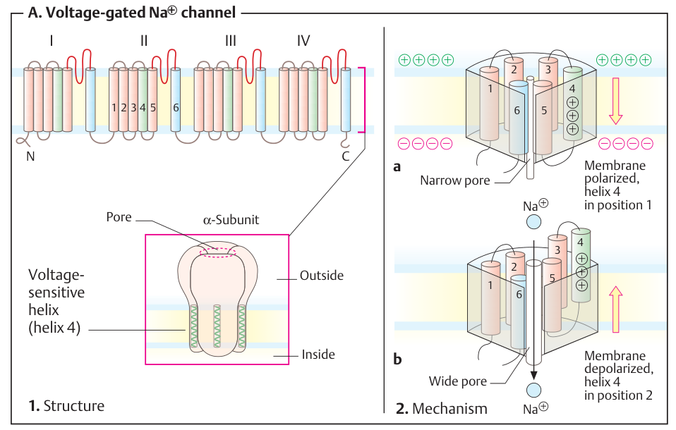 {left=64.28 top=0.00 width=35.72 height=40.43}

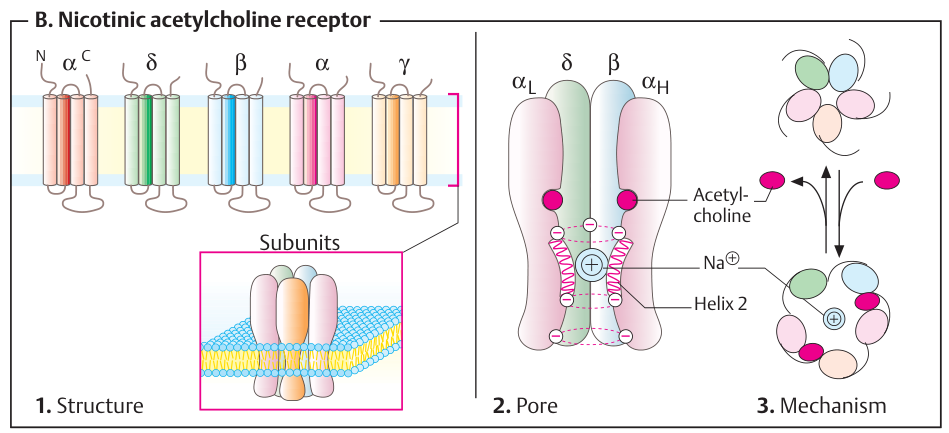 {left=59.65 top=61.21 width=40.35 height=32.73}

---

GPCRs

G-Protein coupled receptors

---

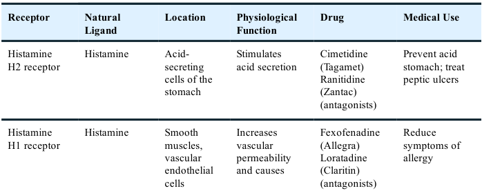 {left=55.75 top=0.00 width=44.25 height=31.55}

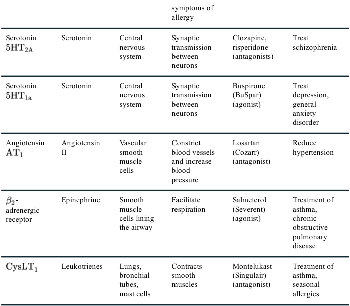 {left=55.75 top=31.55 width=44.25 height=68.85}

The human genome encodes about 800 functional GPCRs (4%) of the identified human proteins. 
detect and respond to many different types of signals, including odorants, tastants, neurotransmitters, hormones involved in glycogen and fat metabolism, growth factors, and even physical stimuli (photons of light). 
approximately 35% of all drugs used in humans are agonists or antagonists of GPCRs
at least 134 GPCRs are targets of drugs approved in the US and EU.

---

The heterotrimeric guanine nucleotide—binding proteins (G proteins) are signal transducers that communicate signals from many hormones, neurotransmitters, chemokines, and autocrine and paracrine factors. The extracellular signals are received by members of a large superfamily of receptors with seven membrane-spanning regions that activate the G proteins, which route the signals to several distinct intracellular signaling pathways. These pathways interact with one another to form a network that regulates metabolic enzymes, ion channels, transporters, and other components of the cellular machinery controlling a broad range of cellular processes, including transcription, motility, contractility, and secretion. These cellular processes in turn regulate systemic functions such as embryonic development, gonadal development, learning and memory, and organismal homeostasis

---

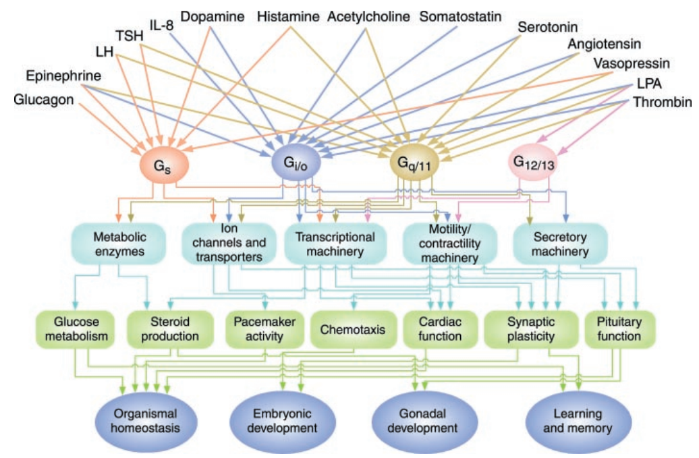 {left=19.26 top=0.00 width=80.74 height=94.07}

---

**All GPCR signal transduction pathways share the following common elements:**

a membrane-imbedded receptor that contains seven membrane-spanning α helices;
a heterotrimeric G protein, which functions as a receptor-activated switch by
cycling between an active GTP-bound and an inactive GDP-bound state;
A membrane-bound effector protein; and 
proteins that participate in amplification and desensitization of the signaling pathway. Protein kinases and second messengers such as cAMP and Ca2+ often participate in GPCR-mediated signal transduction pathways.

These pathways usually have short-term effects in the cell by quickly modifying the activities of existing proteins, including enzymes and ion channels. Thus these pathways allow cells to respond rapidly to a variety of signals, whether they be physical stimuli such as light or hormonal stimuli such as epinephrine.

---

All G protein–coupled receptors have the same orientation in the membrane and
contain seven transmembrane α-helical regions (H1–H7), four extracellular
segments, and four cytosolic segments

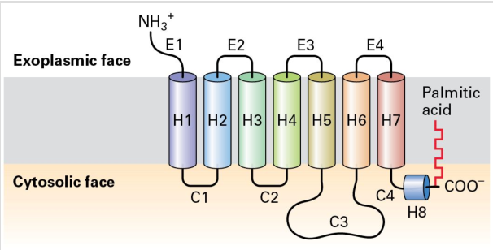 {left=44.62 top=26.01 width=53.10 height=47.98}

The human GPCRs are divided into several families. Members of each family are
especially similar to one another in amino acid sequence and structure. The
families differ from each other in the details of how ligands bind the receptors.

---

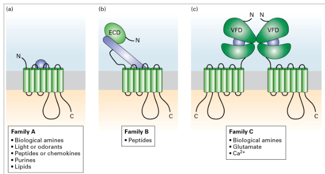 {left=16.22 top=15.87 width=82.79 height=78.81}

**Three principal classes of G protein–coupled receptors that bind their ligand in different ways.**

---

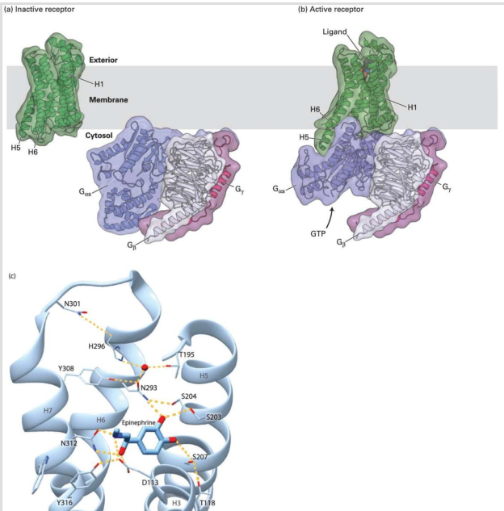 {left=15.96 top=0.00 width=55.45 height=100.00}

Family A is the largest family in mammals, segments of several membrane-embedded α helices and extracellular loops form the ligand-binding site. That site is exposed to the exoplasmic surface, but can extend down toward the middle of the membrane bilayer. 

Example: the β-adrenergic receptor, which bind hormones such as epinephrine and norepinephrine. As an example, in binding of epinephrine (adrenaline) to the β-adrenergic receptor, side chains of 15 amino acids located in four transmembrane α helices and the extracellular loop E2 make noncovalent bonds with the bound ligand.

---

The glucagon receptor is a member of family B of the GPCRs. Its ligand glucagon is a 29-amino-acid peptide hormone secreted by the α cells of the pancreatic islets; as we will see later in this chapter, it acts on the liver to trigger glycogen breakdown and secretion of glucose into the bloodstream. While the glucagon receptor has the seven transmembrane α helices characteristic of GPCRs, it also has a large exoplasmic domain that is connected to the first transmembrane α helix. This exoplasmic domain binds tightly to the C-terminus of glucagon, positioning glucagon’s N-terminus to bind to the pocket formed, as in β-adrenergic and other GPCRs, by residues from several transmembrane helices

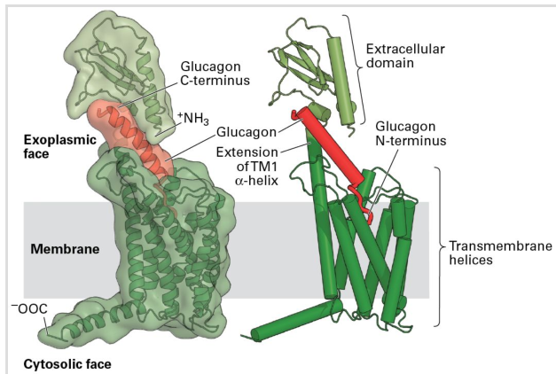 {left=31.44 top=0.00 width=51.86 height=62.05}

---

The glutamate receptor is an excitatory neurotransmitter receptor in family C of GPCRs. The long extracellular segment forms a sort of venus flytrap domain that clamps around and binds the glutamate ligand. Many members of this class of GPCRs dimerize through their venus flytrap domains.

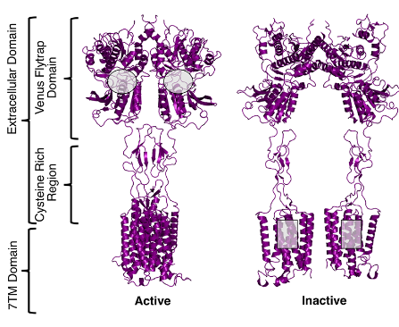 {left=53.44 top=0.00 width=46.56 height=67.78}

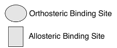 {left=61.59 top=67.78 width=30.26 height=22.21}

(Natural ligand binding)

---

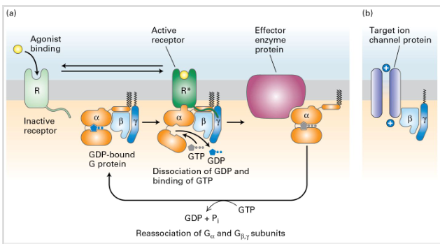 {left=33.94 top=0.00 width=50.00 height=49.32}

When unbound by ligand and in the inactive conformation (R), the receptor has no surface that is complementary to the G protein and thus cannot bind to it. The binding of the agonist induces major conformational changes and enables the receptor to bind to the subunit of the intact heterotrimeric G protein containing GDP.
Binding of the GPCR to the alpha subunit of G induces a change in the conformation of the GDP-binding site on Galpha, allowing a lobe of the protein to
move and thus release the GDP. Next because of its higher concentration in the
cytosol, GTP rapidly binds to the empty guanine nucleotide site in the subunit.

---

**GTP-Binding Proteins Are Frequently Used in Signal Transduction Pathways as On/Off Switches**

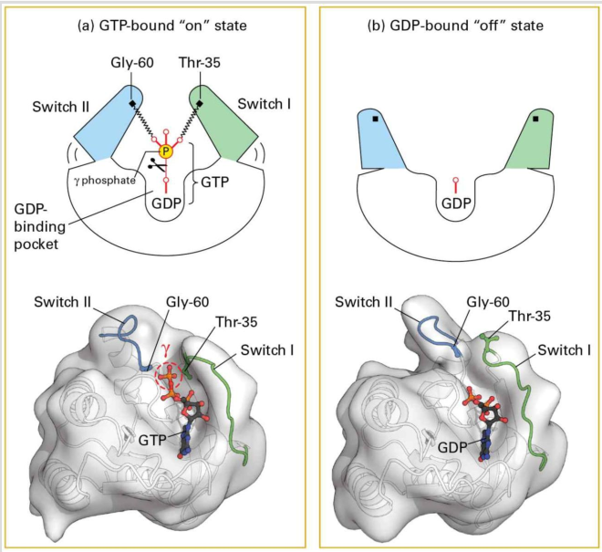 {left=54.74 top=20.32 width=45.26 height=73.76}

Heterotrimeric G proteins directly bind to and are activated by GPCRs that function as guanine nucleotide exchange factors (GEFs): trigger release of GDP, the G protein then
spontaneously binds GTP, favored by the high intracellular concentration
of GTP relative to that of GDP that induces conformational change involving  two highly conserved segments switch I and switch II, that allow the protein to bind to and activate downstream signaling proteins.

---

**Deactivation**

After a brief time, the active G protein is shut off, converting back to the inactive form. It has intrinsic GTPase activity and slowly hydrolyzes the bound GTP to GDP (seconds to minutes) and, thereby altering the conformation of the switch I and switch II segments so that they are unable to bind to the target protein.

The rate of GTP hydrolysis determines the length of time the GTP-binding protein remains in the active conformation and is able to signal its downstream target proteins

Monomeric (often called low-molecular-weight) G proteins, including Ras and various Ras-like proteins such as Ran and Sar, do not directly bind to receptors but act as intermediate proteins in signal transduction pathways. Monomeric G proteins play crucial roles in many pathways that regulate cell division and cell motility. For this reason, mutations in genes encoding these G proteins frequently lead to cancer.

---

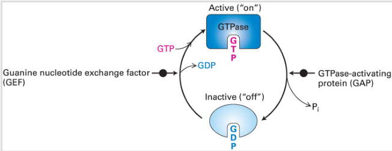 {left=24.50 top=0.00 width=67.92 height=46.67}

The rate of GTP hydrolysis  is often modulated by other proteins. For instance, both GTPase-activating proteins (GAPs) and regulators of G protein signaling (RGSs) accelerate GTP hydrolysis. 
Many regulators of G protein activity are themselves controlled by extracellular signals.
Toxin of Vibrio cholerae penetrates the plasma membrane of cells, such as those that line the small intestine, and catalyzes a chemical modification of Galpha preventing hydrolysis of GTP. Constant hyperactivation leads to the loss of electrolytes and water from these intestinal cells into the intestinal lumen

---

All effector proteins in GPCR signal transduction pathways are either membrane-bound ion channels or membrane-bound enzymes that catalyze the formation of one or more of the second messengers.
Humans have 21 different alpha subunits, 6 beta subunits, and 12 gamma subunits.
The 21 alpha subunits are encoded by 16 genes, several of which undergo alternative splicing. So far as is known, the different beta-gamma subunits are interchangeable, while the different alpha subunits provide specificity to the various G proteins.
GPCRs represent the largest protein family in the human genome- approximately 800 genese.
400 GPCR genes are thought to encode sensory receptors; of these, the majority are in the olfactory system and bind odorants.

**Different G Proteins Are Activated by Different GPCRs and in Turn Regulate Different Effector Proteins**

---

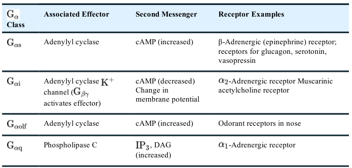 {left=21.17 top=7.87 width=72.71 height=61.85}

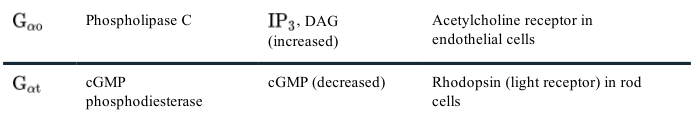 {left=21.53 top=69.72 width=71.98 height=22.41}

---

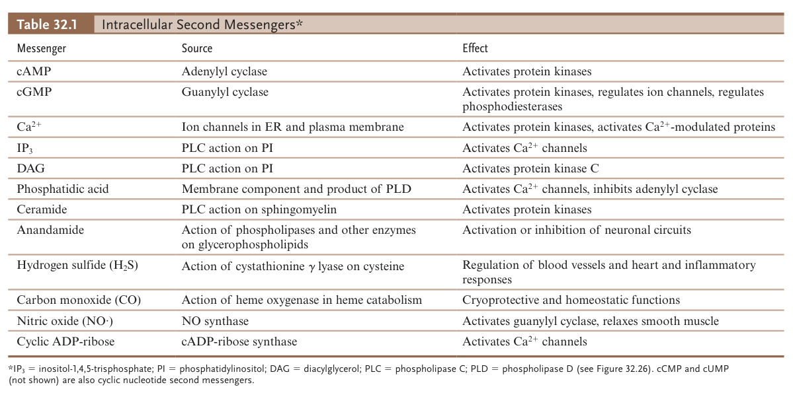 {left=33.10 top=40.60 width=67.15 height=59.24}

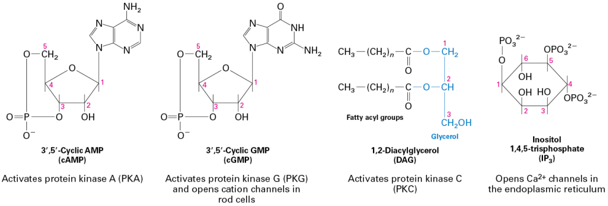 {left=33.10 top=0.00 width=67.15 height=40.60}

Formulae for four common compounds that often function as intracellular second messengers and a more extended table

---

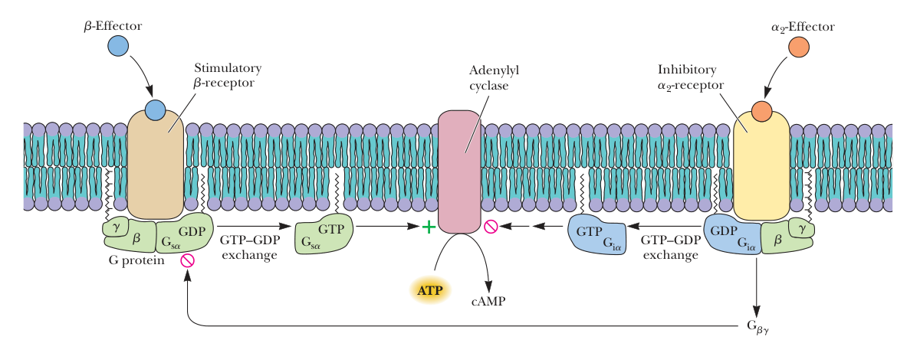 {left=19.37 top=0.00 width=80.63 height=53.80}

Adenylyl cyclase activity is modulated by the interplay of stimulatory (Gs) and inhibitory (Gi) G proteins. Binding of hormones to b1- and b2-adrenergic receptors activates adenylyl cyclase via Gs, whereas hormone binding to a2-adrenergic receptors leads to the inhibition of adenylyl cyclase. Inhibition may occur by direct inhibition of cyclase activity by Gia or by binding of Gibg to Gsa.

---

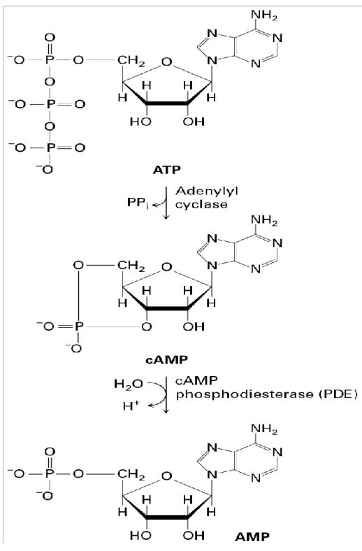 {left=68.68 top=2.96 width=31.32 height=84.72}

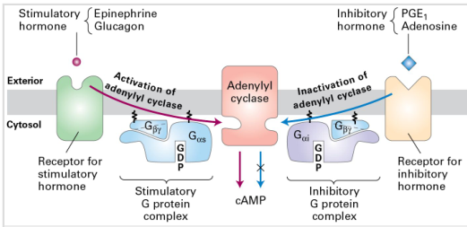 {left=16.80 top=2.96 width=51.87 height=44.78}

Regulation of adenylyl cyclase activity, which occurs in many cell types, provides fine-tuned control of the cAMP level and thus of the downstream cellular response.
Virtually all of the diverse effects of cAMP are mediated through its activation of protein kinase A (PKA). This protein kinase phosphorylates multiple intracellular target proteins expressed in different cell types.

---

Inactive PKA is a tetramer consisting of two regulatory (R) subunits and two catalytic (C) subunits. Each of the two R subunits in an R2 dimer has two cAMP-binding domains, called CNB-A and CNB-B, as well as a linker domain of unknown structure. At the C-terminus there is a dimerization domain that binds an AKAP protein. A segment of the CNB-A domain of the R subunit is a pseudosubstrate; its sequence resembles that of a peptide substrate and binds to the active site in the catalytic domain but is not phosphorylated. In the absence of cAMP the pseudosubstrate segment binds to this catalytic site and inhibits its activity.

Binding of cAMP to the CNB-A domain causes a change in its conformation so that it can no longer bind to and inhibit the catalytic subunit; this releases the C subunit, instantly activating its kinase activity.

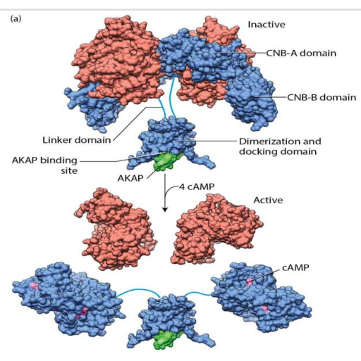 {left=62.31 top=0.00 width=37.69 height=67.13}

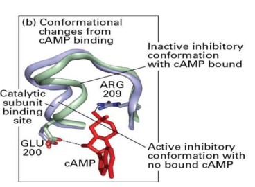 {left=74.33 top=65.24 width=25.67 height=33.48}

Two R-subunits - pink

Two C-subunits - blue

---

**Example: Regulation of glycogen metabolism by cAMP and PKA**

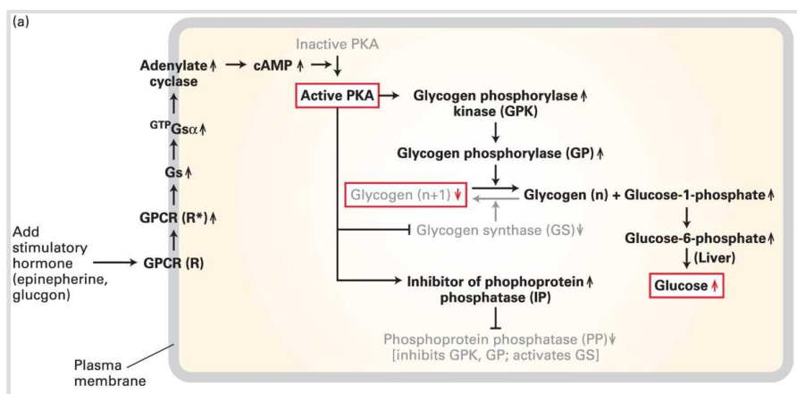 {left=51.49 top=14.14 width=48.51 height=42.63}

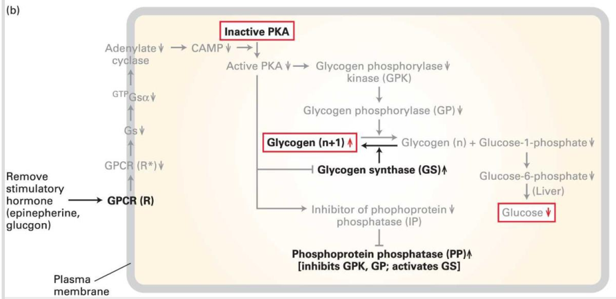 {left=51.49 top=58.09 width=48.51 height=41.91}

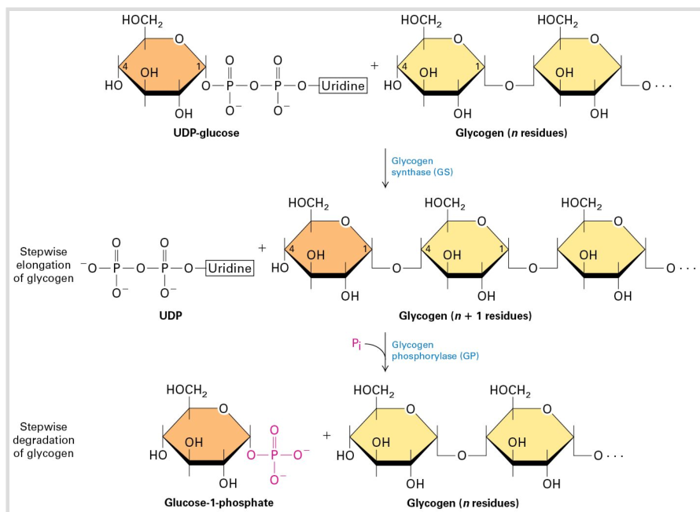 {left=16.32 top=7.32 width=33.76 height=43.96}

**(a)** An increase in cytosolic cAMP activates PKA, which phosphorylates glycogen synthase (GS), inhibiting its catalytic activity to synthesize glycogen. Active PKA also promotes glycogen degradation via a protein kinase cascade that activates glycogen phosphorylase. At high cAMP concentrations, PKA also phosphorylates an inhibitor of phosphoprotein phosphatase (PP). Binding of thephosphorylated inhibitor to PP prevents this phosphatase from de-phosphorylating the
activated enzymes in the glycogen phosphorylase kinase cascade or the inactive glycogen synthase. 
**(b)** A decrease in cAMP inactivates PKA, leading to release of the active form of PP. The activation of PP promotes glycogen synthesis and inhibits glycogen degradation.

---

**Signal Amplification Occurs in the cAMP-PKA Glycogen Degradation Pathway**

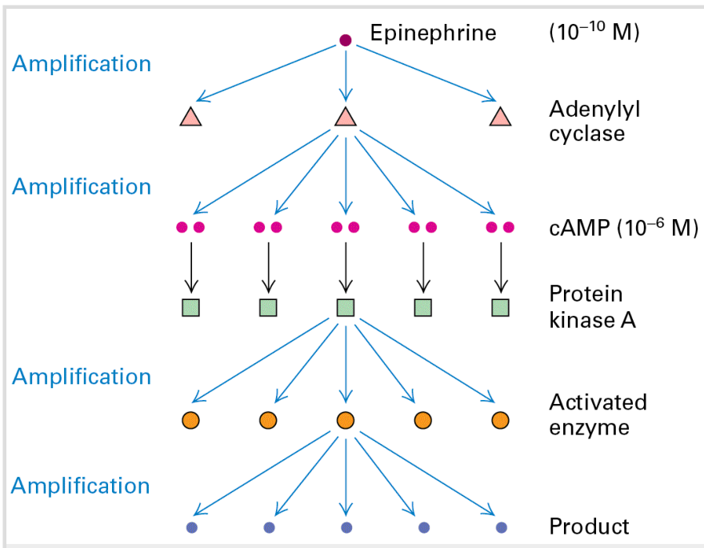 {left=50.00 top=17.11 width=50.00 height=69.19}

Amplification up to 108 can be achieved.

PKA always phosphorylates a serine or threonine residue that is located within the common sequence motif: X-Arg-(Arg/Lys)-X-(<u>Ser/Thr</u>)-Φ, where X denotes any amino acid and Φ denotes a hydrophobic amino acid. The Ser or Thr whose side chain is phosphorylated is underlined. Thus many potential protein targets of PKA can be identified simply by analyzing their amino acid sequence.

---

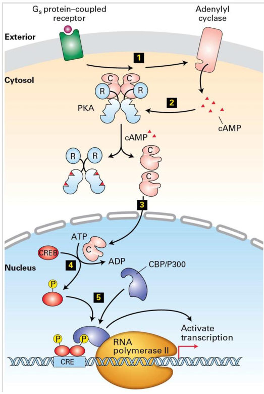 {left=64.47 top=2.96 width=35.53 height=94.07}

**CREB Links cAMP and PKA to**
**Activation of Gene Transcription**

Following the elevation of cAMP levels and the release of active PKA catalytic subunits, some of the catalytic subunits move into the nucleus. There they phosphorylate serine-133 on a transcription factor called CRE-binding (CREB) protein. CRE = AMP-response element, which
contains the highly conserved nucleotide sequence, 5’-TGACGTCA-3’. 

Phosphorylated CREB binds to CRE-containing target genes and also binds to the co-activator termed CBP/P300. CBP/P300 links CREB to RNA polymerase II and other gene regulatory proteins, thereby stimulating gene transcription.

---

**Anchoring Proteins Localize Effects of cAMP to Specific Regions of the Cell**

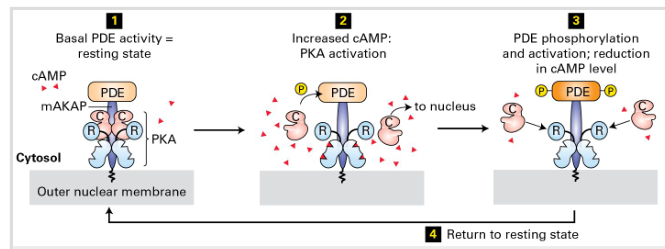 {left=19.19 top=14.08 width=69.27 height=46.11}

Each of the roughly 50 anchoring proteins, referred to as A kinase–associated proteins (AKAPs), has a two-domain structure: one domain confers a specific subcellular location by binding to a protein found only in a specific subcompartment, and the other binds to the regulatory (R) subunit of PKA. AKAPs regulate cAMP and PKA signaling within the cell both spatially and temporally. One AKAP in heart muscle anchors PKA to the outer nuclear membrane. From this location, the released, catalytically active C subunits readily enter the nucleus, where they phosphorylate and activate the CREB transcription factor

---

**Multiple Feedback Mechanisms Suppress Signaling by the GPCR/cAMP/PKA Pathway**

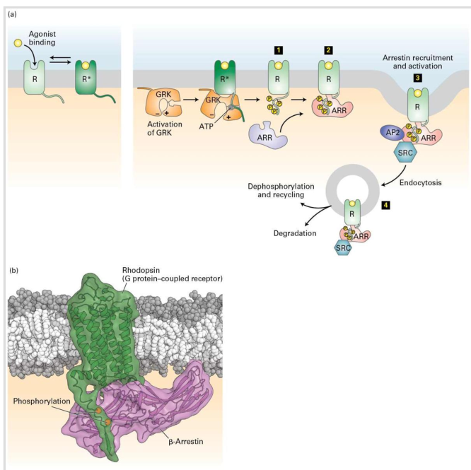 {left=16.07 top=19.60 width=43.79 height=77.73}

G-proteins self turn-off
PDE hydrolyzes cAMP.
 PKA phosphorylates several serine and threonine residues typically in the third cytoplasmic loop or the C-terminal of receptor, so it can not bind Gs.
Other similar receptors can be phosphorylated - **heterologous desensitization**
Also exists **homologous ****desensitization**

A G-protein–coupled receptor kinase (GRK) phosphorylates serine and threonine residues in the cytoplasmic segments of activated G protein–coupled receptors (GPCRs), those that have bound agonists (step 1 ). β-Arrestin (Arr) then binds to these phosphorylated receptors

---

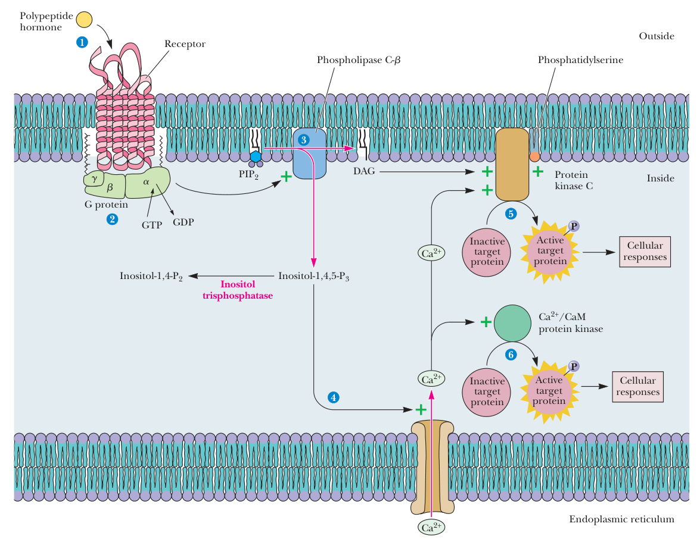 {left=50.00 top=0.00 width=50.00 height=68.54}

IP3-mediated signal transduction pathways. Increased [Ca2+] activates protein kinases, which phosphorylate target proteins. Ca2+/CaM represents calcium-calmodulin (Ca2+ complexed with the regulatory protein calmodulin).

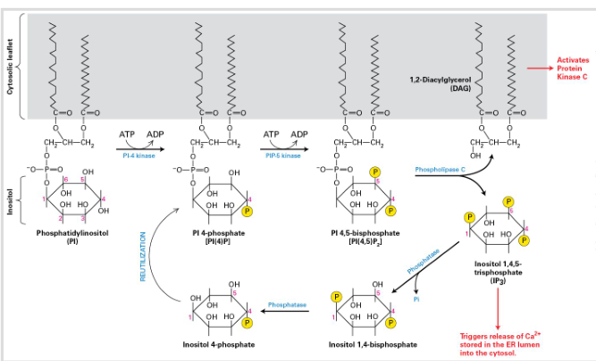 {left=15.00 top=0.00 width=36.01 height=38.77}

---

**Example: Ca****2+**** activates calmodulin**

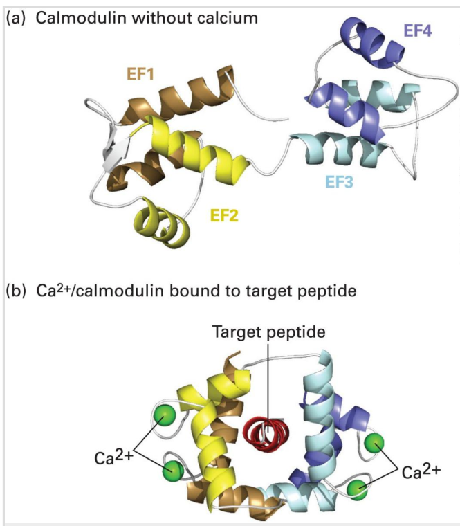 {left=60.25 top=14.74 width=39.05 height=79.33}

Calmodulin is a widely distributed cytosolic protein that contains four
-binding sites, one in each of its EF hand (helix-loop-helix) motifs. At
Cytosolic concentrations about 5x10-7 M, binding of Ca2+ to calmodulin changes the protein’s conformation
to one in which hydrophobic side chains become more exposed to solvent. The resulting Ca/calmodulin complex can wrap around exposed helices with specialized sequences in
various target proteins, thereby altering their activities.

---

RTK

Receptor Tyrosine Kinases

---

The extracellular signaling molecules that activate receptor tyrosine kinases (RTKs) constitute a large class of soluble and membrane-bound protein hormones, including many that were initially identified because they stimulate the growth of specific types of cells (hence the name growth factor). 
Examples:
nerve growth factor (NGF),
platelet-derived growth factor (PDGF), 
fibroblast growth factor (FGF),
epidermal growth factor (EGF)
Others, such as insulin, regulate expression of multiple genes that control sugar and lipid metabolism in liver, muscle, and adipose cells. The large family of ephrins play critical roles in regulating the migration of many nerve cell axons to their target destinations. Many RTKs and their ligands were first identified in studies of human cancers, in which mutant forms of growth-factor receptors
stimulate cell proliferation even in the absence of the growth-factor ligand. The mutation locks the receptor conformation in a state such that the kinase is permanently active. Other RTKs were uncovered during analysis of developmental mutations that lead to blocks in differentiation of specific cell types in Caenorhabditis elegans, Drosophila, and mice.

---

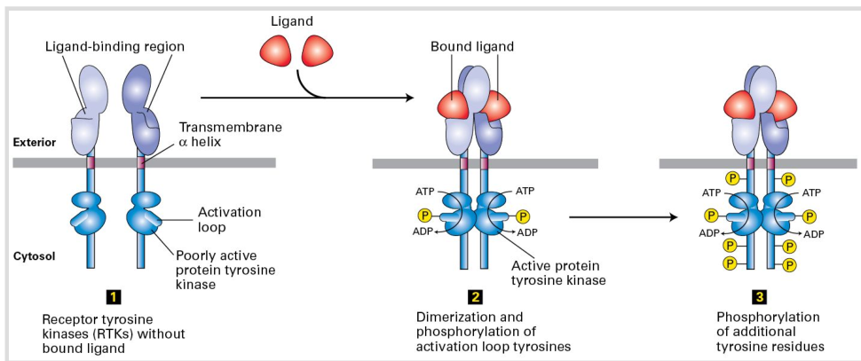 {left=25.59 top=-0.00 width=73.57 height=54.88}

Most RTKs are monomeric, and ligand binding to the extracellular domain induces two monomers to join together as a dimer.
The cytosolic kinase domain of an RTK contains a flexible domain termed the activation loop. In the resting state, the activation loop is not phosphorylated and assumes a conformation that blocks kinase activity.
For most, but not all, RTKs, the weakly active kinase in each subunit is thought to phosphorylate a key tyrosine residue in the activation loop of the other subunit.
The strongly active kinase then phosphorylates additional tyrosine residues in the cytosolic domain of the receptor

---

**Some RTKs can be pre-dimerized (connected with disulphide bonds). Example: insulin receptor**

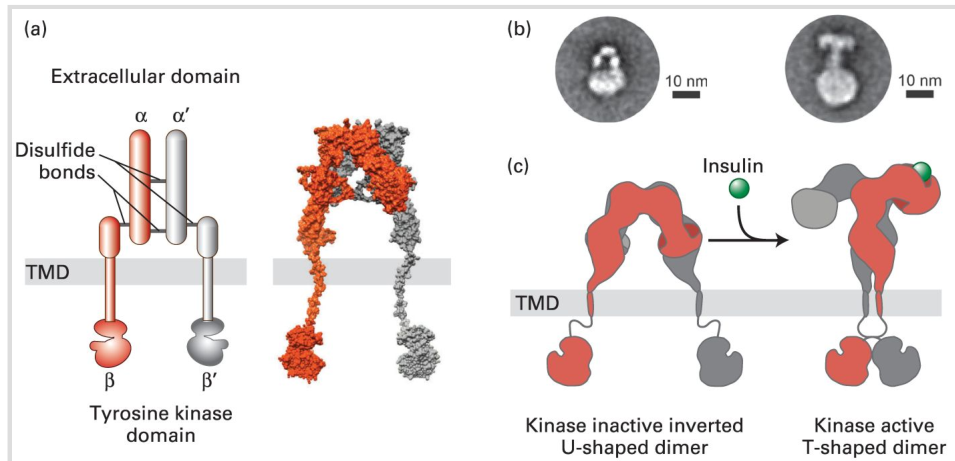 {left=18.13 top=21.56 width=81.03 height=69.54}

---

**Some RTK for asymmetric dimers. Example: EGF (HER).**

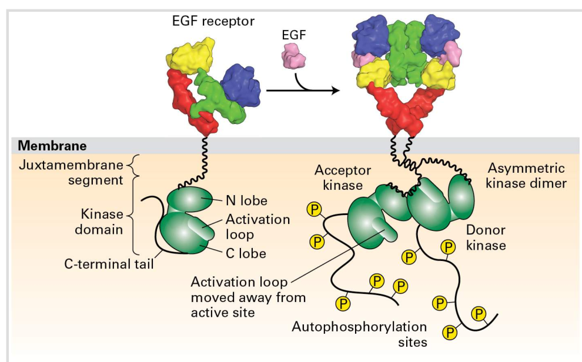 {left=33.32 top=18.53 width=66.68 height=73.76}

EGF = Epidermal Growth Factor

HER = Human Epidermal growth factor Receptor

---

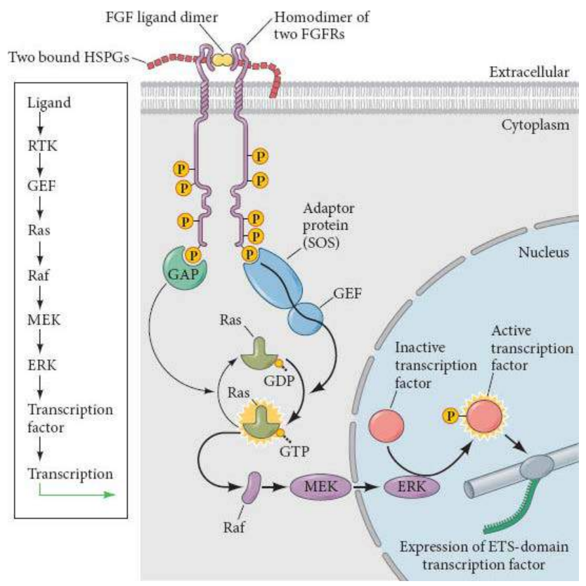 {left=15.35 top=13.35 width=47.35 height=84.18}

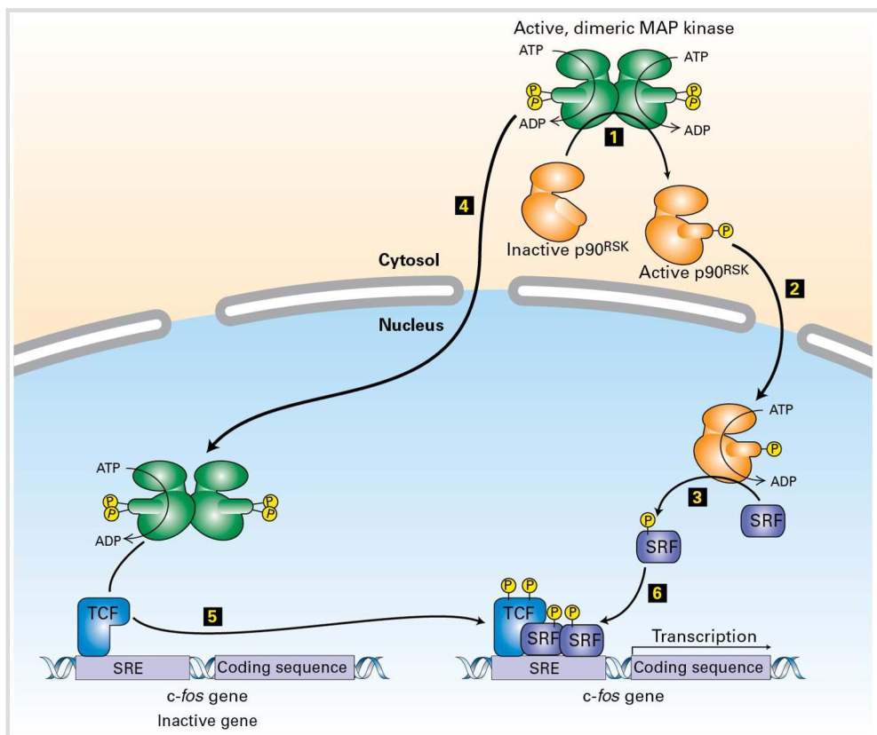 {left=63.06 top=13.35 width=36.94 height=55.10}

SRF (serum response factor), TCF (ternary complex factor) - transcription factors,
SRE-sequence - serum response element

**Ras/MAP kinase pathway**

---

**Scaffold Proteins Isolate Distinct MAP Kinase Pathways in the Same Cell from One Another**

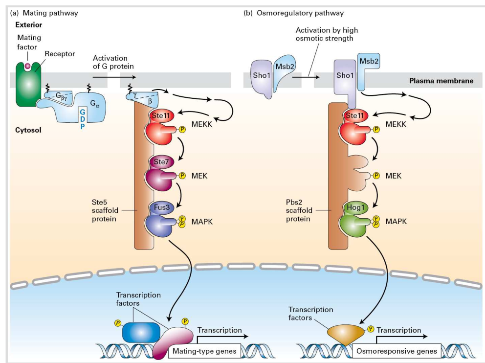 {left=41.89 top=22.98 width=55.47 height=73.76}

Scaffold proteins prevent Ste11 from phosphorylating the wrong MEK kinase. The scaffold protein Ste5, employed in the mating pathway, has no obvious catalytic function but stabilizes a large complex that includes the MEKK kinase Ste11, the MEK kinase Ste7, and the MAP kinase Fus3 in the mating signal transduction pathway.

---

**Phosphoinositide Signal Transduction Pathways**

RTK activation → autophosphorylation of tyrosine residues on the cytosolic domain.
Phosphorylated RTK recruits phospholipase C-γ (PLCγ) via SH2 domains.
PLCγ is activated by phosphorylation → cleaves PIP₂ (phosphatidylinositol 4,5-bisphosphate) in the plasma membrane.
PIP₂ → IP₃ (inositol 1,4,5-trisphosphate) + DAG (diacylglycerol).
IP₃ diffuses to the ER → releases Ca²⁺ into the cytosol.
DAG remains in the membrane → together with Ca²⁺, activates Protein Kinase C (PKC).
PKC phosphorylates various target proteins → modulates metabolism, gene expression, and cell growth.
Terminated by dephosphorylation of IP₃ and reconversion of DAG to PIP₂.

---

**Phosphoinositide Pathway via PI3K–Akt (PKB)**

RTK activation → recruits and activates phosphoinositide 3-kinase (PI3K).
PI3K phosphorylates PI(4)P → PI(3,4)P in the plasma membrane, PI(3,4,5)P can be formed (PI-5 kinase).
PI(3,4)P serves as a docking site for Akt (PKB) and PDK1 via their PH domains.
PDK1 + mTORC2 phosphorylate and fully activate Akt.
Activated Akt (PKB) phosphorylates many targets controlling:
- Cell survival (inhibits apoptosis via Bad phosphorylation),
- Cell growth (via mTOR pathway),
- Metabolism (stimulates glucose uptake and glycogen synthesis).
Signal is terminated by PTEN, which dephosphorylates PIP₃ → PIP₂.

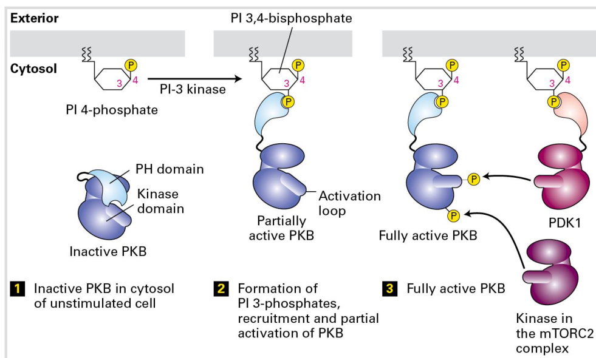 {left=49.03 top=-0.00 width=50.97 height=54.50}

The PTEN gene is deleted in multiple types of advanced human cancers

---

**JAK/STAT Signal Transduction Pathway**

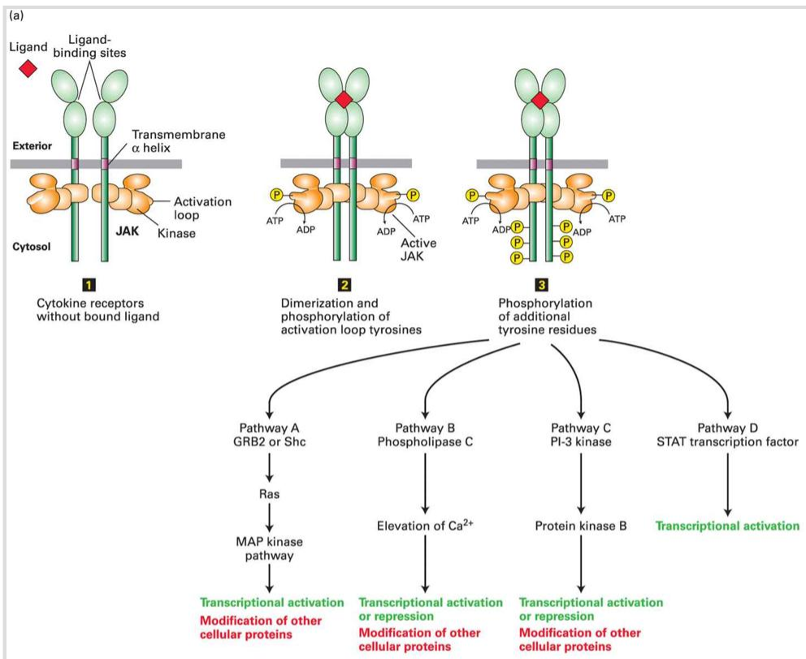 {left=63.87 top=0.00 width=36.13 height=52.57}

Ligand binding (e.g. cytokine, growth hormone) → Receptor dimerization
Janus kinases (JAKs) bound to receptor tails cross-phosphorylate each other
Activated JAKs phosphorylate tyrosine residues on the receptor’s cytoplasmic domain
STAT proteins bind these phosphotyrosines via SH2 domains
JAKs phosphorylate STATs, enabling their dimerization (via SH2–pTyr)
STAT dimers translocate to the nucleus, bind DNA, and regulate gene expression
Negative regulation via SOCS ( suppressors of cytokine signaling) proteins and phosphatases (feedback inhibition)

Rapid and direct signaling — no second messengers
Typical in immune and hematopoietic signaling
Persistent activation linked to inflammatory and oncogenic pathways

---

**Activation and structure of STAT proteins.**

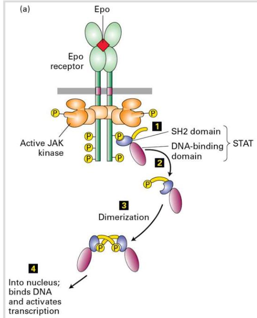 {left=16.07 top=23.57 width=33.47 height=73.76}

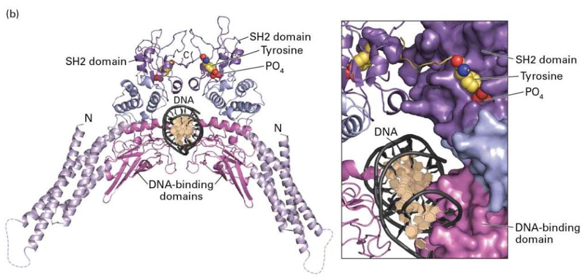 {left=50.00 top=57.81 width=47.13 height=39.52}

STAT1 bound to DNA

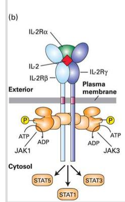 {left=79.05 top=0.00 width=20.15 height=57.81}

---

**Two mechanisms for terminating cytokine signal transduction, as exemplified by the erythropoietin receptor (EpoR).**

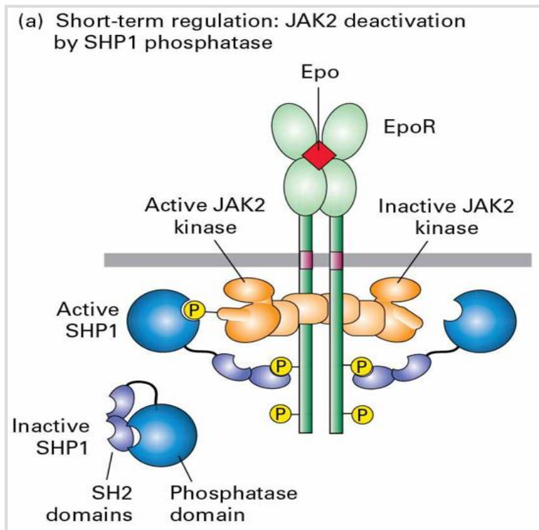 {left=16.07 top=24.17 width=34.73 height=60.77}

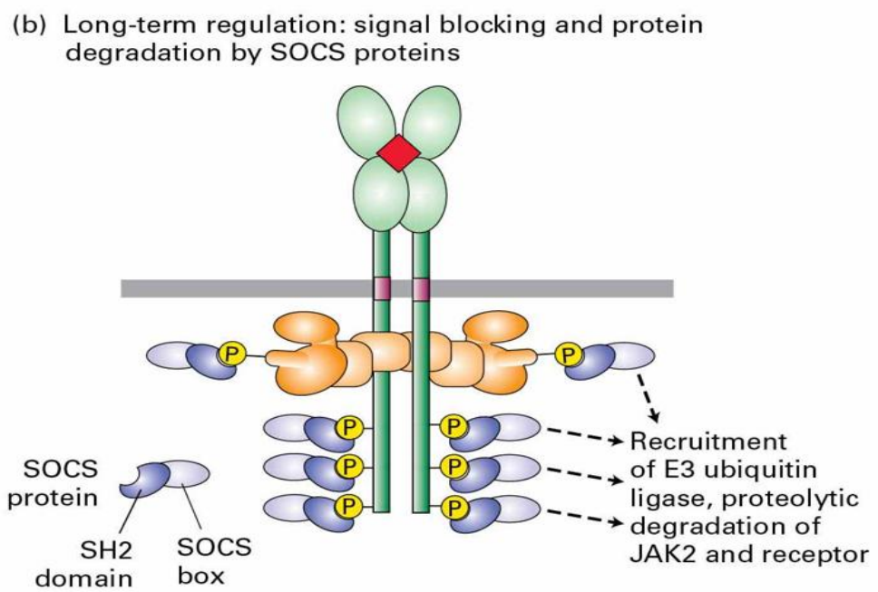 {left=50.80 top=23.28 width=47.54 height=57.01}

---

Other Pathways

Some of the other known pathways

---

**TGF-β / Smad Signal Transduction Pathway**

TGF-β ligand binds a Type II receptor serine/threonine kinase
Type II receptor phosphorylates and activates a Type I receptor
Activated Type I receptor phosphorylates receptor-regulated Smads (R-Smads) — typically Smad2 and Smad3
R-Smads form a complex with Smad4 (co-Smad)
The Smad complex translocates to the nucleus
In the nucleus, Smads bind DNA and transcriptional co-activators/repressors→ regulation of cell growth, differentiation, and ECM production
Inhibitory Smads (Smad6/7) provide negative feedback by blocking receptor activity

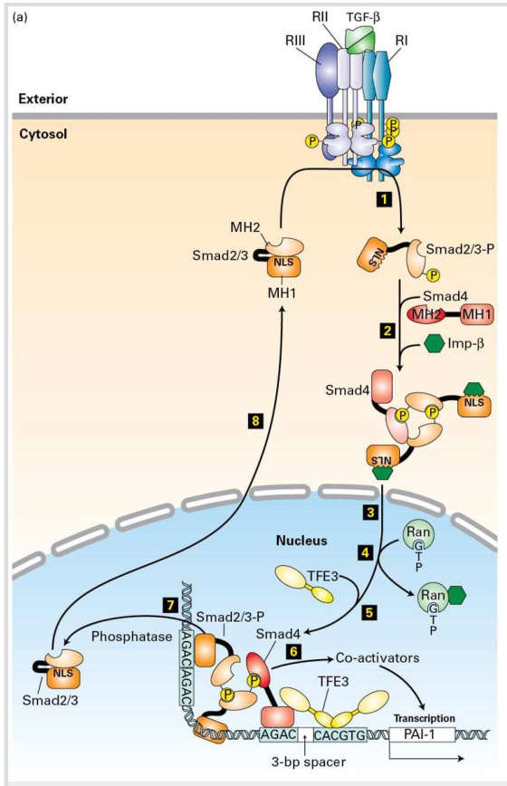 {left=63.71 top=-0.00 width=36.29 height=100.00}

---

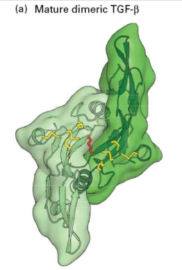 {left=43.43 top=0.00 width=14.63 height=38.43}

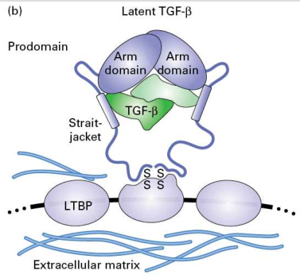 {left=58.96 top=-0.00 width=23.28 height=38.43}

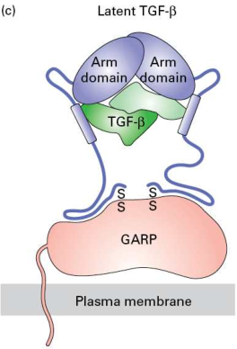 {left=82.24 top=0.00 width=17.76 height=46.39}

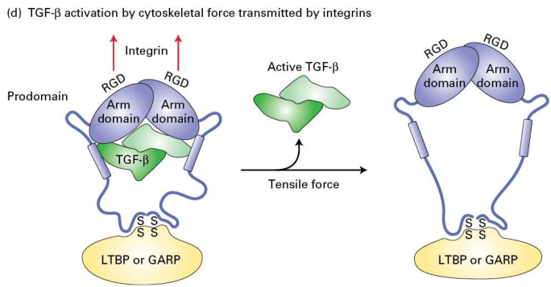 {left=43.43 top=47.51 width=56.57 height=52.49}

TGF-β is released as a complex with LAP (Latency-Associated Peptide) and often tethered to the extracellular matrix via LTBP (Latent TGF-β Binding Protein).
The latent complex must be mechanically or proteolytically “unlocked” before TGF-β can bind its receptor.
**Mechanisms of activation:**
Integrins (αvβ6, αvβ8) apply mechanical force to LAP.
Proteases (MMPs, plasmin) or acidic pH cleave LAP.
Occasionally ROS or other local factors contribute.
**Physiological relevance:**
This tight, localized activation prevents unwanted effects such as fibrosis, immune suppression, or excessive growth inhibition.

---

**Notch/Delta Signaling Pathway**

**Contact-dependent signaling:** Both Notch receptor and Delta (or Jagged) ligand are membrane proteins — signaling occurs only between adjacent cells.
**Ligand binding and cleavage:** When Delta binds Notch, the receptor’s extracellular domain is cleaved by ADAM protease, then further cut by γ-secretase.
**Release of Notch intracellular domain (NICD):** The NICD fragment enters the nucleus.
**Transcriptional activation:** NICD binds the CSL (CBF1/Su(H)/Lag-1) transcription factor, converting it from a repressor to an activator. → Induces genes controlling cell differentiation, proliferation, and apoptosis.

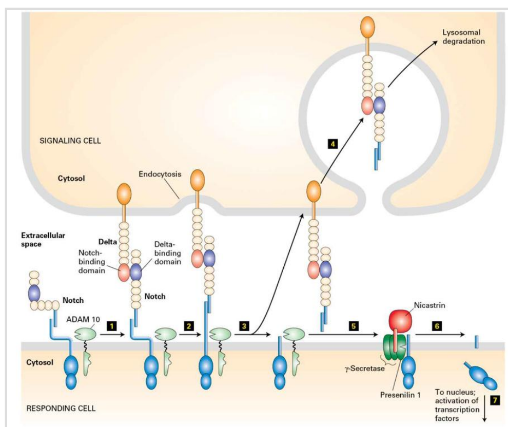 {left=62.81 top=-0.00 width=36.35 height=54.31}

**Biological significance:**
Determines cell fate decisions (e.g. lateral inhibition in neurogenesis).
Involved in stem-cell maintenance and tissue patterning.
Dysregulation linked to cancer and developmental disorders.

---

**Wnt/β-Catenin Signaling Pathway**

**Ligand and receptor: **Wnt proteins (secreted glycoproteins) bind to Frizzled (Fz) receptors and LRP5/6 co-receptors on the cell surface.

**Without Wnt: **β-catenin is continuously degraded by the “destruction complex” (Axin, APC, GSK3β, CK1). → Low cytosolic β-catenin → Target genes repressed by TCF/LEF.

**With Wnt: **Binding of Wnt to Fz/LRP inactivates the destruction complex via Dishevelled (Dsh) activation.→ β-catenin accumulates and enters the nucleus.

**Nuclear action: **β-catenin binds TCF/LEF transcription factors, converting them from repressors to activators of gene expression. → Induces genes controlling cell proliferation, differentiation, and fate determination.

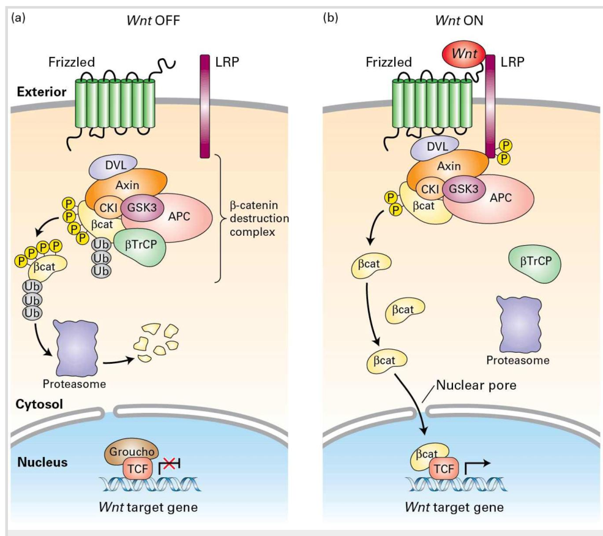 {left=53.30 top=26.24 width=46.71 height=73.76}

Essential for embryonic patterning and stem cell renewal.
Dysregulated Wnt signaling → cancer (e.g., colon carcinoma), fibrosis, and developmental defects.

---

**Hedgehog (Hh) Signaling Pathway**

**Ligand and receptors: **Hedgehog (Hh) family ligands — Sonic (Shh), Indian (Ihh), Desert (Dhh) — bind to the Patched (PTCH) receptor on the cell membrane.
**Without Hh: **PTCH inhibits Smoothened (SMO), a GPCR-like protein. GLI transcription factors (GLI2/3) are phosphorylated and processed into repressors (GLI-R).→ Target genes remain silent.
**With Hh present: **Hh binding relieves PTCH inhibition on SMO. Activated SMO initiates signaling that prevents GLI cleavage. Full-length GLI activators (GLI-A) accumulate and enter the nucleus.→ Transcription of Hh-responsive genes (e.g., involved in proliferation and patterning).

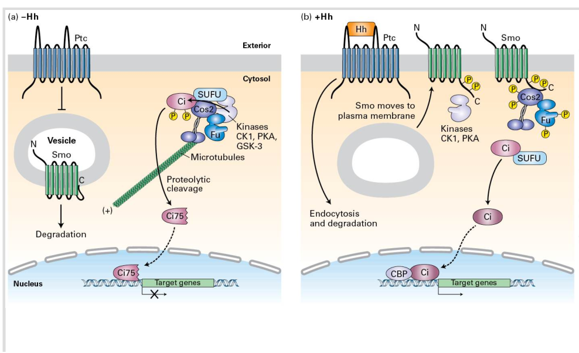 {left=51.13 top=-0.00 width=48.87 height=53.03}

Critical for embryonic patterning, neural tube, and limb development.
Aberrant activation → cancers (basal cell carcinoma, medulloblastoma).

---

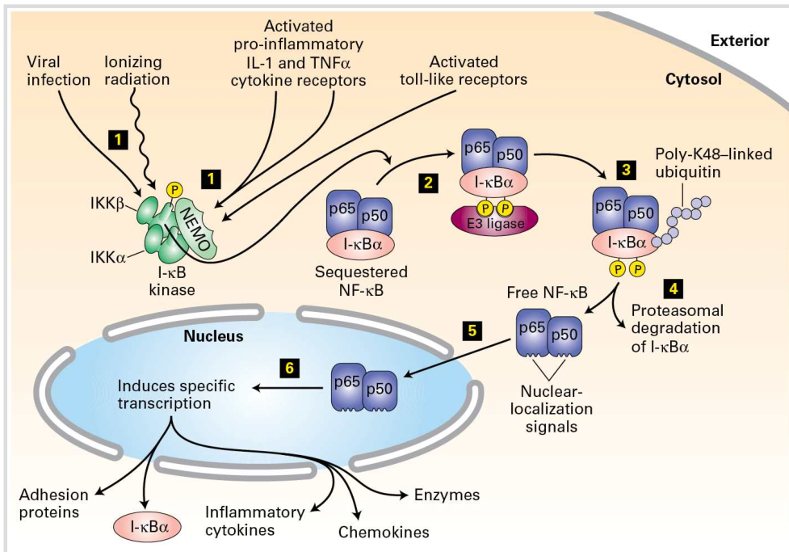 {left=58.77 top=0.00 width=40.23 height=50.00}

**NF-κB signaling pathway**

**Inactive state: **NF-κB is bound to IκB, sequestered in the cytoplasm → no transcription
**Activation:** Triggered by cytokines (TNF-α, IL-1), pathogen signals (via TLRs), or stress. IKK complex phosphorylates IκB, marking it for ubiquitination and degradation. Freed NF-κB translocates to the nucleus.
**Nuclear action: **NF-κB binds DNA and activates target genes for inflammation (e.g., cytokines, COX-2), cell survival (anti-apoptotic genes), immune responses.
**Termination / feedback: **NF-κB induces IκB gene transcription, which re-inhibits NF-κB → negative feedback loop

NF-κB

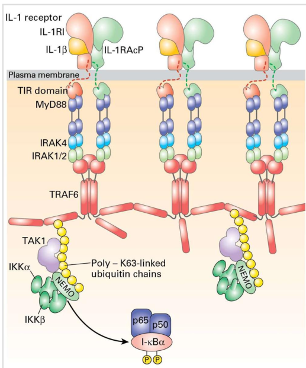 {left=35.35 top=-0.00 width=23.42 height=50.00}

Central in immune and inflammatory responses
Chronic activation linked to autoimmune disease and cancer

---

**Interactions between Pathways**

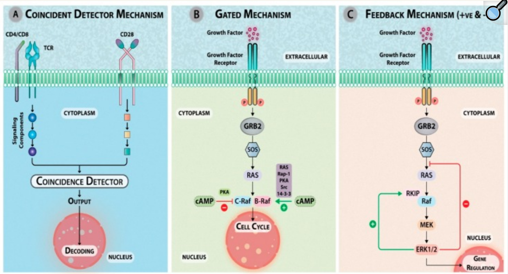 {left=15.09 top=15.39 width=84.12 height=80.99}

---

**Signalosomes **are large supramolecular protein complexes that undergo clustering (oligomerisation or polymerisation) and/or colloidal phase separation to form biomolecular condensates that increase the local concentration and signalling activity of the individual components. They are an example of molecular self-assembly and self-organisation in cell biology.

**Wnt signalosome:** Transduction of Wnt signals from the plasma membrane depends on clustering of LRP6 receptors with Dishevelled (Dvl) proteins to recruit the Axin complex for inactivation.

**B-cell receptor (BCR) signalosome:** The B-cell receptor (BCR) binds antigen and undergoes clustering to induce signal transduction.

**T-cell receptor (TCR) signalosome:** Antigen presentation to T-cells is recognised by the T-cell receptor (TCR), which initiates clustering and activation of downstream signalling to induce T-cell responses.

**COP9 signalosome:** Catalyses the hydrolysis of NEDD8 protein from the Cullin subunit of Cullin-RING ubiquitin ligases (CRL). Therefore, it is responsible for CRL deneddylation – at the same time, it is able to bind deneddylated cullin-RING complex and retain them in deactivated form. COP9 signalosome thus serves as a sole deactivator of CRLs.

**RIP1/RIP3 Necrosome:** A signalling complex involved in necrotic cell death.

**Inflammasomes:** The AIM2 and NLRP3 inflammasomes are filamentous assemblies that elicit host defense inside cells by activating caspase-1 for cytokine maturation and cell death.

---

Hormones

Applying knowledge to medicine

---

**Hormone **is a substance that is synthesized by one type of cells and transported through blood to act on another type of cells.

**Classes:**
I. Hormones with cell surface receptors
II. Hormones with intracellular receptors

**Another way to classify:**
Hypothalamic & Pituitary Hormones
Steroid Hormones
Thyroid Hormones
Catecholamines
Eicosanoids

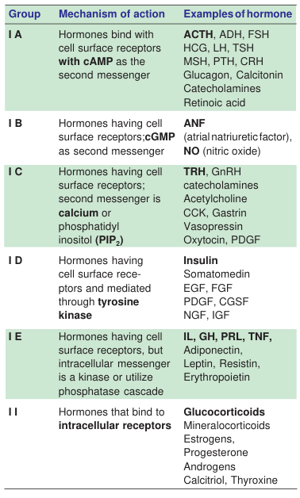 {left=68.15 top=0.00 width=31.85 height=94.07}

---

**Hypothalamic and Pituitary Hormones**

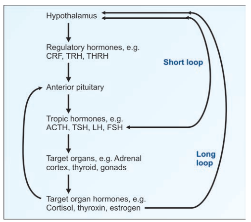 {left=16.07 top=44.67 width=35.07 height=55.33}

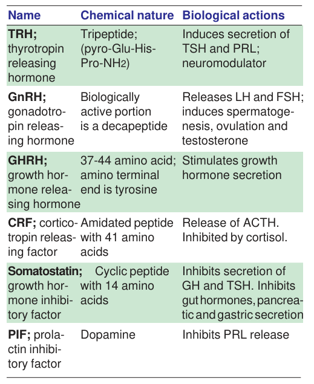 {left=75.44 top=44.20 width=25.44 height=55.33}

Major hypothalamic releasing factors

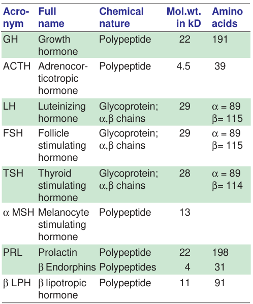 {left=50.00 top=45.14 width=25.44 height=54.40}

Hormones of anterior pituitary

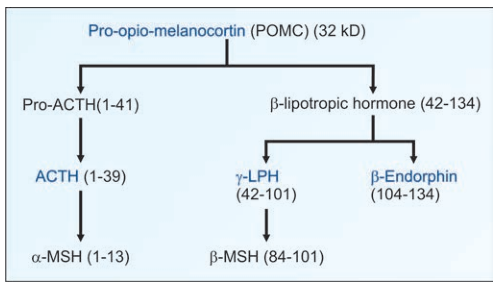 {left=62.62 top=0.00 width=37.38 height=37.62}

Cleavage of POMC

The hypothalamus produces two types of endocrine factors; 
(a) the hypothalamic neuropeptides (oxytocin and vasopressin/ADH)
(b) the hypothalamic releasing factors

---

**Place of Synthesis:**
**Hypothalamic**: TRH, GnRH, CRH, GHRH, somatostatin, dopamine (neurotransmitter-like).
**Pituitary (Anterior):** GH, TSH, ACTH, LH, FSH, prolactin.
**Pituitary (Posterior):** Vasopressin (ADH), oxytocin.
Central regulators of endocrine homeostasis — “master controllers.”
Act through specific target glands (thyroid, adrenal, gonads).
Mostly peptide hormones, short half-life, require receptor-mediated signaling.
Clinical relevance:
GH deficiency/excess: dwarfism vs. acromegaly.
ACTH: excess → Cushing’s disease; deficiency → adrenal insufficiency.
ADH deficiency: diabetes insipidus; analog desmopressin used therapeutically.
Oxytocin: induces labor, milk ejection; used clinically for uterine stimulation.
Drug analogs: somatropin (GH), octreotide (somatostatin analog), triptorelin (GnRH analog).

**Hypothalamic & Pituitary Hormones**

---

**Steroid Hormones**

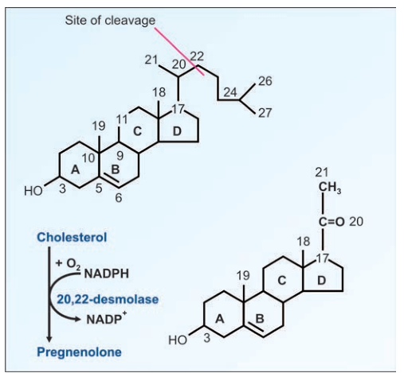 {left=23.03 top=1.05 width=22.77 height=37.44}

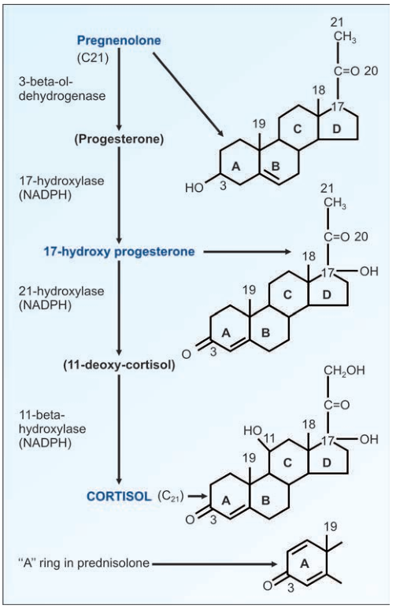 {left=23.43 top=38.48 width=21.97 height=60.09}

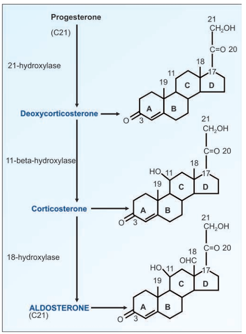 {left=69.46 top=41.23 width=23.90 height=57.72}

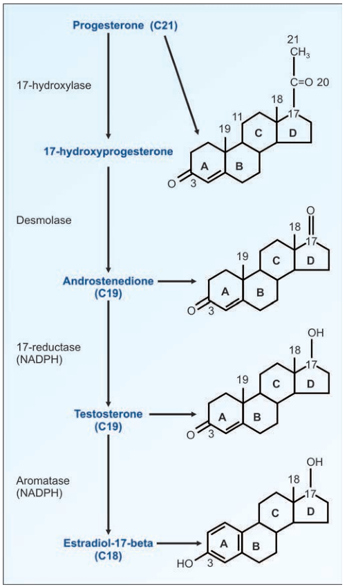 {left=45.80 top=27.09 width=23.90 height=71.86}

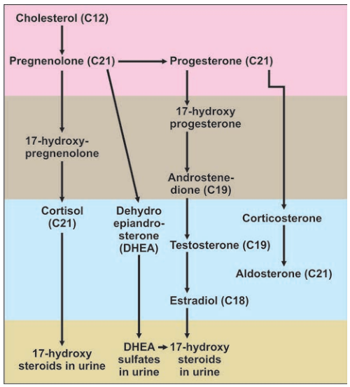 {left=71.89 top=1.05 width=20.90 height=41.10}

---

**Steroid Hormones**

Derived from cholesterol, produced in adrenal cortex, gonads, and placenta.
Slow-acting genomic effects, long duration.
Clinical roles:
Glucocorticoids (e.g., cortisol): anti-inflammatory, immunosuppressive → prednisone, dexamethasone.
Mineralocorticoids (e.g., aldosterone): sodium retention → regulated by renin-angiotensin system.
Sex steroids: testosterone, estrogen, progesterone → used in hormone replacement, contraception, oncology.
Adverse effects: Cushingoid features, osteoporosis, metabolic syndrome (for glucocorticoids).

---

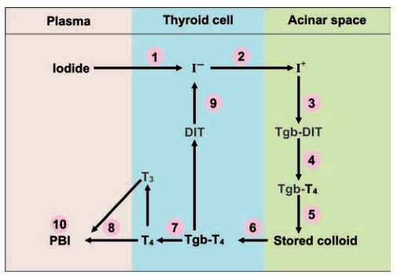 {left=22.39 top=56.62 width=35.21 height=43.38}

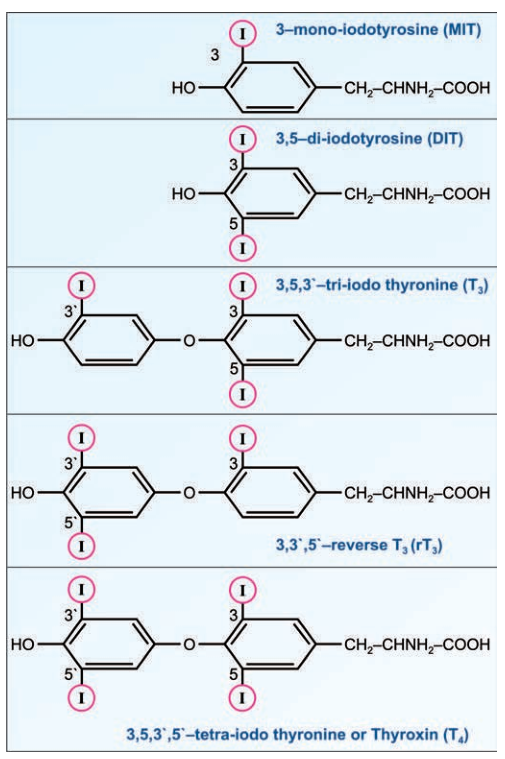 {left=63.48 top=2.96 width=35.21 height=94.07}

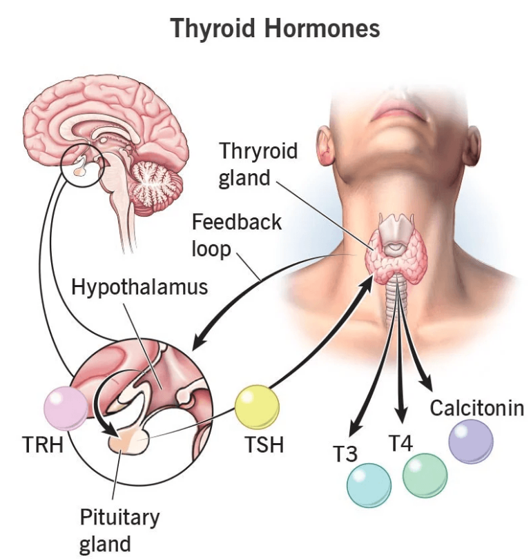 {left=16.87 top=1.90 width=29.22 height=54.71}

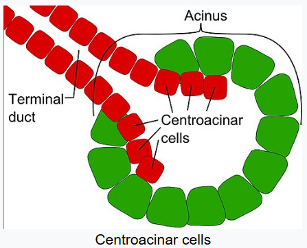 {left=47.39 top=18.65 width=14.78 height=21.22}

---

**Thyroid Hormones (T₃ & T₄)**

Regulate basal metabolic rate, growth, CNS development.
Long-acting, lipophilic hormones with nuclear receptors.
Clinical importance:
Hypothyroidism: fatigue, bradycardia, weight gain → treated with levothyroxine (T₄).
Hyperthyroidism: tachycardia, tremor, weight loss → treated with methimazole, propylthiouracil.
Iodine deficiency → goiter formation.
Drug interactions: amiodarone, lithium, corticosteroids can affect thyroid function

---

**Catecholamines**

Derived from tyrosine, act rapidly via adrenergic GPCRs (α, β).
Epinephrine, norepinephrine, dopamine — mediators of acute stress ("fight or flight").
Pharmacology:
Epinephrine: anaphylaxis, cardiac arrest (β₁/β₂ agonist).
Dopamine: used in shock and heart failure (dose-dependent receptor selectivity).
β-blockers: antagonize catecholamine effects (hypertension, arrhythmia).
Metabolic effects: glycogenolysis, lipolysis, increased cardiac output.

---

**Eicosanoids**

Derived from arachidonic acid via COX and LOX pathways.
Extremely short-lived autocrine/paracrine mediators.
Include prostaglandins, thromboxanes, leukotrienes.
Clinical significance:
NSAIDs (aspirin, ibuprofen) inhibit COX → reduce inflammation and pain.
Leukotriene modifiers (montelukast) used in asthma.
Prostaglandin analogs: used in labor induction, glaucoma (latanoprost), gastric protection (misoprostol).
Key role in inflammation, platelet aggregation, vascular tone.

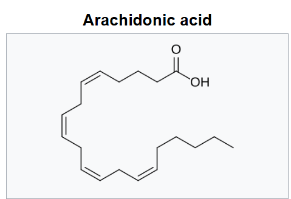 {left=66.38 top=0.00 width=31.16 height=37.94}

---

**Some of the major endocrine hormones and their target tissues.**

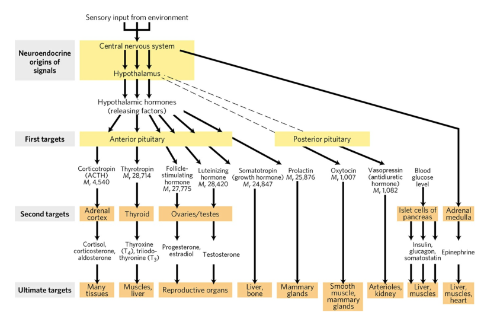 {left=21.96 top=17.05 width=70.85 height=82.95}

---

**HOMEWORK**

---

**Problem 1. **Learn to use Protein Data Bank resource.
Go to the <u>http://www.rcsb.org/pdb/home/home.do</u>
Find structure with PDB-code 4HFH
Answer the questions:
What kind of receptor is this (e.g. GPCR,...,etc)?
How many subunits does it have?
The bottom half of 4HFH consists entirely of α-helices. Of what type of secondary structure does the top half primarily consist? (See Wikipedia  “Secondary structure”)

**Troubleshoot**: In case of 3D view not working you may try to go to **chrome://settings/system **And try to check or uncheck “Use graphics acceleration…”

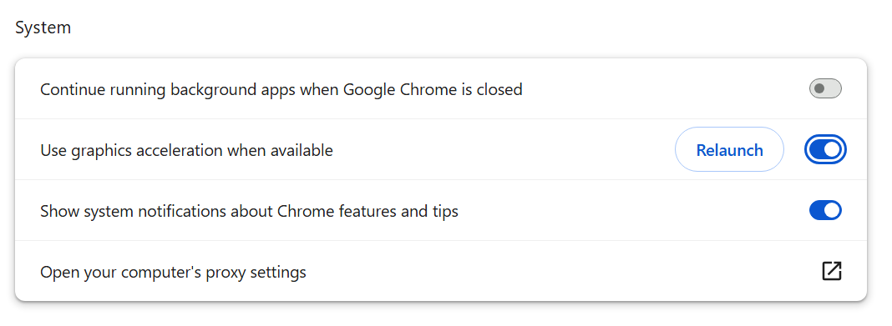 {left=47.96 top=66.13 width=52.04 height=33.87}

---

**Problem 2.**

Use the equation above and given data to find KD and Emax. Recall similar problem for Michaelis-Menten kinetics.

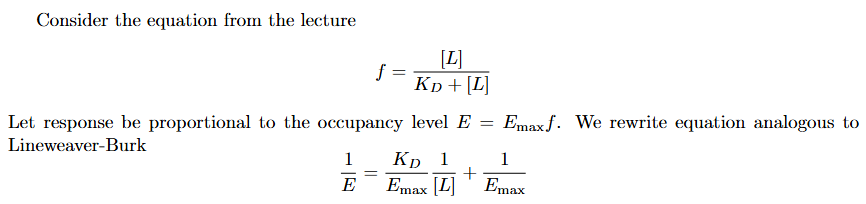 {left=18.63 top=14.94 width=81.37 height=34.08}

---

**Problem 3.**

Consider the deactivation of G-protein (alpha subunit). It occurs spontaneously by GTP→GDP+Pi dephosphorylation. After the signal was obtained we get certain initial concentration of activated G𝞪 subunits [G𝞪·GTP]init. Then concentration [G𝞪·GTP] changes in time according to the following equation (if you’re curious about derivation  derivation see the addendum):

 {left=39.53 top=49.10 width=33.44 height=7.78}

Suppose kint = 1.5 sec-1. What is the expected half-life t1/2 of the activated G𝞪? Half-life is the time t1/2 when the concentration becomes half of the initial concentration [G𝞪·GTP](t1/2) / [G𝞪·GTP]init = 1/2.

---

**Problem 3 Addendum** (if you want to know more)

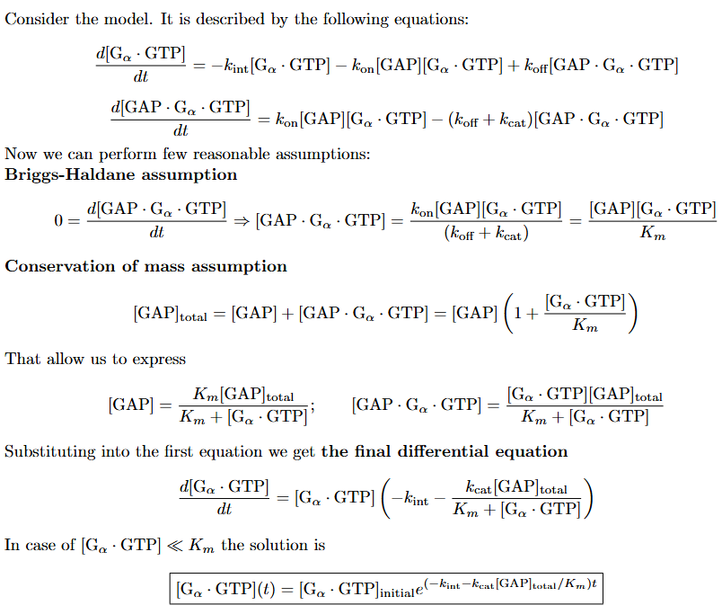 {left=16.07 top=15.79 width=53.41 height=80.66}

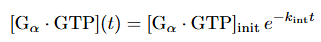 {left=71.48 top=90.28 width=26.51 height=6.17}

If [GAP]total = 0, we get simplification

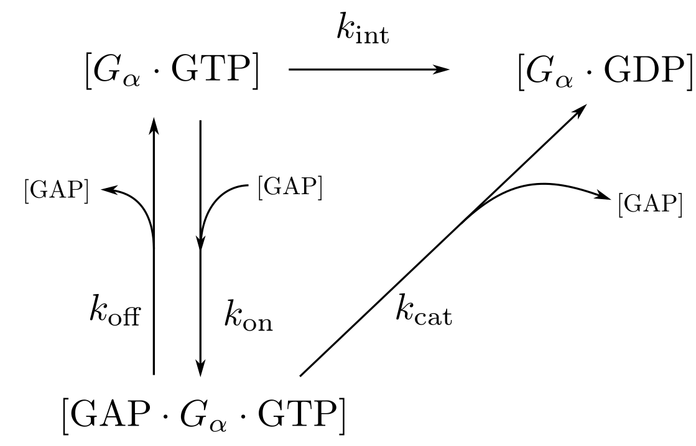 {left=69.97 top=16.26 width=29.53 height=33.74}

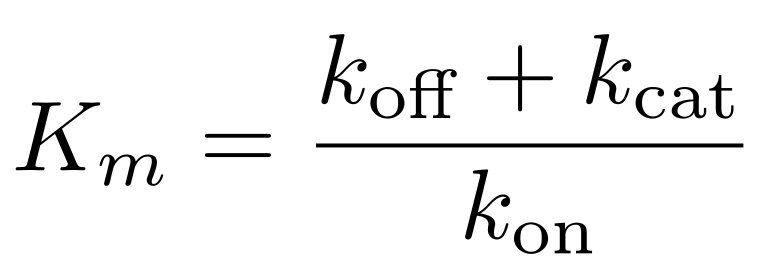 {left=75.91 top=59.97 width=15.21 height=9.61}

---

**FINALE**

---
