

Bioorganic Chemistry

Tymchyshyn V.B.

Lecture 10: Electrophysiology at molecular level

---

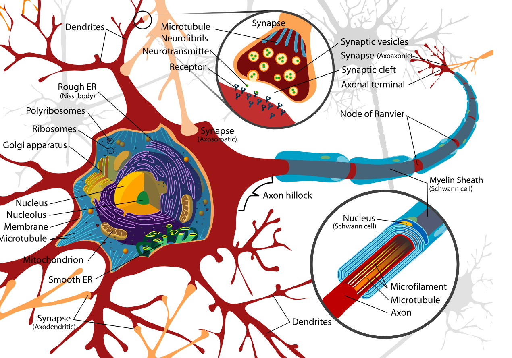 {left=57.95 top=2.21 width=39.70 height=49.40}

**soma **(3-18 micrometers) is the body of the neuron that  contains the nucleus and is responsible for  most protein synthesis.

**dendrites **of a neuron are cellular extensions with many branches. Dendrites receive electrical and chemical signals from other neurons through synapses and conduct impulses toward the cell body.

**axons **are a fine projections that can extend tens, or even tens of thousands of times the diameter of the soma in length. The axon primarily carries nerve signals away from the soma. Many neurons have only one axon, but this axon may—and usually will—undergo extensive branching, enabling communication with many target cells. The part of the axon where it emerges from the soma is called the **axon hillock. **

The **axon terminal** is a structure at the end of the axon farthest from the soma and contains **synapses**. Synaptic boutons are specialized structures where neurotransmitter chemicals are released to communicate with target neurons.

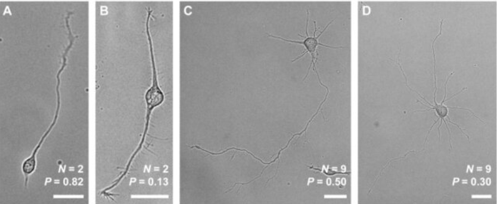 {left=57.62 top=57.18 width=38.06 height=27.75}

---

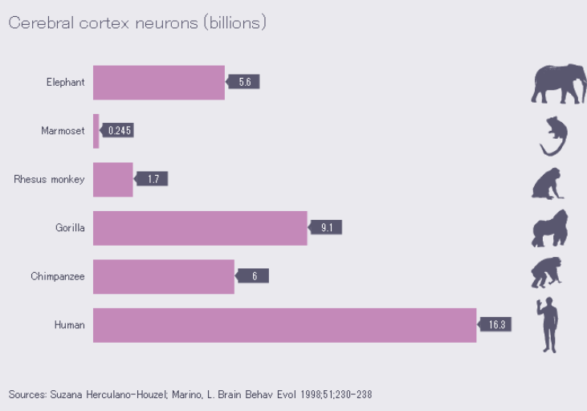 {left=54.60 top=3.57 width=26.37 height=32.83}

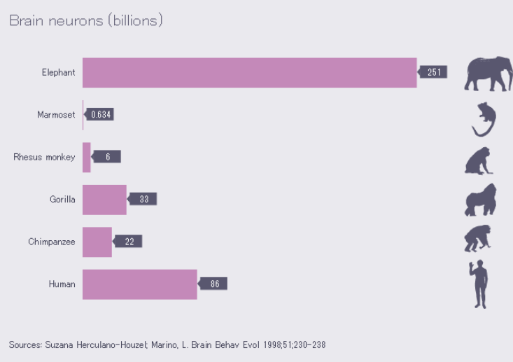 {left=22.87 top=3.57 width=26.19 height=32.83}

Human body contains ~90 billions neurons
brain ~ 99%
spinal cord — fraction of a percent
peripheral nervous system (including the enteric nervous system of the gut) — about 0.5–1%
gut itself contains around 500 million neurons ( “second brain,” but only ~0.5% of the total).
The cerebellum contains 70-80% of the brain's neurons, although it represents only ~10% of total brain volume. 
Neurons need a lot of energy to function: the brain uses ~20% of the body’s energy even though it's only ~2% of body weight.
Some neurons in human body may have axons up to 2 m length!
Most of the brain’s neurons are already created by the time we’re born, but there is evidence to support the theory that neurogenesis is a lifelong process.

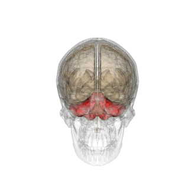 {left=82.92 top=50.89 width=17.08 height=30.37}

---

Most neurons can be anatomically characterized as:

**Unipolar**: single process. Unipolar cells are exclusively sensory neurons (the nerve cells that are activated by sensory input from the environment). 
**Bipolar**: 1 axon and 1 dendrite (retina- vision, olfactory epithelium - sense of smell, inner ear - cochlea and vestibular system) 
**Multipolar**: 1 axon and 2 or more dendrites (brain and spinal cord)
**Anaxonic**: where the axon cannot be distinguished from the dendrite(s) (retina and olfactory bulb - smell)
**Pseudounipolar**: 1 process which then serves as both an axon and a dendrite

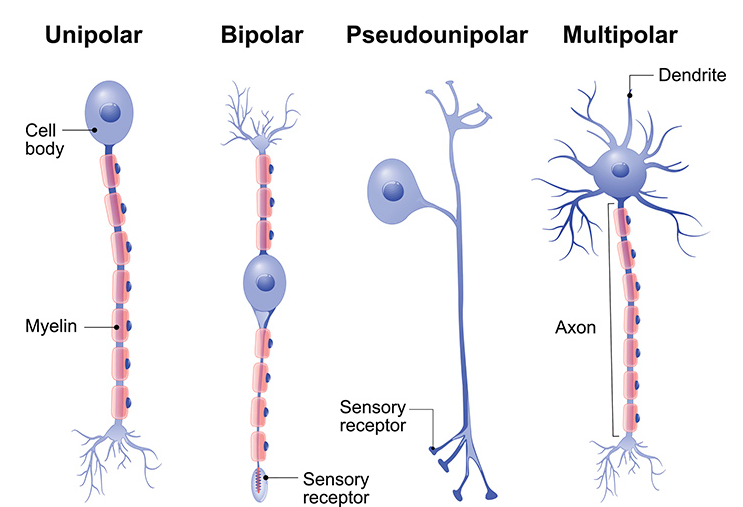 {left=68.43 top=54.75 width=29.40 height=35.67}

**Polarity**

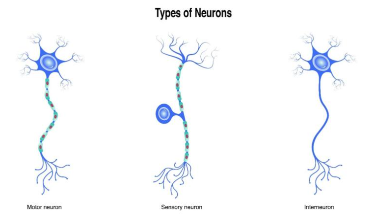 {left=63.65 top=6.10 width=32.81 height=33.99}

**Function:**
**Afferent (sensory neurons) **carry information from the sense organs (such as the eyes and ears) to the brain.
**Efferent (****motor neurons) **control voluntary muscle activity, such as walking and talking, and carry messages from nerve cells in the brain to the muscles.
Other neurons, called **interneurons**, make connections between sensory and motor neurons.

---

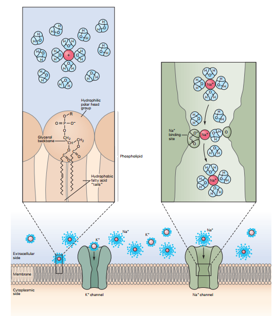 {left=50.50 top=4.33 width=47.20 height=87.16}

Like all animal cells, the cell body of every neuron is enclosed by a plasma membrane, a **bilayer **of lipid molecules with many types of embedded protein structures. A lipid bilayer is a powerful **electrical insulator**, but in neurons, many of the protein structures embedded in the membrane are electrically active. 

These include ion **channels **that permit electrically charged ions to flow across the membrane and ion pumps that chemically transport ions from one side of the membrane to the other. Most ion channels are gated, permeable only to specific types of ions. Some ion channels are **voltage gated**, meaning that they can be switched between open and closed states by altering the voltage difference across the membrane. Others are chemically gated, meaning that they can be switched between open and closed states by interactions with chemicals that diffuse through the extracellular fluid. The ions include Na2+, K+, Cl-, and Ca2+.

Another important structures embedded in the membrane are **sodium–potassium pumps**.

---

Sodium–potassium pump

discovered in 1957 by the Danish scientist Jens Christian Skou (Nobel Prize in 1997)

The pump uses the energy released from the hydrolysis of one molecule of ATP. It transports three sodium ions 3 Na+ out of the cell and two potassium ions 2 K+ into the cell for each ATP molecule consumed. Thus, there is a net export of a single positive charge per pump cycle. The net effect is an extracellular concentration of sodium ions which is **5 times** the intracellular concentration, and an intracellular concentration of potassium ions which is **30 times** the extracellular concentration.

**Thus the Na+/K+-ATPase helps maintain resting potential, affects transport, and regulates cellular volume.**

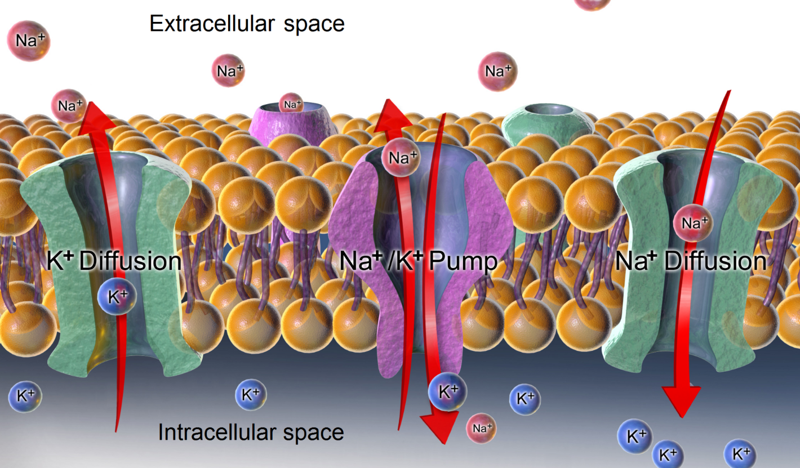 {left=17.86 top=53.71 width=37.42 height=38.94}

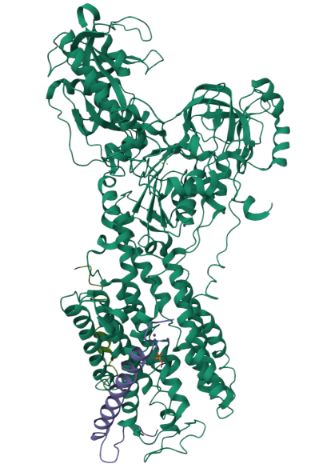 {left=68.89 top=52.76 width=16.48 height=43.86}

---

Detailed molecular studies have revealed that all voltage-gated cation channels—those permeant to *K**+*,
*Na**+*, or *Ca**2*+—have a similar underlying architecture. In fact, there is now strong evidence from studies of bacteria, plants, invertebrates, and vertebrates that most voltage-sensitive cation channels stem from a **common**
**ancestral channel**—perhaps a K+ channel—that can be traced to a single-cell organism living more than 1.4
billion years ago, before the evolution of separate plant and animal kingdoms.

Voltage-gated channels

Voltage-gated cation channels are composed of pore-forming α-subunits that each contain a motif consisting of six transmembrane segments (S1–S6). A seventh hydrophobic region, the **P-region (pore loop)**, connects the S5 and S6 segments. It forms a loop that dips into and out of the extracellular side of the membrane and forms the channel’s **selectivity filter**. *K**+* and *Na**+* have different radii 1.33 Å and 0.95 Å respectively, moreover they are hydrated. As a result **ion size **and charge density could be used to make passage of one of them more energetically unfavorable.

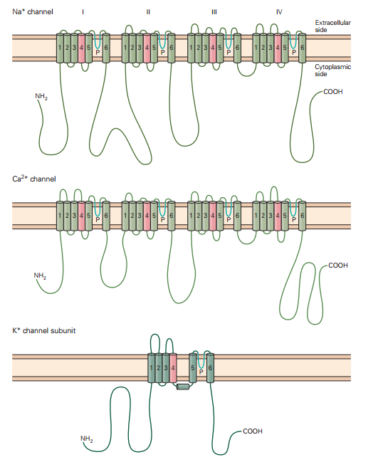 {left=68.63 top=32.26 width=30.79 height=65.19}

**The S4 segment** is thought to play a particularly important role in voltage-gating. This transmembrane segment contains a distinctive pattern of amino acids in which every third position contains a positively charged arginine or lysine residue. Because this pattern of positive charges is present in all voltage-gated channels but is absent in channels that are not voltage-gated, it is thought that this region is the voltage sensor — that part of the protein that transduces depolarization of the cell membrane into a conformational change that opens the channel.

---

A large single protein with **four domains**, each containing **six transmembrane segments (S1–S6)**. The **S4 segment** acts as a **voltage sensor** — it has positively charged residues that move when the membrane depolarizes.

During depolarization it has acts like this:
**Activation stage** — opens rapidly when the cell depolarizes. Depolarization twists S4, and this conformational change in the molecule causes the gate to open.
**Inactivation stage** — closes shortly after opening, even if the membrane is still depolarized.

Function:
**Resting state**: Activation gate closed, inactivation gate open (no Na⁺ flow).
**Depolarization**: Voltage change opens activation gate almost instantly: Na⁺ rushes into the cell (down its gradient).This further depolarizes the membrane (positive feedback).
**Inactivation**: Within ~1 ms, when inactivation gate closes, channel is inactivated (can’t reopen until repolarized).
**Repolarization**: When the membrane returns to negative potential, inactivation gate opens again and activation gate closes (reset).

Fast inward Na⁺ current causes sharp spike in membrane potential.

Voltage-gated Sodium (Na⁺) Channels

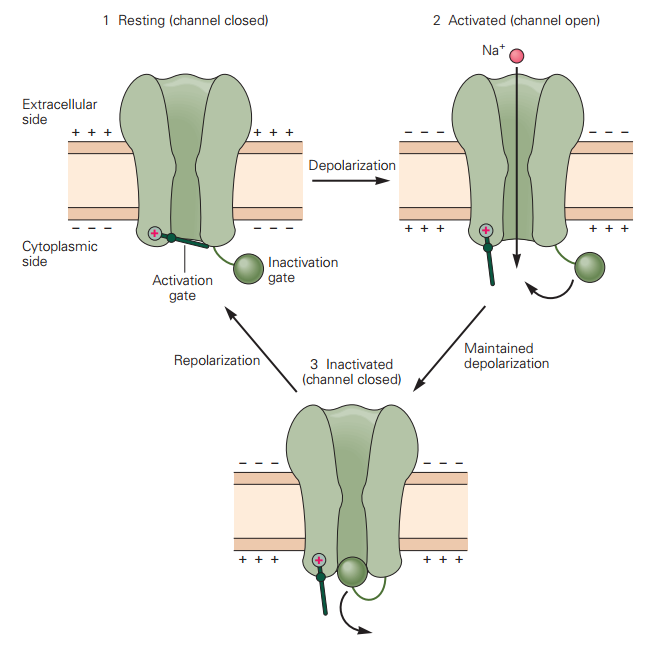 {left=68.87 top=13.26 width=28.34 height=50.37}

---

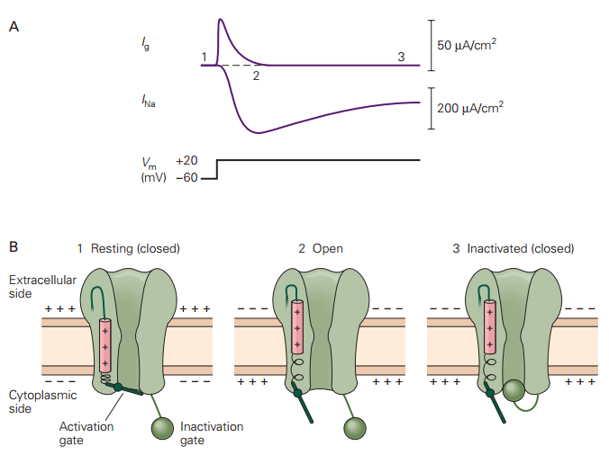 {left=16.14 top=18.73 width=47.00 height=62.55}

**Changes in charge distribution within the Na****+ ****channel are associated with opening and closing of the channel.**

**(a)** When the membrane is depolarized, the *Na**+** *current (*I**Na*) is activated and then inactivated. The activation of the *Na**+* current is preceded by a brief outward current (*I**g*), reflecting the outward movement of positive charges within the *Na**+** *channels associated with the opening of their activation gates. 

**(b)**The redistribution of gating charge and positions of the activation and inactivation gates when the channel is at rest, open, and inactivated. The red cylinder represents a positively charged region containing the gating charge that is thought to move through the membrane electric field in response to voltage  changes. Depolarization from the resting state causes the gating charge to move outward, opening the activation gate.
Inactivation closes the channel, immobilizing the gating charge.

Charged parts of protein move

---

**The structure of the voltage-gated sodium channel.**
**(a)** A depiction of how the sodium channel polypeptide chain is believed to be woven into the membrane. The molecule consists of **four **domains, I–IV. Each domain consists of **six **alpha helices (represented by the blue and purple cylinders), which pass back and forth across the membrane. 

**(b)** An expanded view of one domain,
showing the voltage sensor of alpha helix S4 and the pore loop (red), which contributes to the **selectivity filter**. 

**(c)** A view of the molecule showing how the domains may arrange themselves to form a pore between them.

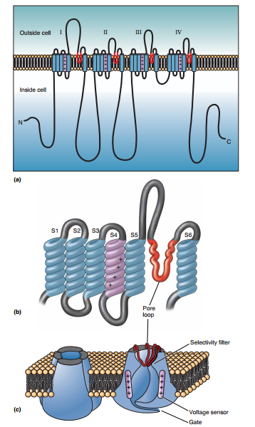 {left=25.13 top=1.68 width=31.57 height=94.07}

---

Voltage-gated Potassium (K⁺) Channels

Structure:
Usually composed of **four separate subunits**, each with six transmembrane segments.
Same type of **S4 voltage sensor** mechanism.

Function:
**Resting state**: Activation gate closed thus very little K⁺ conductance.
**Depolarization**: Opens more **slowly** than Na⁺ channels (delayed rectifier). K⁺ flows **out** of the cell (down its gradient)
**Repolarization**: The outward K⁺ current brings the membrane potential back toward the **resting value.**
**Afterhyperpolarization: **Sometimes stays open briefly. Membrane potential dips below resting level.

Outward K⁺ current terminates the action potential and restores resting potential.

Even a single ion species, such as K+, can cross the membrane through several distinct types of channels, each with its own characteristic kinetics, voltage dependence, and sensitivity to different modulators.

---

In addition to its six transmembrane α-helixes (S1–S6), a voltage-gated K+ channel subunit contains a short α-helix (the P helix) that is part of the P-region selectivity fillter, as well as an α-helix on the cytoplasmic side of the membrane that connects transmembrane helixes S4 and S5 (4-5).

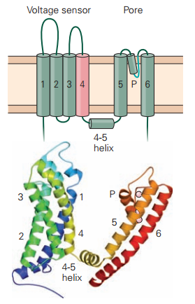 {left=21.46 top=3.93 width=20.13 height=55.68}

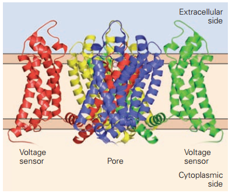 {left=59.58 top=2.22 width=28.54 height=42.07}

Side view of the tetrameric voltage-gated K+ channel.

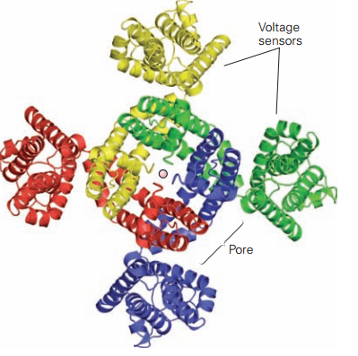 {left=52.46 top=57.78 width=23.38 height=41.36}

A view looking down on the tetrameric channel from outside the cell. The four voltage-sensors (S1–S4) are located on the periphery and the S5-P-S6 pore-forming region of the channel is in the center.

---

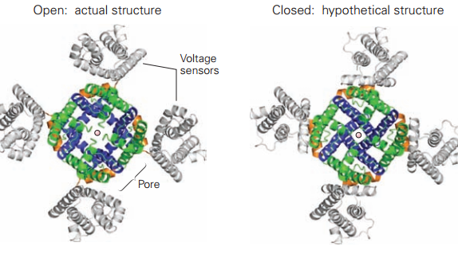 {left=19.64 top=3.95 width=41.47 height=42.90}

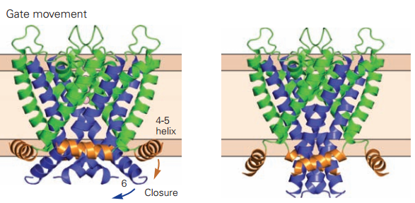 {left=20.54 top=53.59 width=42.07 height=36.57}

A view looking down on the open and closed channel from outside the cell. Note how the central pore is constricted in the closed state. This constriction prevents *K*+ flow
through the channel.

The putative conformational change in the
channel pore upon voltage-gating. A side view of the tetrameric S5-P-S6 pore region of
the channel shows the S4-S5 coupling helix.
Membrane repolarization causes the downward movement of the S4-S5 helix, applying force to the S6 inner helix of the pore. This causes the S6 helix to bend at its glycine hinge, thereby closing the gate of the channel

---

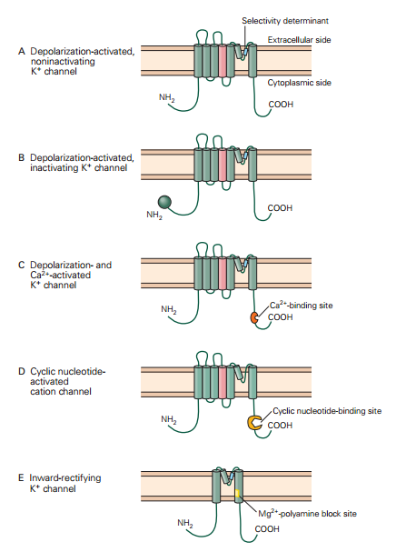 {left=15.16 top=3.21 width=42.69 height=94.97}

**The extended gene family of voltage-gated channels produces variants of a common molecular design.**

**(a) **The extended gene family of voltage-gated channels produces variants of a common molecular design.

**(b) **Many* K**+** *channels that are !rst activated and then inactivated by prolonged depolarization have a ball-and-chain segment at their N-terminal end that inactivates the channel by plugging its inner mouth.

**(c)** Some K+ channels that require both depolarization and an increase in intracellular *Ca**2+* to activate have a *Ca**2+*-binding sequence attached to the C-terminal end of the channel.

**(d) **Cation channels gated by cyclic nucleotides have a cyclic nucleotide-binding domain attached to the C-terminal end. 

**(e) **Inward-rectifying *K**+* channels, which are gated by blocking particles available in the cytoplasm, are formed from a truncated version of the basic building block, with only two membrane-spanning regions and a P-region.

---

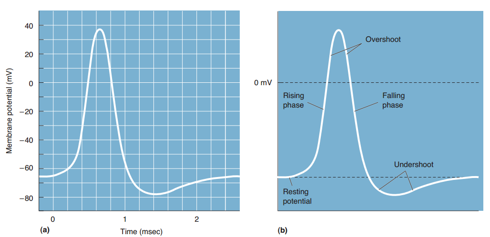 {left=22.29 top=68.44 width=34.97 height=30.12}

**An action potential. **
**(a)** An action potential displayed by an oscilloscope.
**(b)** The parts of an action potential.

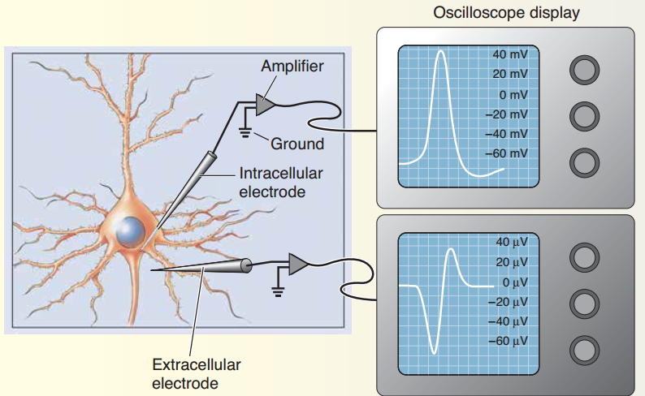 {left=24.42 top=28.98 width=33.90 height=37.04}

Action potentials can be studied by using:  
**intracellular recording - **impaling the neuron or axon with a microelectrode (typically neurons of invertebrates are used, which can be 50–100 times larger than mammalian neurons)
**extracellular recording - **placing an electrode near the membrane. 
Microelectrode arrays (MEAs) are commonly used, especially for *in vitro* studies, as they allow simultaneous recording from many neurons.

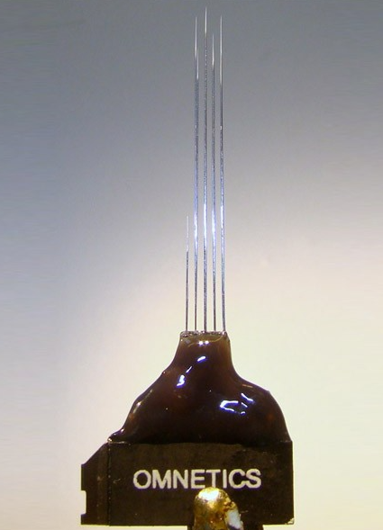 {left=61.55 top=33.35 width=6.39 height=15.73}

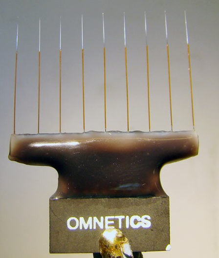 {left=67.93 top=33.35 width=6.65 height=15.73}

Material: Ir, Pt-Ir, 
Length: 1-40 mm
Tip diameter: 1 - 6 µm

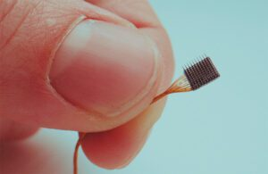 {left=61.55 top=48.90 width=13.03 height=15.06}

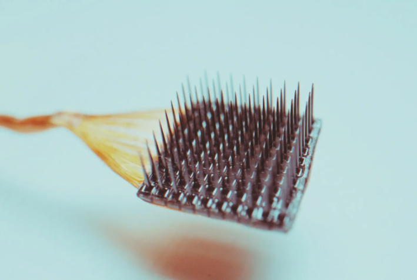 {left=74.58 top=48.90 width=12.62 height=15.06}

 {left=87.19 top=49.25 width=12.37 height=14.70}

Utah array

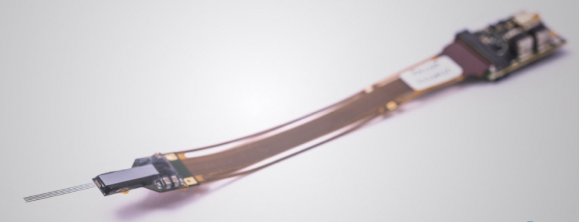 {left=74.58 top=33.35 width=24.72 height=16.07}

CMOS technology
1000s probes

---

 {left=16.87 top=7.02 width=83.13 height=83.13}

---

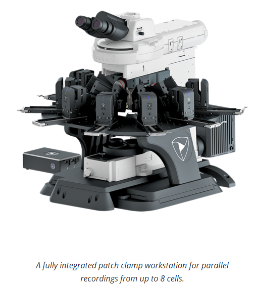 {left=61.10 top=56.87 width=19.71 height=42.93}

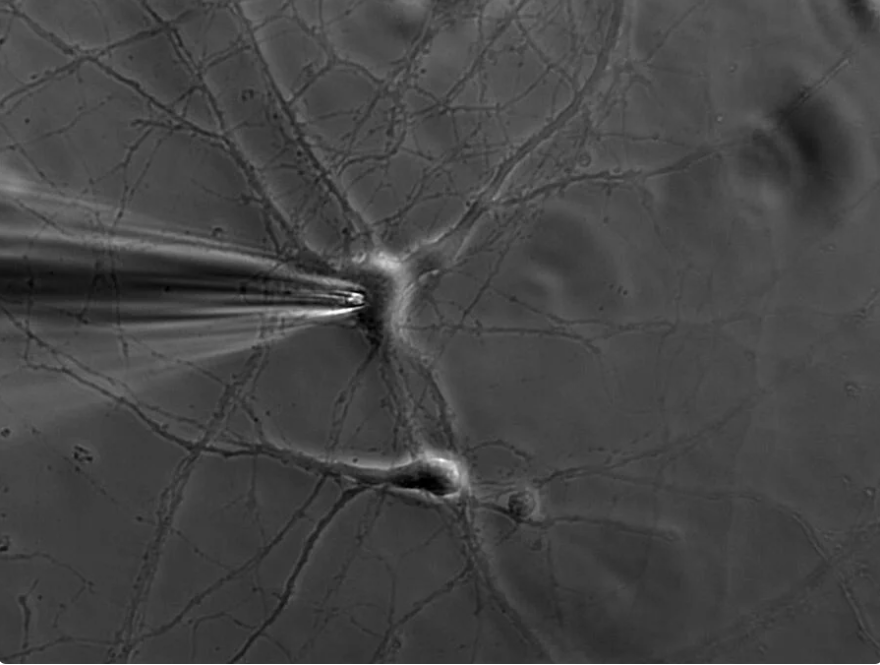 {left=57.72 top=21.69 width=25.81 height=34.68}

The Patch-Clamp Method - method for exploration of ionic gates.

Bert Sakmann and Erwin Neher, 1970s.
Nobel Prize in Physiology or Medicine in 1991 *"for their discoveries concerning the function of single ion channels in cells".*

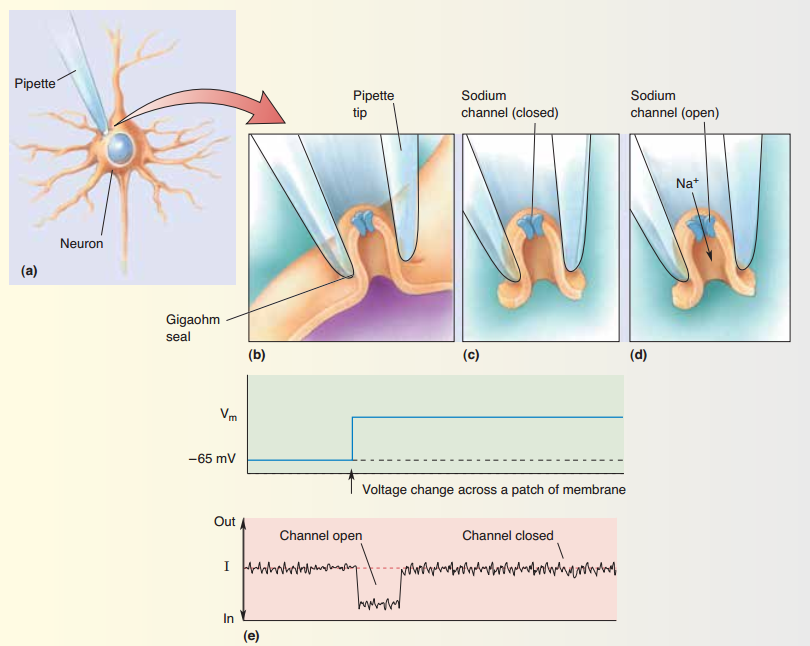 {left=17.14 top=21.69 width=32.86 height=46.59}

By using clamping it’s possible to resolve currents flowing through **single channels**. If the patch contains a voltage-gated sodium channel, for example, then changing the membrane potential from 65 to 40 mV will cause the channel to open, and current (I) will flow through it.

---

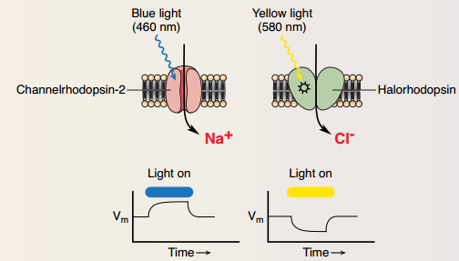 {left=18.31 top=17.43 width=41.35 height=41.86}

Optogenetic control of neural activity (2003)
method for exploration of neural activity via manipulation of ionic gates

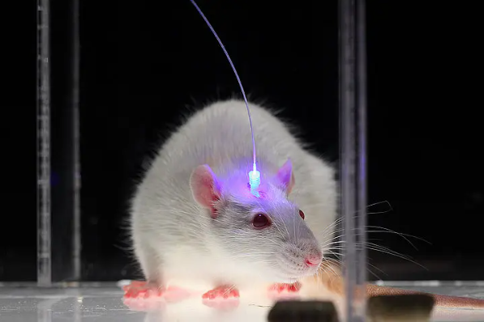 {left=63.75 top=17.43 width=35.32 height=41.86}

pigment **channelrhodopsin-2** (ChR2). By introducing the ChR2 gene into mammalian cells, it was showed that excites neuron with response to blue light (encodes a light sensitive cation channel that is permeable to *Na**+** *and *Ca**2+ *)

**halorhodopsin**, a protein derived from single-cell microbes that will inhibit neurons in response to yellow light (anions Cl-)

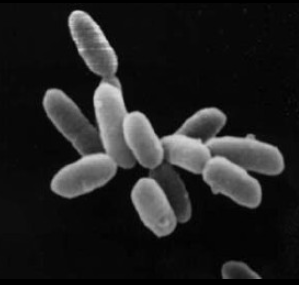 {left=70.10 top=82.16 width=9.31 height=15.77}

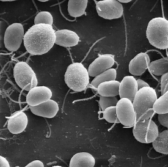 {left=70.10 top=64.32 width=9.02 height=15.93}

archaea *halobacteria*

alga 
*Chlamydomonas reinhardtii*
*(*ChR2 is part of light seeking 
behaviour*)*

Channel

Cl pump

---

 {left=15.15 top=10.45 width=82.28 height=82.28}

---

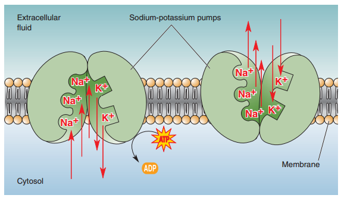 {left=23.15 top=26.99 width=24.82 height=25.64}

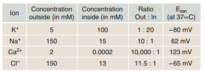 {left=22.29 top=56.74 width=29.86 height=18.37}

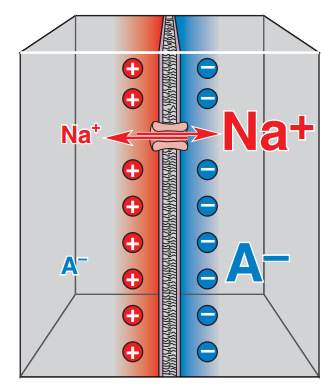 {left=53.93 top=26.82 width=13.81 height=29.01}

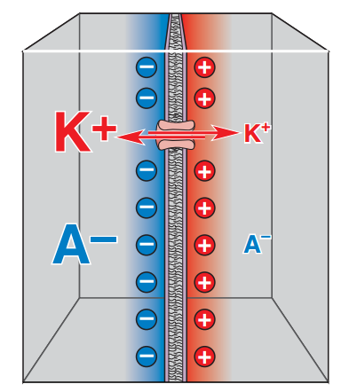 {left=72.57 top=26.54 width=14.45 height=29.57}

Neuron membrane is a capacitor

The lipid bilayer is largely impermeable to ions.
The intracellular and extracellular concentrations of K+, Na+ and Cl− differ significantly.
Ion channels (both voltage-gated and non–voltage-gated) are selective for specific ions.
An electric potential difference exists across the membrane.
Diffusive and electrical forces together maintain a dynamic equilibrium of ionic fluxes.

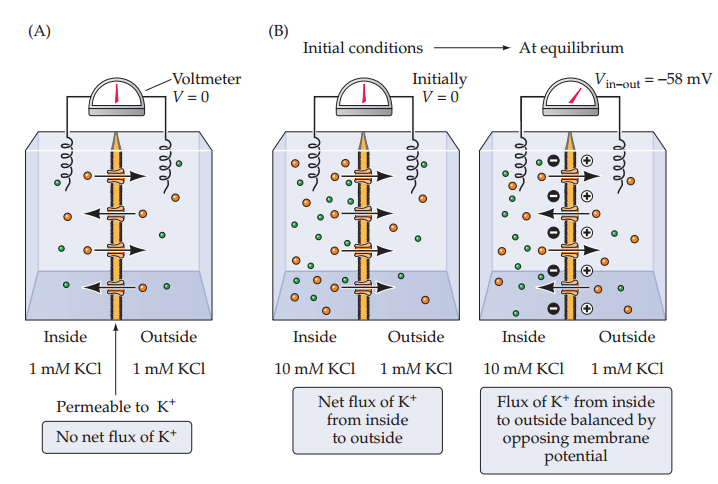 {left=60.29 top=55.59 width=36.62 height=43.89}

**Electrochemical equilibrium.**
If the inside and outside concentrations are different, diffusion tries to make them equal. You need an electric force (equilibrium potential) to oppose diffusion in order maintain concentrations.

---

The Nernst equation is used to calculate the equilibrium potential **for a specific ion** across a cell membrane. It tells you the membrane voltage at which there is no net flow of that ion because the electrochemical driving forces (concentration gradient vs. electrical potential) are balanced.

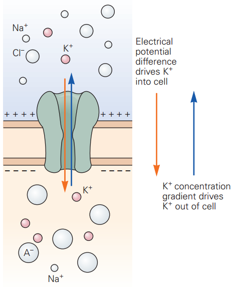 {left=64.60 top=16.67 width=25.07 height=54.93}

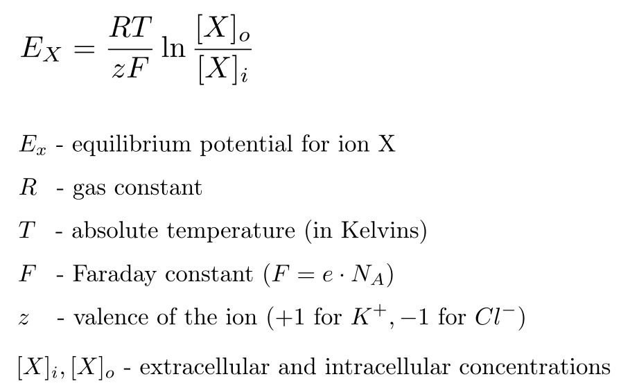 {left=20.87 top=22.86 width=39.64 height=44.04}

The scale factor RT/F is approximately 26.7 mV ar human body temperature (37 oC).

Some authors use logarithm base 10 instead of natural logarithm ! This introduces an extra factor of 2.3.

If you calculate equilibrium potential in *vitro*, use the room temperature instead (RT/F = 25.7 mV).

---

 {left=17.33 top=16.36 width=67.56 height=20.29}

Distribution of the Major Ions Across a Neuronal Membrane at Rest: The Giant Axon of the Squid:

 {left=39.66 top=43.95 width=25.04 height=7.18}

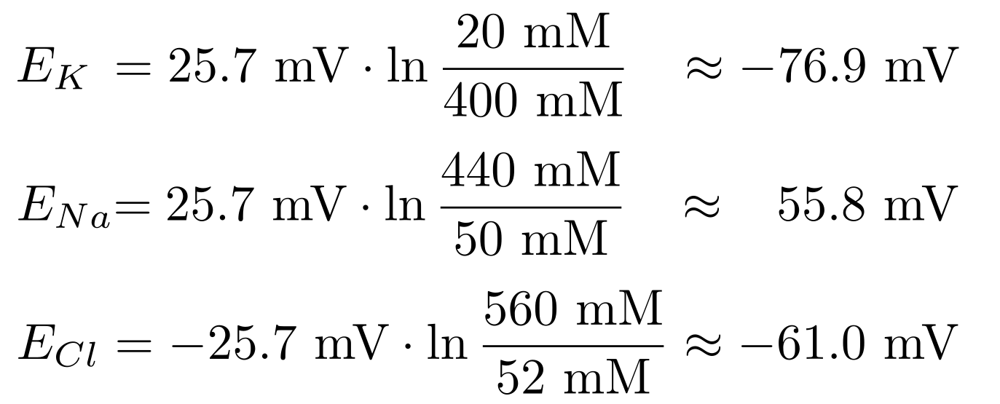 {left=36.28 top=54.74 width=33.78 height=24.28}

---

The Goldman equation (Goldman–Hodgkin–Katz voltage equation) is used to determine the **resting potential** across a cell's membrane, taking into account **all** of the ions that are permeant through that membrane.

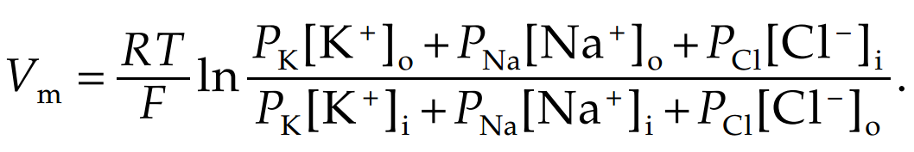 {left=18.92 top=21.18 width=37.10 height=11.03}

Pion - membrane permeability for the ion 
R - the ideal gas constant
T - temperature in Kelvins 
F - Faraday’s constant (F = e NA)

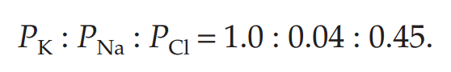 {left=39.80 top=66.59 width=25.04 height=7.18}

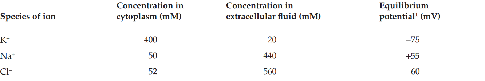 {left=17.20 top=45.54 width=67.56 height=20.29}

!!

Distribution of the Major Ions Across a Neuronal Membrane at Rest: The Giant Axon of the Squid:

Intermediate value between EK, ENa and ECl.

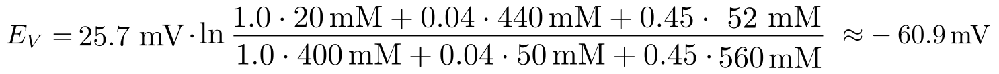 {left=17.95 top=79.16 width=63.12 height=8.38}

---

As the resting potential is not equal to the equilibrium potential for ion, there is an ionic current that attempts restore the equilibrium for that ion

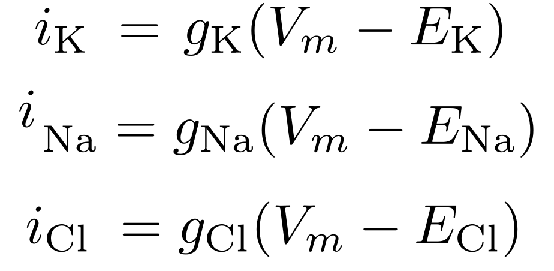 {left=43.51 top=26.79 width=21.33 height=18.55}

Ohm’s Law

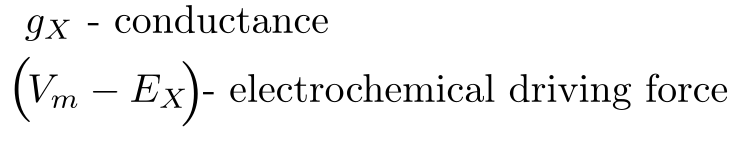 {left=18.89 top=53.32 width=36.02 height=12.17}

If the channel for X-ion is closed it means that gX=0.
When gX>>gY,the system evolves towards potential EX.

---

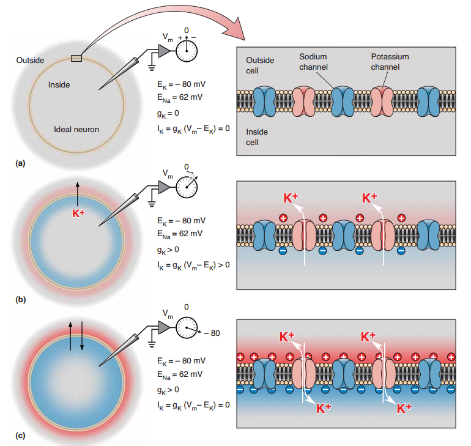 {left=13.69 top=9.53 width=53.01 height=89.22}

**Membrane currents and conductances.** Here is an idealized neuron with sodium potassium pumps (not shown), potassium channels, and sodium channels.

**(a)** Initially, we assume that all channels are closed and the membrane potential equals 0 mV. 

**(b) **Now we open the potassium channels,
and *K**+* flows out of the cell. This movement of *K**+* is an electrical current, *I**K*, and it
flows as long as the membrane conductance to *K**+*, gK>0, and the membrane potential is not equal to the potassium equilibrium potential. 

**(c)** At equilibrium, there is no net potassium current because, although *g**K **>0*, the membrane potential at equilibrium equals *E**K*. At equilibrium, an equal number of* K**+* enters and leaves.

Consider only ions K+

---

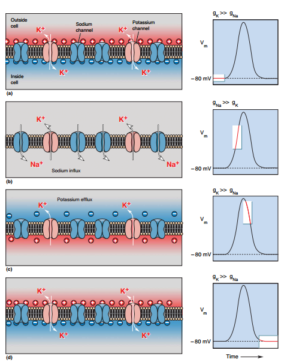 {left=26.87 top=8.26 width=35.74 height=81.69}

**Flipping the membrane potential by changing the relative ionic permeability of the membrane. **
**(a)** The membrane of the idealized neuron. We begin by assuming that the membrane is permeable only to *K* and that *V**m **= E**K**.*

**(b) **We now stipulate that the membrane sodium channels open so that *g**Na**>>g**K* . There is a large driving force on *Na**+*, so *Na**+* rushes into the cell, taking *V**m*  toward *E**Na*.

**(c)** Now we close the sodium channels so that *g**K **>>g**Na*. Because the membrane potential is positive, there is a large driving force on *K**+*. The efflux of *K**+* takes *V**m* back toward *E**K*. 

**(d) **The resting state is restored where *V**m **=** **E**K*.

Consider now two types of ions *K*+ and *Na*+

By manipulating ionic channels it’s possible to create spikes in neuron potential!!

---

**The effect of depolarization. **
**(a)** The axon hillock is impaled by two
electrodes, one for recording the membrane potential relative to ground and the other for stimulating the neuron with electrical current.
**(b)** When electrical current is injected into the neuron the membrane is depolarized sufficiently to fire action potentials

 {left=16.98 top=7.88 width=43.36 height=34.80}

Action potential is caused by the **depolarization **-  injecting positive charge into a neuron.

 {left=17.55 top=44.14 width=37.14 height=50.63}

The firing frequency increases with the amount of depolarizing current, there is a limit to the rate at which a neuron can generate action potentials. The maximum firing frequency is about 1000 Hz; once an action potential is initiated, it is impossible to initiate another for about 1 msec. This period of time is called the **absolute refractory period**. 
After absolute refractory period it can be relatively difficult to initiate another action potential for several milliseconds. During this **relative refractory period**, the amount of current required to depolarize the neuron to action potential threshold is elevated above normal.

---

 {left=16.05 top=10.84 width=26.05 height=27.67}

 {left=15.75 top=40.64 width=26.65 height=26.62}

 {left=14.49 top=68.07 width=28.33 height=29.23}

The cerebral cortex has two major types of neurons as defined by morphology: **aspinous stellate** cells and **spinypyramidal** cells. 
**(a)** A **stellate **cell typically responds to a steady depolarizing current injected into its soma by firing action potentials at a relatively steady frequency throughout the stimulus.
 

**(b)** Most **pyramidal **cells cannot sustain a steady firing rate. Instead, they fire rapidly at the beginning of the stimulus and then slow down, even if the stimulus remains strong.

**(c)** Some cells, including a particular subtype of large pyramidal neuron in the cortex, respond to a steady input with rhythmic, repetitive bursts.

Different types of neurons react to depolarization slightly differently!

 {left=82.73 top=4.39 width=17.29 height=37.22}

 {left=84.01 top=41.61 width=14.24 height=56.50}

---

 {left=15.20 top=2.49 width=18.54 height=41.61}

 {left=39.05 top=2.56 width=15.00 height=43.24}

 {left=59.65 top=7.19 width=39.73 height=27.12}

 {left=26.51 top=58.32 width=54.75 height=28.44}

All the resting *K*+ channels in a nerve cell membrane can be lumped into a single equivalent circuit comprised of a battery in series with a conductor.

**Chemical and electrical forces** contribute to current through an ion channel

Electrical properties of a single *K*+ channel.

The populations of *Na*+, *K*+, and *Cl*- ion channels can each be represented
by a battery in series with a conductor.

---

Electrical model for K-gates

 {left=19.45 top=6.31 width=16.32 height=32.47}

 {left=43.78 top=20.09 width=40.57 height=14.14}

 {left=60.51 top=54.88 width=33.25 height=34.54}

 {left=55.26 top=10.96 width=17.13 height=7.07}

electricity

diffusion / gradient

IV-plot

 {left=16.72 top=38.78 width=39.80 height=60.80}

1

1

2

3

---

 {left=16.99 top=62.03 width=26.98 height=28.30}

Electrical model lor leaky membrane (under depolarization)

 {left=34.34 top=12.16 width=33.92 height=37.84}

Ohm’s law

definition of I

definition of C

Kirchhoff's law

 {left=45.56 top=52.78 width=53.66 height=44.34}

membrane charging rate

The smaller time constant,
the more responsive is the neuron

point neuron,
no voltage-gating
no coord-dependence,
time-dependence only

exponential
depolarization

exponential
polarization

 {left=68.33 top=12.16 width=16.83 height=33.53}

 {left=15.81 top=11.19 width=16.01 height=27.00}

---

 {left=33.38 top=19.02 width=41.02 height=54.69}

---

 {left=18.04 top=13.80 width=36.24 height=26.73}

Electrical model  for an idealized axon (passive)

 {left=47.01 top=75.25 width=11.74 height=5.74}

Membrane capacitance per unit length [F/m]

Membrane resistance per unit length [Ωm]

 {left=47.19 top=81.57 width=8.80 height=8.28}

Axial resistance per unit length [Ω/m]

 {left=47.59 top=90.42 width=8.00 height=6.82}

(proportional to the area - more surface, more charge stored)

(inversely proportional to the area - more area, less resistance )

(inversely proportional to the area - more surface, less resistance)

 {left=47.85 top=68.23 width=2.49 height=3.23}

Membrane capacitance per unit area [F/m2]

Membrane resistance per unit area [Ωm2]

 {left=47.57 top=60.03 width=3.03 height=3.60}

 {left=55.59 top=59.17 width=8.00 height=11.99}

cylindrical neuron, no voltage-gating,
coord-dependence + time-dependence

 {left=57.77 top=11.97 width=41.65 height=42.23}

---

Cable equation (1D heat equation or diffusion equation or special case of Telegrapher's equation)

The length constant is a parameter that indicates how far a stationary current will influence the voltage along the cable.

Time constant shows how fast the membrane potential of an axon changes in response to changes in the current injected into the axoplasm.

 {left=42.17 top=12.28 width=27.75 height=14.58}

 {left=39.83 top=3.21 width=35.93 height=7.21}

 {left=33.31 top=54.55 width=24.02 height=16.21}

Heat equation:

Diffusion equation:

Telegrapher's equation:

 {left=61.17 top=56.39 width=17.43 height=3.22}

 {left=61.67 top=65.83 width=16.42 height=3.91}

 {left=85.26 top=73.99 width=12.27 height=18.43}

 {left=82.43 top=52.61 width=17.89 height=19.54}

 {left=33.04 top=75.53 width=48.75 height=12.11}

---

(Capacitor is fully charged)

 {left=68.28 top=56.24 width=14.88 height=9.80}

Larger cylinder means voltage spreads farther

Steady state:

 {left=43.21 top=7.33 width=5.93 height=6.88}

 {left=35.59 top=16.38 width=21.18 height=9.80}

 {left=36.34 top=29.33 width=19.67 height=6.88}

 {left=16.97 top=40.97 width=47.91 height=57.87}

---

 {left=64.20 top=3.61 width=8.44 height=3.99}

The larger the membrane capacitance, cm, the more current it takes to charge and discharge a patch of membrane and the longer this process will take. The larger the membrane resistance Rm, the harder it is for a current to induce a change in membrane potential. So the higher the tau the slower the nerve impulse can travel.

membrane charging rate

 {left=22.85 top=1.60 width=31.90 height=30.71}

 {left=37.30 top=34.35 width=37.84 height=24.98}

Green’s function

 {left=35.67 top=61.07 width=35.22 height=8.01}

 {left=72.64 top=57.62 width=29.50 height=36.29}

 {left=17.00 top=69.07 width=12.71 height=5.23}

 {left=36.56 top=75.09 width=29.98 height=14.73}

---

The cable equation is not a wave equation; thus, it does not describe signal propagation. Rather, it describes current dissipation due to membrane charging and current leaking. In order for our model to describe wave propagation, we need to account for the fact that membrane resistance has a voltage-dependent component to it. In other words we need to introduce voltage-gated channels. The Hodgkin–Huxley model does that results introducing of one more non-linear, voltage-dependent term.

Cable equation describes** passive propagation - **propagation of the signal between** **Ranvier nodes where there are no voltage-gated channels. In order to get a correct model we need to take into account **active propagation - activation and inactivation **of voltage gated channels.

Cable equation is still useful as it shows how signal propagation is influenced by the parameters of the axon.

 {left=24.07 top=23.98 width=18.14 height=18.54}

 {left=62.95 top=23.14 width=16.44 height=20.23}

 {left=46.30 top=0.29 width=49.73 height=21.55}

“leaky hose”

---

Conduction velocity

Axon diameter

Myelination (saltatory conduction)

 {left=83.50 top=17.00 width=10.01 height=12.20}

Oligodendrocytes

 {left=70.87 top=19.07 width=7.21 height=10.89}

Schwann cells

 {left=52.08 top=19.36 width=18.99 height=9.10}

 {left=27.58 top=16.12 width=10.05 height=9.93}

 {left=14.41 top=17.01 width=10.05 height=8.16}

 {left=13.02 top=27.57 width=27.77 height=51.21}

Longer length constant - more channel are above the threshold (open)

 {left=57.69 top=35.71 width=7.04 height=5.43}

 {left=67.15 top=36.27 width=11.29 height=4.31}

 {left=81.17 top=35.71 width=8.22 height=4.31}

 {left=91.13 top=34.39 width=7.54 height=6.96}

 {left=65.55 top=40.70 width=25.52 height=41.72}

Myelination reduces leaks (less membrane resistance), lowers capacitance as increases charge separation d (C = A/d).

Larger diameter of axon reduces axial resistance.

 {left=41.28 top=58.37 width=15.38 height=20.41}

---

 {left=24.68 top=9.21 width=36.23 height=50.39}

Action potential conduction

Speed of an action potential: **1-100 m/s**
Potential conduction velocity **increases **with increasing axonal diameter (the squid giant axon can be 1 mm in diameter). Smaller axons require greater depolarization to reach action potential threshold and are more sensitive to being blocked by local anesthetics.
Action potential propagation in myelinated neurons is **faster **than in unmyelinated neurons (less “leaks”).

depolarisation wave

**The squid giant axon** is the very large (up to 1.5 mm in diameter; typically around 0.5 mm) axon that controls part of the water jet propulsion system in squid. It was first described by L. W. Williams in 1909.
While the squid axon is very large in diameter, it is unmyelinated, which decreases the conduction velocity substantially. The conduction velocity of a typical squid axon is about **25 m/s**.
In their Nobel Prize-winning work, Alan Hodgkin and Andrew Huxley performed experiments on the squid giant axon.

 {left=76.60 top=67.95 width=20.43 height=31.53}

 {left=90.86 top=1.56 width=8.63 height=27.23}

 {left=90.86 top=28.79 width=8.63 height=30.14}

---

The electrical insulation provided by **myelin **helps speed action potential conduction from node to node. Voltage-gated sodium channels are concentrated in the axonal membrane at the nodes of Ranvier.

 {left=15.59 top=12.69 width=32.10 height=24.78}

**Demyelination **is a process characterized by the gradual loss of the myelin sheath enveloping nerve fibers. When myelin deteriorates, signal conduction along nerves can be significantly impaired or lost, and the nerve eventually withers. Demyelination may affect both central and peripheral nervous systems, contributing to various neurological disorders such as multiple sclerosis, Guillain-Barré syndrome etc.

 {left=56.26 top=62.18 width=38.33 height=34.26}

 {left=47.69 top=13.36 width=26.27 height=29.98}

 {left=76.40 top=16.89 width=19.40 height=34.49}

 {left=24.22 top=39.64 width=12.68 height=22.55}

---

 {left=25.80 top=12.34 width=37.39 height=32.57}

The Hodgkin-Huxley model (1953)

The main question is: how do conductances depend on the voltage (and time) ?

 {left=27.03 top=50.43 width=38.29 height=28.53}

Non-voltage-gated channels + membrane leaks

 {left=74.13 top=10.45 width=19.08 height=32.57}

---

 {left=49.36 top=14.22 width=47.60 height=38.21}

 {left=54.08 top=53.13 width=45.00 height=45.99}

Ionic currents

Clamp voltage experiment (1951)

 {left=22.71 top=50.00 width=18.90 height=47.92}

Voltage steps

 {left=16.82 top=16.13 width=24.80 height=28.66}

K+

Na+

---

 {left=32.71 top=17.85 width=48.16 height=68.36}

Voltage dependence of maximum conductances

sigmoidal functions

---

 {left=15.52 top=3.54 width=39.65 height=60.69}

**Stochastic Channel Activation**
A small patch of membrane containing a single voltage gated Na+ channel is electrically isolated from the rest of the cell by the patch electrode. The Na+ current that enters the cell through the channel is recorded by a current monitor connected to the patch electrode

 {left=57.86 top=14.11 width=38.04 height=43.10}

The patch-clamp experiment (1970)

---

 {left=16.28 top=1.69 width=39.94 height=10.38}

 {left=16.40 top=13.92 width=61.69 height=13.63}

 {left=16.28 top=38.61 width=15.65 height=7.31}

 {left=16.75 top=53.43 width=15.18 height=6.97}

 {left=16.40 top=61.30 width=19.84 height=8.26}

 {left=16.28 top=71.75 width=26.46 height=8.66}

 {left=16.28 top=82.60 width=22.30 height=15.12}

 {left=54.06 top=28.05 width=18.58 height=8.26}

 {left=15.98 top=27.64 width=32.05 height=9.08}

**K****+**

 {left=58.62 top=45.92 width=39.70 height=51.55}

 {left=75.49 top=22.11 width=25.25 height=23.59}

Let’s explore relaxation of n in clamp experiment:

 {left=37.45 top=52.29 width=15.65 height=8.14}

---

 {left=19.69 top=2.82 width=39.94 height=10.38}

 {left=46.23 top=45.68 width=14.35 height=4.48}

 {left=46.23 top=49.70 width=15.75 height=8.27}

 {left=19.60 top=78.79 width=21.41 height=20.40}

 {left=68.84 top=79.02 width=21.97 height=19.63}

 {left=18.84 top=13.86 width=35.69 height=31.82}

 {left=61.44 top=8.53 width=24.22 height=35.76}

 {left=69.94 top=67.54 width=19.82 height=9.26}

 {left=22.15 top=67.54 width=18.52 height=8.83}

 {left=18.08 top=57.97 width=26.65 height=7.73}

 {left=64.69 top=56.36 width=30.27 height=8.27}

**Na****+**

Clamp experiment

 {left=44.14 top=81.34 width=18.52 height=9.64}

---

 {left=50.73 top=19.90 width=19.60 height=79.45}

 {left=78.11 top=18.61 width=20.37 height=80.09}

 {left=21.87 top=20.62 width=18.36 height=76.08}

Na+ activates faster

… and then inactivates

K+ activates slowly

By measuring n∞ ant 𝜏 and by using plausible guesses H&H determined that

all available 
Na+ channels 
open faster

…until they 
are blocked

 {left=24.11 top=8.39 width=14.32 height=11.31}

 {left=50.37 top=8.39 width=14.64 height=10.68}

 {left=78.77 top=8.39 width=12.00 height=10.68}

 {left=91.53 top=10.76 width=8.16 height=3.61}

---

 {left=62.76 top=5.01 width=24.00 height=26.47}

 {left=28.81 top=3.85 width=25.52 height=27.69}

According to the Hodgkin-Huxley model an action potential involves the following sequence of events. Depolarization of the membrane causes *Na**+* channels to open rapidly (an increase in gNa), resulting in an inward *Na**+* current. This current, by discharging the membrane capacitance, causes further depolarization, thereby opening more *Na**+* channels, resulting in a further increase in inward current. This regenerative process drives the membrane potential toward *E**Na* , causing the rising phase of the action potential. 

The depolarization limits the duration of the action potential in two ways: 
It gradually inactivates the voltage-gated *Na**+ *channels, thus reducing gNa
It opens, with some delay, the voltage-gated *K**+* channels, thereby increasing gK. Consequently, the inward *Na*+ current is followed by an outward *K**+* current that tends to repolarize the membrane.

The combined effect of this transient increase in *K**+** *conductance and the residual inactivation of the* Na**+* channels underlies the **absolute refractory period**, the brief period of time following an action potential when it is impossible to elicit another action potential. As some *K**+* channels begin to close and some *Na**+* channels recover from inactivation, the membrane enters the **relative refractory period**, during which it is possible to trigger an action potential, but only by applying stimuli that are stronger than those normally required to reach threshold.

---

 {left=30.93 top=70.95 width=41.91 height=27.15}

Calculation

Theory

 {left=76.09 top=1.87 width=18.53 height=12.66}

 {left=75.85 top=14.53 width=18.53 height=11.40}

 {left=76.42 top=26.57 width=15.04 height=10.85}

 {left=76.42 top=39.36 width=10.30 height=4.46}

 {left=32.87 top=45.96 width=15.97 height=22.85}

 {left=50.23 top=45.96 width=19.82 height=22.85}

EDSAC I

Brunsviga 20
“Brain of steel”

 {left=70.83 top=45.96 width=16.16 height=22.85}

 {left=19.51 top=4.72 width=51.99 height=37.02}

---

 {left=51.27 top=12.31 width=40.42 height=31.97}

 {left=15.57 top=16.35 width=34.43 height=25.62}

 {left=18.76 top=63.04 width=23.90 height=22.97}

 {left=54.22 top=60.55 width=17.38 height=11.88}

 {left=54.22 top=72.73 width=17.38 height=10.70}

 {left=54.52 top=83.73 width=14.11 height=10.18}

 {left=54.52 top=95.73 width=9.66 height=4.18}

 {left=18.76 top=44.29 width=61.77 height=16.43}

H-H electrical model for an idealized axon (active)

---

<u>https://www.metaneuron.org/</u>

 {left=17.69 top=25.41 width=71.31 height=29.11}

Membrane length constant

 {left=17.19 top=64.62 width=81.02 height=31.97}

Axon action potential

<u>https://colab.research.google.com/drive/1GC-2GHNFvt0w3AQTjkIjdhSws5fqxE4i?usp=sharing</u>

---

Tetrodotoxin (TTX)

The intestines, ovaries and livers of the **blowfish **contain a poison tetrodotoxin. Tetrodotoxin has been isolated from other widely differing animal species:  octopuses and cuttlefish, toads, newts etc.
TTX is 1200x deadlier than cyanide. A single fish has enough poison to kill 30 people.
The toxin is variously used by animals as a defensive biotoxin to ward off predation, or as both a defensive and predatory venom (e.g., in octopuses, chaetognaths, and ribbon worms).
TTX is a potent blocker of voltage-gated sodium channels 
TTX is a powerful experimental tool to dissect how different ion channels contribute to measures electrical potentials.

 {left=18.99 top=9.35 width=27.72 height=19.42}

 {left=22.56 top=31.63 width=18.84 height=24.58}

Obscure pufferfish (*Takifugu obscurus*)

Pufferfish don’t make tetrodotoxin (TTX) themselves — they *accumulate* and *concentrate* it from symbiotic or dietary sources. The toxin comes from originates from marine symbiotic bacteria, that originate from fish’s microbiome (skin, gut, ovaries, liver), or TTX-containing prey, like flatworms, snails, and small crustaceans.

 {left=21.94 top=67.90 width=20.08 height=26.63}

In East Asian cuisine, fugu has emerged as a highly renowned delicacy, establishing itself as one of the most celebrated dishes in Japanese Korean and Chinese cuisines.

---

 {left=14.29 top=5.36 width=23.13 height=16.54}

An evolutionary arms race

Newts (*Taricha granulosa*) produce TTX on their skin. TTX production is thought to have evolved to deter vertebrate predators — particularly garter snakes (*Thamnophis sirtalis*). In some populations, garter snakes have evolved resistance to TTX. This resistance is due to amino acid substitutions in the sodium channel proteins (Nav1.4, primarily) of their muscle cells, which reduce the binding affinity of TTX. However, they come with trade-offs: TTX-resistant channels often conduct sodium ions less efficiently, making the snakes slower or less physiologically efficient in other ways.

 {left=14.29 top=25.02 width=11.93 height=20.75}

 {left=26.39 top=25.02 width=13.82 height=20.75}

**Hyperkalemic Periodic Paralysis** (HYPP) is an autosomal dominant disease in horses that causes episodes of muscle stiffness, tremors, weakness, and sometimes collapse. It’s caused by a mutation in the voltage-gated sodium channel of skeletal muscle — specifically, the SCN4A gene, which encodes the Nav1.4 sodium channel α-subunit (the same gene is affected in the TTX newt–snake arms race).

HYPP primarily affects American Quarter Horses and related breeds. All affected individuals trace back to a single famous stallion named “Impressive”(he sired 2250 foals), a heavily muscled horse born in 1969. The trait spread because the mutation produced larger, more muscular horses that were favored in halter competitions.

 {left=15.96 top=61.03 width=24.25 height=32.39}

HYPP in horses

---

“Fainting goats” / myotonic goats.

 {left=16.02 top=9.54 width=31.17 height=29.10}

**Myotonia congenita**  is an autosomal dominant disease in goats characterized by temporary muscle stiffness (**myotonia**) when the animal is startled, excited, or suddenly moves after rest. The muscles lock in a contracted state for 5–20 seconds (no pain, no lasting damage).
Despite their nickname, they don’t truly “faint” — they remain conscious, but their muscles freeze for a few seconds, sometimes causing them to topple over stiffly. The condition is caused by mutations in the **CLCN1 gene**, which encodes the **chloride channel (ClC-1)** in skeletal muscle cell membranes.

 {left=20.27 top=40.12 width=22.66 height=57.72}

**Action potential recordings from myotonic goat muscle in response to graded electrical stimulation**. 
In the top tracing, stimulation of muscle fibers produces multiple action potential spikes and a small afterdepolarization. With a stronger stimulus, the afterdepolarization reaches threshold voltage and triggers spontaneous action potentials that fire after termination of the electrical stimulus.

---

 {left=18.51 top=5.75 width=28.18 height=57.71}

There are similar conditions in humans caused by mutations in ion channel genes (for Na⁺, K⁺, Ca²⁺, or Cl⁻):
Hyperkalemic periodic paralysis (**HyperPP**) 
Hypokalemic periodic paralysis (**HypoPP**)
**Paramyotonia congenita**
**Myotonia congenita**
**Andersen–Tawil syndrome**

They can cause muscle stiffness, weakness, paralysis, cardiac arrhythmias as well as dysmorphic features (small jaw, low-set ears, clinodactyly).

 {left=80.11 top=57.01 width=17.56 height=40.73}

 {left=59.25 top=64.94 width=18.81 height=24.86}

**Abnormalities of the limbs and spine include an abnormal curvature of the fingers, particularly the fifth finger (clinodactyly), fused fingers or toes (syndactyly) cased by ****Andersen–Tawil syndrome**

---

 {left=24.03 top=18.02 width=57.98 height=36.74}

 {left=14.81 top=61.76 width=39.67 height=36.74}

Types of axonic connection:

**Dendritic spines** - small membranous extensions on neuronal dendrites that form the postsynaptic site of most of excitatory synapses in the central nervous system.

**A typical neuron in the human brain has on the order of thousands of synaptic connections !**

 {left=54.48 top=64.10 width=18.90 height=34.40}

---

 {left=15.44 top=1.47 width=53.68 height=64.66}

 {left=70.57 top=5.42 width=28.25 height=58.55}

At **electrical synapses**, gap junctions occur between pre- and postsynaptic membranes. Gap junctions contain connexon channels that permit current to flow passively from the presynaptic cell to the postsynaptic cell.

At **chemical synapses**, there is no intercellular continuity, and thus no direct flow of current from pre- to postsynaptic cell. Synaptic current flows across the postsynaptic membrane only in response to the secretion of neurotransmitters.

**60 ns to open ****Ca****2+ ****channels **
**90 ns to fuse vesicules**

---

 {left=37.99 top=8.48 width=19.37 height=27.50}

Sometimes reality is complex!

 {left=17.72 top=8.48 width=16.51 height=32.62}

 {left=18.33 top=45.00 width=47.99 height=54.15}

**Tripartite synapse** - functional integration and physical proximity of:
presynaptic membrane,
postsynaptic membrane,
surrounding glia (**astrocytes**).

Types of interactions between electrical and chemical synapses in the nervous system.

 {left=81.68 top=75.74 width=4.37 height=7.84}

---

 {left=26.33 top=24.75 width=30.93 height=50.77}

 {left=59.20 top=4.40 width=28.01 height=94.07}

Gap junctions consist of connexons, hexameric complexes present in both the pre- and postsynaptic membranes. Channels assembled from connexons in these two membranes form pores that create electrical continuity between the two cells.

Colors indicate individual **connexins**, integral membrane proteins that form the subunits of **connexons**. There are 21 different types of human connexin genes that are expressed in different cell types.

Larger than ionic channels. In additions to ions, molecules also diffuse through connexons.

---

 {left=18.86 top=5.14 width=21.88 height=50.74}

Electrical synapses are less common than chemical synapses
Extremely fast (fractions of ms)
Allow bidirectional transmission (some connexons have special features for unidirectional transmission)
The brainstem neurons that generate rhythmic electrical activity underlying breathing are synchronized by electrical synapses, as are populations of interneurons in the cerebral cortex, thalamus, cerebellum, and other brain regions.
As connexon pores are large enough to allow second messengers to diffuse between cells also permits electrical synapses to synchronize the intracellular signaling of coupled cells. This feature may be particularly important for glial cells, which form large intracellular signaling networks via their gap junctions.

 {left=18.16 top=56.99 width=26.32 height=41.58}

Electrical synapses allow synchronization of electrical activity in hippocampal interneurons. In a pair of interneurons connected by electrical synapses, generation of an action potential in one neuron often results in the synchronized firing of an action potential in another neuron (asterisks).

---

 {left=14.72 top=7.13 width=61.24 height=88.49}

 {left=76.84 top=4.34 width=20.79 height=94.07}

---

Dual-transmitter neurons

 {left=21.12 top=12.88 width=72.01 height=48.31}

Co-release and co-transmission are distinct modes of release: 
(a) Co-release, both neurotransmitters (mixed red and blue) are packaged into the same set of synaptic vesicles. 
(b) Co-transmission: neurotransmitters are sequestered into distinct populations of synaptic vesicles with differential release mediated by differential Ca2+ sensitivities (left panel). For example, a single action potential might release one set of vesicles (red), but multiple action potentials might be required to release both sets of vesicles (red and blue). Alternatively, co-transmission can rely on spatial segregation of vesicle populations to different boutons (right panel) in which case, unique information is transmitted to different postsynaptic targets.

---

As of current knowledge, there are over **100 **known neurotransmitters in the nervous system. They can be broadly classified into **small-molecule neurotransmitters **(*GABA, ACh, Glutamate*) and **neuropeptides **(*Substance P, Endorphins, Oxytocin*). In some cases, neurons synthesize and release two or more different neurotransmitters (**co-transmitters)**.

 {left=13.15 top=19.64 width=39.14 height=47.33}

After a neurotransmitter has been secreted into the synaptic cleft via 
diffusion away from the postsynaptic receptors, 
reuptake into nerve terminals or surrounding glial cells, 
degradation by specific enzymes,
combination of these mechanisms.
 Specific transporter proteins remove most small-molecule neurotransmitters (or their metabolites) from the synaptic cleft, ultimately delivering them back to the presynaptic terminal for reuse.

Small-molecule neurotransmitters :
Local production in synapses
Precursor molecules required to make new molecules of neurotransmitter are usually Taken into the nerve terminal by transporters found in the plasma membrane
Enzymes that synthesize these neurotransmitters are present in the cytoplasm of the presynaptic terminal
Newly synthesized transmitters are then loaded into **small clear-core vesicles** (40-60 nm) via another type of transporter located in the vesicular membrane.

Neuropeptides:
synthesized in the cell body of a neuron
packaged into synaptic vesicles (90-250 nm in diameter) -  **large dense-core vesicles **(appear electron-dense in EM**)**.
Peptide-filled vesicles are transported along an axon and down to the synaptic terminal via axonal transport.

---

 {left=56.16 top=46.24 width=41.71 height=42.85}

Small molecule neurotransmitters:
Amino acids 
Biogenic amines 
Catecholamines
Indoleamines
Imidazoleamines
Purines
Others (Nitric oxide)

The most common postsynaptic effect is indicated; the same transmitter can elicit postsynaptic excitation or inhibition, depending on the nature of the receptors and ion channels activated by transmitter.

 {left=15.57 top=3.18 width=19.55 height=48.33}

 {left=15.92 top=51.51 width=19.20 height=15.84}

 {left=15.84 top=67.50 width=34.93 height=22.04}

 {left=35.64 top=5.63 width=17.72 height=49.93}

---

**Amino acids:**
Glutamate (Glu) - main excitatory neurotransmitter in the CNS, learning, memory, cognition.
GABA (Gamma-aminobutyric acid) - main inhibitory neurotransmitter, suppresses neuronal firing, reduces anxiety
Glycine(Gly) - inhibitory neurotransmitter, motor coordination

**Biogenic Amines:**
Dopamine - reward, motivation, reinforcement learning, motor control (deficiency → Parkinson’s), excess signaling → psychosis (dopamine hypothesis of schizophrenia)
Serotonin (5-HT) - mood, anxiety, satiety, sleep, pain processing, serotonin boost → antidepressants
Norepinephrine (Noradrenaline) - arousal, attention, focus, vigilance, stress response
Epinephrine (Adrenaline) - stress, cardiovascular response
Acetylcholine - attention, memory, learning, loss in Alzheimer’s disease

**Purinergic :**
ATP - stimulates glial cells
ADP - modulates vascular tone and platelet function
Adenosine - sleep, suppresses arousal, protects brain during hypoxia

**Peptide:**
Endorphins / Enkephalins / Dynorphins - pain relief, reward, stress modulation
Substance P - pain transmission, neurogenic inflammation
Oxytocin / Vasopressin - social bonding, trust, stress, maternal behavior

**Other:**
Endocannabinoids - regulate appetite, mood, pain, reward
Nitric Oxide (NO) - diffuses across membranes, vasodilation, synaptic plasticity

---

**Example1: Acetylcholine (ACh)**

ACh is synthesized in presynaptic terminal (cytoplasm of cholinergic neurons)

Choline + Acetyl-CoA → **Acetylcholine + CoA**

The High-Affinity Choline Transporter (**CHT1**) is responsible for the uptake of choline from the extracellular space into presynaptic terminals, which is the rate-limiting step in acetylcholine (ACh) synthesis.

Humans get choline from diet and liver synthesis. The Vesicular Acetylcholine Transporter (**VAChT**) transports cytosolic ACh into synaptic vesicles against its concentration gradient. VAChT exchanges vesicular H⁺ for cytosolic ACh, using the electrochemical gradient. Synaptic vesicles have a high H⁺ concentration inside, maintained by vesicular H⁺-ATPase (proton pump).

 {left=15.54 top=12.62 width=30.30 height=22.22}

 {left=16.88 top=35.58 width=29.98 height=59.23}

---

Receptor type:
Ionotropic nicotinic ACh receptors (**nAChR**) in* autonomic ganglia, CNS*
Metabotropic(GPCRs) muscarinic ACh receptors (**mAChRs**) in* parasympathetic targets, smooth muscles*

Functions:
Somatic NS: neuromuscular excitation (skeletal muscle contraction)
Parasympathetic NS
Sympathetic: sweat glands
CNS: arousal, learning, memory

 {left=56.03 top=23.82 width=10.95 height=16.28}

 {left=67.38 top=24.86 width=13.13 height=16.28}

*Muscarin *(from mushroom *Amanita muscaria*) is an agonist for ACh metabotropic receptor

 {left=23.59 top=25.70 width=12.72 height=14.62}

*Nicotine *is an agonist for ACh ionotropic receptor

 {left=36.92 top=25.69 width=11.03 height=14.63}

**nAChr **(influx of Na2+, efflux of K⁺, some subtypes are also permeable to Ca²⁺):

Agonists: Acetylcholine, Nicotine, Carbachol (pupil constriction), Succinylcholine (drug used to cause short-term paralysis as part of general anesthesia), etc
Antagonists: Tubocurarine / Curare (paralyzing agent), α-Bungarotoxin (snake venom), etc

**mAChr **(some subtypes lead to influx of  K⁺ and Ca²⁺, some - to efflux of K⁺):

Agonists: Acetylcholine, Muscarine, Pilocarpine (anti Glaucoma drug), etc
Antagonists: Atropine (pupil dilation), Tropicamide (pupil dilation), Scopolamine (anti-motion sickness drug), etc

 {left=86.63 top=51.98 width=11.56 height=14.63}

Many-banded krait

---

Among the many interesting drugs that interact with cholinergic enzymes are the **organophosphates**. One such compound is the nerve gas **sarin** (1995 Tokyo terrorist attack). Organophosphates can be lethal because they inhibit AChE, allowing ACh to accumulate at cholinergic synapses. This buildup of ACh depolarizes the postsynaptic muscle cell and renders it refractory to subsequent ACh release, causing neuromuscular paralysis and other effects. The high sensitivity of insects to AChE inhibitors has made organophosphates popular **insecticides**.

 {left=21.32 top=29.00 width=15.52 height=14.60}

 {left=21.32 top=43.60 width=16.10 height=16.97}

 {left=41.71 top=29.90 width=11.50 height=31.58}

**Biological effects of sarin in the neuromuscular junction. **
Sarin (red), acetylcholinesterase (yellow), acetylcholine (blue)

 {left=19.12 top=66.26 width=37.39 height=26.62}

The standard treatment for sarin-like nerve agent exposure includes post-exposure injection of **atropine **– an ACh receptor antagonist – accompanied by an oxime. Oximes such as **pralidoxime** reactivate organophosphate-inhibited AChE by hydrolyzing the phosphorylated enzyme and separating the nerve agent phosphate from the AChE active site.

---

 {left=19.19 top=9.34 width=24.80 height=36.88}

**Example2: Glutamate, glycine, GABA**

 {left=50.46 top=7.69 width=25.24 height=43.19}

 {left=30.71 top=54.54 width=24.24 height=44.08}

---

 {left=59.61 top=4.47 width=17.94 height=94.07}

**Example 3: Biogenic amines**

 {left=79.87 top=7.18 width=17.06 height=28.08}

 {left=80.73 top=41.39 width=17.94 height=56.49}

 {left=12.98 top=8.78 width=23.74 height=31.63}

 {left=37.70 top=10.19 width=21.91 height=30.23}

 {left=14.61 top=41.39 width=21.91 height=29.68}

 {left=36.96 top=41.39 width=22.20 height=31.63}

 {left=14.38 top=70.76 width=22.37 height=30.23}

All the **catecholamines **(so named because they share the catechol moiety) are derived from a common precursor, the amino acid tyrosine.

---

 {left=29.05 top=7.49 width=8.95 height=13.56}

morphine

 {left=53.80 top=8.21 width=14.65 height=12.80}

tetrahydrocannabinol (THC)

 {left=77.67 top=10.27 width=5.22 height=5.32}

ethanol

caffeine

 {left=30.24 top=38.59 width=8.95 height=12.82}

phenylcyclohexyl
 piperidine (PCP)

 {left=56.05 top=41.27 width=8.58 height=10.95}

LSD

 {left=75.45 top=30.89 width=11.42 height=22.41}

 {left=28.93 top=73.14 width=10.75 height=12.04}

nicotine

 {left=54.79 top=72.18 width=17.81 height=13.56}

cocaine

amphetamine

 {left=77.38 top=75.22 width=9.86 height=8.32}

*Nicotiana tabacum*

*synthetic*

*synthetic*

*Erythroxylum coca*

*synthetic*

*Coffea sp.,*
*Camellia sinesis*

*Papaver somniferum*

*Cannabis sativa*

Drugs

 {left=18.01 top=8.99 width=9.86 height=14.78}

 {left=44.27 top=9.60 width=9.19 height=13.56}

 {left=17.48 top=37.99 width=12.62 height=14.78}

 {left=18.01 top=69.99 width=9.86 height=17.31}

 {left=44.03 top=70.34 width=11.41 height=16.59}

---

 {left=13.98 top=14.48 width=84.75 height=68.21}

**Molecular targets of drugs**

---

**Cocaine **blocks neurotransmitter reuptake transporters on the presynaptic terminal, especially:
Dopamine transporter (**DAT**)
Norepinephrine transporter (**NET**)
Serotonin transporter (**SERT**)
**Mechanism**
Normally, after dopamine is released into the synaptic cleft, DAT pumps it back into the presynaptic neuron.
Cocaine binds to DAT and inhibits reuptake.
Dopamine accumulates in the synaptic cleft.
Persistent stimulation of **D1, D2-family dopamine receptors** on postsynaptic neurons occurs.
**Functional effect**
Excess dopamine leads to strong activation of neural reward pathways 
Produces euphoria, heightened energy, increased locomotor activity
Also increases sympathetic activity (via norepinephrine effects): tachycardia, hypertension, mydriasis

**Example: Cocaine**

 {left=75.23 top=9.68 width=21.54 height=42.05}

 {left=76.37 top=58.10 width=21.54 height=28.43}

---

 {left=20.56 top=70.94 width=24.23 height=29.06}

**The areas that contribute to vision are more active under LSD**

 {left=22.08 top=10.48 width=69.17 height=61.18}

Drugs have complex influence on neuron activity

---

Much of the evidence leading to the present understanding of chemical synaptic transmission was obtained from experiments examining the release of ACh at **neuromuscular junctions**. Such synapses occur at specializations called **end plates**. 
Most of the pioneering work was performed during the 1950-60s by B. Katz and his collaborators by exploring frog neuromuscular junction. When an intracellular microelectrode is used to record the membrane potential of a muscle cell, an action potential in the presynaptic motor neuron can be seen to elicit depolarization of the postsynaptic muscle fiber (**end plate potential (EPP)**).

 {left=45.90 top=32.80 width=19.92 height=28.50}

 {left=19.96 top=32.08 width=22.52 height=26.93}

 {left=69.25 top=30.58 width=15.88 height=29.93}

 {left=18.91 top=62.01 width=26.51 height=36.28}

Katz found that spontaneous changes in muscle cell membrane potential occur even in the absence of stimulation of the presynaptic motor neuron. These changes have the same shape as EPPs but are much smaller (1 mV instead of more than 50 mV). Those fluctuations were called **miniature end plate potentials**, or **MEPPs**.

---

 {left=15.63 top=5.21 width=35.46 height=49.02}

 {left=14.95 top=55.04 width=16.54 height=44.96}

The experiments have shown that increments in the EPP response occur in units about the size of single MEPPs. These “**quantal**” fluctuations in the amplitude of EPPs are made up of individual units, each equivalent to a MEPP.

The idea that EPPs represent the simultaneous release of many MEPP-like units was tested statistically. A method of statistical analysis based on the independent occurrence of unitary events (**Poisson statistics**) predicts what the distribution of EPP amplitudes would look like during a large number of trials of motor neuron stimulation, under the assumption that EPPs are built up from unitary events represented by MEPPs.

An emerging experimental technique of **electron microscop**y revealed that the synaptic vesicles loaded with transmitter are the source of the quanta.

 {left=36.05 top=55.06 width=20.39 height=43.37}

**Transmission electron microscopy** (TEM) is a microscopy technique in which a beam of electrons is transmitted through a specimen to form an image. The specimen is most often an ultrathin section less than **100 nm thick**.

---

**Rapid freezing and electron microscopy **were developed in the 1960-70s by J.Heuser and T.Reese.
The method:
Stimulate the neuron electrically to trigger vesicle release.
After a controlled delay (on the order of milliseconds), the tissue is “slam-frozen” against a cooled metal block at liquid helium or liquid nitrogen temperatures (~–180 °C).
This instantly halts all biological motion, “locking” vesicles mid-fusion.
The frozen tissue is then fractured, fixed, and imaged with **electron microscopy (EM)**.

Freeze-fracture

 {left=69.51 top=18.63 width=28.94 height=32.46}

 {left=19.31 top=57.70 width=19.63 height=35.64}

TEM

<u>https://www.youtube.com/watch?v=OGLWzrA6BoM</u>

The first prototype of electron microscope built in 1931. For his role in the invention, one of the inventors later won the Nobel Prize in Physics in 1986.

 {left=51.62 top=58.82 width=25.59 height=33.40}

---

**Rapid freezing**
The biological sample (e.g., neurons or synapses) is frozen extremely fast — typically with liquid nitrogen or liquid helium — to prevent formation of large ice crystals that would damage the structure.
**Fracture**
The frozen specimen is cracked open inside a vacuum chamber. The fracture plane tends to follow weak points, especially between the lipid bilayers of cell membranes. This reveals the inner faces of the membrane (cytoplasmic and extracellular leaflets).
**Etching (optional)**
The sample is slightly warmed (sublimated) to remove a thin layer of surface ice — this enhances relief and contrast of structures like vesicles, channels, or proteins embedded in the membrane.
**Metal shadowing**
The exposed surface is coated with a thin layer of platinum or gold, followed by a carbon layer for stability. This creates a replica of the fractured surface.
**Replica imaging**
The biological material is dissolved away, leaving only the metal replica, which is then observed under an electron microscope.

Freeze-fracture protocol

 {left=56.34 top=17.63 width=39.62 height=53.89}

copper block

liquid He

---

 {left=11.40 top=5.38 width=49.88 height=48.67}

 {left=63.90 top=3.90 width=19.79 height=25.82}

“Kiss and run” - competing theory
(1972)

Observations:
At rest: vesicles clustered near the **active zone** of the presynaptic membrane.
Immediately after stimulation: vesicles were caught in the act of fusing, forming “omega figures” — small openings in the membrane shaped like the Greek letter Ω, representing the vesicle merging with the cell surface.
A few milliseconds later: vesicles were missing, indicating **exocytosis** had occurred.
Within seconds: new vesicles appeared from **endocytosis** — the recycling process.

 {left=83.69 top=3.90 width=11.81 height=25.82}

 {left=66.69 top=54.40 width=29.07 height=12.87}

“Kiss shrink run” 
(2025)

 {left=69.38 top=46.18 width=25.04 height=8.56}

---

 {left=13.49 top=4.46 width=43.15 height=54.65}

 {left=67.25 top=6.59 width=29.85 height=52.52}

 {left=13.49 top=69.26 width=39.95 height=26.66}

**Clathrin **is a protein that plays a role in the formation of coated vesicles. It forms a triskelion shape composed of three clathrin heavy chains and three light chains. When the triskelia interact they form a polyhedral lattice that surrounds the vesicle.

 {left=55.49 top=60.22 width=16.51 height=37.49}

---

Exocytosis can dramatically increase the surface area of presynaptic terminals, this extra membrane is removed within a **few minutes**. The experiments, again carried out at the frog neuromuscular junction, were based on filling the synaptic cleft with horseradish peroxidase (HRP), an enzyme that produces a dense reaction product that is visible in an electron microscope. Under appropriate experimental conditions, endocytosis could then be visualized by the uptake of HRP into the nerve terminal.

 {left=29.03 top=23.71 width=48.59 height=60.90}

The precursors to synaptic vesicles originally are produced in the **endoplasmic reticulum** and** Golgi apparatus **in the neuronal cell body. Long distance between the cell body and the presynaptic terminal in most neurons, transport of vesicles from the soma would not permit rapid replenishment.  Thus, local recycling is well suited to the peculiar anatomy of neurons.

---

The experiments showed that the ions of Ca2+ are **necessary and sufficient** for neurotransmitter release.

**Necessity :** presynaptic microinjection of calcium chelators (chemicals that bind Ca2+  and keep its concentration buffered at low levels) prevents presynaptic action potentials from causing transmitter secretion.

**Sufficiency :** microinjection of Ca2+  into presynaptic terminals triggers transmitter release even in the absence of presynaptic action potentials.

 {left=19.98 top=2.59 width=20.45 height=52.78}

 {left=55.64 top=48.67 width=39.07 height=50.61}

**(a)** Fluorescence microscopy measurements of presynaptic Ca2+ concentration at the squid giant synapse. A train of presynaptic action potentials causes a rise in Ca2+ concentration.

**(b)** Microinjection of Ca2+  into a squid giant presynaptic terminal triggers transmitter release, measured as a depolarization of the postsynaptic membrane potential.

**(c)** Microinjection of BAPTA, a Ca2+ **chelator**, into a squid giant presynaptic terminal prevents transmitter release.

---

The protein **synapsin**, reversibly binds to synaptic vesicles, keeping these vesicles tethered within the reserve pool by cross-linking vesicles to each other. Mobilization of these reserve pool vesicles is caused by **phosphorylation** of synapsin by proteins kinases, most notably the **Ca****2+****/calmodulin-dependent protein kinase, type II** (CaMKII), which allows synapsin to dissociate from the vesicles. 

Vesicles make their way to the plasma membrane and are then attached to this membrane by docking reactions that involve **SNARE **proteins. A series of priming reactions then prepares the vesicular and plasma membranes for fusio that involve such proteins as **SNAPs, ATPase NSF, munc13, munc18, complexin, snapin, syntaphilin, and tomosyn.**

 {left=14.48 top=43.73 width=50.15 height=53.19}

 {left=65.51 top=45.02 width=31.06 height=53.19}

 {left=82.16 top=5.11 width=15.70 height=34.04}

---

 {left=23.50 top=0.00 width=38.09 height=53.35}

 {left=76.43 top=3.80 width=18.92 height=94.07}

Molecular mechanisms of exocytosis during neurotransmitter release.
**(a)** **Structure of the SNARE complex.** 
The **vesicular SNARE**, **synaptobrevin **(blue), forms a helical complex with the plasma **membrane SNAREs syntaxin** (red) and **SNAP-25** (green). Also shown is the structure of **synaptotagmin**, a vesicular Ca2+-binding protein, with bound Ca2+ indicated by spheres. 

**(b)** **A model for Ca****2+****-triggered vesicle fusion.** 
During docking of the synaptic vesicle, SNARE proteins on the vesicle and plasma membranes form a complex (as in A) that brings together the two membranes. Synaptotagmin binds to this SNARE complex. Subsequent binding of Ca2+  to synaptotagmin causes the cytoplasmic region of this protein to insert into the plasma membrane to produce the membrane curvature that catalyzes membrane fusion.

---

**Synaptotagmin** to act as a Ca2+ sensor that triggers vesicle fusion by signaling the elevation of Ca2+ within the terminal. Thus, SNARE proteins bring the two membranes close together, while Ca2+-induced changes in synaptotagmin then produce the final curvature that enables **exocytosis**.

An important protein involved in **endocytotic **budding of vesicles from the plasma membrane is **clathrin**. Clathrin has a unique structure that is called a **triskelion **because of its three-legged appearance. Several adaptor proteins, such as **AP-2 and AP-180**, connect clathrin to the proteins and lipids of this membrane. These adaptor proteins, as well as other proteins such as **amphiphysin, epsin, and Eps-15,** help assemble individual triskelia into structures that resemble geodesic domes.

 {left=61.23 top=43.90 width=38.30 height=48.44}

**Dynamin**, forms a ringlike coil that surrounds the lipid stalk. This coil causes the final pinching-off of membrane. Coated vesicles then are transported away from the plasma membrane by the cytoskeletal protein **actin**. This allows the clathrin coats to be removed by an **ATPase, Hsc70**, **auxilin**, **synaptojanin**. Uncoated vesicles can then continue their journey through the recycling process, eventually becoming refilled with neurotransmitter due to the actions of neurotransmitter transporters in the vesicle membrane. These transporters exchange protons within the vesicle for neurotransmitter; the acidic interior of the vesicle is produced by a proton pump that also is located in the vesicle membrane.

---

**1. Ionotropic Receptors (Ligand-Gated Ion Channels).** Ligand binding directly opens an ion channel, allowing specific ions to pass through the membrane and thereby producing rapid changes in membrane potential (depolarization or hyperpolarization). These receptors mediate very fast synaptic responses (on the order of milliseconds).

**Nicotinic ACh receptor** (Na⁺ influx, muscle contraction)
**GABA-A receptor** (Cl⁻ influx, inhibition)
**NMDA/AMPA/kainate receptors** (glutamate receptors in CNS)
**5-HT₃ receptor** (serotonin-gated cation channel)

**2. Metabotropic Receptors (G-Protein Coupled Receptors, GPCRs). **Ligand binding activates a G-protein, which in turn modulates intracellular effectors, leading to second-messenger production and downstream signaling cascades. Depending on the subtype, G-proteins may directly modulate ion channels or trigger more complex biochemical pathways. Metabotropic signaling is slower than ionotropic transmission (typically milliseconds to seconds, sometimes minutes or hours).

Muscarinic **ACh receptors** (M₁–M₅)
**Adrenergic receptors** (α, β)
**Dopamine receptors** (D₁–D₅)
**Opioid receptors** (μ, κ, δ)
Many **serotonin receptors** (5-HT₁, 5-HT₂, etc.)

In synapse cleft neurotransmitters react with receptors - transmembrane proteins. There are two types of them:

Many transmitters can activate both ionotropic and metabotropic receptors to produce both fast and slow postsynaptic potentials (sometimes even at the same synapse).

---

 {left=16.63 top=6.58 width=77.21 height=66.19}

**Two different types of neurotransmitter receptors.**

**(a)** **Ionotropic**** receptors** ligand-gated ion channels combine receptor and channel functions in a single protein complex

**(b)** **Metabotropic receptors** usually activate G-proteins, which modulate ion channels directly or indirectly through intracellular
effector enzymes and second messengers.

---

 {left=18.73 top=3.84 width=31.27 height=39.73}

**Activation of ACh receptors at neuromuscular synapses (1976).**

**(a)** Patch clamp measurement of single ACh receptor currents from a patch of membrane removed from the postsynaptic muscle cell. When ACh is applied to the extracellular surface of the membrane, the repeated brief opening of a single channel can be observed as downward deflections corresponding to inward current (i.e., positive ions flowing into the cell).

 {left=19.49 top=46.55 width=28.47 height=50.92}

**(b)** **Synchronized opening of many ACh-activated channels at a synapse being voltage clamped. **

(1) If a single channel is examined during the release of ACh from the presynaptic terminal, the channel can be seen to open transiently. 

(2) If several  channels are examined together, ACh release opens the channels almost synchronously.

(3) The opening of a very large number of postsynaptic channels produces a macroscopic EPC.

---

Transmitter binding to postsynaptic receptors produces a postsynaptic conductance change as ion channels are opened (or sometimes closed). The postsynaptic conductance is increased if—as at the neuromuscular junction—channels are opened, and is decreased if channels are closed. This conductance change typically generates an electrical current, the** postsynaptic current (PSC)**, which in turn changes the postsynaptic membrane potential to produce a **postsynaptic potential (PSP)** like in axons.

PSPs are called **excitatory **(**EPSPs**) if they increase the likelihood of a postsynaptic action potential occurring, and **inhibitory **(**IPSPs**) if they decrease this likelihood. Most neurons receive inputs from both excitatory and inhibitory synapses. Whether a postsynaptic response is an EPSP or an IPSP depends on the type of channel that is coupled to the receptor, and on the concentration of permeant ions inside and outside the cell.

 {left=24.97 top=41.50 width=59.47 height=53.76}

---

 {left=15.78 top=-0.00 width=42.26 height=50.81}

 {left=19.42 top=52.59 width=38.63 height=47.41}

**The generation of an IPSP. **
**(a)** An action potential arriving in the presynaptic terminal causes the release of neurotransmitter. 
**(b)** The molecules bind to transmitter-gated ion channels in the postsynaptic membrane. If *Cl *enters the postsynaptic cell through the open channels, the membrane will become hyperpolarized. 
**(c)** The resulting change in membrane 
potential (Vm), as recorded by a microelectrode in the cell, is the IPSP.

**The generation of an EPSP.**
**(a)** An action potential arriving in the presynaptic terminal causes the release of neurotransmitter.

**(b)** The molecules bind to transmitter-gated ion channels in the postsynaptic membrane. If *Na* enters the postsynaptic cell through the open channels, the membrane will become depolarized.

(c) The resulting change in membrane potential (Vm), as recorded by a microelectrode in the cell, is the EPSP.

---

**EPSP summation. **
**(a)** A presynaptic action potential triggers a small EPSP in a postsynaptic neuron. 
**(b)** Spatial summation of EPSPs: When two or more presynaptic inputs are active at the same time, their individual EPSPs add together.
**(c)** Temporal summation of EPSPs: When the same presynaptic fiber fires action potentials in quick succession, the individual EPSPs add together.

 {left=18.96 top=4.04 width=74.56 height=66.21}

---

The dendrite’s membrane may be electrically **passive**, which means it lacks voltage-gated channels. Some dendrites in the brain have nearly passive and inexcitable membranes and thus do follow the simple cable equations. The dendrites of spinal motor neurons, for example, are very close to passive. **However, most dendrites are decidedly not passive.** A variety of neurons have dendrites with significant numbers of voltage-gated sodium, calcium, and potassium channels.
Dendrites rarely have enough ion channels to generate fully propagating action potentials, as axons can. But the voltage-gated channels in dendrites can act as important amplifiers of small PSPs generated far out on dendrites. EPSPs that would diminish to near nothingness in a long, passive dendrite may nevertheless be large enough to trigger the opening of voltage-gated sodium channels, which in turn add current to boost the synaptic signal along toward the soma.

 {left=17.29 top=42.48 width=32.01 height=54.12}

**Decreasing depolarization as a function of distance along a long**
**dendritic cable.**

**(a)** Current is injected into a dendrite and the depolarization is recorded. As this current spreads down
the dendrite, much of it dissipates across the membrane. Therefore, the depolarization measured at a distance from the site of current injection is smaller than that measured right under it.

**(b)** A plot of membrane depolarization as a function of distance along the dendrite. At the distance, one length constant, the membrane depolarization (V), is 37% of that at the origin.

---

 {left=13.78 top=4.25 width=53.54 height=94.07}

**Shunting inhibition. A neuron receives one excitatory and one inhibitory input.**

**(a) **Stimulation of the excitatory input causes inward postsynaptic current that spreads to the soma, where it can be recorded as an EPSP. 

**(b)** When the inhibitory and excitatory inputs are stimulated together, the depolarizing current leaks out before it reaches the soma.

---

**The neuron is an all-or-none device at the axon hillock. Subthreshold inputs produce no axon signal; suprathreshold inputs trigger a full AP.**

 {left=30.17 top=20.34 width=23.34 height=8.43}

 {left=65.65 top=11.94 width=23.54 height=25.23}

In case Vtotal exceeds the threshold, an action potential is fired along the myelinated axon toward the synapses, where the signal can be transmitted to other neurons through the release of neurotransmitters into the synaptic cleft, initiating postsynaptic potentials in the target cells.

 {left=66.39 top=35.79 width=25.02 height=25.23}

---

 {left=17.42 top=68.39 width=34.09 height=32.17}

 {left=86.42 top=39.37 width=11.07 height=59.49}

 {left=56.44 top=70.00 width=27.76 height=28.96}

Calcium sensitive molecules

 {left=66.41 top=18.22 width=19.21 height=26.69}

**FURA-2** dye

Genetically encoded calcium indicator (**GCaMP**) protein = **green fluorescent protein** (GFP), **calmodulin **(CaM), and **M13**, a peptide sequence from myosin light-chain kinase.

 {left=19.16 top=17.77 width=46.45 height=27.60}

---

Imaging activity of entire mouse cortex

 {left=23.53 top=12.01 width=68.55 height=85.40}

---

 {left=18.64 top=33.18 width=64.25 height=64.25}

Recording activity of almost every neuron of zebrafish

10 000 neurons

GCaMP tech
Zebrafish larvae are immobilized but alive and conscious.
Zebrafish larvae are naturally transparent, especially up to ~5 days post-fertilization. This is why they're ideal for neural imaging.
However, in many studies researchers also used a special mutant line called **casper**, which stays transparent throughout life because it lacks pigment cells.

 {left=83.58 top=4.55 width=15.71 height=26.08}

---

 {left=74.45 top=12.65 width=22.05 height=29.45}

**Functional Magnetic Resonance Imaging** (fMRI) using the Blood Oxygen Level Dependent (**BOLD**) contrast is a noninvasive technique that maps brain activity by detecting changes in blood oxygenation. When a brain region becomes more active, it consumes more oxygen, causing an initial, small drop in oxygenated hemoglobin followed by a surge of blood flow that delivers a surplus of oxygenated hemoglobin. Because oxygenated hemoglobin has different magnetic properties than deoxygenated hemoglobin (**paramagnetic vs diamagnetic**), this difference is measured as a signal change, creating a map of neural activity.

**Neural activity**: When a person performs a task, neurons in a specific brain region become active.
**Initial response**: This activity initially increases the demand for oxygen, leading to a slight decrease in oxygenated hemoglobin and a rise in deoxygenated hemoglobin.
**Blood flow increase**: A few seconds later, the brain compensates by increasing blood flow to that region, which delivers more oxygenated hemoglobin than is consumed.
**BOLD signal**: This large increase in oxygenated hemoglobin compared to deoxygenated hemoglobin is what the BOLD technique detects.
**Paramagnetic properties**: Deoxygenated hemoglobin is paramagnetic, meaning it affects the local magnetic field, while oxygenated hemoglobin is not. This difference in magnetic properties allows the fMRI machine to detect the changes in the BOLD signal.

 {left=71.60 top=24.73 width=14.80 height=31.32}

---

**Electroencephalography** (EEG) is a non-invasive method to record an electrogram of the electrical activity of the brain. The bio signals detected by EEG have been shown to represent the postsynaptic potentials of pyramidal neurons in the neocortex and allocortex. Limitations: noisy signals and poor resolution for deeper layers.

**Magnetoencephalography **(MEG) is a non-invasive medical imaging technique that measures the magnetic fields produced by the brain's electrical activity using a sensitive device called a superconducting quantum interference device (SQUID). It is used to identify the source of brain activity with high temporal resolution (on the order of milliseconds).

 {left=58.64 top=24.22 width=13.62 height=34.48}

 {left=74.55 top=11.15 width=18.92 height=49.61}

 {left=15.68 top=31.28 width=40.66 height=27.42}

 {left=58.83 top=76.07 width=21.50 height=23.32}

 {left=33.20 top=75.89 width=18.92 height=23.69}

---

 {left=24.99 top=1.15 width=56.51 height=63.99}

**The spatiotemporal domain of neuroscience and of the main methods available for the study of the nervous system in 2014. **
Each colored region represents the useful domain of spatial and temporal resolution for one method available for the study of the brain. Open regions represent measurement techniques; filled regions, perturbation techniques. Inset, a cartoon rendition of the methods available in 1988, notable for the large gaps where no useful method. EEG, electroencephalography; MEG, magnetoencephalography; PET, positron emission tomography; VSD, voltage-sensitive dye; TMS, transcranial magnetic stimulation; 2-DG, 2-deoxyglucose.

---

**HOMEWORK**

---

**Problem 1**: Summation of signals in a neuron
A neuron receives input from three excitatory synapses on its dendrites.  Each synapse produces a postsynaptic potential (PSP) of +6 mV lasting 10 ms. The threshold potential at the axon hillock is –50 mV, and the resting membrane potential is –65 mV.
Will the neuron fire an action potential if all three synapses are activated *simultaneously*?
What happens if the signals arrive *sequentially*, with 15 ms between each activation?

---

<u>https://humanbenchmark.com/tests/reactiontime</u>

**Problem 2**: Reaction time calculation

Do a quick napkin calculation to estimate human reaction time: how long does it take for a signal to travel from your eyes to brain + processing time for decision making + brain to hand. What percentage of total reaction time is spent on nerve conduction? What percentage is due to brain processing?
**Suppose:**
Processing time in the brain (motor decision): 150 ms
Visual signal delay from retina to brain: 20 ms
Muscle activation latency (time between the motor neuron firing and the first measurable tension in the muscle): 30ms
Corticospinal conduction speed (brain-hand): 60 m/s 
Axon length (brain-hand): 1.2 m

2) Take a quick test of your reaction time to confirm your findings. Note that your computer could be adding 10-50ms on top.

 {left=26.88 top=63.00 width=57.71 height=9.40}

---

Consider the following electrical model for the membrane with non-voltage gated potassium and sodium channels. Using Kirchhoff's current law and Ohm’s law (conductances gX and ion equilibrium potentials EX are given) derive equilibrium membrane potential Vm.

 {left=62.47 top=52.20 width=26.68 height=34.85}

**Problem 3**: Membrane potential calculation

 {left=26.82 top=40.74 width=29.77 height=55.09}

---

**FINALE**

---
