

Bioorganic Chemistry

Tymchyshyn V.B.

Lecture 11: Biochemistry of the Muscle

---

 {left=57.02 top=2.44 width=41.50 height=95.13}

5 Lectures Left

---

Muscle contraction

Doing physical work

---

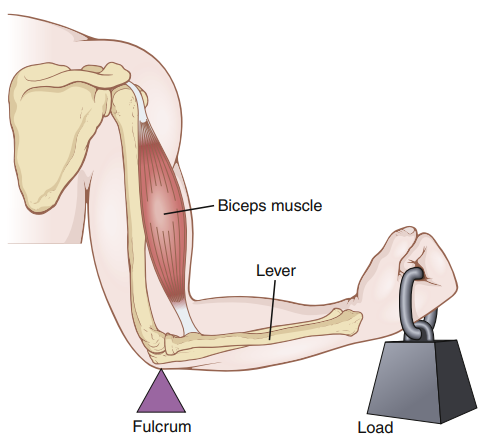 {left=49.58 top=10.03 width=50.42 height=82.22}

Muscles operate by applying
tension to their points of insertion into bones, and the
bones in turn form various types of lever systems.

When the forearm is bent at a right angle, the biceps tendon attaches about 5 cm in front of the elbow, while the forearm length is about 35 cm. 140 kg force is diminished to 20 kg.

Force depends on cross-section and type:
0.3–0.4 MPa skeletal
0.1-0.2 MPa cardiac
0.02-0.05 MPa smooth

---

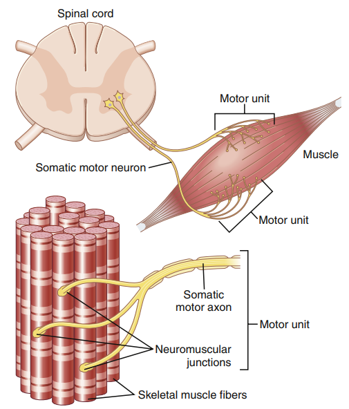 {left=54.86 top=2.96 width=45.14 height=94.07}

Each **motoneuron **that leaves the spinal cord innervates multiple muscle fibers, with the number of fibers innervated depending on the type of muscle. All the muscle fibers innervated by a single nerve fiber are called a **motor unit.** Small muscles that react rapidly and whose control must be exact may have  as few as 2-3 muscle fibers per motor unit (in some of the laryngeal muscles). Large muscles that do not require fine control may have several hundred muscle fibers in a motor unit (the soleus muscle). The muscle fibers in each motor unit are not completely independent but overlap other motor units in microbundles of 3 to 15 fibers.

---

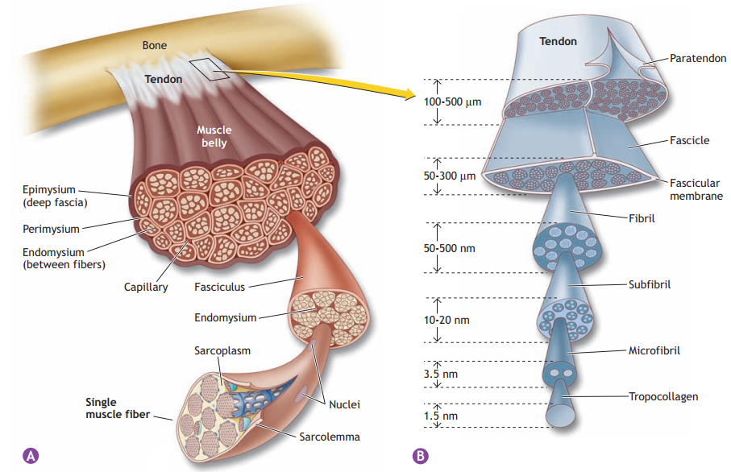 {left=16.75 top=2.96 width=83.25 height=95.62}

---

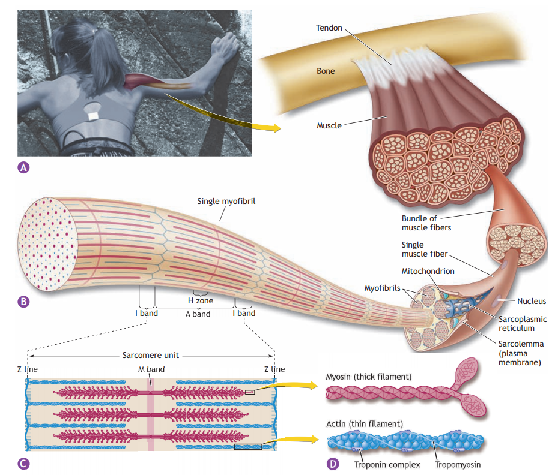 {left=37.93 top=2.96 width=62.07 height=94.07}

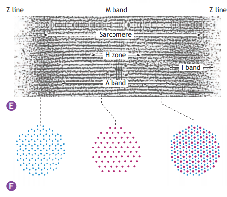 {left=2.33 top=46.55 width=34.60 height=53.45}

---

**Slow Fibers (Type 1, Red Muscle)**

1. Slow fibers are smaller than fast fibers.

2. Slow fibers are also innervated by smaller nerve fibers.

3. Slow fibers have a more extensive blood vessel system and more capillaries to supply extra amounts of oxygen compared with fast fibers,

4. Slow fibers have greatly increased numbers of mitochondria to support high levels of oxidative metabolism.

5. Slow fibers contain large amounts of myoglobin, an iron-containing protein similar to hemoglobin in red blood cells. Myoglobin combines with oxygen
and stores it until needed, which also greatly speeds oxygen transport to the mitochondria. The myoglobin gives the slow muscle a reddish appearance—
hence, the name red muscle.

---

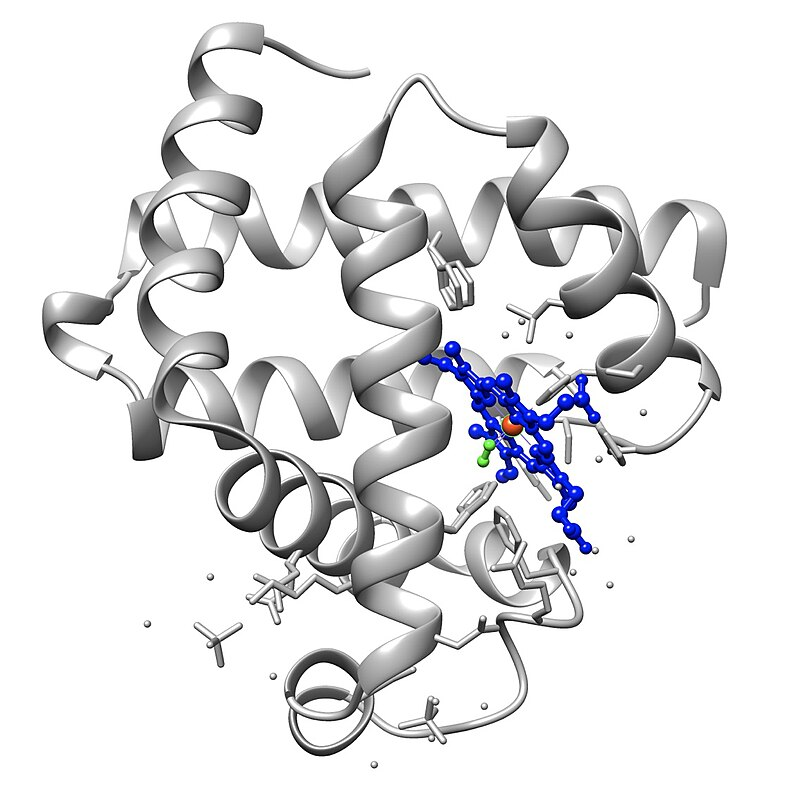 {left=66.97 top=36.99 width=35.09 height=63.01}

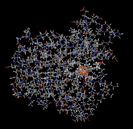 {left=77.79 top=-1.29 width=22.21 height=38.28}

**Myoglobin **

Small, oxygen-binding protein found mainly in muscle tissue.
Stores and releases O₂ to meet high metabolic demands during muscle activity.
Single polypeptide chain (~153 amino acids) with a heme group containing Fe²⁺.
Similar in structure to a subunit of hemoglobin, but monomeric.
Exhibits hyperbolic O₂-binding curve → high oxygen affinity, no cooperativity.
Facilitates oxygen diffusion from blood (hemoglobin) to mitochondria.
Abundant in slow-twitch (red) muscle fibers → enhances endurance.
Myoglobinuria (presence in urine) indicates muscle damage (e.g., rhabdomyolysis).

---

**Fast Fibers (Type II, White Muscle)**

1. Fast fibers are large for great strength of contraction.

2. Fast fibers have an extensive sarcoplasmic reticulum for rapid release of calcium ions to initiate contraction.

3. Large amounts of glycolytic enzymes are present in fast fibers for rapid release of energy by the glycolytic process.

4. Fast fibers have a less extensive blood supply than slow fibers because oxidative metabolism is of secondary importance.

5. Fast fibers have fewer mitochondria than slow fibers, also because oxidative metabolism is secondary. A deficit of red myoglobin in fast muscle gives it the
name white muscle.

---

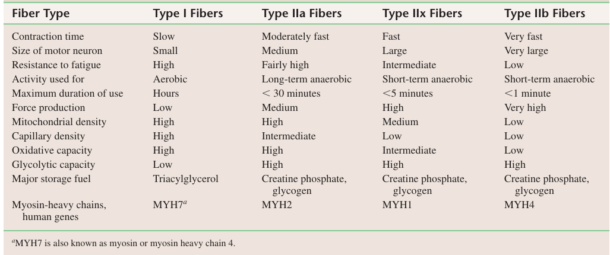 {left=20.25 top=20.08 width=80.39 height=59.84}

**Classification of Human Skeletal Muscle Fiber Types**

---

ST/FT is Genetically determined but it varies widely (e.g. elite marathoners ~70–80% ST, sprinters ~70–80% FT).
Partially adaptable:
Training can shift properties, but not fully convert fiber types.
Endurance training increases oxidative capacity of FT fibers → they become more fatigue-resistant (“type IIa” hybrid fibers).
Strength/sprint training enhances glycolytic enzymes and cross-sectional area of FT fibers.
Complete transformation (I ↔ II) is limited and mostly seen under extreme conditions (denervation, hormonal changes, or long-term electrical stimulation in lab models).
Mitochondria, capillaries, enzymes, and myoglobin content are highly plastic, even if fiber type itself is genetically constrained.

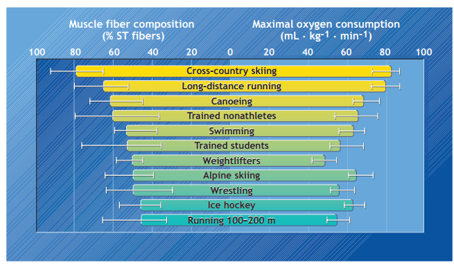 {left=50.90 top=0.00 width=49.10 height=51.04}

ST = slow twitch, type 1, red muscles
FT = fast twitch, type 2, white muscles
 
Genetics strongly influences the sport where you can excel — but training determines how close you get to your potential.

---

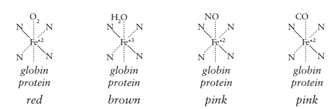 {left=57.81 top=0.00 width=42.19 height=24.55}

Red meat (like beef, lamb, or duck) comes from muscles with many red fibers, hence high myoglobin content.
White meat (like chicken breast or fish) comes from fast-twitch fibers, which have less myoglobin and rely more on anaerobic metabolism.

When cooked, myoglobin changes color (left to right): In raw meat, the oxygen-carrying myoglobin is red; in cooked meat, the oxidized, denatured form of myoglobin is brown; in meats cured with nitrite, including corned beef and ham, the myoglobin assumes a stable pink form (NO is nitric oxide, a product of nitrite); and in uncured meats cooked in a charcoal grill or gas oven, traces of carbon monoxide (CO) accumulate and produce another stable pink form.

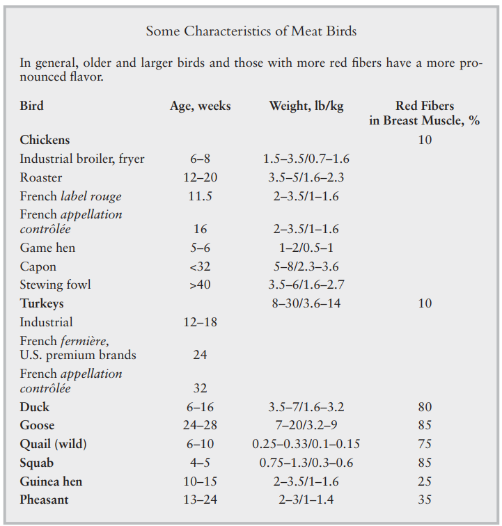 {left=57.81 top=24.55 width=42.19 height=75.45}

---

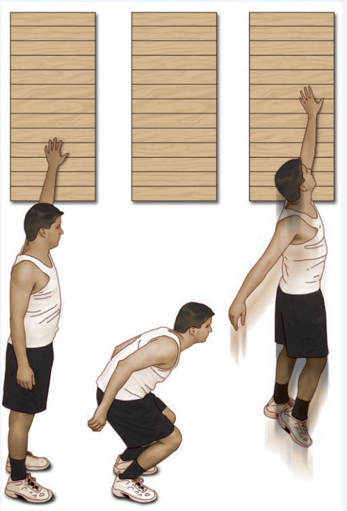 {left=64.07 top=2.96 width=35.93 height=94.07}

**1.** Establish standing reach height. The subject, standing with the preferred shoulder adjacent to a wall and feet flat on the floor, reaches as high as possible to touch the wall. The starting point (standing reach height) represents the distance from the wall mark (middle finger) to the floor, recorded in centimeters.
**2.** Bend the knees to about a 90° angle while moving the arms back in a winged position.
**3.** Thrust forward and upward, touching as high as possible on the wall.
**4.** At a minimum, perform three trials of the jump test, using the highest score as the vertical height. An average of the last 3 trials of 10 provides a more dependable jump height.
**5.** Compute vertical jump height (cm) as the difference between standing reach height and vertical height achieved in the jump.

**Immediate anaerobic power output**

PAPw =  60.7 (VJcm) + 45.3 (BMkg) - 2055

power output in watts (PAPw) 
vertical jump height in cm (VJcm) 
body mass in kilograms (BMkg)

---

The average peak power output measured with this vertical jump protocol averages:
4620.2 (SD ± 822.5) W for males 
2993.7 (SD ± 542.9) W for females.
elite male sprinters can reach >20 W/kg peak anaerobic power
trained endurance athletes rarely exceed 12 W/kg

High PAPO → sprinters, jumpers, weightlifters, hockey players.
Moderate PAPO + high lactate tolerance → 400 m runners, rowers.
Low PAPO but high aerobic efficiency → endurance athletes.

---

Neuromuscular junction

Telling muscles to contract

---

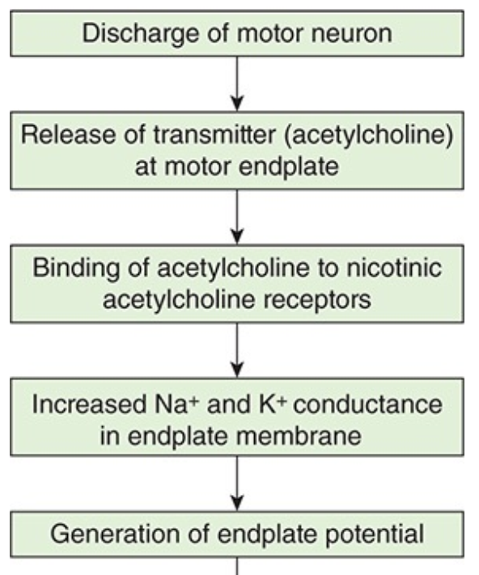 {left=16.52 top=-0.00 width=31.45 height=65.17}

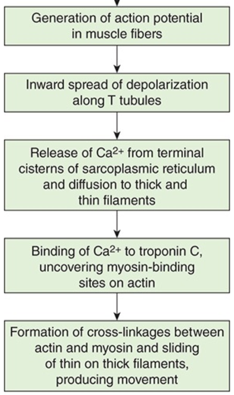 {left=64.42 top=4.35 width=31.45 height=92.69}

**Steps in muscle contraction**

---

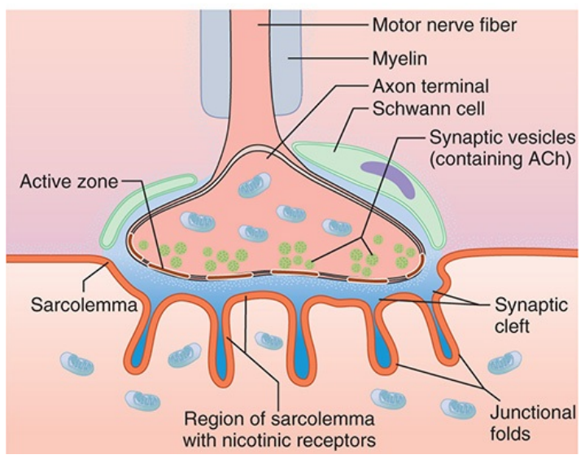 {left=58.78 top=1.47 width=41.22 height=57.48}

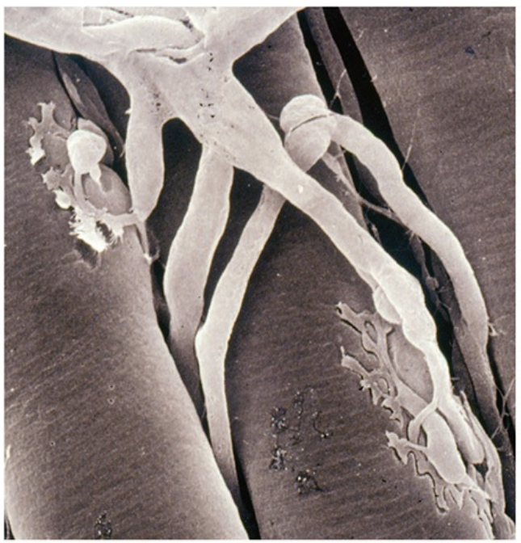 {left=20.07 top=0.00 width=38.72 height=71.71}

Scanning electron micrograph
showing branching of motor axons with terminals embedded in grooves in the muscle fiber’s surface.

Structure of a neuromuscular junction. ACh, acetylcholine.

---

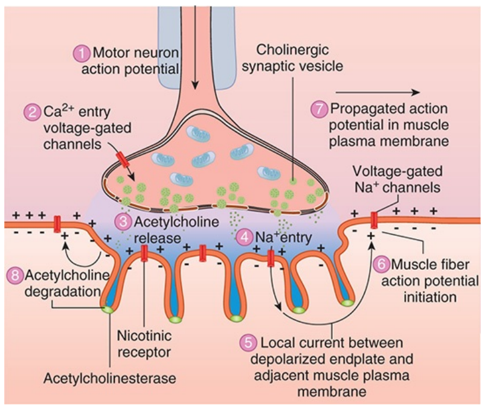 {left=53.32 top=5.34 width=47.52 height=71.12}

The impulse arriving in the end of the motor neuron increases the permeability of its endings to Ca2+, which enters the endings and triggers exocytosis of the acetylcholine (ACh)-containing synaptic vesicles. ACh diffuses and binds to nicotinic cholinergic (NM) receptors in the motor endplate, which increases Na+ and K+ conductance. The resultant influx of Na+ produces the endplate potential. The current sink created by this local potential depolarizes the adjacent muscle membrane to its firing level. Action potentials are generated on either side of the endplate and are conducted away from the endplate in both directions along the muscle fiber and the muscle contracts. ACh is then removed from the synaptic cleft by acetylcholinesterase.

---

**Quantal Release at the Neuromuscular Junction**

Each nerve impulse releases ~60 synaptic vesicles, each containing ~10,000 ACh molecules.
At rest, small quanta of ACh are released randomly → miniature endplate potentials (MEPPs) ≈ 0.5 mV.
Ca²⁺ ↑ concentration at the endplate → ↑ size of quanta released
Mg²⁺ ↑ concentration at the endplate → ↓ size of quanta released
A nerve impulse triggers massive vesicle release → endplate potential exceeds threshold, causing muscle contraction.
Quantal release also occurs at noradrenergic, glutamatergic, and other synapses.
Disorders affecting this process:
Myasthenia gravis
Lambert-Eaton myasthenic syndrome

---

**Myasthenia Gravis**

Autoimmune disease causing skeletal muscle weakness and fatigue
Incidence: 25–125 / million
Bimodal age distribution:
20s → mainly women
60s → mainly men
Major symptom: fatigue that worsens with activity

**Mechanism**
Antibodies attack nicotinic ACh receptors at the neuromuscular junction
→ Receptor destruction and endocytosis of clusters
↓ ACh receptors (−70–90%)
↓ Postsynaptic response to ACh
Structural changes: shallow, widened, or missing synaptic clefts

---

**Clinical & Genetic Features**

Two main forms:
Ocular → eye muscles
Generalized → limb + respiratory muscles
Fatigue worsens with repeated stimulation
May associate with:
Rheumatoid arthritis, lupus, polymyositis
Thymic abnormalities:
Hyperplasia (most)
Thymoma (10–15%)
~30% have family history of autoimmune disease

**Treatment**

Rest or acetylcholinesterase inhibitors (e.g. neostigmine, pyridostigmine) → ↑ ACh at synapse
Immunosuppressants: prednisone, azathioprine, cyclosporine
Thymectomy:
If thymoma present
Even without thymoma → 35% remission, 45% improvement

---

**Lambert–Eaton Myasthenic Syndrome (LEMS)**

**Cause:**
Autoimmune attack on voltage-gated Ca²⁺ channels at presynaptic nerve endings → ↓ Ca²⁺ influx → ↓ acetylcholine release
**Epidemiology:**
~1 / 100,000 people (adult onset)
Men ≈ Women
**Clinical Features:**
Weakness in proximal lower limb muscles → waddling gait, difficulty lifting arms
Improves with repetitive stimulation (↑ Ca²⁺ accumulation) ↔ opposite of myasthenia gravis
**Associations:**
~40% cases with small-cell lung cancer
May also occur with thymoma or other cancers (lymphosarcoma, breast, colon, etc.)
Can be induced by aminoglycoside antibiotics
**Treatment:**
Treat underlying cancer (if present)
Immunotherapy: prednisone, plasmapheresis, IV immunoglobulin
Aminopyridines: ↑ ACh release (block K⁺ channels → activate Ca²⁺ channels)
AChE inhibitors: limited effect

---

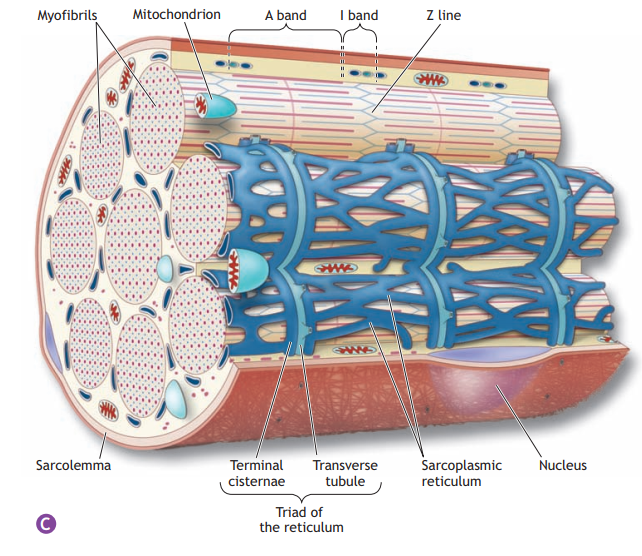 {left=62.82 top=2.96 width=37.18 height=57.25}

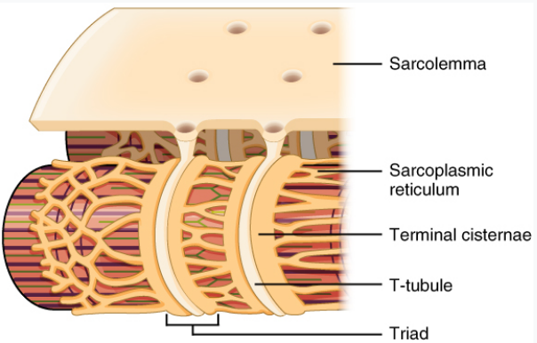 {left=17.24 top=0.00 width=45.58 height=51.78}

During development, myoblasts (muscle precursor cells) fuse together. This fusion creates one long, multinucleated cell — a muscle fiber that can contain hundreds of nuclei. Action potential (step 7 prev. slide) travels into the muscle fiber interior through T-tubules.
Muscle (organ) → made of many muscle fibers (cells)
Muscle fiber (cell) → contains many myofibrils
Myofibril → made up of repeating sarcomeres
Sarcomere → contains actin (thin) and myosin (thick) filaments

---

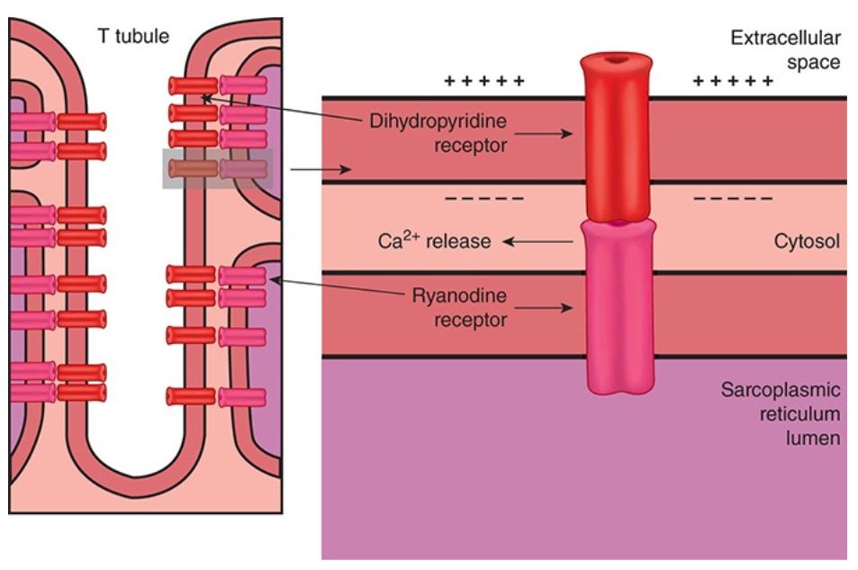 {left=41.12 top=2.96 width=58.88 height=69.53}

In skeletal muscle, the voltage-gated **dihydropyridine **receptor in the T tubule triggers Ca2+ release from the sarcoplasmic reticulum (SR) via the **ryanodine **receptor (RyR). Upon sensing a voltage change, there is a physical interaction between the sarcolemmal-bound DHPR and the SR-bound RyR. This
interaction gates the RyR and allows for Ca2+ release from the SR.

**In skeletal muscle ****dihydropyridine and ryanodine receptors are physically connected, but not in cardiac muscle! **** **

---

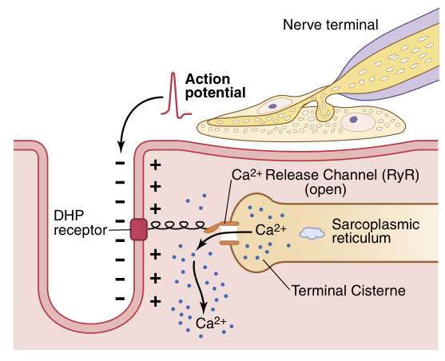 {left=66.49 top=0.00 width=33.51 height=48.35}

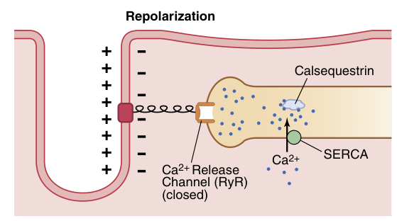 {left=17.51 top=0.46 width=47.81 height=47.44}

Excitation-contraction coupling in skeletal muscle. The right panel shows an action potential in the transverse tubule that causes a conformational change in the voltage-sensing dihydropyridine (DHP) receptors, opening the ryanodine (RyR) Ca2+ release channels in the terminal cisternae of the sarcoplasmic reticulum and permitting Ca2+ to diffuse rapidly into the sarcoplasm and initiate muscle contraction. During repolarization (left panel), the conformational change in the DHP receptor closes the Ca2+ release channels, and Ca2+ is transported from the sarcoplasm into the sarcoplasmic reticulum by an adenosine triphosphate- dependent calcium pump, called SERCA (sarcoplasmic reticulum Ca2+- ATPase).

---

Excitation-contraction coupling in the muscle, showing an action potential that causes release of calcium ions from the sarcoplasmic reticulum and then reuptake of the calcium ions by a calcium pump. ATP, Adenosine triphosphate.

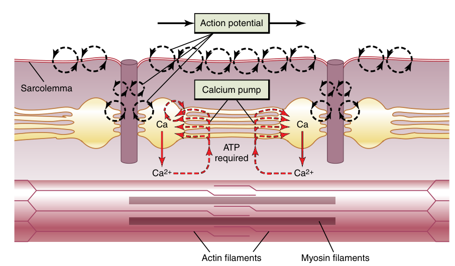 {left=23.95 top=0.00 width=76.05 height=79.09}

---

**Malignant Hyperthermia (MH)**

A life-threatening hypermetabolic reaction of skeletal muscle triggered by certain drugs in genetically susceptible individuals.
It’s caused by uncontrolled Ca²⁺ release from the sarcoplasmic reticulum.
**Triggers:** Volatile anesthetics(Halothane, Sevoflurane, Desflurane, Isoflurane), Depolarizing muscle relaxant (Succinylcholine - the most classic trigger). These agents abnormally activate the ryanodine receptor (RyR1) or dihydropyridine receptor, leading to massive Ca²⁺ release inside muscle cells.
**Reason:** mutation in RYR1 (ryanodine receptor type 1) or less commonly CACNA1S (DHPR α1 subunit). Result → Ca²⁺ floods the cytosol → sustained contraction → heat, acidosis, and cell damage.
**Treatment: **Immediate administration of dantrolene, a RyR1 antagonist that stops Ca²⁺ release, symptomatic (cool the patient, correct acidosis and electrolyte imbalance).
Incidence ≈ 1:10,000–1:250,000 anesthetic procedures.
Carriers are usually asymptomatic until exposed to triggering agents.

---

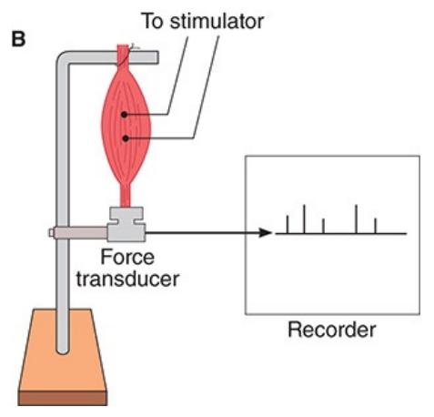 {left=61.81 top=0.00 width=38.19 height=65.19}

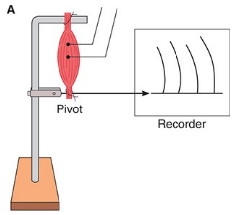 {left=15.98 top=0.00 width=40.23 height=65.19}

A) Muscle preparation arranged for recording **isotonic contractions.**
The muscle is fastened to a writing lever that swings on a pivot.

B) Preparation arranged for
recording **isometric contractions**. It is attached to an electronic transducer that measures the force generated without permitting the muscle to shorten.

---

**Single twitch**: A single action potential produces one brief contraction and relaxation.
**Summation of contractions**: When stimuli arrive before the muscle fully relaxes, Ca²⁺ remains elevated — producing stronger contractions.
**Incomplete tetanus**: Rapid, repeated stimuli cause contractions to partially fuse, with small relaxation intervals.
**Complete tetanus**: Very high stimulation frequency causes continuous, maximal tension with no relaxation phase.
Mechanism: Increased intracellular Ca²⁺ keeps troponin–tropomyosin complex shifted, allowing continuous cross-bridge cycling.
Physiological role: Allows smooth, sustained muscle contractions for posture and movement.

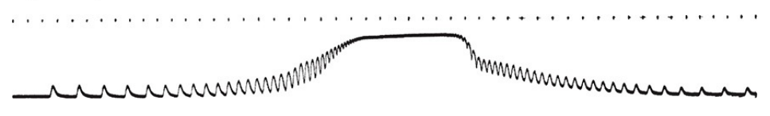 {left=19.42 top=0.00 width=80.58 height=21.63}

**Tetanus**. Isometric tension of a single muscle fiber during continuously increasing and decreasing stimulation frequency. Dots at the top are at intervals of 0.2 s. Note the development of incomplete and then complete tetanus as stimulation is increased, and the return of incomplete tetanus, then full response, as stimulation frequency is decreased.

---

Contraction

On the molecular level

---

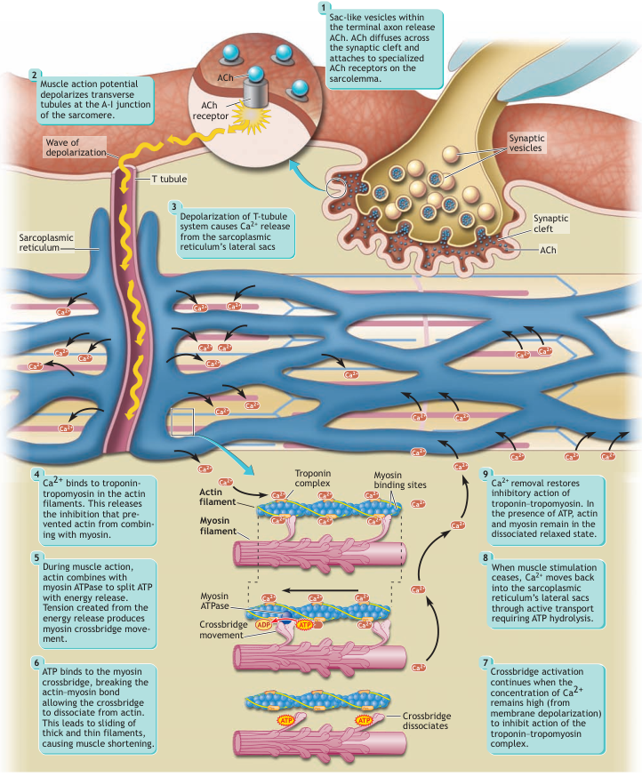 {left=53.53 top=0.00 width=46.47 height=100.00}

**Step 1:** Generation of an action potential in the motor neuron causes the small, saclike vesicles within the terminal axon to release acetylcholine (ACh). ACh diffuses across the synaptic cleft and attaches to specialized ACh receptors on the sarcolemma. Almost perfect symmetry exists between the “imprint” of the presynaptic vesicles that contain ACh and the “imprint” of the postsynaptic receptors that capture ACh.
**Step 2:** The muscle action potential depolarizes the transverse tubules at the sarcomere’s A–I junction. Step 3: Depolarization of the T-tubule system causes Ca2+ release from the lateral sacs (terminal cisternae) of the sarcoplasmic reticulum.
**Step 4:** Ca2+ binds to troponin–tropomyosin in the actin filaments. This releases the inhibition that prevented actin from combining with myosin.
**Step 5:** During muscle action, actin combines with myosin–ATP. Actin also activates the enzyme myosin ATPase, which then splits ATP. The reaction’s energy produces myosin crossbridge movement and creates tension.
**Step 6:** ATP binds to the myosin crossbridge; this breaks the actin–myosin bond and allows the crossbridge to dissociate from actin. The thick and thin filaments then slide past each other and the muscle shortens.
**Step 7:** Crossbridge activation continues when Ca2+ concentration remains high enough (from membrane depolarization) to inhibit the troponin–tropomyosin system.
**Step 8:** When muscle stimulation ceases, intracellular Ca2+ concentration rapidly decreases as Ca2+ moves back into the lateral sacs of the sarcoplasmic reticulum through active transport that requires ATP hydrolysis.
**Step 9:** Ca2+ removal restores the inhibitory action of troponin–tropomyosin. In the presence of ATP, actin and myosin remain in the dissociated, relaxed state.

---

In eukaryotic cells, motor proteins act on structural elements such as actin filaments and microtubules to generate the movements that allow the cells to reorganize their contents, change their shape, and even crawl or swim. For example, muscle contraction is accomplished by the motor protein myosin pulling on actin filaments.

The proteins on which we will focus in this lecture move along actin and microtubules— protein filaments composed of repeating subunits. 

The motor proteins cycle between forms having high or low affinity for the filament tracks in response to ATP binding and hydrolysis, enabling a bind, pull, and release mechanism that generates motion.

---

**Eukaryotic cells contain three major families of motor proteins: **

**Myosins.** First characterized on the basis of its role in muscle. Move along filaments of the protein actin. Each molecule of muscle myosin consists of two copies each of a heavy chain with a molecular mass of 220 kDa, an essential light chain, and a regulatory light chain. The human genome encodes more than 40 distinct myosins; some function in muscle contraction, and others participate in a variety of other processes. 

**Kinesins**. have roles in protein, mRNA, and vesicle transport as well as construction of the mitotic spindle and chromosome segregation, are generally dimers of two polypeptides. The human genome encodes more than 40 kinesins.

**Dyneins.** Power the motion of cilia and flagella, and a general cytoplasmic dynein contributes to a variety of motions in all cells, including vesicle transport and various transport events in mitosis. Dyneins are enormous, with heavy chains of molecular mass greater than 500 kDa. The human genome encodes approximately 10 dyneins.

---

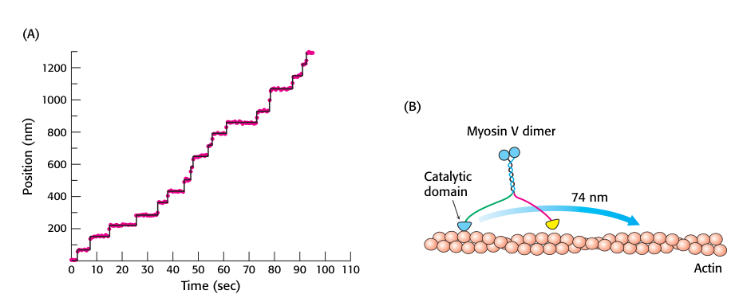 {left=19.25 top=0.00 width=80.75 height=59.40}

**Single molecule motion.** 

(A) A trace of the position of a single dimeric myosin V molecule as it moves across a surface coated with actin filaments. 

(B) A model of how the dimeric molecule moves in discrete steps with an average size of 74 6 5 nm.

---

**Structural Similarities of Motor Proteins**

Early sequence comparisons of myosins, kinesins, and dyneins showed little similarity.
3D structures later revealed remarkable structural parallels between myosin and kinesin.
Both contain P-loop NTPase cores, similar to those in G proteins.
Dynein belongs to the AAA subfamily of P-loop NTPases (like in the 19S proteasome).
Dynein’s heavy chain has six P-loop NTPase domains, four of which bind nucleotides.
These shared motifs suggest related molecular mechanisms across all three motor families.

---

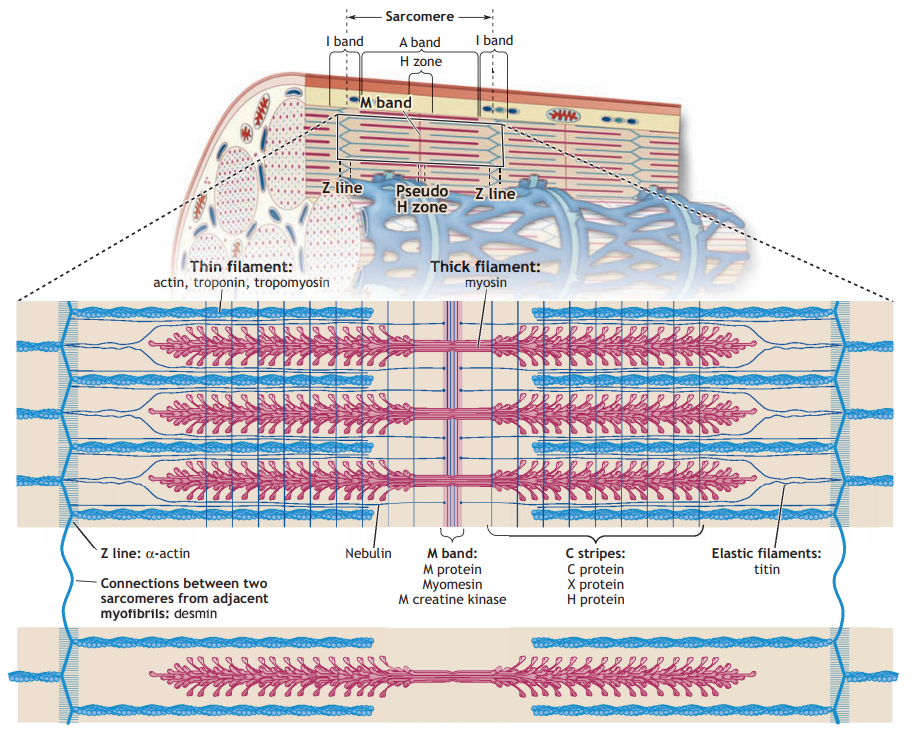 {left=33.80 top=1.48 width=66.20 height=94.07}

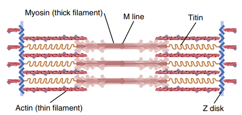 {left=0.00 top=-0.00 width=40.95 height=34.76}

---

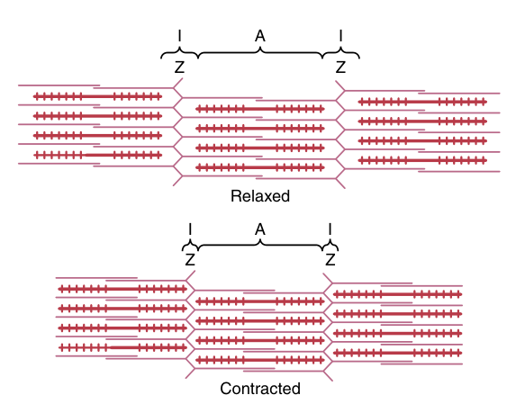 {left=65.65 top=0.00 width=32.88 height=45.02}

**Up**, Relaxed and contracted states of a myofibril showing (top) sliding of the actin filaments (pink) into the spaces between the myosin filaments (red) and (bottom) pulling of the Z membranes toward each other.

**A**, Myosin molecule. 

**B**, Combination of many myosin
molecules to form a myosin filament. Also shown are thousands of myosin cross- bridges and interaction between the heads of the cross-
bridges with adjacent actin filaments.

Actin filament composed of two helical strands of F- **actin **molecules and two strands of **tropomyosin **molecules that fit in the grooves between the actin strands. Attached to one end of each tropomyosin molecule is a **troponin **complex that initiates contraction.

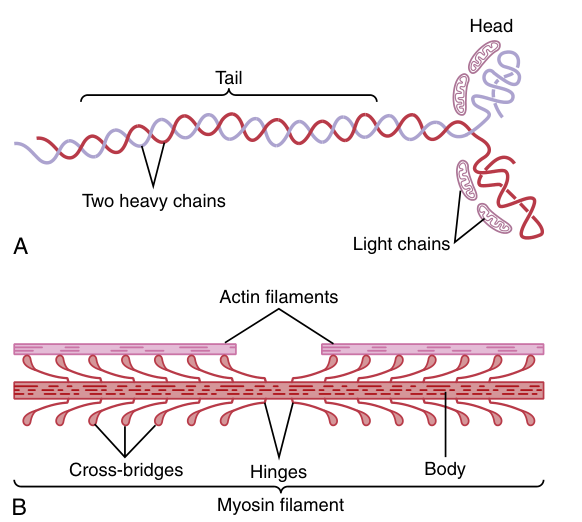 {left=65.65 top=45.23 width=34.35 height=54.77}

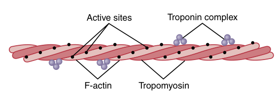 {left=16.41 top=75.41 width=46.40 height=24.59}

---

**Myosin Filaments**
**Myosin molecule:**
Molecular weight ≈ 480 kDa
2 heavy chains (≈ 200 kDa each) + 4 light chains (≈ 20 kDa each)
Heavy chains → twisted tail + two globular heads
Light chains → regulate head function
**Myosin filament structure:**
≈ 200 myosin molecules per filament (≈ 1.6 µm long)
Central region → tails bundled (tail core)
Heads project outward → **cross-bridges**
Each cross-bridge has two flexible **hinges** allowing motion
**Spatial arrangement:**
No cross-bridges in central 0.2 µm region
Heads rotated 120° around the filament → full coverage
**Functional feature:**
Myosin head acts as an **ATPase**, splitting ATP to power contraction

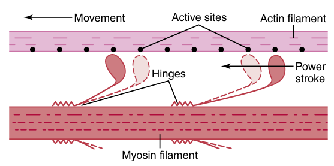 {left=57.84 top=31.37 width=42.16 height=37.27}

---

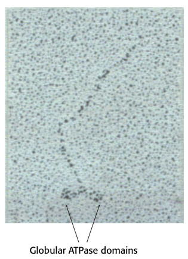 {left=15.52 top=0.00 width=24.21 height=59.45}

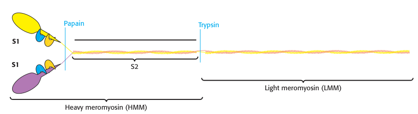 {left=39.73 top=-0.00 width=60.27 height=29.34}

Treatment of muscle myosin with proteases forms stable fragments, including subfragments S1 and S2 and light meromyosin. Each S1 fragment includes a head (shown in yellow or purple) from the heavy chain and one copy of each light chain (shown in blue and orange).

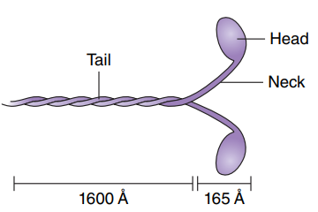 {left=15.52 top=61.75 width=24.21 height=28.70}

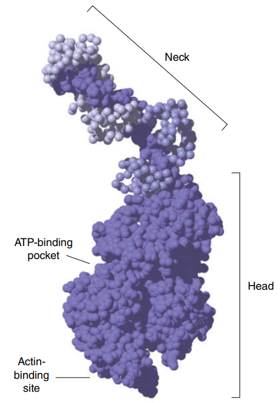 {left=72.17 top=28.85 width=27.83 height=71.15}

---

**Actin, Tropomyosin & Troponin**
**Actin filament:**
Backbone: double helix of F-actin (polymers of G-actin)
Each G-actin (≈ 42 kDa) binds ADP → active site for myosin head
Active sites repeat every ≈ 2.7 nm
Anchored in Z-disks; ≈ 1 µm long
**Tropomyosin:**
Long protein (≈ 70 kDa, 40 nm) wound around F-actin
In rest → covers active sites → prevents myosin binding
During contraction → moves to uncover active sites
**Troponin complex:**
3 subunits:
TnI – binds actin
TnT – binds tropomyosin
TnC – binds Ca²⁺
Ca²⁺ binding to TnC → conformational change → moves tropomyosin → starts contraction

 {left=58.14 top=56.75 width=40.73 height=21.58}

---

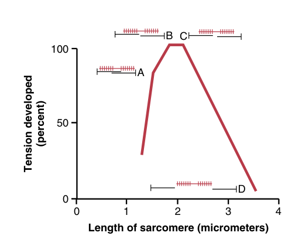 {left=66.26 top=33.78 width=36.79 height=51.07}

**Sliding Filament Mechanism of Muscle Contraction**
**Relaxed State: ** Actin filaments from adjacent Z-disks barely overlap.
**Contracted State: **Actin filaments slide inward between myosin filaments until they overlap maximally.  Z-disks are pulled toward the center of the sarcomere.
**What Drives the Sliding?**
**Cross-bridges** on myosin interact with **actin** to generate force.
At rest, these forces are **inactive**.
When an **action potential** reaches the muscle fiber:
The **sarcoplasmic reticulum releases Ca²⁺**,
Ca²⁺ activates actin–myosin interactions
**Energy Source**
The process requires **ATP**.
**ATP → ADP + energy**, powering cross-bridge movement and filament sliding.

---

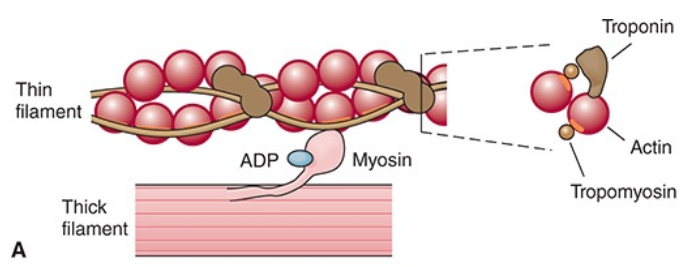 {left=17.52 top=0.00 width=41.57 height=28.39}

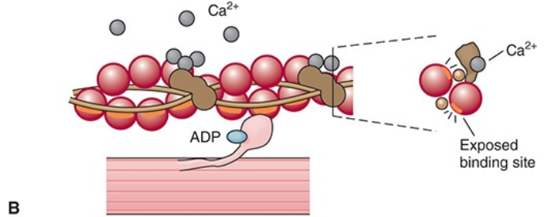 {left=17.85 top=28.10 width=40.92 height=28.39}

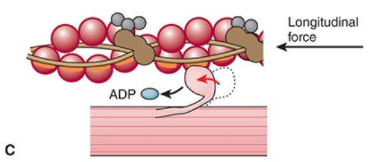 {left=17.52 top=58.56 width=30.77 height=24.09}

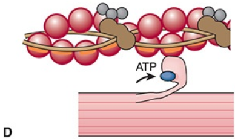 {left=60.14 top=-0.00 width=21.64 height=22.80}

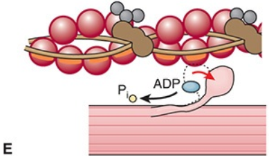 {left=60.14 top=28.39 width=21.98 height=22.80}

**Power stroke of myosin in skeletal muscle. A)** At rest, myosin
heads are bound to adenosine diphosphate and are said to be in a “cocked” position in relation to the thin filament, which does not have Ca2+ bound to the troponin-tropomyosin complex. **B)** Ca2+ bound to the troponin-tropomyosin complex induces a conformational change in the thin filament that allows for myosin heads to cross-bridge with thin filament actin. **C)** Myosin heads rotate, move the attached actin, and shorten the muscle fiber, forming the power stroke. **D)** At the end of the power stroke, ATP binds to a now exposed site and causes a detachment from the actin filament. **E)** ATP is hydrolyzed into ADP and inorganic phosphate (Pi) and this chemical energy is used to “re-cock” the
myosin head

---

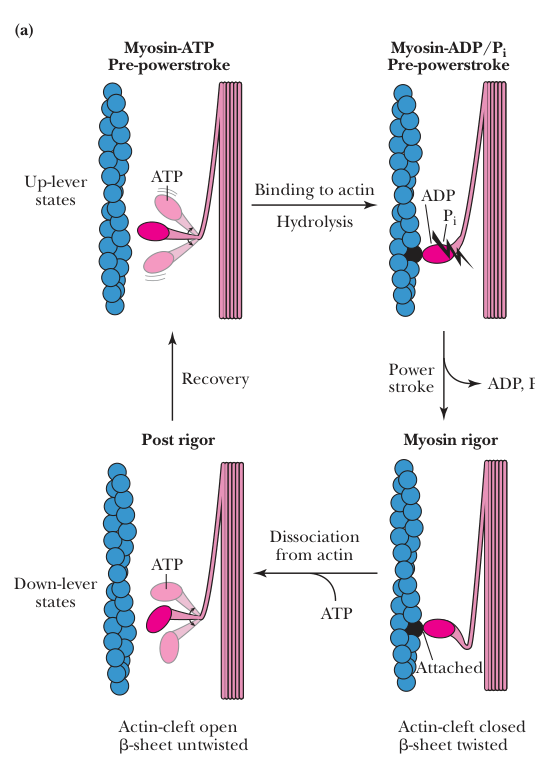 {left=68.82 top=-1.48 width=32.34 height=81.79}

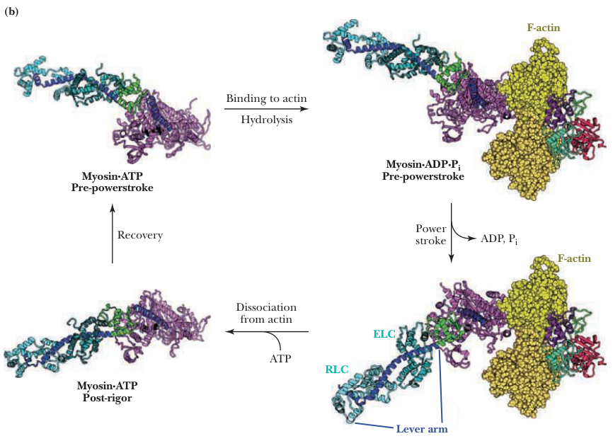 {left=25.89 top=51.58 width=36.47 height=46.64}

**The mechanism of skeletal muscle contraction.** 
**(a)** A scheme for the contraction cycle. ATP binding to the myosin head dissociates the strongly bound actomyosin rigor complex. During the recovery step, which occurs with ATP bound, the myosin head can move freely up and down. ATP hydrolysis occurs only in the up state. Binding to actin occurs with ATP hydrolysis. The power stroke is accompanied by dissociation of ADP and Pi and results in net movement of the myosin head along the actin filament. **(b)** Structures representing the four states depicted in part (a)

---

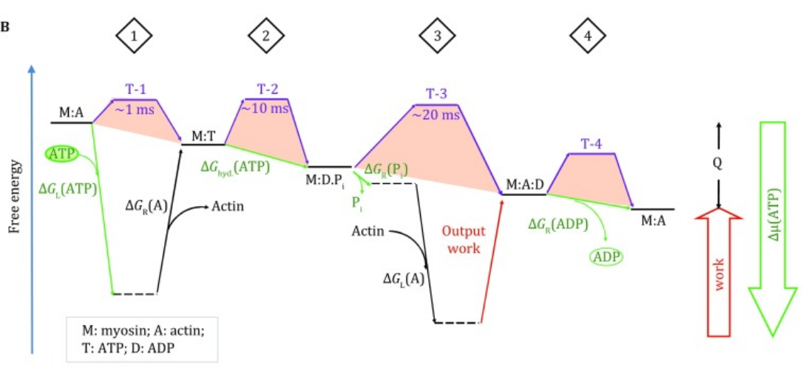 {left=38.67 top=50.00 width=61.33 height=50.00}

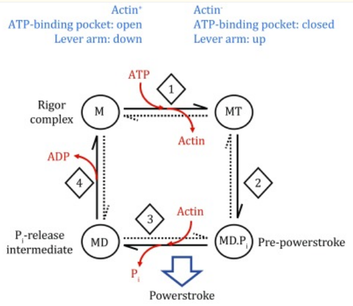 {left=66.06 top=0.00 width=33.94 height=52.31}

ATP Binding → Actin–Myosin Detachment
Tight ATP binding releases myosin from actin, using the free energy of ATP binding.

Search Phase (Actin⁻ State)
Myosin lever arm relaxes from its high-energy “up” position.
The detached head performs a biased Brownian search for a new actin site.
ATP hydrolysis occurs during this phase.

Rebinding and Powerstroke
Upon finding a new site, myosin binds weakly → then strongly.
Tight binding releases ADP·Pi, driving the lever-arm swing (powerstroke) that moves the cargo.

Load Dependence:
- Heavy load: slows ADP release → increases duty ratio → slower movement.
- Light load: faster ADP release → longer steps and faster motion.

The mechanism explains actomyosin energy coupling without invoking large internal deformations, instead relying on thermodynamic partitioning of ATP energy.

---

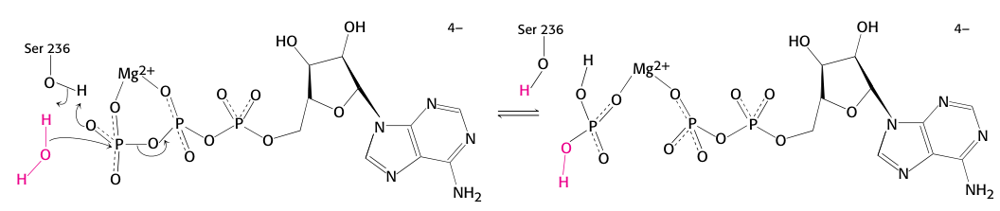 {left=17.83 top=6.62 width=80.92 height=30.38}

The water molecule attacking the g-phosphoryl group of ATP is deprotonated by the hydroxyl group of Ser 236, which, in turn, is deprotonated by one of the oxygen
atoms of the g-phosphoryl group forming the H2PO4- product. Thus, in effect, the ATP serves as a base to promote its own hydrolysis.

Note that previously presented mechanism relies on long lasting complex miosine-ADP-Pi, so there should be some evidence of these! Myosin spends most of its cycle in this “primed” ADP·Pi state.

See <u>https://pmc.ncbi.nlm.nih.gov/articles/PMC5334417/</u> for details to previous slide

---

Myosins turn over ~1 ATP per second → unusually slow for an enzyme.

18O Labeling Experiment
ATP hydrolysis studied using H₂¹⁸O (water with heavy oxygen).
Product phosphate contained 2–3 oxygens from water, not just 1.
**Conclusion:** ATP hydrolysis is reversible inside the myosin active site.

Enzyme-Bound Equilibrium
Free ATP hydrolysis: K ≈ 1.4 × 10⁵ (strongly favorable).
On enzyme: K ≈ 10 → near equilibrium between ATP and ADP·Pi.
**Reason:** enzymes stabilize the transition state, equalizing reactant/product energies.

Rate-Limiting Step
Hydrolysis itself ≠ rate-limiting.
Product release, especially Pi release, is rate-limiting.

Functional Implication
Myosin often holds ADP + Pi before release.
This persistence allows tight coupling between chemical energy and mechanical movement.

---

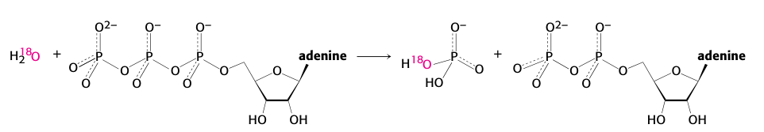 {left=20.42 top=0.00 width=78.24 height=21.09}

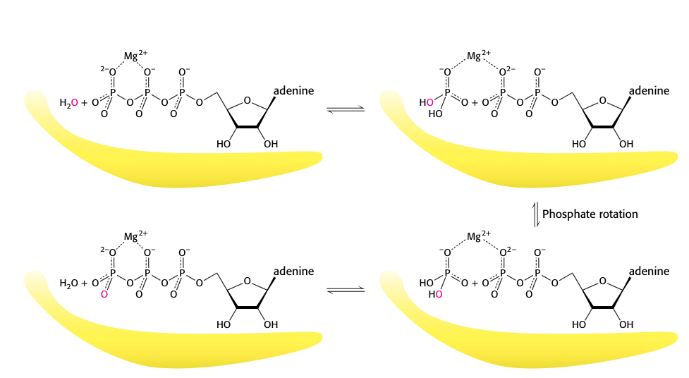 {left=34.44 top=27.73 width=65.56 height=63.94}

For myosin, more than one atom of oxygen from water is incorporated in inorganic phosphate. The oxygen atoms are incorporated in cycles of hydrolysis of ATP to ADP and inorganic phosphate, phosphate rotation within the active site, and reformation of ATP now containing oxygen from water.

---

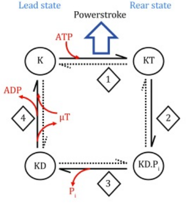 {left=72.43 top=0.00 width=27.57 height=53.61}

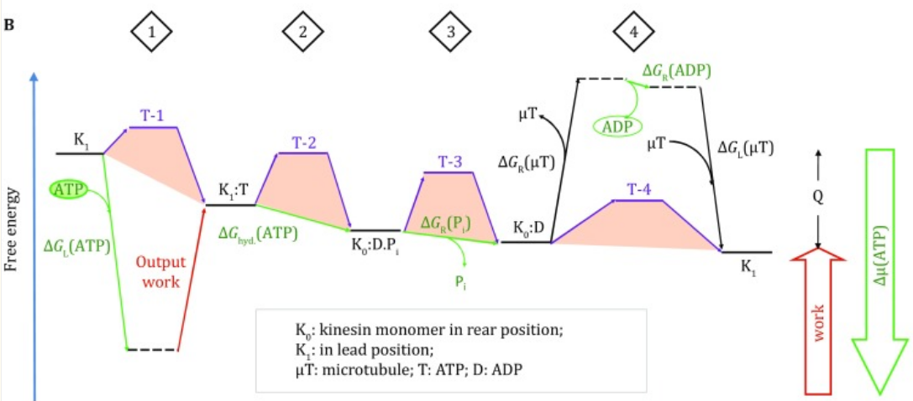 {left=17.30 top=48.77 width=65.39 height=51.23}

**Kinesin**

Two-state, four-step model of a **kinesin **protomer. (top) King–Altman diagram of the model of the kinesin–microtubule system. (bottom) Free-energy landscape of the functional cycle of a kinesin protomer

---

Muscle Energetics

Spending energy wisely

---

**Efficiency of Muscle Contraction.**

The percentage of the input energy to muscle (the chemical energy in nutrients) that can be converted into work, even under the best conditions, is **less than 25%**, with the remainder becoming heat. 

The reason for this low efficiency is that about one-half of the energy in foodstuffs is lost during the formation of ATP and, even then, only 40% to 45% of the energy in ATP itself can later be converted into work. 

Depends on contraction velocity:
**Slow contraction**: small amounts of maintenance heat are released during contraction, even though little or no work is performed, thereby decreasing the conversion efficiency to as little as zero.
**Moderate velocity (about 30% of maximum): maximal efficiency.**
**Rapid contraction: **much of the energy is used to overcome viscous friction within the muscle itself, and this too reduces the efficiency of contraction.

---

**Energy uses during contraction**
Cross-bridge cycling (“walk-along” mechanism)
Ca²⁺ reuptake into sarcoplasmic reticulum
Na⁺/K⁺ pumping to maintain membrane potential
**ATP supply**
Stored ATP ≈ 4 mM → lasts **1–2 s** of maximal contraction
ADP is rapidly rephosphorylated to ATP by three energy systems:
** 1. Phosphocreatine System**
**Phosphocreatine (PCr)** stores high-energy phosphate bonds
Transfers phosphate to ADP → regenerates ATP instantly
Supply lasts **~5–8 s** of maximal effort
Provides **immediate energy** (sprints, power lifts)

**2. Glycolytic System**
**Breakdown of glycogen → pyruvate/lactate + ATP**
Works **without oxygen** (anaerobic)
~2.5× faster ATP formation than oxidative metabolism
Supports activity for **up to ~1 min**, but lactic acid accumulation limits duration
**3. Oxidative Metabolism**
**Oxygen + pyruvate/fatty acids/amino acids → ATP**
Supplies **>95%** of ATP for long-term contraction
Dominates during **aerobic, sustained exercise**
**Fuel sources:**
Short-to-medium duration (2–4 h): ~½ from carbohydrates
Very long duration (hours+): mostly from fats

**Three Sources of Energy for Muscle Contraction**

---

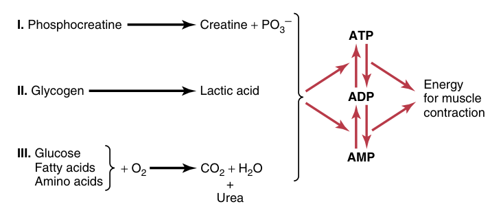 {left=17.19 top=0.00 width=47.96 height=37.02}

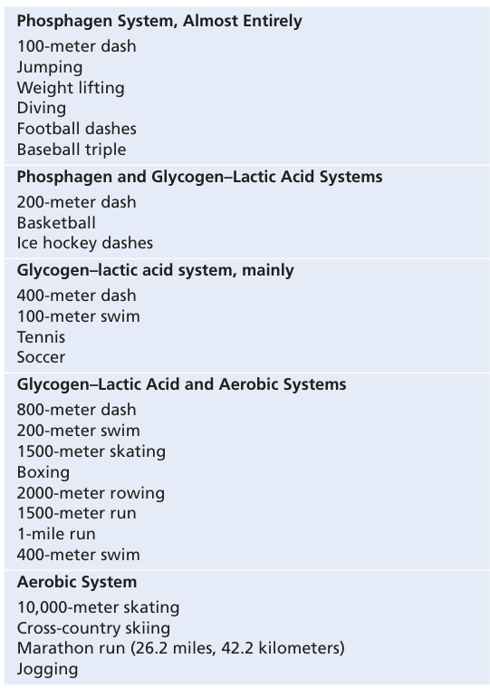 {left=69.62 top=5.93 width=30.38 height=94.07}

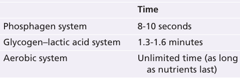 {left=17.19 top=37.02 width=38.35 height=22.35}

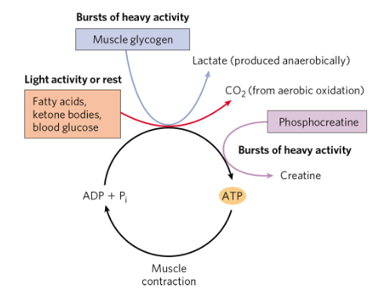 {left=40.01 top=59.37 width=29.61 height=40.63}

**Energy sources for muscle contraction.** Different fuels are used for ATP synthesis during bursts of heavy activity and during light activity or rest. Phosphocreatine can rapidly supply ATP.

---

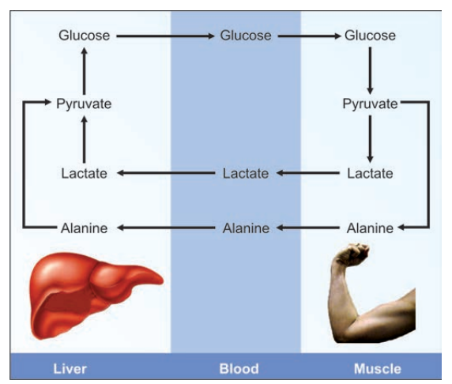 {left=50.00 top=0.00 width=50.00 height=75.52}

**Cori cycle and Cahill cycle**

**i.** Alanine is transported to liver, transaminated to pyruvate and converted to glucose. This glucose may again enter the glycolytic pathway to form pyruvate, which in turn, can be transaminated to alanine.
**ii.** Glucose-alanine cycle is important in conditions of
starvation. Thus net transfer of amino acid (nitrogen) from muscle to liver and corresponding transfer
of glucose (energy) from liver to muscle is affected.
**iii.** Alanine cycle is intimately related with Cori's cycle.

---

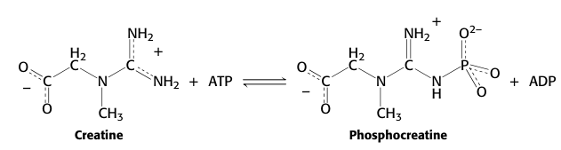 {left=20.86 top=1.48 width=65.73 height=31.30}

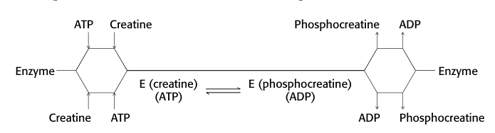 {left=18.36 top=39.30 width=72.40 height=34.81}

Creatine phosphokinase (CPK)

---

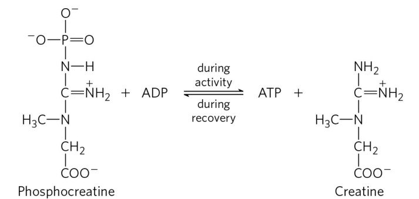 {left=54.35 top=0.00 width=45.65 height=38.59}

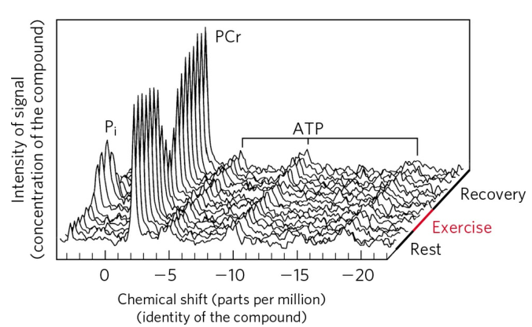 {left=54.35 top=50.00 width=45.65 height=49.95}

**Phosphocreatine buffers ATP concentration during exercise.** A “stack plot” of magnetic resonance spectra (of 31P) shows inorganic phosphate (Pi), phosphocreatine (PCr), and ATP (each of its three
phosphates giving a signal). The series of plots represents the passage of time, from a period of rest to one of exercise, and then of recovery. Notice that the ATP signal barely changes during exercise, kept high by continued respiration and by the reservoir of phosphocreatine, which diminishes during exercise. During recovery, when ATP production by catabolism is greater than ATP use by the (now resting) muscle, the  phosphocreatine reservoir is refilled.

---

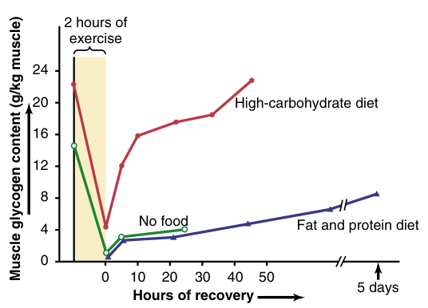 {left=62.76 top=0.00 width=37.24 height=47.68}

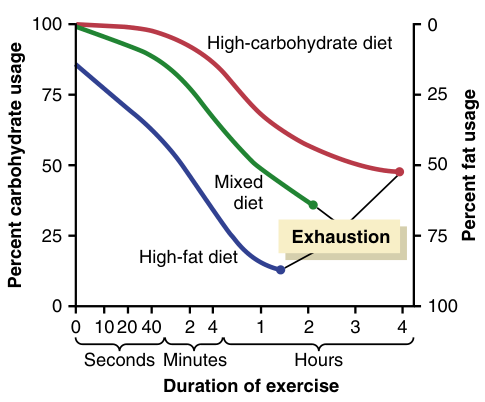 {left=63.65 top=46.44 width=36.35 height=53.56}

The effect of diet on the rate of muscle glycogen replenishment after prolonged exercise.

The effect of duration of exercise, as well as type of diet, on relative percentages of carbohydrate or fat used for energy by muscles.

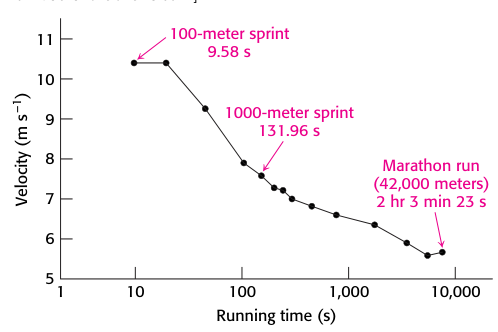 {left=18.84 top=27.50 width=40.07 height=44.52}

world track records

---

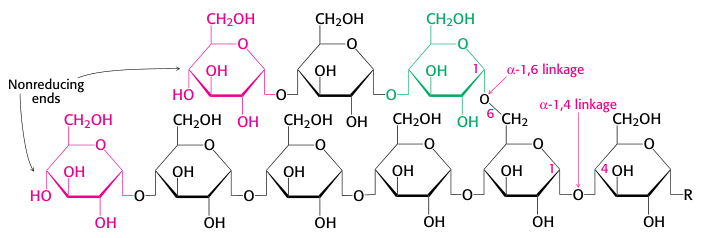 {left=16.53 top=0.00 width=48.29 height=29.11}

**Glycogen.** At the core of the
glycogen molecule is the protein glycogenin (yellow). Each line represents glucose
molecules joined by an 𝛼-1,4-glycosidic linkage. The nonreducing ends of the
glycogen molecule form the surface of the glycogen granule. Degradation takes place at this surface.

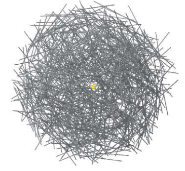 {left=75.79 top=-0.00 width=24.21 height=39.86}

**Glucose cannot be stored freely** — high concentrations disrupt osmotic balance → cell damage.
**Solution:** store as **glycogen**, a *non-osmotic, branched glucose polymer*.
**Structure of Glycogen**
Large, branched polymer (up to **55,000 glucose residues**, ~40 nm).
Mostly **α(1→4)** glycosidic bonds with **α(1→6)** branches every ~12 residues.
Branching → rapid mobilization and solubility.
Found as **granules in cytoplasm**.
Osmotic gradient depends on number of particles → 1 large molecule better than many small
Present in **bacteria, archaea, and eukaryotes** (plants store glucose as **starch**).

---

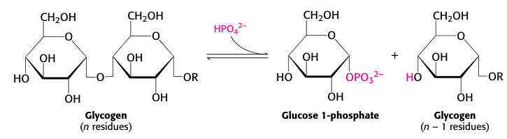 {left=30.85 top=0.00 width=69.15 height=33.74}

**Glycogen Breakdown: Phosphorolysis**
**Key enzyme:** *Glycogen phosphorylase* → Cleaves glycogen by **adding orthophosphate (Pi)** instead of water → Produces **glucose-1-phosphate (G1P)**
**Energetic and Cellular Advantages**
Reaction favors breakdown in vivo since **[Pi]/[G1P] ≫ 1**
**No ATP needed** — sugar already phosphorylated
Prevents glucose loss — **G1P cannot exit cell**
**Phosphorolysis > hydrolysis**: conserves energy and maintains cell balance

**Key enzyme:** *Glycogen phosphorylase*
Catalyzes glycogen degradation by **addition of orthophosphate (Pi)**
Product: **Glucose-1-phosphate (G1P)**
This process is called **phosphorolysis** (bond cleavage using Pi)
**Mechanism**
Works at **non-reducing ends** (free –OH on C4)
**Pi** attacks glycosidic bond → cleaves between **C****1**** and O**
**α-configuration** at C1 is retained
**Phosphoglucomutase** converts G1P → **glucose-6-phosphate (G6P)**

---

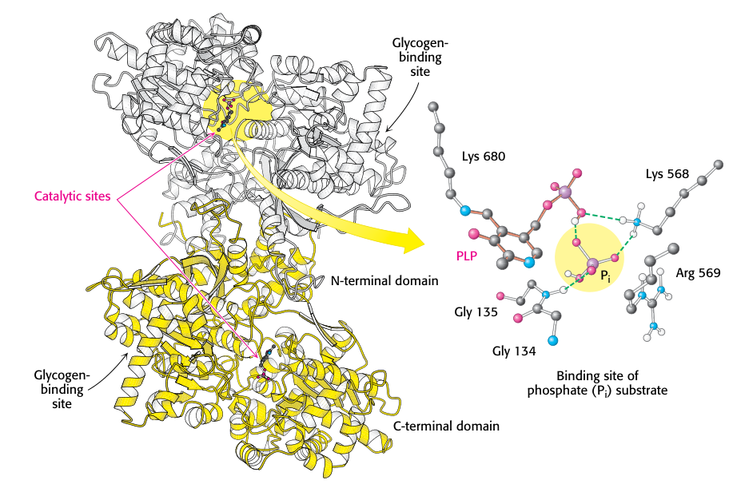 {left=16.07 top=0.00 width=44.22 height=52.67}

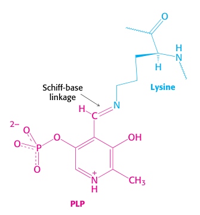 {left=75.46 top=0.00 width=24.40 height=46.74}

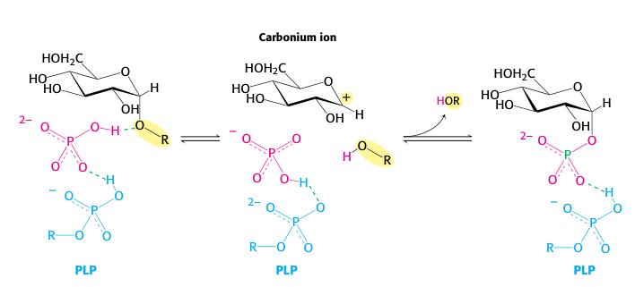 {left=16.07 top=54.86 width=60.43 height=45.14}

A pyridoxal phosphate (PLP, B6 derivative) group (red) forms a Schiff base with a lysine residue (blue) at the active site of phosphorylase, where it functions as a general acid–base catalyst.

---

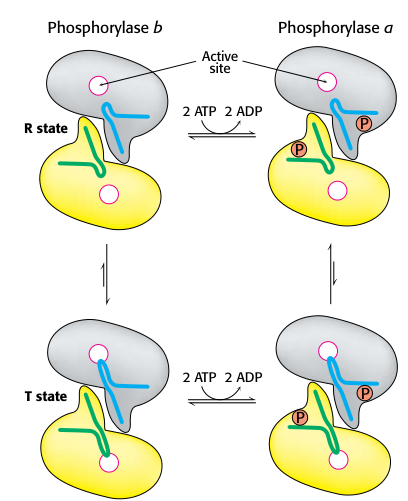 {left=66.23 top=17.65 width=28.09 height=61.33}

**Overview of Glycogen Phosphorylase Regulation**
Glycogen degradation is tightly controlled
**Key enzyme:** glycogen phosphorylase
Regulation by:
**Allosteric effectors** (energy state)
**Reversible phosphorylation** (hormones)
Two isozymes with different roles:
**Liver:** maintain blood glucose
**Muscle:** produce energy for contraction
**Phosphorylase Forms**
Two interconvertible forms:
**Phosphorylase a (active)**
**Phosphorylase b (inactive)**
Each exists in:
**R-state (relaxed, active)**
**T-state (tense, low activity)**
a-form favors **R**; b-form favors **T**

---

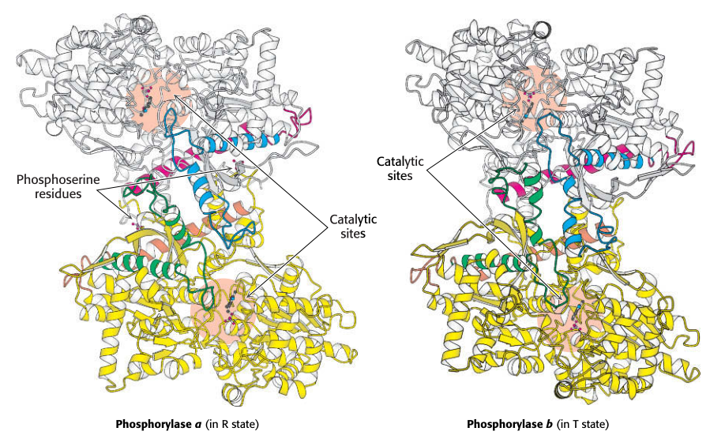 {left=47.79 top=0.00 width=52.21 height=56.88}

**Structural Basis**
T → R transition involves ~10° subunit rotation
Structural changes open the active site
R-state: accessible catalytic site + organized phosphate-binding site
T-state: active site partially blocked

**Isozyme Logic**
Liver and muscle phosphorylases ≈ 90% identical
Small sequence differences → different regulation
Reflect distinct physiological roles
Liver: blood-glucose homeostasis
Muscle: rapid energy supply

**Liver Phosphorylase**
**Function:** supply glucose to the body
Default state: **phosphorylase ****a**** (active)**
**Glucose binding → shifts a from R → T** → Inhibits glycogen breakdown when glucose is abundant
Liver is *not* regulated by AMP

**Muscle Phosphorylase**
**Function:** generate energy for muscle contraction
Default state: **phosphorylase ****b**** (inactive)**
Activated by **AMP** → stabilizes the R-state
**ATP** and **G6P** inhibit (feedback)
Muscle responds to **energy charge**, not blood glucose

---

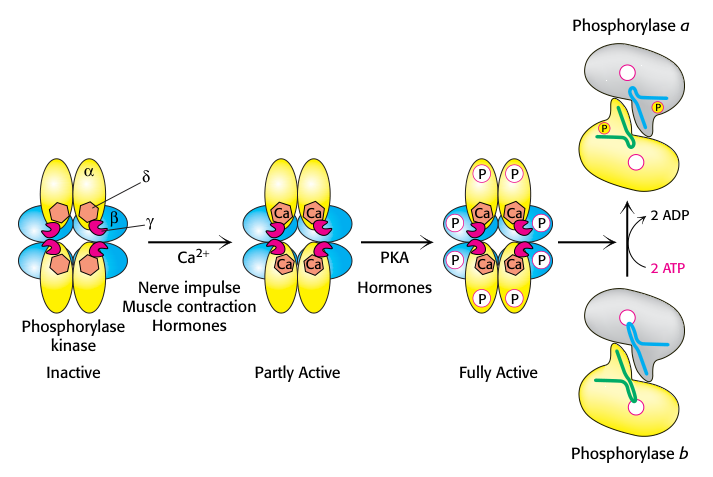 {left=42.62 top=12.07 width=57.38 height=68.25}

**Phosphorylase Kinase**
Activates phosphorylase by phosphorylation
Massive protein: **(αβγδ)₄**
γ: catalytic subunit
δ: **calmodulin** (Ca²⁺ sensor)
α, β: PKA targets (regulatory)
Part of the glucagon/epinephrine signal cascade

**b → a Conversion (Hormonal Control)**
**Phosphorylation of Ser14** converts b → a
Triggered by hormones:
**Glucagon** (liver, low blood glucose)
**Epinephrine** (muscle, exercise/stress)
Enzyme: **phosphorylase kinase**

**Activation of Phosphorylase Kinase**
Two signals required for full activation:
**Ca²⁺ binding** to δ (calmodulin)
**Phosphorylation** of α and β by PKA
Muscle relevance: Ca²⁺ from SR during contraction
→ Links muscle contraction directly to glycogen breakdown

---

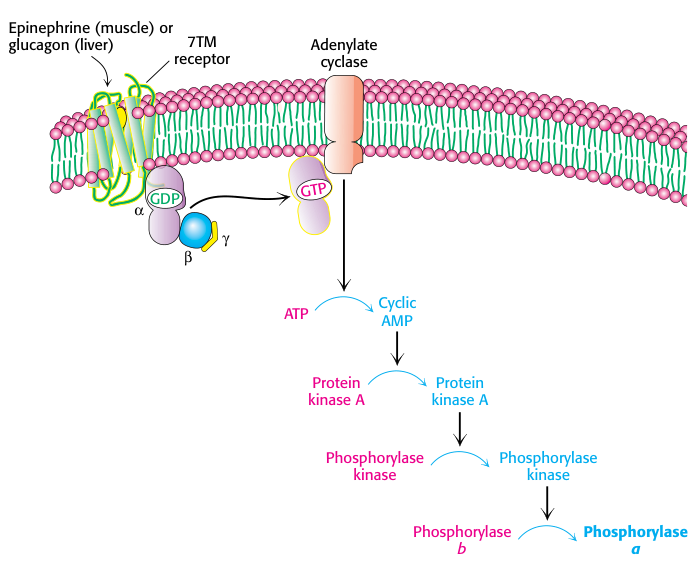 {left=50.00 top=0.00 width=50.00 height=71.85}

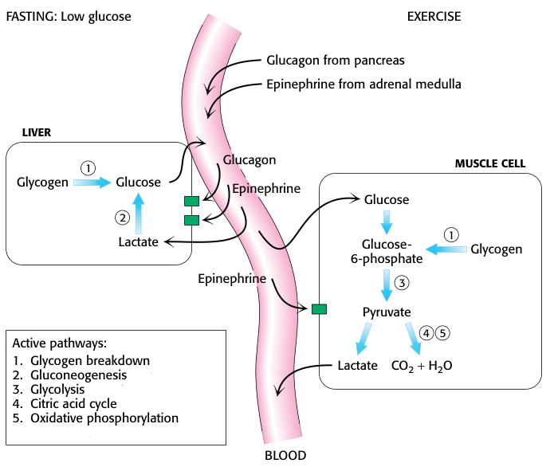 {left=15.88 top=32.64 width=44.94 height=67.36}

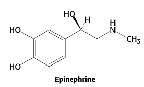 {left=20.03 top=0.00 width=25.02 height=26.72}

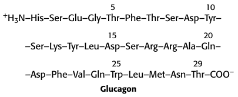 {left=63.11 top=73.28 width=36.89 height=26.72}

muscle

liver

---

**1.** The signal molecules epinephrine and glucagon bind to specific seven-
transmembrane (7TM) receptors in the plasma membranes of target cells. Epinephrine binds to the b -adrenergic receptor in muscle, whereas glucagon binds to the glucagon receptor in the liver. These binding events activate the G s protein. A specific external signal has been transmitted into the cell through structural changes, first in the receptor and then in the G protein.

**2.** The GTP-bound subunit of G s activates the transmembrane protein adenylate cyclase. This enzyme catalyzes the formation of the second messenger cyclic AMP (cAMP) from ATP.

**3.** The elevated cytoplasmic level of cAMP activates protein kinase A. The binding of cAMP to inhibitory regulatory subunits  triggers their dissociation from the catalytic subunits. The free catalytic subunits are now active.

**4.** Protein kinase A phosphorylates phosphorylase kinase, first on the b subunit and then on the a subunit, which activates glycogen phosphorylase.

---

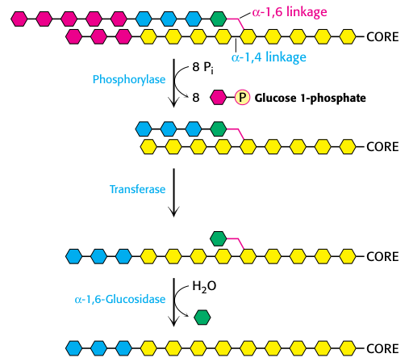 {left=65.15 top=0.00 width=34.85 height=54.74}

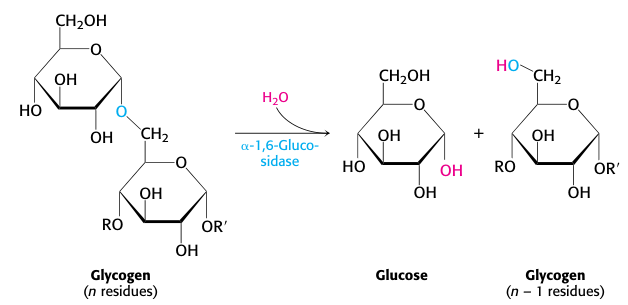 {left=16.18 top=0.00 width=41.13 height=35.51}

**Limits of Glycogen Phosphorylase**
**Phosphorylase** cleaves **α-1,4-glycosidic bonds**
Cannot break **α-1,6 bonds** at branch points
Stops **4 residues away** from a branch
~1 in 12 residues is branched → cleavage halts after ~8 glucose released per branch
**Debranching Enzymes**
Two enzymes allow further breakdown:
**Transferase** → moves a block of 3 residues to another chain
**α-1,6-Glucosidase (debranching enzyme)** → hydrolyzes the branch point
Releases **free glucose**, then phosphorylated by **hexokinase**

**Result and Structure**
Branch removed → glycogen becomes **linear**
Phosphorylase can resume degradation
In eukaryotes, **transferase + α-1,6-glucosidase** = one **bifunctional enzyme (~160 kDa)**

---

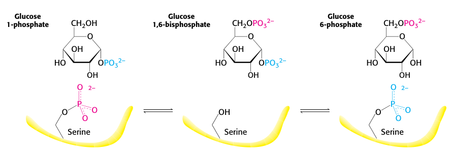 {left=25.70 top=2.60 width=59.78 height=36.02}

**Reaction catalyzed by phosphoglucomutase. **A phosphoryl group is transferred from the enzyme to the substrate, and a different phosphoryl group
is transferred back to restore the enzyme to its initial state.

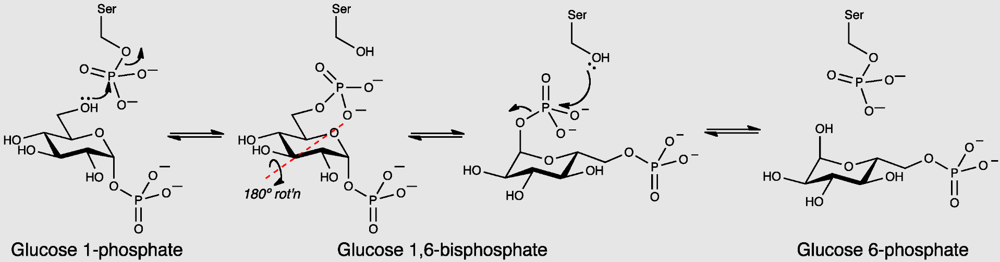 {left=16.24 top=56.92 width=83.76 height=39.13}

---

Glycogen is **synthesized **by a pathway that utilizes uridine diphosphate glucose (UDP-glucose) as the activated glucose donor.

This reaction is readily reversible. However, pyrophosphate is rapidly hydrolyzed in vivo to orthophosphate by an inorganic pyrophosphatase.

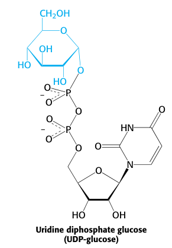 {left=77.76 top=0.00 width=22.24 height=61.39}

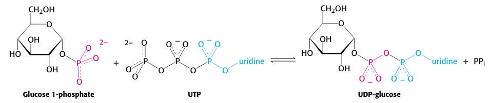 {left=16.40 top=68.17 width=84.90 height=31.83}

UDP-glucose pyrophosphorylase

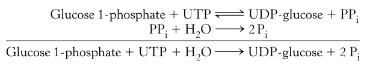 {left=16.40 top=45.38 width=63.54 height=19.81}

---

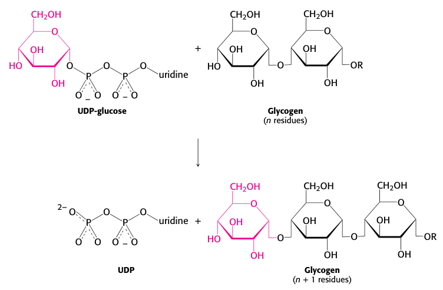 {left=53.30 top=0.00 width=46.70 height=54.32}

glycogen synthase

**Adding New Glucose Units**
New glucosyl residues are added to **nonreducing ends** of glycogen
**UDP-glucose** donates the activated glucosyl unit
Glucose is attached to **C4–OH** of terminal residue → **α-1,4 glycosidic bond**
Enzyme: **glycogen synthase** (key regulatory enzyme)

**Glycogen Synthase**
Humans have **two isozymes**:
**Liver form**
**Muscle/other tissues form**
Can **only extend chains ≥4 residues** → requires a **primer**
Belongs to the **glycosyltransferase** family
Structurally **homologous to glycogen phosphorylase**
UDP-glucose site aligns with PLP site in phosphorylase
**Glycogenin (Primer Protein)**
Provides the **starter chain** (“primer”) for synthesis
**Mn²⁺-dependent glycosyltransferase**, dimer of **37-kDa** subunits
Each subunit autoglycosylates a **Tyr residue**
Produces an **α-1,4 glucan** (≈10–20 residues)
After the primer is built, **glycogen synthase takes over**
**Every glycogen molecule contains a glycogenin core**

---

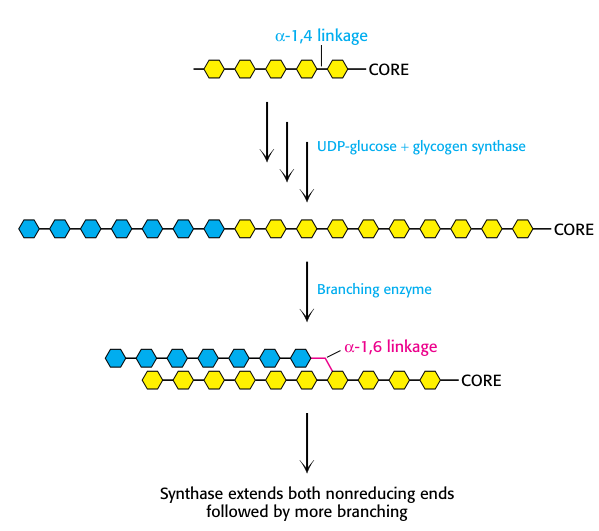 {left=58.81 top=35.09 width=41.19 height=64.91}

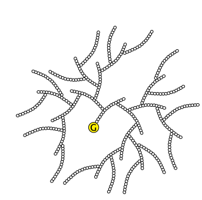 {left=79.28 top=0.00 width=20.72 height=35.09}

The component
labeled G is glycogenin.

**Why Branching Is Needed**
Glycogen synthase makes **only α-1,4 linkages**
Branching enzyme creates **α-1,6 linkages** → produces the branched structure
**How Branching Occurs**
After a linear chain is formed (~≥11 residues)
Branching enzyme **cuts an α-1,4 bond**
Transfers a block of **~7 glucosyl residues**
Reattaches them via an **α-1,6 linkage** at an interior position
New branch point must be **≥4 residues away** from an existing branch
**Why Branching Is Important**
**Increases glycogen solubility**
Creates **many nonreducing ends**
↑ sites for **phosphorylase** (breakdown)
↑ sites for **glycogen synthase** (synthesis)
Result: **much faster synthesis and degradation**

---

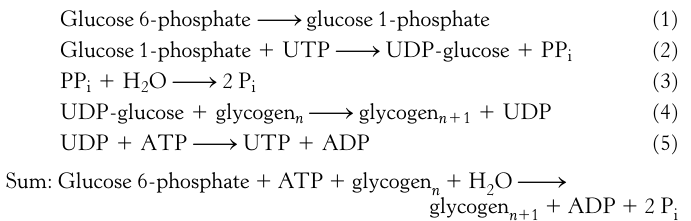 {left=18.25 top=0.00 width=71.98 height=40.93}

(1) **Phosphoglucomutase. **Rearranges phosphate → prepares glucose for activation.
(2) **UDP-glucose pyrophosphorylase. **Activates glucose for glycogen synthesis.
(3) **Inorganic pyrophosphatase.** Hydrolyzes PPᵢ → pulls reaction (2) strongly forward.
(4) **Glycogen synthase.** Adds glucose to the growing glycogen chain (α-1,4 link).
(5) **Nucleoside diphosphate kinase (NDPK).** Regenerates UTP for reaction (2).

---

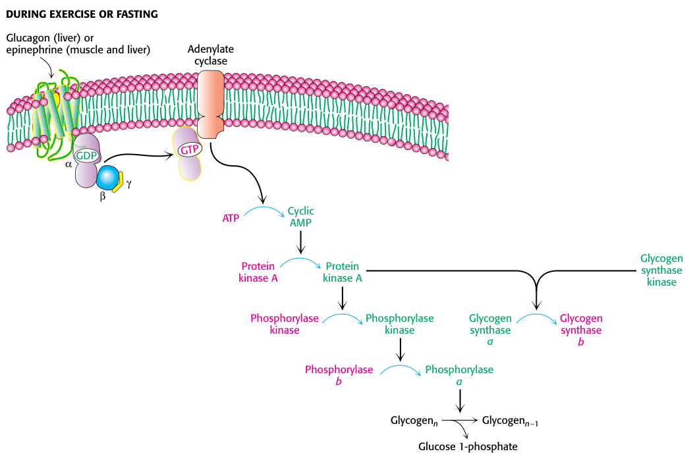 {left=17.96 top=0.00 width=82.04 height=96.64}

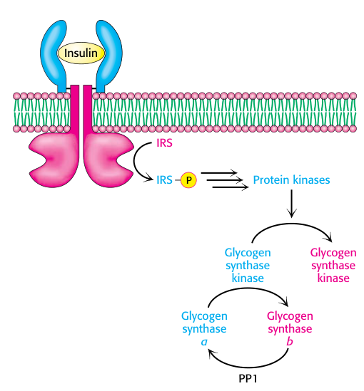 {left=73.87 top=0.00 width=26.13 height=50.00}

insulin-receptor substrates

---

**Reciprocal Control of Glycogen Breakdown & Synthesis**
**Hormonal control (glucagon/epinephrine)**
cAMP → **PKA** activation.
PKA **activates glycogen breakdown** – phosphorylates **phosphorylase kinase → phosphorylase a**
PKA **inhibits glycogen synthesis** – phosphorylates **glycogen synthase → inactive (b form)** → Breakdown ON, synthesis OFF.** **
**Switch to Glycogen Synthesis**
**Protein phosphatase 1 (PP1) actions**
**Dephosphorylates**: – phosphorylase a → b (turns OFF breakdown) – phosphorylase kinase (turns OFF breakdown) – glycogen synthase b → a (turns ON synthesis)
**Regulation of PP1**
PP1 bound to glycogen via **GM (muscle)** or **GL (liver)** subunits.
PKA **inhibits PP1**: – phosphorylates GM → PP1 released from glycogen – phosphorylates PP1 inhibitors → they bind PP1 and block it → Ensures breakdown stays ON during cAMP signaling.

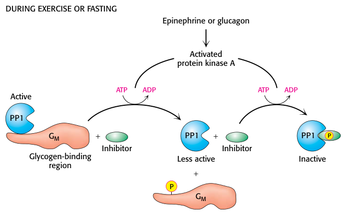 {left=54.79 top=32.91 width=44.37 height=48.89}

Regulatory subunit 
(m=muscle, l=liver)

Catalytic subunit (PP1)

---

**Insulin: Turning Glycogen Synthesis ON**
**Insulin signaling**
Insulin receptor (RTK) → IRS phosphorylation → kinase cascade.
**Inactivates glycogen synthase kinase**.
PP1 dephosphorylates glycogen synthase → **active a form**.
Insulin also **increases glucose uptake**. → Overall: glycogen stores replenished.
**Key Elements of the Glucose-Sensing Switch**
Glucose shifts phosphorylase a (R→T) to expose Ser14.
PP1 dephosphorylates **phosphorylase** (off) and **glycogen synthase** (on).
PP1 binding to phosphorylase a prevents premature glycogen synthesis.

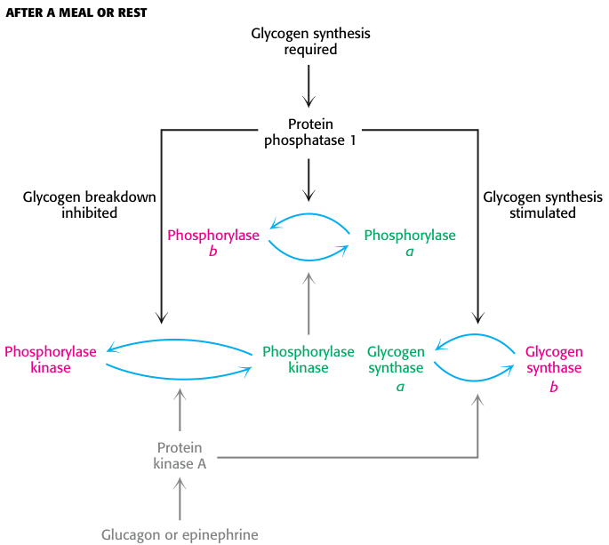 {left=59.65 top=16.82 width=40.35 height=64.19}

---

Smooth muscle

Not all contractions done consciously

---

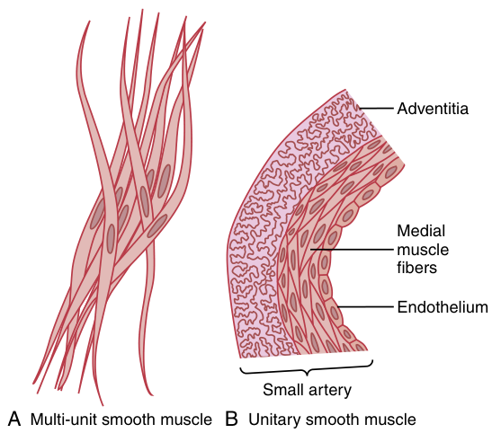 {left=58.48 top=0.00 width=35.52 height=55.64}

Smooth muscle varies among organs in:
Size and organization
Type of stimuli it responds to
Pattern of innervation
Functional role
For simplicity, it is divided into **two main types**

**Multi-Unit Smooth Muscle**
Composed of **independent fibers**, each innervated by a **single nerve ending**
**No gap junctions** → fibers contract separately
Control mainly by **nerve signals**
Surrounded by thin basement-membrane-like layer (collagen + glycoprotein)
**Examples:**
Ciliary muscle (eye focusing)
Iris muscle (pupil size)
Piloerector muscles (hair erection)

**Unitary (Single-Unit / Visceral) Smooth Muscle**
Consists of **hundreds to thousands of fibers** contracting as one unit
Connected by **gap junctions** → ions and action potentials spread easily
Arranged in **sheets or bundles**
Controlled mainly by **non-nervous stimuli** (e.g., stretch, hormones)
Found in **walls of visceral organs: **GI tract, bile ducts, ureters, uterus, blood vessels

---

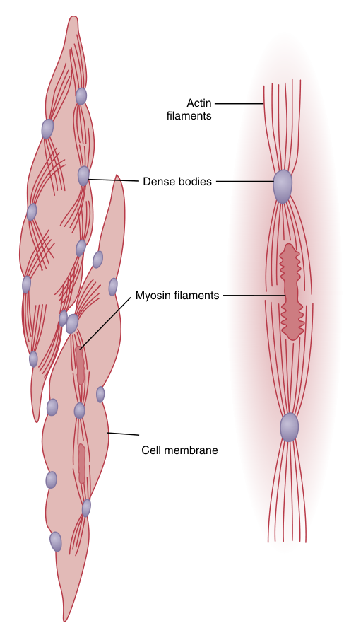 {left=70.98 top=0.00 width=29.02 height=94.07}

**No striations:** Actin and myosin not organized into sarcomeres.
**Dense bodies:** Actin filaments attach to dense bodies (analogous to Z-disks).
Some connected to membrane, others inside cell.
Intercellular bridges link dense bodies of neighboring cells → transmit force.
**Filament ratio:** ~5–10× more actin than myosin.
**Side-polar myosin filaments:** Cross-bridges on opposite sides pull in opposite directions.
**Result:** Smooth muscle can shorten up to **80% of its length** (vs <30% in skeletal muscle).

---

**Smooth vs. Skeletal Muscle Contraction**
**Contraction Characteristics**
**Smooth muscle:** slow, tonic contractions lasting seconds to days.
**Skeletal muscle:** rapid, phasic contractions.
**Cross-Bridge Cycling**
Much **slower** in smooth muscle (1/10–1/300 of skeletal).
**Low ATPase activity →** slower ATP hydrolysis and movement.
**Energy Use**
Requires only **1/10–1/300** as much energy to sustain tension.
Enables **long-term contraction** in viscera with minimal energy.

**Contraction Dynamics**
**Slow onset:** 50–100 ms after excitation.
**Total contraction time:** 1–3 s (vs. ~0.1 s in skeletal).
**Force**
Despite fewer myosin filaments, **greater max force** (4–6 kg/cm² vs. 3–4 kg/cm²).
Due to prolonged actin–myosin attachment.
**Latch Mechanism**
Maintains force with **minimal energy** and **reduced excitation** — ideal for tonic contraction.
**Stress–Relaxation Response**
After stretch, tension **returns to baseline** within 15–60 s.
Allows hollow organs (e.g. bladder) to **maintain pressure** despite volume changes.

---

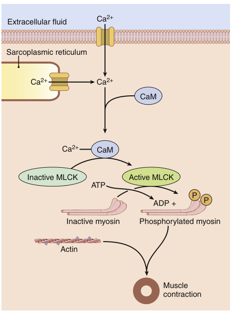 {left=65.85 top=2.96 width=34.15 height=81.21}

In place of troponin, smooth muscle cells contain a large amount of calmodulin. Calmodulin initiates contraction by activating the myosin cross bridges. 
**1.** The calcium concentration in the cytosolic fluid increases as a result of the influx through calcium channels and/or release from the sarcoplasmic reticulum.
**2.** The calcium ions bind reversibly with calmodulin.
**3.** The calmodulin-calcium complex then joins with and activates myosin light chain kinase, a phosphorylating enzyme.
**4.** One of the light chains of each myosin head, called the regulatory chain, becomes phosphorylated in response to this myosin kinase and obtains the capability of binding repetitively with the actin filament and proceeding through the entire cycling process of intermittent pulls, the same as what occurs for skeletal muscle, thus causing muscle contraction.

---

**Source of Ca²⁺ in Smooth Muscle**
Smooth muscle contraction **depends mainly on extracellular Ca²⁺ ** → sarcoplasmic reticulum (SR) is **poorly developed**.
Ca²⁺ enters **through membrane channels** during an **action potential or stimulus**.
[Ca²⁺] outside ≈ 10⁻³ M, inside ≈ 10⁻⁷ M → strong diffusion gradient.
**Latency before contraction:** 200–300 ms → ~50× slower than skeletal muscle.
**Role of SR and Caveolae**
SR forms a **rudimentary network** near the membrane.
**Caveolae** = small membrane invaginations acting as analogs of **T-tubules**.
Action potentials in caveolae trigger **Ca²⁺ release** from adjacent SR.
More developed SR → **faster contraction**.
**Smooth muscle force strongly depends** on extracellular Ca²⁺ concentration. → Contraction ceases if [Ca²⁺]ₑ falls below 1/3–1/10 normal.

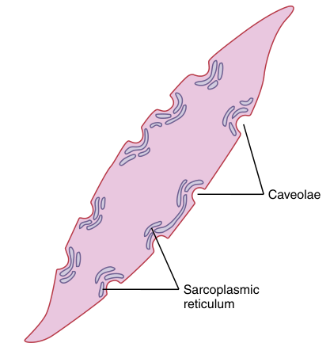 {left=63.82 top=13.95 width=36.18 height=66.79}

---

**Relaxation Mechanisms**
**Ca²⁺ pump** (ATP-dependent) removes Ca²⁺ to ECF or SR → **slow process**. → Explains long-lasting contraction (seconds vs. milliseconds).
**Myosin phosphatase** removes phosphate from myosin light chain → stops cross-bridge cycling.
Speed of relaxation depends on **enzyme activity level**.
**Latch Mechanism Regulation**
Allows **prolonged tension with minimal energy use**.
When **myosin kinase** and **phosphatase** are both active → fast cycling.
When activity decreases → heads stay **attached longer**, fewer ATP cycles.
Result: → **Force maintained (latched)** → **Energy conserved (low ATP use)**

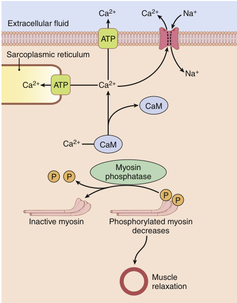 {left=57.83 top=3.85 width=42.17 height=96.15}

---

**Endings of postganglionic autonomic neurons on smooth muscle.**

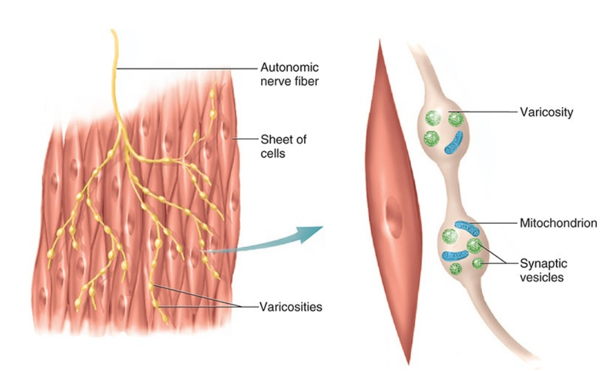 {left=44.64 top=12.37 width=55.36 height=60.53}

The nerve fibers run along the membranes of the smooth muscle cells and sometimes groove their surfaces. The multiple branches of postganglionic neurons are beaded with enlargements (varicosities) and contain synaptic vesicles. Neurotransmitter is released from the varicosities and diffuses to receptors on smooth muscle cell plasma membranes.

**In the heart**, cholinergic and noradrenergic nerve fibers end on the sinoatrial node, the atrioventricular node, and the bundle of His. Noradrenergic fibers also innervate the ventricular muscle. The exact nature of the endings on nodal tissue is not known. In the ventricle, the contacts between the noradrenergic fibers and the cardiac muscle fibers resemble those found in smooth muscle.

---

**Neuromuscular Junctions in Smooth Muscle**
Smooth muscle **lacks specialized motor end plates**.
**Autonomic nerve fibers** branch diffusely over muscle sheets.
Neurotransmitters are released into the **extracellular matrix**, not directly onto membranes.
**Diffuse junctions:** transmitter diffuses several nanometers–micrometers to reach cells.
Inner layers receive signal by **conduction or diffusion** from outer layers.
**Varicosities and Neurotransmitter Release**
Axons have **multiple varicosities** instead of terminal boutons.
At varicosities, **Schwann cells open**, allowing neurotransmitter release.
**Vesicles contain:** → Acetylcholine (ACh) *or* Norepinephrine (NE) — never both.
Some contain **other modulators** (e.g. peptides).
**Contact junctions** (20–30 nm gap) act like skeletal synapses → **faster contraction**.

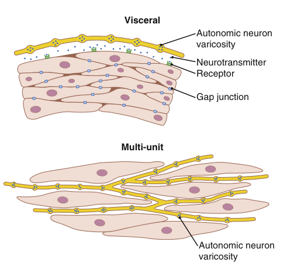 {left=58.47 top=0.00 width=39.69 height=65.39}

Unitary (visceral) smooth muscle cells are connected by gap junctions so that depolarization can rapidly spread. In multi-unit smooth muscle, each cell is stimulated independently by a neurotransmitter released from closely associated autonomic nerve varicosities.

---

**ACh and NE** are the key neurotransmitters.
**Never secreted by the same fibers.**
Their effects **depend on receptor type**:
**Excitatory receptors** → depolarization & contraction.
**Inhibitory receptors** → hyperpolarization & relaxation.
Example:
In some organs, ACh → excite; NE → inhibit.
In others, opposite effect.
**Outcome determined by receptor subtype**, not neurotransmitter itself.

---

Cardiac muscle

Pumping for the great good

---

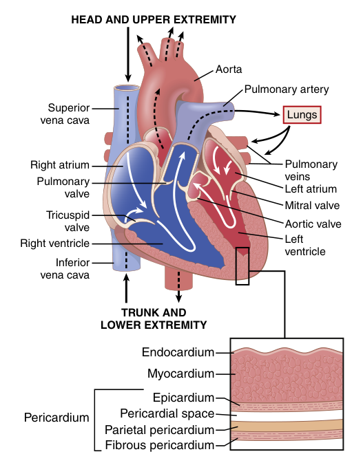 {left=59.03 top=2.96 width=40.97 height=94.07}

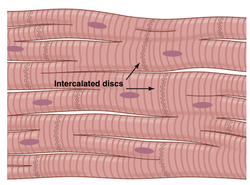 {left=25.26 top=1.48 width=33.02 height=43.46}

**Striated** like skeletal muscle — actin & myosin filaments slide during contraction
**Intercalated discs** connect cells → **gap junctions** allow ion diffusion and rapid excitation spread.
Functionally, the heart acts as **two syncytia**:
**Atrial syncytium** (atria walls)
**Ventricular syncytium** (ventricle walls)
Separated by **fibrous tissue**, except through the **AV bundle** (conductive pathway).
This structure ensures **atria contract before ventricles**, optimizing pumping efficiency.

---

**Amplitude:** ~105 mV (–85 → +20 mV)
**Duration:** ~0.2–0.3 s → much longer than skeletal muscle
**Characteristic:** long **plateau** phase → prolonged contraction
**Key causes of long plateau:**
**Two channel types:**
**Fast Na⁺ channels:** open briefly → initial spike
**Slow L-type Ca²⁺/Na⁺ channels:** open longer → sustain depolarization
**↓ K⁺ permeability** → less positive charge leaves cell → maintains plateau
When Ca²⁺/Na⁺ channels close → ↑ K⁺ efflux → **rapid repolarization**

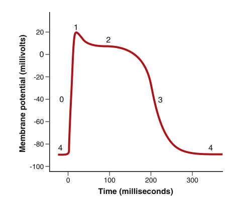 {left=67.65 top=0.00 width=32.35 height=51.63}

0. 	**Depolarization. **Na⁺ influx (fast channels open) 
**Initial repolarization. **Na⁺ channels close, slight K⁺ efflux
**Plateau. **Ca²⁺ influx (slow channels), ↓K⁺ efflux** **
**Rapid repolarization. **Ca²⁺ channels close, ↑K⁺ efflux
**Resting potential.** –80 → –90 mV

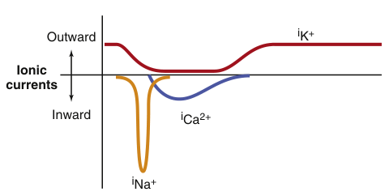 {left=17.17 top=64.70 width=36.69 height=33.23}

---

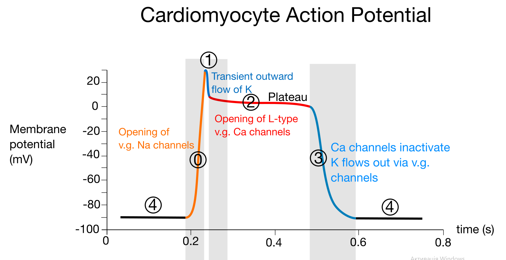 {left=30.24 top=3.82 width=49.55 height=45.32}

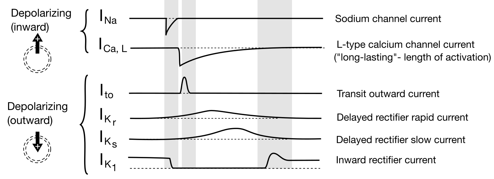 {left=27.03 top=49.14 width=64.31 height=41.49}

---

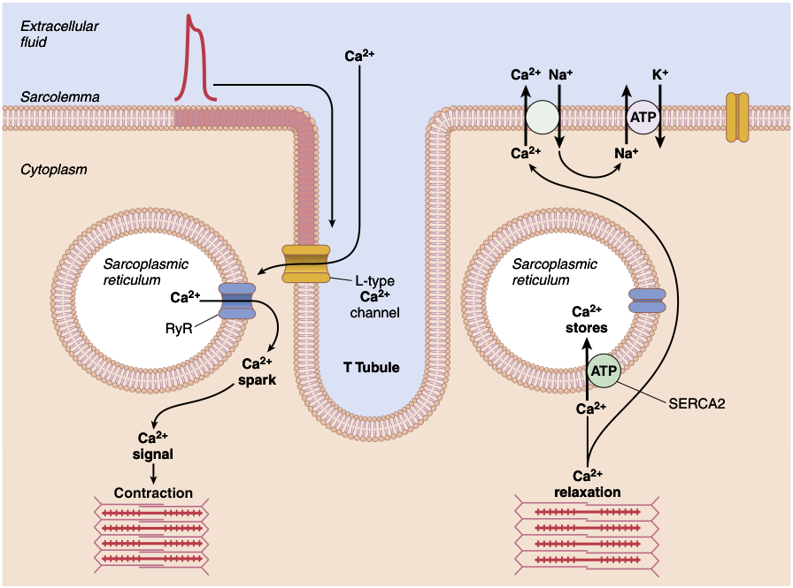 {left=53.74 top=0.00 width=46.26 height=61.03}

**Excitation–Contraction Coupling in Cardiac Muscle**
**Pathway:**
AP spreads along **sarcolemma** and **T-tubules**
Triggers **Ca²⁺ release** from **sarcoplasmic reticulum (SR)**
Ca²⁺ binds **troponin → actin–myosin sliding → contraction**
**Dual Source of Calcium**
Unlike skeletal muscle, cardiac contraction depends on:
**Ca²⁺ from SR** (via ryanodine receptors)
**Ca²⁺ influx from T-tubules** (via L-type voltage-gated Ca²⁺ channels)
Ca²⁺ entering through T-tubules **triggers further Ca²⁺ release** from SR (Ca²⁺-induced Ca²⁺ release)
**Without T-tubule Ca²⁺ influx → weak contraction** (SR stores are limited)

**Cardiac T-tubules:**
5× wider → **25× volume** of skeletal T-tubules
Contain negatively charged **mucopolysaccharides** that **bind Ca²⁺**
**Extracellular Ca²⁺ critical:**
Heart stops beating in **Ca²⁺-free medium**
Skeletal muscle contraction **not affected** by moderate Ca²⁺ changes

---

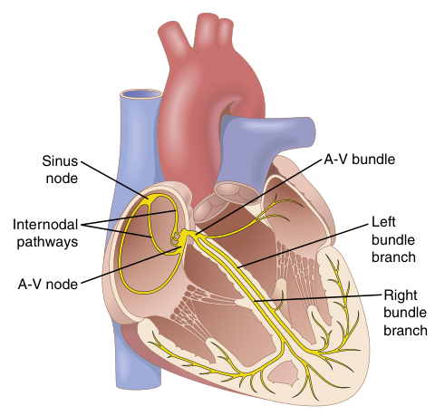 {left=70.59 top=0.00 width=29.41 height=50.00}

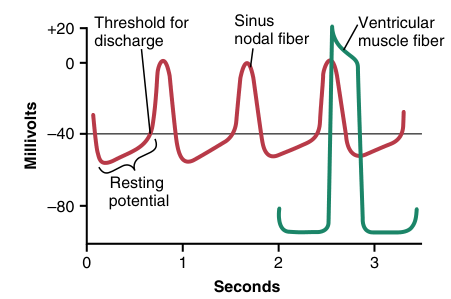 {left=65.93 top=58.46 width=34.07 height=40.16}

**SA and AV nodes **= modified **cardiomyocytes (not neurons!)**
**Sinus (SA) node** = pacemaker of the heart
**Unique property:** *Self-excitation → spontaneous action potentials*
**Resting potential:** about **–55 to –60 mV** (less negative than –90 mV in ventricles) → **Fast Na⁺ channels inactivated at -55 mV** → only **slow Ca²⁺–Na⁺ channels** remain functional
**How the SA Node Fires Automatically**
**Leakiness to Na⁺ and Ca²⁺ (“funny current”, If):**
Positive ions **slowly enter** the cell between beats
Membrane potential **drifts upward** (slow depolarization)
**Threshold (~–40 mV):**
**L-type Ca²⁺ channels open** → rapid depolarization → **action potential**
**Repolarization:**
Ca²⁺ channels **inactivate**
**K⁺ channels open** → K⁺ **exits**, returning cell to negative potential
**Reset and Next Beat**
**Hyperpolarization:**
After AP, K⁺ channels stay open briefly → potential ~–60 mV
Then K⁺ channels **close gradually**, Na⁺ and Ca²⁺ leak in again
Membrane slowly depolarizes → **reaches threshold → new AP**
This **spontaneous cycle repeats continuously** → rhythmic heartbeat

---

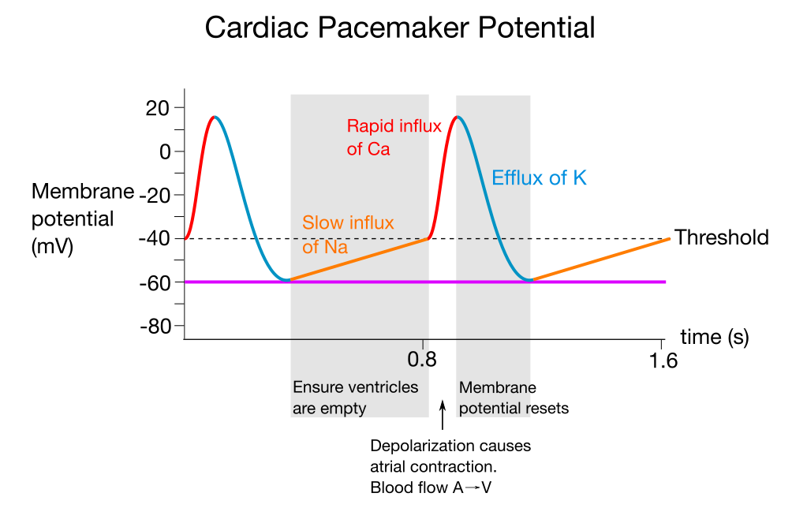 {left=20.24 top=13.93 width=66.41 height=77.96}

---

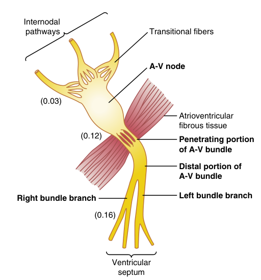 {left=75.70 top=0.00 width=24.28 height=46.19}

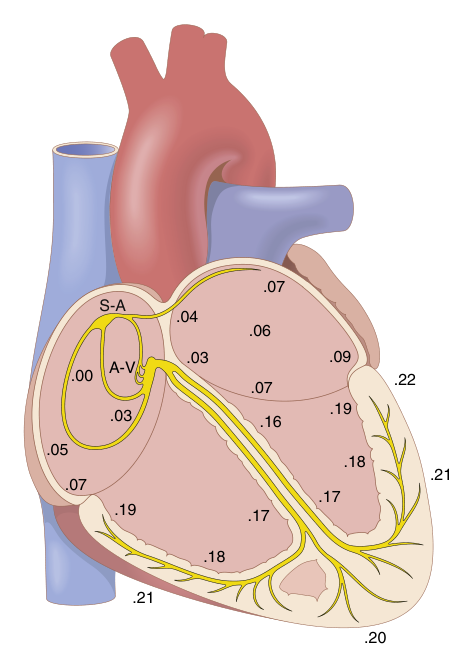 {left=77.12 top=46.19 width=21.45 height=53.81}

**Delays conduction** (~0.13–0.16 s total) → Ensures atria finish contracting **before** ventricles begin.
**Enforces one-way conduction** → Prevents backflow of impulses from ventricles to atria.
**Regulates timing** between atrial and ventricular systole.
**Why the AV Node Delays Signal**
**Fewer gap junctions** → High resistance between cells → Slow impulse spread.
**Smaller fiber diameter** → Slower conduction velocity.
**Low resting potential** → Slower depolarization (mostly via Ca²⁺ channels). *(Unlike Purkinje fibers that use fast Na⁺ channels.)*
**Result:** ~0.09 s delay inside AV node + ~0.04 s in AV bundle.
**Why the AV Node Is One-Way**
Only the **AV bundle** crosses the **fibrous barrier** between atria and ventricles.
Action potentials can go **downward** but not back **upward** (electrophysiological block).
Prevents **re-entry circuits** → protects from arrhythmias.

---

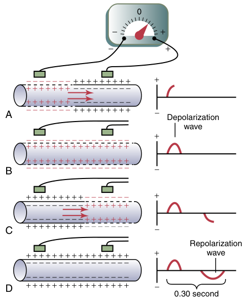 {left=16.02 top=2.96 width=44.17 height=94.07}

Single muscle fiber

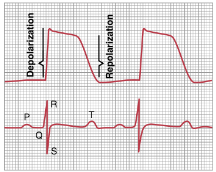 {left=71.66 top=59.89 width=28.34 height=40.11}

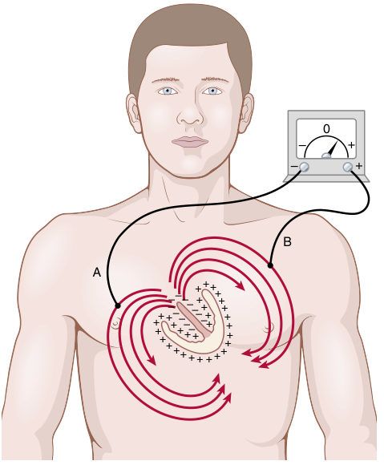 {left=71.66 top=0.00 width=28.34 height=61.00}

---

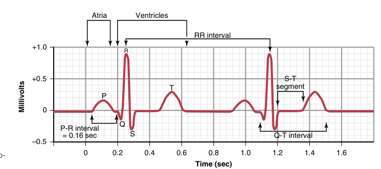 {left=16.75 top=0.00 width=50.24 height=41.22}

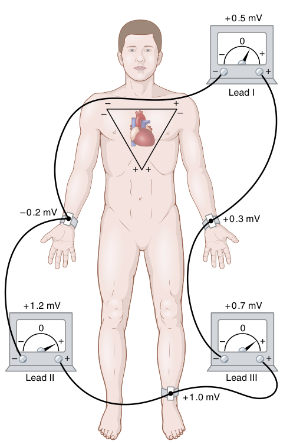 {left=68.32 top=0.00 width=31.68 height=82.40}

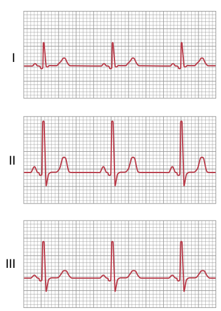 {left=16.75 top=42.66 width=22.87 height=57.34}

**Einthoven’s law:**
Lead I potential + Lead III potential = Lead II potential

**Lead I = ** left arm - right arm
**Lead II = **left leg - right arm
**Lead III =** left leg - left arm

---

 {left=21.62 top=-0.00 width=71.88 height=71.88}

**P** = Atrial depolarization; **Start of P + 100 ms** = Atrial contraction start**P–R interval** = From atrial depolarization to ventricular depolarization (Atrial contraction + AV node delay)**QRS** = Ventricular depolarization (**Q** = Depolarization of interventricular septum; **R** = depolarization of the main mass of the ventricles; **S** = last phase towards the base of the heart, atrial repolarization obscured);**S–T segment** = Ventricles fully depolarized (plateau phase) → **ventricular contraction + ejectionT** = Ventricular repolarization**T–P interval** = Ventricular relaxation + passive filling

---

**HOMEWORK**

---

**Problem 1. **Force needed to lift the weight.

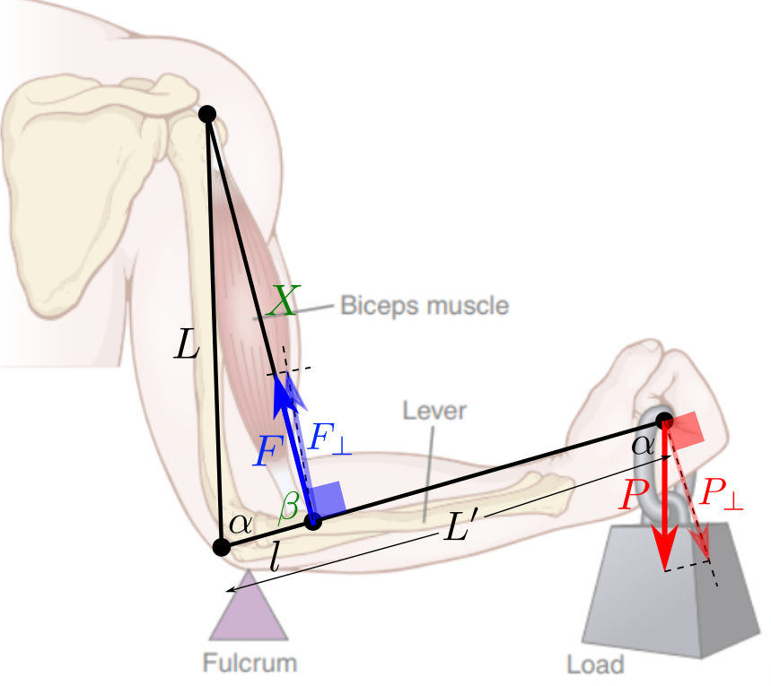 {left=14.11 top=34.42 width=40.55 height=64.20}

A person holds a load of weight *P*. The upper arm of length *L* is perpendicular to the ground, the forearm has length* L’*, an angle between them is *α*. The tendon is attached at *l* cm from the elbow. What force *F* does the biceps muscle exert on the forearm? Use the equality of torques of *F* and *P* and some trigonometry (see the sketch of the solution with the help of the two helper variables *β* and *X*).

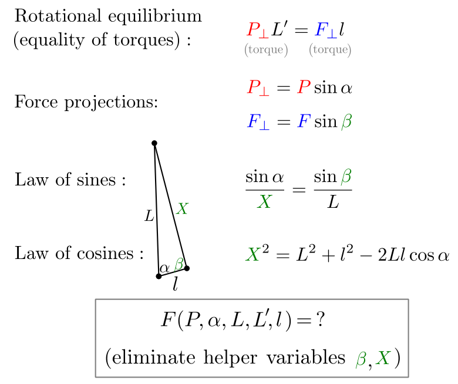 {left=58.25 top=37.95 width=40.05 height=59.69}

---

**Problem 2. **Muscle needed to lift the weight.

Use formula from **problem 1** to find out how big should be your muscles (cross-section, cm2 , and diameter, cm) to be able to lift 25 kg of weight. Numeric values you’ll need from lecture/tables:
g = 9.81 kg m/sec2
l = 4 cm
L’ = 35 cm
L = 28 cm
Force / (muscle cross-section) = 0.35 MPa

HINT: there is no angle 𝛼 given, you need to find the one that needs the maximal force.

---

WARNING! The table contains AI-generated content

**Problem 3. **
Immediate anaerobic power output

Measure your “Immediate anaerobic power output”, use information on slide <u>Immediate anaerobic power output</u> for details how to do it. Consider the table on the right, find the best suitable sport for you.

---

**FINALE**

---
