

Bioorganic Chemistry

Tymchyshyn V.B.

Lecture 12: Biochemistry of the Liver

---

Anatomy

Positioning in the organism

---

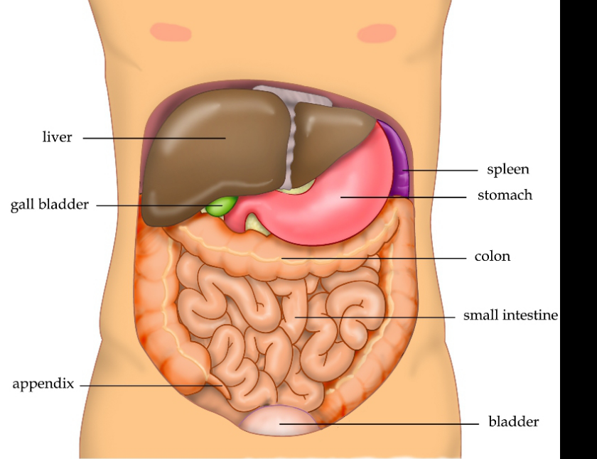 {left=53.30 top=8.61 width=46.70 height=68.12}

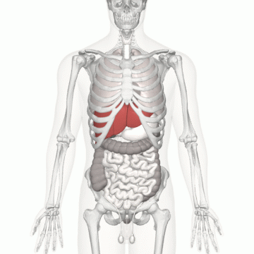 {left=15.80 top=9.33 width=37.50 height=66.67}

---

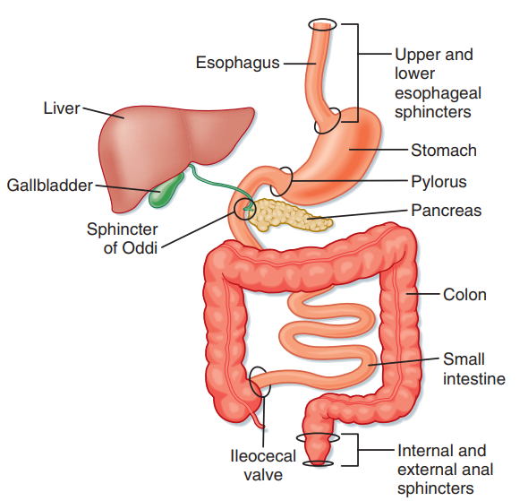 {left=50.91 top=2.96 width=49.09 height=84.77}

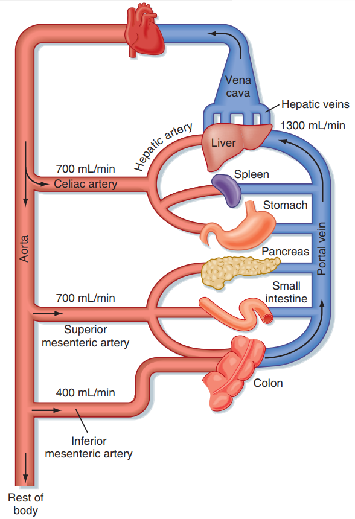 {left=17.28 top=0.00 width=33.63 height=87.44}

Typical blood flow through the splanchnic circulation in a fasting adult human.

---

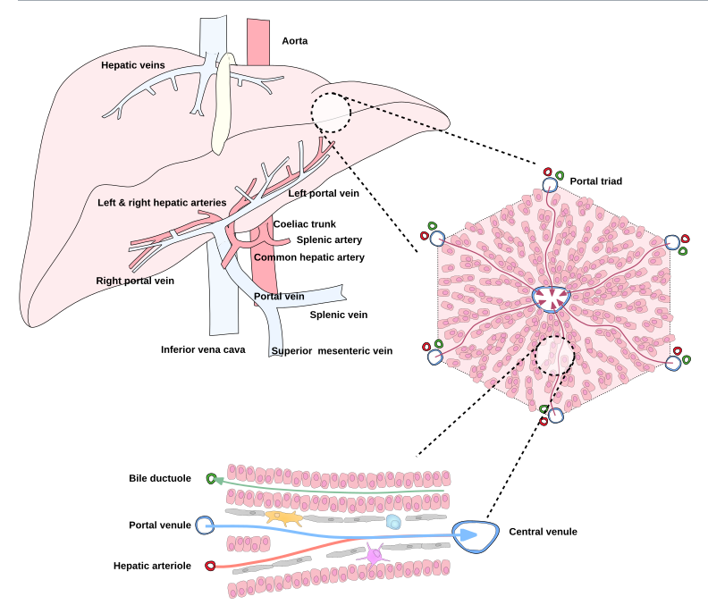 {left=16.35 top=25.89 width=48.77 height=74.11}

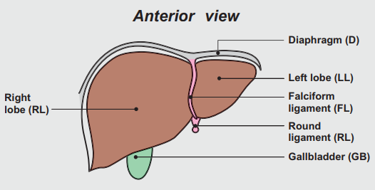 {left=46.56 top=0.00 width=42.29 height=38.16}

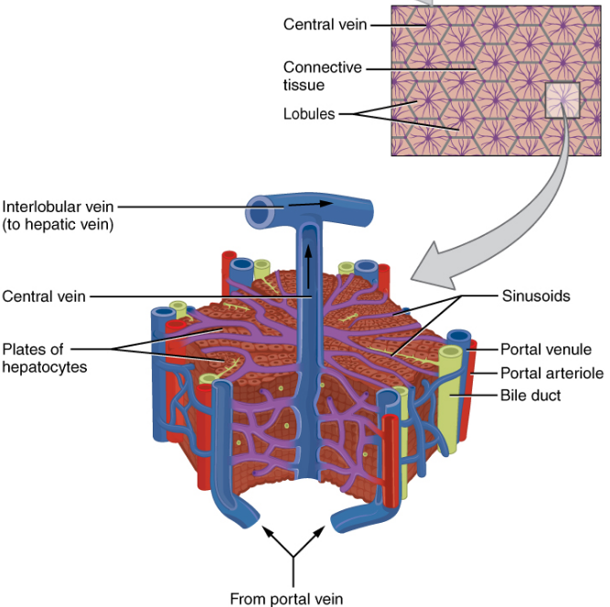 {left=65.12 top=38.28 width=34.88 height=61.72}

---

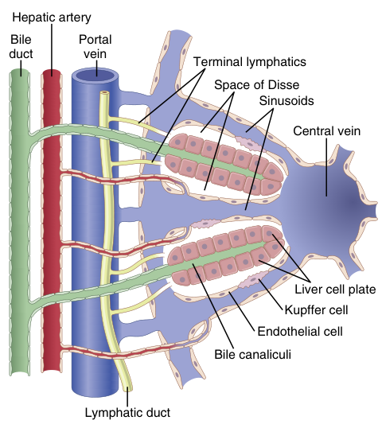 {left=51.41 top=2.96 width=47.65 height=94.07}

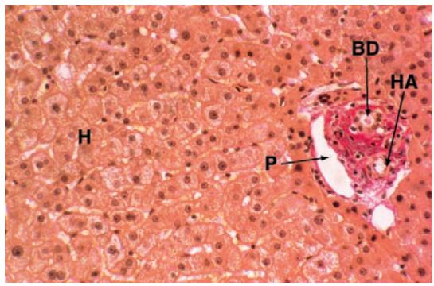 {left=3.33 top=0.00 width=48.07 height=56.45}

**Normal hepatic tissue.**
 
H  hepatocytes, 
P  portal vein, 
BD  bile duct, 
HA  hepatic arteriole

---

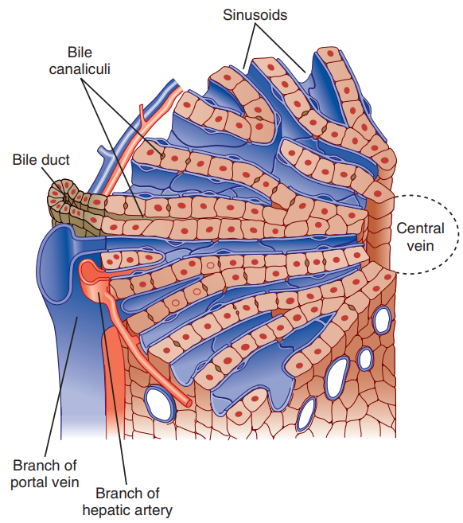 {left=62.13 top=0.00 width=37.87 height=76.01}

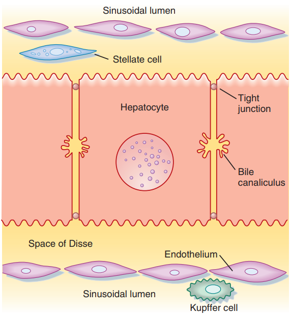 {left=19.54 top=0.00 width=40.91 height=78.97}

---

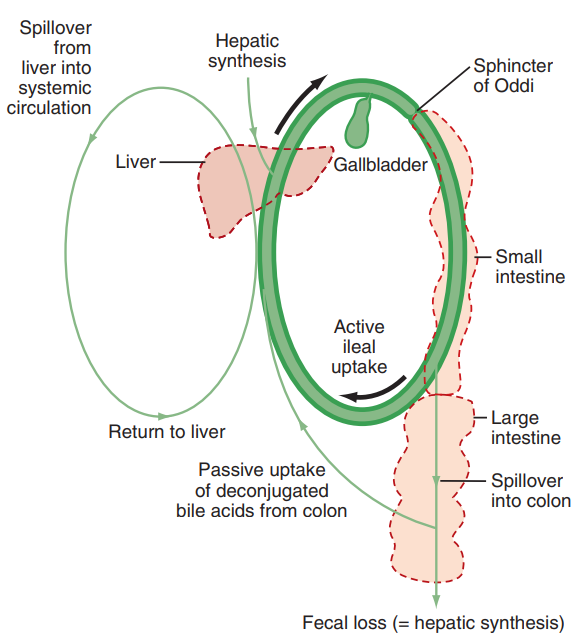 {left=16.06 top=-1.20 width=41.23 height=81.02}

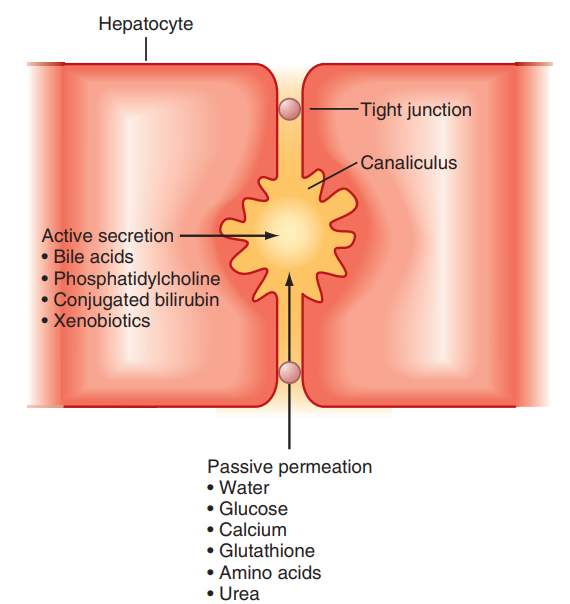 {left=68.74 top=0.00 width=31.26 height=58.88}

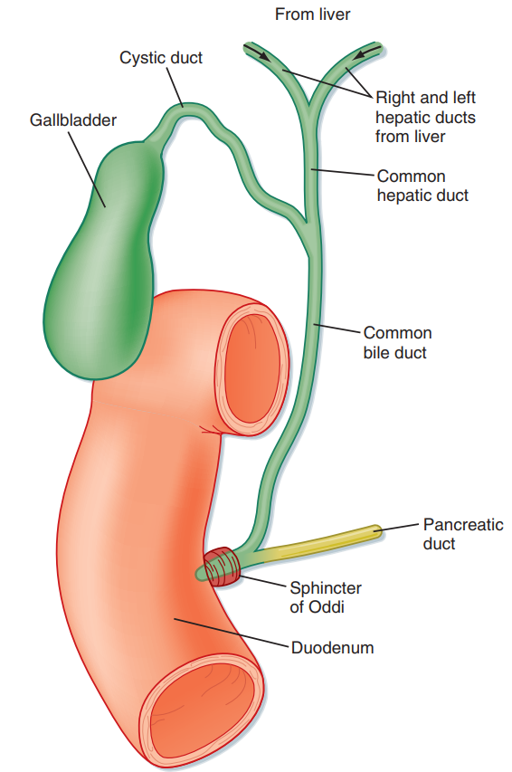 {left=58.47 top=41.12 width=20.98 height=58.88}

Relative amounts of bile acids in different body pools and the enterohepatic circulation indicated by the width of the green lines. The figure illustrates that the majority of the bile acid pool circulates between the liver, gallbladder, and small intestine, rather than being in the systemic circulation.

---

Lipid catabolism

Getting Energy from Fats

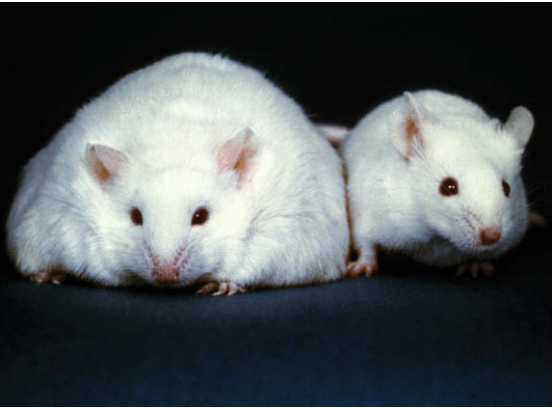 {left=70.64 top=61.43 width=29.36 height=38.57}

---

**1. Energy Storage & Fuel**
Stored as **triacylglycerols** (neutral fats / triglycerides)
Triacylglycerols = fatty acids esterified to **glycerol**
Stored in **adipose tissue** (adipocytes)
Mobilized fatty acids → **oxidation for ATP production**
**Primary energy source at rest or during moderate exercise**
**2. Structural Components**
Fatty acids are building blocks of:
**Phospholipids**
**Glycolipids**
Essential for **biological membranes**
**3. Protein Modification**
Many proteins are **covalently acylated**
Fatty acid addition → **membrane targeting** (e.g., myristoylation, palmitoylation)
**4. Signaling Molecules**
Fatty acid derivatives act as:
**Hormones**
**Intracellular messengers**

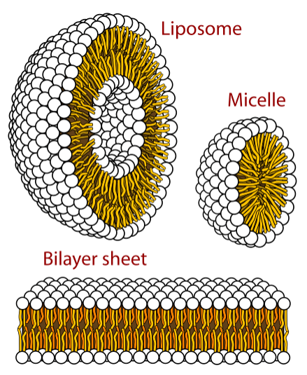 {left=66.30 top=26.59 width=33.70 height=73.02}

---

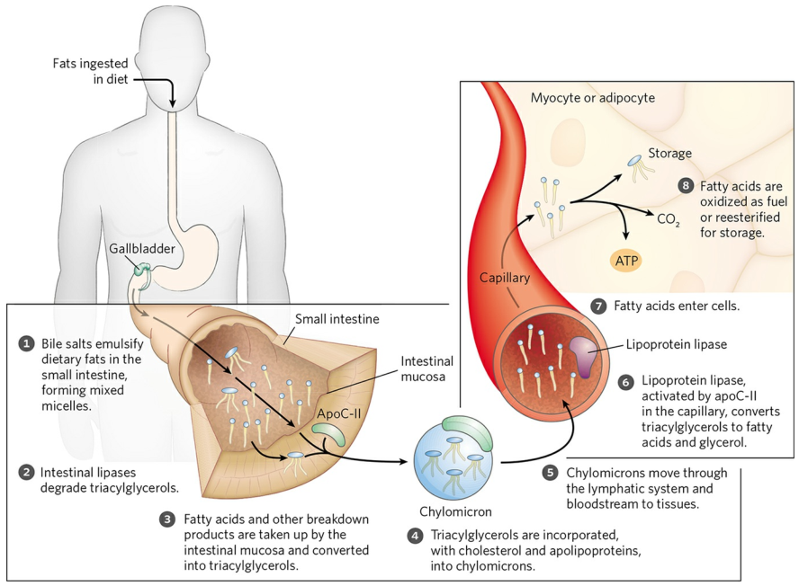 {left=19.65 top=0.00 width=74.34 height=97.04}

---

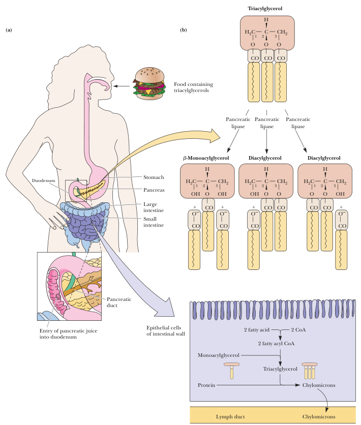 {left=52.23 top=0.00 width=47.77 height=100.00}

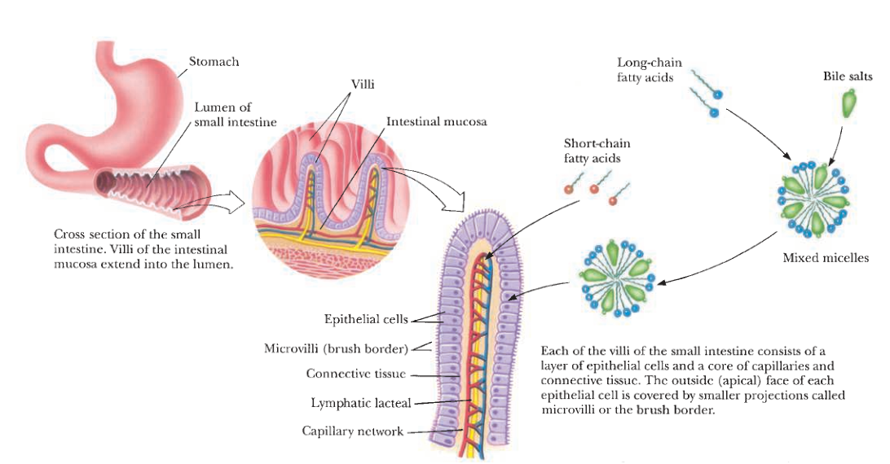 {left=-0.00 top=51.53 width=52.23 height=48.47}

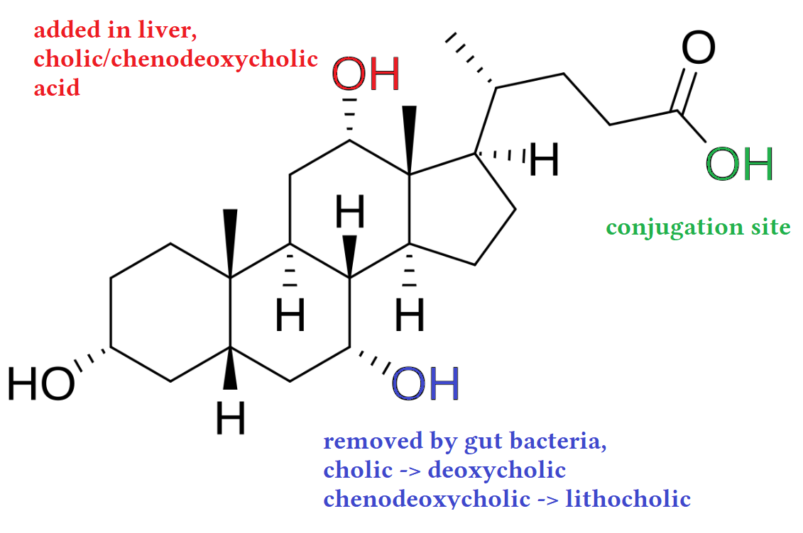 {left=18.33 top=8.21 width=33.89 height=40.06}

---

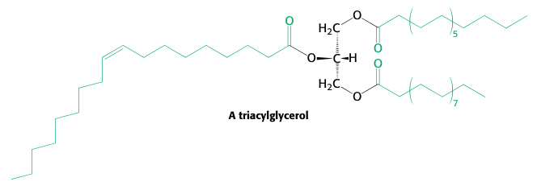 {left=17.75 top=0.00 width=57.75 height=36.49}

**Molecular structure of a chylomicron. **The surface is a layer of phospholipids, with head groups facing the aqueous phase. Triacylglycerols sequestered in the interior (yellow) make up more than 80% of the mass. Several apolipoproteins that protrude from the surface (B-48, C-II, C-III) act as signals in the uptake and metabolism of chylomicron contents. The diameter of chylomicrons ranges from about 100 to 500 nm.

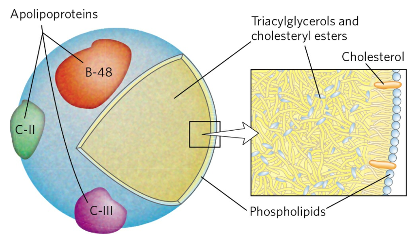 {left=53.47 top=22.43 width=39.35 height=40.38}

**TAG Processing: Chylomicron Pathway**
1. Chylomicrons enter lymph → blood  
2. apoC-II activates lipoprotein lipase  
3. TAGs → FA + glycerol  
4. FA → muscle oxidation OR adipose re-esterification  
5. Remnants → liver via apoE-mediated endocytosis

---

**Apolipoproteins & Lipoproteins: Transport of Dietary and Endogenous Lipids**

**Apolipoproteins**
- Lipid-binding proteins that transport TAGs, phospholipids, cholesterol, and cholesteryl esters.
- “Apo-” = lipid-free protein.
- Combine with lipids to form **lipoproteins**:
  - Hydrophobic core: TAGs, cholesteryl esters  
  - Hydrophilic shell: phospholipids + apolipoproteins

- Key roles:
  - Structural support (apoB-48, apoB-100)
  - Enzyme cofactors (apoC-II activates lipoprotein lipase)
  - Receptor ligands (apoE for liver uptake)
  - Transfer protein interactions (apoA-I activates LCAT)

---

**Classes of Lipoproteins (by density)**

**1. Chylomicrons (least dense, largest)**
- **Origin:** intestinal mucosa  
- **Apos:** apoB-48, apoC-II, apoE  
- **Function:** transport **dietary** TAGs to muscle & adipose  
- **Key process:** lipoprotein lipase (activated by apoC-II) removes TAGs → chylomicron remnants  
- **Remnants:** taken up by liver via apoE receptors  
- **Rich in:** triglycerides

**2. VLDL – Very-Low-Density Lipoprotein**
- **Origin:** liver  
- **Apos:** apoB-100, apoC-II, apoE  
- **Function:** deliver endogenous TAGs to tissues  
- **Becomes:** IDL after partial TAG removal  
- **Rich in:** triglycerides (but less than chylomicrons)

---

**3. IDL – Intermediate-Density Lipoprotein**
- **Origin**: VLDL catabolism  
- **Apos**: apoB-100 + apoE  
- **Fates**:  
  - 50% → taken up by liver via apoE  
  - 50% → converted by hepatic lipase to LDL  
- **Rich in**: TAGs + cholesterol  
- **Importance**: transient but atherogenic if elevated

**4. LDL – Low-Density Lipoprotein**
- **Origin**: IDL  
- **Apos**: apoB-100 (only)  
- **Function**: deliver cholesterol to peripheral tissues  
- **Receptor**: LDL receptor (binds apoB-100)  
- **Clinical**: “Bad cholesterol”; atherosclerosis risk  
- **Rich in**: cholesterol

**5. HDL – High-Density Lipoprotein**
- **Origin**: liver and intestine  
- **Apos**: apoA-I, apoA-II  
- **Function**: reverse cholesterol transport → to liver  
- **Activates**: LCAT via apoA-I  
- **Clinical**: “Good cholesterol”; anti-atherogenic  
- **Rich in**: protein

---

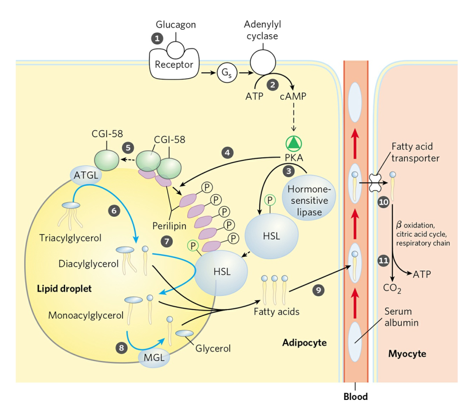 {left=36.27 top=-0.00 width=63.73 height=98.53}

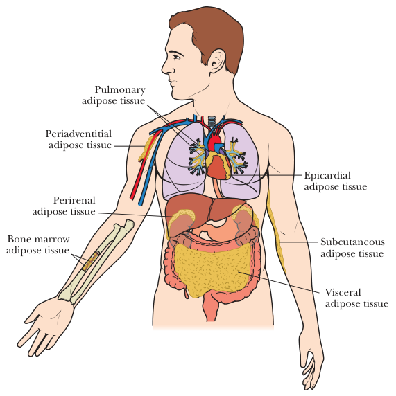 {left=0.00 top=35.41 width=36.27 height=64.59}

**Mobilization of triacylglycerols stored in adipose tissue.**

---

**Mobilization of triacylglycerols stored in adipose tissue.**
When low levels of glucose in the blood trigger the release of **glucagon**, 
1. the hormone binds its receptor in the adipocyte membrane and thus 
2. stimulates adenylyl cyclase, via a G protein, to produce cAMP. This activates PKA, which phosphorylates 
3. the hormone-sensitive lipase (HSL) and
4. perilipin molecules on the surface of the lipid droplet. Phosphorylation of perilipin causes 
5. dissociation of the protein CGI-58 from perilipin. CGI-58 then recruits adipose triacylglycerol lipase (ATGL) to the droplet surface and stimulates its lipase activity. 
6. Active ATGL converts triacylglycerols to diacylglycerols. The phosphorylated perilipin associates with phosphorylated HSL, allowing it access to the surface of the lipid droplet, where 
7. it converts diacylglycerols to monoacylglycerols. 
8. A third lipase, monoacylglycerol lipase (MGL), hydrolyzes monoacylglycerols.
9 Fatty acids leave the adipocyte, and are transported in the blood bound to serum albumin. They are released from the albumin and 
10. enter a myocyte via a specific fatty acid transporter. 
11. In the myocyte, fatty acids are oxidized to CO2, and the energy of oxidation is conserved in ATP, which fuels muscle contraction and other energy-requiring metabolism in the myocyte.

---

About 95% of the biologically available energy of triacylglycerols resides in their three long-chain fatty acids; only 5% is contributed by the glycerol moiety. The glycerol released by lipase action is phosphorylated by glycerol kinase, and the resulting glycerol 3-phosphate is oxidized to dihydroxyacetone phosphate. The glycolytic enzyme triose phosphate isomerase converts this compound to glyceraldehyde 3-phosphate, which is oxidized via glycolysis.

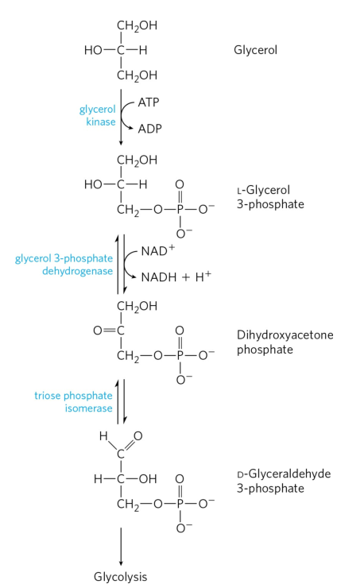 {left=67.77 top=0.00 width=32.23 height=100.00}

**Entry of glycerol into the glycolytic pathway.**

---

**Fatty Acids Are Activated and Transported into Mitochondria**

The enzymes of fatty acid oxidation in animal cells are located in the mitochondrial matrix (1948, Kennedy and Lehninger).
The fatty acids with chain lengths of 12 or fewer carbons enter mitochondria without the help of membrane transporters.
14 or more carbons (majority of the FFAs) -** carnitine shuttle -> 3 reactions**
The carnitine-mediated entry process is the rate-limiting step for oxidation of fatty acids in mitochondria and a control point.

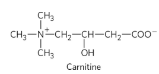 {left=72.08 top=77.04 width=27.92 height=22.96}

---

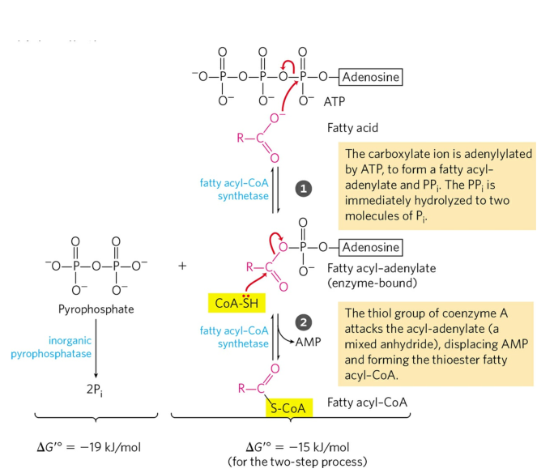 {left=34.12 top=0.00 width=65.88 height=100.00}

**First reaction of the carnitine shuttle**

The first reaction is catalyzed by a family of isozymes of acyl-CoA synthetase, each specific for fatty acids having either short, intermediate, or long carbon chains. The isozymes are present in the outer mitochondrial membrane.

---

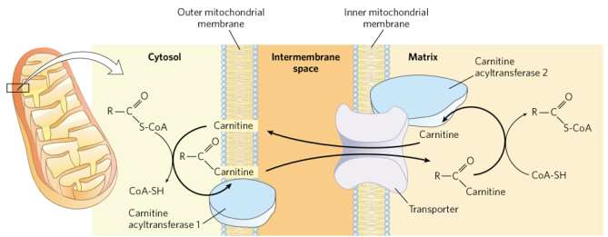 {left=36.11 top=9.60 width=63.89 height=44.31}

**Second reaction of the carnitine shuttle**

Fatty acids destined for mitochondrial oxidation are transiently attached to the hydroxyl group of carnitine to form fatty acyl–carnitine, catalyzed by carnitine acyltransferase 1 (also called carnitine palmitoyltransferase 1, CPT1). The acyl-CoA is converted to the carnitine ester as it passes through the outer membrane. The fatty acyl–carnitine ester then diffuses across the intermembrane space and enters the matrix by passive transport through the  acyl-carnitine/carnitine cotransporter of the inner mitochondrial membrane. This cotransporter moves one molecule of carnitine from the matrix to the intermembrane space as one molecule of fatty acyl–carnitine moves into the matrix.

Fatty acyl–CoA esters formed on the cytosolic side of the outer mitochondrial membrane:
can be transported into the mitochondrion and oxidized to produce ATP
can be used in the cytosol to synthesize membrane lipids.

---

 {left=25.69 top=11.77 width=63.89 height=44.31}

**Third reaction of the carnitine shuttle**

In the third and final step of the carnitine shuttle, the fatty acyl group is transferred from carnitine to intramitochondrial coenzyme A by carnitine acyltransferase 2 (also called CPT2). This isozyme, located on the inner face of the inner mitochondrial membrane, regenerates fatty acyl–CoA and releases it, along with free carnitine, into the matrix

---

■ The fatty acids of triacylglycerols furnish a large fraction of the oxidative energy in animals. Dietary triacylglycerols are emulsified in the small intestine by bile salts, hydrolyzed by intestinal lipases, absorbed by intestinal epithelial cells, reconverted into triacylglycerols, then formed into chylomicrons by combination with specific apolipoproteins.

■ Chylomicrons deliver triacylglycerols to tissues, where lipoprotein lipase releases free fatty acids for entry into cells. Triacylglycerols stored in adipose tissue are mobilized by a hormone-sensitive triacylglycerol lipase. The released fatty acids bind to serum albumin and are carried in the blood to the heart, skeletal muscle, and other tissues that use fatty acids for fuel.

■ Once inside cells, fatty acids are activated at the outer mitochondrial membrane by conversion to fatty acyl–CoA thioesters. Fatty acyl–CoA that is to be oxidized enters mitochondria in three steps, via the carnitine shuttle.

---

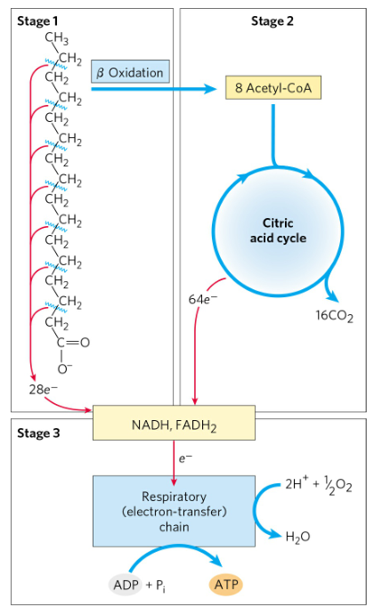 {left=65.36 top=0.00 width=34.64 height=100.00}

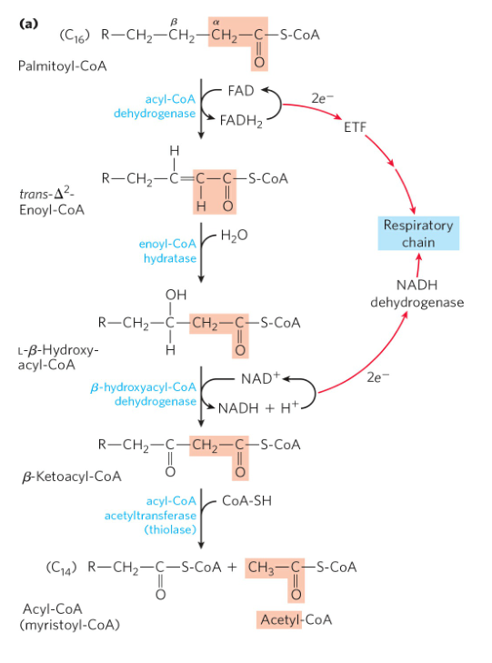 {left=15.35 top=0.00 width=41.74 height=100.00}

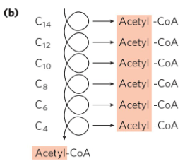 {left=47.81 top=70.23 width=18.67 height=29.77}

**𝞫-oxidation**

---

**Retro-Claisen cleavage**

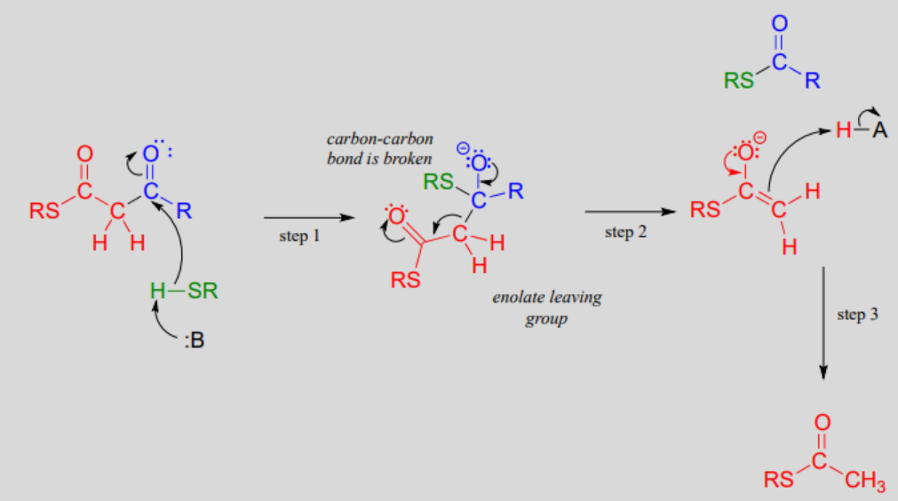 {left=37.44 top=13.55 width=62.56 height=62.15}

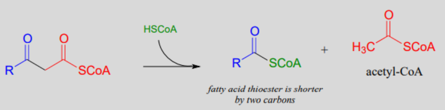 {left=16.01 top=70.12 width=67.98 height=29.88}

---

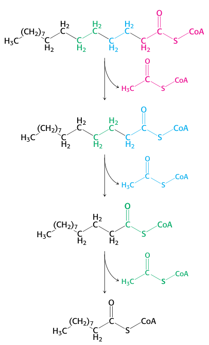 {left=43.18 top=15.63 width=28.67 height=84.37}

First three rounds in the degradation of palmitate. Full oxidation yields 106 ATP

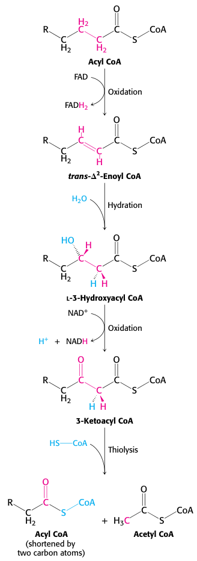 {left=16.35 top=0.00 width=19.82 height=100.00}

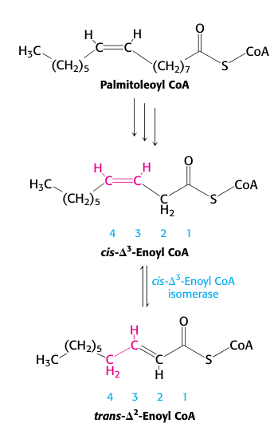 {left=75.19 top=31.40 width=24.81 height=68.60}

Cis-𝚫3-Enoyl CoA isomerase allows continued 𝞫-oxidation
of fatty acids with a single double bond

---

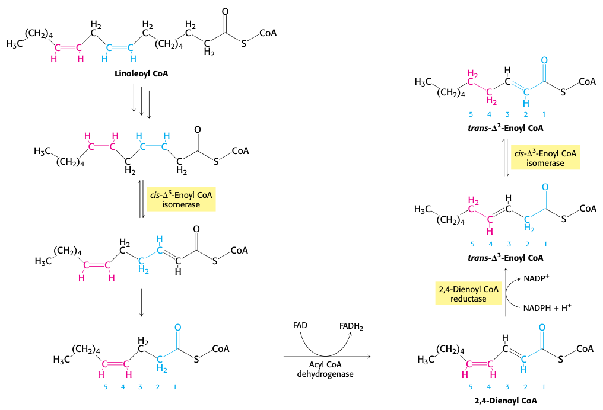 {left=17.41 top=0.00 width=82.59 height=100.00}

**Oxidation of linoleoyl CoA.** The complete oxidation of the diunsaturated fatty acid linoleate is facilitated by the activity of enoyl CoA isomerase and 2,4-dienoyl CoA reductase.

acetyl-CoA ->

---

Odd-chain fatty acids yield propionyl CoA in the final thiolysis step

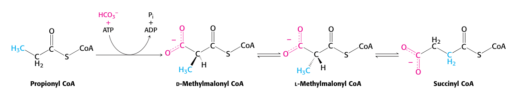 {left=16.85 top=15.06 width=80.75 height=26.69}

Odd-chain fatty acids are ***rare***** **compared to even-chain ones.
β-oxidation proceeds normally until the final cycle, which yields:
**Propionyl-CoA (3C)**
**Acetyl-CoA (2C)**
**Entry into the TCA Cycle**
**Propionyl-CoA → Succinyl-CoA**
Allows odd-chain fatty acids to enter the **citric acid cycle**.

Propionyl-CoA carboxylase (biotin-dependent)

Methylmalonyl-CoA racemase

**B₁₂-Dependent Rearrangement**
**Enzyme:** Methylmalonyl-CoA mutase (requires **vitamin B₁₂/cobalamin**)
**Reaction:**
L-Methylmalonyl-CoA → **Succinyl-CoA**
**Mechanism:**
Intramolecular rearrangement
**CoA-COO⁻ group shifts from carbon 2 → methyl carbon**
Hydrogen swaps positions with the migrating group
**This is a rare radical-based rearrangement unique to B₁₂ chemistry.**

---

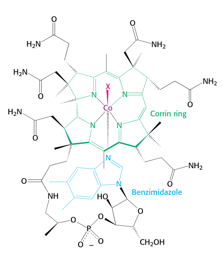 {left=16.86 top=0.00 width=37.45 height=72.28}

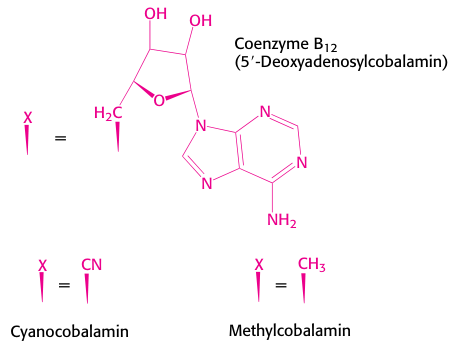 {left=66.82 top=0.00 width=33.18 height=43.60}

**Cobalamin-Dependent Enzymes Catalyze 3 Reaction Types**
**1.** Intramolecular rearrangements
**2.** Methylation reactions (e.g., methionine synthesis)  
**3.** Reduction of ribonucleotides → deoxyribonucleotides
**B₁₂ Reactions in Mammals (Only 2!)**
**1.** L-Methylmalonyl-CoA → Succinyl-CoA
**2.** Homocysteine → Methionine (Methionine synthase, provides methionine, needed to form SAM (S-adenosylmethionine) and other coenzymes used in purine and thymine synthesis, critical for DNA and RNA synthesis.

---

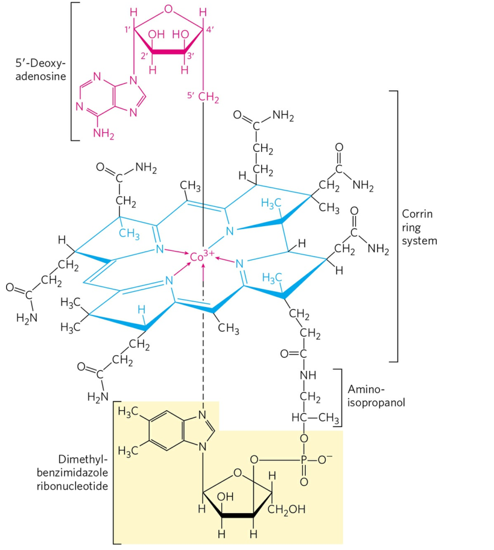 {left=65.13 top=15.03 width=34.87 height=76.07}

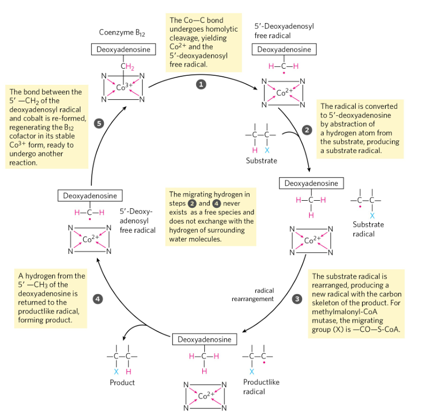 {left=16.50 top=12.07 width=46.80 height=82.00}

---

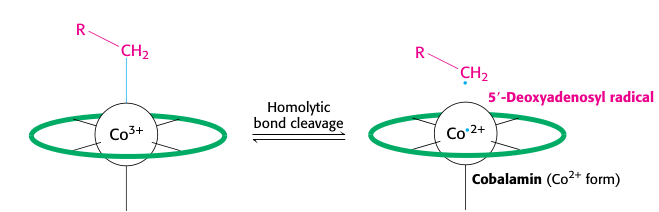 {left=16.35 top=0.00 width=50.80 height=29.05}

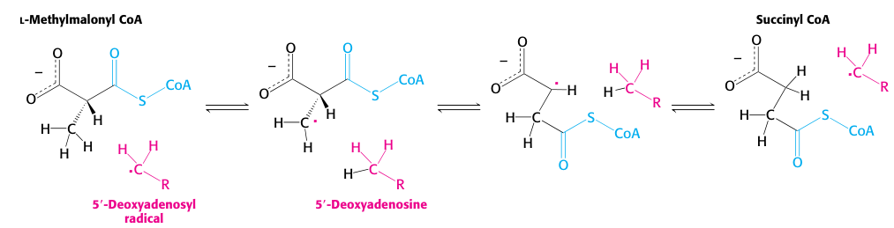 {left=16.35 top=32.89 width=83.65 height=38.02}

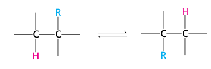 {left=69.49 top=9.61 width=30.51 height=17.72}

Highly reactive!

The role of coenzyme B12 in such intramolecular migrations is to serve as a source of free radicals for the abstraction of hydrogen atoms.

---

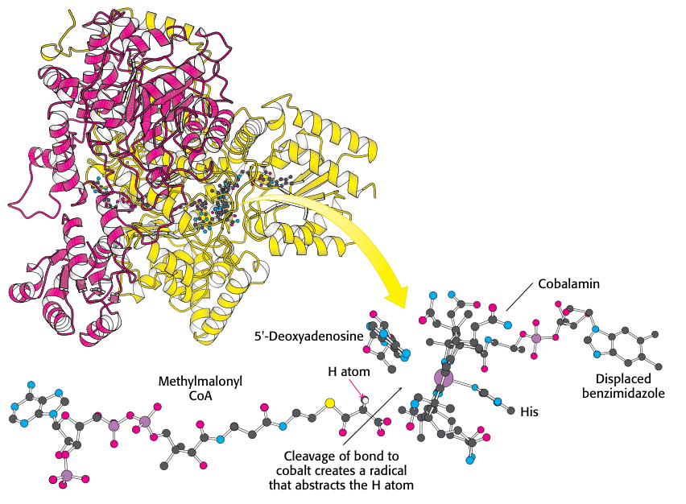 {left=16.86 top=4.45 width=72.02 height=94.07}

**Active site of methylmalonyl CoA mutase.** Notice that a histidine residue from the enzyme binds to cobalt in place of benzimidazole. This arrangement of substrate and coenzyme in the active site facilitates the cleavage of the cobalt–carbon bond and the subsequent abstraction of a hydrogen atom from the substrate.

---

**Methylmalonic Acid (MMA) — Clinical Use**

• **Why measure MMA?**
  – Serum B₁₂ levels are unreliable (inactive forms inflate results).
  – MMA rises only when B₁₂-dependent methylmalonyl-CoA mutase fails.
  – Best marker of functional B₁₂ deficiency.

• **When is it useful?**
  – Borderline B₁₂ levels (200–400 pg/mL)
  – Unexplained neuropathy or cognitive decline
  – Elderly patients with normal B₁₂ but symptoms
  – Differentiating B₁₂ vs folate deficiency
      ▸ B₁₂ deficiency: ↑ MMA + ↑ homocysteine  
      ▸ Folate deficiency: normal MMA, ↑ homocysteine

• **Special notes**
  – Elevated MMA is early and sensitive.
  – False positives in renal failure.
  – Used in newborn screening for metabolic disorders.

---

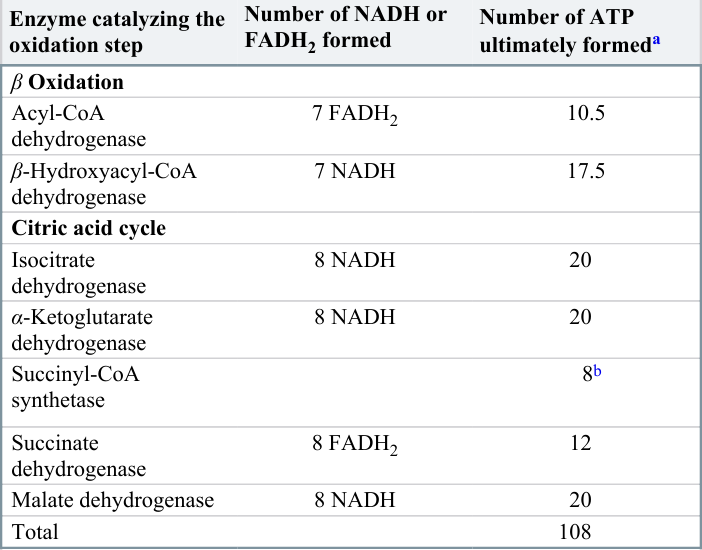 {left=32.46 top=2.96 width=67.54 height=94.07}

---

Duration: Up to 7 months of continuous dormancy.
Body Temperature: ~31 °C (close to normal 40 °C).
Energy Use: ~25,000 kJ/day from fat stores; no eating, drinking, urination, or defecation.
Physiological Changes: Heart rate: 90 → 8 bpm, Respiration: 6–10 → ~1 breath/min
Fuel Source: Body fat exclusively, Fat Oxidation Provides energy, water (from oxidation), and substrates for gluconeogenesis.
Nitrogen Recycling: Urea reabsorbed → amino groups reused for protein synthesis.
Storage: Pre-hibernation, bears eat up to 84,000 kJ/day → fattening up.
Weight Loss: 15–40% of body weight during hibernation.
Bears maintain high body temperature; smaller mammals (e.g., Arctic ground squirrel) approach ambient temperature (~0 °C) and have intermittent wake periods with feeding and waste elimination.
Medical & Scientific Relevance: Insights into organ preservation for transplantation, Potential applications in human torpor for long-duration space missions.

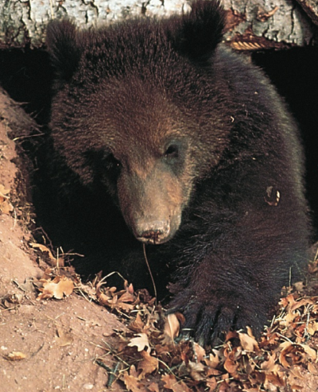 {left=61.82 top=5.84 width=38.18 height=83.67}

---

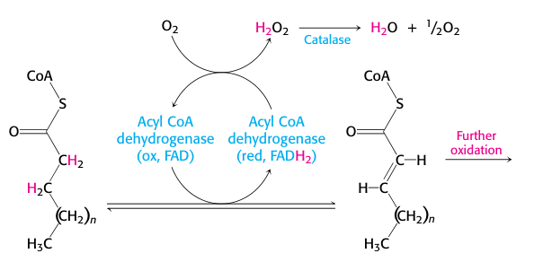 {left=17.58 top=16.43 width=44.29 height=38.07}

Peroxisomes degrade Very Long Chain Fatty Acids (≥ C20)

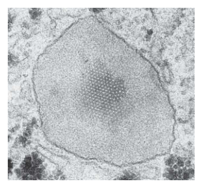 {left=72.00 top=14.13 width=26.34 height=42.68}

Peroxisomes handle fatty acids that mitochondria cannot easily oxidize, especially:
Very-long-chain fatty acids (VLCFAs) (≥ C20)
Branched-chain fatty acids (phytanic acid → α-oxidation)
Dicarboxylic fatty acids
Some eicosanoids and unusual lipids

Peroxisomal oxidation differs
from b oxidation in the initial dehydrogenation reaction. Peroxisomes do NOT make ATP, energy lost as heat.

---

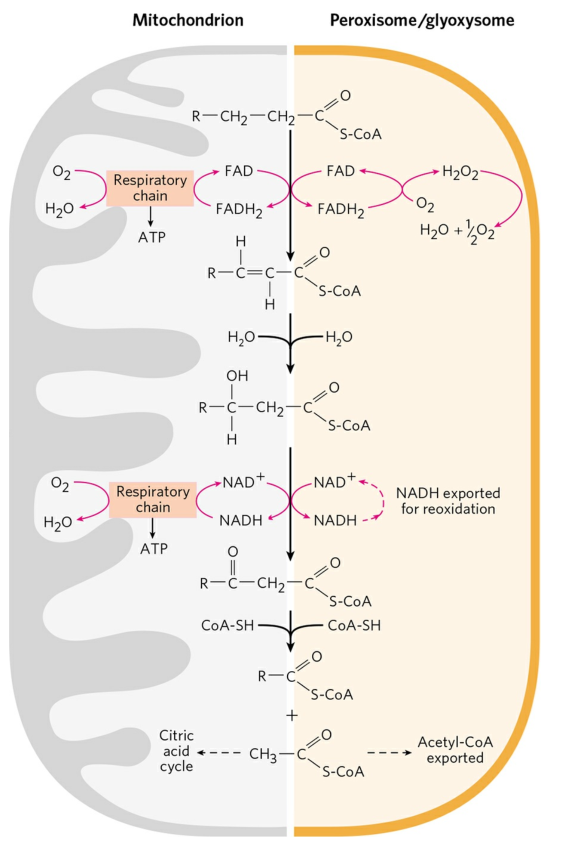 {left=63.42 top=2.96 width=36.58 height=94.07}

**Comparison of β oxidation in mitochondria and in peroxisomes and glyoxysomes.** 
The peroxisomal/glyoxysomal system differs from the mitochondrial system in three respects: **(1)** the peroxisomal system prefers very-long-chain fatty acids; **(2)** in the first oxidative step, electrons pass directly to O2, generating H2O2; and **(3)** the NADH formed in the second oxidative step cannot be reoxidized in the peroxisome or glyoxysome, so reducing equivalents are exported to the cytosol, eventually entering mitochondria. The acetyl-CoA produced by peroxisomes and glyoxysomes is also exported; the acetate from glyoxysomes (organelles found only in germinating seeds) serves as a biosynthetic precursor. Acetyl-CoA produced in mitochondria is further oxidized in the citric acid cycle.

---

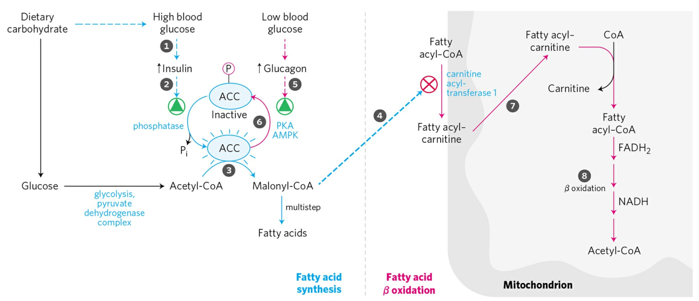 {left=32.00 top=0.00 width=66.58 height=51.24}

When the diet provides a ready source of carbohydrate as fuel, β oxidation of fatty acids is unnecessary and is therefore down-regulated. Two enzymes are key to the coordination of fatty acid metabolism: acetyl-CoA carboxylase (ACC), the first enzyme in the synthesis of fatty acids, and carnitine acyltransferase **1**, which limits the transport of fatty acids into the mitochondrial matrix for β oxidation. Ingestion of a high-carbohydrate meal raises the blood glucose level and thus **1** triggers the release of insulin. **2** Insulin-dependent protein phosphatase dephosphorylates ACC, activating it. **3** ACC catalyzes the formation of malonyl-CoA (the first intermediate of fatty acid synthesis), and **4** malonyl-CoA inhibits carnitine acyltransferase **1**, thereby preventing fatty acid entry into the mitochondrial matrix. When blood glucose levels drop between meals, **5** glucagon release activates cAMP-dependent protein kinase (PKA), which **6** phosphorylates and inactivates ACC. When [AMP] rises, AMPK also phosphorylates and inactivates ACC. The concentration of malonyl-CoA falls, the inhibition of fatty acid entry into mitochondria is relieved, and fatty acids **7** enter the mitochondrial matrix and **8** become the major fuel. Because glucagon also triggers the mobilization of fatty acids in adipose tissue, a supply of fatty acids begins arriving in the blood.

**Coordinated regulation of fatty acid synthesis and breakdown.**

---

**Evolution**

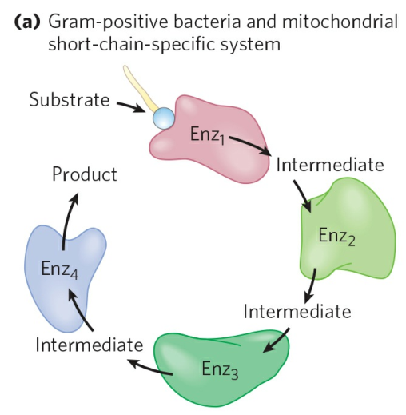 {left=38.54 top=7.24 width=27.12 height=49.26}

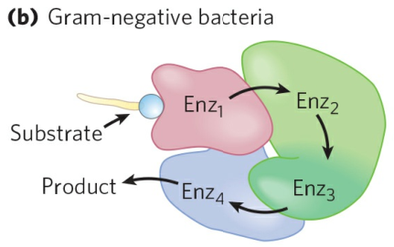 {left=40.01 top=59.92 width=32.54 height=36.37}

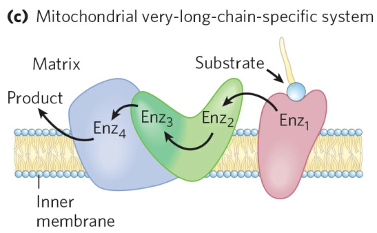 {left=65.66 top=7.24 width=35.01 height=38.45}

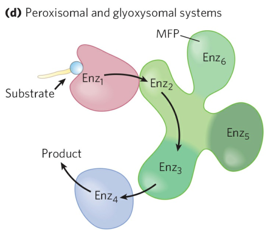 {left=73.55 top=56.82 width=27.12 height=42.57}

**Enz₁**  Acyl-CoA dehydrogenase
**Enz₂**  Enoyl-CoA hydratase
**Enz₃**  L-β-Hydroxyacyl-CoA dehydrogenase
**Enz₄**  Thiolase
**Enz₅**  D-3-Hydroxyacyl-CoA epimerase
**Enz₆**  Δ³,Δ²-Enoyl-CoA isomerase

---

**(a)** The four enzymes of β oxidation in gram-positive bacteria are separate, soluble entities, as are those of the short-chain-specific system of mitochondria. 
**(b)** In gram-negative bacteria, the four enzyme activities reside in three polypeptides; Enz2 and Enz3 are parts of a single polypeptide chain. 
**(c) **The very-long-chain-specific system of mitochondria is also composed of three polypeptides, one of which includes the activities of Enz2 and Enz3; in this case, the system is bound to the inner mitochondrial membrane. 
**(d)** In the peroxisomal and glyoxysomal β-oxidation systems, Enz1 and Enz4 are separate polypeptides, but Enz2 and Enz3, as well as two auxiliary enzymes (Enz5 and Enz6), are part of a single polypeptide chain: the multifunctional protein, MFP.

in bacteria, the seven enzymes needed for fatty acid synthesis are
separate polypeptides
in mammals, all seven activities are part of a single, huge polypeptide chain

---

**The ω Oxidation of Fatty Acids**

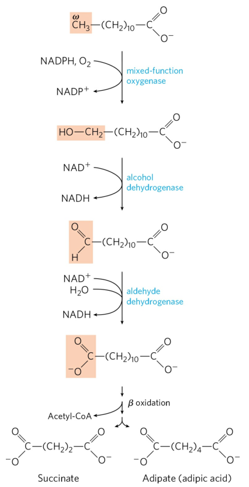 {left=71.16 top=0.00 width=28.84 height=100.00}

*Occurs in the Endoplasmic Reticulum*
**Alternative fatty acid degradation pathway**
Mitochondrial β-oxidation acts at the **carboxyl end**
ω-oxidation targets the **ω (terminal) carbon**
**Location & Substrates**
Enzymes in **ER of liver and kidney**
Prefer **10–12 carbon fatty acids**
**Importance**
Minor under normal conditions
Becomes significant if **β-oxidation is defective** (e.g., carnitine deficiency)
**Steps**
**Hydroxylation** of ω carbon via **cytochrome P450 + NADPH**
**Alcohol dehydrogenase:** hydroxyl → aldehyde
**Aldehyde dehydrogenase:** aldehyde → carboxylic acid → **dicarboxylic acid**
**Fate of dicarboxylic acids**
Activated by CoA, enter **mitochondrial β-oxidation**
Shortened to acetyl-CoA and **succinic acid** → **citric acid cycle**

---

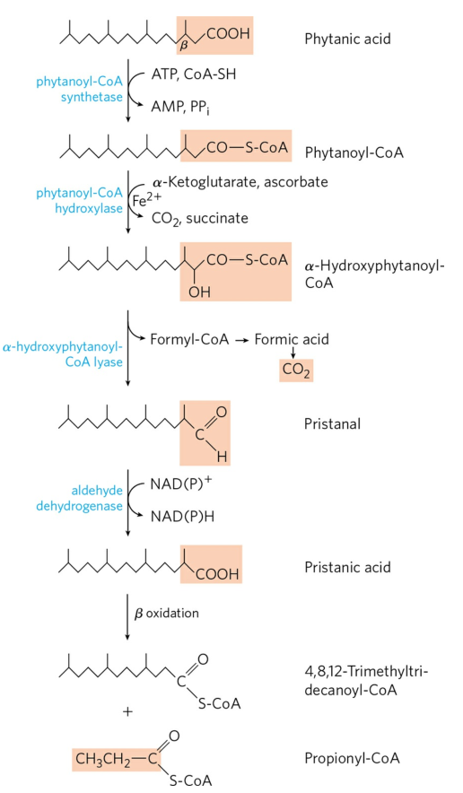 {left=67.17 top=0.00 width=32.83 height=100.00}

Phytanic acid (the typical western diet includes 50 to 100 mg of phytanic acid per day) has a methyl-substituted β carbon and
therefore cannot undergo β oxidation. The combined action of the enzymes shown here removes the carboxyl carbon of phytanic acid to produce pristanic acid, in which the β carbon is unsubstituted, allowing β oxidation. Notice that β
oxidation of pristanic acid releases propionyl-CoA, not acetyl-CoA.

**Refsum disease**, resulting from a genetic defect in phytanoyl-CoA hydroxylase, leads to the accumulation of very high blood levels of phytanic acid, causing (by unknown mechanisms) severe neurological deficits, including blindness and deafness.

**The α oxidation of a branched-chain fatty acid (phytanic acid) in peroxisomes.**

---

Ketone Bodies

Keeping the brain alive during crisis

---

**Animals Cannot Convert Fatty Acids Into Glucose**
**Fat stores are abundant**, but **cannot be used to make glucose** when glycogen is depleted.
Critical tissues (e.g., **brain**, **active muscle**) need **glucose**, not acetyl-CoA.
**Biochemical Reason**
**Fatty acids → acetyl-CoA**
**Acetyl-CoA cannot be converted back into pyruvate or oxaloacetate**
Pyruvate → acetyl-CoA is **irreversible**
No pathway exists in animals for **acetyl-CoA → pyruvate/OAA**
**Citric Acid Cycle Limitation**
Acetyl-CoA enters the **citric acid cycle**
But:
**2 carbons enter as acetyl-CoA**
**2 carbons leave as CO₂** (via isocitrate DH and α-ketoglutarate DH)
Oxaloacetate is **regenerated**, not created **de novo** → **No net gain of OAA**, so **no net synthesis of glucose**
**Contrast With Plants**
Plants have additional enzymes (glyoxylate cycle) → allow **conversion of acetyl-CoA into oxaloacetate** → animals do **not**, so they **cannot** turn fats into glucose.

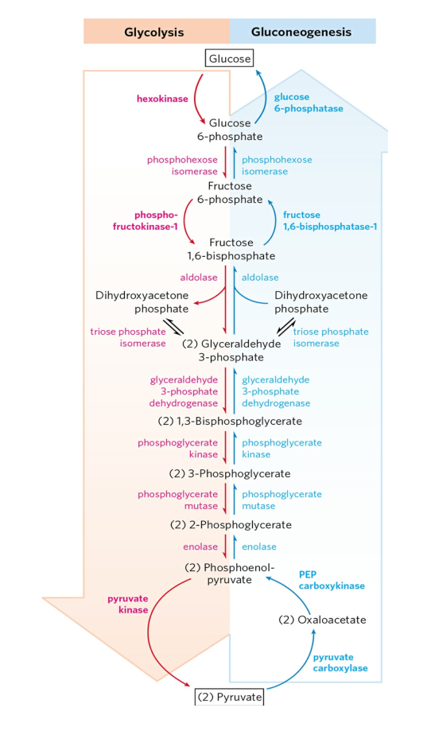 {left=75.67 top=13.79 width=24.33 height=86.21}

---

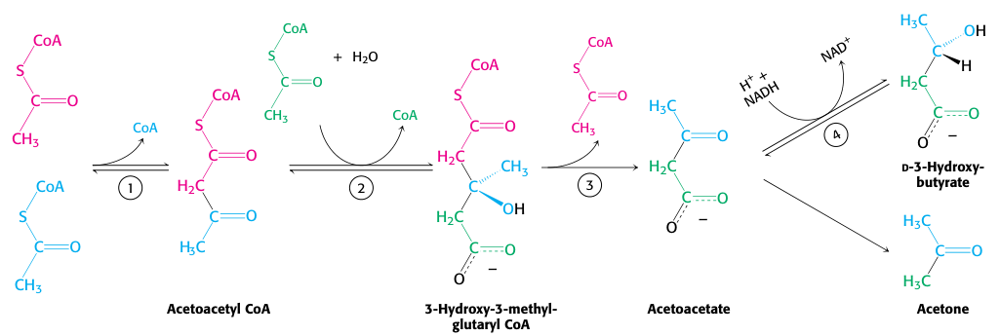 {left=16.44 top=0.00 width=83.56 height=50.00}

**Formation of ketone bodies.** The ketone bodies—acetoacetate, D-3-
hydroxybutyrate, and acetone—are formed from acetyl CoA primarily in the **liver**. Enzymes catalyzing these reactions are 
**(1)** 3-ketothiolase, 
**(2)** hydroxymethylglutaryl CoA synthase, 
**(3)** hydroxymethylglutaryl CoA cleavage enzyme, and 
**(4)** D-3-hydroxybutyrate dehydrogenase. Acetoacetate spontaneously decarboxylates to form acetone.

---

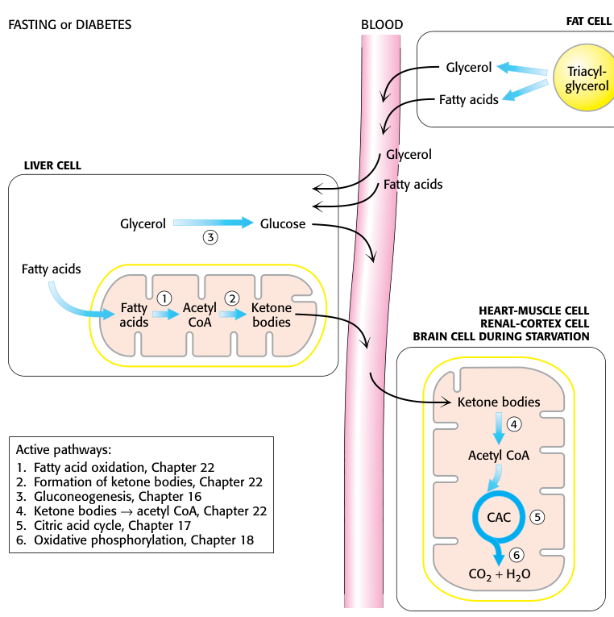 {left=47.29 top=2.96 width=52.71 height=94.07}

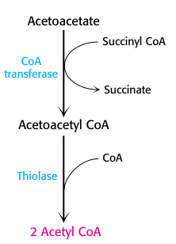 {left=20.35 top=0.00 width=20.27 height=50.00}

Ketone bodies can be regarded as a water-soluble, transportable form of acetyl units. Fatty acids are released by adipose tissue and converted into acetyl units by the liver, which then exports them as acetoacetate. As might be expected, acetoacetate also has a regulatory role. High levels of acetoacetate in the blood signify an abundance of acetyl units and lead to a decrease in the rate of lipolysis in adipose tissue.

Chapter numbers rely to Stryer “Biochemistry”

---

**Ketone Bodies**

**Major Producers & Types**
Produced in **liver mitochondria**:
**Acetoacetate**, **3-Hydroxybutyrate**, **Acetone**
Exported from liver → diffuse into **blood** → used by **extrahepatic tissues**
**Physiological Role**
**Heart** and **renal cortex** preferentially use **acetoacetate** over glucose
**Brain** normally uses glucose but switches to ketone bodies during **starvation/diabetes**
In prolonged starvation: **~75% of brain energy** from ketone bodies
Ketone bodies = **water-soluble “acetyl-unit transport form”**
**Utilization in Tissues**
**Acetoacetate → acetoacetyl-CoA**
Via **CoA transferase** (absent in liver → liver cannot use ketones)
**Acetoacetyl-CoA → 2 acetyl-CoA** (thiolase → enters TCA cycle)
**3-Hydroxybutyrate → acetoacetate + NADH** → processed as above

**Metabolic Regulation**
High acetoacetate levels ↓ **lipolysis** in adipose tissue (feedback signal of abundant acetyl units)
**Pathology: Diabetic Ketoacidosis (DKA)**
**Insulin deficiency →**
Liver cannot absorb glucose → insufficient oxaloacetate
Adipose tissue releases excess FAs → massive ketogenesis
Result: **high ketone levels **(0.9 vs 0.03 mg/mL in blood, 5 vs 0.125 g/24h urinary excretion), **acidosis**, impaired CNS function
**Therapeutic Note**
**Ketogenic diets** (high fat, low carb) induce mild ketosis
Used clinically in **drug-resistant childhood epilepsy** (mechanism unclear)

---

Ornithine Cycle

Recycling Nitrogen

---

1. During the normal synthesis and degradation of cellular proteins, some amino acids that are released from protein breakdown and are not needed for new protein synthesis undergo oxidative degradation.

2. When a diet is rich in protein and the ingested amino acids exceed the body’s needs for protein synthesis, the surplus is catabolized; **amino acids cannot be stored**.

3. During starvation or in uncontrolled diabetes mellitus, when carbohydrates are either unavailable or not properly utilized, cellular proteins are used as fuel.

4. Under all these metabolic conditions, amino acids lose their amino groups to
form α-keto acids, the “carbon skeletons” of amino acids. The α-keto acids
undergo oxidation to CO2 and H2O or, often more importantly, provide three-
and four-carbon units that can be converted by gluconeogenesis into glucose,
the fuel for brain, skeletal muscle, and other tissues.

5. The pathways of amino acid catabolism are quite similar in most organisms.

**Metabolic fates of amino acids**

---

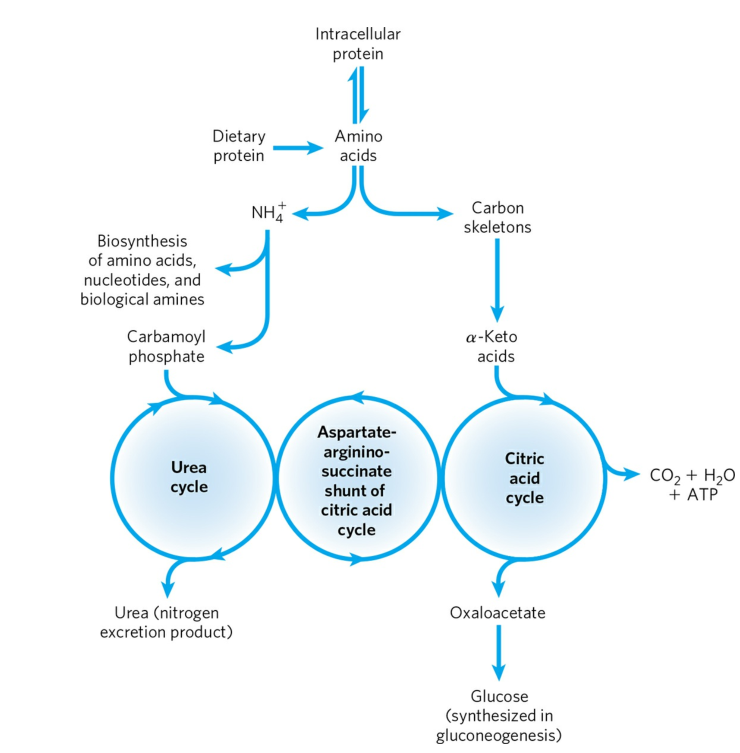 {left=61.71 top=0.00 width=38.29 height=75.67}

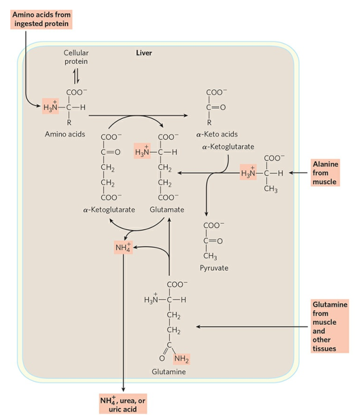 {left=15.58 top=0.00 width=40.26 height=84.11}

 {left=33.43 top=79.55 width=13.63 height=20.45}

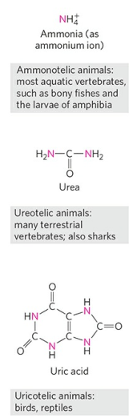 {left=48.56 top=75.67 width=17.81 height=24.33}

 {left=65.53 top=66.86 width=17.81 height=33.14}

---

**Amino acid catabolism in mammals**

Four amino acids play central roles in nitrogen metabolism: glutamate, glutamine, alanine, and aspartate. 
These are the ones most easily converted into citric acid cycle intermediates: 
glutamate and glutamine to α-ketoglutarate, 
alanine to pyruvate, and 
aspartate to oxaloacetate. 
Glutamate and glutamine are especially important, acting as a kind of general collection point for amino groups. In the cytosol of liver cells (hepatocytes), amino groups from most amino acids are transferred to α-ketoglutarate to form glutamate, which enters mitochondria and gives up its amino group to form NH4+. 
Excess ammonia generated in most other tissues is converted to the amide nitrogen of glutamine, which passes to the liver, then into liver mitochondria.
Glutamine or glutamate or both are present in higher concentrations than other amino acids in most tissues.
In skeletal muscle, excess amino groups are generally transferred to pyruvate to form alanine.

---

The **liver is the only organ** that fully performs the urea cycle.
The cycle converts **toxic ammonia (NH₃)**, produced during amino acid breakdown, into **urea**, which is safe and excreted by the kidneys.
Two urea-cycle enzymes are located in the **mitochondria of hepatocytes**, the other three in the cytosol — so the liver has the necessary compartmentalization.
When other tissues generate ammonia, they send it to the liver in the form of **alanine** or **glutamine**, and the liver detoxifies it through the urea cycle.

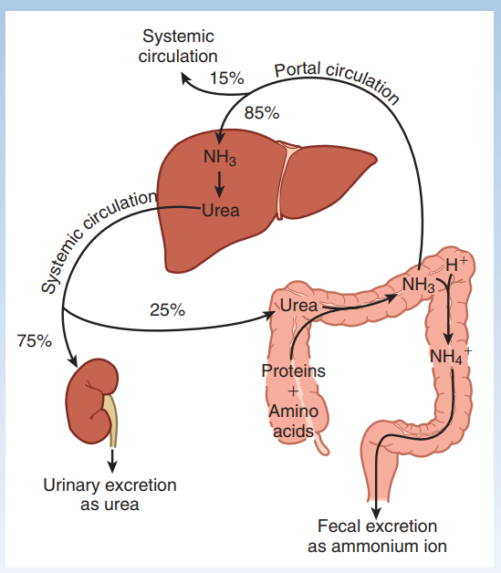 {left=55.47 top=2.96 width=42.86 height=87.17}

---

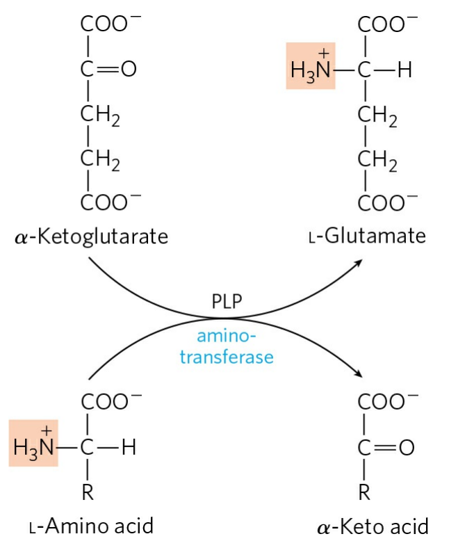 {left=54.33 top=0.00 width=45.67 height=100.00}

**Enzyme-catalyzed transaminations.**

The first step in the catabolism of most L-amino acids, once they have reached the **liver**, is removal of the α-amino groups, promoted by enzymes called aminotransferases or transaminases.

In many aminotransferase reactions, α-ketoglutarate is the amino group acceptor. All aminotransferases have pyridoxal phosphate (PLP) as cofactor. Although the reaction is shown here in the direction of transfer of the amino group to α-
ketoglutarate, it is readily reversible (ΔG′ ≈ 0 kJ/mol).

---

 {left=81.62 top=0.00 width=18.38 height=45.16}

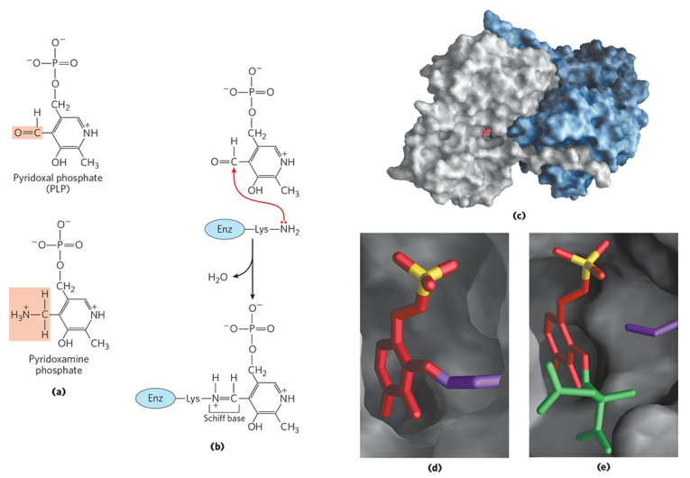 {left=77.67 top=45.16 width=22.33 height=54.84}

All aminotransferases have the same prosthetic group and the same reaction mechanism. The prosthetic group is pyridoxal phosphate (PLP), the coenzyme form of pyridoxine, or vitamin B6.

Pyridoxal phosphate functions as an intermediate carrier of amino groups at the active site of aminotransferases. It undergoes reversible transformations between its aldehyde form, pyridoxal phosphate, which can accept an amino
group, and its aminated form, pyridoxamine phosphate, which can donate its amino group to an α-keto acid.

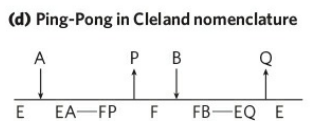 {left=18.54 top=59.17 width=27.54 height=20.15}

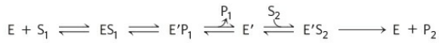 {left=16.41 top=81.14 width=57.29 height=10.00}

---

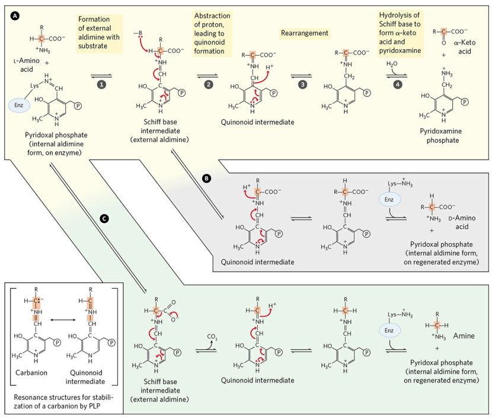 {left=37.70 top=0.00 width=62.30 height=94.07}

**A** transamination, 
**B** racemization,  
**C** decarboxylation

The highly conjugated structure of PLP (an electron sink) permits delocalization of the negative charge.

**A** transamination: first go all left,than all right (full cycle)

---

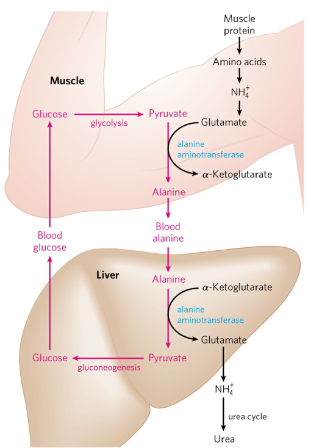 {left=60.92 top=0.00 width=39.08 height=100.00}

**Glucose-alanine cycle.** 

Alanine serves as a carrier of ammonia and of the carbon skeleton of pyruvate from skeletal muscle to liver. The ammonia is excreted and the pyruvate is used to produce glucose, which is returned to the muscle.

---

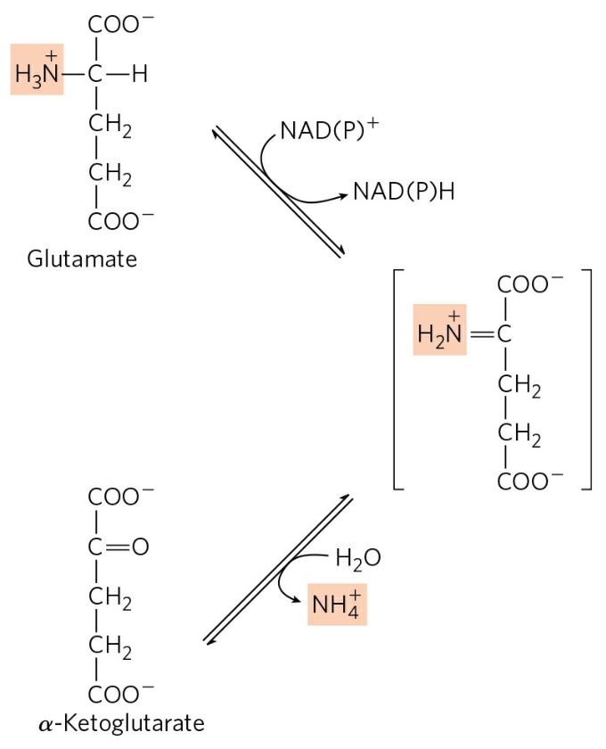 {left=54.46 top=0.00 width=45.54 height=100.00}

**Reaction catalyzed by glutamate dehydrogenase.** 

The glutamate dehydrogenase of mammalian liver has the unusual capacity to use either NAD+ or NADP+ as cofactor. The glutamate dehydrogenases of plants
and microorganisms are generally specific for one or the other. The mammalian enzyme is allosterically regulated by GTP and ADP.

---

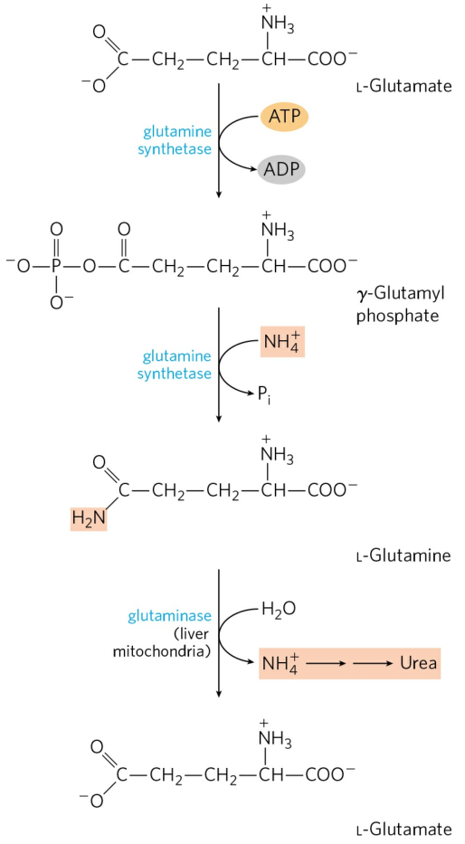 {left=69.01 top=0.00 width=30.99 height=100.00}

**Ammonia transport in the form of glutamine. **

Excess ammonia in tissues is added to glutamate to form glutamine, a process catalyzed by **glutamine synthetase**. After transport in the bloodstream, the glutamine enters the liver, and
NH4+ is liberated in mitochondria by the enzyme **glutaminase**.

In metabolic acidosis there is an increase in glutamine processing by the kidneys. Not all the excess NH4+ thus produced is released into the bloodstream or converted to urea; some is excreted directly into the urine. In the kidney, the NH4+ forms salts with metabolic acids, facilitating their removal in the urine. Bicarbonate produced by the decarboxylation of α-ketoglutarate in the citric acid cycle can also serve as a buffer in blood plasma. Taken together, these effects tend to counteract acidosis.

---

**Ammonia Is Toxic to Animals**
**Why ammonia is dangerous**
Ammonia is highly toxic, especially to the **brain**.
Symptoms: cognitive impairment, ataxia, seizures, brain swelling → death.
In blood, **98% of ammonia is NH₄⁺**, which **cannot cross membranes**.
The small amount of **NH₃** *can cross all membranes*, including the blood–brain barrier → accumulates inside cells as NH₄⁺.
**Detoxification pathways**
**Astrocytes** (only) express **glutamine synthetase**, converting:
α-ketoglutarate → glutamate → glutamine
Consequences:
Depletes **glutamate** (key neurotransmitter).
May reduce GABA levels.
But this pathway is **insufficient in ammonia overload**.
Multiple metabolic pathways send excess ammonia to the **mitochondria of hepatocytes**, where it is converted to **urea**.

**NH****3**** Disrupts the Brain**
**1. Potassium homeostasis fails**
NH₄⁺ competes with **K⁺** for **Na⁺/K⁺-ATPase** transport.
→ ↑ extracellular K⁺.
**2. Neurons become hyperexcitable**
Excess K⁺ enters neurons via **NKCC1** (Na⁺–K⁺–2Cl⁻ cotransporter), bringing Cl⁻ with it.
High intracellular Cl⁻ reverses neuronal response to **GABA** → **GABA becomes depolarizing instead of inhibitory**.
Result: **abnormal firing → ataxia + seizures**.
**3. Brain swelling (edema)**
Persistent NH₄⁺ → astrocyte channel dysfunction → water influx → **astrocyte swelling → fatal cerebral edema**.

---

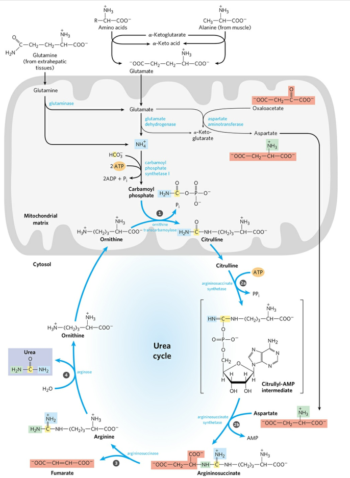 {left=58.82 top=0.00 width=41.18 height=100.00}

**Step 1** – Ornithine Transcarbamoylase (mitochondria)
Carbamoyl phosphate + ornithine → citrulline + Pi
Citrulline is then transported to the cytosol.

**Step 2** – Argininosuccinate Synthetase (cytosol)
Citrulline + aspartate + ATP → argininosuccinate
Forms a citrullyl-AMP intermediate; introduces the second amino group.

**Step 3** – Argininosuccinase (cytosol)
Argininosuccinate → arginine + fumarate
Only reversible step; fumarate returns to TCA (→ malate).

**Step 4** – Arginase (cytosol)
Arginine → urea + ornithine
Ornithine re-enters mitochondria to start the next cycle.

---

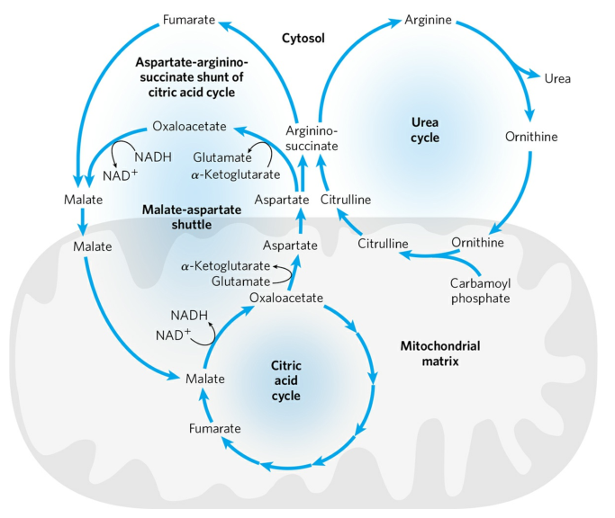 {left=37.25 top=2.96 width=62.75 height=94.07}

**Links between the urea cycle and citric acid cycle.** 

The pathways linking the citric acid and urea cycles are known as the **aspartateargininosuccinate shunt**.

---

**Aminotransferases (ALT, AST)**
**ALT (Alanine aminotransferase, GPT)**
**AST (Aspartate aminotransferase, GOT)** **↑ in blood → liver or heart cell injury.** Leak into serum after **heart attack**, **viral/drug-induced hepatitis**, or **toxin exposure** (carbon tetrachloride, chloroform).
**Timing after myocardial infarction (MI):**
AST rises early after MI.
ALT rises later (more liver-specific).
**Creatine Kinase (CK or CPK)**
First enzyme to rise after MI.
Appears quickly and also **disappears quickly**, useful for early diagnosis.
CK-MB isoform is most specific for cardiac injury.
**Lactate Dehydrogenase (LDH)**
Elevated in **heart, liver, or muscle damage**.
Rises later than CK and remains high longer.
LDH-1 > LDH-2 (“flip”) suggests **MI**.

**Medical Relevance**
**Why these enzymes rise**
Cell injury → loss of membrane integrity → cytosolic enzymes leak into blood.
Measuring specific patterns **helps identify the organ damaged and timing of injury**.
**Alkaline Phosphatase (ALP)**
**↑ in cholestasis**, bile duct obstruction, bone disorders (high osteoblast activity).
**Gamma-Glutamyl Transferase (GGT)**
Sensitive marker of **bile duct injury** and **alcohol abuse**.
↑ GGT + ↑ ALP → hepatobiliary disease.
**Amylase & Lipase**
**Amylase**: rises quickly in **acute pancreatitis**.
**Lipase**: more specific for pancreas; stays elevated longer.

---

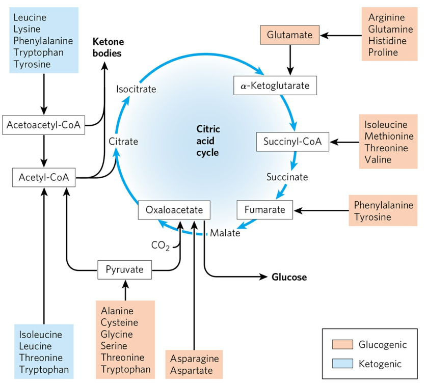 {left=37.48 top=0.00 width=62.52 height=100.00}

**Summary of amino acid catabolism. **

Amino acids are grouped according to their major degradative end product. Some amino acids are listed more than once because different parts of their carbon skeletons are degraded to different end products. The figure shows the most important catabolic pathways in vertebrates, but there are minor variations among vertebrate species.

---

Heme Degradation

For vampires

---

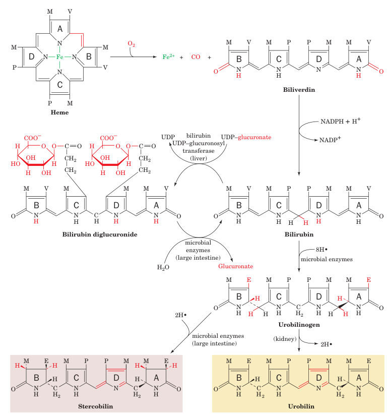 {left=46.87 top=0.00 width=52.89 height=100.00}

Newborn infants, particularly when
premature, often become jaundiced because their livers do not yet make sufficient bilirubin UDP-glucuronosyltransferase to glucuronidate the incoming ilirubin. Jaundiced infants are treated by bathing them with light from a fluorescent lamp; this photochemically converts bilirubin to more soluble isomers that the infant can degrade and excrete.

 {left=54.28 top=59.25 width=11.38 height=24.45}

M = Methyl group (–CH₃)
V = Vinyl group (–CH=CH₂)
P = Propionate group (–CH₂–CH₂–COO⁻)

---

Lipid Biosynthesis

Getting fat

---

Fatty acid **oxidation** takes place by the oxidative removal of successive two-​carbon (acetyl-CoA) units
It was expected that the biosynthesis of fatty acids might proceed by a simple reversal of the same enzymatic steps (like glycolysis/gluconeogenesis). 
BUT fatty acid biosynthesis and breakdown occur by 
different pathways, 
are catalyzed  by different sets of enzymes, and 
take place in different parts of the cell
requires the participation of a three-carbon intermediate, **malonyl-CoA**, that does not appear in the path of fatty acid breakdown.

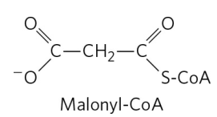 {left=21.77 top=67.86 width=28.23 height=27.04}

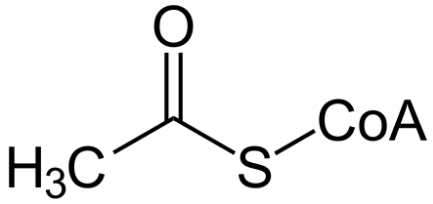 {left=60.98 top=67.86 width=26.56 height=22.24}

Acetyl-CoA

---

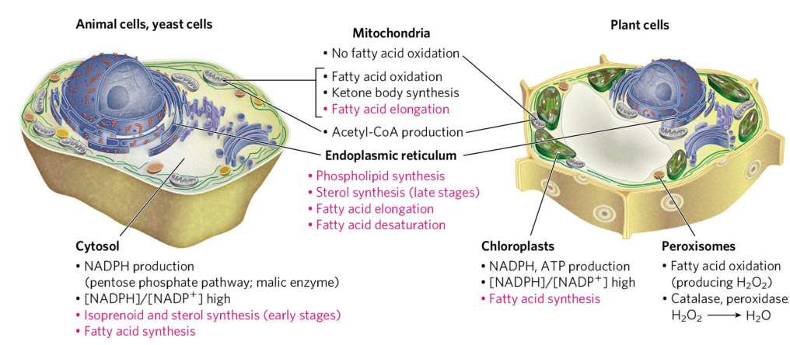 {left=17.63 top=0.00 width=82.37 height=64.00}

**Subcellular localization of lipid metabolism. **Yeast and animal cells differ from higher plant cells in the compartmentation of lipid metabolism. Fatty acid synthesis takes place in the compartment in which NADPH is available for reductive synthesis (i.e., where the [NADPH]/[NADP+] ratio is high); this is the cytosol in animals and yeast, and the chloroplast in plants.

---

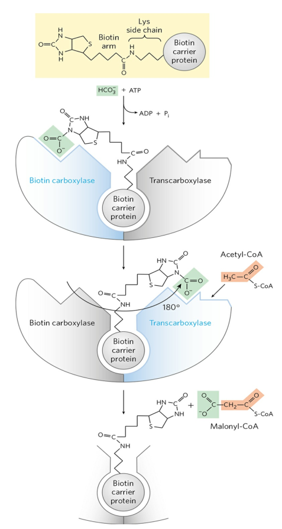 {left=70.16 top=0.00 width=29.01 height=100.00}

**The acetyl-CoA carboxylase reaction.** Acetyl-CoA carboxylase has three functional regions: biotin carrier protein (gray); biotin
carboxylase, which activates CO2 by attaching it to a nitrogen in the biotin ring in an ATP-dependent reaction; and transcarboxylase, which transfers activated CO2 (shaded green) from biotin to acetyl-CoA, producing malonyl-CoA. Part of the biotin carrier protein and the long, flexible biotin arm rotate to carry the activated CO2 from the biotin carboxylase active site to the transcarboxylase active site. The active enzyme in each step is shaded in blue.

---

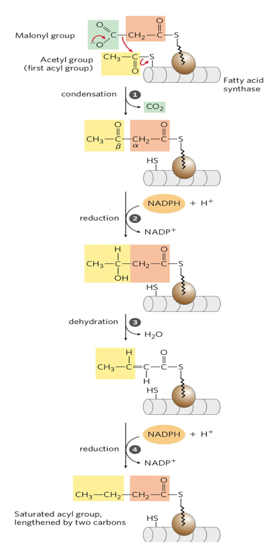 {left=72.19 top=0.00 width=27.81 height=100.00}

**Addition of two carbons to a growing fatty acyl chain**: a four-step sequence. Each malonyl group and acetyl (or longer acyl) group is activated by a thioester that links it to fatty acid synthase, a multienzyme system. 
**1** Condensation of an activated acyl group (an acetyl group from acetyl-CoA is the first acyl group) and two carbons derived from malonyl-CoA, with elimination of CO2 from the malonyl group, extends the acyl chain by two carbons. The mechanism of the first step of this
reaction is given to illustrate the role of decarboxylation in facilitating condensation. The β-keto product of the condensation is then reduced in three more steps nearly identical to the reactions of β oxidation, but in the reverse sequence: 
**2** the β-keto group is reduced to an alcohol, 
**3** elimination of H2O creates a double bond, and 
**4** the double bond is reduced to form the corresponding saturated fatty acyl group.

---

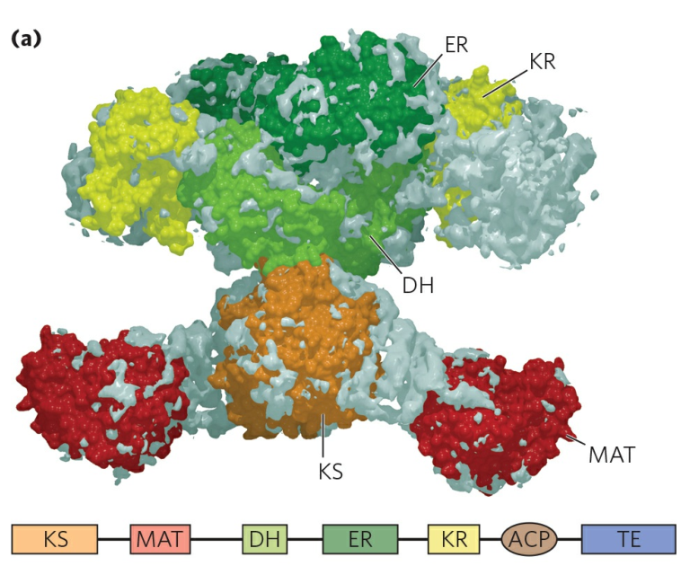 {left=50.00 top=0.00 width=50.00 height=73.88}

**(KS)** β-ketoacyl-ACP synthase
**(MAT)** malonyl/acetyl-CoA–ACP transferase
**(DH) **β-hydroxyacyl-ACP dehydratase
**(ER) **enoyl-ACP reductase 
**(KR) **β-ketoacyl-ACP reductase
**(ACP)** acyl carrier protein
**(TE)** thioesterase (releases the palmitate product from ACP)

**Mammalian fatty acid synthase type I system**
(ACP) and (TE) domains are disordered in the crystal and are therefore not shown in the structure.

---

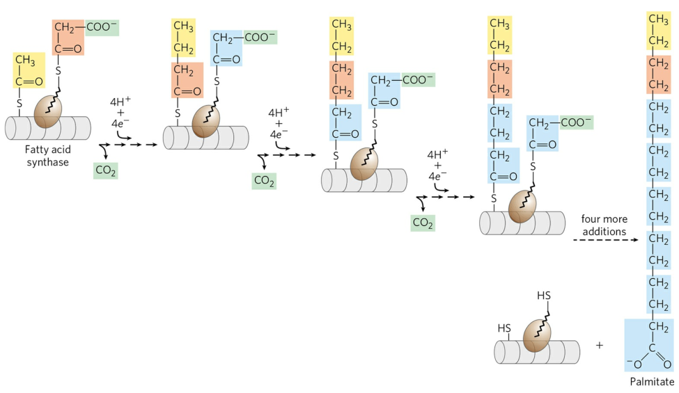 {left=24.05 top=0.00 width=75.95 height=78.24}

**The overall process of palmitate synthesis.** The fatty acyl chain grows by two-carbon units donated by activated malonate, with loss of
CO2 at each step. The initial acetyl group is shaded yellow; C-1 and C-2 of malonate, light red; and the carbon released as CO2, green. After each two-carbon addition, reductions convert the growing chain to a saturated fatty acid of four, then six, then eight carbons, and so on. The final product is palmitate (16:0)

---

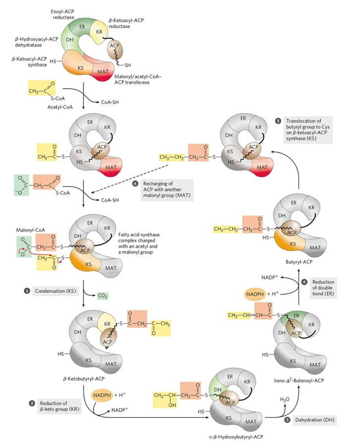 {left=56.75 top=0.00 width=43.25 height=100.00}

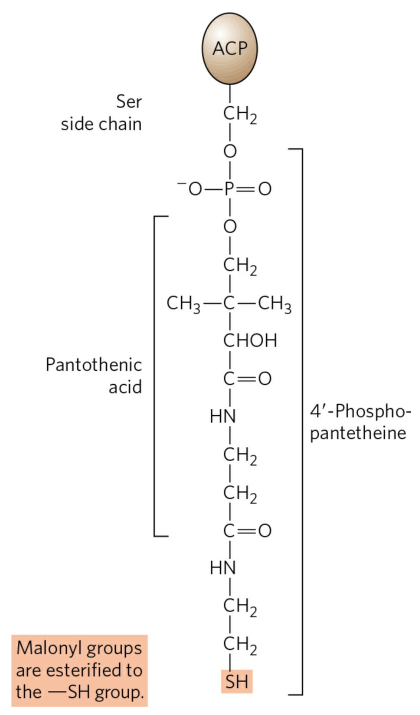 {left=38.52 top=0.00 width=17.81 height=53.91}

Phosphopantetheine contains the B vitamin pantothenic acid, also found in the coenzyme A molecule.

The use of activated malonyl groups rather than acetyl groups (add CO2 then lose it) is what makes the condensation reactions thermodynamically favorable. The methylene carbon (C-2) of the malonyl group, sandwiched between carbonyl and carboxyl carbons, forms a good nucleophile.

---

**Claisen Condensation**

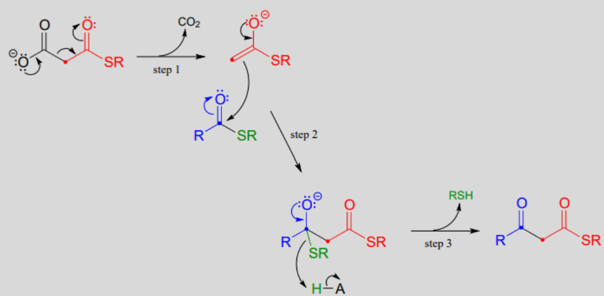 {left=46.18 top=-0.00 width=53.82 height=46.97}

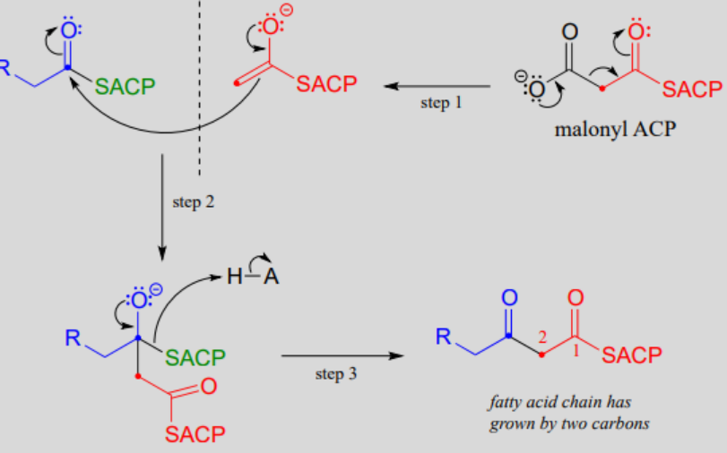 {left=16.07 top=43.52 width=50.92 height=56.48}

---

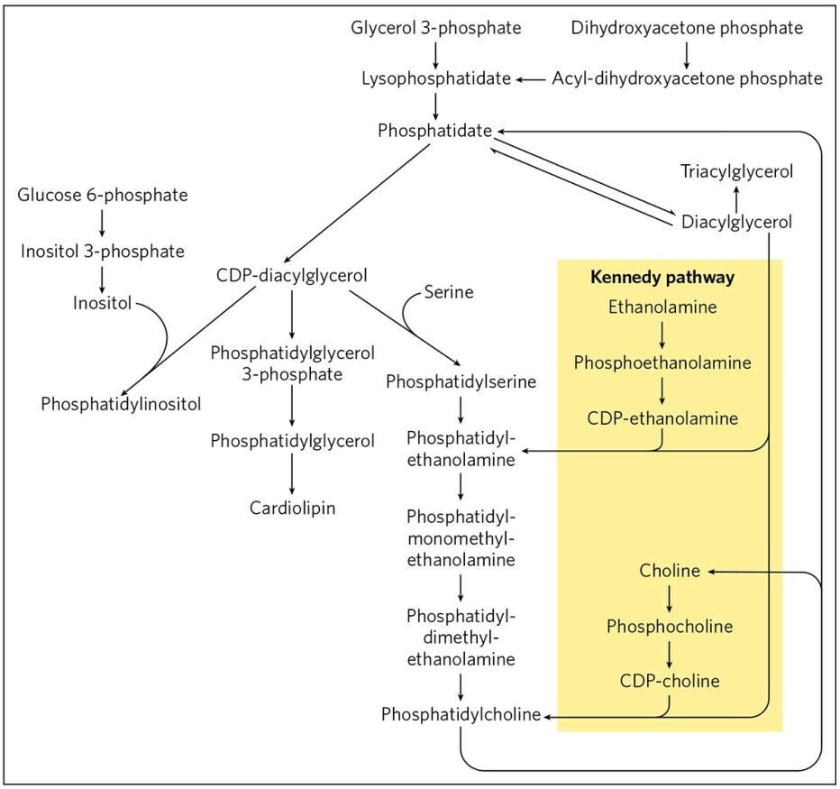 {left=43.64 top=2.96 width=56.36 height=94.07}

**Summary of the pathways for synthesis of major**
**phospholipids and triacylglycerols in a eukaryote (yeast).**

---

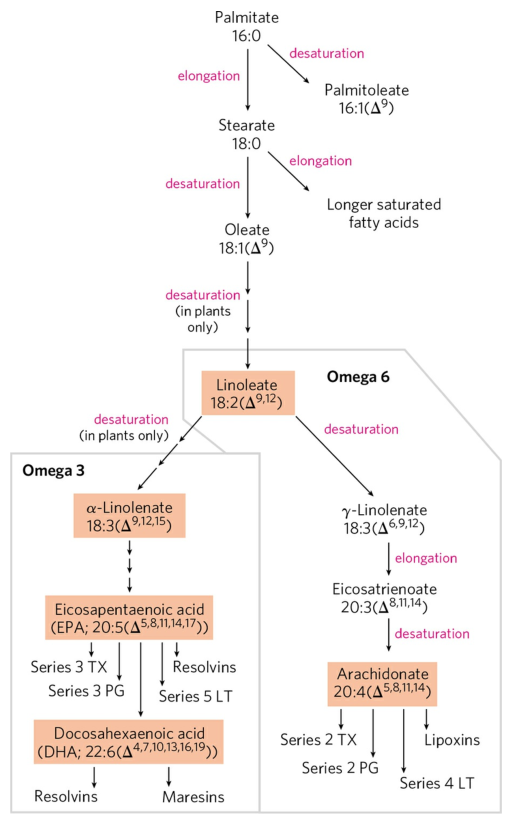 {left=65.53 top=0.00 width=34.47 height=100.00}

**Routes of synthesis of unsaturated fatty acids and their derivatives.** Palmitate is the precursor of stearate and longer-chain saturated fatty acids, as well as the monounsaturated acids palmitoleate and oleate. Mammals cannot convert oleate to linoleate or α-linolenate

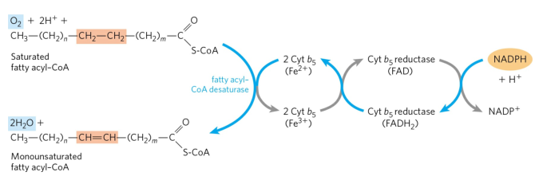 {left=17.41 top=31.65 width=48.95 height=28.49}

Electron transfer in the desaturation of fatty acids in vertebrates. Blue arrows show the path of electrons as two substrates—a fatty acyl–CoA and NADPH—undergo oxidation by molecular oxygen. These reactions take place on the lumenal face of the smooth ER. A similar pathway, but with different electron carriers, occurs in plants.

---

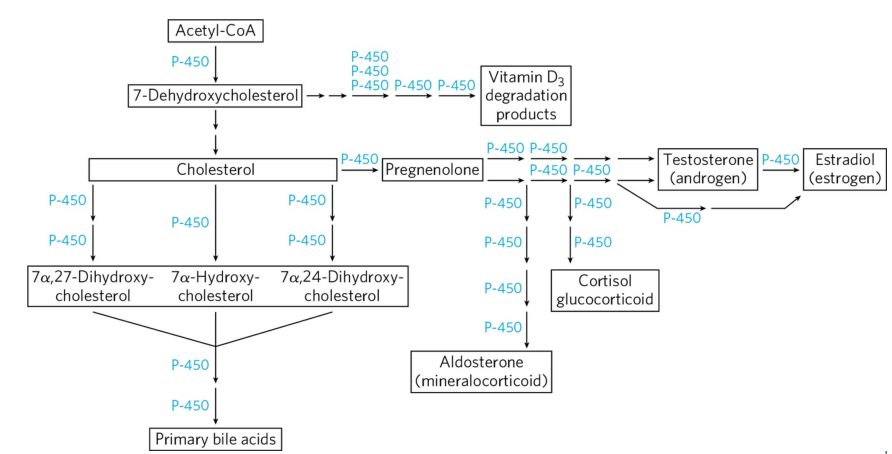 {left=18.42 top=0.00 width=81.58 height=73.82}

**Pathways of sterol biosynthesis, showing the steps requiring cytochrome P-450 enzymes.**

---

Bile Salts

Facilitating digestion of fats

---

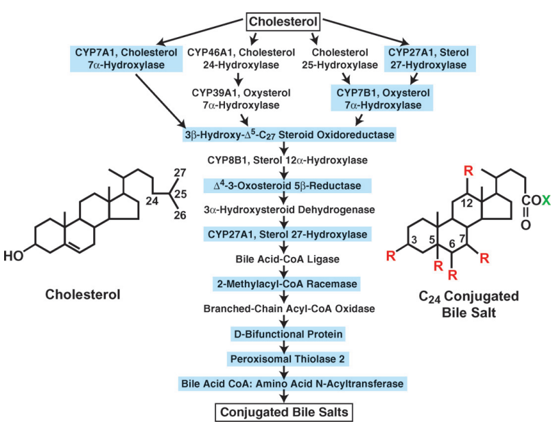 {left=23.66 top=0.00 width=73.67 height=100.00}

---

**HOMEWORK**

---

**Problem 1. ****Fatty Acids as a Source of Water**

Contrary to legend, camels do not store water in their humps, which actually consist of large fat deposits. How can these fat deposits serve as a source of water? Calculate the amount of water (in liters) that a camel can produce from 1.0 kg of fat. Assume for simplicity that the fat consists entirely of tripalmitoylglycerol.

HINT: think of it as a simple combustion with a lot of biochemistry in between, count hydrogens.

---

**Problem 2. ****Ammonia Toxicity Resulting from an Arginine-Deficient Diet.**

Cats were fasted overnight and then given a single meal complete in all amino acids **except arginine**. Within 2 hours, blood ammonia levels increased from a normal 18 µg/L to 140 µg/L, and the cats showed clinical symptoms of ammonia toxicity. A control group fed a complete amino acid mixture — or a mixture in which arginine was replaced by ornithine — showed no unusual symptoms.
**(a)** What was the role of fasting in the experiment?
**(b)** Why did ammonia levels rise in the experimental group? Why did the absence of arginine lead to ammonia toxicity? 
**(c)** Is arginine an essential amino acid in cats? Why or why not?
**(d)** Why can ornithine be substituted for arginine?

HINTS
Consider whether amino acids can be stored “for later use” in animals.
Think about cyclic metabolic pathways. If you add more substrate at the entry point, does that necessarily increase flux through the cycle? If not, what else must be present? Apply this idea to the urea (ornithine) cycle.
Think about what changes if cats are able to synthesize sufficient arginine on their own.

---

**Problem 3. Metabolism of a Straight-Chain Phenylated Fatty Acid**

A crystalline metabolite was isolated from the urine of a rabbit that had been fed a straight-chain fatty acid containing a terminal phenyl group:

A 302 mg sample of the metabolite in aqueous solution was completely neutralized by 22.2 mL of 0.100 M NaOH.
(a) What is the probable structure of the metabolite?
(b) Consider the formula, can you determine is n even or odd? Explain.

HINT: 𝝎-oxidation is **not** possible, consider **only** 𝜷-oxidation.

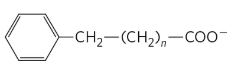 {left=32.64 top=24.81 width=40.73 height=21.30}

---

**FINALE**

---
